# Comunicador celular G16T

  

## Descripción 

G16T Es un comunicador celular y se conecta a cualquier panel de alarma que tenga un comunicador telefónico y soporta el envio de los eventos en protocolo Contacto ID en tonos DTMF.

El comunicador puede transmitir información de eventos completos al CRA.

El comunicador funciona con la aplicación Protegus. Los usuarios pueden controlar su sistema de alarma de forma remota y recibir notificaciones acerca de eventos. Protegus aplicación, funciona con todos los paneles de control de distintos fabricantes, a la que está conectado el comunicador. El comunicador puede transmitir notificaciones de eventos a la Central Receptora de Alarmas y trabajar con Protegus simultáneamente.

**Características**

Envía eventos al receptor en una CRA:

- Envía eventos a los receptores de hardware o software TRIKDIS que funcionan con cualquier software de monitoreo.

- Puede enviar información de eventos a SIA DC-09 receptores.

- Puede enviar información de eventos a SUR-GARD receptores. El anexo contiene tabla de conversión de los códigos (Contacto ID a SIA).

- Supervisión de la conexión mediante sondeo al receptor de IP cada 30 segundos (o por período definido por el usuario).

- Canal de respaldo, que se utilizará si se pierde la conexión con el canal primario.

- El informe de eventos a través de mensajes SMS. Los mensajes se entregan incluso si la conexión de datos deja de funcionar en la red del operador móvil.

- Con canales de comunicación paralelos se pueden enviar eventos a dos receptores al mismo tiempo.

- Cuando el servicio Protegus está habilitado, los eventos se envían primero a CRA, y solo luego se envían a los usuarios de la aplicación.

**Funciona con la aplicación Protegus:**

- Notificaciones de sonidos especiales y "Push" que informan sobre eventos.

- Armado/Desarmado de forma remota.

- Control remoto de dispositivos conectados (luces, portones/barreras, sistemas de ventilación, calefacción, aspersores, etc.).

- Monitorización remota de la temperatura (con los expansores iO y iO-WL).

- Diferentes derechos de usuario para administrador, instalador y usuario.

**Informes a los usuarios finales:**

- Los usuarios pueden ser informados sobre eventos no solo con aplicación Protegus, sino también con mensajes SMS y una llamada.

**Salidas y entradas controlables:**

- 1 salida, controlado a través de:

  - Protegus para móviles / web.

  - Mensaje SMS.

- 2 entradas, tipo seleccionable: NC; NO; NC / EOL; NO / EOL; NC / DEOL; NO / DEOL.

- Añada controlable entradas y salidas adicionales con expansores iO cableados e inalámbricos.

**Configuración rápida:**

- Las configuraciones pueden guardarse en un archivo y escribirse rápidamente en otros comunicadores.

- Dos niveles de acceso para configurar el dispositivo para el administrador de CRA y para el instalador.

- Configuración remota y actualizaciones de firmware.

### Tipos de modelo Communicator 

Este manual se aplica a estos modelos G16T:

- G16T_321x - Versión 3, 2G módem, 1 SIM.

- G16T_331x - Versión 3, módem 3G, 1 SIM.

- G16T_341x - Versión 3, 4G módem, 1 SIM.

- G16T_3M1x – Versión 3, 4G módem CatM1, 1 SIM.

### Especificaciones 

| Parámetro | Descripción |
|:---|:---|
| Se conecta al panel | Comunicador telefónico (TIP RING contactos) |
| Entradas | 2entradas seleccionables tipo, NC;​ NO;​ NC /​ EOL;​ NO /​ EOL;​ NC /​ DEOL;​ NO /​ DEOL /​ Expandible con expansores de la serie iO. |
| Salida | 1, tipo OC, hasta 0,15 A, 30 V max /​ Expandible con expansores de la serie iO. |
| Frecuencias de módem 2G | 850 /​ 900 /​ 1800 /​ 1900 MHz |
| Frecuencias módem 3G | 800 /​ 850 /​ 900 /​ 1900 /​ 2100 MHz |
| Frecuencias de módem 4G | Depende de la región |
| Fuente de alimentación | 10-18 V DC |
| Consumo actual | 60-100 mA (en modo espera) /​ Hasta 250 mA (durante el envío de datos) |
| Protocolos de transmisión | TRK, DC-09_2007, DC-09_2012, TL150 |
| Cifrado de mensajes | AES 128 |
| Modificación de los ajustes | Con el software de configuración TrikdisConfig de forma remota o local a través del puerto USB Mini-B /​ Remotamente con mensajes SMS |
| Entorno operativo | Temperatura de -10 ° C a +50 ° C, humedad relativa - de hasta 80% a +20 ° C |
| Dimensiones del comunicador | 92 x 62 x 26 mm |
| Peso | 80 g |

### Elementos del comunicador 

1.  Antena celular y conector SMA.

2.  Indicadores luminosos.

3.  Ranura frontal para abrir.

4.  Conexiones para cableado externo.

5.  Puerto mini-B USB para la programación del comunicador.

6.  Ranura para tarjetas SIM.

### Propósito de las terminales 

| Terminal | Descripción |
|----------|-------------|
| + DC | /​ + 18 V fuente de alimentación |
| -DC | 10 V /​ + 18 V fuente de alimentación |
| TIP | Terminal para conectar con panel de control TIP terminal |
| RING | Terminal para conectar con panel de control RING terminal |
| T-1 /​ IN1 | Terminal para el control de la línea telefónica o un terminal de entrada, el tipo seleccionable: NC;​ NO;​ NC /​ EOL;​ NO /​ EOL;​ NC /​ DEOL;​ NO /​ DEOL |
| R-1 /​ IN2 | Terminal para el control de la línea telefónica o un terminal de entrada, el tipo seleccionable: NC;​ NO;​ NC /​ EOL;​ NO /​ EOL;​ NC /​ DEOL;​ NO /​ DEOL |
| OUT | Terminal de salida (tipo OC), la corriente hasta 0,15 A |
| COM | Terminal común (negativo) |
| A 485 | Bus RS485 de contactos A |
| B 485 | Bus RS485 de contactos B |

### Indicación de la Luz LED 

#### NETWORK

| Estado de la luz | Descripción |
| --- | --- |
| Off | Sin conexión a la red celular. |
| Amarillo parpadeando | Conectándose a la red celular. |
| Verde sólido con parpadeo amarillo | El comunicador está conectado a la red celular. La intensidad suficiente de la señal celular para 2G es el nivel 5 (cinco parpadeos amarillos) y para 3G/4G es el nivel 3 (tres parpadeos amarillos). |

#### DATA

| Estado de la luz | Descripción |
| --- | --- |
| Off | No hay eventos no enviados. |
| Verde sólido | Los eventos no enviados se almacenan en el búfer. |
| Verde parpadeando | *(Modo de configuración)* los datos se transfieren hacia/desde el comunicador. |

#### POWER

| Estado de la luz | Descripción |
| --- | --- |
| Off | La fuente de alimentación está apagada o desconectada. |
| Verde sólido | La fuente de alimentación está encendida con suficiente voltaje. |
| Amarillo sólido | La tensión de alimentación es insuficiente (≤11,5 V). |
| Verde sólido y parpadeo amarillo | *(Modo de configuración)* el comunicador está listo para la configuración. |
| Amarillo sólido (modo de configuración) | *(Modo de configuración)* no hay conexión con la computadora. |

#### TROUBLE

| Estado de la luz | Descripción |
| --- | --- |
| Off | No hay problemas de operación. |
| 1 parpadeo rojo | Tarjeta SIM no encontrada. |
| 2 parpadeos rojos | Problema con el código PIN de la tarjeta SIM (código PIN incorrecto). |
| 3 parpadeos rojos | Problema de programación (no APN). |
| 4 parpadeos rojos | Problema con el registro a la red GSM. |
| 5 parpadeos rojos | Problema con el registro a la red GPRS/UMTS. |
| 6 parpadeos rojos | No hay conexión con el receptor. |
| 7 parpadeos rojos | Conexión perdida con el panel de control. |
| Parpadeo rojo | *(Modo de configuración)* fallo de memoria. |
| Rojo sólido | *(Modo de configuración)* el firmware está dañado. |

### Esquema estructural del uso del dispositivo G16T 

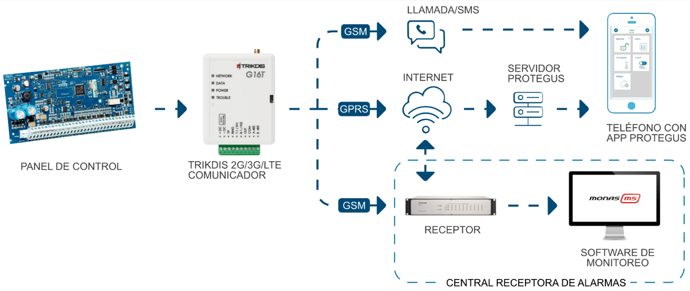

!!! note
    Antes de empezar, asegúrese de que usted tiene lo necesario:
    
    1.  Cable USB (tipo mini-B) para la configuración.
    
    2.  Cable al menos 4 hilos para conectar el comunicador al panel de
        control.
    
    3.  Desatornillador de punta plana de 2,5 mm.
    
    4.  Antena celular con buena recepción si la cobertura de la red en la
        zona es pobre.
    
    5.  Tarjeta Nano-SIM activada (Se apaga la solicitud de código PIN).
    
    6.  Manual de instalación del panel de control de seguridad, a la que se
        conecta el comunicador.
    
    Ordene los componentes necesarios por separado en su distribuidor local.
## Configuración rápida con el software TrikdisConfig 

1.  Descargue el software de configuración de TrikdisConfig en [www.trikdis.com](http://www.trikdis.com) (En el campo de búsqueda TrikdisConfig) e instálelo.

2.  Abra la carcasa del G16T con el destornillador de cabeza plana como se muestra a continuación:

1.  Utilizando el cable USB Mini-B G16T conecte al ordenador.

2.  Ejecutar TrikdisConfig. El software reconocerá automáticamente que el comunicador está conectado y se abrirá una ventana para la configuración.

3.  Haga clic en **Leer [F4]** para leer la configuración del comunicador. Si se le solicita, introduzca el código de administrador o instalador de 6 dígitos en la ventana emergente.

A continuación, se describe qué ajustes deben establecerse para que el comunicador comience a enviar eventos al Centro de Recepción de Alarmas y permita controlar el panel de control con la aplicación Protegus.

### Ajustes para la conexión con la aplicación Protegus 

**En ventana “Informes para usuario” “Servicio PROTEGUS”:**

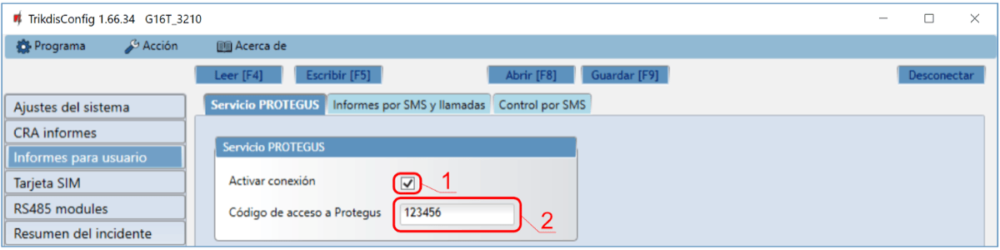

1.  Seleccione la casilla **“Activar conexión”** a la nube de PROTEGUS.

2.  Puede cambiar el **Contrase**ñ**a Protegus** para iniciar sesión en Protegus si desea que se le pida a los usuarios que ingresen al agregar el sistema a la aplicación Protegus (contraseña predeterminada - 123456).

**En la ventana “Tarjeta SIM”:**

3. Introduzca el código **PIN de la tarjeta SIM**.

2.  Cambiar el nombre **APN**. **APN** se puede encontrar en la página web del operador de la tarjeta SIM ( “Internet” es universal y funciona en muchas redes de los operadores).

Después de terminar la configuración, haga clic en el botón **Escribir [F5]** y desconecte el cable USB.

!!! note
    Para obtener más información acerca de otros ajustes en G16T
    TrikdisConfig véase el capítulo **6 Descripción de la ventana
    TrikdisConfig.**
!!! note
    No se olvide de activar comunicador telefónico del panel de control y
    configurarlo correctamente, por lo que el panel enviaría a los eventos.
    Configuración del panel de control se describe en el capítulo **4
    Programación del panel de control**.
### Ajustes para la conexión con la Central Receptora de Alarmas 

**En la ventana de “Ajustes del sistema”:**

1.  Introduzca **Número de objeto** proporcionado por la Central Receptora de Alarmas (4 caracteres, 0-9, A-F. **No utilice números de objeto FFFE, FFFF**.).

En “Ajustes CRA” configure la ventana para “Canal de comunicación principal”:

2. **Modo** - seleccionar el método de conexión **IP** (no recomendamos SMS como canal primario).

2.  **Protocolo -**seleccione el tipo de protocolo para sus mensajes de eventos: **TRK** (a receptores TRIKDIS), **DC-09_2007** o **DC-09_2012** (a receptores universales), **TL150** (a receptores SUR-GARD).

3.  **Clave de cifrado TRK** - introduzca la clave de cifrado que se establece en el receptor.

4.  **Dominio o IP -**introduzca la dirección IP o el dominio del receptor.

5.  **Puerto -**introduzca el número de puerto de red del receptor.

6.  **TCP o UDP**- elija el protocolo de transmisión (TCP o UDP), en la que se deben enviar los eventos.

!!! note
    Si desea establecer comunicación con CRA a través de mensajes SMS, sólo
    es necesario para establecer la clave de cifrado y número de teléfono.
    Los mensajes SMS pueden ser recibidas únicamente por receptores TRIKDIS:
    Receptor IP/ SMS RL14, receptor multicanal RM14 y el receptor de SMS
    GM14. / Si seleccionó el protocolo DC-09, además, en la pestaña
    **Configuración de la ventana de Informes CRA** ingrese los números de
    objeto, línea y receptor.
1.  (Recomendado) Configure los parámetros de canal de **Respaldo del canal Principal.**

2.  (Recomendado) Introduzca el número de informes **Informe por SMS de reserva.**

**En la ventana “Tarjeta SIM”:**

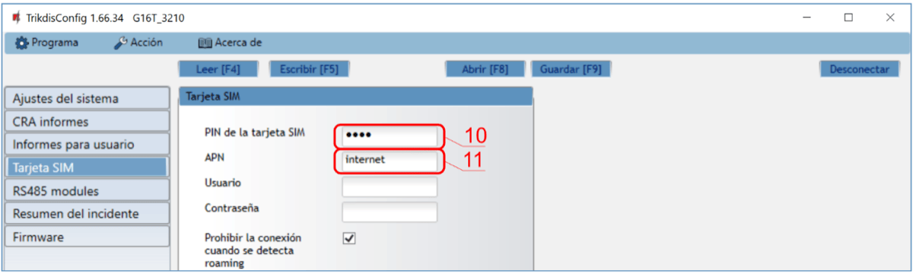

10. Introduzca el código **PIN de la tarjeta SIM.**

11. Cambie el nombre **APN. APN** se puede encontrar en la página web del operador de la tarjeta SIM (“Internet” es universal y funciona en muchas redes de los operadores).

Después de terminar la configuración, haga clic en **Escribir [F5**] y desconecte el cable USB.

!!! note
    Para obtener más información acerca de otros ajustes en ***G16T
    TrikdisConfig*** véase el capítulo **6 Descripción de la ventana
    TrikdisConfig.**
!!! note
    No se olvide de activar comunicador telefónico del panel de control y
    configurarlo correctamente, por lo que el panel enviaría a los eventos.
    Configuración del panel de control se describe en el capítulo **4
    "Programación del panel de control"**.
## Proceso de Instalación 

1.  Retire la cubierta superior y extraiga la terminal de contacto.

2.  Retire la placa PCB.

3.  Fije la parte inferior para el lugar adecuado para poner los tornillos.

4.  Coloque la placa PCB de nuevo en la caja, inserte terminal de contacto.

5.  Atornille la antena celular.

6.  Inserte la tarjeta nano-SIM.

7.  Cierre la cubierta superior.

!!! note
    Asegúrese de que la tarjeta SIM esté activada. / Asegúrese de que el
    servicio de Internet móvil (datos móviles) esté habilitado si se
    utilizará la aplicación Protegus o la conexión IP con CRA. / Para
    evitar introducir el código PIN en TrikdisConfig, inserte la
    tarjeta SIM en el teléfono móvil y desactive la función de solicitud de
    PIN.
### Cableado del comunicador al panel de control de seguridad 

Siguiendo uno de los esquemas proporcionados a continuación, conecte el comunicador hacia el panel de control.

### Esquemas para conectar a la zona del interruptor de llave del panel 

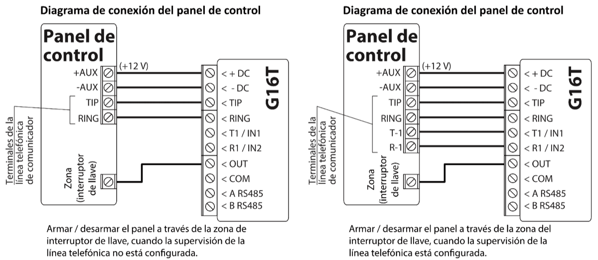

Siga estos esquemas si el panel de control se armará/desarmará con la salida PGM del G16T activando/desactivando la zona de interruptor de llave del panel.

!!! note
    El comunicador G16T tiene una salida programable OUT, que puede
    controlar una partición del sistema de alarma. En la ventana
    TrikdisConfig "**Ajustes del sistema**" modo de salida OUT1 debe
    configurarse en **Control remoto** (configuración predeterminada).
### Diagramas esquemáticos para las entradas de cableado 

El comunicador tiene dos terminales de entrada (IN1, IN2) para la conexión de circuitos de NO, NC, NO / EOL, C / EOL, NO / DEOL, NC / DEOL. La configuración por defecto de entrada - NO. Otro tipo de entrada se puede ajustar en la ventana de **Ajustes del sistema TrikdisConfig -> Tipo de entrada IN.**

Conecte la entrada de acuerdo con el tipo de entrada seleccionada (NO, NC, NO / EOL, C / EOL, NO / DEOL, NC / DEOL), como se muestra en los esquemas a continuación:

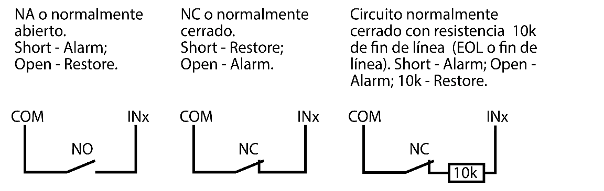

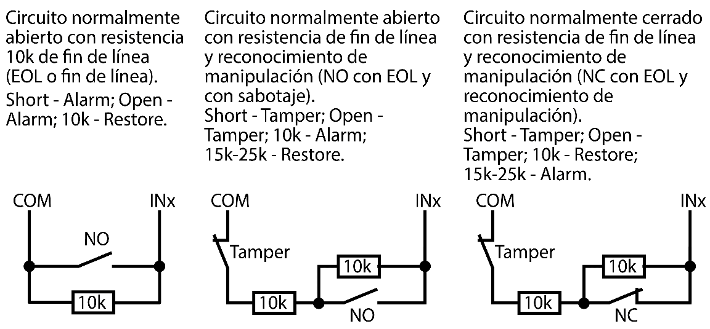

!!! note
    Si es necesario conectar más entradas o salidas al comunicador, o si
    desea conectar un sensor de temperatura, conecte el expansor de salida
    inalámbrico o por cable de la serie TRIKDIS iO.
### Esquemas de cableado de un relé 

Con los contactos de relé se puede controlar (encender/ apagar) diversos aparatos electrónicos.

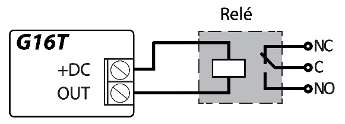

### Esquemas para la conexión de módulos de expansión de la serie de iO 

Si es necesario conectar más entradas o salidas al comunicador, o si desea conectar un sensor de temperatura, conecte el expansor de salida inalámbrico o por cable de la serie TRIKDIS iO.

### Esquema para conectar el módulo WiFi W485 

El módulo *W485* envía mensajes al CRA (Centro de Recepción de Alarmas) y a Protegus utilizando un enrutador de Internet WiFi. Cuando la conectividad WiFi está disponible, el *G16T* envía mensajes de evento a través del módulo *W485*. Cuando se interrumpe la conectividad WiFi, el *G16T* envía mensajes a través de GPRS. Cuando se restablece la conectividad WiFi, el *G16T* vuelve a enviar mensajes a través de *W485*. / La configuración *W485* (credenciales de red Wi-Fi) se establece en la configuración *G16T* en la ventana TrikdisConfig ”RS485 modules” del capítulo 6.6. / Inserte la tarjeta SIM en el comunicador *G16T* para que funcione el *W485*.

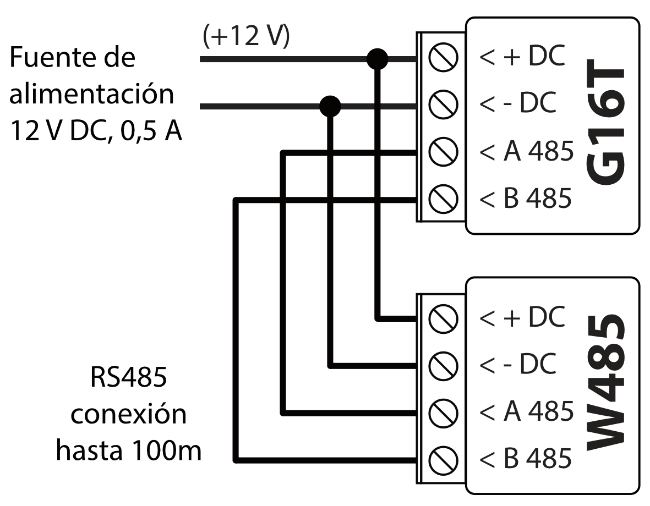

### Esquema para conectar el módulo ethernet E485 

El módulo *E485* envía mensajes al CRA y a *Protegus* por medio de una conexión a internet por cable. Usando el *E485* con *G16T*, los mensajes de CRA y *Protegus* se envían a través de internet por cable y no se usa internet móvil. Si se interrumpe una conectividad a internet por cable, el *G16T* envía mensajes a través de Internet móvil. Cuando se restablece la conectividad a Internet por cable, el *G16T* comienza a enviar mensajes a través de *E485*. / La configuración del módulo *E485* para funcionar con el *G16T* se describe en la Ventana del capítulo 6.6. „RS485 modules”. / Inserte la tarjeta SIM en el comunicador *G16T* para que funcione el *E485*.

### Encienda el comunicador 

Para iniciar el comunicador, encienda la fuente de alimentación del panel de control. Este indicador LED en el comunicador G16T debe mostrar:

- “POWER” este LED se ilumina de color verde cuando la alimentación está activada;

- “NETWORK” este LED se ilumina en verde y amarillo parpadeante cuando el comunicador está registrado en la red.

!!! note
    Fuerza suficiente de señal celular es nivel cinco (cinco indicadores de
    "NETWORK" parpadean en color amarillo). Resistencia suficiente de la
    señal 3G/ 4G es nivel tres (tres indicadores de "NETWORK" parpadean en
    color amarillo). / Si usted cuenta una cantidad menor de Leds de
    "NETWORK" parpadeando, la intensidad de la señal es insuficiente.
    Recomendamos seleccionar un lugar diferente para instalar el
    comunicador, o usar una antena celular más sensible. Si ve una
    indicación LED diferente, esto indica un cierto mal funcionamiento.
    Diagnostíquela con la tabla LED de indicaciones en el capítulo **1.5
    "Indicación de la Luz LED".** / Si la indicación G16T no se
    enciende en absoluto, compruebe la alimentación y las conexiones.
## Programación del panel de control 

Para que el panel de control envíe eventos a través del comunicador telefónico, debe estar encendido y configurado correctamente. Siguiendo el manual de programación del panel, configure el comunicador telefónico del panel de control:

1.  Active el comunicador telefónico del panel PSTN.

2.  Introduzca el número de teléfono receptor de la estación de monitoreo (se puede utilizar cualquier número de más de 2 dígitos. La G16T recogerá y responderá cuando la central llama a cualquier número de teléfono).

3.  Elegir el modo DTMF.

4.  Seleccione el protocolo de comunicación Contact ID.

5.  Introduzca el número de cuenta de 4 dígitos del panel.

Establezca la zona de panel de control, al que está conectada la salida OUT G16T, para utilizarse con el interruptor de llave de zona para activar/ desactivar el panel de control de forma remota.

!!! note
    La llave de zona puede ser momentánea (pulso) o nivel. Por defecto, la
    salida controlable del G16T se establece en modo de pulso por 3
    segundos. Se puede cambiar la duración del impulso o cambiar al modo de
    configuración de nivel en Protegus. véase el capítulo **5.2
    "Ajustes adicionales para habilitar/deshabilitar el sistema de alarma
    usando la llave de zona del panel de control"**.
### Programación de comunicador telefónico de Honeywell Vista 

Usando el teclado del panel de control ingrese a estas secciones y configúrelas como se describe:

- \*41 - introduzca el número de teléfono de receptor de la CRA;

- \*43 - introduzca el número de cuenta del panel de control;

- \*47 - establezca el tono de marcación a [1] e introduzca el número de intentos de llamada;

- \*48 – utilice la configuración predeterminada, \*48 debe ajustarse a 7;

- \*49 - Spit/ doble mensaje. \*49 debe ajustarse a 5;

- \*50 – el retardo para el envío de eventos de alarma de robo (opcional). El valor por defecto es [2,0]. Con ella la transmisión de mensajes de evento se retrasa durante 30 segundos. Si desea que el mensaje se envíe de inmediato, ajuste [0,0].

### Ajustes especiales para panel de Honeywell Vista 48 

Si desea utilizar el comunicador G16T con el panel Honeywell Vista 48, configure las siguientes secciones como se describe:

| Sección | Datos                         | Sección | Datos | Sección | Datos |
|:-------:|-------------------------------|:-------:|:-----:|:-------:|:-----:|
|  \* 41  | 111 (# telefónico receptor)   |  \* 60  |   1   |  \* 69  |   1   |
|  \* 42  | 1111                          |  \* 61  |   1   |  \* 70  |   1   |
|  \* 43  | 1234 (número de cuenta panel) |  \* 62  |   1   |  \* 71  |   1   |
|  \* 44  | 1234                          |  \* 63  |   1   |  \* 72  |   1   |
|  \* 45  | 1111                          |  \* 64  |   1   |  \* 73  |   1   |
|  \* 47  | 1                             |  \*65   |   1   |  \* 74  |   1   |
|  \* 48  | 7                             |  \* 66  |   1   |  \* 75  |   1   |
|  \* 50  | 1                             |  \* 67  |   1   |  \* 76  |   1   |
|  \* 59  | 0                             |  \* 68  |   1   |         |       |

Cuando todos los ajustes necesarios están configurados, es necesario salir del modo de programación. Ingrese \*99 en el teclado.

## Control remoto 

### Añadiendo el sistema de seguridad a la aplicación Protegus 

Con Protegus los usuarios serán capaces de controlar su sistema de alarma de forma remota. Ellos verán el estado del sistema y recibirán notificaciones acerca de los eventos del sistema.

1.  Descargue e inicie la aplicación Protegus o utiliza la versión del navegador: [www.protegus.app](https://www.protegus.app)<u>.</u>

    

      
      
      
    

2.  Inicie sesión con su nombre de usuario y contraseña o regístrese para crear una cuenta nueva.

!!! note
    Al agregar G16T al Protegus, compruebe si:
    
    1.  La tarjeta SIM insertada está activada y el código PIN se introduce
        o se inhabilita;
    
    2.  La Nube Protegus está habilitada. Véase el capítulo **6.4 en
        la ventana "Informes para usuario"**;
    
    3.  La fuente de alimentación está conectada ( el LED de "POWER" se
        ilumina en verde);
    
    4.  Registrado en la red ( el LED de "NETWORK" se ilumina en verde y
        parpadea amarillo).
3. Haga clic en **Añadir sistema** e introduzca el número “IMEI/ID Único ” de G16T. Este número se encuentra en el dispositivo y la etiqueta de la caja. Después de introducir, presione el botón **Siguiente.**

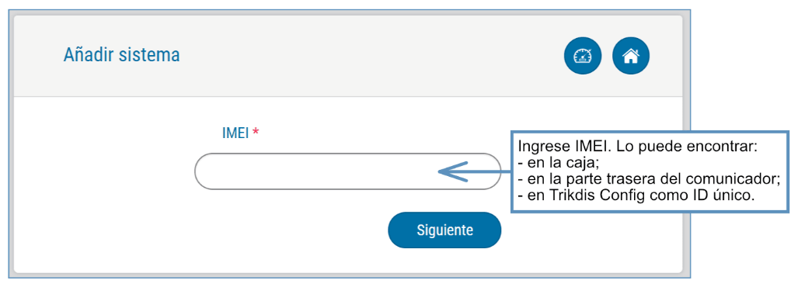

4. En la nueva ventana, haga clic en **Áreas** en el menú lateral. En la siguiente ventana, especifique cuántas áreas del sistema de alarma hay en el sistema y presione **Siguiente.**

5. En la nueva ventana, identifique cuál es el número para cada una de las áreas especificadas en el sistema de seguridad y pulse **Guardar.**

### Ajustes adicionales para habilitar/deshabilitar el sistema de alarma usando la llave de zona del panel de control 

!!! note
    La zona del panel de control, a la que está conectada la salida
    G16T OUT, debe configurarse en el modo de interruptor de llave.
Siga las instrucciones a continuación si el panel de control se controlará con la salida G16T, activación/desactivación de la zona de interruptor de llave de panel de control.

1.  En el menú lateral, presione en la ventana **Configuración**, en la ventana que se abrió recientemente también presione **Configuración**. Seleccione la casilla **de armar/ desarmar con PGM** y especifique el área donde se controlará la salida. Uno de cada salida se puede controlar una sola área.

2. Seleccione **Nivel** o **Pulso,** dependiendo del tipo de llave de zona del panel de control. También puede cambiar la duración del intervalo de impulso si es necesario para el panel de control conectado.

2.  Para mayor seguridad, puede seleccionar una contraseña de uso de aplicaciones para **ARMADO/DESARMADO**. A continuación, después de pulsar el botón para activar/desactivar el sistema de alarma, la ventana para introducir la contraseña de la aplicación se abrirá.

### Armar/desarmar el sistema de alarma con Protegus 

1.  Para armar/desarmar el sistema de alarma, vaya a **Áreas** de la ventana Protegus.

2.  En la ventana de **Áreas**, presione el botón de **Área**. En la ventana abierta, seleccione la acción (para armar o desarmar el sistema de alarma).

3.  Si se le pide, introduzca el código de usuario o contraseña Protegus.

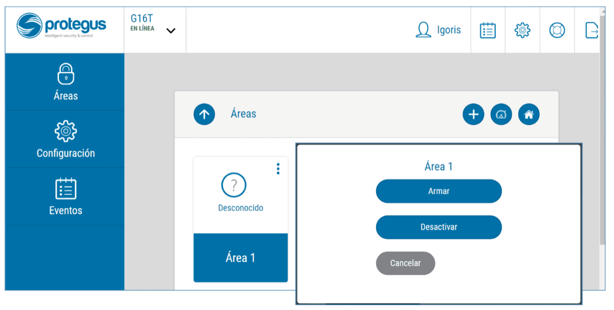

### Configuración y control con los mensajes SMS 

Puede configurar remotamente y controlar el comunicador con mensajes SMS.

La estructura del mensaje es: *Password* `[space]` *Command* `[space]` *Data*.

Use el **Código de Administrador** para obtener información *INFO, RESET, OUTPUT1, CONNECT*, y el **Código de Instalador** para obtener información *INFO, RESET, OUTPUT1.*

#### Lista de comandos SMS

| Mando | Datos | Descripción |
|-------|-------|-------------|
| INFO |  | Solicite información sobre el dispositivo. La respuesta será: tipo de comunicador, el número IMEI, número de serie y la versión del firmware. Ej.: 123456 INFO |
| RESET |  | Reinicie el dispositivo. Ej.: 123456 RESET |
| OUTPUT1 | ON | Encienda la SALIDA 1. Ej.:: 123456 OUTPUT1 ON |
| OUTPUT1 | OFF | Apague la SALIDA 1. Ej.: 123456 OUTPUT1 OFF |
| OUTPUT1 | PULSE=tttt | Encienda la salida en el modo de pulso, para el intervalo de tiempo especificado (s). / “tttt” es el tiempo de duración de impulso en segundos, que se describe en cuatro dígitos. Ej.: 123456 OUTPUT1 PULSE=0002 |
| CONNECT | Protegus=ON | Habilitar el acceso al servicio Protegus. Ej.: 123456 CONNECT PROTEGUS=ON |
| CONNECT | Protegus=OFF | Deshabilitar el acceso al servicio Protegus. Ej.: 123456 CONNECT PROTEGUS=OFF |
| CONNECT | IP=0.0.0.0:8000 | Establecer la dirección IP del canal primario y el número de puerto. / Ej.: 123456 CONNECT IP=192.120.120.255:8000 |
| CONNECT | ENC=123456 | Establecer clave de cifrado TRK. Ej.: 123456 CONNECT ENC=123456 |
| CONNECT | APN=Internet | Establecer nombre APN. Ej.: 123456 CONNECT APN=INTERNET |
| CONNECT | USER=user | Establecer usuario APN. Ej.:: 123456 CONNECT USER=User |
| CONNECT | PASS=password | Establecer una contraseña de APN. Ej.: 123456 CONNECT PASS=Password |
| CONNECT | CP= | Desactiva la interfaz de línea fija (1 - Activo; 2 - Inactivo). / Ej.: 123456 CONNECT CP=2 |

Puede restringir los números de teléfono desde los cuales el comunicador aceptará los comandos. Consulte el capítulo **6.4 ventana “Informes para usuarios”**, pestaña "**Control por SMS**".

## Descripción de la ventana TrikdisConfig 

### Estado de la barra TrikdisConfig 

Después de conectar G16T y haciendo clic en **Leer [F4]**, TrikdisConfig proporcionará información sobre el dispositivo conectado en la barra de estado:

| Objeto | Descripción |
|----|----|
| IMEI/​Identificador único | Número IMEI del dispositivo |
| Estado | Condición de uso |
| Dispositivo | tipo de dispositivo (G16T debe ser mostrada) |
| SN | Número de serie del dispositivo |
| BL | versión del navegador |
| FW | versión del firmware del dispositivo |
| HW | versión de hardware del dispositivo |
| Estado | La conexión con el tipo de programa (a través de USB o remoto) |
| Administrador | Nivel de acceso (que se muestra después de código de acceso es aprobado) |

Después de pulsar **Leér [F4]**, el programa leerá y mostrará los ajustes, que se establecen en G16T. Establecerá los ajustes necesarios de acuerdo con las descripciones de las ventanas del TrikdisConfig las cuales se dan a continuación.

### Ventana de “Ajustes del sistema” 

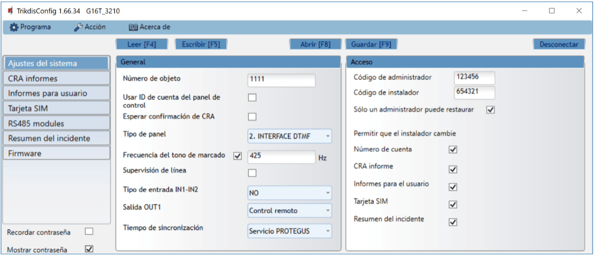

**Grupo de “General”**

- **Número de objeto** - si van a enviar los eventos al CRA (Central Receptora de Alarmas), introduzca el número de cuenta proporcionado por el CRA (4 caracteres número hexadecimales, 0-9, A-F. **No utilice números de objeto FFFE, FFFF**.).

- **Usar ID de cuenta del panel de control** - Si se selecciona la casilla, el comunicador enviará con eventos no con el valor establecido en el campo ID de objeto, pero la ID de cuenta ingresada en el panel.

- **Esperar confirmación de CRA** - Si se selecciona la casilla, después de enviar cada evento, el comunicador esperará el recibo del receptor de IP, que ha recibido correctamente el mensaje de evento. Si el comunicador no recibe la señal de recibo, no formará la señal de finalización de la comunicación (kiss-off). Después de no recibir el mensaje de Kiss-off, el comunicador telefónico del panel de control transmitirá repetidamente el mensaje del evento.

- **Tipo de panel** - activar/desactivar la interfaz de línea fija DTMF en el comunicador.

- **Frecuencia de tono de marcado** - Frecuencia en la que el G16T comunica con el comunicador telefónico de panel de control.

- **Supervisión de línea**- si se selecciona esta casilla, se supervisará la conexión de línea fija entre el panel de control y comunicador. Para la supervisión de trabajo, el comunicador telefónico del panel de control tiene que estar conectado con el G16T con 4 hilos (véase el capítulo **3.1 “Cableado del comunicador al panel de control de seguridad”**).

- **Tipo de entrada IN1-IN2** - seleccionar el tipo de entrada de la lista (NO, NC, NO / EOL, C / EOL, NO / DEOL, NC / DEOL).

- **Salida OUT1** - seleccione el modo de operación de salida de la lista.

- **Tiempo de sincronización** - seleccionar qué servidor utilizara para la sincronización de tiempo.

**Grupo de ajustes de “Acceso”**

- **Código de administrador** - le permite acceder a todos los campos de configuración (código predeterminado - 123456).

- **Código de instalador**- permite cambiar sólo los campos que están autorizados por el administrador (código predeterminado - 654321).

- **Sólo un administrador puede restaurar** - Si se selecciona esta casilla, los ajustes de fábrica se pueden restaurar solamente introduciendo el código de administrador.

- **Permitir que el instalador cambie**- El administrador puede especificar qué configuraciones de instalación puede cambiar.

### Ventana de presentación de „CRA informes” 

**Pestaña “CRA ajustes”**

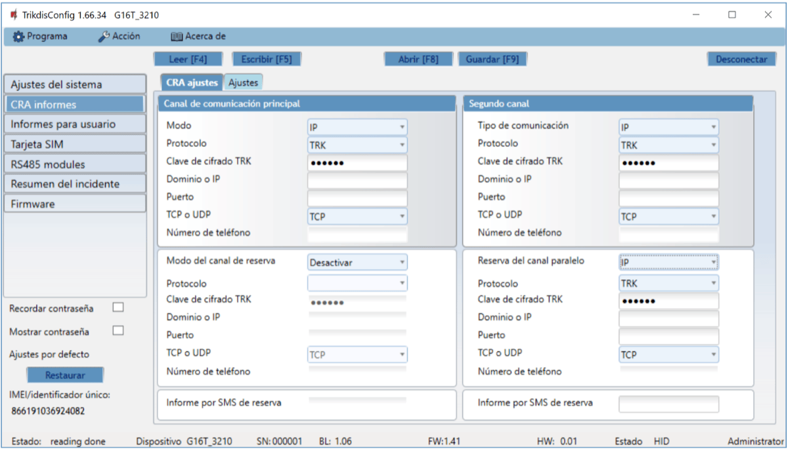

El comunicador envía eventos a la CRA a través de Internet celular (IP) o con mensajes SMS.

Los eventos pueden ser enviados a través de varios canales de comunicación. Los canales de comunicación primarios y paralelos pueden funcionar simultáneamente, de esta manera el comunicador puede enviar eventos a dos receptores al mismo tiempo. El canal de copia de seguridad se puede asignar para ambos; canales primarios y paralelos, que se utilizarán cuando se interrumpe la conexión a través del canal primario o en paralelo.

La comunicación se codifica y se protege por contraseña. Se requiere un receptor TRIKDIS para recibir y enviar información de eventos para el software de monitorización:

- Para la conexión a través de IP - receptor de software IPcom Windows/Linux, hardware receptor IP/SMS RL14 o receptor multicanal RM14.

- Para recibir mensajes SMS - hardware receptor IP/SMS RL14, receptor multicanal RM14 o receptor de SMS GM14.

La comunicación SMS es particularmente útil como canal de reserva, ya que funciona incluso cuando no hay conexión a Internet móvil. No recomendamos el SMS como canal primario.

**Grupo de ajustes “Canal de comunicación principal”**

- **Modo** - seleccione el método de conexión que será utilizado con el receptor de la CRA (IP o SMS).

- **Protocolo**- seleccione en qué codificación los eventos deben ser enviados: **TRK** (a receptores Trikdis), **SIA DC-09** (a receptores, que reciben eventos codificados en formato SIA DC-09), **TL150** (a receptores SUR-GARD).

- **Clave de cifrado TRK**- clave de cifrado de mensaje de 6 dígitos. La clave escrita en el comunicador debe coincidir con la clave establecida en el receptor, lo que significa que ambas claves deben ser iguales.

- **Dominio o IP** - ingrese el dominio o dirección IP del receptor.

- **Puerto**- introduzca el número de puerto de red del receptor.
- **TCP o UDP** – seleccione en qué protocolo (TCP o UDP) deben ser enviados los eventos.
- **Número de teléfono** (sólo para mensajes SMS) - introduzca el número de teléfono del receptor TRIKDIS SMS. El número de teléfono debe ser con código de país (por ejemplo, 370xxxxxxxx).

**Grupo de ajustes “Canal principal de reserva”**

Activar el modo de canal de reserva para enviar eventos a través del canal de copia de seguridad si se pierde la conexión a través del canal primario. La Configuración del canal de copia de seguridad es el mismo a como se describió anteriormente.

**Grupo de ajustes “Segundo canal”**

A través de este canal se transmiten eventos en paralelo con el canal primario. Cuando se habilita el segundo canal, los eventos pueden ser enviados simultáneamente a dos receptores (por ejemplo, estaciones de monitoreo locales y centralizadas). Los ajustes de canales paralelos son los mismos de cómo se describió anteriormente.

**El número de canal de SMS de respaldo**

Los mensajes SMS de respaldo se envían cuando los eventos no se pueden transmitir a través del primero, segundo y canales de respaldo. Es especialmente útil porque funciona incluso cuando no hay conexión IP en la red del operador móvil.

Este canal se activa sólo cuando el modo de IP se establece en el canal primario y su canal de reserva.

Las notificaciones por SMS serán enviadas a receptor SMS en una CRA: 1) inmediatamente después de la primera vez cuando el comunicador se pone en funcionamiento; y 2) si el protocolo TCP/IP o UDP/IP se interrumpe en el primer canal y su canal de reserva.

- **Informe por SMS de reserva** – introduzca el número de teléfono para el receptor TRIKDIS SMS. El número de teléfono debe comenzar con el código de país (por ejemplo, 370xxxxxxxx).

**Pestaña “Ajustes”**

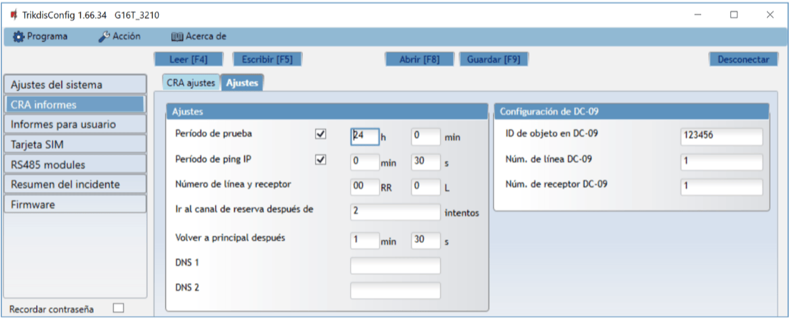

**Grupo de ajustes de “Ajustes”**

- **Período de prueba** - periodo de Prueba (TEST) para probar la conexión. Los eventos de Test se envían como mensajes de identificador de contacto y se remitirán al software de monitoreo.

- **Periodo de ping IP** - período para el envío de los latidos (heartbeats) internos PING. Estos mensajes sólo se envían a través del canal IP. El receptor no reenvía mensajes Ping para el software de monitoreo para evitar sobrecargarlo. Las notificaciones sólo se enviarán al software de monitoreo si el receptor no recibe mensajes de PING desde el dispositivo dentro del tiempo establecido.

De manera predeterminada, el receptor enviará una notificación de "Conexión perdida" al software de monitoreo si el mensaje PING no se recibe durante el período de tiempo tres veces más de lo establecido en el comunicador. Ej.: Si el PING se establece en 3 minutos, el receptor enviará la notificación de "Conexión perdida" si el mensaje PING no se recibe en 9 minutos.

Los latidos (heartbeats) de PING mantienen la sesión de comunicación activa entre el dispositivo y el receptor. La sesión activa es necesaria para poder configurar y controlar de forma remota el comunicador. Es recomendable configurar el periodo PING por no más de 5 minutos.

- **Ir al canal de reserva después de -** indica el número de intentos fallidos para enviar el mensaje a través del canal principal. Si el dispositivo no consigue transmitir el número de veces especificado, se conectará a transmitir los mensajes a través del canal de copia de seguridad.

- **Volver a principal después** - tiempo tras el cual el dispositivo G16T intentará volver a conectarse y transmitir mensajes a través del canal primario.

- **DNS1, DNS2 -** (Sistema de nombre de dominio) es el servidor que especifica la dirección IP del dominio. Se utiliza cuando el dominio se establece en el campo de **Dominio o IP** del canal de comunicación (no en la dirección IP). El Servidor Google DNS está configurado por defecto.

**Grupo de ajustes de parámetros “Configuraci**ó**n de DC-09”**

Los parámetros se muestran cuando el protocolo **DC-09_2007** o **DC-09_2012** se establece en el campo del protocolo de canal de comunicación para el envío de eventos.

- **ID de objeto en DC-09** - introduzca el número del objeto. <u>El número del objeto introducido en este campo será usado si se selecciona DC-09 de codificación</u>. Un número hexadecimal de 3 a 16 caracteres se puede introducir. Este número es proporcionado por la CRA.

- **Núm. de l**í**nea DC-09** - introduzca el número de línea del receptor.

- **Núm. de receptor DC-09** - introduzca el número del receptor.

### Ventana “Informes para usuario” 

**Pestaña “Servicio PROTEGUS”**

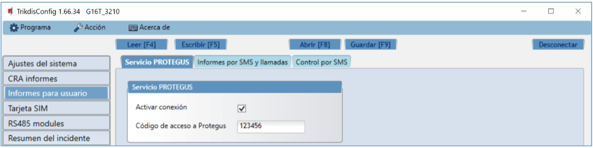

El servicio Protegus permite a los usuarios monitorear y controlar de forma remota el comunicador. Para obtener más información sobre el servicio Protegus, visita [www.protegus.app](https://www.protegus.app).

**Grupo de ajustes “Servicio Protegus”**

- **Activar conexión** – habilite el servicio Protegus, G16T será capaz de intercambiar datos con la aplicación Protegus para ser configurado de forma remota a través de TrikdisConfig.

- **Código de acceso a PROTEGUS –**el código de 6 dígitos para la conexión a la aplicación Protegus (por defecto - 123456).

**Pestaña “Informes por SMS y llamadas”**

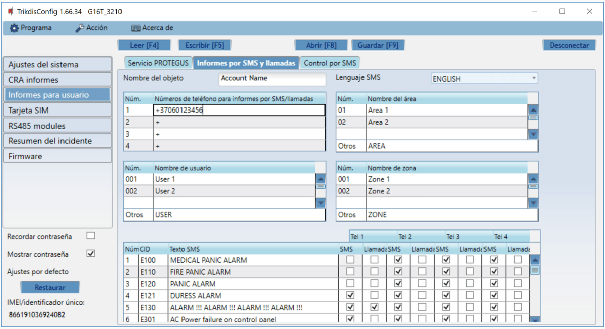

Puede configurar para que los clientes estén informados de los eventos con mensajes SMS o una llamada.

- **Nombre del objeto**- de nombre a sistema, al que está conectado el comunicador. Cada mensaje SMS será enviado con el nombre del objeto.

- **Lenguaje SMS** – elija el idioma de los mensajes SMS (Los mensajes SMS se pueden enviar con varios personajes).

- **Números de teléfono para informes por SMS / llamadas** - Puede introducir hasta 4 números de teléfono de los usuarios, que recibirán mensajes de eventos SMS o llamadas. Los números de teléfono deben comenzar con el código de país, por ejemplo + 370xxxxxxxx, 00370xxxxxxxx o 370xxxxxxxx.

- **Nombre del área, Nombre de usuario, Nombre de zona** - cada usuario, una zona o área pueden tener un nombre que se utiliza en los mensajes SMS de eventos. Introduzca el usuario, la zona o el número de región de la tabla correspondiente e introduzca el nombre junto al número.

- **Tabla de eventos CID** - puede cambiar a qué números de teléfono se enviarán mensajes SMS o se realizarán llamadas sobre cada uno de los eventos enumerados.

Puede cambiar los textos de los mensajes SMS de eventos predeterminados, cambiar códigos Contact ID (CID) e introducir nuevos eventos con las descripciones.

**Pestaña “Control por SMS”**

Puede enviar un comando SMS al comunicador que controlará la salida o cambiará la configuración. Encuentre los comandos de control en el capítulo **5.4 Configuración y control con los mensajes SMS.**

- **Textos de respuesta SMS** - Texto SMS que el usuario recibe después de enviar un comando SMS. El texto SMS puede ser editado.

- **Números de teléfono para el control remoto -**puede introducir números de teléfono, de la cual el comunicador aceptará los comandos.

!!! note
    Si no se introduce ningún número de teléfono, el dispositivo aceptará
    comandos desde cualquier número de teléfono. En cualquier caso, la
    seguridad está garantizada por el requisito de ingresar la contraseña
    del administrador o instalador en el comando SMS.
### Ventana “Tarjeta SIM” 

!!! note
    1\. Asegúrese de que la tarjeta SIM esté activada y funcionando, antes
    de usarla. / 2. Si va a utilizar la conexión a Internet móvil para
    enviar eventos a través del canal IP al receptor de la CRA o para
    Protegus, garantice que el servicio de datos móviles está
    habilitada.
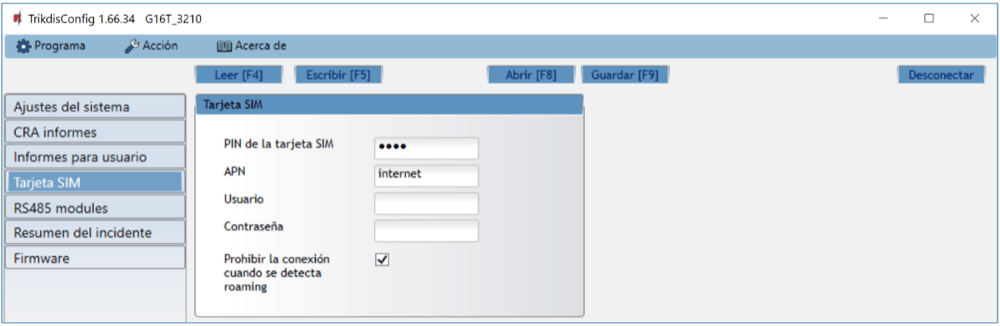

**Grupo de ajustes “Tarjeta SIM”**

- **PIN de la tarjeta SIM** - introduzca el código PIN de la tarjeta SIM. Este código se puede desactivar mediante la inserción de la tarjeta SIM en el teléfono móvil y la desactivación de la petición. Si ha desactivado la petición del PIN de la tarjeta SIM, deje el valor predeterminado en este campo.

- **APN** - introducir APN (Access Point Name). Es necesario para conectar el comunicador a internet. APN se puede encontrar en la página web del operador de la tarjeta SIM (“Internet” es universal y funciona en las redes de muchos operadores).

- **Usuario** - contraseña: ingrese el nombre de usuario y la contraseña para APN si es necesario.

- **Contraseña** - si es necesario, introduzca el nombre de usuario (login) y una contraseña para la conexión a internet.

- **Prohibir la conexión cuando se detecta roaming** - se puede utilizar esta función cuando el sistema de seguridad está instalado cerca de la frontera del país. Esta función evita que el comunicador pueda operar en la red móvil del otro país.

### Ventana “RS485 modules” 

**Pestaña “Modules list”**

**Los** expansores de la serie **iO** pueden ser conectados al comunicador para añadir entradas adicionales, salidas y serie bus de sensores de temperatura. Los expansores conectados deben ser añadidos a la tabla de la lista de módulos.

- **Tipo de módulo** - seleccione de la lista el módulo que está conectado al comunicador a través de RS485.

- **Serial Núm. -**introduzca el número de serie del módulo (6 dígitos), que se indica en las etiquetas adhesivas en caso y el embalaje del módulo.

Después de seleccionar el módulo conectado, introduzca su número de serie, pulse el botón **Escribir [F5**]. Cuando el cambio se escribe, desconecte el cable USB Mini-B desde el comunicador. Espere un minuto (el comunicador tiene que registrar el módulo conectado). Conecte el cable USB Mini-B para el comunicador. Haga clic en el botón **Leer [F4].** Vaya a los **RS485 modules→ Módulo.**

**Pestañas “Module 1”**

Después de agregar el expansor al comunicador como se describe anteriormente, en la ventana de módulos RS485 aparecerá una nueva pestaña con esta configuración del módulo. A continuación se describen los ajustes para los expansores de las series iO-8 e iO, para el módulo WiFi W485, para el módulo ethernet E485.

#### Ventana de configuración del expansor iO-8

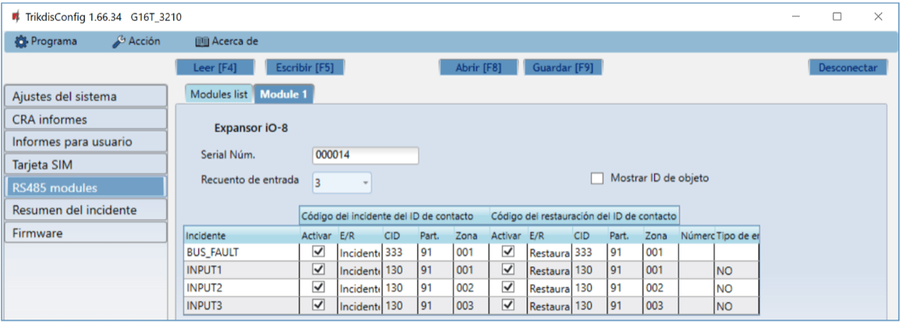

Expansor iO-8 tiene 8 contactos (salida/entrada) terminales universales.

- **Recuento de entrada** - seleccionar qué número de contactos de conexión se debe establecer en el modo de entrada (IN). El resto de los contactos de conexión se convertirá en salidas (OUT).

Las salidas se configuran directamente en la aplicación Protegus.

En la tabla de entradas se pueden asignar eventos Contact ID y recuperar los códigos. Una vez que se activa una entrada, el comunicador enviará un evento con el código de evento a una CRA y a la aplicación Protegus.

**Código del incidente del ID de contacto:**

- **Activar** - permite la transmisión de mensajes, cuando se activa la entrada.

- **E/R** - se puede elegir, qué tipo de evento se enviará cuando la entrada se activa **- Evento o Restauración.**

- **CID** - establecer el código Contacto ID a la entrada.

- **Part.** - establecer la partición (área) a la entrada. Se establece automáticamente: si el módulo no. 1, entonces el área 91; si el módulo no. 4, a continuación, el área 94.

- **Zona** - establecer el número de la zona para la entrada.

**Código del restauración del ID de contacto**:

- **Activar** - permite la transmisión de mensajes, cuando la entrada se restaura.

- **E/R** - se puede elegir, qué tipo de evento se envía cuando se restablece la entrada - **Restaurar o Evento**.

- **CID** - establecer el código Contacto ID de restauración a la entrada.

- **Part.** - establecer la partición (área) a la entrada. Se establece automáticamente: si el módulo no. 1, entonces el área 91; si el módulo no. 4, a continuación, el área 94.

- **Zona** - establecer el número de la zona para la entrada.

- **Número de objeto** - al IN se le puede asignar un número de objeto, que será diferente del número de objeto del comunicador G16T.

- **Tipo de entrada** - seleccionar el tipo de la entrada (NO o NC).

Para que los clientes reciban mensajes SMS o llamadas acerca de detonantes de entrada, ingrese el código Contact ID que se asigna para entrada en la tabla en la pestaña **Informes para usario → Imformes por SMS y llamadas.**

#### Ventana de configuración del Expansor iO

Expansor iO tiene: terminales para 1 entrada, 1 salida (contactos de relé) y 1-Wire bus serial para la conexión de sensores de temperatura.

Salida de relé puede ser controlada de acuerdo con condiciones lógicas (SI / ENTONCES).

- **Tipo de entrada IN** - establece el tipo de entrada (NO o NC).

- **Max ◦C (T1)** - cuando la temperatura es superior a este ajuste, se generará un mensaje de evento. Para que se genere un mensaje de evento, se debe activar en la tabla.

- **Min ◦C (T2)**- cuando la temperatura es inferior a este valor, se generará un mensaje de evento. Para que se genere un mensaje de evento, se debe activar en la tabla.

En la tabla de entradas se pueden asignar eventos Contacto ID y recuperar los códigos. Una vez que se activa una entrada, el comunicador enviará un evento con el código de evento a una CRA y a la aplicación Protegus. Configure como se describe en la página anterior acerca de la ventana **configuración del expansor iO-8.**

#### Ventana de configuración del módulo WiFi *W485*

- **DHCP Modo** - modo del módulo WiFi para registrarse en la red (manual (Estática) o automático (DHCP)).

- **IP estática** - dirección IP estática para cuando se establece el modo de registro manual.

- **Subnet mask** - máscara de subred para cuando se establece el modo de registro manual.

- **Predeterminado gateway** - dirección de Puerto de enlace para cuando se establece el modo de registro manual.

- **WiFi SSID nombre** - nombre de la red WiFi a la que se conectará el W485.

- **WiFi SSID contraseña** - contraseña de red WiFi.

En la tabla, puede asignar el evento de Contacto ID y códigos de restauración al evento de error del bus de datos RS485. Cuando se interrumpe o restablezca la conexión entre el W485 y el G16T, el G16T enviará un mensaje con el código CID asignado al CRA y a la aplicación Protegus.

!!! note
    Debe configurar el G16T para enviar mensajes a CRA y Protegus,
    consulte los capítulos 2.2 "Adjustes para la conexión con la Central
    Receptora de Alarmas" y. 2.1 "Adjustes para la conexión com la app
    Protegus". / **Inserte la tarjeta SIM en el comunicador *G16T* para que
    funcione el *W485*.**
**Ventana de configuración del módulo ethernet *E485***

- **DHCP Modo** - modo del módulo ethernet para registrarse en la red (manual (Estática) o automático (DHCP)).

- **IP estática** - dirección IP estática para cuando se establece el modo de registro manual.

- **Subnet mask** - máscara de subred para cuando se establece el modo de registro manual.

- **Predeterminado gateway** - dirección de Puerto de enlace para cuando se establece el modo de registro manual.

En la tabla, puede asignar el evento de Contacto ID y códigos de restauración al evento de error del bus de datos RS485. Cuando se interrumpe o restablezca la conexión entre el E485 y el G16T, el G16T enviará un mensaje con el código CID asignado al CRA y a la aplicación Protegus.

!!! note
    Debe configurar el G16T para enviar mensajes a CRA y Protegus,
    consulte los capítulos 2.2 "Adjustes para la conexión con la Central
    Receptora de Alarmas" y. 2.1 "Adjustes para la conexión com la app
    Protegus". / **Inserte la tarjeta SIM en el comunicador *G16T* para que
    funcione el *E485*.**
### Ventana “Resumen de incidente” 

En esta ventana, puede activar, desactivar o cambiar los mensajes de eventos internos enviados por el dispositivo. Después de activar el evento interno en esta ventana, no se enviará independientemente de otras configuraciones.

- **COMMUNICATION** - mensaje sobre error de conexión entre el panel de control y G16T, cuando la supervisión de línea está activada.

- **IN_ALARM** - mensaje sobre de entrada (IN) de disparo del circuito.

- **IN_TAMPER** - mensaje sobre la entrada (IN) de disparo de manipulación del circuito.

- **PING** – Señal PING de latido (hearbeat).

- **POWER** - mensaje de baja tensión de suministro eléctrico.

- **REMOTE_STARTED** - mensaje sobre la conexión remota para configurar G16T con TrikdisConfig.

- **REMOTE_FINISHED** - mensaje sobre desconectarse de configuración remota con TrikdisConfig.

- **START** - G16T mensaje sobre la conexión a la red.

- **TEST** - mensaje de prueba periódica.

!!! note
    Para activar los mensajes de pruebas periódicas y establecer su período,
    ir a **Informes CRA -> Ajustes -> Periodo de prueba.**
- **Activar** - cuando se selecciona, el envío de mensajes está habilitado.

Puede cambiar cada contacto de evento con un código de identificación, y también el número de zona y partición.

### Restauración de la configuración de fábrica 

Para **Restaurar** la configuración de fábrica del comunicador, es necesario hacer clic en el botón Restaurar en la ventana TrikdisConfig.

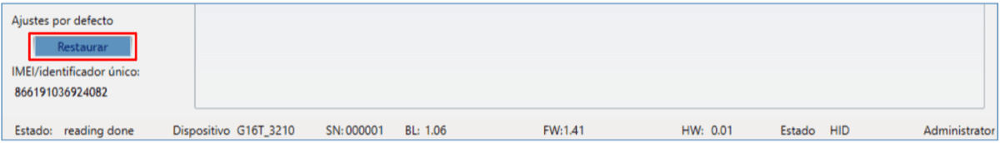

## Configuración remota 

1.  Iniciar el programa de configuración TrikdisConfig.

!!! note
    La configuración remota funcionará sólo si:
    
    1.  La tarjeta SIM insertada está activada y el código PIN está
        ingresado o deshabilitado;
    
    2.  La nube Protegus está habilitada. La forma de habilitar la
        nube se describe en el capítulo **6.4 ventana "Informes para
        usuario";**
    
    3.  Fuente de alimentación está conectada ( "POWER" LED se ilumina en
        verde);
    
    4.  Registrado en la red ("NETWORK" LED se ilumina en verde y parpadea
        amarillo).
2. En el campo de acceso remoto, introduzca el número de IMEI / Único ID del comunicador. Este número se encuentra en el dispositivo y la etiqueta del empaque.

3. (Opcional) En el campo **Nombre del sistema**, introduzca el nombre deseado para el G16T con este Único ID.

2.  Pulse Configurar.

3.  En la nueva ventana abierta haga clic en **Leer [F4].** Si es necesario, introduzca el código de administrador o instalador.

4.  Establecer los ajustes necesarios y cuando termine, haga clic en **Escribir [F5].**

## Prueba de rendimiento del comunicador 

Cuando la configuración y la instalación está completa, realice una comprobación del sistema:

1.  Genere un evento:

- mediante el teclado del panel de control armando/ desarmado el sistema;

- activando una alarma de zona cuando el sistema de seguridad está armado.

1.  Asegúrese de que el evento llega al CRA y o se recibe en la aplicación Protegus.

2.  Para probar la entrada del comunicador, desencadene y asegúrese de recibir el evento correcto.

3.  Para probar las salidas del comunicador, active de forma remota y compruebe su funcionamiento.

4.  Si el panel de control será controlado de forma remota, arme/desarmarme el sistema de seguridad de forma remota mediante el uso de la aplicación Protegus.

## Actualización manual del Firmware 

!!! note
    Cuando el comunicador está conectado a TrikdisConfig, el programa
    ofrecerá automáticamente actualizar el firmware del dispositivo si están
    disponibles. Las actualizaciones requieren una conexión a Internet. El
    software antivirus, el firewall o el acceso estricto a la configuración
    de Internet pueden bloquear las actualizaciones automáticas del
    firmware.
El firmware G16T se puede actualizar o cambiar también de forma manual. Después de una actualización, todos los ajustes establecidos previamente permanecerán. Al escribir el firmware de forma manual, se puede cambiar a una versión más reciente o más. Para actualizar:

1.  Ejecutar TrikdisConfig.

2.  Conecte el dispositivo G16T mediante un cable USB Mini-B al ordenador o conéctese al comunicador G16T forma remota.

- Si existe una versión más reciente del firmware, el software ofrecerá a descargar el archivo de la versión de firmware más reciente.

1.  Seleccione el firmware del menú.

2.  Presione **Abrir el firmware** y seleccione el archivo de firmware requerido. Si no tiene el archivo, el archivo de firmware más reciente puede ser descargado por el usuario registrado de [www.trikdis.com](http://www.trikdis.com) , en virtud de la sección de descargas del comunicador ***G16T*.**

3.  Pulse **Actualizar [F12].**

    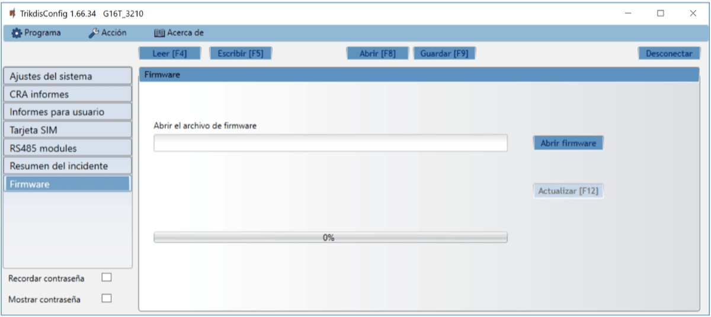

4.  Espere a que el indicador de actualización se haya completado.

## G16T comunicador celular

## Requerimientos de seguridad 

El comunicador debe ser instalado y recibir mantenimiento por personal calificado.

Antes de la instalación, por favor lea atentamente este manual con el fin de evitar errores que puedan conducir a un mal funcionamiento o incluso daños en el equipo.

Desconecte la alimentación eléctrica antes de realizar cualquier conexión.

Cambios, modificaciones o reparaciones no autorizadas por el fabricante anularán sus derechos en virtud de la garantía.

Por favor, cumpla con la normativa local y no deseche su sistema de alarma inoperable o sus componentes con otros residuos domésticos.

## Anexo

El comunicador puede funcionar con un receptor SUR-GARD. El comunicador recibidos desde panel de alarma los códigos de Contacto ID convierte a códigos SIA.

**Tabla de conversión de los códigos Contacto ID a código SIA**

| **Evento del sistema** | **Código de informe CID** | **Código de informe de SIA** |
|----|:--:|:--:|
| Alarma médica | E100 | "MA" |
| Emergencia personal | E101 | "QA" |
| Incendio en la zona: <z> | E110 | "FA" |
| Flujo de aguas detectado en la zona: <z> | E113 | "SA" |
| Alarma de la estación manual en la zona: <z> | E115 | "FA" |
| Pánico en la zona: <z> | E120 | "PA" |
| Alarma de pánico por el usuario: <v> | E121 | "HA" |
| Alarma de pánico en la zona: <z> | E122 | "HA" |
| Alarma de pánico en la zona: <z> | E123 | "PA" |
| Alarma de pánico en la zona: <z> | E124 | "HA" |
| Alarma de pánico en la zona: <z> | E125 | "HA" |
| Alarma activa en la zona: <z> | E130 | "BA" |
| Alarma activa en la zona: <z> | E131 | "BA" |
| Alarma activa en la zona: <z> | E132 | "BA" |
| Alarma activa en la zona: <z> | E133 | "BA" |
| Alarma activa en la zona: <z> | E134 | "BA" |
| Alarma activa en la zona: <z> | E135 | "BA" |
| Tamper activo en la zona: <z> | E137 | "TA" |
| Intrusión verificada en la zona: <z> | E139 | "BV" |
| Alarma activa en la zona: <z> | E140 | "UA" |
| Fallo del sistema (143) | E143 | "UA" |
| Tamper activo en la zona: <z> | E144 | "TA" |
| Tamper activo en la zona: <z> | E145 | "TA" |
| Alarma activa en la zona: <z> | E146 | "BA" |
| Alarma activa en la zona: <z> | E150 | "UA" |
| Gas detectado en la zona: <z> | E151 | "GA" |
| Pérdida de agua detectada en la zona: <z> | E154 | "WA" |
| Foil Rotura detectado en la zona: <z> | E155 | "BA" |
| Alta temperatura en el sensor: <n> | E158 | "KA" |
| Baja temperatura en el sensor: <n> | E159 | "ZA" |
| CO detectado en la zona: <z> | E162 | "GA" |
| Falla en zona de fuego: <z> | E200 | "FS" |
| Monitoreo de alarma | E220 | "BA" |
| Fallo del sistema (300) | E300 | "YP" |
| Pérdida de fuente de alimentación AC | E301 | "AT" |
| Batería baja | E302 | "YT" |
| Fallo del sistema (304) | E304 | "YF" |
| Reiniciar sistema en zona: <z> | E305 | "RR" |
| Programación del panel modificada | E306 | "YG" |
| Apagado del sistema | E308 | "RR" |
| Fallo en la batería (309) | E309 | "YT" |
| Fallo de toma a tierra | E310 | "US" |
| Fallo en batería (311) | E311 | "YM" |
| Sobrecarga en fuente de alimentación (312) | E312 | "YP" |
| Restablecimiento del ingeniero por usuario: <v> (313) | E313 | "RR" |
| Fallo en Sirena/Relé | E320 | "RC" |
| Fallo del sistema (321) | E321 | "YA" |
| Fallo del sistema (330) | E330 | "ET" |
| Fallo del sistema (332) | E332 | "ET" |
| Fallo del sistema (333) | E333 | "ET" |
| Fallo del sistema (336) | E336 | "VT" |
| Fallo del sistema (338) | E338 | "ET" |
| Fallo del sistema (341) | E341 | "ET" |
| Fallo del sistema (342) | E342 | "ET" |
| Fallo del sistema (343) | E343 | "ET" |
| Fallo del sistema (344) | E344 | "XQ" |
| Fallo de comunicación del sistema (350) | E350 | "YC" |
| Fallo de comunicación del sistema (351) | E351 | "LT" |
| Fallo de comunicación del sistema (352) | E352 | "LT" |
| Fallo del sistema (353) | E353 | "YC" |
| Fallo de comunicación del sistema (354) | E354 | "YC" |
| Fallo del sistema (355) | E355 | "UT" |
| Problema de fuego en zona: <z> | E373 | "FT" |
| Problema en la zona: <z> | E374 | "EE" |
| Problema en la zona: <z> | E378 | "BG" |
| Problema en la zona: <z> | E380 | "UT" |
| Avería en zona inalámbrica: <z> | E381 | "US" |
| Fallo del módulo inalámbrico (382) | E382 | "UY" |
| Tamper activo en la zona: <z> | E383 | "TA" |
| Batería baja en zona inalámbrica: <z> | E384 | "XT" |
| Problema en la zona: <z> (389) | E389 | "ET" |
| Problema en la zona: <z> (391) | E391 | "NA" |
| Problema en la zona: <z> (393) | E393 | "NC" |
| Usuario <v> desarmó el sistema | E400 | "OP" |
| Usuario <v> desarmó el sistema | E401 | "OP" |
| Desarme automático | E403 | "OA" |
| Desarmado diferido <v> usuario | E405 | "OR" |
| Alarma cancelada por el usuario: <v> | E406 | "BC" |
| Usuario <v> desarmó de forma remota | E407 | "OP" |
| Usuario <v> armó rápido | E408 | "OP" |
| Desarmado remoto | E409 | "OS" |
| Solicitud de devolución de llamada realizada por CRA | E411 | "RB" |
| Descarga de datos realizada con éxito | E412 | "RS" |
| Acceso denegado para el usuario: <v> | E421 | "JA" |
| Entrada por usuario <v> | E422 | "DG" |
| Acceso Forzado <z> zona | E423 | "DF" |
| Acceso de salida denegado para el usuario <v> | E424 | "DD" |
| Salida usuario <v> | E425 | "DR" |
| Usuario <v> desarmó demasiado pronto | E451 | "OK" |
| Usuario <v> armó el sistema demasiado tarde | E452 | "OJ" |
| Usuario <v> Falló al abrir | E453 | "CT" |
| Usuario <v> Falló al cerrar | E454 | "CI" |
| Auto armado fallido | E455 | "CI" |
| Armado parcial por el usuario: <v> | E456 | "CG" |
| Violación de salida por usuario: <v> | E457 | "EE" |
| Armado parcial por el usuario: <v> | E458 | "OR" |
| Recent arm <v> user | E459 | "CR" |
| Introducido código incorrecto | E461 | "JA" |
| Tiempo de auto-armado ampliado por usuario: <v> | E464 | "CE" |
| Dispositivo deshabilitado (501) | E501 | "RL" |
| Dispositivo deshabilitado (520) | E520 | "RO" |
| Sensor inalámbrico deshabilitado en la zona: <z> (552) | E552 | "YS" |
| Zona <z> anulada | E570 | "UB" |
| Zona <z> anulada | E571 | "FB" |
| Zona <z> anulada | E572 | "MB" |
| Zona <z> anulada | E573 | "BB" |
| Anulación de grupo por usuario: <v> | E574 | "CG" |
| Zona <z> anulada | E576 | "UB" |
| Bypass en zona <z> cancelado | E577 | "UB" |
| Ventilación de zona anulada | E579 | "UB" |
| Prueba de recorrido activada por usuario <v> | E607 | "TS" |
| Informe de prueba manual | E601 | "RX" |
| Informe de test periódico | E602 | "RP" |
| Evento del sistema (605) | E605 | "JL" |
| Evento del sistema (606) | E606 | "LF" |
| Problema en el informe de test periódico | E608 | "RY" |
| Evento del sistema (622) | E622 | "JL" |
| Evento del sistema (623) | E623 | "JL" |
| Hora y fecha restablecida por usuario <v> | E625 | "JT" |
| Fecha/hora inexacta | E626 | "JT" |
| Programación de sistema iniciada | E627 | "LB" |
| Programación del sistema terminada | E628 | "LS" |
| Evento del sistema (631) | E631 | "JS" |
| Evento del sistema (632) | E632 | "JS" |
| Sistema no activo (654) | E654 | "CD" |
| Alarma médica restaurada | R100 | "MH" |
| Emergencia personal restaurada | R101 | "QH" |
| No más alarma de incendio en la zona: <z> | R110 | "FH" |
| No más alarma de flujo de aguas en la zona: <z> | R113 | "SH" |
| Alarma de pánico restablecida en la zona: <z> | R120 | "PH" |
| Alarma de pánico cancelada por el usuario: <v> | R121 | "HH" |
| Alarma de pánico restablecida en la zona: <z> | R122 | "PH" |
| Alarma de pánico restablecida en la zona: <z> | R123 | "PH" |
| Alarma de pánico restablecida en la zona: <z> | R124 | "HH" |
| Alarma de pánico restablecida en la zona: <z> | R125 | "HH" |
| No más alarma en la zona: <z> | R130 | "BH" |
| No más alarma activa en la zona: <z> | R131 | "BH" |
| No más alarma activa en la zona: <z> | R132 | "BH" |
| No más alarma en la zona: <z> | R133 | "BH" |
| No más alarma en la zona: <z> | R134 | "BH" |
| No más alarma en la zona: <z> | R135 | "BH" |
| No más tamper en la zona: <z> | R137 | "TA" |
| No más alarma en la zona: <z> | R140 | "UH" |
| No más fallo del sistema (143) | R143 | "ER" |
| No más tamper en la zona: <z> | R144 | "TR" |
| No más tamper en la zona: <z> | R145 | "TR" |
| No más alarma en la zona: <z> | R146 | "BH" |
| No más alarma en la zona: <z> | R150 | "UH" |
| No más alarma de gas en la zona: <z> | R151 | "GH" |
| No más alarma de pérdida de agua en la zona: <z> | R154 | "WH" |
| Foil Rotura restaurado en la zona: <z> | R155 | "BH" |
| La temperatura se ha normalizado en el sensor: <n> | R158 | "KH" |
| La temperatura se ha normalizado en el sensor: <n> | R159 | "ZH" |
| No más alarma de CO en la zona: <z> | R162 | "GH" |
| No más falla en la zona de fuego: <z> | R200 | "FV" |
| Monitoreo de restauración de alarma | R220 | "BH" |
| No más fallo del sistema (300) | R300 | "YA" |
| Fuente de alimentación AC OK | R301 | "AR" |
| Batería OK | R302 | "YR" |
| No más fallo del sistema (304) | R304 | "YG" |
| Restablecimiento del sistema restaurado en la zona: <z> | R305 | "RR" |
| No más fallo en batería (309) | R309 | "YR" |
| Falla de tierra restablecido | R310 | "UR" |
| No más fallo en batería (311) | R311 | "YR" |
| Restaurar la sobrecarga de corriente de la fuente de alimentación (312) | R312 | "YQ" |
| No más fallo en Sirena/Relé | R320 | "RO" |
| No más fallo del sistema (321) | R321 | "YH" |
| No más fallo del sistema (330) | R330 | "ER" |
| No más fallo del sistema (332) | R332 | "ER" |
| No más fallo del sistema (333) | R333 | "ER" |
| No más fallo del sistema (336) | R336 | "VR" |
| No más fallo del sistema (338) | R338 | "ER" |
| No más fallo del sistema (341) | R341 | "ER" |
| No más fallo del sistema (342) | R342 | "ER" |
| No más fallo del sistema (344) | R344 | "XH" |
| No más fallo de comunicación del sistema (350) | R350 | "YK" |
| No más fallo de comunicación del sistema (351) | R351 | "LR" |
| No más fallo de comunicación del sistema (352) | R352 | "LR" |
| No más fallo del sistema (353) | R353 | "YK" |
| No más fallo de comunicación del sistema (354) | R354 | "YK" |
| No más fallo del sistema (355) | R355 | "UJ" |
| Restablecido problema de fuego en zona: <z> | R373 | "FJ" |
| No más problema en la zona: <z> | R374 | "EA" |
| No más problema en la zona: <z> | R380 | "UJ" |
| No más avería en zona inalámbrica: <z> | R381 | "UR" |
| No más fallo del módulo inalámbrico (382) | R382 | "BR" |
| No más tamper en la zona: <z> | R383 | "TR" |
| Batería OK en zona inalámbrica: <z> | R384 | "XR" |
| No más problema en la zona: <z> (391) | R391 | "NS" |
| No más problema en la zona: <z> (393) | R393 | "NS" |
| Usuario <v> armó el sistema | R400 | "CL" |
| Usuario <v> armó el sistema | R401 | "CL" |
| Armado automático | R403 | "CA" |
| Usuario <v> armó de forma remota | R407 | "CL" |
| Desarmado rápido | R408 | "CL" |
| Armado remoto | R409 | “CS” |
| Usuario <v> armó el modo Stay | R441 | "CG" |
| Usuario <v> armó demasiado pronto | R451 | “CK” |
| Usuario <v> desarmó el sistema demasiado tarde | R452 | “CJ” |
| Usuario <v> Falló al cerrar | R454 | “CI” |
| Armado parcial por el usuario: <v> | R456 | "CG" |
| Recent disarm <v> user | R459 | “CR” |
| Dispositivo habilitado (501) | R501 | "RG" |
| Dispositivo habilitado (520) | R520 | "RC" |
| Sensor inalámbrico habilitado en la zona: <z> (552) | R552 | "YK" |
| Bypass en zona <z> cancelado | R570 | "UU" |
| Bypass en zona <z> cancelado | R571 | "FU" |
| Bypass en zona <z> cancelado | R572 | "MU" |
| Bypass en zona <z> cancelado | R573 | "BU" |
| Anulación de grupo por usuario: <v> cancelada | R574 | "CF" |
| Bypass en zona <z> cancelado | R576 | "UU" |
| Bypass en zona <z> cancelado | R577 | "UU" |
| Bypass de la zona de ventilación cancelada | R579 | "UU" |
| Prueba de recorrido desactivada por usuario <v> | R607 | "TE" |
| Hora y fecha restablecida por usuario <v> | R625 | "JT" |
| Sistema activo (654) | R654 | "CD" |
