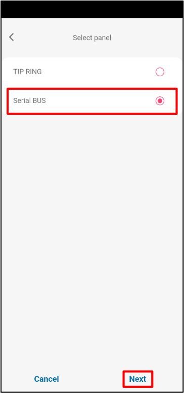
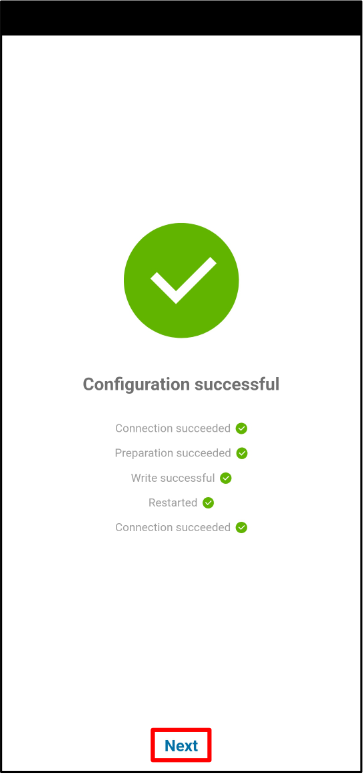
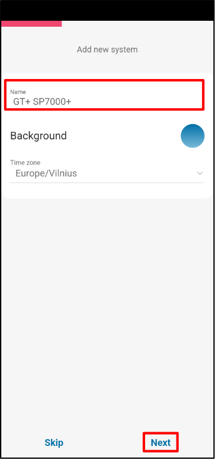
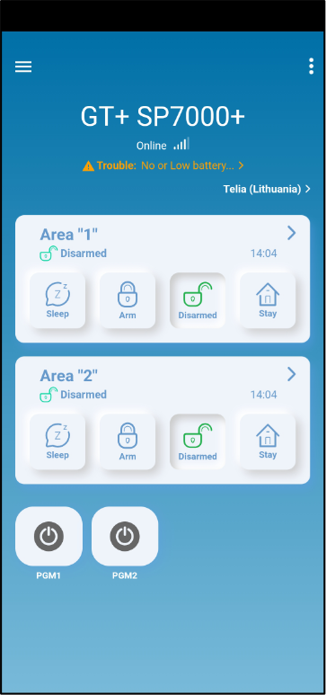

# Paradox SP(+)/MG(+) con GT/GT+/GET configuración rápida

Pasos breves de cableado y programación para conectar el comunicador GT/GT+/GET a paneles Paradox SP/SP+/MG/MG+ usando TIP/RING y KeyBus, y luego añadir el sistema a Protegus2. Use esto junto con los manuales completos para otros ajustes. (Las etiquetas de terminal pueden variar ligeramente entre GT/GT+/GET, pero las conexiones son las mismas.)

!!! caution "Precaución"
    La instalación y el servicio deben ser realizados solo por personal cualificado. Desconecte la alimentación antes de cablear. Los cambios no autorizados anulan la garantía.

## Requisitos

1. Firmware GT/GT+/GET 1.21, SIM insertada, PIN deshabilitado, plan de datos activo.
1. Panel Paradox SP/SP+/MG/MG+ con acceso al teclado (código de instalador disponible).
1. Número de cuenta CMS si reporta a CMS.
1. Cuenta de empresa/instalador de Protegus2 y IMEI del comunicador.

## Cableado

Siga el esquema de abajo para conectar el comunicador al panel:

| Terminal GT/GT+/GET | Panel Paradox | Notas |
| --- | --- | --- |
| TIP / RING | TIP / RING | Para emulación de línea PSTN (Contact ID). |
| CLK / DATA (KeyBus) | YEL / GRN (KeyBus) | Para control del bus serie. |
| +12V / GND | AUX + / GND | Alimentación del comunicador. |

## Programar el panel Paradox (teclado LCD)

Use el teclado del panel para habilitar Contact ID y configurar los números de cuenta:

1. Entrar en programación de instalador: `[ENTER] 0000` (o su código de instalador).
2. Sección 801: opciones generales del marcador → deje los valores predeterminados salvo que se requiera.
3. Sección 811: introduzca el número de cuenta de la Partición 1 (ejemplo `1111`; use el valor de su CMS).
4. Sección 812: introduzca el número de cuenta de la Partición 2 (ejemplo `2222`; use el valor de su CMS).
5. Sección 815: introduzca el número de teléfono de reporte (ejemplo `123456`; use el valor de su CMS).
6. Sección 911: configure la contraseña de PC (ejemplo `1234`; según su política).
7. Presione `[CLEAR]` para salir de la programación.

Consulte el manual completo de Paradox si los códigos del teclado son diferentes.

## Añadir sistema a Protegus2 (móvil o web)

  

    <strong>Paso 1.</strong> Pulse <strong>Agregar nuevo sistema</strong>.
    
  

  

    <strong>Paso 2.</strong> Introduzca el <strong>IMEI</strong> del comunicador, pulse <strong>Siguiente</strong>.
    
  

  

    <strong>Paso 3.</strong> Seleccione <strong>TIP RING</strong>, pulse <strong>Siguiente</strong>.
    
  

  

    <strong>Paso 4.</strong> Pulse <strong>Atrás</strong>.
    
  

  

    <strong>Paso 5.</strong> Seleccione <strong>Serial BUS</strong>, pulse <strong>Siguiente</strong>.
    
  

  

    <strong>Paso 6.</strong> Seleccione <strong>PARADOX</strong>.
    
  

  

    <strong>Paso 7.</strong> Seleccione <strong>PARADOX SP+/MG+ series KeyBus</strong>.
    
  

  

    <strong>Paso 8.</strong> Introduzca <strong>Primary Object ID</strong>, pulse <strong>Siguiente</strong>.
    
  

  

    <strong>Paso 9.</strong> Espere mientras se escriben los datos.
    
  

  

    <strong>Paso 10.</strong> Pulse <strong>Siguiente</strong>.
    
  

  

    <strong>Paso 11.</strong> Introduzca el <strong>Nombre</strong> del sistema, pulse <strong>Siguiente</strong>.
    
  

  

    <strong>Paso 12.</strong> Pulse <strong>Saltar</strong> (si no añade usuarios ahora).
    
  

  

    <strong>Paso 13.</strong> Espere ~1 minuto para completar.
    
  

  

    <strong>Paso 14.</strong> Configuración finalizada.
    
  

!!! tip "Consejo"
    Si Protegus2 no puede finalizar la escritura de datos, verifique el cableado KeyBus (YEL/GRN), la entrada de IMEI y que la configuración de CMS/Contact ID esté guardada en el panel.
