# Comunicador Ethernet E16

  

## Descripción

La función del Comunicador E16 es de mejorar los paneles de control compatibles para la señalización de eventos y control va través de Internet.

El comunicador transmite información de eventos completos al Central de Monitoreo.

El comunicador también funciona con la aplicación Protegus2. Con Protegus2, los usuarios pueden controlar el sistema de alarma de forma remota y obtener notificaciones de cualquier evento de seguridad. La app de Protegus2 es compatible con todos los paneles de control de varios fabricantes que son soportados por el comunicador E16. El comunicador puede transmitir notificaciones de eventos al Central de Monitoreo y trabajar de forma simultanea con Protegus2.

El Comunicador E16 se puede conectar directamente con los paneles de control DSC®, Paradox®, UTC Interlogix® (CADDX), Innerrange®, Texecom®, Honeywell®, Crow® and Pyronix®. Para paneles de otros fabricantes utilice el comunicador E16T.

**Características**

Envía eventos al receptor en una CRA:

- Envía eventos a los receptores de hardware o software TRIKDIS que funcionan con cualquier software de monitoreo.

- Puede enviar información de eventos a SIA DC-09 receptores.

- Puede enviar información de eventos a SUR-GARD receptores. El anexo contiene tabla de conversión de los códigos (Contacto ID a SIA).

- Supervisión de la conexión mediante sondeo al receptor de IP cada 30 segundos (o por período definido por el usuario).

- Canal de respaldo, que se utilizará si se pierde la conexión con el canal primario.

- Con canales de comunicación paralelos se pueden enviar eventos a dos receptores al mismo tiempo.

- Cuando el servicio *Protegus* está habilitado, los eventos se envían primero a CRA, y solo luego se envían a los usuarios de la aplicación.

Funciona con la aplicación Protegus2:

- Notificaciones de sonidos especiales y "Push" que informan sobre eventos.

- Armado/Desarmado de forma remota.

- Control remoto de dispositivos conectados (luces, portones/barreras, sistemas de ventilación, calefacción, aspersores, etc.).

- Monitorización remota de la temperatura (con los expansores iO y iO-WL).

- Diferentes derechos de usuario para administrador y instalador.

**Informes a los usuarios finales:**

- Los usuarios pueden ser informados sobre eventos con aplicación Protegus2.

**Salidas y entradas controlables:**

- 3 entradas/salidas universales. Modo de funcionamiento se establece como entrada o salida.

- Salidas controladas por Protegus2.

- Añada controlable entradas y salidas adicionales con expansores iO cableados e inalámbricos.

**Configuración rápida:**

- Las configuraciones pueden guardarse en un archivo y escribirse rápidamente en otros comunicadores.

- Dos niveles de acceso para configurar el dispositivo para el administrador de CRA y para el instalador.

### Lista de paneles de Control compatibles 

| Fabricante | Modelo |
|------------|--------|
| DSC® | <u>PC585</u>, PC1404, <u>PC1565</u>, <u>PC1616</u>, <u>PC1832</u>, <u>PC1864</u>, PC5020 |
| PARADOX® | <u>SPECTRA SP4000</u>, <u>SP5500</u>, <u>SP6000</u>, <u>SP7000</u>, <u>SP65</u>, <u>SP5500+</u>, <u>SP6000+</u>, <u>SP7000+</u> |
| PARADOX® | <u>MAGELLAN MG5000</u>, <u>MG5050</u>, MG5050E, <u>MG5050+</u> |
| PARADOX® | <u>DIGIPLEX EVO192</u>, <u>EVOHD</u>, NE96, EVO48, EVO96 |
| PARADOX® | SPECTRA 1727, 1728, 1738 |
| PARADOX® | ESPRIT E55, 728ULT, 738ULT |
| UTC Interlogix® | <u>NetworX (Caddx) NX-4v2</u>, <u>NX-6v2</u>, <u>NX-8v2</u>, <u>NX-8E</u> |
| Texecom® | Premier 412, 816, 832, 832+ /​ <u>Premier 24</u>, <u>48</u>, <u>88</u>, <u>168</u> /​ <u>Premier Elite 12</u>, <u>24</u>, <u>48</u>, <u>64</u>, <u>88</u>, <u>168</u> |
| Pyronix® | MATRIX 424, MATRIX 832, MATRIX 832+, MATRIX 6, MATRIX 816 |
| Innerrange® | Inception, Integriti |
| Honeywell® | <u>Ademco Vista-15</u>, <u>Ademco Vista-20</u>, <u>Ademco Vista-48</u> |
| Crow® | Runner 4/​8, Runner 8/​16 |

**<u>Subrayado</u>** - paneles de control controlados directamente por E16. Paneles de control Paradox, que se controlan directamente, debe contener la versión de firmware V.4 o superior.

\* conéctese con paneles de control de otros fabricantes con el comunicador E16T.

### Especificaciones 

| Parámetro | Descripción |
|----|----|
| Entradas /​Salidas universales | 3, se puede establecer ya sea como entrada IN con el tipo: NC, NO, NC con EOL, NO con EOL, NC con DEOL, NO con DEOL (EOL = 2,2 kΩ), o la salida OUT (colector abierto (OC) 150 mA). /​ Expandible con expansores de la serie iO. |
| Voltaje de la fuente de alimentación | 10-18 V DC |
| Consumo de Energía | 100 mA (en modo de espera) /​ Up to 250 mA (mientras envía datos) |
| Conexión Ethernet | Toma de corriente IEEE 802.3, 10 Base-T, RJ45 |
| Protocolos de Transmisión | TRK, DC-09_2007, DC-09_2012, TL150 |
| Cifrado de mensajes | AES 128 |
| Memoria | Hasta 60 mensajes |
| Modificación de los ajustes | Con el software de configuración TrikdisConfig de forma remota o local a través del puerto USB Mini-B |
| Entorno de Operación | Temperatura de -10 °C a 50 °C, humedad relativa - desde 80% a +20 °C |
| Dimensiones del Comunicador | 88 x 62 x 25 mm |
| Peso | 80 g |

### Tablero del Comunicador

1.  Luces Indicadoras.

2.  Ranura Frontal de Apertura de la Cubierta.

3.  Terminal para conexiones externas.

4.  Puerto USB Mini-B para la programación del comunicador.

5.  Conexión Ethernet zócalo RJ45.

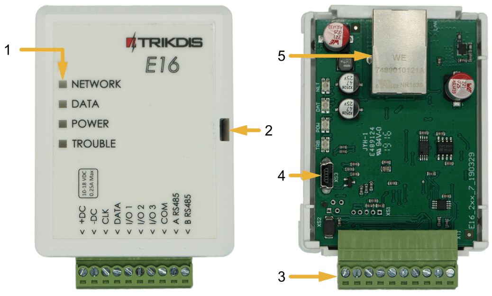

### Propósito de las terminales

| Terminal | Descripción |
|----------|-------------|
| +DC | Terminal de fuente de alimentación (terminal positivo de 10-18 V CC) |
| -DC | Terminal de alimentación (terminal negativo de 10-18 V CC) |
| CLK | Terminal de bus serial para conexión directa al panel de control |
| I/​O 1 | 1r terminal de entrada/​salida |
| I/​O 2 | 2do terminal de entrada/​ salida |
| I/​O 3 | 3ro terminal de entrada/​salida |
| COM | Común (negativo) |
| A RS485 | Contacto RS485 para conectar la entrada iO o expansor de salida u otros aditamentos |

### LED indicador de operación

| Indicador | Estado de la luz | Descripción |
|-----------|------------------|-------------|
| NETWORK | Off | No conectado a una red de computador |
| NETWORK | Verde sólido | El comunicador está conectado a una red de computador |
| DATA | Off | No hay eventos no enviados |
| DATA | Verde sólido | Los eventos no enviados se almacenan en el búfer |
| DATA | Verde parpadeando | (Modo de configuración) Los datos se transfieren a/desde el comunicador |
| POWER | Off | La fuente de alimentación está apagada o desconectada |
| POWER | Verde sólido | La fuente de alimentación está encendida con suficiente voltaje |
| POWER | Amarillo sólido | La tensión de alimentación es insuficiente (≤11.5V) |
| POWER | Verde sólido y parpadeo amarillo | (Modo de configuración) Comunicador está listo para la configuración |
| POWER | Amarillo sólido | (Modo de configuración) No hay conexión con la computadora |
| TROUBLE | Off | No hay problemas de operación |
| TROUBLE | 1 parpadeo rojo | Error de conexión en el nivel "físico" (PHY Link status error), revisa el cable LAN |
| TROUBLE | 2 parpadeos rojos | Error de DHCP |
| TROUBLE | 3 parpadeos rojos | Error de DNS |
| TROUBLE | 6 parpadeos rojos | No hay conexión con el receptor |
| TROUBLE | 7 parpadeos rojos | Conexión perdida con el panel de control |
| TROUBLE | Parpadeo rojo | (Modo de configuración) Fallo de memoria |
| TROUBLE | Rojo sólido | (Modo de configuración) El firmware está dañado |

### Esquema estructural del uso del dispositivo E16

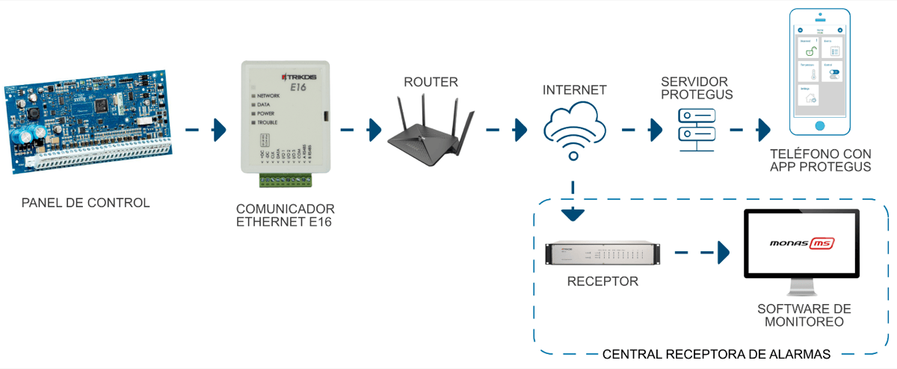

!!! note
    Antes de empezar, asegúrese de tener todo lo necesario:
    
    1.  Cable USB (tipo Mini-B) para la configuración.
    
    2.  Por lo menos 4 alambres para conectar el comunicador con el panel de
        control.
    
    3.  Un cable CRP2 para conectarse con el puerto serial del panel de
        Paradox.
    
    4.  Desatornillador de cabeza plana.
    
    5.  Manual de instalación del panel de control de seguridad.
    
    Ordene los componentes necesarios de forma separada de su distribuidor
    local.
## ¿Cómo configurar el comunicador con el software de TrikdisConfig?

1.  Descargue el software de TrikdisConfig de [www.trikdis.com](http://www.trikdis.com) (en la barra de búsqueda ponga TrikdisConfig) e instálelo.

2.  Abra la cubierta del E16 con el desatornillador de cabeza plana como se muestra a continuación:

    

3.  Usando el cable USB mini-B conecte el E16 a la computadora.

4.  Abra el programa de configuración de TrikdisConfig. El software reconocerá de forma automática el comunicador conectado y abrirá una ventana para su configuración.

5.  De clic en **Leer [F4]** para leer la información sobre los parámetros del comunicador e ingrese el código del Administrador o del Instalador en la ventana saliente.

A continuación, habrá una descripción de las opciones que necesitan ser configurados para el comunicador, para que este empiece a enviar notificaciones al CRA y para permitir que el control de seguridad sea controlado por la app de Protegus2.

### Opciones de conexión para la app de Protegus2

**En la ventana de “Ajustes del sistema”:**

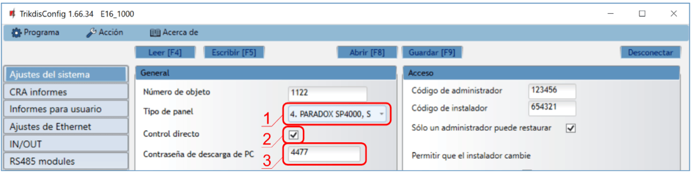

1.  Seleccione el tipo de panel de control que será conectado al comunicador.

2.  Active Armado/Desarmado Remoto si usted desea que los usuarios puedan tener control del panel en la app de Protegus2 con su código. Esta opción sólo es mostrada en paneles controlados de forma directa.

3.  Para el control directo de los paneles de Paradox, Texecom, DSC, Caddx ingrese la contraseña de la descarga del panel de su Computadora. Debe ser idéntica a la contraseña que fue ingresada en el panel de control.

!!! note
    Para que funcione el control directo del panel, usted necesitará cambiar
    las opciones del panel. El cómo hacer esto está descrito en el capitulo
    4 "Programando el panel de control para leer eventos y tener control
    directo". En esta sección usted encontrará información de como cambiar
    la contraseña de la descarga de la computadora/UDL.
**Ventana de “Informes para usuario”, pestaña de “Servicio Protegus”:**

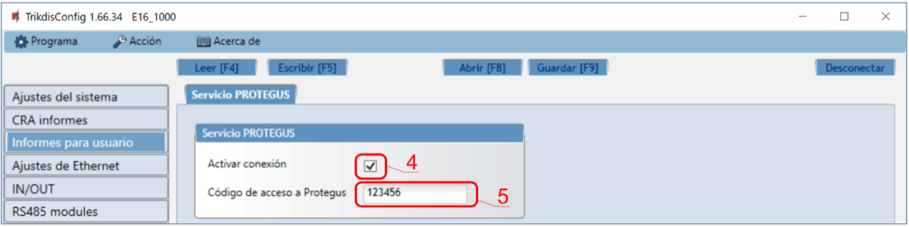

4. Habilitar la conexión a la Servicio Protegus.

2.  Cambie el Código de acceso de la nube para iniciar sesión con Protegus si usted desea que los usuarios requieran ingresarlo cuando se agrega el sistema a la app de Protegus2 (contraseña por defecto – 123456).

Cuando termine con la configuración, de clic en **Escribir [F5]** y desconecte el cable USB.

!!! note
    Para más información sobre otras opciones de E16 en
    TrikdisConfig vea el capitulo 6 de "Descripción de la ventana de
    TrikdisConfig".
### Configuración para conectarse con el CRA 

**En la ventana de “Ajustes del sistema”:**

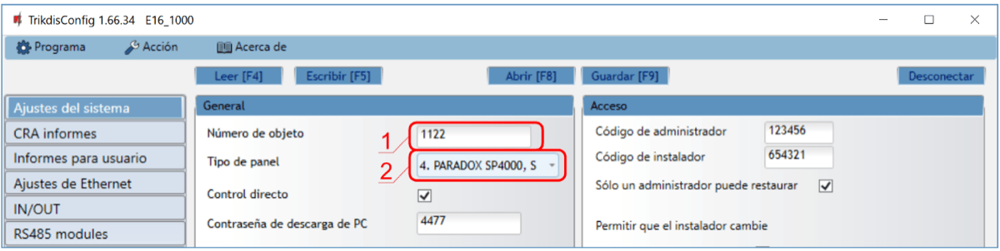

1.  Ingrese el número de ID del objeto (**No utilice números de objeto FFFE, FFFF.**).

2.  Seleccione el tipo de panel que será conectado al comunicador.

En la ventana de opciones de “CRA ajustes” para el “Canal de comunicación principal”:

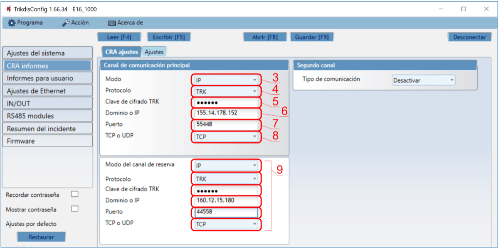

3. **Modo** – seleccione el método de conexión IP.

2.  **Protocolo** – seleccione el tipo de protocolo para mensajes de evento: TRK (para los receptores de TRIKDIS); DC-09_2007 o DC-09_2012 (a receptores universales); TL150 (para los receptores de SUR-GARD).

3.  **Clave de cifrado TRK** – Ingrese la llave de encriptación que está establecida en el receptor.

4.  **Dominio o IP** – ingrese la dirección del dominio o IP del receptor.

5.  **Puerto** – ingrese el número de puerto de la red del receptor.

6.  **TCP o UDP** – elija un protocolo de transmisión de evento (TCP o UDP, en donde se transmitirán los eventos.

!!! note
    SI usted seleccione el protocolo DC-09, adicionalmente en la pestaña de
    Opciones ingrese los números del objeto, línea y receptor.
7. (Recomendado) Configure las opciones de respaldo del canal primario.

2.  (Recomendado) Configure el canal paralelo y su configuración de canal de respaldo paralelo.

Cuando la configuración esté lista, de clic en **Escribir [F5]** y desconecte el cable USB.

!!! note
    Para más información sobre otras opciones de E16 en
    TrikdisConfig, vea el capitulo 6 "Descripción de la ventana de
    TrikdisConfig".
## Diagramas de conexión, instalación y puesta en servicio

### Diagramas para conectar los paneles de control

Siguiendo uno de estos diagramas provistos a continuación, conecte el comunicador con el panel de control.

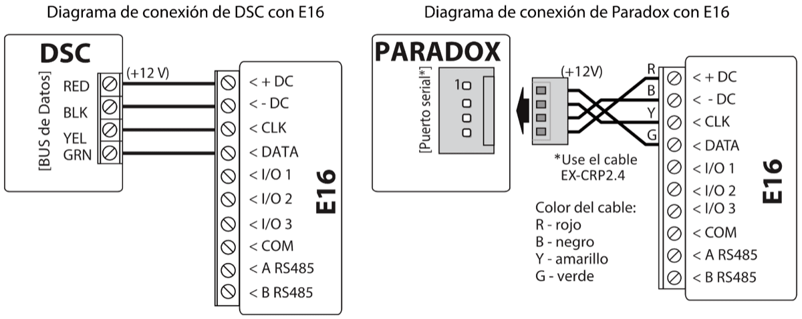

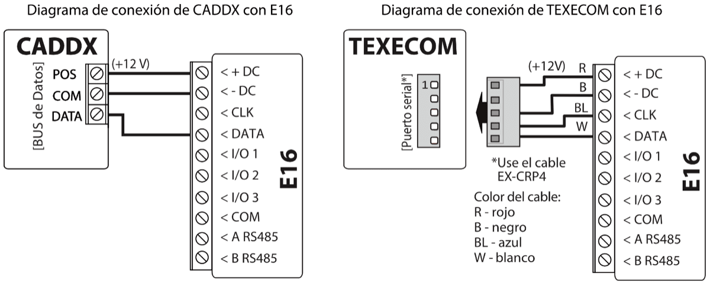

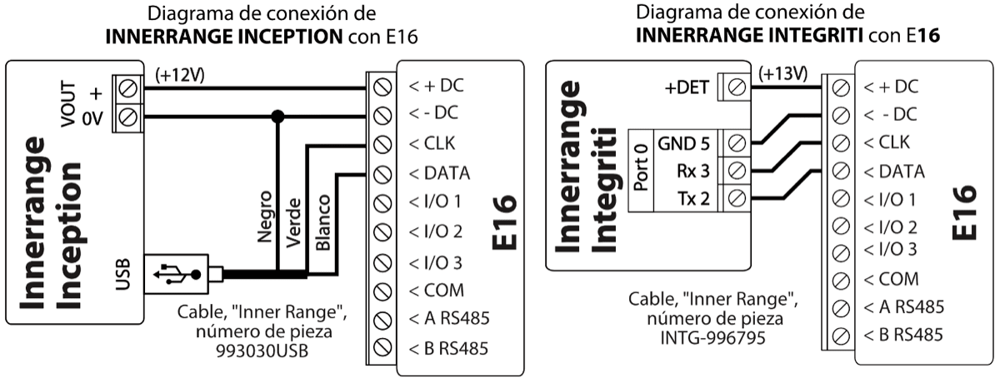

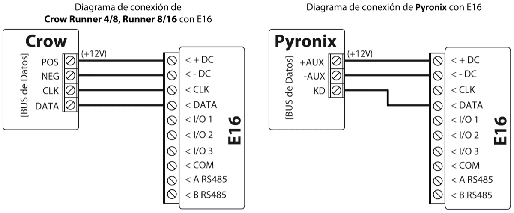

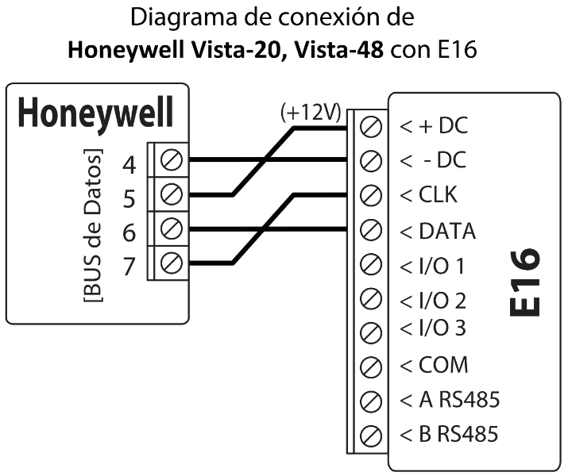

### **Diagramas de conexión para control el panel de control a través de la zona de keyswitch**

Siga este esquema si el panel de seguridad será controlado, pero no de forma directa, pero con una salida PGM *E16* para prender/apagar la zona de keyswitch del sistema. / El comunicador *E16* tiene tres salidas OUT (PGM) programables que pueden controlar tres áreas del sistema de seguridad. Si usted quiere controlar el sistema de esta forma, no seleccione la casilla de Armado/Desarmado remoto en la ventana de “configuración del sistema” de *TrikdisConfig*.

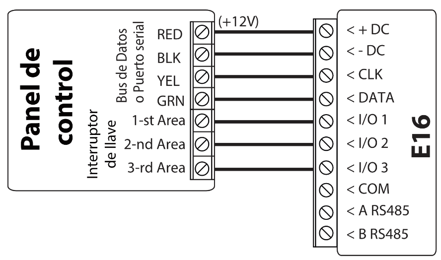

### Diagramas para la conexión de entrada

El comunicador tiene 3 terminales de entrada / salida universales que se pueden configurar en el modo de entrada IN. Los circuitos NC, NO, NO / EOL, NC / EOL, NO / DEOL, NC / DEOL pueden conectarse al terminal de entrada. Configuración de entrada predeterminada - NO. El tipo de entrada se puede cambiar en la ventana TrikdisConfig IN / OUT -> Tipo.

Conecte la entrada de acuerdo al tipo de entrada seleccionada (NC, NO, NO/EOL, NC/EOL, NO/DEOL, NC/DEOL), como se muestra en los esquemas de abajo:

!!! note
    Si más entradas o salidas necesitan ser conectadas al comunicador,
    conecte el expansor alámbrico o inalámbrico serie iO de TRIKDIS.
    El método de conexión está descrito en el manual de iO.
### Conectar el cable LAN

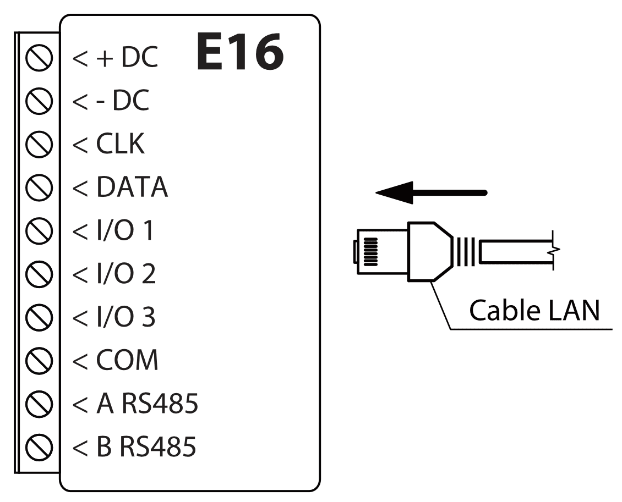

### Esquemas de cableado de un relé

Con los contactos de relé se puede controlar (encender/ apagar) diversos aparatos electrónicos. El terminal de I/O del comunicador debe configurarse en un modo de salida (OUT).

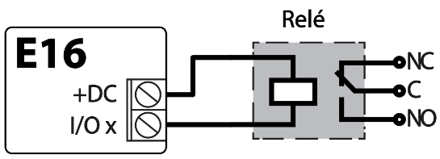

### Esquemas para la conexión de módulos de expansión de la serie de iO

Si es necesario conectar más entradas o salidas al comunicador, o si desea conectar un sensor de temperatura, conecte el expansor de salida inalámbrico o por cable de la serie TRIKDIS iO. Configuración de los módulos expansores conectados al E16 se describe en el capítulo 6.7 “Ventana “RS485 modules”.

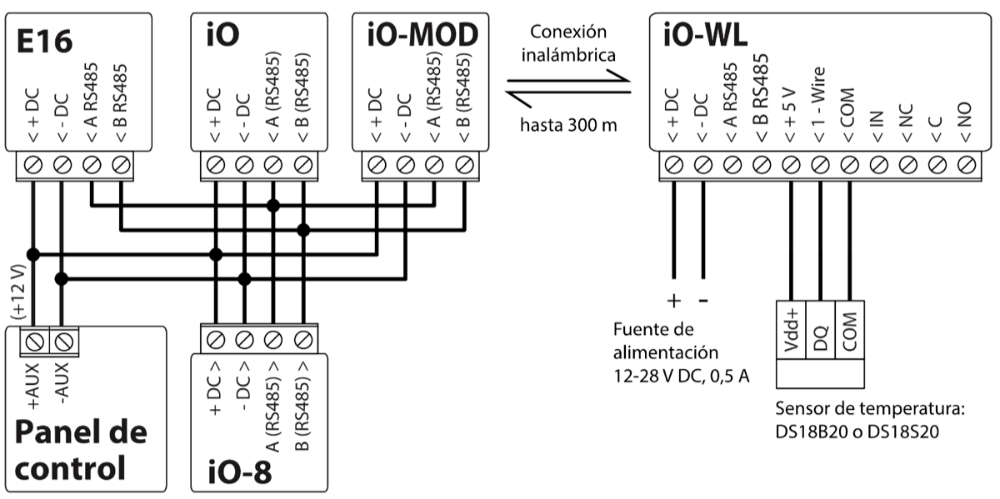

### Cambiando en la fuente de alimentación para el panel de control

Prenda la fuente de alimentación del panel de control. El indicador de luz LED en el comunicador E16 debe mostrar:

- El LED de “POWER” se iluminará de color verde cuando se encuentre prendido;

- El LED de “NETWORK” se iluminará de color verde cuando se registre a una red.

!!! note
    Si la indicación de luz es diferente, consulte la sección 1.5 "LED
    indicator de operación" para determinar qué sucede. Si la indicación
    E16 no está encendida, verifique la fuente de alimentación y las
    conexiones.
## Programando el panel de control para leer eventos y tener control directo

A continuación, se describirá cómo programar los paneles de control para que el comunicador E16 puede leer eventos del panel y pueda controlarlo de forma remota.

Para habilitar el control remoto del panel de control, asegúrese que la casilla de Armado/Desarmado Remoto se encuentre seleccionada en la ventana de “configuración del sistema” de TrikdisConfig.

### DSC

Los paneles DSC no necesitan ser programados.

### PARADOX

Los paneles de control de Paradox necesitan ser programados sólo para control directo con Protegus. No necesita programar los paneles de Paradox para que puedan leer eventos.

Para el control remoto de los paneles de Paradox, usted necesita establecer la contraseña de descarga de la computadora. Esta contraseña debe ser igual a la contraseña que fue establecida en la ventana de “configuración del sistema” de TrikdisConfig, cuando la casilla a un lado de Armado/Desarmado Remoto fue seleccionada.

Para establecer esta contraseña, con el teclado conectado al panel de control:

- Para las series MAGELLAN, SPECTRA: vaya a la celda 911 e ingrese la contraseña de cuatro dígitos de la descarga de computadora.

- Para las series DIGIPLEX EVO: vaya a la celda 3012 e ingrese la contraseña de cuatro dígitos de la descarga de computadora.

### TEXECOM

Los paneles de control de Texecom necesitan ser programados para leer eventos y tener control remoto.

Usted necesita establecer el código UDL del panel de Texecom. Esta contraseña debe ser igual a ala contraseña que fue establecida en la ventana de “Ajustes del sistema”, cuando la casilla a un lado de Armado/Desarmado remoto fue seleccionada.

El panel de control puede ser programado con el software de Texecom – Wintex. Ingrese el código UDL (4-digitos) en la ventana de Opción de Comunicación, en la pestaña de Opciones.

También, puede programar con el teclado conectado al panel de control:

1.  Ingrese el código de 4-digitos del instalador y presione el botón de [Menu} para entrar al menú de programación.

2.  Presione el [9] inmediatamente después de esto.

3.  Presione [7][6], y luego [2]. Ingrese el código UDL de 4-digitos (el código UDL debe ser igual a la contraseña de inicio de sesión de la computadora para el comunicador E16).

4.  Presione [Yes] y salgase del modo de programación presionando [Menu].

### UTC INTERLOGIX (CADDX)

La versión del panel de control debe ser el V2 o mayor. Con el teclado conectado al panel de control:

1.  Presione [\*][8] e ingrese el código del instalador (por defecto es – 9713).

2.  Ingrese el número del dispositivo asignado al comunicador conectado (por defecto – 0).

3.  Establezca la configuración de abajo para cada fila. En secuencia, presione la posición, número del segmento e ingrese la configuración requerida. Si da clic [\*][asterisco] usted regresará al campo de entrada local.

| Posición | Segmento | Configuración |
|----------|----------|---------------|
| 23 | 3 | 12345678 |
| 37 (no es necesario) | 3 | 12345678 |
| 37 (no es necesario) | 4 | 1234567* |
| 90 | 3 | 12345678 |
| 93 | 3 | 12345678 |
| 96 | 3 | 12345678 |
| 99 | 3 | 12345678 |
| 102 | 3 | 12345678 |
| 105 | 3 | 12345678 |
| 108 | 3 | 12345678 |

Después de haber programado todos los campos enlistados, presione [Exit] dos veces para salir del modo de programación.

### INNERRANGE

La versión del panel de control de Innerrange Inception debe ser el 2.3.0.3507-r0 o mayor.

El panel de control debe estar conectado al internet. Conéctese con Innerrange Inception al ingresar en: <https://skytunnel.com.au/inception/SERIALNUMBER>, donde el NÚMERO SERIAL es el número del controlador que podrá encontrar en la cubierta del panel.

Abra la ventana de Configuración > General > Reporte de Alarmas. En la configuración de Reporte de Dispositivos de Terceras partes usted necesita ingresar:

1.  Habilitar Reporte de Dispositivos de Terceras partes – seleccione esta casilla.

2.  Tipo de Dispositivo de Terceras partes – establezca “Trikdis”.

3.  Puerto serial – establezca “Puerto Serial 1 (conectado, en uso por un dispositivo de una Tercera parte)”.

4.  Guarde la configuración y salgase de la aplicación.

El panel de alarma **Innerrange Integriti** debe tener firmware **19.1.0.36608** o mayor, firmware profesional **19.1.0.15396** o mayor.

Especifique el protocolo de comunicación Trikdis en el programa de configuración del panel de alarma. Formato de datos - Contact ID. El puerto (TTL Port-0) del panel de alarma, al que está conectado el comunicador E16, tiene la configuración 19200, 8, N, 1. Guarde la configuración y salga del programa.

### Honeywell Ademco Vista

Siga estos pasos para los paneles **Honeywell Ademco Vista-20 y Honeywell Ademco Vista-48**. La versión del firmware del panel debe ser V5.3 o superior.  Con un teclado que está conectado al panel:

1.  Entrar en el modo de programación. Ingrese el código del instalador [4] [1] [1] [2] y luego [8] [0] [0]. Alternativamente, encienda la fuente de alimentación del panel. En 50 segundos después de encender la fuente de alimentación, presione los botones [\*] y [#] al mismo tiempo (este método puede usarse cuando se salió del modo de programación presionando el teclado [\*] [9] [8]).

2.  Active el envío de información de Contacto ID del evento a través de LRR. Presione [\*] [2] [9] [1] [#] en el teclado.

3.  Cuando use la función „Armar/Desarmar Remoto“, permita usar la segunda dirección AUI. En el teclado, presione [\*] [1] [8] [9] [1] [1] [#].

4.  Salga del modo de programación. En el teclado presione [\*] [9] [9].  

### Crow

No es necesario programar los paneles Crow Runner 4/8 y Runner 8/16.

##  Conectado el comunicador a la app Protegus2

Con Protegus2, los usuarios podrán controlar su sistema de alamas de forma remota. Podrán ver el estado del sistema y recibir notificaciones sobre eventos del sistema. Protegus2 funciona con sistemas de seguridad de otras marcas, que soportan el comunicador E16.

1.  Descargue y abra la aplicación Protegus2 o utilice la versión de navegador de internet: [www.protegus.app](https://www.protegus.app):

    

      
      
      
    

2.  Inicie sesión con su nombre de usuario y contraseña o regístrese para crear una nueva cuenta.
3. De clic en "Añadir nuevo sistema" un nuevo sistema e ingrese la dirección MAC *E16*. Este número puede ser encontrado en el dispositivo y en la etiqueta del empaque. Haga clic en "Siguiente".

2.  Ingrese el nombre del sistema. Haga clic en el botón "Siguiente".

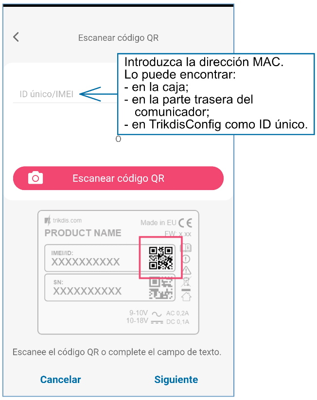

!!! note
    Al agregar E16 a Protegus2, revise si:
    
    1.  La servicio Protegus está activada. Podrá encontrar
        información sobre como activar la nube en la sección 6.4 Ventana de
        "Informes para Usuario".
    
    2.  La fuente de alimentación está conectada (el LED de "POWER" debe
        iluminarse de color verde);
    
    3.  Estar registrado en la red (el LED de "NETWORK de iluminarse de
        color verde).
### Configuraciones adicionales para armar/desarmar el sistema con la zona keyswitch

!!! note
    La zona de panel de control, donde la salida del E16 se encuentra
    conectada, tiene que ser establecida a modo de keyswitch.
Siga las instrucciones de abajo si el panel de control no será controlado de forma directa, pero con la salida del E16 PGM, prendiendo/apagando el panel de control de la zona de keyswitch.

1.  Haga clic en el botón "**Continuar**".

2. Ingrese "**Nombre de partición**". Habilite el control de salida PGM mediante la aplicación Protegus2.

2.  Seleccione “**Pulso**” o “**Nivel**”, dependiendo de cómo esté configurado el tipo de zona del interruptor de llave. Si es necesario, puede cambiar el intervalo de pulso.

3.  Haga clic en el botón "**Guardar**".

4. Si hay otra sección de alarmas de seguridad, debes hacer clic en “**Haga clic para agregar una partición**”. La configuración de la salida PGM es similar a la descrita anteriormente.

2.  Después de completar la configuración, haga clic en el botón "**Saltar**".

### Control del sistema con Protegus2 

1.  Haga clic en el icono de estado del sistema "Desarm".

2.  *Protegus2* recibirá un mensaje sobre el cambio en el estado del sistema de seguridad y el ícono de estado cambiará de estado.

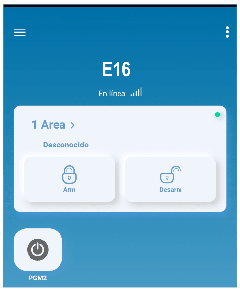

## Descripción de la ventana de TrikdisConfig 

### Barra de Estado 

Después de conectar E16 y haciendo clic en **Leer [F4]**, TrikdisConfig proporcionará información sobre el dispositivo conectado en la barra de estado.

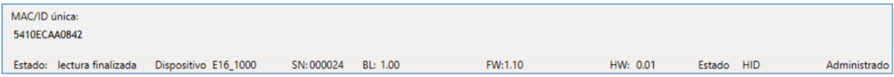

**Barra de Estado**

| Nombre | Descripción |
|----|----|
| MAC/​ID única | Número MAC del dispositivo |
| Estado | Estado de acción |
| Dispositivo | Tipo de dispositivo (E16) |
| SN | Número de serie |
| BL | Versión del cargador de arranque |
| FW | Versión de firmware |
| HW | Versión del hardware |
| Estado | Estado de conexión |
| Administrador | Nivel de acceso (aparece después de que sea confirmado el código de acceso) |

Después de pulsar **Leér [F4]**, el programa leerá y mostrará los ajustes, que se establecen en E16. Establecerá los ajustes necesarios de acuerdo con las descripciones de las ventanas del TrikdisConfig las cuales se dan a continuación.

### Ventana de “Ajustes del sistema” 

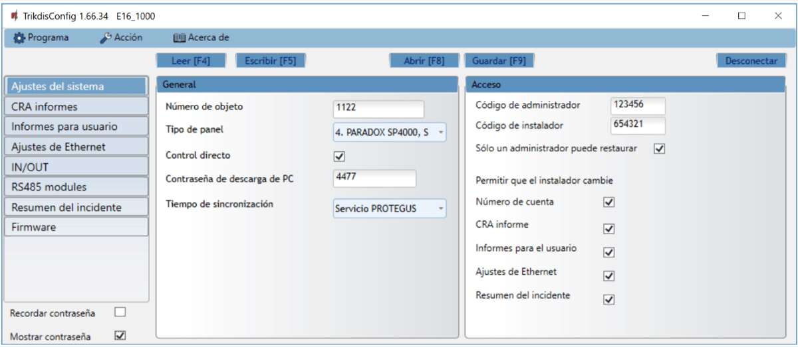

**Grupo de opciones “General”**

- Ingrese el ID del objeto (número de 4 caracteres hexadecimales, provistos por el CRA. **No utilice números de objeto FFFE, FFFF.**).

- Seleccione el **Tipo de panel** con el que se conectará al comunicador.

- **Control directo** – cuando la casilla haya sido seleccionada, el E16 controlará de forma remota y directa el panel de control. Esta opción será visible sólo para los paneles controlados de forma directa. Para un control directo de los paneles de control, usted necesita cambiar la configuración del panel, como se describe en la sección 4, “Programando el panel de control para leer eventos y control directo”.

- **Contraseña de descarga de PC** – para tener un control directo de los paneles de control de Paradox y Texecom usted deberá ingresar la contraseña PC/UDL. Debe ser igual a la contraseña que fue ingresada en el panel de control. El cómo cambiar la contraseña está descrito en la sección 4 “Programando el panel de control para leer notificaciones y tener control directo”.

- **Tiempo** **de sincronización** – establezca el tiempo de sincronización (el comunicador usará el tiempo del servidor seleccionado).

**Grupo de opciones de “Acceso”**

Al configurar el comunicador E16 hay dos niveles de acceso para el administrador e instalador:

- **Código de administrador** – permite el acceso a los campos de configuración.

- **Código de instalador** – acceso limitado para configurar el comunicador.

- **Sólo un administrador puede restaurar -** si esta casilla ha sido seleccionada, las configuraciones de fábrica pueden ser restauradas con tan sólo ingresar el código del administrador.

- **Permitir que el instalador cambie** – puede especificar que opciones pueden ser cambiadas por el instalador.

!!! note
    Los códigos de Administrador y de Instalador deben consistir de 6
    dígitos o caracteres en latín.
### Ventana de “CRA informes”

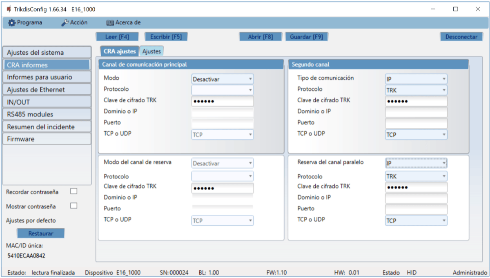

**Pestaña de parámetros “CRA ajustes”**

Los eventos pueden ser enviados a través de varios canales de comunicación. Los primeros y segundos canales de comunicación pueden ser operados de forma simultánea y el comunicador puede enviar eventos a dos receptores al mismo tiempo. El canal de respaldo puede ser asignado para los primeros y segundos canales, los cuales serán usados cuando la conexión al canal primario es interrumpida.

La comunicación está codificada y está protegida por una contraseña. El receptor TRIKDIS es requerido para recibir y enviar información de evento a los software de monitoreo:

- **Para conectarse a través de IP** – software receptor IPcom Windows/Linux, hardware IP/SMS receptor RL14 o receptor multicanal RM14.

**Grupo de opciones del “Canal de comunicación principal”**

- **Modo** – seleccione que método de conexión será usado: IP.

- **Protocolo** – seleccione en que tipo de código serán enviados los eventos: TRK (a receptor TRIKDIS), DC-09_2007 o DC-09_2012 (a receptores universales); TL150 (a receptor SUR-GARD).

- **Clave de cifrado TRK** – Ingrese la llave de encriptación que está establecida en el receptor.

- **Dominio o IP** – ingrese la dirección del dominio o IP del receptor.

- **Puerto** – ingrese el número del puerto de la red.

- **TCP o UDP** – seleccione en que protocolo (TCP o UDP) deberían ser enviados los eventos.

**Grupo de opciones de “Segundo canal”**

Los eventos de este canal son transmitidos en paralelo con el primer canal. Cuando el segundo canal es habilitado, los eventos pueden ser enviados de forma simultanea por dos receptores (por ejemplo., estaciones de monitoreo local y centralizado) Las opciones del canal paralelo son las mismas que las descritas anteriormente.

Grupo de opciones de “Modo del canal de reserva”

Habilite el modo de respaldo de canal para enviar eventos a través de canales de respaldo si la conexión se ha perdido. Las opciones de los canales de respaldo son las mismas que las descritas arriba.

**Pestaña de “Ajustes”**

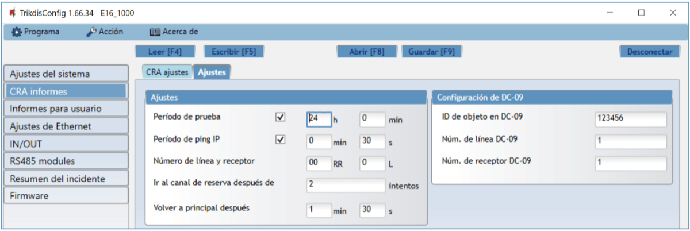

**Grupo “Ajustes”**

- **Periodo de prueba** – el periodo de evento de PRUEBA para la prueba de la conexión. Los eventos de prueba son enviados como mensajes de Contacto ID y son reenviados al software de monitoreo.

- **Periodo de ping IP** – periodo para enviar corazonadas PING internas. El receptor no reenviara los mensajes PING al software de monitoreo para evitar sobre cargarlo. Las notificaciones sólo serán enviadas al software de monitoreo si el receptor falla en recibir los mensajes PING del dispositivo dentro de un lapso de tiempo establecido.

Por defecto, la notificación de “Conexión perdida” será transmitida al software de monitoreo si el mensaje PING no es recibido en el receptor en tiempos mayores al establecido en el dispositivo. Por ejemplo, si el PING es establecido para 3 minutos, el receptor transferirá la notificación de “Conexión perdida” si no recibe un PING en los próximos 9 minutos.

Las corazonadas de PING mantienen la sesión activa de comunicación entre el dispositivo y el receptor. Una sesión activa es requerida para conexiones remotas, control y configuración del dispositivo. Recomendamos establecer un periodo de PING no mayor a 5 minutos.

- **Ir al canal de reserva después de intentos** – indica el número de intentos fallidos al tratar de enviar el mensaje a través del canal primario. Si es dispositivo falla en la transmisión un número especifico de veces, el dispositivo se conectará para transmitir el mensaje a través del canal de Respaldo.

- **Volver a principal después** – tiempo en el que después el E16 intentará reconectarse y transmitir mensajes a través de un canal Primario.

**Grupo de opciones de “Configuración DC-09”**

Las opciones son mostradas cuando el protocolo DC-09_2007 o DC-09_2012 es establecido en el campo de Protocolo del canal de comunicación para enviar eventos a los receptores universales.

- **ID de objeto en DC-09** – ingrese el número del objeto. Si la codificación DC-09 es seleccionada, el número del objeto ingresado en el campo será usado. Se puede ingresar un número hexadecimal de 3 a 16 caracteres. El número es provisto por el centro de recibimiento de alarmas.

- **Núm. de línea DC-09** – ingrese el número de línea en el receptor.

- **Núm. de receptor DC-09** - ingrese el número del receptor.

### Ventana de “Informes para usuario” 

**Pestaña de la “Servicio Protegus”**

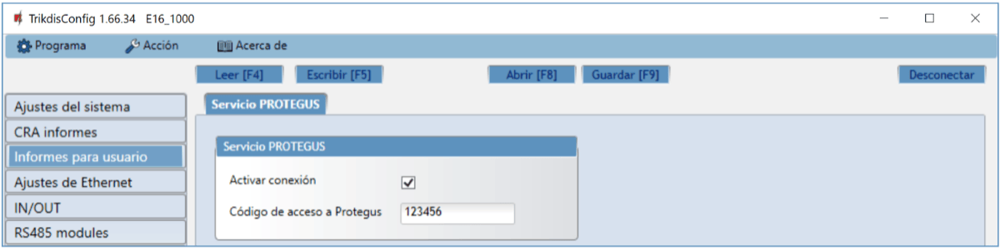

- **Activar conexión** – permita que el comunicador se conecte a la nube de Protegus2.

- **Código de acceso a Protegus** – aquí puede cambiar la contraseña para conectarse al servidor de Protegus (por defecto esta es – 123456). Si la contraseña ha sido cambiada usted tendrá que reingresarla cuando agregue el sistema en la app de Protegus2. Esta es una medida de seguridad adicional.

### Ventana de “Adjustes de Ethernet“ 

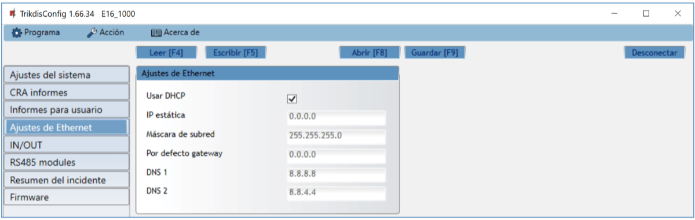

**Grupo de opciones de “Adjustes de Ethernet”**

- **Use DHCP** – marque la casilla para que el comunicador se registre automáticamente en la red. Si el registro automático falla, deberá ingresarlo manualmente:
- **IP estática** – dirección IP del comunicador.

- **Máscara de subred** – máscara de subred.

- **Por defecto gateway** – para conectarse a internet.
- **DNS1, DNS2** – (Sistema de Nombre de Dominio) identifica el servidor que especifica la dirección IP del dominio. Usada cuando el dominio está establecido en el campo de canal de comunicación de Dominio o IP (no dirección IP). Las opciones por defecto son direcciones de servidores DNS establecidas por Google.

### Ventana de “IN/OUT“

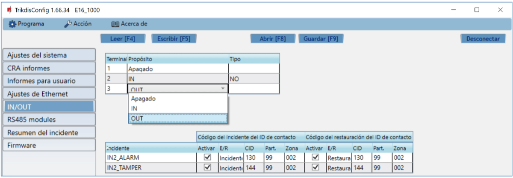

El comunicador tiene 3 terminales universales (entrada/salida). La tabla puede configurar el modo de funcionamiento del terminal (Apagado, IN, OUT). La entrada debe especificar el tipo de circuito a conectar NC, NO, NO / EOL, NC / EOL, NO / DEOL, NC / DEOL.

Se pueden conectar sensores adicionales a las entradas del comunicador. Cuando se activa el sensor, el comunicador enviará un mensaje de evento. A la entrada se le asigna un código de Contact ID, que se enviará a CRA y Protegus2.

- **Activar** – verifique los campos del evento donde se enviarán los mensajes a CRA y Protegus2.

- **E/R** – especifique la condición de envío del evento interno del comunicador (Evento o Restablecimiento).

- **CID** – código de evento.

- **Part**. – ingrese el número de área que se enviará cuando ocurra el evento interno y se reinicie el sistema.

- **Zona** - ingrese el número de zona que se enviará cuando ocurra el evento interno y el sistema se reinicie.

### Ventana de “RS485 modules”

El comunicador se puede conectar a un expansor de la serie iO para agregar entradas adicionales, salidas controladas y un bus para sensores de temperatura. Los extensores conectados deben incluirse en la tabla Lista de módulos.

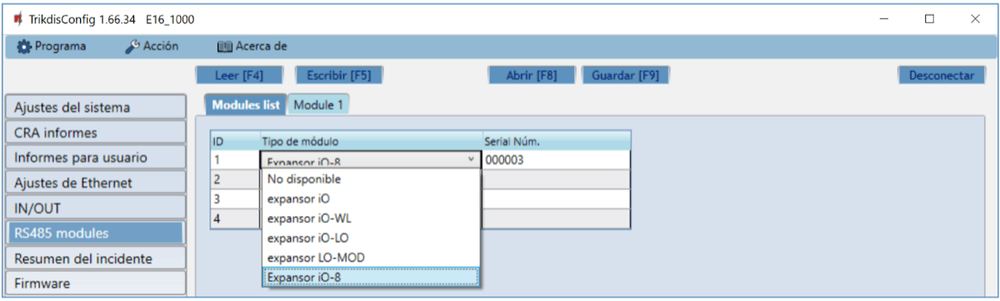

Grupo de opciones de “Modules list”

- **ID** – número del módulo en la lista.

- **Tipo de Módulo** – seleccione el módulo que usted utiliza de la lista de módulos.

- **Serial Núm.** – número compulsorio de 6 dígitos, el cual está indicado en la etiqueta en la cuja del módulo y en el paquete.

Vaya a los **RS485 modules** → **Module 1**.

**Pestañas “Module 1”**

Después de añadir el expansor al comunicador como se ha descrito en el párrafo anterior, en la ventana de los **RS485 modules** aparecerá una nueva pestaña con los ajustes de este módulo. A la pestaña se le asignará un número. A continuación se describen los ajustes para los expansores de las series iO-8 e iO.

#### Ventana de ajustes del expansor iO-8

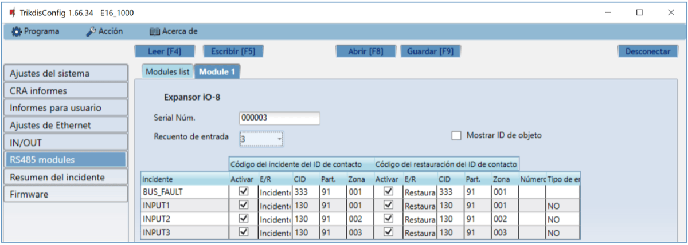

El expansor iO-8 tiene 8 contactos de terminal universales (entrada/salida). Se pueden conectar hasta cuatro expansores iO-8.

- **Recuento de entrada -** seleccione el número de contactos de la terminal que deben configurarse en modo de entrada (IN). El resto de los contactos de la terminal se convertirán en salidas (OUT).

Los ajustes para las salidas controlables se establecen directamente en la aplicación Protegus2. Allí se puede asignar una salida para armar/desarmar el sistema de alarma o para el control remoto de los dispositivos.

En la tabla se pueden asignar entradas de eventos de Contacto ID y códigos de restauración. Después de que se activa la entrada, el comunicador enviará un evento con el código de evento establecido al receptor en el CRA, a la aplicación Protegus2.

**Código del incidente del ID de contacto:**

- **Activar -** permite la transmisión de mensajes cuando se activa la entrada.

- **E/R -** elija qué tipo de evento se enviará cuando se active la entrada, **Evento** o **Restaurar**.

- **CID -** asigne un código de evento de ID de contacto a la entrada.

- **Part. -** asigne la partición (área) a la entrada. Esta se ajusta automáticamente: si el número de módulo es 1, la superficie es 91; si el número de módulo es 4, la superficie es 94.

- **Zona -** establezca el número de zona para la entrada.

**Código del restauración del ID de contacto:**

- **Activar -** permite la transmisión de mensajes cuando se restaura la entrada.

- **E/R -** elija qué tipo de evento se enviará cuando se restaure la entrada, **Restaurar** o **Evento**.

- **CID -** asigne un código de restauración del ID de contacto a la entrada.

- **Part. -** asigne la partición (área) a la entrada. Esta se ajusta automáticamente: si el número de módulo es 1, la superficie es 91; si el número de módulo es 4, la superficie es 94.

- **Zona -** establezca el número de zona para la entrada.

- **Tipo de entrada -** seleccione el tipo de entrada (NO o NC).

**Ventana de ajustes del expansor iO**

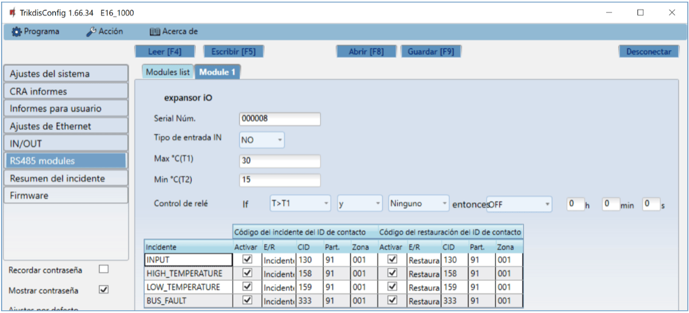

El expansor iO dispone de: terminales para 1 entrada, 1 salida (contactos de relé) y bus serie 1-Wire para la conexión de sensores de temperatura.

La salida del relé se puede controlar según las condiciones lógicas (Y, OR, XOR).

- **Tipo de entrada IN -** ajuste el tipo de entrada (NO o NC).

- **Max ºC (T1) -** cuando la temperatura es superior a esta configuración, se genera un mensaje de evento. Para que se genere un mensaje de evento, éste debe estar habilitado en la tabla.

- **Min ºC (T2**) - cuando la temperatura es inferior a esta configuración, se genera un mensaje de evento. Para que se genere un mensaje de evento, éste debe estar habilitado en la tabla.

- **Control de relé -** ajuste las condiciones lógicas (Y, OR, XOR) en las que se controlará la salida de relé.

En la tabla se pueden asignar entradas de eventos de Contacto ID y códigos de restauración. Después de que se activa una entrada, el comunicador enviará un evento con el código de evento establecido al receptor en el CRA y a la aplicación Protegus2. Ajuste la configuración como se describe en la página anterior acerca de la **Ventana de ajustes del expansor iO-8**.

### Ventana de “Resumen del incidente”

Esta ventana le permitirá prender, apagar y modificar los mensajes internos enviados por su dispositivo. Deshabilitar el mensaje interno en esta ventana prevendrá que sea enviado a pesar de otras opciones.

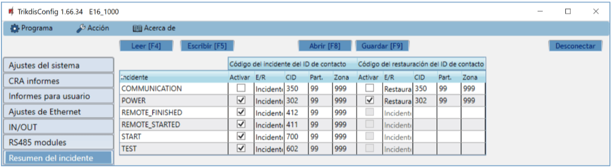

- **COMMUNICATION** – mensaje de falla de comunicación entre el panel de control y E16.

- **POWER** – aviso de baja tensión de red.

- **REMOTE_STARTED** – mensaje de inicio de sesión remoto para configurar E16 con TrikdisConfig.

- **REMOTE_FINISHED** – mensaje sobre desconexión de configuración remota con TrikdisConfig.

- **START** – mensaje sobre la conexión del E16 a la red.

- **TEST** – mensaje de prueba periódica.

!!! note
    Para habilitar los mensajes de PRUEBA periódicos y establecer el
    período, vaya a la ventana "**CRA informes**" **→ Ajustes → Período de
    prueba.**
- **Activar** – marque la casilla para habilitar el envío de mensajes.

Puede cambiar el código de identificación de contacto para cada evento, así como el número de zona y área que se informará.

### Restablecer la configuración de fábrica

Para restablecer el comunicador a la configuración de fábrica, presione el botón **Restaurar** en ***TrikdisConfig*.**

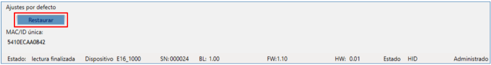

## Configuración Remota

!!! note
    La configuración remota sólo funcionará sí:
    
    1.  La servicio Protegus está activada. Podrá encontrar
        información sobre como activar la nube en la sección 6.4 Ventana de
        "Informes para Usuario".
    
    2.  La fuente de alimentación está conectada (el LED de "POWER" debe
        iluminarse de color verde);
    
    3.  Estar registrado en la red (el LED de "NETWORK de iluminarse de
        color verde).
1.  En su PC abra el software de configuración de TrikdisConfig.

2.  En la sección de acceso remoto ingrese la dirección MAC del comunicador. Este dirección puede ser encontrado en el dispositivo y en la etiqueta del empaque.

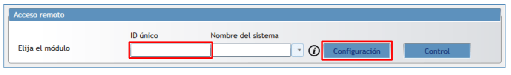

3. (Opcional) en el espacio del nombre de Sistema ingrese el nombre deseado para el comunicador.

2.  Presione **Configuración**.

3.  En la nueva ventana de clic en **Leer [F4].**

4.  A petición, ingrese el código del administrador o instalador. Para guardar la contraseña, seleccione “Recordar contraseña” en la ventana principal.

5.  Establezca las opciones deseadas y presione **Escribir [F5].**

## Desempeño de la Prueba del Comunicador

Después de que la configuración y la instalación hayan sido completadas, lleve a cabo una prueba de sistema:

Genere un evento:

1.  Asegúrese de que la alimentación esté encendida.

2.  Verifique la conexión de red (el indicador de NETWORK es verde).

3.  Generar un evento:

- Armando y desarmando sistemas de seguridad;

- Activando una alarma de zona cuando el sistema de seguridad esté armado.

1.  Verifique que los eventos hayan sido recibidos por la Central Monitoring Station y / o el dispositivo Protegus2.

2.  Para probar la entrada del comunicador, ajuste el comunicador y verifique que los destinatarios reciban los mensajes correctos.

3.  Para probar las salidas del comunicador, enciéndalas de forma remota y verifique su funcionamiento.

4.  Si usa un panel de control remoto, active y desactive el modo de control del panel de forma remota con el applet Protegus2.

## Actualización del firmware

!!! note
    Cuando el comunicador esté conectado a TrikdisConfig, el programa
    ofrecerá actualizar el firmware del dispositivo si es que hay alguna
    actualización disponible. Las actualizaciones requieren una conexión al
    internet. / Si hay un antivirus instalado en su computadora, puede que
    este bloquee la opción de actualización de firmware. En este caso usted
    debe reconfigurar su software de antivirus.
El firmware del comunicador puede ser actualizado o cambiado de forma manual. Después de una actualización, el comunicador mantendrá cualquier opción establecida. Cuando escriba el firmware de forma manual, este puede ser cambiado a una versión más reciente o antigua. Para actualizar:

1.  Abra ***TrikdisConfig**.*

2.  Conecte el comunicador a través de cable USB a la computadora o conéctese al comunicador de forma remota.

    - Si existe una versión más nueva del firmware, el software ofrecerá descargar el archivo de la versión más nueva del firmware.

3.  Seleccione la parte de Firmware del menú.

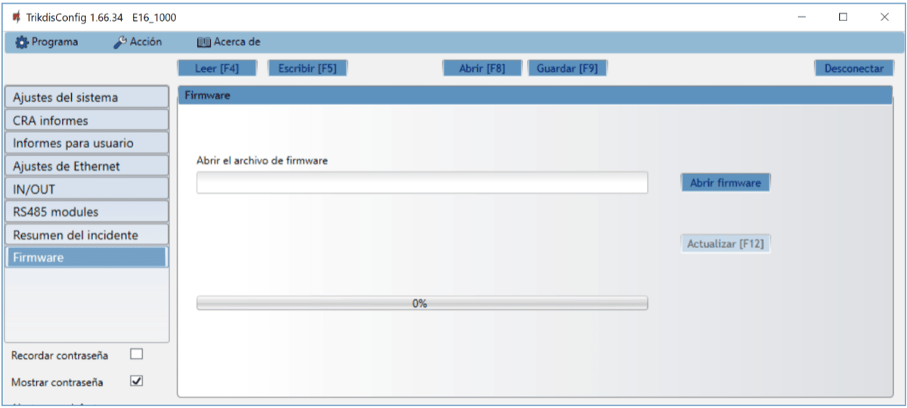

4. Presione Abrir firmware y seleccione el archivo de firmware requerido. Si no tiene el archivo, el archivo de la versión más nueva del firmware puede ser descargado por usuario registrado desde [www.trikdis.com](http://www.trikdis.com), bajo la sección de descargar del comunicador E16.

2.  Presione **Actualizar [F12]**.

3.  Espere a que se complete la actualización.

## Requerimientos de Seguridad

El sistema de alarma de seguridad deberá ser instalado y mantenido por personal calificado.

Antes de la instalación, por favor lea con cuidado este manual, para poder evitar cualquier error que lleve al mal funcionamiento o incluso daño del equipo.

Desconecte la fuente de alimentación antes de hacer cualquier conexión eléctrica.

Los cambios, modificaciones o reparaciones no están autorizadas por el fabricante, y esto eliminará sus derechos a una garantía.

Por favor actúe de acuerdo a sus reglas locales y no se deshaga de su sistema de alarma sin uso o sus componentes con otro desecho normal de su casa.

## Anexo

El comunicador puede funcionar con un receptor SUR-GARD. El comunicador recibidos desde panel de alarma los códigos de Contacto ID convierte a códigos SIA.

**Tabla de conversión de los códigos Contacto ID a código SIA**

| **Evento del sistema** | **Código de informe CID** | **Código de informe de SIA** |
|----|:--:|:--:|
| Alarma médica | E100 | "MA" |
| Emergencia personal | E101 | "QA" |
| Incendio en la zona: <z> | E110 | "FA" |
| Flujo de aguas detectado en la zona: <z> | E113 | "SA" |
| Alarma de la estación manual en la zona: <z> | E115 | "FA" |
| Pánico en la zona: <z> | E120 | "PA" |
| Alarma de pánico por el usuario: <v> | E121 | "HA" |
| Alarma de pánico en la zona: <z> | E122 | "HA" |
| Alarma de pánico en la zona: <z> | E123 | "PA" |
| Alarma de pánico en la zona: <z> | E124 | "HA" |
| Alarma de pánico en la zona: <z> | E125 | "HA" |
| Alarma activa en la zona: <z> | E130 | "BA" |
| Alarma activa en la zona: <z> | E131 | "BA" |
| Alarma activa en la zona: <z> | E132 | "BA" |
| Alarma activa en la zona: <z> | E133 | "BA" |
| Alarma activa en la zona: <z> | E134 | "BA" |
| Alarma activa en la zona: <z> | E135 | "BA" |
| Tamper activo en la zona: <z> | E137 | "TA" |
| Intrusión verificada en la zona: <z> | E139 | "BV" |
| Alarma activa en la zona: <z> | E140 | "UA" |
| Fallo del sistema (143) | E143 | "UA" |
| Tamper activo en la zona: <z> | E144 | "TA" |
| Tamper activo en la zona: <z> | E145 | "TA" |
| Alarma activa en la zona: <z> | E146 | "BA" |
| Alarma activa en la zona: <z> | E150 | "UA" |
| Gas detectado en la zona: <z> | E151 | "GA" |
| Pérdida de agua detectada en la zona: <z> | E154 | "WA" |
| Foil Rotura detectado en la zona: <z> | E155 | "BA" |
| Alta temperatura en el sensor: <n> | E158 | "KA" |
| Baja temperatura en el sensor: <n> | E159 | "ZA" |
| CO detectado en la zona: <z> | E162 | "GA" |
| Falla en zona de fuego: <z> | E200 | "FS" |
| Monitoreo de alarma | E220 | "BA" |
| Fallo del sistema (300) | E300 | "YP" |
| Pérdida de fuente de alimentación AC | E301 | "AT" |
| Batería baja | E302 | "YT" |
| Fallo del sistema (304) | E304 | "YF" |
| Reiniciar sistema en zona: <z> | E305 | "RR" |
| Programación del panel modificada | E306 | "YG" |
| Apagado del sistema | E308 | "RR" |
| Fallo en la batería (309) | E309 | "YT" |
| Fallo de toma a tierra | E310 | "US" |
| Fallo en batería (311) | E311 | "YM" |
| Sobrecarga en fuente de alimentación (312) | E312 | "YP" |
| Restablecimiento del ingeniero por usuario: <v> (313) | E313 | "RR" |
| Fallo en Sirena/Relé | E320 | "RC" |
| Fallo del sistema (321) | E321 | "YA" |
| Fallo del sistema (330) | E330 | "ET" |
| Fallo del sistema (332) | E332 | "ET" |
| Fallo del sistema (333) | E333 | "ET" |
| Fallo del sistema (336) | E336 | "VT" |
| Fallo del sistema (338) | E338 | "ET" |
| Fallo del sistema (341) | E341 | "ET" |
| Fallo del sistema (342) | E342 | "ET" |
| Fallo del sistema (343) | E343 | "ET" |
| Fallo del sistema (344) | E344 | "XQ" |
| Fallo de comunicación del sistema (350) | E350 | "YC" |
| Fallo de comunicación del sistema (351) | E351 | "LT" |
| Fallo de comunicación del sistema (352) | E352 | "LT" |
| Fallo del sistema (353) | E353 | "YC" |
| Fallo de comunicación del sistema (354) | E354 | "YC" |
| Fallo del sistema (355) | E355 | "UT" |
| Problema de fuego en zona: <z> | E373 | "FT" |
| Problema en la zona: <z> | E374 | "EE" |
| Problema en la zona: <z> | E378 | "BG" |
| Problema en la zona: <z> | E380 | "UT" |
| Avería en zona inalámbrica: <z> | E381 | "US" |
| Fallo del módulo inalámbrico (382) | E382 | "UY" |
| Tamper activo en la zona: <z> | E383 | "TA" |
| Batería baja en zona inalámbrica: <z> | E384 | "XT" |
| Problema en la zona: <z> (389) | E389 | "ET" |
| Problema en la zona: <z> (391) | E391 | "NA" |
| Problema en la zona: <z> (393) | E393 | "NC" |
| Usuario <v> desarmó el sistema | E400 | "OP" |
| Usuario <v> desarmó el sistema | E401 | "OP" |
| Desarme automático | E403 | "OA" |
| Desarmado diferido <v> usuario | E405 | "OR" |
| Alarma cancelada por el usuario: <v> | E406 | "BC" |
| Usuario <v> desarmó de forma remota | E407 | "OP" |
| Usuario <v> armó rápido | E408 | "OP" |
| Desarmado remoto | E409 | "OS" |
| Solicitud de devolución de llamada realizada por CRA | E411 | "RB" |
| Descarga de datos realizada con éxito | E412 | "RS" |
| Acceso denegado para el usuario: <v> | E421 | "JA" |
| Entrada por usuario <v> | E422 | "DG" |
| Acceso Forzado <z> zona | E423 | "DF" |
| Acceso de salida denegado para el usuario <v> | E424 | "DD" |
| Salida usuario <v> | E425 | "DR" |
| Usuario <v> desarmó demasiado pronto | E451 | "OK" |
| Usuario <v> armó el sistema demasiado tarde | E452 | "OJ" |
| Usuario <v> Falló al abrir | E453 | "CT" |
| Usuario <v> Falló al cerrar | E454 | "CI" |
| Auto armado fallido | E455 | "CI" |
| Armado parcial por el usuario: <v> | E456 | "CG" |
| Violación de salida por usuario: <v> | E457 | "EE" |
| Armado parcial por el usuario: <v> | E458 | "OR" |
| Recent arm <v> user | E459 | "CR" |
| Introducido código incorrecto | E461 | "JA" |
| Tiempo de auto-armado ampliado por usuario: <v> | E464 | "CE" |
| Dispositivo deshabilitado (501) | E501 | "RL" |
| Dispositivo deshabilitado (520) | E520 | "RO" |
| Sensor inalámbrico deshabilitado en la zona: <z> (552) | E552 | "YS" |
| Zona <z> anulada | E570 | "UB" |
| Zona <z> anulada | E571 | "FB" |
| Zona <z> anulada | E572 | "MB" |
| Zona <z> anulada | E573 | "BB" |
| Anulación de grupo por usuario: <v> | E574 | "CG" |
| Zona <z> anulada | E576 | "UB" |
| Bypass en zona <z> cancelado | E577 | "UB" |
| Ventilación de zona anulada | E579 | "UB" |
| Prueba de recorrido activada por usuario <v> | E607 | "TS" |
| Informe de prueba manual | E601 | "RX" |
| Informe de test periódico | E602 | "RP" |
| Evento del sistema (605) | E605 | "JL" |
| Evento del sistema (606) | E606 | "LF" |
| Problema en el informe de test periódico | E608 | "RY" |
| Evento del sistema (622) | E622 | "JL" |
| Evento del sistema (623) | E623 | "JL" |
| Hora y fecha restablecida por usuario <v> | E625 | "JT" |
| Fecha/hora inexacta | E626 | "JT" |
| Programación de sistema iniciada | E627 | "LB" |
| Programación del sistema terminada | E628 | "LS" |
| Evento del sistema (631) | E631 | "JS" |
| Evento del sistema (632) | E632 | "JS" |
| Sistema no activo (654) | E654 | "CD" |
| Alarma médica restaurada | R100 | "MH" |
| Emergencia personal restaurada | R101 | "QH" |
| No más alarma de incendio en la zona: <z> | R110 | "FH" |
| No más alarma de flujo de aguas en la zona: <z> | R113 | "SH" |
| Alarma de pánico restablecida en la zona: <z> | R120 | "PH" |
| Alarma de pánico cancelada por el usuario: <v> | R121 | "HH" |
| Alarma de pánico restablecida en la zona: <z> | R122 | "PH" |
| Alarma de pánico restablecida en la zona: <z> | R123 | "PH" |
| Alarma de pánico restablecida en la zona: <z> | R124 | "HH" |
| Alarma de pánico restablecida en la zona: <z> | R125 | "HH" |
| No más alarma en la zona: <z> | R130 | "BH" |
| No más alarma activa en la zona: <z> | R131 | "BH" |
| No más alarma activa en la zona: <z> | R132 | "BH" |
| No más alarma en la zona: <z> | R133 | "BH" |
| No más alarma en la zona: <z> | R134 | "BH" |
| No más alarma en la zona: <z> | R135 | "BH" |
| No más tamper en la zona: <z> | R137 | "TA" |
| No más alarma en la zona: <z> | R140 | "UH" |
| No más fallo del sistema (143) | R143 | "ER" |
| No más tamper en la zona: <z> | R144 | "TR" |
| No más tamper en la zona: <z> | R145 | "TR" |
| No más alarma en la zona: <z> | R146 | "BH" |
| No más alarma en la zona: <z> | R150 | "UH" |
| No más alarma de gas en la zona: <z> | R151 | "GH" |
| No más alarma de pérdida de agua en la zona: <z> | R154 | "WH" |
| Foil Rotura restaurado en la zona: <z> | R155 | "BH" |
| La temperatura se ha normalizado en el sensor: <n> | R158 | "KH" |
| La temperatura se ha normalizado en el sensor: <n> | R159 | "ZH" |
| No más alarma de CO en la zona: <z> | R162 | "GH" |
| No más falla en la zona de fuego: <z> | R200 | "FV" |
| Monitoreo de restauración de alarma | R220 | "BH" |
| No más fallo del sistema (300) | R300 | "YA" |
| Fuente de alimentación AC OK | R301 | "AR" |
| Batería OK | R302 | "YR" |
| No más fallo del sistema (304) | R304 | "YG" |
| Restablecimiento del sistema restaurado en la zona: <z> | R305 | "RR" |
| No más fallo en batería (309) | R309 | "YR" |
| Falla de tierra restablecido | R310 | "UR" |
| No más fallo en batería (311) | R311 | "YR" |
| Restaurar la sobrecarga de corriente de la fuente de alimentación (312) | R312 | "YQ" |
| No más fallo en Sirena/Relé | R320 | "RO" |
| No más fallo del sistema (321) | R321 | "YH" |
| No más fallo del sistema (330) | R330 | "ER" |
| No más fallo del sistema (332) | R332 | "ER" |
| No más fallo del sistema (333) | R333 | "ER" |
| No más fallo del sistema (336) | R336 | "VR" |
| No más fallo del sistema (338) | R338 | "ER" |
| No más fallo del sistema (341) | R341 | "ER" |
| No más fallo del sistema (342) | R342 | "ER" |
| No más fallo del sistema (344) | R344 | "XH" |
| No más fallo de comunicación del sistema (350) | R350 | "YK" |
| No más fallo de comunicación del sistema (351) | R351 | "LR" |
| No más fallo de comunicación del sistema (352) | R352 | "LR" |
| No más fallo del sistema (353) | R353 | "YK" |
| No más fallo de comunicación del sistema (354) | R354 | "YK" |
| No más fallo del sistema (355) | R355 | "UJ" |
| Restablecido problema de fuego en zona: <z> | R373 | "FJ" |
| No más problema en la zona: <z> | R374 | "EA" |
| No más problema en la zona: <z> | R380 | "UJ" |
| No más avería en zona inalámbrica: <z> | R381 | "UR" |
| No más fallo del módulo inalámbrico (382) | R382 | "BR" |
| No más tamper en la zona: <z> | R383 | "TR" |
| Batería OK en zona inalámbrica: <z> | R384 | "XR" |
| No más problema en la zona: <z> (391) | R391 | "NS" |
| No más problema en la zona: <z> (393) | R393 | "NS" |
| Usuario <v> armó el sistema | R400 | "CL" |
| Usuario <v> armó el sistema | R401 | "CL" |
| Armado automático | R403 | "CA" |
| Usuario <v> armó de forma remota | R407 | "CL" |
| Desarmado rápido | R408 | "CL" |
| Armado remoto | R409 | “CS” |
| Usuario <v> armó el modo Stay | R441 | "CG" |
| Usuario <v> armó demasiado pronto | R451 | “CK” |
| Usuario <v> desarmó el sistema demasiado tarde | R452 | “CJ” |
| Usuario <v> Falló al cerrar | R454 | “CI” |
| Armado parcial por el usuario: <v> | R456 | "CG" |
| Recent disarm <v> user | R459 | “CR” |
| Dispositivo habilitado (501) | R501 | "RG" |
| Dispositivo habilitado (520) | R520 | "RC" |
| Sensor inalámbrico habilitado en la zona: <z> (552) | R552 | "YK" |
| Bypass en zona <z> cancelado | R570 | "UU" |
| Bypass en zona <z> cancelado | R571 | "FU" |
| Bypass en zona <z> cancelado | R572 | "MU" |
| Bypass en zona <z> cancelado | R573 | "BU" |
| Anulación de grupo por usuario: <v> cancelada | R574 | "CF" |
| Bypass en zona <z> cancelado | R576 | "UU" |
| Bypass en zona <z> cancelado | R577 | "UU" |
| Bypass de la zona de ventilación cancelada | R579 | "UU" |
| Prueba de recorrido desactivada por usuario <v> | R607 | "TE" |
| Hora y fecha restablecida por usuario <v> | R625 | "JT" |
| Sistema activo (654) | R654 | "CD" |
