# Comunicador Ethernet E16T

  

## Descripción 

E16T es un comunicador y se conecta a cualquier panel de alarma que tenga un comunicador telefónico y soporta el envio de los eventos en protocolo Contacto ID en tonos DTMF.

El comunicador puede transmitir información completa del evento al receptor de una Central de Recepción de Alarmas (CRA).

El comunicador funciona con la aplicación Protegus. Los usuarios pueden controlar su sistema de alarma de forma remota y recibir notificaciones acerca de eventos. Protegus aplicación, funciona con todos los paneles de control de distintos fabricantes, a la que está conectado el comunicador. El comunicador puede transmitir notificaciones de eventos a la Central Receptora de Alarmas y trabajar con Protegus simultáneamente.

**Características**

Conexión al comunicador telefónico del panel de control:

• Se conecta al comunicador telefónico del panel de control con 2 o 4 cables.

- La conexión con 4 cables monitoreará la línea telefónica entre el panel de control y el comunicador..

Envía eventos al receptor en una CRA:

- Envía eventos a los receptores de hardware o software TRIKDIS que funcionan con cualquier software de monitoreo.

- Puede enviar información de eventos a SIA DC-09 receptores.

- Supervisión de la conexión mediante sondeo al receptor de IP cada 30 segundos (o por período definido por el usuario).

- Canal de respaldo, que se utilizará si se pierde la conexión con el canal primario.

- Con canales de comunicación paralelos se pueden enviar eventos a dos receptores al mismo tiempo.

- Cuando el servicio Protegus está habilitado, los eventos se envían primero a CRA, y solo luego se envían a los usuarios de la aplicación.

Funciona con la aplicación Protegus:

- Notificaciones de "Push" que informan sobre eventos.

- Armado/Desarmado de forma remota.

- Control remoto de dispositivos conectados (luces, portones/barreras, sistemas de ventilación, calefacción, aspersores, etc.).

- Monitorización remota de la temperatura (con los expansores iO y iO-WL).

- Diferentes derechos de usuario para administrador, instalador y usuario.

**Informes a los usuarios finales:**

- Los usuarios pueden ser informados sobre eventos con aplicación Protegus.

**Salidas y entradas controlables:**

- 1 salida, controlada a través de:

  - app Protegus.

- 2 entradas, tipo seleccionable: NC; NO; EOL.

**Configuración rápida:**

- Las configuraciones pueden guardarse en un archivo y escribirse rápidamente en otros comunicadores.

- Dos niveles de acceso para configurar el dispositivo para el administrador de CRA y para el instalador.

- Configuración remota y actualizaciones de firmware.

### Especificaciones 

| Parámetro | Descripción |
|:---|----|
| Voltage de la fuente de alimentación | 10 - 15 VDC |
| Consumo máximo de corriente | 70 mA |
| Conexión Ethernet | Toma de corriente IEEE 802.3, 10 Base-T, RJ45 |
| Contenido del paquete de datos | Códigos de formato de Contact ID |
| Longitud del bus RS485 (para uso futuro) | Par trenzado CAT5, hasta 100 m |
| Memoria | Hasta 100 mensajes |
| Entradas | 2 tipos seleccionables: NC /​ NO /​ EOL-2,2 kΩ |
| Salida | 1 x tipo OC, conmutación 30 V, 500 mA |
| Entorno operativo | De -10 °C a 50 °C, con una humedad relativa del aire del 80% cuando +20 °C |
| Dimensiones | 88 x 62 x 25 mm |

### Tablero del Comunicador 

1.  Indicaciones de la Luz.

2.  Ranura para abrir la carcasa.

3.  Terminal para conexiones externas.

4.  Puerto USB Mini-B para la configuración.

5.  Conexión Ethernet zócalo RJ45.

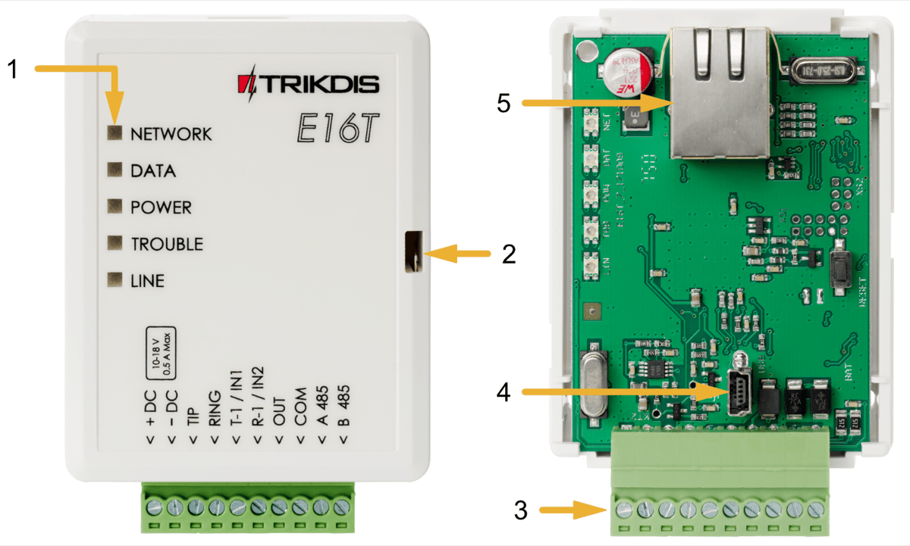

### Propósito de las terminales 

| Contacto | Descripción |
|----------|-------------|
| +DC | Terminal de fuente de alimentación + 12V |
| -DC | Terminal de base común |
| TIP | Para conectarse al panel de control de seguridad Terminal de punta |
| RING | Para conectarse al panel de control de seguridad Terminal de anillo |
| T-1/​IN-1 | Terminal de doble propósito: T-1 para uso futuro o entrada de primer tipo seleccionable |
| R-1/​IN-2 | Terminal de doble propósito: R-1 para uso futuro o entrada de segundo tipo seleccionable |
| OUT | Salida controlable de drenaje abierto |
| COM | Común (negativo) |
| A 485 | Contacto RS485 para conectar la entrada iO o expansor de salida u otros aditamentos |

### LED indicador de operación 

| LED | Operación | Descripción |
|-----|-----------|-------------|
| “Network”/”Red” muestra la conexión al estado de la red | Verde ENCENDIDO | Conectado a la red |
| “Data”/”Datos” muestra el proceso de transferencia de datos | Amarillo ENCENDIDO | Los mensajes de evento no enviados están presentes en el búfer |
| “Data”/”Datos” muestra el proceso de transferencia de datos | Verde intermitente | Los mensajes están siendo recibidos del marcador PSTN del panel de control |
| “Power”/”Alimentación” muestra el estado de la fuente de alimentación y el funcionamiento del microprocesador | Verde intermitente | La fuente de alimentación está encendida con suficiente voltaje y el microcontrolador es operativo |
| “Power”/”Alimentación” muestra el estado de la fuente de alimentación y el funcionamiento del microprocesador | Amarillo intermitente | El voltaje de la fuente de alimentación no es suficiente (≤11,5 V) |
| “Trouble”/”Problema” muestra la conexión a un problema de red | Rojo ENCENDIDO | Problema de conexión de red, verificar la conexión del cable |
| “Trouble”/”Problema” muestra la conexión a un problema de red | Rojo APAGADO | El comunicador está conectado a la red |
| “Line”/”Línea” muestra el estado del panel de control cuando se recibe un evento | Verde ENCENDIDO | El panel de control de seguridad ha levantado un auricular descolgado |
| “Line”/”Línea” muestra el estado del panel de control cuando se recibe un evento | Verde ENCENDIDO | El panel de control de seguridad no ha levantado un auricular |

### Esquema estructural del uso del dispositivo E16T 

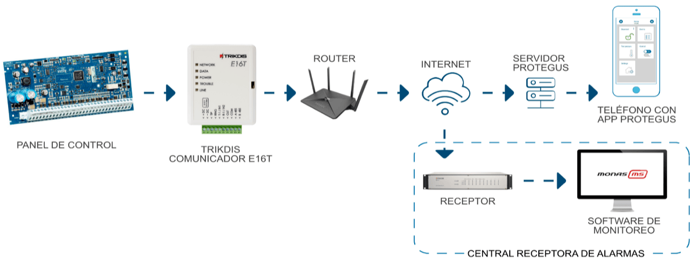

!!! note "Nota"
    Antes de comenzar, asegúrese de tener lo necesario:
    
    1.  Cable USB (tipo Mini-B, no incluido) para la configuración del
        comunicador E16T.
    
    2.  Cable Ethernet CAT-5 (máximo 100m, no incluido).
    
    3.  Destornillador de cabeza plana.
    
    4.  Al menos 4 cables de alambre para conectar el comunicador al panel
        de control.
    
    5.  Manual de instalación del panel de control de seguridad en
        particular.
    
    Pídalos por separado de su distribuidor local.

## ¿Cómo configurar el comunicador con el software de TrikdisConfig? 

1.  Descargue el software de TrikdisConfig de [www.trikdis.com](http://www.trikdis.com) (en la barra de búsqueda ponga TrikdisConfig) e instálelo.

2.  Abra la cubierta del E16T con el desatornillador de cabeza plana como se muestra a continuación:

1.  Usando el cable USB mini-B conecte el E16T a la computadora.

2.  Abra el programa de configuración de TrikdisConfig. El software reconocerá de forma automática el comunicador conectado y abrirá una ventana para su configuración.

3.  De clic en **Leer [F4]** para leer la información sobre los parámetros del comunicador e ingrese el código del Administrador o del Instalador en la ventana saliente.

A continuación, habrá una descripción de las opciones que necesitan ser configurados para el comunicador, para que este empiece a enviar notificaciones al CRA y para permitir que el control de seguridad sea controlado por la app de Protegus.

### Opciones de conexión para la app de Protegus 

**En la ventana de “Ajustes del sistema”:**

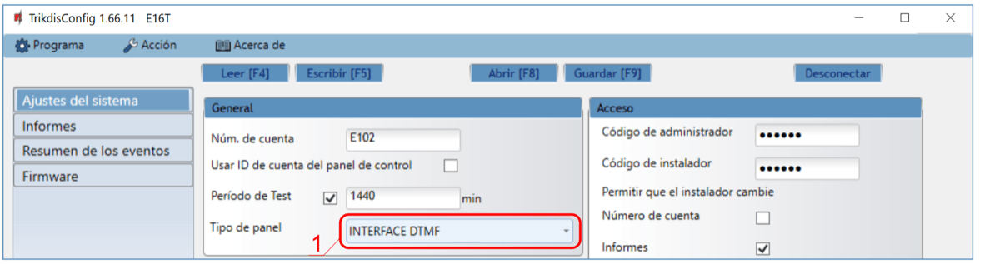

1.  Seleccione el tipo de panel que será conectado al comunicador.

**Ventana de “Informes”, pestaña de “Servicio Protegus”:**

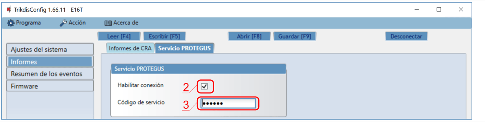

2. Habilitar la conexión al Servicio Protegus.

2.  Cambie **el Código de acceso** de la nube para iniciar sesión con Protegus si usted desea que los usuarios requieran ingresarlo cuando se agrega el sistema a la app de Protegus (contraseña por defecto – 123456).

### Configuración para conectarse con el CRA 

**En la ventana de “Ajustes del sistema”:**

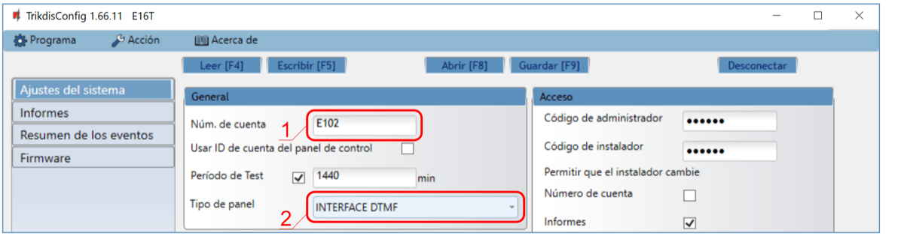

1.  Ingrese el número de ID del objeto (**No utilice números de objeto FFFE, FFFF.**).

2.  Seleccione el **Tipo de panel** que será conectado al comunicador.

**En la ventana de opciones de “Informes” para el “Primario”:**

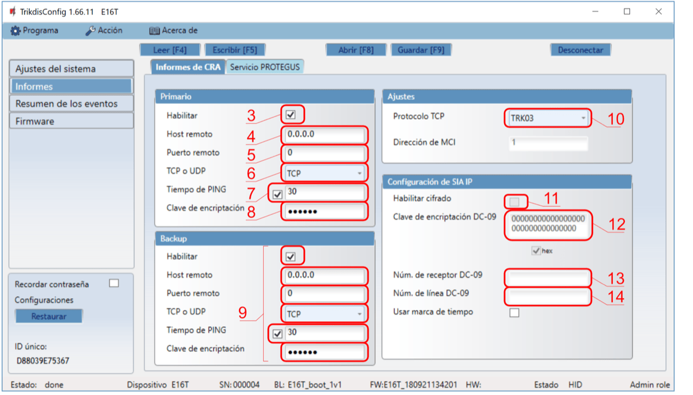

3.  **Habilitar** — habilitar canal de comunicación principal

4.  **Host remoto** – ingrese la dirección del dominio o IP del receptor.

5.  **Puerto remoto** – ingrese el número de puerto de la red del receptor.

6.  **TCP o UDP** – elija un protocolo de transmisión de evento (TCP o UDP), en donde se transmitirán los eventos.

7.  **Tiempo de PING** —período de transmisión de señal PING.

8.  **Clave de encriptación** – Ingrese la llave de encriptación que está establecida en el receptor.

9.  (Recomendado) Configure las opciones de respaldo del canal primario.

10. **Protocolo TCP** — seleccionar qué protocolo de codificación se utilizará: TRK (para receptores TRIKDIS), DC-09_2007 o DC-09_2012 (para receptores universales).

11. **Habilitar cifrado** - si se selecciona el protocolo TCP SIA DC09_2012, el cifrado puede ser habilitado.

12. **Clave de encriptación DC-09**: introduzca la clave de cifrado establecida en el receptor.

13. **Núm. de receptor DC-09** - introduzca el número del receptor.

14. **Núm. de línea DC-09** — introduzca el número de línea del receptor.

!!! note "Nota"
    Si ha seleccionado la codificación de transmisión de mensajes DC-09,
    además de la ventana "Informes", en la pestaña "Configuración", ingrese
    los números de objeto, línea y receptor.
**Ventana de “Informes”, pestaña de “Servicio Protegus”:**

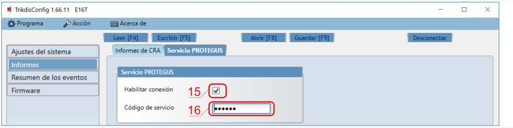

15. Habilitar la conexión al Servicio Protegus.

16. Cambie el **Código de servicio** de la nube para iniciar sesión con Protegus si usted desea que los usuarios requieran ingresarlo cuando se agrega el sistema a la app de Protegus (contraseña por defecto – 123456).

Cuando termine con la configuración, de clic en **Escribir [F5]** y desconecte el cable USB.

!!! note "Nota"
    Para más información sobre otras opciones de E16T en TrikdisConfig
    vea el capitulo 7 de "Descripción de la ventana TrikdisConfig".
## Proceso de Instalación 

### Conectar el comunicador al panel de control utilizando el diagrama de cableado abajo. 

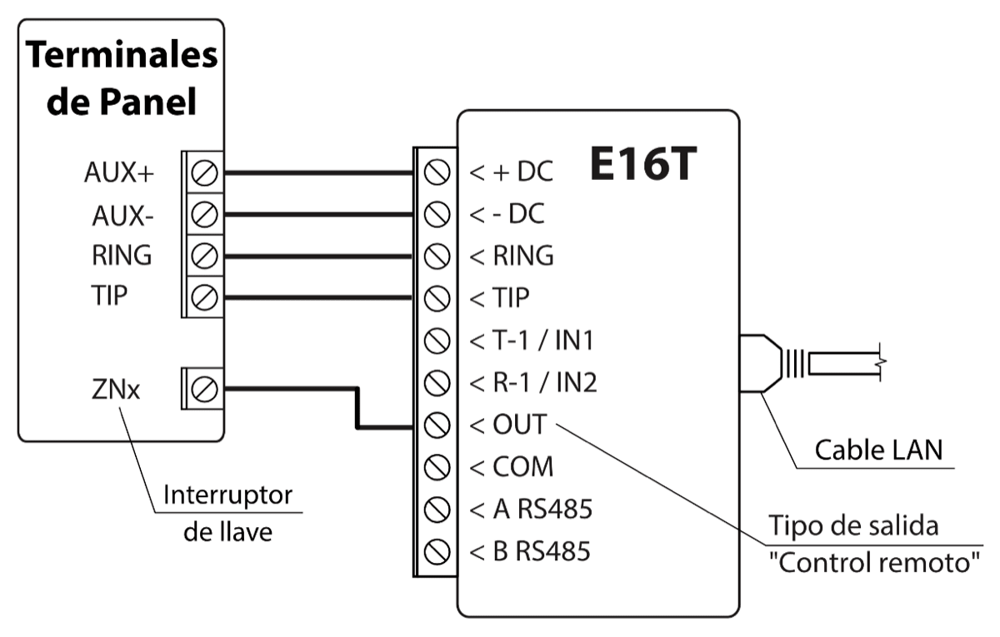

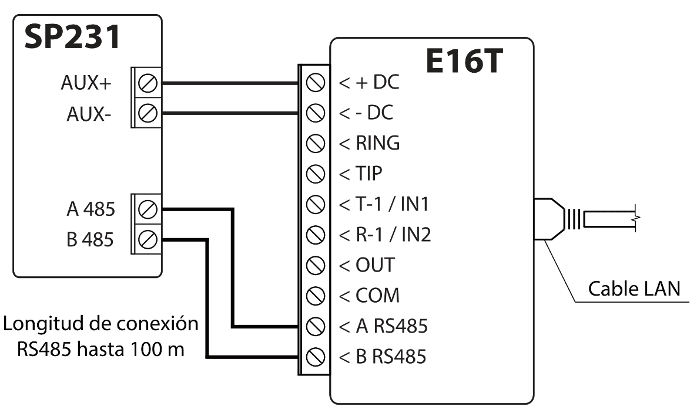

### Conectar sensores (Opcional) 

El comunicador contiene dos terminales de entrada de tipo seleccionable (IN1, IN2) para la conexión de sensores, pueden ser NC, NO o EOL.

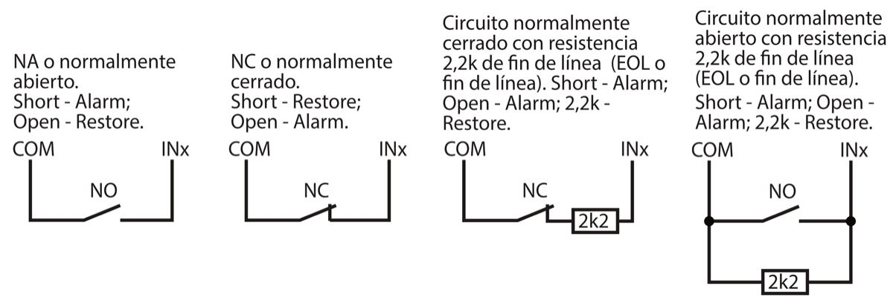

### Conectar el cable LAN 

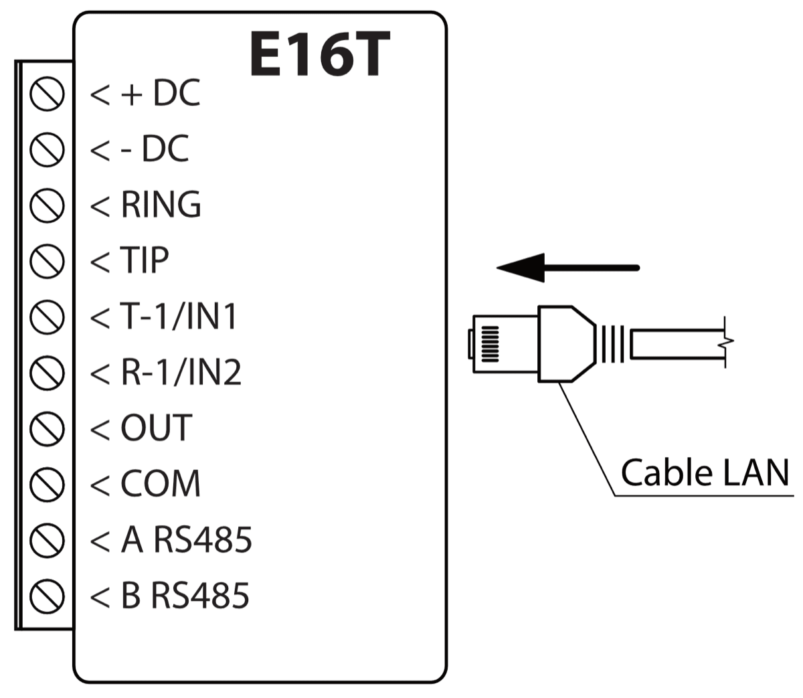

### Esquemas de cableado de un relé 

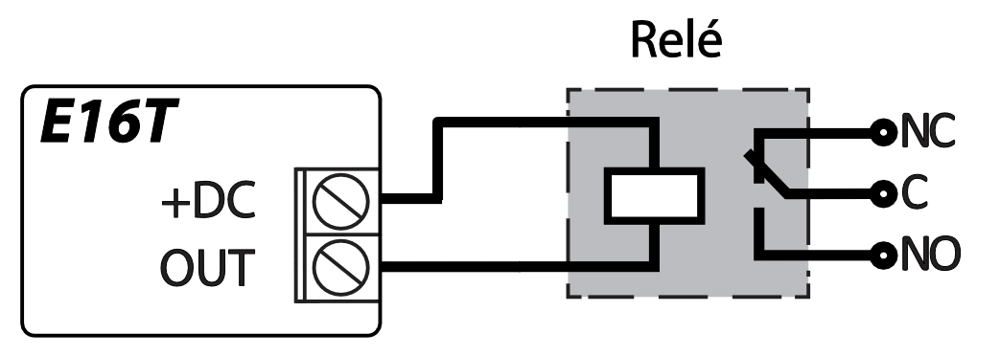

Con los contactos de relé se puede controlar (encender/ apagar) diversos aparatos electrónicos.

## Configuración del panel de control de seguridad 

Siga el manual de programación del panel de control de seguridad particular y configure su comunicador telefónico:

1.  Habilite el marcador PSTN del panel.

2.  Seleccione el modo de marcación DTMF.

3.  Seleccione el formato de comunicación Contact ID.

4.  Si el comunicador está conectado a un teléfono fijo real, ingrese un número de teléfono - **1234** para marcar, (Si no está conectado a una línea fija, puede usarse cualquier número no inferior a 2 dígitos).

5.  Ingrese un número de cuenta de 4 dígitos en el panel.

### Programación de comunicador telefónico de Honeywell Vista 

Usando el teclado del panel de control ingrese a estas secciones y configúrelas como se describe:

- \*41 - introduzca el número de teléfono de receptor de la CRA;

- \*43 - introduzca el número de cuenta del panel de control;

- \*47 - establezca el tono de marcación a [1] e introduzca el número de intentos de llamada;

- \*48 – utilice la configuración predeterminada, \*48 debe ajustarse a 7;

- \*49 - Spit/ doble mensaje. \*49 debe ajustarse a 5;

- \*50 – el retardo para el envío de eventos de alarma de robo (opcional). El valor por defecto es [2,0]. Con ella la transmisión de mensajes de evento se retrasa durante 30 segundos. Si desea que el mensaje se envíe de inmediato, ajuste [0,0].

**Salir de la programación**

Una vez que todas las secciones están programados, salga del modo de instaladores introduciendo \*99 en el teclado.

### Ajustes especiales para panel de Honeywell Vista 48 

Si desea utilizar el comunicador E16T con el panel Honeywell Vista 48, configure las siguientes secciones como se describe:

| Sección | Datos                         | Sección | Datos | Sección | Datos |
|:-------:|-------------------------------|:-------:|:-----:|:-------:|:-----:|
|  \* 41  | 111 (# telefónico receptor)   |  \* 60  |   1   |  \* 69  |   1   |
|  \* 42  | 1111                          |  \* 61  |   1   |  \* 70  |   1   |
|  \* 43  | 1234 (número de cuenta panel) |  \* 62  |   1   |  \* 71  |   1   |
|  \* 44  | 1234                          |  \* 63  |   1   |  \* 72  |   1   |
|  \* 45  | 1111                          |  \* 64  |   1   |  \* 73  |   1   |
|  \* 47  | 1                             |  \*65   |   1   |  \* 74  |   1   |
|  \* 48  | 7                             |  \* 66  |   1   |  \* 75  |   1   |
|  \* 50  | 1                             |  \* 67  |   1   |  \* 76  |   1   |
|  \* 59  | 0                             |  \* 68  |   1   |         |       |

Cuando todos los ajustes necesarios están configurados, es necesario salir del modo de programación. Ingrese \*99 en el teclado.

## Control remoto 

### Añadiendo el sistema de seguridad a la aplicación Protegus 

Con Protegus los usuarios serán capaces de controlar su sistema de alarma de forma remota. Ver el estado del sistema y recibir notificaciones acerca de los eventos del sistema.

1.  Descargue e inicie la aplicación Protegus o utiliza la versión del navegador: [www.protegus.app](https://www.protegus.app)<u>.</u>

    

      
      
      
    

2.  Inicie sesión con su nombre de usuario y contraseña o regístrese para crear una cuenta nueva.

!!! note "Nota"
    Al agregar E16T al Protegus, compruebe si:
    
    1.  La Nube Protegus está habilitada. Véase el capítulo **7.3 en
        la ventana "Informes"**;
    
    2.  La fuente de alimentación está conectada ( el LED de "POWER" se
        ilumina en verde);
    
    3.  Registrado en la red ( el LED de "NETWORK" se ilumina en verde).
3. Haga clic en **Añadir sistema** e introduzca el número “IMEI/ID Único ” de E16T. Este número se encuentra en el dispositivo y la etiqueta de la caja. Después de introducir, presione el botón **Siguiente.**

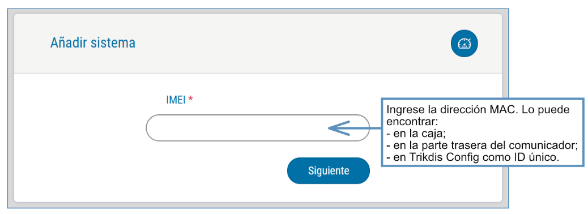

### Ajustes adicionales para habilitar/deshabilitar el sistema de alarma usando la llave de zona del panel de control 

!!! note "Nota"
    La zona del panel de control, a la que está conectada la salida
    E16T OUT, debe configurarse en el modo de interruptor de llave.
Siga las instrucciones a continuación si el panel de control se controlará con la salida E16T, activación/desactivación de la zona de interruptor de llave de panel de control.

1.  En la nueva ventana, haga clic en **Áreas** en el menú lateral. En la siguiente ventana, especifique cuántas áreas del sistema de alarma hay en el sistema y presione **Siguiente.**

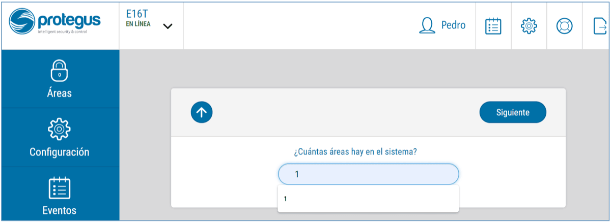

2. En la nueva ventana, identifique cuál es el número para cada una de las áreas especificadas en el sistema de seguridad y pulse **Guardar.**

3. En el menú lateral, presione en la ventana **Configuración**, en la ventana que se abrió recientemente también presione **Configuración**. Seleccione la casilla de **Armar/ Desarmar con PGM 1** y especifique el área donde se controlará la salida. Uno de cada salida se puede controlar una sola área.

4. Seleccione **Nivel** o **Pulso,** dependiendo del tipo de llave de zona keyswitch del panel de control. También puede cambiar la duración del intervalo de impulso si es necesario para el panel de control conectado.

2.  Para mayor seguridad, puede seleccionar **Usar la contraseña de la aplicación para ARMAR/DESARMAR**. A continuación, después de pulsar el botón para activar/desactivar el sistema de alarma, la ventana para introducir la contraseña de la aplicación se abrirá.

### Armar/Desarmar el sistema de alarma con Protegus 

1.  Para armar/desarmar el sistema de alarma, vaya a **Áreas** de la ventana Protegus.

2.  En la ventana de **Áreas**, presione el botón de **Área**. En la ventana abierta, seleccione la acción (para armar o desarmar el sistema de alarma).

3.  Si es solicitado, ingrese el código de usuario o la contraseña de Protegus.

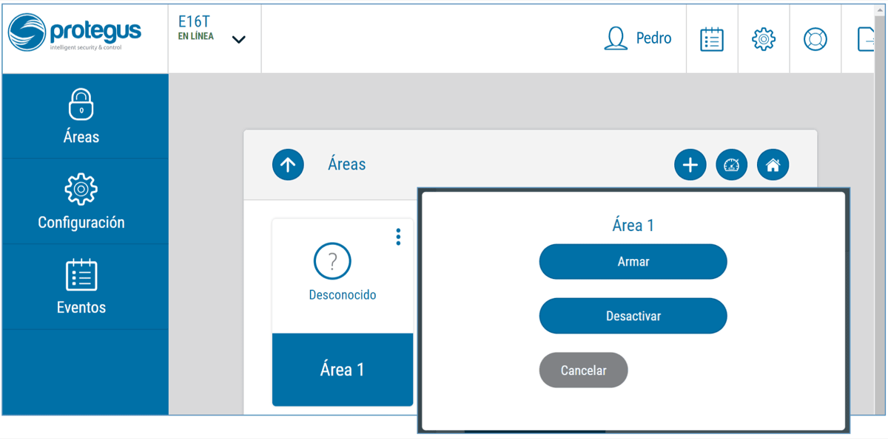

## Configuración remota 

!!! note "Nota"
    La configuración remota funcionará sólo si:
    
    1.  La nube Protegus está habilitada. La forma de habilitar la
        nube se describe en el capítulo **7.3 ventana "Informes";**
    
    2.  Fuente de alimentación está conectada ( "POWER" LED se ilumina en
        verde);
    
    3.  **E16T** conectado a Internet (cable LAN conectado). El indicador
        "RED" se ilumina en verde cuando hay una conexión.
El Communicator E16T puede controlarse de forma remota utilizando el software TrikdisConfig. Para hacerlo, siga los pasos a continuación:

1.  Abra el TrikdisConfig.

2.  En el campo **Acceso remoto**, en el campo **ID único** ingrese la dirección MAC. La dirección MAC es proporcionada en el paquete del producto.

3.  (Opcional) En el campo **Nombre del sistema**, ingrese el nombre deseado para el módulo.

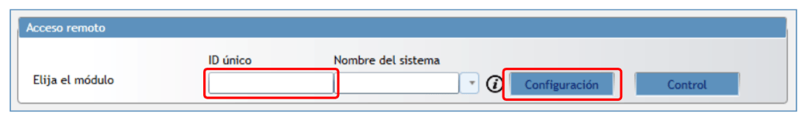

4. Pulse Configurar.

2.  En la nueva ventana abierta haga clic en **Leer [F4].** Si es necesario, introduzca el código de administrador o instalador.

3.  Establecer los ajustes necesarios y cuando termine, haga clic en **Escribir [F5].**

## Descripción de la ventana TrikdisConfig 

### Barra de Estado 

Después de conectar E16T y haciendo clic en **Leer [F4]**, TrikdisConfig proporcionará información sobre el dispositivo conectado en la barra de estado.

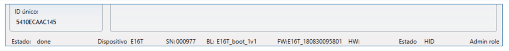

**Barra de Estado**

| Nombre | Descripción |
|----|----|
| Identificación única | Número MAC del dispositivo |
| Estado | Estado de acción |
| Dispositivo | Tipo de dispositivo |
| SN | Número de serie |
| BL | Versión del cargador de arranque |
| FW | Versión de firmware |
| HW | Versión del hardware |
| Estado | Estado de conexión |
| Administración | Nivel de acceso (aparece después de que sea confirmado el código de acceso) |

Después de pulsar **Leér [F4]**, el programa leerá y mostrará los ajustes, que se establecen en E16T. Establecerá los ajustes necesarios de acuerdo con las descripciones de las ventanas del TrikdisConfig las cuales se dan a continuación.

### Ventana de “Ajustes de sistema” 

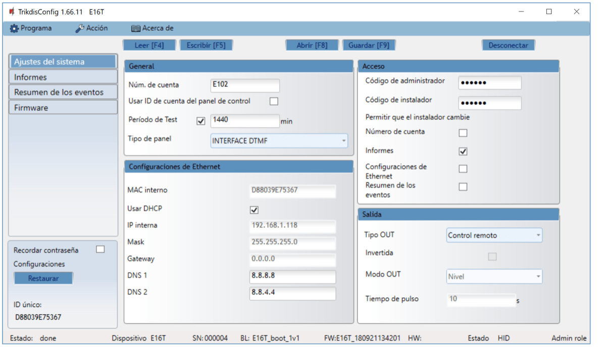

**Configuraciones → General:**

- Escriba un **Número de cuenta** (cuatro - símbolos número hexadecimal).

- Marque la casilla **Usar ID de cuenta** **del panel de control** si los mensajes del panel de control de seguridad deben contener su número de identificación.

- **Período de Test**: establezca con qué frecuencia se deben enviar los mensajes de prueba periódicos.

- **Tipo de panel** - activar/desactivar la interfaz de línea fija DTMF en el comunicador.

**Configuraciones → Configuraciones Ethernet**

- **MAC Interno** es único para cada comunicador Ethernet y no es modificable.

- Cuando se marca la casilla **Usar DHCP**, el comunicador se registrará automáticamente en la red.

  - Si el registro automático no es exitoso, ingrese la dirección **IP interna**, la **máscara (Masc)** de subred y la dirección de la **puerta de enlace (Gateway)** manualmente. El E16T es compatible con el servicio de DNS.

**Configuraciones → Acceso**

- **Código de administrador**: permite el acceso completo a la configuración.

- **Código de instalador**: permite acceso limitado a la configuración, según lo establecido por el administrador. El administrador puede permitir que el instalador cambie:

  - **Número de cuenta**;

  - **Informes**;

  - **Configuraciones de Ethernet**;

  - **Resumen del los eventos**.

**Configuraciones → Salida**

- Seleccione el tipo de operación de salida desde el **Tipo OUT** de la lista.

- Marque la casilla **Invertida** si la función de salida debe ser revertida.

- **Modo OUT:**

  - **Pulso:** se mantendrá un estado durante un período de tiempo como se indica en el campo **Tiempo de pulso** (período en segundos).

  - **Nivel:** un estado cambiará y permanecerá igual hasta el siguiente comando.

### Ventana de presentación de „Informes” 

**Pestaña “Informes de CRA”**

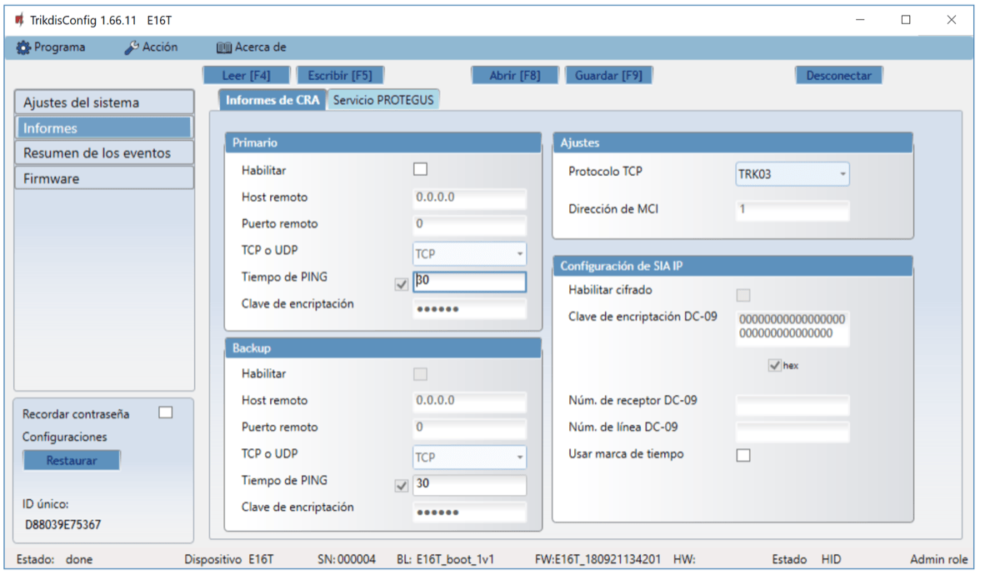

**Informes → Primario y de respaldo (Backup)**

- Para tener conexión con los canales Primarios y de Respaldo marque las casillas de verificación **Habilitar**.

- Rellene los campos para **Host remoto, Puerto remoto.**

- Elija el protocolo de informes **TCP o UDP**.

- Habilite el **Tiempo de PING** y configure el tiempo entre las señales en segundos (requerido para la monitorización de la comunicación).

- Ingrese la **Clave de encriptación** (número hexadecimal de seis símbolos).

**Informes → Configuraciones**

- Seleccione el **Protocolo TCP** (un protocolo de encriptación para enviar mensajes a la estación de monitoreo).

  - Seleccione TRK03 cuando se use el receptor Trikdis IPcom o el comunicador será conectado al panel de control Trikdis SP231.

  - Seleccione MCI si los mensajes de eventos serán enviados al repetidor.

  - Cuando los mensajes de eventos son enviados al receptor de SIA IP, seleccione SIA_DC09_2012 y configure los ajustes de IP de SIA.

- **Dirección de esclavo MCI:** dirección asignada por el panel de control al comunicador conectado (no modificable).

**Informes → Configuraciones IP SIA**

- Marque la casilla de verificación **Habilitar cifrado** para habilitar el cifrado de mensajes.

- Ingrese la **Clave de cifrado DC-09** (hasta 32 símbolos).

- **Núm. de receptor DC-09:** ingrese el número de receptor.

- **Núm. de línea DC-09:** ingrese el número de línea.

- **Usar marca de tiempo**: marque la casilla de verificación si se requiere marca de tiempo.

El servicio Protegus permite que los usuarios finales monitoreen y controlen remotamente el estado de su sistema de alarma con el comunicador y en las aplicaciones Protegus.

Para obtener más información sobre el servicio PROTEGUS, visite [www.protegus.app](https://www.protegus.app).

- Habilite el servicio en la nube en **Informes →** pestaña **Servicio PROTEGUS.**

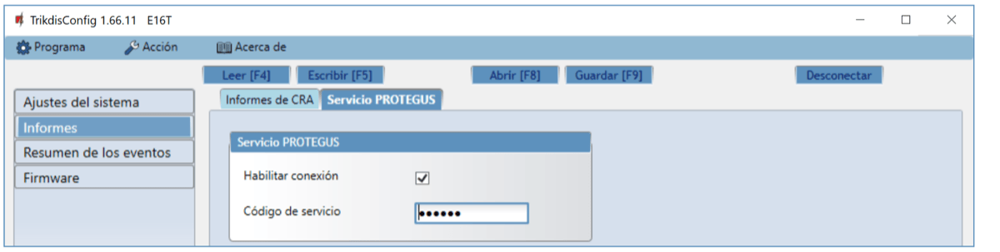

- Ingrese el **Código de servicio** (código predeterminado: 123456), para mayor seguridad cámbielo a <u>código de autenticación de 6 símbolos</u>. Este código es utilizado cuando se agrega un nuevo sistema a la aplicación y se controla de forma remota a través del software TrikdisConfig (para más detalles, consulte [5 „Control remoto”](#configuración-remota) ).

### Ventana „Resumen de los eventos“ 

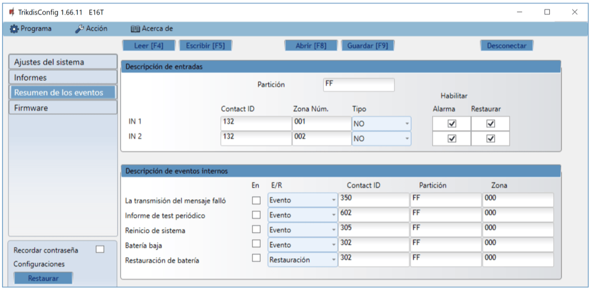

**Resumen de los Eventos → Descripción de Entradas**

- Describa la entrada rellenando los campos (estos serán enviados si se produce la Alarma/Restauración):

  - **Partición**;

  - **Contact ID**: puede ser personalizado o dejar el valor predeterminado;

  - **Zona Núm**: describe qué zona será controlada con IN 1, IN 2.

- Seleccione el **Tipo** de entrada (NO, NC, EOL).

- Habilitar: informa cuando ocurre un evento **(alarma);** informa cuando la línea de entrada restaurará **(Restaurar).**

**Resumen de los Eventos → Descripción de eventos internos**

- Para describir los eventos internos, seleccione el tipo de evento (Evento o Restauración), ingrese **Particiones** y Números de **Zona.**

- El código de **Contact** **ID** puede ser personalizado.

Después de configurar todos los parámetros, haga clic en **Escribir [F5]** para escribir los parámetros del programa TrikdisConfig en el comunicador.

Para crear un archivo de configuración que contiene nuevos parámetros, haga clic en **Guardar [F9].**

Desconectar el dispositivo:

- Haga clic en **Desconectar** para desconectarse del nivel de acceso (instalador o administrador) mientras el comunicador está conectado mediante un cable USB a una computadora (la indicación de función desaparecerá de la barra de estado).

- Si la configuración se realiza a través de un cable USB, desenchufe el cable USB; haga clic en **Desconectar** para volver a la ventana principal.

###  Restauración de la configuración de fábrica 

Para **Restaurar** la configuración de fábrica del comunicador, es necesario hacer clic en el botón Restaurar en la ventana TrikdisConfig.

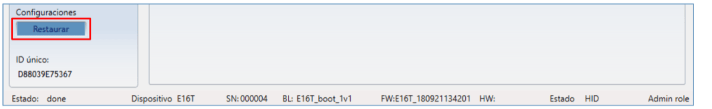

## Realizar prueba del sistema 

Cuando la configuración y la instalación está completa, realice una comprobación del sistema:

1.  Genere un evento:

- mediante el teclado del panel de control armando/ desarmado el sistema;

- activando una alarma de zona cuando el sistema de seguridad está armado.

1.  Asegúrese de que el evento llega al CRA y o se recibe en la aplicación Protegus.

2.  Para probar la entrada del comunicador, desencadene y asegúrese de recibir el evento correcto.

3.  Para probar las salidas del comunicador, active de forma remota y compruebe su funcionamiento.

4.  Si el panel de control será controlado de forma remota, arme/desarmarme el sistema de seguridad de forma remota mediante el uso de la aplicación Protegus.

## Actualización manual del Firmware 

!!! note "Nota"
    Cuando el comunicador está conectado a TrikdisConfig, el programa
    ofrecerá automáticamente actualizar el firmware del dispositivo si están
    disponibles. Las actualizaciones requieren una conexión a Internet. El
    software antivirus, el firewall o el acceso estricto a la configuración
    de Internet pueden bloquear las actualizaciones automáticas del
    firmware.
El firmware E16T se puede actualizar o cambiar también de forma manual. Después de una actualización, todos los ajustes establecidos previamente permanecerán. Al escribir el firmware de forma manual, se puede cambiar a una versión más reciente o más. Para actualizar:

1.  Ejecutar TrikdisConfig.

2.  Conecte el dispositivo E16T mediante un cable USB Mini-B al ordenador o conéctese al comunicador E16T forma remota.

- Si existe una versión más reciente del firmware, el software ofrecerá a descargar el archivo de la versión de firmware más reciente.

1.  Seleccione el firmware del menú.

2.  Presione **Abrir el firmware** y seleccione el archivo de firmware requerido. Si no tiene el archivo, el archivo de firmware más reciente puede ser descargado por el usuario registrado de [www.trikdis.com](http://www.trikdis.com) , en virtud de la sección de descargas del comunicador ***E16T*.**

3.  Pulse **Actualizar [F12].**

4. Espere a que el indicador de actualización se haya completado.

## Requerimientos de Seguridad 

El sistema de alarma de seguridad debe ser instalado y mantenido por personal calificado.

Antes de la instalación, lea cuidadosamente este manual para evitar errores que pueden provocar un mal funcionamiento o incluso daños en el equipo.

Desconecte la energía antes de hacer cualquier conexión eléctrica.

 Los cambios, modificaciones o reparaciones no autorizadas por el fabricante anularán sus derechos en virtud de la garantía.

Cumpla con la normativa local y no deseche su sistema de alarma inutilizables o sus componentes con los residuos domésticos.
