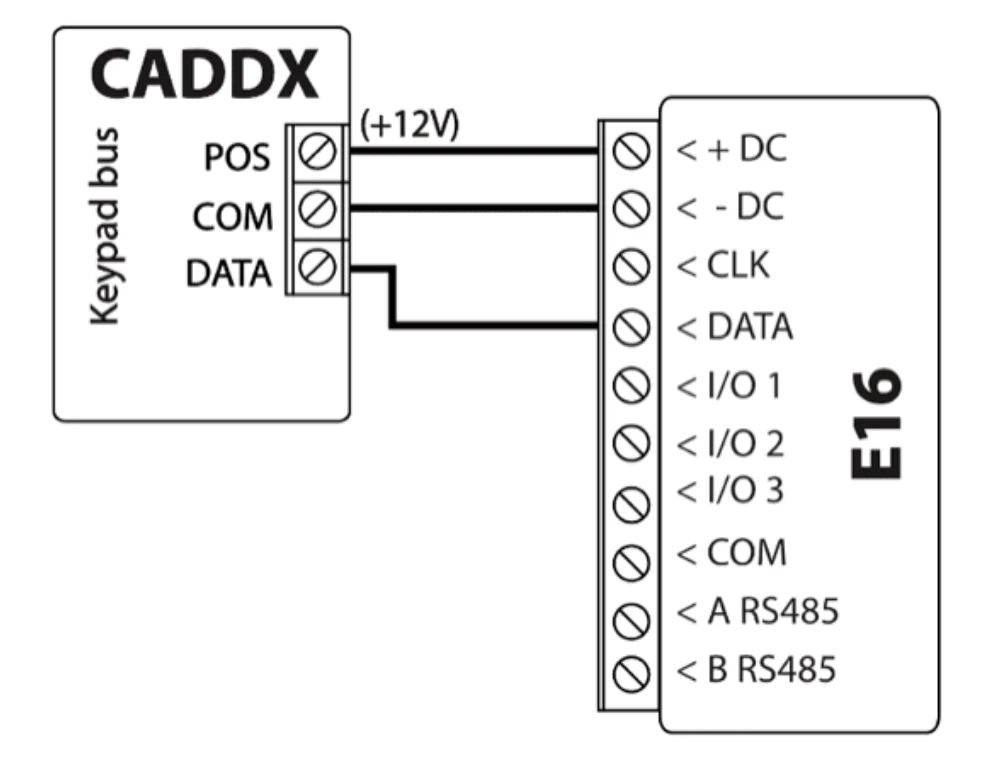

# Interlogix NX-4v2 / NX-6v2 con E16 configuración rápida

Pasos breves para conectar el comunicador E16 a paneles Interlogix NX-4v2 / NX-6v2, configurar E16 para reportes IP y añadir el sistema a Protegus2. Utilice esta guía junto con el manual completo de E16 para el resto de los ajustes.

!!! caution "Precaución"
    La instalación y el servicio deben ser realizados solo por personal cualificado. Desconecte la alimentación antes de cablear. Los cambios no autorizados anulan la garantía.

## Requisitos

- Comunicador E16 con LAN conectado y un cable USB Mini-B para la configuración.
- Panel Interlogix NX-4v2 / NX-6v2 con acceso mediante teclado.
- ID / número de cuenta del objeto del CRA si va a reportar al CRA.
- Cuenta de Protegus2 y MAC / Unique ID del comunicador.

## Configuración rápida con el software *TrikdisConfig*

1. Descargue **TrikdisConfig** de [www.trikdis.com](http://www.trikdis.com) e instálelo.
2. Abra la carcasa del E16 con un destornillador plano.

3. Conecte el E16 al ordenador mediante un cable USB Mini-B.
4. Ejecute **TrikdisConfig**. El software reconocerá el comunicador y abrirá la ventana de configuración.
5. Pulse **Leer [F4]** para cargar la configuración actual. Si se solicita, introduzca el código de 6 dígitos del Administrador o del Instalador.

Complete la subsección que corresponda a la instalación:

- **App Protegus2** si los usuarios van a controlar el sistema de forma remota.
- **Central Receptora de Alarmas** si el comunicador reportará al CRA.
- Complete ambas subsecciones si el comunicador debe funcionar con el CRA y con Protegus2.

### Opciones de conexión para la app de Protegus2

**En la ventana de "Ajustes del sistema":**

1. Seleccione el **Modelo de panel** que se conectará al comunicador.
2. Active **Armado/Desarmado Remoto** si los usuarios deben controlar el panel desde Protegus2 con su código de teclado.
3. Para el control directo de paneles Paradox y Texecom, introduzca la **Contraseña de descarga PC/UDL del panel**. Debe coincidir con la contraseña configurada en el panel.

!!! note "Nota"
    Para que funcione el control directo, el panel también debe programarse como se describe más abajo en la sección específica del panel.

**En la ventana de "Informes para usuario", pestaña "Servicio PROTEGUS":**

4. Marque **Habilitar conexión** al servicio Protegus.
5. Cambie el **Código de acceso a PROTEGUS Cloud** si desea que se solicite al añadir el sistema a Protegus2.

Después de terminar la configuración, haga clic en **Escribir [F5]** y desconecte el cable USB.

### Configuración para conectarse con el CRA

**En la ventana de "Ajustes del sistema":**

1. Introduzca el **ID del objeto** proporcionado por la Central Receptora.
2. Seleccione el **Modelo de panel** que se conectará al comunicador.

**En la ventana de "Ajustes de CRA", opciones del "Canal principal":**

3. Configure el **Modo de comunicación** en **IP**.
4. Seleccione el protocolo requerido por el receptor: **TRK**, **DC-09_2007**, **DC-09_2012** o **TL150**.
5. Introduzca la clave de cifrado del receptor si el protocolo seleccionado la requiere.
6. Introduzca el **Dominio o IP** y el **Puerto** del receptor.
7. Seleccione **TCP** o **UDP**.
8. Configure los canales de respaldo y en paralelo si la instalación requiere redundancia.

!!! note "Nota"
    Si selecciona un protocolo **DC-09**, en la pestaña **Opciones** de la ventana de **Ajustes de CRA** introduzca también los números de objeto, línea y receptor.

Después de terminar la configuración, haga clic en **Escribir [F5]** y desconecte el cable USB.

## Cableado

Conecte el panel al E16 como se muestra a continuación:

| Terminal E16 | Panel Interlogix | Notas |
| --- | --- | --- |
| `+DC` | `POS` | Alimentación del panel |
| `-DC` | `COM` | Tierra del panel |
| `DATA` | `DATA` | Datos del bus de teclado |

## Programación del panel

### Programación del panel mediante teclado LCD

Usando el teclado del panel, entre en las secciones indicadas y configúrelas como se describe:

| Teclado LCD | Entrada de teclado | Descripción de la acción |
| --- | --- | --- |
| System ready | `*89713` | Entrar en modo de programación |
| Enter device address | `0#` | Ir al menú principal de programación del panel |
| Enter location | `4#` | Ir a **Phone1 events reported** |
| Loc#4 Seg#1 | `12345678*` | Activar todas las opciones conmutables y guardar |
| Loc#4 Seg#2 | `12345678*` | Activar todas las opciones conmutables y guardar |
| Enter location | `23#` | Ir a **Partition features** |
| Loc#23 Seg#1 | `**` | Ir al segmento 3 |
| Loc#23 Seg#3 | `12345678*#` | Activar todas las opciones conmutables y guardar |
| Enter location | `37#` | Ir a **Siren and system supervision** |
| Loc#37 Seg#1 | `**` | Ir al segmento 3 |
| Loc#37 Seg#3 | `12345678*` | Activar todas las opciones conmutables y guardar |
| Loc#37 Seg#4 | `12345678*#` | Activar todas las opciones conmutables y guardar |
| Enter location | `90#` | Ir a **Partition 2 features** |
| Loc#90 Seg#1 | `**` | Ir al segmento 3 |
| Loc#90 Seg#3 | `12345678*#` | Activar todas las opciones conmutables y guardar |
| Enter location | `93#` | Ir a **Partition 3 features** |
| Loc#93 Seg#1 | `**` | Ir al segmento 3 |
| Loc#93 Seg#3 | `12345678*#` | Activar todas las opciones conmutables y guardar |
| Enter location | `96#` | Ir a **Partition 4 features** |
| Loc#96 Seg#1 | `**` | Ir al segmento 3 |
| Loc#96 Seg#3 | `12345678*#` | Activar todas las opciones conmutables y guardar |
| Enter location | `99#` | Ir a **Partition 5 features** |
| Loc#99 Seg#1 | `**` | Ir al segmento 3 |
| Loc#99 Seg#3 | `12345678*#` | Activar todas las opciones conmutables y guardar |
| Enter location | `102#` | Ir a **Partition 6 features** |
| Loc#102 Seg#1 | `**` | Ir al segmento 3 |
| Loc#102 Seg#3 | `12345678*#` | Activar todas las opciones conmutables y guardar |
| Enter location | `105#` | Ir a **Partition 7 features** |
| Loc#105 Seg#1 | `**` | Ir al segmento 3 |
| Loc#105 Seg#3 | `12345678*#` | Activar todas las opciones conmutables y guardar |
| Enter location | `108#` | Ir a **Partition 8 features** |
| Loc#108 Seg#1 | `**` | Ir al segmento 3 |
| Loc#108 Seg#3 | `12345678*#` | Activar todas las opciones conmutables y guardar |
| Enter location | `EXIT EXIT` | Salir del modo de programación |

### Programación del panel mediante teclado LED

Utilice las mismas ubicaciones y valores indicados arriba:

| Estado del teclado LED | Entrada de teclado | Descripción de la acción |
| --- | --- | --- |
| LEDs Ready y Power encendidos | `*89713` | Entrar en modo de programación |
| El LED Service parpadea | `0#` | Ir al menú principal de programación del panel |
| El LED Service parpadea, LED Armed encendido | `4#` | Ir a **Phone1 events reported** |
| Todos los LEDs de zona encendidos | `12345678*` | Activar todas las opciones conmutables y guardar |
| Todos los LEDs de zona encendidos | `12345678*` | Activar todas las opciones conmutables y guardar |
| El LED Service parpadea, LED Armed encendido | `23#` | Ir a **Partition features** |
| El LED Service parpadea, LED Ready encendido | `**` | Ir al segmento 3 |
| El LED Service parpadea, LED Ready encendido | `12345678*#` | Activar todas las opciones conmutables y guardar |
| El LED Service parpadea, LED Armed encendido | `37#` | Ir a **Siren and system supervision** |
| El LED Service parpadea, LED Ready encendido | `**` | Ir al segmento 3 |
| El LED Service parpadea, LED Ready encendido | `12345678*` | Activar todas las opciones conmutables y guardar |
| El LED Service parpadea, LED Ready encendido | `12345678*#` | Activar todas las opciones conmutables y guardar |
| El LED Service parpadea, LED Armed encendido | `90#` | Ir a **Partition 2 features** |
| El LED Service parpadea, LED Ready encendido | `**` | Ir al segmento 3 |
| El LED Service parpadea, LED Ready encendido | `12345678*#` | Activar todas las opciones conmutables y guardar |
| El LED Service parpadea, LED Armed encendido | `93#` | Ir a **Partition 3 features** |
| El LED Service parpadea, LED Ready encendido | `**` | Ir al segmento 3 |
| El LED Service parpadea, LED Ready encendido | `12345678*#` | Activar todas las opciones conmutables y guardar |
| El LED Service parpadea, LED Armed encendido | `96#` | Ir a **Partition 4 features** |
| El LED Service parpadea, LED Ready encendido | `**` | Ir al segmento 3 |
| El LED Service parpadea, LED Ready encendido | `12345678*#` | Activar todas las opciones conmutables y guardar |
| El LED Service parpadea, LED Armed encendido | `99#` | Ir a **Partition 5 features** |
| El LED Service parpadea, LED Ready encendido | `**` | Ir al segmento 3 |
| El LED Service parpadea, LED Ready encendido | `12345678*#` | Activar todas las opciones conmutables y guardar |
| El LED Service parpadea, LED Armed encendido | `102#` | Ir a **Partition 6 features** |
| El LED Service parpadea, LED Ready encendido | `**` | Ir al segmento 3 |
| El LED Service parpadea, LED Ready encendido | `12345678*#` | Activar todas las opciones conmutables y guardar |
| El LED Service parpadea, LED Armed encendido | `105#` | Ir a **Partition 7 features** |
| El LED Service parpadea, LED Ready encendido | `**` | Ir al segmento 3 |
| El LED Service parpadea, LED Ready encendido | `12345678*#` | Activar todas las opciones conmutables y guardar |
| El LED Service parpadea, LED Armed encendido | `108#` | Ir a **Partition 8 features** |
| El LED Service parpadea, LED Ready encendido | `**` | Ir al segmento 3 |
| El LED Service parpadea, LED Ready encendido | `12345678*#` | Activar todas las opciones conmutables y guardar |
| El LED Service parpadea, LED Armed encendido | `EXIT EXIT` | Salir del modo de programación |

## Añadir sistema a Protegus2

1. Abra [Protegus2](https://www.protegus.app) y pulse **Agregar nuevo sistema**.
1. Introduzca el **MAC / Unique ID** del E16.
1. Introduzca el nombre del sistema y termine el asistente.
1. Si utiliza control por zona keyswitch en lugar de control directo, conecte `I/O 1` a la zona keyswitch del panel y configure `PGM1` en Protegus2.
1. Espere hasta que el sistema aparezca en línea.

## Comprobación del sistema

1. Arme y desarme el sistema desde el teclado.
1. Genere una alarma de prueba mientras el sistema esté armado.
1. Confirme que los eventos llegan al CRA y a Protegus2.
