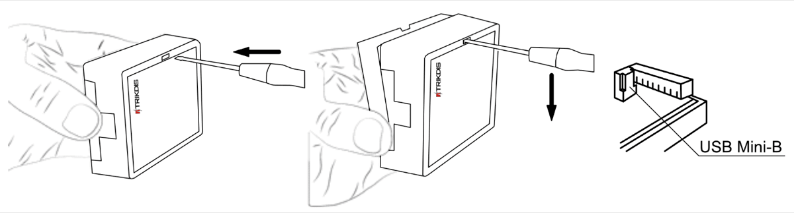
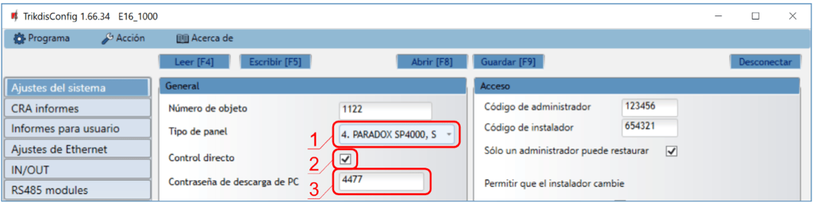
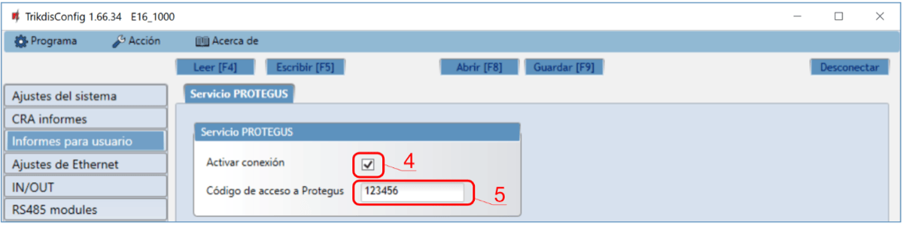
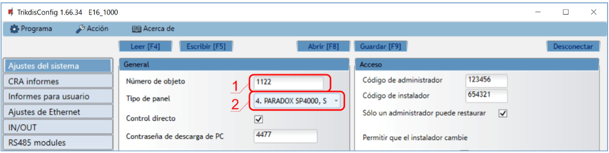
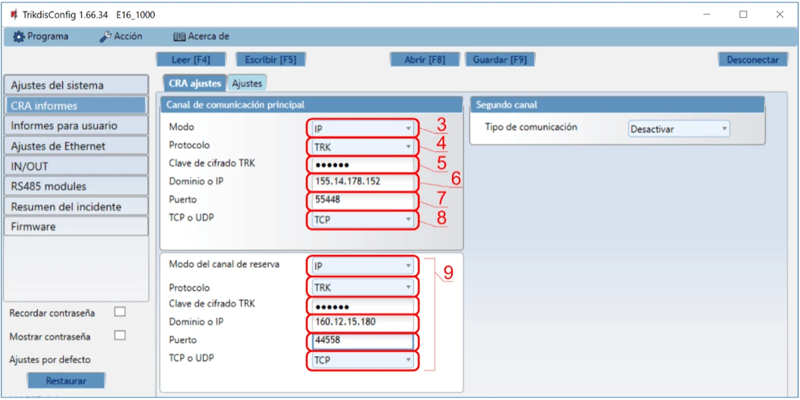
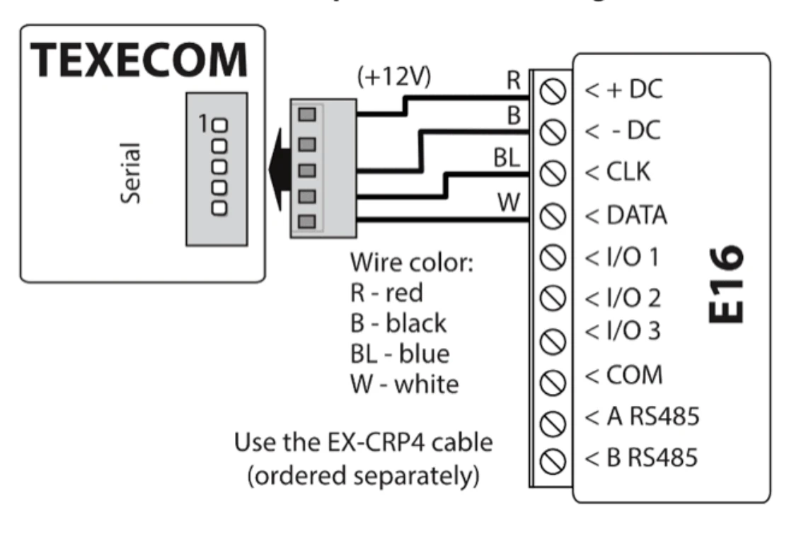

# Texecom con E16 configuración rápida

Pasos breves para conectar el comunicador E16 a paneles Texecom Premier y Premier Elite, configurar E16 para reportes IP y añadir el sistema a Protegus2. Utilice esta guía junto con el manual completo de E16 para el resto de los ajustes.

!!! caution "Precaución"
    La instalación y el servicio deben ser realizados solo por personal cualificado. Desconecte la alimentación antes de cablear. Los cambios no autorizados anulan la garantía.

## Requisitos

- Comunicador E16 con LAN conectado y un cable USB Mini-B para la configuración.
- Panel Texecom Premier / Premier Elite con acceso de instalador.
- Cable Texecom EX-CRP4 para la conexión serie.
- ID / número de cuenta del objeto del CRA si va a reportar al CRA.
- Cuenta de Protegus2 y MAC / Unique ID del comunicador.

## Configuración rápida con el software *TrikdisConfig*

1. Descargue **TrikdisConfig** de [www.trikdis.com](http://www.trikdis.com) e instálelo.
2. Abra la carcasa del E16 con un destornillador plano.

3. Conecte el E16 al ordenador mediante un cable USB Mini-B.
4. Ejecute **TrikdisConfig**. El software reconocerá el comunicador y abrirá la ventana de configuración.
5. Pulse **Leer [F4]** para cargar la configuración actual. Si se solicita, introduzca el código de 6 dígitos del Administrador o del Instalador.

Complete la subsección que corresponda a la instalación:

- **App Protegus2** si los usuarios van a controlar el sistema de forma remota.
- **Central Receptora de Alarmas** si el comunicador reportará al CRA.
- Complete ambas subsecciones si el comunicador debe funcionar con el CRA y con Protegus2.

### Opciones de conexión para la app de Protegus2

**En la ventana de "Ajustes del sistema":**

1. Seleccione el **Modelo de panel** que se conectará al comunicador.
2. Active **Armado/Desarmado Remoto** si los usuarios deben controlar el panel desde Protegus2 con su código de teclado.
3. Para el control directo de paneles Paradox y Texecom, introduzca la **Contraseña de descarga PC/UDL del panel**. Debe coincidir con la contraseña configurada en el panel.

!!! note "Nota"
    Para que funcione el control directo, el panel también debe programarse como se describe más abajo en la sección específica del panel.

**En la ventana de "Informes para usuario", pestaña "Servicio PROTEGUS":**

4. Marque **Habilitar conexión** al servicio Protegus.
5. Cambie el **Código de acceso a PROTEGUS Cloud** si desea que se solicite al añadir el sistema a Protegus2.

Después de terminar la configuración, haga clic en **Escribir [F5]** y desconecte el cable USB.

### Configuración para conectarse con el CRA

**En la ventana de "Ajustes del sistema":**

1. Introduzca el **ID del objeto** proporcionado por la Central Receptora.
2. Seleccione el **Modelo de panel** que se conectará al comunicador.

**En la ventana de "Ajustes de CRA", opciones del "Canal principal":**

3. Configure el **Modo de comunicación** en **IP**.
4. Seleccione el protocolo requerido por el receptor: **TRK**, **DC-09_2007**, **DC-09_2012** o **TL150**.
5. Introduzca la clave de cifrado del receptor si el protocolo seleccionado la requiere.
6. Introduzca el **Dominio o IP** y el **Puerto** del receptor.
7. Seleccione **TCP** o **UDP**.
8. Configure los canales de respaldo y en paralelo si la instalación requiere redundancia.

!!! note "Nota"
    Si selecciona un protocolo **DC-09**, en la pestaña **Opciones** de la ventana de **Ajustes de CRA** introduzca también los números de objeto, línea y receptor.

Después de terminar la configuración, haga clic en **Escribir [F5]** y desconecte el cable USB.

## Cableado

Utilice el cable Texecom EX-CRP4 (pedido por separado) y conecte el panel al E16 como se muestra a continuación:

| Terminal E16 | Cable Texecom EX-CRP4 | Notas |
| --- | --- | --- |
| `+DC` | `R` (rojo) | Alimentación `+12V` |
| `-DC` | `B` (negro) | Tierra del panel |
| `CLK` | `BL` (azul) | Bus serie |
| `DATA` | `W` (blanco) | Bus serie |

## Programación del panel

Los paneles Texecom deben programarse tanto para lectura de eventos como para control remoto.

1. En **Wintex**, abra **Communication Options** y vaya a la pestaña **Options**.
2. Introduzca el **UDL passcode** de 4 dígitos.
3. Asegúrese de que el **UDL passcode** coincida con la **Contraseña PC download/UDL del panel** introducida en **Ajustes del sistema** de E16 cuando **Armado/Desarmado Remoto** esté habilitado.
4. Si programa desde un teclado, introduzca el código de instalador de 4 dígitos y pulse **[Menu]** para entrar al modo de programación.
5. Pulse **[9]**, después **[7][6][2]**, e introduzca el **UDL passcode** de 4 dígitos.
6. Pulse **[Yes]** y salga del modo de programación pulsando **[Menu]**.

## Añadir sistema a Protegus2

1. Abra [Protegus2](https://www.protegus.app) y pulse **Agregar nuevo sistema**.
1. Introduzca el **MAC / Unique ID** del E16.
1. Introduzca el nombre del sistema y termine el asistente.
1. Si utiliza control por zona keyswitch en lugar de control directo, conecte `I/O 1` a la zona keyswitch del panel y configure el área en Protegus2 con `PGM1` en modo **Pulse** o **Level**.
1. Espere hasta que el sistema aparezca en línea.

## Comprobación del sistema

1. Arme y desarme el sistema desde el teclado.
1. Genere una alarma de prueba mientras el sistema esté armado.
1. Confirme que los eventos llegan al CRA y a Protegus2.
