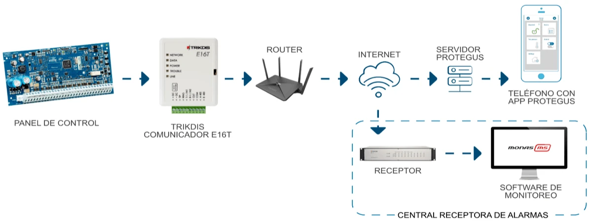
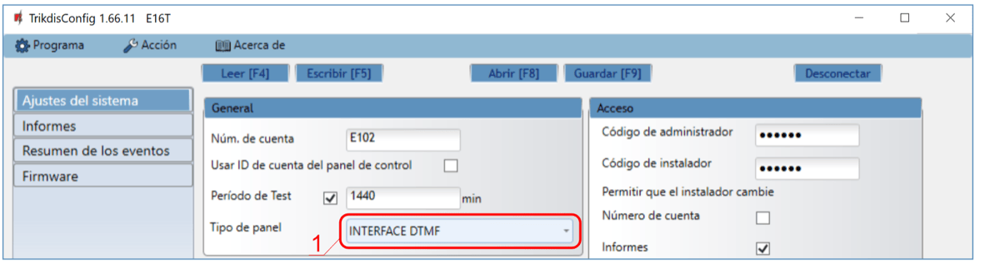
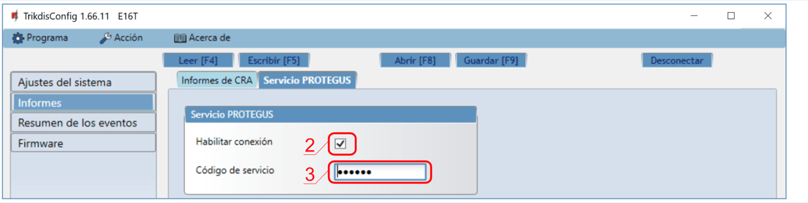
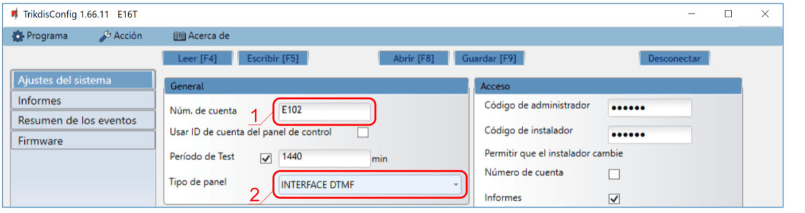
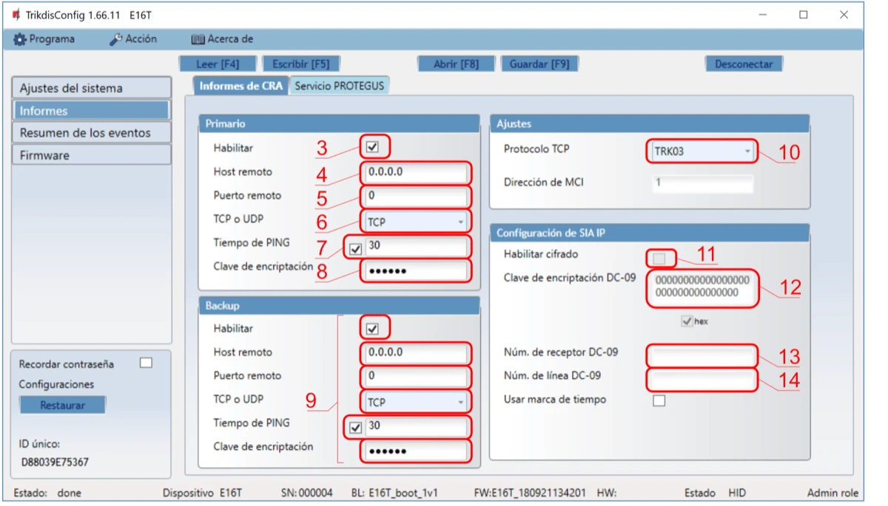
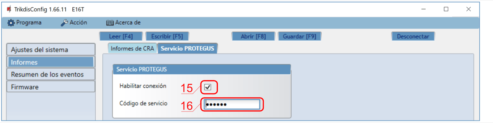
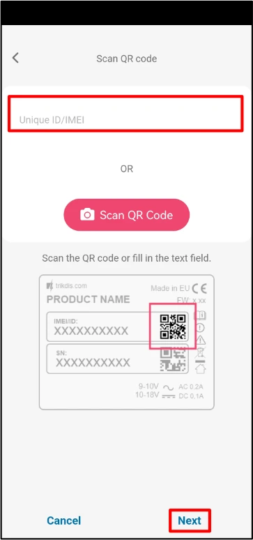

# E16T configuración rápida

Pasos breves para conectar el comunicador E16T al comunicador telefónico del panel, configurar el reporte IP y añadir el sistema a Protegus. Utilice esta guía junto con el manual completo de E16T para el resto de los ajustes.

!!! caution "Precaución"
    La instalación y el servicio deben ser realizados solo por personal cualificado. Desconecte la alimentación antes de cablear. Los cambios no autorizados anulan la garantía.

## Requisitos

- Comunicador E16T con LAN conectado y un cable USB Mini-B para la configuración.
- Panel con comunicador telefónico que soporte Contact ID mediante tonos DTMF.
- Acceso de instalador / teclado al panel.
- Número de cuenta del CRA si va a reportar al CRA.
- Cuenta de Protegus y MAC / Unique ID del comunicador.

## Configuración rápida con el software *TrikdisConfig*

1. Descargue **TrikdisConfig** de [www.trikdis.com](http://www.trikdis.com) e instálelo.
2. Abra la carcasa del E16T con un destornillador plano.

3. Conecte el E16T al ordenador mediante un cable USB Mini-B.
4. Ejecute **TrikdisConfig**. El software reconocerá el comunicador y abrirá la ventana de configuración.
5. Pulse **Leer [F4]** para cargar la configuración actual. Si se solicita, introduzca el código de 6 dígitos del Administrador o del Instalador.

Complete la subsección que corresponda a la instalación:

- **App Protegus** si los usuarios van a controlar el sistema de forma remota.
- **Central Receptora de Alarmas** si el comunicador reportará al CRA.
- Complete ambas subsecciones si el comunicador debe funcionar con el CRA y con Protegus.

### Opciones de conexión para la app de Protegus

**En la ventana de "Ajustes del sistema":**

1. Seleccione el **Modelo de panel** que se conectará al comunicador.

**En la ventana de "Informes", pestaña "Servicio Protegus":**

2. Marque **Habilitar conexión** en la configuración del servicio Protegus.
3. Cambie el **Código de servicio** si desea que se solicite al añadir el sistema a Protegus.

Después de terminar la configuración, haga clic en **Escribir [F5]** y desconecte el cable USB.

### Configuración para conectarse con el CRA

**En la ventana de "Ajustes del sistema":**

1. Introduzca el **Número de cuenta** proporcionado por la Central Receptora.
2. Seleccione el **Modelo de panel** que se conectará al comunicador.

**En la ventana de "Informes", opciones del canal "Primario":**

3. Habilite el canal principal de comunicación.
4. Introduzca el **Host remoto** y el **Puerto remoto** del receptor.
5. Seleccione **TCP** o **UDP**.
6. Configure el **Tiempo de PING** y la clave de cifrado requerida por el receptor.
7. Configure los ajustes de **Respaldo** si la instalación requiere redundancia.
8. Seleccione el protocolo TCP requerido por el receptor: **TRK**, **DC-09_2007** o **DC-09_2012**.
9. Si utiliza **DC-09_2012**, configure también el cifrado y los números de receptor y línea.

**En la ventana de "Informes", pestaña "Servicio Protegus":**

10. Marque **Habilitar conexión** a Protegus si los usuarios utilizarán la app.
11. Cambie el **Código de servicio** si desea que se solicite al añadir el sistema a Protegus.

!!! note "Nota"
    Si selecciona un protocolo **DC-09**, en la pestaña **Configuración** de la ventana de **Informes** introduzca también los números de objeto, línea y receptor.

Después de terminar la configuración, haga clic en **Escribir [F5]** y desconecte el cable USB.

## Cableado

Conecte el E16T a la alimentación del panel, `TIP` / `RING` y LAN como se muestra a continuación:

Si el panel va a armarse o desarmarse mediante una salida de keyswitch, conecte la zona keyswitch del panel a `OUT` como se muestra en el mismo diagrama.

## Programación del panel

Programe el comunicador telefónico del panel de la siguiente manera:

1. Habilite el comunicador telefónico del panel.
2. Si el E16T está conectado directamente a `TIP` / `RING`, introduzca cualquier número de teléfono de al menos 2 dígitos.
3. Seleccione el modo de marcación `DTMF`.
4. Seleccione el protocolo de comunicación `Contact ID`.
5. Introduzca el número de cuenta de 4 dígitos del panel.

## Ajustes especiales para Honeywell Vista 48

Si el panel conectado es Honeywell Vista 48, configure estos valores:

| Sección | Datos | Sección | Datos | Sección | Datos |
| --- | --- | --- | --- | --- | --- |
| `*41` | `1111` | `*60` | `1` | `*69` | `1` |
| `*42` | `1111` | `*61` | `1` | `*70` | `1` |
| `*43` | `1234` | `*62` | `1` | `*71` | `1` |
| `*44` | `1234` | `*63` | `1` | `*72` | `1` |
| `*45` | `1111` | `*64` | `1` | `*73` | `1` |
| `*47` | `1` | `*65` | `1` | `*74` | `1` |
| `*48` | `7` | `*66` | `1` | `*75` | `1` |
| `*50` | `1` | `*67` | `1` | `*76` | `1` |
| `*59` | `0` | `*68` | `1` |  |  |

Salga del modo de programación con `*99`.

## Añadir sistema a Protegus

1. Abra [Protegus](https://www.protegus.app) y pulse **Agregar nuevo sistema**.
1. Introduzca el **MAC / Unique ID** del E16T.
1. Introduzca el nombre del sistema y termine el asistente.
1. Si conectó `OUT` a una zona keyswitch, abra **Settings** en Protegus y habilite **Arm/Disarm with PGM Output 1**.
1. Seleccione el modo **Pulse** o **Level** para que coincida con el tipo de zona keyswitch del panel.

## Comprobación del sistema

1. Arme y desarme el sistema desde el teclado.
1. Genere una alarma de prueba mientras el sistema esté armado.
1. Confirme que los eventos llegan al CRA y a Protegus.
