# Comunicador Celular G17F

  

## Descripción 

El comunicador G17F cumple con los requisitos de la norma EN 54-21:2006.

El producto cumple con los requisitos de rendimiento de la norma EN54-21 Anexo A para el tipo de sistema de transmisión tipo  1.

Comunicador G17F Certificado No: 1922-CPR-1974. Sistemas de detección y alarma de incendios. Equipos de transmisión de alarmas y avisos de fallo.

El producto está certificado por el organismo de certificación de producto notificado: No.1922 "Dedal", Nesebar Mladost str. 50, Bulgaria, 8230

Contactos de soporte técnico de Trikdis: support@trikdis.lt, +37067422877

El *G17F* se utiliza para transmitir mensajes del panel de control de alarma contra incendios a través de la red celular.

Principio de funcionamiento. Cuando se viola una entrada (zona) del comunicador, el G17F transmitirá un mensaje de evento al receptor de la estación Central de Monitoreo o a la aplicación Protegus2 a través de Internet móvil. También puede enviar mensajes SMS y realizar llamadas telefónicas. El comunicador está disponible con módems 2G o 4G.

**Características**

Envía eventos al receptor en una CRA

- Envía información de eventos a receptores de software y hardware TRIKDIS, que funcionan con cualquier software de monitoreo.

- Puede enviar eventos a los receptores SIA DC-09.

- Si se pierde la conexión a través del canal principal, los mensajes se envían automáticamente a un receptor de respaldo.

- Puede reportar eventos a la Estación Central de Monitoreo usando mensajes SMS. Extremadamente útil porque funciona incluso cuando la conectividad IP se interrumpe en la red del operador móvil.

- Reconocimiento de interferencias en la red celular.

- Puede reportar eventos simultáneamente a la Estación Central de Monitoreo y trabajar con la aplicación *Protegus2*. Es posible establecer la prioridad para el envío de eventos a la Estación Central de Monitoreo.

- Los mensajes de eventos se envían en códigos Contact ID.

Mensajes a los usuarios

- Llama a números de teléfono seleccionados (hasta 8 usuarios).

- Enviar mensajes SMS sobre eventos.

- Notificaciones de eventos de sonido especiales y “Push” utilizando la aplicación Protegus2.

**Control remoto de salidas**

- A través de la aplicación Protegus2.

- Llamando al número de teléfono del dispositivo.

- A través de mensajes SMS.

**Configuración e instalación**

- Instalación rápida y fácil.

- Configuración del dispositivo mediante un cable USB o de forma remota mediante el software TrikdisConfig.

- Actualización remota de firmware.

- Dos niveles de acceso (tipos de cuentas) para la configuración de parámetros: para el instalador y para el administrador.

**Entradas y salidas**

- 3 entradas, tipo seleccionable: NO, NC, EOL (4,7 kΩ, 10kΩ).

- 3 terminales de Entradas/Salidas de doble propósito que se pueden configurar como terminales de entrada (IN) o salida (OUT). Tipos de entrada seleccionables: NO, NC, EOL (4,7 kΩ, 10 kΩ).

- Bus RS485 para conectar módulos expansores de la serie iO.

- Usando expansores de la serie iO, el número de entradas (IN) o salidas (OUT) se puede aumentar a 12.

### Especificaciones 

| Parámetro | Descripción |
|:---|----|
| Frecuencias de módem 2G | 850 /​ 900 /​ 1800 /​ 1900 MHz |
| Frecuencias de módem 4G | 700 /​ 800 /​ 900 /​ 1800 /​ 2100 /​ 2600 MHz |
| Tensión de alimentación | 9-32 V DC |
| Consumo actual | 50 mA (en modo espera) /​ Hasta 200 mA (durante el envío de datos) |
| Protocolos de transmisión | TRK, SIA DC-09_2007, SIA DC-09_2012 |
| Clave de encriptación | Clave de cifrado de 6 símbolos |
| Conexión a CRA | TCP/​IP o UDP/​IP, SMS |
| Códigos de eventos | Códigos de Contact ID |
| Memoria de eventos no enviados | Hasta 60 eventos |
| Entradas y Salidas | 3 entradas, se pueden configurar como tipo NO, NC, EOL (4,7 kΩ, 10 kΩ) /​ 3 terminales de doble propósito (IN/​OUT), pueden configurarse como entradas de tipo NO, NC, EOL (4,7 kΩ, 10 kΩ) o salidas de tipo colector abierto (OC) con corriente de hasta 100 mA |
| Memoria de registro de eventos | Hasta 1000 eventos |
| Modificación de los ajustes | Con el software de configuración TrikdisConfig de forma remota o local a través del puerto USB Mini-B /​ Remotamente con mensajes SMS |
| Longitud del bus de datos *RS485* | Hasta 100 m |
| Módulos soportados | iO – módulo expansor;​ /​ iO-WL - iO-MO – iO-WL transmisor-receptor de ondas de radio;​ /​ iO-8 - módulo expansor;​ /​ E485 – módulo „Ethernet“ ;​ /​ W485(W17u) – módulo WiFi;​ /​ iO-LORA – módulo expansor;​ /​ iO8-LORA – módulo expansor;​ /​ **PB-LORA** – botón de alarma;​ /​ **REL-LORA** - módulo expansor;​ /​ **INIM Smartline** – panel de control de incendios;​ /​ **NSC Solution** - panel de control de incendios;​ /​ **C-TEC Cast ZFP** – panel de control de incendios;​ /​ Panel de control de incendios con protocolo **ESPA 4.4.4**. |
| Entorno operativo | Temperatura de -20 ° C a 50 ° C, humedad relativa - de hasta 80% a 20°C |
| Dimensiones | 92 x 62 x 26 mm |
| Peso | 80 g |

### Elementos del comunicador G17F 

1.  Antena celular y conector SMA.

2.  Indicadores luminosos.

3.  Ranura frontal para abrir.

4.  Conexiones para cableado externo.

5.  Puerto mini-B USB para la programación del comunicador.

6.  Ranura para tarjetas SIM.

### Purpose of terminals

| Terminal | Descripción |
|----------|-------------|
| +DC | Terminal de alimentación (terminal positivo de 9 - 32 V DC) |
| -DC | Terminal de alimentación (terminal negativo de 9 - 32 V DC) |
| 1 IN | 1er terminal de entrada, tipo seleccionable: NO, NC, EOL (4,7 kΩ, 10 kΩ) (configuración predeterminada: entrada EOL = 10 kΩ) |
| 2 IN | 2do terminal de entrada, tipo seleccionable: NO, NC, EOL (4,7 kΩ, 10 kΩ) (configuración predeterminada: entrada EOL = 10 kΩ) |
| COM | Terminal común (negativo) |
| 3 I/​O | 3ro terminal de doble propósito (ENTRADA/​SALIDA), se puede configurar como entrada de tipo seleccionable NO, NC, EOL (4,7 kΩ, 10 kΩ) (configuración predeterminada: entrada EOL = 10 kΩ) o salida de tipo colector abierto (OC) con corriente de hasta 100 mA |
| 4 I/​O | 4ro terminal de doble propósito (ENTRADA/​SALIDA), se puede configurar como entrada de tipo seleccionable NO, NC, EOL (4,7 kΩ, 10 kΩ) (configuración predeterminada: entrada EOL = 10 kΩ) o salida de tipo colector abierto (OC) con corriente de hasta 100 mA |
| COM | Common (negative) terminal |
| 5 I/​O | 5to terminal de doble propósito (ENTRADA/​SALIDA), se puede configurar como entrada de tipo seleccionable NO, NC, EOL (4,7 kΩ, 10 kΩ) (configuración predeterminada: entrada EOL = 10 kΩ) o salida de tipo colector abierto (OC) con corriente de hasta 100 mA |
| 6 IN | 6ta terminal de entrada, tipo seleccionable: NO, NC, EOL (4,7 kΩ, 10 kΩ) (configuración predeterminada: entrada EOL = 10 kΩ) |
| A RS485 | Bus RS485 para la conexión de expansores iO, centrales de detección de incendios INIM Smartline, centrales de detección de incendios NSC Solution, centrales de detección de incendios C-TEC Cast ZFP, centrales de detección de incendios con protocolo ESPA4.4.4 y módulos E485 y W485. |

### LED indicador de operación 

| Indicador | Estado de la luz | Descripción |
|-----------|------------------|-------------|
| Network | Off | Sin conexión a la red celular |
| Network | Verde sólido con parpadeo amarillo | El comunicador está conectado a la red celular. / La potencia de la señal celular suficiente para 2G es el nivel 5 (cinco parpadeos amarillos) y para el nivel 3 de 4G (tres parpadeos amarillos) |
| Data | Verde sólido | El mensaje está siendo enviado |
| Data | Amarillo sólido | Los eventos no enviados se almacenan en el búfer |
| Power | Verde parpadeando | El voltaje de la fuente de alimentación es suficiente |
| Power | Amarillo parpadeando | La tensión de alimentación es insuficiente |
| Power | Parpadeo verde y amarillo | El modo de configuración está activado |
| Trouble | Off | No hay problemas de operación |
| Trouble | 1 parpadeo rojo | Tarjeta SIM no encontrada |
| Trouble | 2 parpadeos rojos | Problema con el código PIN de la tarjeta SIM (código PIN incorrecto) |
| Trouble | 3 parpadeos rojos | Problema con el registro a la red GSM |
| Trouble | 4 parpadeos rojos | No se puede conectar al receptor de IP usando el canal principal |
| Trouble | 5 parpadeos rojos | No se puede conectar al receptor de IP usando el canal de respaldo |
| Trouble | 6 parpadeos rojos | El reloj interno de la G17F no está ajustado |
| Trouble | 8 parpadeos rojos | Tensión de alimentación insuficiente |
| Trouble | 9 parpadeos rojos | Problemas con la conexión al módulo RS485 |

### Componentes necesarios para la instalación 

Antes de comenzar la instalación, asegúrese de tener:

1.  Un cable USB tipo Mini-B para configuración.

2.  Al menos un cable de 4 hilos para conectar el comunicador al panel de control de incendios.

3.  Un destornillador de cabeza plana de 2,5 mm.

4.  Una antena GSM externa si la cobertura de la red en el área es deficiente.

5.  Una tarjeta nano-SIM activada (las solicitudes de código PIN se pueden desactivar).

6.  El manual del panel de control de incendios al que se conectará el comunicador.

Ordene los componentes necesarios por separado en su distribuidor local.

## Configuración rápida con el software TrikdisConfig 

1.  Descargue el software de configuración de TrikdisConfig en [www.trikdis.com](http://www.trikdis.com) (En el campo de búsqueda TrikdisConfig) e instálelo.

2.  Abra la carcasa del G17F con el destornillador de cabeza plana como se muestra a continuación:

3\. Utilizando el cable USB Mini-B G17F conecte al ordenador.

4\. Ejecutar TrikdisConfig. El software reconocerá automáticamente que el comunicador está conectado y se abrirá una ventana para la configuración.

5\. Haga clic en **Leer [F4]** para leer la configuración del comunicador. Si se le solicita, introduzca el código de administrador o instalador de 6 dígitos en la ventana emergente.

A continuación, se describe qué ajustes deben establecerse para que el comunicador comience a enviar eventos al Centro de Recepción de Alarmas y permita controlar el panel de control con la aplicación Protegus2.

### Ajustes para la conexión con la aplicación Protegus2 

En la ventana "Usuarios y Reportes", grupo de configuración "Servicio PROTEGUS":

1.  Seleccione la casilla **“Activar conexión”** a la nube de Protegus.

2.  Puede cambiar el **Contraseña Protegus** para iniciar sesión en Protegus2 si desea que se le pida a los usuarios que ingresen al agregar el sistema a la aplicación Protegus2 (contraseña predeterminada - 123456).

**En la ventana "Opciones de sistema", grupo de configuración "SIM":**

3. Introduzca el código **PIN de la tarjeta SIM**.

2.  Cambiar el nombre **APN**. **APN** se puede encontrar en la página web del operador de la tarjeta SIM (“Internet” es universal y funciona en muchas redes de los operadores).

**En la ventana “Zonas”:**

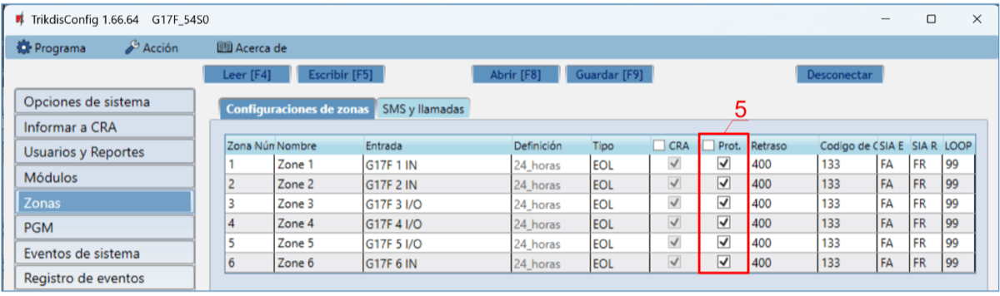

3. Marque las casillas si desea que los usuarios reciban notificaciones de Protegus2 sobre los cambios en los estados de las zonas.

**En la ventana “PGM”:**

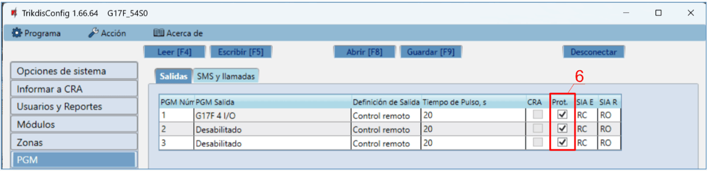

4. Marque las casillas si desea que los usuarios reciban notificaciones a Protegus2 sobre los cambios en los estados de salida de PGM.

**En la ventana "Eventos de sistema":**

5. Marque las casillas si desea que los usuarios reciban notificaciones a Protegus2 sobre cambios en los estados de eventos internos del comunicador.

Después de terminar la configuración, haga clic en el botón **Escribir [F5]** y desconecte el cable USB.

!!! note "Nota"
    Para obtener más información acerca de otros ajustes en G17F
    TrikdisConfig véase el capítulo 5 "Descripción de la ventana de
    TrikdisConfig ".
### Ajustes para la conexión con la Central Receptora de Alarmas 

**En la ventana de “Opciones de systema”:**

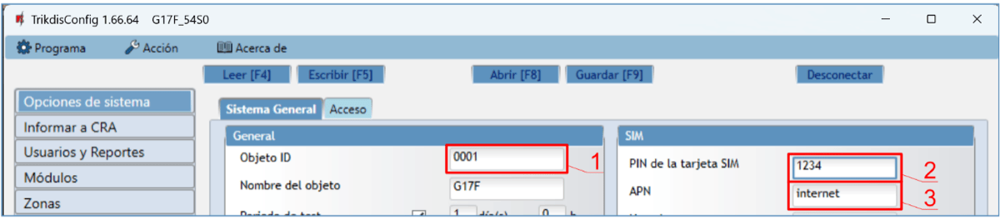

1.  Introduzca **Objeto ID** proporcionado por la Central Receptora de Alarmas (4 caracteres, 0-9, A-F. **No utilice números de objeto FFFE, FFFF**.).

2.  Introduzca el código **PIN de la tarjeta SIM**.

3.  Cambiar el nombre **APN**. **APN** se puede encontrar en la página web del operador de la tarjeta SIM ( “Internet” es universal y funciona en muchas redes de los operadores).

**En la ventana "Informar a CRA":**

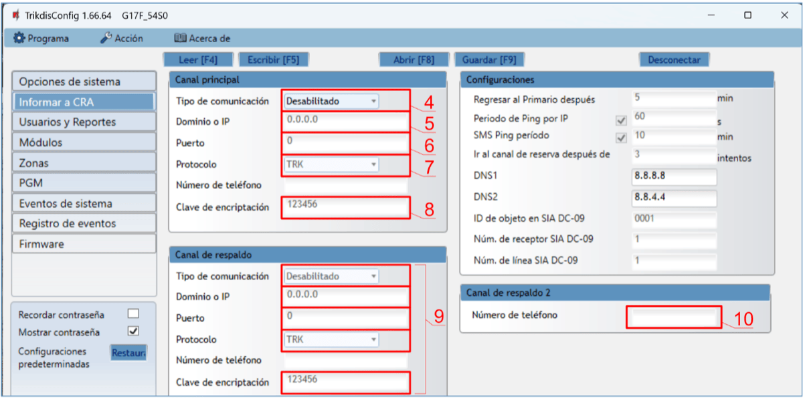

4. **Tipo de comunicación** – seleccionar el método de conexión **IP** (no recomendamos SMS como canal primario).

2.  **Dominio o IP** – **-**introduzca la dirección IP o el dominio del receptor.

3.  **Puerto** – introduzca el número de puerto de red del receptor.

4.  **Protocolo** – seleccione el tipo de protocolo para sus mensajes de eventos: **TRK** (a receptores TRIKDIS), **DC-09_2007** o **DC-09_2012** (a receptores universales).

5.  **Clave de encriptación** – introduzca la clave de cifrado que se establece en el receptor.

!!! note "Nota"
    Si desea establecer comunicación con CRA a través de mensajes SMS, sólo
    es necesario para establecer la clave de cifrado y número de teléfono.
    Los mensajes SMS pueden ser recibidas únicamente por receptores TRIKDIS:
    Receptor IP/ SMS RL14, receptor multicanal RM14 y el receptor de SMS
    GM14. / Si seleccionó el protocolo DC-09, además, en la pestaña
    **Configuración** de la ventana de **Informes CRA** ingrese los números
    de objeto, línea y receptor.
1.  (Recomendado) Configure los parámetros de canal de **Respaldo del canal Principal**.

2.  (Recomendado) Introduzca el número de informes **Informe por SMS de reserva**.

Después de terminar la configuración, haga clic en **Escribir [F5**] y desconecte el cable USB.

!!! note "Nota"
    Para obtener más información acerca de otros ajustes en ***G17F
    TrikdisConfig*** véase el capítulo 5 „Descripción de la ventana de
    TrikdisConfig".
## Instalación y cableado 

### Proceso de instalación 

1.  Antes de instalar el sistema, asegúrese de que la intensidad de la señal GSM sea suficiente en el lugar donde se montará el *G17F*.

2.  Retire la cubierta superior y extraiga la terminal de contacto.

3.  Retire la placa PCB.

4.  Fije la base de la carcasa en el lugar deseado con tornillos.

5.  Coloque la placa PCB de nuevo en la caja, inserte terminal de contacto.

6.  Atornille la antena celular.

7.  Inserte la tarjeta nano-SIM. La tarjeta SIM debe estar registrada en una red GSM y los servicios deben estar habilitados y en funcionamiento, es decir, la tarjeta debe poder llamar, enviar y recibir mensajes SMS, tener habilitados los datos móviles. <u>Pregúntele al operador de red móvil de su tarjeta SIM cómo habilitar los servicios deseados.</u>

!!! note "Nota"
    Asegúrese de que la tarjeta SIM esté activada. / Asegúrese de que el
    servicio de Internet móvil (datos móviles) esté habilitado si se
    utilizará la aplicación Protegus2 o la conexión IP con CRA. / Para
    evitar introducir el código PIN en TrikdisConfig, inserte la
    tarjeta SIM en el teléfono móvil y desactive la función de solicitud de
    PIN.
8. Para configurar el **G17F** de forma remota, inserte una tarjeta SIM con solicitudes de código PIN deshabilitadas. Encienda la fuente de alimentación del comunicador. Si el G17F no fue configurado usando TrikdisConfig y el servicio Protegus no fue habilitado, envíe el mensaje SMS: **CONNECT 123456 PROTEGUS=ON,APN=INTERNET**

2.  El cambio de parámetros de forma remota se detalla en el capítulo 6 "**Configuración de parámetros de forma remota**".

3.  Cierre la cubierta superior.

### Esquema para conectar el comunicador a un panel de control de incendios 

Si desea monitorear el estado del panel de alarma contra incendios, conecte sus salidas correspondientes a las entradas *G17F*. Las salidas (PGM1, PGM2, PGM3) del panel de incendios deben configurarse como salidas de estado del panel (Alarma, Problema, etc.)

### Diagrama de conexión del comunicador a la central de incendios ESPA4.4.4 

Configuración del comunicador G17F con TrikdisConfig al conectar el panel de control de alarma contra incendios con el protocolo **ESPA4.4.4**.

1.  Seleccione „**ESPA4.4.4“**.

2.  Seleccione la velocidad de transferencia de datos de la interfaz.

3.  El comunicador G17F y el panel de control de incendios deben tener la misma configuración de transmisión de datos.

4. Ingrese números de teléfono de los usuarios que deben recibir mensajes de G17F.

5. Si desea que el usuario reciba mensajes (y llamadas) sobre eventos, marque la casilla SMS (y Llamada).

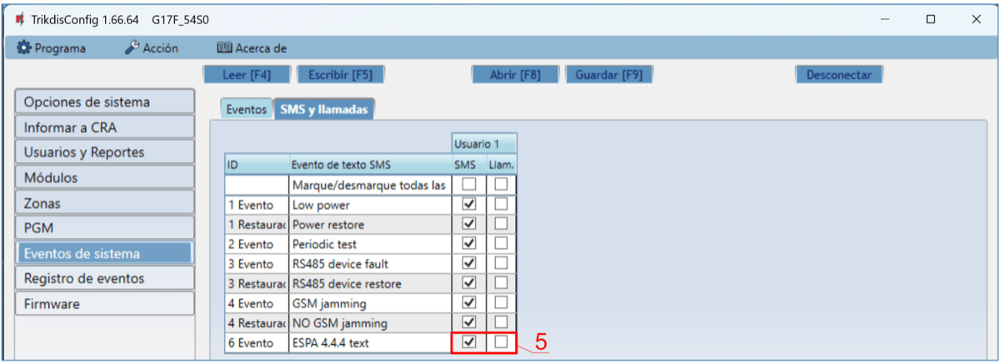

6. Configure el canal de comunicación si se deben enviar mensajes al receptor CRA. Los mensajes de eventos se transmiten utilizando el protocolo SIA DC-09.

Pruebe el sistema. Active la alarma contra incendios y verifique que los mensajes G17F se envíen a la CRA (estación central de monitoreo) y a Protegus2.

### Diagrama de conexión del comunicador a la central de incendios NSC Solution 

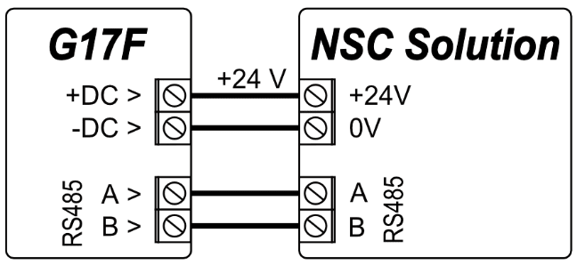

Configuración del comunicador G17F con TrikdisConfig al conectar el panel de control de alarma contra incendios **NSC Solution**.

1.  Seleccione el panel de control de alarma contra incendios **NSC Solution**.

2.  La “**NSC slavе address**” no debe coincidir con la dirección de los módulos del panel de control de incendios conectados.

3. Introduzca los números de teléfono de los usuarios que deben recibir mensajes de G17F.

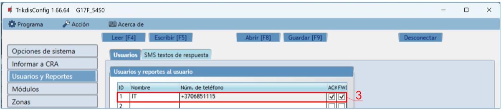

4. Los usuarios recibirán mensajes SMS y llamadas telefónicas sobre los eventos que estén marcados. Puede agregar códigos de eventos CID adicionales en la columna **CID**. Debe ingresar mensajes de **Texto SMS** junto a los nuevos códigos. Si desea que el usuario reciba mensajes (o llamadas) sobre eventos, marque la casilla **SMS** (o **Llamada**).

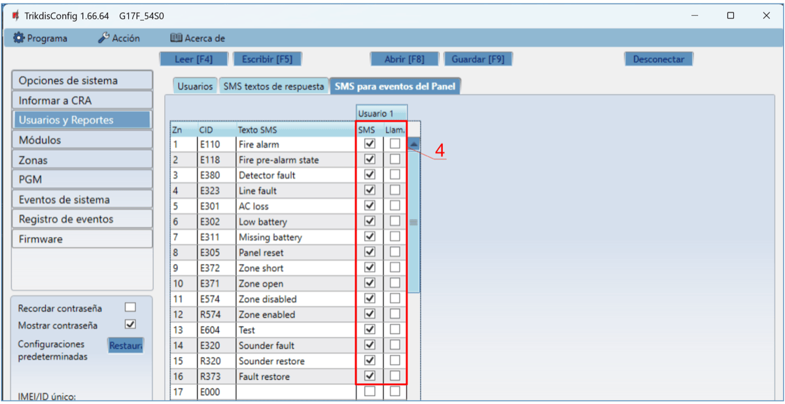

5. Configure el canal de comunicación si los mensajes deben enviarse al receptor CRA.

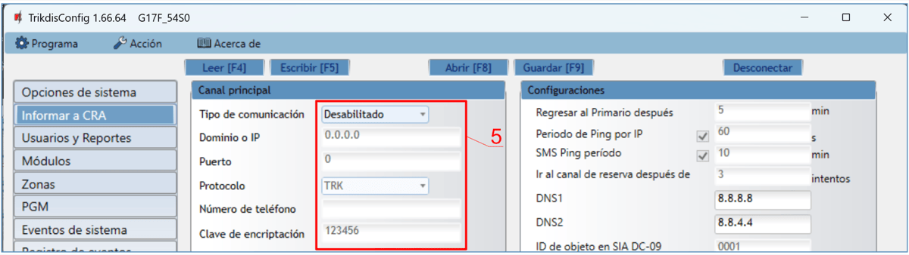

Después de configurar el comunicador G17F, encienda la alimentación del panel de control de incendios. Espere a que se cargue el software del panel de control de incendios. Es necesario escanear los módulos conectados al bus RS485 en el panel de control de incendios. En el panel de control de incendios, presione: **PROG.>INSTALLER>(Ingrese el código de instalador) 00000 OK>(Seleccione) SETTINGS>ENTER>(Seleccione) SCAN RS485>ENTER**. Espere a que se complete el escaneo. Regrese a la pantalla principal presionando “**CANCEL**” dos veces.

Pruebe el sistema. Active la alarma contra incendios y verifique que los mensajes G17F se envíen a la CRA (estación central de monitoreo) y a Protegus2.

### Diagrama de conexión del comunicador a la central de incendios INIM Smartline 

El modo "**Slave**" debe configurarse para el panel **INIM Smartline** cuando se conecta al comunicador G17F a través del bus RS485.

!!! note "Nota"
    No puede conectar el G17F usando el bus RS485 si los repetidores
    están conectados al panel **INIM Smartline**. / Los módulos de expansión
    iO no son compatibles cuando el G17F está conectado al panel
    **INIM Smartline** a través del bus RS485.
Configuración del comunicador G17F con TrikdisConfig al conectar el panel de control de alarma contra incendios **INIM Smartline**.

1.  Seleccione el panel de alarma contra incendios **INIM Smartline**.

2. Introduzca los números de teléfono de los usuarios que deben recibir mensajes de G17F.

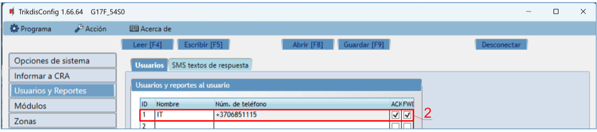

3. Los usuarios recibirán mensajes SMS y llamadas telefónicas sobre los eventos que estén marcados. Puede agregar códigos de eventos CID adicionales en la columna **CID**. Debe ingresar mensajes de **Texto SMS** junto a los nuevos códigos. Si desea que el usuario reciba mensajes (o llamadas) sobre eventos, marque la casilla **SMS** (o **Llamada**).

4. Configure el canal de comunicación si los mensajes deben enviarse al receptor CRA.

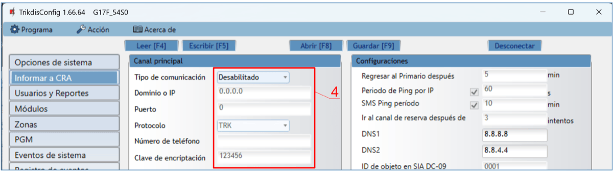

Pruebe el sistema. Active la alarma contra incendios y verifique que los mensajes G17F se envíen a la CRA (estación central de monitoreo) y a Protegus2.

### Diagrama de conexión del comunicador a la central de incendios C-TEC Cast ZFP 

Configuración del comunicador G17F con TrikdisConfig al conectar el panel de alarma contra incendios **C-TEC Cast ZFP.**

1.  Seleccione el panel de control de alarma contra incendios **C-TEC Cast ZFP**.

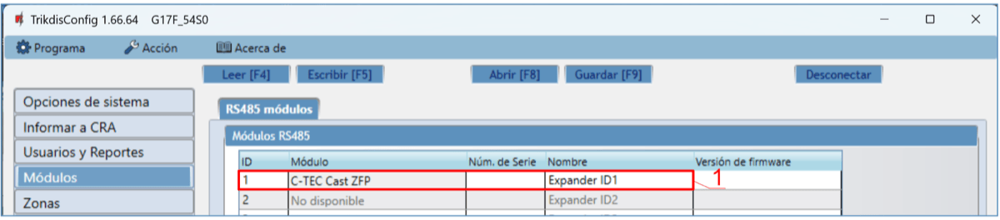

1.  Introduzca los números de teléfono de los usuarios que deben recibir mensajes de G17F.

2. Los usuarios recibirán mensajes SMS y llamadas telefónicas sobre los eventos que estén marcados. Puede agregar códigos de eventos CID adicionales en la columna **CID**. Debe ingresar mensajes de “**Texto SMS**” junto a los nuevos códigos. Si desea que el usuario reciba mensajes (o llamadas) sobre eventos, marque la casilla **SMS** (o **Llamada**).

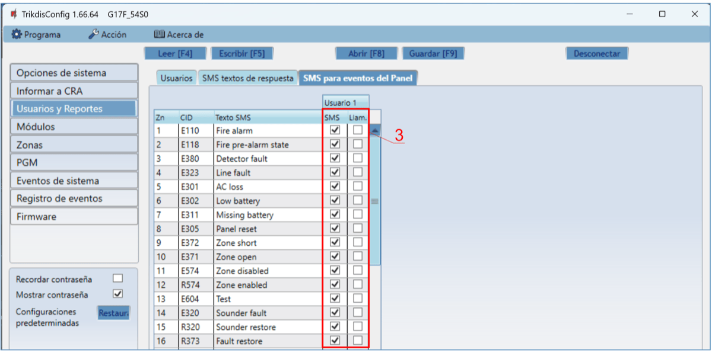

3. Configure el canal de comunicación si los mensajes deben enviarse al receptor CRA.

Instale el programa **ZFPtools** en su computadora. Inicie el programa **ZFPtools**. Encienda la alimentación de la central de incendios. Espere mientras se carga el software de la central de incendios. Conecte el cable USB2.0 A-B entre la central de incendios y el ordenador.

4. Abra la pestaña „**Node View**“.

5. Lea la configuración del panel de incendios en la computadora.

6. Ingrese el código (el código de fábrica es 4444).

2.  Haga clic en „ОК“.

3. Seleccione „BMS Interface“.

2.  Haga clic en el icono gratuito.

11. Haga clic en „**Edit Devices**“.

12. En la pestaña " **Device** ", ingrese el nombre del sistema.

13. En la pestaña "**Properties**", ingrese el nombre del sistema.

14. Especifique el bus “**ABUS RS485**” al que está conectado el comunicador G17F.

15. Personalizar los mensajes de eventos.

16. Escriba la configuración en la central de incendios.

17. Ingrese el código (el código de fábrica es 4444).

18. Haga clic en „ОК“.

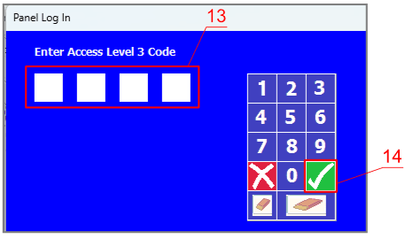

La central de incendios está programada. Desconecte el cable USB2.0 A-B de la central de incendios.

Pruebe el sistema. Active la alarma contra incendios y verifique que los mensajes G17F se envíen a la CRA (estación central de monitoreo) y a Protegus2.

### Esquemas para la conexión de entrada 

El comunicador tiene seis terminales de entrada (1 IN - 6 IN) (tres terminales son ENTRADA/SALIDA de doble propósito) para conectar circuitos de tipo NO, NC, EOL (4,7кΩ, 10 кΩ). Configuración de entrada predeterminada: monitoree un circuito de tipo EOL. Puede establecer un tipo de entrada diferente en la ventana Zonas de TrikdisConfig.

Esquemas de circuitos tipo NO, NC, EOL:

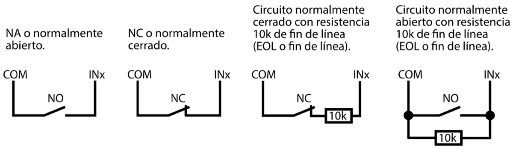

### Esquema para conectar los módulos expansores de la serie iO 

Si el comunicador necesita más entradas IN o salidas OUT, conecte un expansor de entrada y salida de la serie TRIKDIS iO cableado o inalámbrico.

### Esquema para conectar un módulo expansor iO-8 

Si necesita que el comunicador tenga más entradas IN o salidas OUT, conecte el expansor cableado *iO-8*.

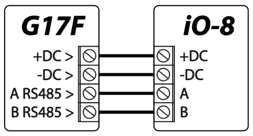

### Esquema para conectar los módulos expansores de la serie LORA 

Diagrama de conexión para los módulos expansores LORA.

### Esquema para conectar el módulo WiFi W485 

Versión de firmware del *G17F* desde 1.08*.* / El módulo *W485* envía mensajes al CRA (Centro de Recepción de Alarmas) y a *Protegus2* utilizando un enrutador de internet Wi-Fi. Cuando la conectividad Wi-Fi está disponible, el *G17F* envía mensajes de eventos a través del módulo *W485*. Cuando se interrumpe la conectividad Wi-Fi, el *G17F* envía mensajes a través de GPRS. Cuando se restablece la conectividad Wi-Fi, el *G17F* procede a enviar mensajes a través del *W485*. / La configuración del módulo Wi-Fi *W485* para que funcione con el *G17F* se describe en el capítulo 5.5. “Módulos”. / No necesita una tarjeta SIM cuando usa el *W485* con el *G17F*.

### Esquema para conectar el módulo E485 “Ethernet” 

Versión de firmware del *G17F* desde 1.08*.* / El *E485* envía mensajes al CRA (Centro de Recepción de Alarmas) y a *Protegus2* usando una conexión a internet por cable. Al utilizar el *E485* con el *GV17*, los mensajes al CRA y *Protegus2* se envían a través de Internet por cable y no se usa el internet móvil. Si se interrumpe una conectividad a internet por cable, el *GV17* envía mensajes a través de internet móvil. Al restablecerse la conectividad a internet por cable, el *G17F* comienza a enviar mensajes a través de *E485*. / La configuración del módulo *E485* para funcionar con el *G17F* se describe en el capítulo 5.5. “Módulos”. / No necesita una tarjeta SIM cuando usa el *E485* con el *G17F*.

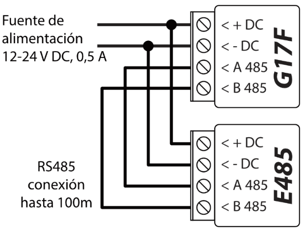

### Encendido del comunicador 

Para encender el comunicador, primero debe proporcionar una fuente de alimentación para el panel de control de incendios. Si el comunicador funciona correctamente, las siguientes luces indicadoras G17F deben encenderse:

- El LED de “**POWER**” debe estar verde fijo (voltaje de alimentación suficiente);

- El LED de “**NETWORK**” debe estar verde fijo y parpadear en amarillo cuando el comunicador está conectado a una red.

!!! note "Nota"
    Nivel de señal 2G suficiente: 5 (cinco destellos amarillos del indicador
    "NETWORK"). Nivel de señal 4G suficiente: 3 (tres destellos amarillos
    del indicador "NETWORK"). / Si cuenta menos de 3 destellos amarillos
    del LED "NETWORK", el nivel de la señal GSM es insuficiente.
    Recomendamos elegir un lugar diferente para instalar el comunicador o
    usar una antena GSM más sensible. / Si la indicación es diferente,
    busque la explicación en el capítulo 1.4 "LED indicador de
    operación". / Si las luces indicadoras del G17F están
    completamente inactivas, verifique la fuente de alimentación y las
    conexiones.
## Control remote 

### Conectado el comunicador a la app Protegus2 

Con Protegus2, los usuarios pueden ver el estado del sistema y recibir notificaciones sobre los eventos del sistema.

1.  Descargue y abra la aplicación Protegus2 o utilice la versión de navegador de internet: [www.protegus.app](https://www.protegus.app):

    

      
      
      
    

2.  Inicie sesión con su nombre de usuario y contraseña o regístrese para crear una nueva cuenta.

!!! note "Nota"
    Al agregar el sistema a Protegus2, el comunicador G17F debe:
    
    1.  Tener una tarjeta SIM insertada y activada con el código PIN
        ingresado o deshabilitado;
    
    2.  Tenga habilitado el servicio Protegus. Consulte la
        ventana 5.4 "Usuarios y Reportes";
    
    3.  Encienda la alimentación (el LED "POWER" debe estar verde fijo);
    
    4.  Estar conectado a una red (el LED de "NETWORK" debe ser verde fijo
        y parpadear en amarillo).
3. Haga clic en Agregar nuevo sistema e ingrese el número de "IMEI/Unique ID" del *G17F*. Se puede encontrar en el dispositivo y en la etiqueta del empaque. Después de ingresar la ID única, haga clic en el botón „Siguiente”.

### Configuración y control a través de mensajes SMS 

1.  **Cambiar la contraseña de administrador**

Para garantizar la seguridad, cambie la contraseña de SMS de administrador predeterminada. Enviar un mensaje SMS del siguiente formato:

#### PSW 123456 xxxxxx

| **123456** | Contraseña de administrador predeterminada      |
|------------|-------------------------------------------------|
| **xxxxxx** | Nueva contraseña de administrador de 6 símbolos |

1.  **Permitir a otras usuarias controlar**

Solo los números de teléfono de la lista de usuarios pueden controlar el sistema mediante mensajes SMS o llamadas telefónicas. Desde un teléfono de administrador, envíe mensajes SMS con los números de teléfono y nombres de otras personas para que puedan controlar el sistema:

#### SETN xxxxxx PHONEx=+PHONENR#NAME

| **xxxxxx** | contraseña de administrador de 6 símbolos |
|----|----|
| **x** | Número de usuario en la lista. (Si escribe 1 como número de usuario, transferirá sus derechos de administrador al otro usuario) |
| **PHONENR** | Número de teléfono del usuario |
| **NAME** | Nombre del usuario |

#### Lista de comandos SMS

| Comando | Dato | Descripción |
|---------|------|-------------|
| INFO |  | Solicitar información sobre el comunicador. El tipo de comunicador, el número de IMEI, el número de serie y la versión del firmware se incluirán en la respuesta. Por ejemplo: INFO 123456 |
| RESET |  | Reinicie el dispositivo. Por ejemplo: RESET 123456 |
| OUTPUTx | ON | Prendiendo la salida, "x" identifica el número de salida. |
| OUTPUTx | OFF | Por ejemplo: OUTPUT1 123456 ON |
| OUTPUTx | PULSE=ttt | Apagando la salida, "x" identifica el número de salida. |
| OUTPUTx |  | Por ejemplo: OUTPUT1 123456 OFF |
| OUTPUTx |  | Encienda una salida durante unos segundos. “x” es el número de salida de OUT y “ttt” es un número de tres dígitos que especifica el tiempo de pulso en segundos. Por ejemplo: OUTPUT1 123456 PULSE=002 |
| PSW | New password | Cambia la contraseña. Por ejemplo: PSW 123456 654123 |
| TIME | YYYY/MM/DD,12:00:00 | Establecer fecha y hora. Por ejemplo: TIME 123456 2025/05/09,10:03:00 |
| TXTA | Nombre del objeto | Especificar un nombre de objeto. Por ejemplo: TXTA 123456 House |
| TXTE | Z1= / ........ / Z12= | Personalice el texto del mensaje SMS de alarma de zona: Z1...Z12 - ingrese el número de zona. / Por ejemplo: TXTE 123456 Z1=ALARM in Zone1 |
| TXTR | Z1= / ........ / Z12= | Personalice el texto del mensaje SMS de restauración de zona: Z1...Z12 - ingrese el número de zona. / Por ejemplo: TXTR 123456 Z1=Restore Zone1 |
| RDR | PhoneNR#SMStext | Reenviar mensajes SMS al número especificado. El número de teléfono debe comenzar con un signo "+" y el código internacional del país. |
| RDR | PhoneNR#SMStext | Por ejemplo: RDR 123456 +37061234567#forwarded text |
| ASKI | Solicitar mensaje SMS sobre estados de entradas IN. |
| ASKI | Por ejemplo: ASKI 123456 |
| ASKO | Solicitar mensaje SMS sobre estados de salidas OUT. |
| ASKO | Por ejemplo: ASKO 123456 |
| SETN | PhoneX=PhoneNR#Name | Agregue un número de teléfono, un nombre de usuario y asígnelo al usuario "x". “x” es la línea del número de teléfono en la lista. El número de teléfono debe comenzar con un símbolo "+" y el código internacional del país. El número de teléfono y el nombre de usuario deben estar separados por un símbolo #. |
| SETN | PhoneX=DEL | Por ejemplo: SETN 123456 PHONE5=+37061234567#JOHN |
| SETN |  | Eliminar el número de teléfono y el nombre del usuario del sistema. / Por ejemplo: SETN 123456 PHONE5=DEL |
| UUSD | *Uusd code# | Enviar un código USSD al operador. Por ejemplo: UUSD 123456 *245# |
| CONNECT | Protegus=ON | Conéctese a la nube de Protegus. |
| CONNECT | Protegus=OFF | Por ejemplo: CONNECT 123456 PROTEGUS=ON |
| CONNECT | Code=123456 | Desconéctese de la nube de Protegus. |
| CONNECT | IP=0.0.0.0:8000 | Por ejemplo: CONNECT 123456 PROTEGUS=OFF |
| CONNECT | IP=0 | Código de servicio en la nube de Protegus. / Por ejemplo: CONNECT 123456 CODE=123456 |
| CONNECT | ENC=123456 | Especifique la IP TCP y el puerto del canal de conexión del servidor principal. Por ejemplo: CONNECT 123456 IP=0.0.0.0:8000 |
| CONNECT | APN=Internet | Para apagar el canal principal. Por ejemplo: CONNECT 123456 IP=0 |
| CONNECT | USER=user | Llave de encriptación TRK. Por ejemplo: CONNECT 123456 ENC=123456 |
| CONNECT | PSW=password | Nombre APN. Por ejemplo: CONNECT 123456 APN=INTERNET |
| CONNECT |  | Nombre APN. Por ejemplo: CONNECT 123456 USER=User |
| CONNECT |  | Contraseña APN. Por ejemplo: CONNECT 123456 PSW=Password |

### Controle las salidas PGM mediante llamadas telefónicas 

!!! note "Nota"
    Si no se han agregado usuarios al sistema, el primero en llamar al
    G17F se convertirá en el administrador del sistema y será el único
    que podrá controlar el G17F mediante llamadas telefónicas y
    comandos SMS. / Si desea permitir que otros usuarios controlen el
    sistema mediante llamadas telefónicas, agréguelos con
    TrikdisConfig o concédales los derechos mediante comandos SMS.
Realice estas acciones si desea controlar una salida PGM de forma remota:

- El usuario debe tener permiso para controlar las salidas OUT y la salida OUT debe tener asignado el tipo “Control remoto” (usando TrikdisConfig).

- Llamar al número de la tarjeta SIM del G17F. El *G17F* contestará la llamada y podrá marcar comandos usando el teclado del teléfono (ver la tabla).

#### Lista de comandos del teclado del teléfono móvil

| Botones del teclado | Función | Descripción |
|---------------------|---------|-------------|
| [número de salida]*[número de estado]# | Control de SALIDA seleccionado | Controla la salida PGM especificada. Estado : [0] – salida apagada; [1] – salida activada; [2] – apagado por tiempo de pulso; [3] – encienda por tiempo de pulso; (el tiempo de pulso se especifica en el software TrikdisConfig, tabla “PGM”) [*] – este símbolo muestra el final del comando. Por ejemplo (encienda la salida 1): 1*1# Por ejemplo (apaga la salida 1): 1*0# Por ejemplo (encienda la salida 2 para el tiempo de pulso especificado en la tabla TrikdisConfig "PGM"): 2*3# |
| # | Vuelva a intentar ingresar el comando | Si cometió un error al ingresar el comando, presione # en el teclado del teléfono e ingrese el comando nuevamente. |

## Descripción de la ventana de TrikdisConfig 

### Barra de Estado 

Después de conectar G17F y haciendo clic en **Leer [F4]**, TrikdisConfig proporcionará información sobre el dispositivo conectado en la barra de estado.

| **Nombre** | **Descripción** |
|----|----|
| IMEI/​Identificación única | Número IMEI del dispositivo |
| Estado | Estado de acción |
| Dispositivo | Tipo de dispositivo (G17F) |
| SN | Número de serie |
| BL | Versión del cargador de arranque |
| FW | Versión de firmware |
| HW | Versión del hardware |
| Estado | Estado de conexión |
| Propósito | Nivel de acceso (aparece después de que sea confirmado el código de acceso) |

Después de pulsar **Leer [F4]**, el programa leerá y mostrará los ajustes, que se establecen en G17F. Establecerá los ajustes necesarios de acuerdo con las descripciones de las ventanas del TrikdisConfig las cuales se dan a continuación.

### Ventana de "Opciones de sistema" 

**Pestaña de la “Sistema General”**

**Grupo de opciones de la "General"**

- **Objeto ID** – si los informes se enviarán al CRA, ingresa el **Objeto ID** (número hexadecimal de 4 símbolos, 0-9, A-F) proporcionado por el CRA. (**No utilice números de objeto FFFE, FFFF.**).

- **Nombre del objeto** – el nombre dado al objeto que se utilizará en los mensajes SMS enviados al usuario.

- **Periodo de test** - cuando la casilla está marcada, los mensajes de "Test" se enviarán cada período establecido.

- **Tiempo establecido** – elige un servidor para sincronizar la hora. Si elige "Servidor CRA", la hora se sincronizará con la hora del receptor IP, si elige "Módem GSM", la hora se sincronizará con la hora del servidor del proveedor de servicios GSM.

- **Borrar eventos después del reinicio** – si la casilla está marcada, todos los informes de eventos no enviados en la memoria intermedia se eliminarán si se reinicia el panel de control.

- **Idioma de texto** – se utilizarán símbolos específicos del idioma seleccionado en los mensajes SMS.

- Es posible **Suspender informe de eventos cuando**... suceden **mismos eventos por**....

- **Restaurar eventos después de reporte ...** – establece el tiempo después del cual se cancelará la suspensión de informes de eventos. El tiempo puede ser de 0 a 999 minutos.

- **Límite de caída de voltaje** – especificar el voltaje de la fuente de alimentación (12 V o 24 V) que se utilizará para formar mensajes sobre el voltaje de la fuente de alimentación insuficiente.

**Grupo de opciones de la “SIM”**

- **Pin de la tarjeta SIM** – Ingrese el código PIN de la tarjeta SIM. Este código puede ser deshabilitado al insertar la tarjeta SIM en el celular**.**

  - **APN** – ingrese el APN (Nombre de Punto de Acceso). Es requerido para conectar el comunicador al internet. El APN puede ser encontrado en el sitio web del operador de la tarjeta SIM (el “Internet” es universal y funciona en muchas redes de los operadores.
- **Usuario** - contraseña: ingrese el nombre de usuario y la contraseña para APN si es necesario.

- **Contraseña** – si se requiere, ingrese el nombre de usuario (inicio de sesión) y contraseña para conectarse a internet.

**Grupo de configuraciones “Zona horaria”**

- **Zona horaria** – especifica la zona horaria de tu país.

- **Horario de verano** – si marca la casilla, el reloj interno del comunicador cambiará automáticamente al horario de verano o invierno.

**Pestaña de la “Acceso”**

**Grupo de opciones de la “Códigos de acceso”**

- **Código de administrador** – (código predeterminado: 123456) proporciona acceso total a la configuración (el código debe ser de 6 símbolos de longitud; puede consistir en letras y/o números latinos).

- **Contraseña SMS** – contraseña para control remoto y programación a través de mensajes SMS (código predeterminado - 123456). Por razones de seguridad, modifícala a una contraseña de 6 símbolos que solamente usted conozca.

- **Código de instalador** – (código predeterminado: 654321) da acceso a instaladores para configurar el sistema. Por razones de seguridad, modifícala a un código de 6 símbolos que solamente usted conozca.

**Grupo de opciones de la “Permisos de instalador”**

El administrador puede establecer qué parámetros puede cambiar el instalador.

### Ventana de "Informar a CRA" 

El comunicador envía mensajes a la Estación Central de Monitoreo usando Internet (IP) o mensajes SMS.

Puede asignar un canal de respaldo al canal principal. Se utilizará cuando se pierda la conexión a través del canal principal.

Los mensajes enviados a la estación central de monitoreo están codificados y protegidos con contraseña. Para recibir mensajes y reenviarlos al software de monitoreo, se requiere un receptor TRIKDIS:

- Para mensajes IP: programa de recepción IPcom Windows/Linux, hardware receptor IP/SMS RL14 o receptor multicanal RM14.

- Para mensajes SMS: receptor IP/SMS de hardware RL14, receptor multicanal RM14 o receptor SMS GM14.

La conexión a través de mensajes SMS es extremadamente útil para el canal de respaldo, ya que funciona incluso cuando se interrumpe la conectividad a Internet en la red del operador. No se recomienda usar SMS como canal principal.

**Grupo de opciones de la “Canal primario”**

- **Tipo de comunicación** – elige un protocolo para comunicarse con el receptor (TCP/IP, UDP/IP, SMS).

- **Dominio o IP** – ingresa el dominio o la dirección IP del receptor.

- **Puerto** – ingresa el número de puerto de red del receptor.

- **Protocolo** – los receptores IP TRIKDIS pueden recibir mensajes enviados en el protocolo **TRK**, y los protocolos **SIA DC-09** se utilizan para receptores IP capaces de recibir mensajes de eventos enviados en protocolos **SIA DC-09**.

- **Núm. de teléfono** – (solo para mensajes SMS) ingresa el número de teléfono de un receptor TRIKDIS SMS. El número de teléfono debe comenzar con el código internacional del país (por ejemplo, 370xxxxxxxx).

- **Clave de encriptación** – clave de encriptación de 6 dígitos y que debe coincidir con la clave de encriptación del receptor CRA.

**Grupo de opciones de la “Canal de respaldo”**

Habilite el modo de canal de respaldo para permitir que se envíen mensajes a través del canal de respaldo si se interrumpe la comunicación en el canal principal. Configure un canal de respaldo usando la misma configuración que se describió anteriormente.

**Grupo de opciones de la “Configuraciones”**

- **Regresar al primario después** – período de tiempo después del cual el G17F intentará recuperar la conexión con el canal principal, en minutos.
- **Period de Ping por IP** – período de envío de señales PING internas para verificar la conectividad. Estos mensajes se envían únicamente a través del canal IP. El receptor no envía estas señales al software de monitoreo y, por lo tanto, no sobrecarga el software. El software de monitoreo solo recibe una notificación cuando el receptor no recibe un mensaje PING del dispositivo durante un período de tiempo preestablecido.

De forma predeterminada, el receptor enviará un mensaje de "Conexión perdida" al software de monitoreo después de un período de tiempo que es tres veces más largo que el período de envío de PING del comunicador. Por ejemplo: si el período IP PING es de 3 minutos, el receptor enviará un mensaje de pérdida de conexión si no recibe un PING durante 9 minutos.

Los mensajes PING también mantienen una sesión de conexión activa entre el dispositivo y el receptor. Se requiere una sesión activa para configurar y controlar el comunicador de forma remota. Recomendamos configurar el período PING para que no supere los 5 minutos.

- **SMS Ping período** - período para enviar señales PING para verificar la conectividad en el canal SMS, en minutos. Para habilitar estas señales, marca la casilla.

- **Ir al canal de reserve después de … intentos** – ingresa cuántos intentos fallidos de enviar mensajes utilizando el canal primario deben pasar antes de cambiar al canal de respaldo.

- **DNS1, DNS2** – (Sistema de nombres de dominio) servidor que especifica la dirección IP del dominio. Se utiliza cuando se especifica un dominio en el campo Dominio o IP del canal de conectividad (en lugar de una dirección IP). Configuración predeterminada: direcciones de servidor DNS de Google.

Los siguientes ajustes solo se muestran cuando se elige el protocolo DC-09_2007 o DC-09_2012 en el campo Protocolo del canal de conectividad.

- **ID de objeto en SIA DC-09** – <u>introduzca el número de objeto. Si elige el protocolo DC-09, se utilizará el número de objeto ingresado en este campo.</u> Puede ingresar el número hexadecimal de 3 a 16 símbolos proporcionado por la estación central de monitoreo.

- **Núm. de receptor SIA DC-09** – ingrese el número del receptor.

- **Núm. de línea SIA DC-09** – ingrese el número de línea el receptor.

**Grupo de opciones de la “Canal de respaldo 2”**

- **Núm. de teléfono** - El número de teléfono (introducido con el código internacional) del receptor de la central receptora de alarmas que puede recibir mensajes SMS. Los mensajes SMS se envían a través del canal "**Respaldo 2**" cuando no se pueden enviar a través de los canales "**Principal**" y "**Respaldo**". Es especialmente útil cuando se pierde la comunicación IP en la red del operador móvil. Este canal de comunicación solo funciona si se establece comunicación GPRS en los canales de comunicación Principal y Respaldo. Los mensajes SMS se enviarán al receptor de la central receptora de alarmas: 1) inmediatamente después de encender el G17F por primera vez; 2) después de que se interrumpan los protocolos TCP/IP y UDP/IP en los canales de comunicación Principal y Respaldo.

### Ventana de “Usuarios y Reportes” 

**Pestaña de la “Usuarios”**

**Grupo de opciones de la “Usuarios y reportes al usuario”**

- **ID** – número de usuario en la lista.

- **Nombre** – nombre de usuario Estos nombres se utilizarán en los mensajes SMS de eventos.

- **Núm. de teléfono** – el número de teléfono del usuario que recibirá los mensajes SMS. Los números deben ingresarse con el código internacional.

- **PGM** – si la casilla está marcada, el usuario puede controlar las salidas de forma remota.

- **ACK** – si la casilla está marcada, el G17F enviará mensajes SMS con texto de respuesta SMS al usuario después de cada comando SMS recibido.

- **FWD** – si la casilla está marcada, los mensajes SMS recibidos de usuarios que no sean del sistema se reenviarán al usuario (por ejemplo, saldo de la cuenta de la tarjeta SIM, mensajes promocionales aleatorios, etc.).

**Grupo de opciones de la “Aplicación en la Nube”**

- **Activar conexión** – habilite el servicio Protegus para permitir que el G17F intercambie datos con la aplicación Protegus2 y configure el dispositivo de forma remota usando TrikdisConfig.

- **Informes paralelos** – habilite el envío de mensajes paralelos a través del canal principal y a Protegus2.

- **Código de acceso a la Nube** – código de 6 dígitos para conectarse con Protegus (código predeterminado - 123456).

**Pestaña de la “SMS textos de respuesta”**

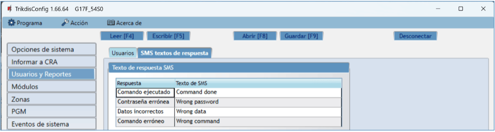

**Grupo de opciones de la “Texto de respuesta SMS”**

- El texto para las respuestas a los comandos enviados mediante mensajes SMS se puede personalizar en la columna de **Texto de SMS**.

**Pestaña de la “SMS para eventos del panel”**

Esta pestaña se mostrará si al menos el número de teléfono de un Usuario se describe en la ventana "Usuarios y Reportes".

- **Zn** – número de evento en la lista.

- **CID** – código de "Contact ID" del evento.

- **Texto SMS** – texto del mensaje SMS del evento.

- **Usuario** – elige cómo informar a los usuarios sobre cada evento: mensaje SMS y/o llamada.

### Ventana de “Módulos” 

**Pestaña de la „RS485 módulos“**

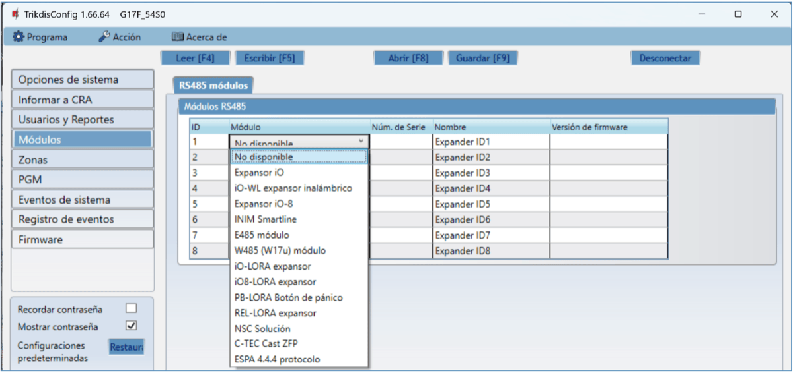

**Grupo de opciones de la “RS485 módulos”**

- **ID** – número del módulo en la lista.

- **Módulo** – elija el módulo que se está utilizando (módulos iO, iO-WL, iO-8, Inim Smartline, E485, W485, iO-LORA, iO8-LORA, PB-LORA, REL-LORA, NSC Solution, C-TEC Cast ZFP, ESPA 4.4.4) de la lista de módulos.

- **Núm. de Serie** – número de serie requerido de 6 dígitos que aparece en las etiquetas adhesivas en el marco y el embalaje del módulo.

- **Nombre** – puedes darle un nombre al módulo.

- **Versión de firmware** – la versión del firmware se mostrará cuando el G17F encuentre el módulo conectado.

**Pestaña de la „W485 configuraciones“**

**Ventana de configuración del módulo WiFi W485 (W17u)**

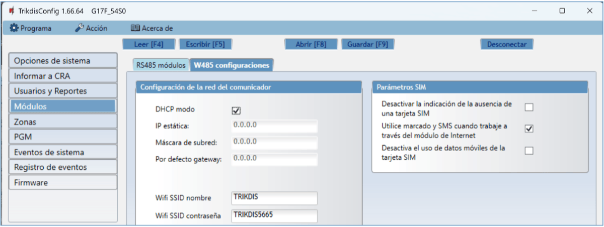

**Grupo de opciones de la „Parámetros de la red WiFi“**

- **DHCP modo** – modo del módulo WiFi para registrarse en la red (manual o automático). Marque la casilla (modo de registro automático) y el módulo WiFi escaneará automáticamente la configuración de red (máscara de subred, puerta de enlace) y se le asignará una dirección IP.

  - **IP estática** – dirección IP estática para el modo de registro manual.

  - **Máscara de Subred** – máscara de subred para el modo de registro manual.

  - **Por defecto gateway** – puerta de enlace para el modo de registro manual.

  - **Wifi SSID nombre** – nombre de la red WiFi a la que se conectará el W485 (W17u).

- **Wifi SSID contraseña** - contraseña de red WiFi.

**Grupo de opciones de la „Parámetros SIM“**

- **Desactivar la indicación de la ausencia de una tarjeta SIM** – cuando se marca la casilla, el comunicador G17F no mostrará una indicación de que no hay una tarjeta SIM insertada.

- **Utilice marcado y SMS cuando trabaje a través del módulo de Internet** – al marcar la casilla se habilitará el control del comunicador a través de llamadas y SMS. Si el campo no está marcado y hay una red Wi-Fi, entonces la llamada y los mensajes SMS no se utilizan. Si el campo no está marcado y no hay una red Wi-Fi, G17F puede administrar llamadas y mensajes SMS. G17F enviará mensajes SMS al usuario.

- **Desactiva el uso de datos móviles de la tarjeta SIM** – marcar la casilla deshabilitará el uso de datos móviles de la tarjeta SIM. Los datos sólo se enviarán a través del módulo W485. Si la red Wi-Fi está desconectada, G17F almacenará datos en la memoria. Después de restaurar la red Wi-Fi, el G17F enviará los datos guardados a través del módulo Wi-Fi W485.

**Pestaña de la „E485 configuraciones“**

**Ventana de configuración del módulo "Ethernet" E485**

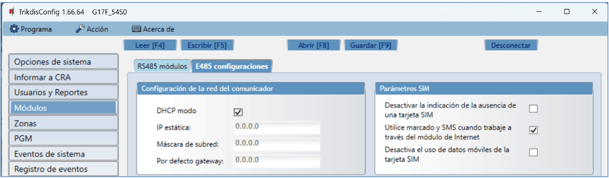

**Grupo de opciones de la „ Parámetros de la red LAN“**

- **DHCP modo** – modo para registrarse en la red LAN (manual o automática).

- **IP estática** – dirección IP estática para el modo de registro manual.

- **Máscara de subred** – máscara de subred para el modo de registro manual.

- **Por defecto gateway** – puerta de enlace para el modo de registro manual.

**Grupo de opciones de la „Parámetros SIM“**

- **Desactivar la indicación de la ausencia de una tarjeta SIM** – cuando se marca la casilla, el comunicador G17F no mostrará una indicación de que no hay una tarjeta SIM insertada.

- **Utilice marcado y SMS cuando trabaje a través del módulo de Internet** – al marcar la casilla se habilitará el control del comunicador a través de llamadas y SMS. Si el campo no está marcado y hay Internet, no se utilizan SMS ni llamadas. Si el campo no está marcado y no hay Internet, G17F puede administrar llamadas y mensajes SMS. G17F enviará mensajes SMS al usuario.

- **Desactiva el uso de datos móviles de la tarjeta SIM** – marcar la casilla desactivará el uso de datos móviles de la tarjeta SIM. Los datos sólo se enviarán a través del módulo E485. Si Internet desaparece, G17F almacenará datos en la memoria. Cuando se restablezca Internet, el G17F enviará los datos guardados a través del módulo "Ethernet" E485.  

### Ventana de “Zonas” 

**Pestaña de la “Configuraciones de zonas”**

- **Zona Núm.** – el número de la zona en la lista.

- **Nombre** - ingrese el nombre de la zona.

- **Entrada** – puedes seleccionar qué entrada IN del módulo expansor o G17F se asignará a la zona.

- **Definición** – a todas las zonas se les asigna la definición de **24 horas**. Si se viola esta zona, se envía un mensaje sobre el evento de inmediato.

- **Tipo** – elige el tipo de circuito conectado a la entrada de zona IN de una lista: NC – normalmente cerrado; NO – normalmente abierto; EOL - con una resistencia *end of line* (4,7 kΩ, 10 kΩ)*.*

- **CRA** – si la casilla está marcada, los informes de eventos de zona se enviarán a la estación central de monitoreo (CRA).

- **Prot**. – si la casilla está marcada, los informes de eventos de zona se enviarán a la nube de Protegus.

- **Retraso** – tiempo de reacción de la zona entrada IN, en milisegundos.

- **Codigo de Contacto ID** – códigos ID de contacto de evento.

- **SIA E** – código de evento en formato SIA.

- **SIA R** – restaurar código en formato SIA.

**Pestaña de la “SMS y llamadas”**

Esta pestaña se mostrará si al menos el número de teléfono de un Usuario se describe en la ventana "Usuarios y Reportes"*.*

- **Zn** – número de zona con la palabra de identificación del evento. Puede ser "*Evento*" o "*Restaurar*".

- **Texto SMS** – descripción del evento de zona que se incluirá en los informes de eventos enviados al usuario mediante mensajes SMS.

- **Usuario / SMS y Llam.** – elige de qué manera se informará a los usuarios sobre los eventos en cada zona individual, mediante mensajes SMS y/o llamadas telefónicas.

### Ventana de “PGM”

**Pestaña de la “Salidas”**

- **PGM Núm.** – especifica el número de salida de PGM en la lista.

- **PGM Salida** – asigna las salidas OUT del G17F o un dispositivo externo a la PGM.

- **Definición de Salida** – elige el modo operativo de la salida OUT.

- **Tiempo de Pulso, s** – puedes establecer la duración de activación de OUT desde 0 a 9999 segundos.

- **CRA** – si esta casilla está marcada, los informes de activación/desactivación de la salida PGM se enviarán a la estación central de monitoreo (CRA).

- **Prot.** – si la casilla está marcada, los informes de activación/desactivación de la salida PGM se enviarán a la nube de Protegus.

- **SIA E** – código de evento en formato SIA.

- **SIA R** – restaurar código en formato SIA.

**Pestaña de la “SMS y llamadas”**

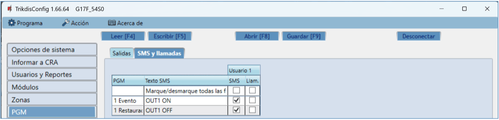

Esta pestaña se mostrará si al menos el número de teléfono de un Usuario se describe en la ventana "Usuarios y Reportes".

- **PGM** – muestra el número de salida OUT y el tipo de evento de activación/desactivación (“**Evento**” - evento de activación de salida OUT y “**Restauración**” - evento de desactivación de salida OUT).

- **Texto SMS** – el nombre del evento de activación/desactivación de la salida OUT, se utilizará en el mensaje SMS del evento.

- **Usuario / SMS y Llam.** – elige a qué usuarios informar utilizando mensajes SMS y/o llamadas telefónicas cuando la salida OUT está activada/desactivada.

### Ventana de “Eventos de sistema” 

**Pestaña de la “Eventos”**

- **ID** – número de evento en la lista.

- **Nombre de evento** – nombre del evento.

- **Habilitar** – permite el reconocimiento de eventos y la generación de informes.

- **CRA** – los informes de eventos seleccionados se enviarán al CRA.

- **Prot**. – los informes de eventos seleccionados se enviarán a la nube de Protegus2.

- **Codigo CID** – Código ID de contacto del evento.

- **SIA E** – código de evento en formato SIA.

- **SIA R** – restaurar código en formato SIA.

- **LOOP** - número de zona en el mensaje de evento.

- **SMS texto de evento** – texto SMS de evento.

- **SMS texto de restauración** - texto SMS de evento de restauración.

**Pestaña de la “SMS y llamadas”**

Esta pestaña se mostrará si al menos el número de teléfono de un Usuario se describe en la ventana "Usuarios y Reportes".

- **ID** – número y palabra de identificación (Evento, Restauración) del evento.

- **Evento de texto SMS** – texto que se usará en mensajes de SMS del evento.

- **Usuario / SMS y Llam.** – elige las formas en que se informará a los usuarios sobre cada evento: mensaje **SMS** y/o **Llamada** telefónica.

### Ventana de “Registro de eventos” 

- Botón **Leer Registro** – comando para leer el registro de eventos desde la memoria del dispositivo.

- **Borrar Registro** – comando para borrar las entradas del registro de eventos de la memoria del dispositivo.

- En la tabla, puedes encontrar el **Núm. de Evento**, **Tiempo**, código **CID** y **Definición de evento**. El registro de eventos puede mostrar hasta 1000 eventos almacenados en la memoria del G17F.

### Restablecer la configuración de fábrica 

Para restablecer el comunicador a la configuración de fábrica, presione el botón **Restaurar** en ***TrikdisConfig*.**

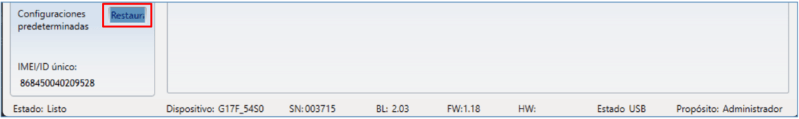

## Configuración Remota 

!!! note "Nota"
    La configuración remota solo funcionará cuando el G17F:
    
    1.  La tarjeta SIM insertada ha sido activada y el código PIN ha sido
        ingresado o deshabilitado.
    
    2.  La servicio Protegus está activada. Podrá encontrar
        información sobre como activar la nube en la sección 5.4 Ventana de
        "Usuarios y Reportes".
    
    3.  La fuente de alimentación está conectada (el LED de "**Power**" debe
        iluminarse de color verde);
    
    4.  Estar registrado en la red (el LED de "**NETWORK**" de iluminarse de
        color verde y parpadear de color amarillo).
    
    Si "**NETWORK**" está en amarillo fijo o "**DATA**" está en amarillo
    fijo, el dispositivo no puede conectarse a GSM y/o Protegus2.
1.  En su PC abra el software de configuración de TrikdisConfig.

2.  En la sección de acceso remoto ingrese el IMEI/número único de ID. Este número puede ser encontrado en el dispositivo y en la etiqueta del empaque.

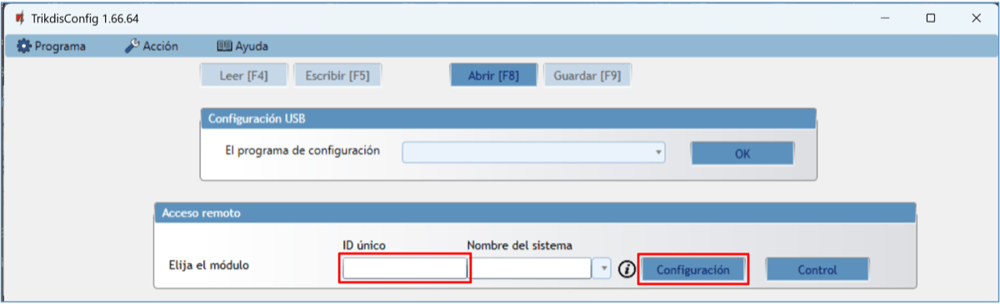

3. (Opcional) en el espacio del nombre de Sistema ingrese el nombre deseado para el comunicador.

2.  Presione **Configuración**.

3.  En la nueva ventana de clic en **Leer [F4].**

4.  A petición, ingrese el código del administrador o instalador. Para guardar la contraseña, seleccione “Recordar contraseña” en la ventana principal.

5.  Establezca las opciones deseadas y presione **Escribir [F5].**

## Desempeño de la Prueba del Comunicador 

Después de que la configuración y la instalación hayan sido completadas, lleve a cabo una prueba de sistema:

1.  Para probar una entrada del comunicador, actívela. Compruebe si los eventos fueron recibidos por el Centro de recepción de alarmas (CRA) y/o la aplicación Protegus2.

2.  Para probar las salidas del comunicador, enciéndalas de forma remota y verifique su funcionamiento. Asegúrese de que los eventos hayan sido recibidos por el Centro de recepción de alarmas (CRA) y/o la aplicación Protegus2.

3.  Realice una prueba de alarma contra incendios para ver si el CRA recibe los eventos correctamente.

## Actualización del firmware 

!!! note "Nota"
    Cuando el comunicador esté conectado a TrikdisConfig, el programa
    ofrecerá actualizar el firmware del dispositivo si es que hay alguna
    actualización disponible. Las actualizaciones requieren una conexión al
    internet. / Si hay un antivirus instalado en su computadora, puede que
    este bloquee la opción de actualización de firmware. En este caso usted
    debe reconfigurar su software de antivirus.
El firmware del comunicador puede ser actualizado o cambiado de forma manual. Después de una actualización, el comunicador mantendrá cualquier opción establecida. Cuando escriba el firmware de forma manual, este puede ser cambiado a una versión más reciente o antigua. Para actualizar:

1.  Abra ***TrikdisConfig**.*

2.  Conecte el comunicador a través de cable USB a la computadora o conéctese al comunicador de forma remota. Si existe una versión más nueva del firmware, el software ofrecerá descargar el archivo de la versión más nueva del firmware.

3.  Seleccione la parte de **Firmware** del menú.

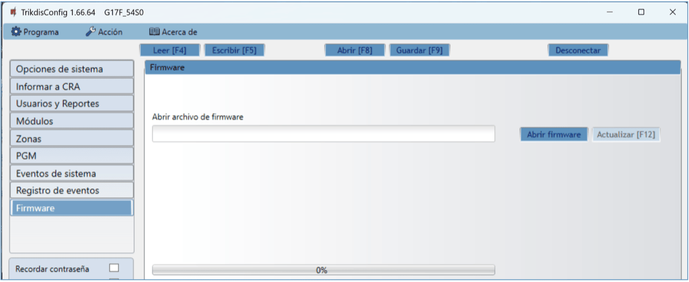

4. Presione Abrir firmware y seleccione el archivo de firmware requerido.

2.  Presione **Actualizar [F12]**.

3.  Espere a que se complete la actualización.

## Requerimientos de Seguridad 

El comunicador de GSM sólo debe ser instalado y mantenido por un personal cualificado.

Por favor, lea atentamente este manual antes de la instalación con el fin de evitar errores que pueden conducir a un mal funcionamiento o incluso daños en el equipo.

Siempre que desconecte la fuente de alimentación antes de realizar las conexiones eléctricas.

Los cambios, modificaciones o reparaciones no autorizadas por el fabricante deberán invalidar la garantía.

Cumpla con la normativa local y no deseche su sistema de alarma inutilizables o sus componentes con los residuos domésticos.
