# FIRECOM para centrales de alarma contra incendios Comunicador

  

## Descripción 

El comunicador FIRECOM cumple con los requisitos de la norma EN 54-21:2006; EN 54-4:1997/AC:1999/A1:2002/A2:2006.

El producto cumple con los requisitos de rendimiento de la norma EN54-21 Anexo A para el tipo de sistema de transmisión 1.

Certificado del comunicador FIRECOM No: 1922-CPR-2083. Sistemas de detección y alarma de incendios. Equipos de transmisión de alarmas y enrutamiento de avisos de averías. Equipos de suministro de energía.

El producto está certificado por el organismo de certificación de productos notificado: No. 1922 "Dedal", Nesebar Mladost str. 50, Bulgaria, 8230

Contactos de asistencia técnica de Trikdis: support@trikdis.lt, +37067422877.

El comunicador está diseñado para transmitir mensajes de la central de incendios a través de LAN y/o redes móviles.

Principio de funcionamiento. Cuando se activa una entrada (zona) del comunicador, el comunicador FIRECOM enviará un mensaje a la CRA (estación central de monitoreo) o a la aplicación Protegus2 a través de Internet móvil y/o red LAN. El comunicador puede enviar mensajes SMS y realizar llamadas. Un módem 4G está instalado en el comunicador.

**Características**

Envía eventos al receptor en una CRA

- Envía mensajes a través de LAN local y (o) red de Internet móvil 4G.

- Los mensajes se envían a través de los canales de comunicación seleccionados con la prioridad seleccionada.

- Los mensajes a la estación de monitoreo son recibidos por un receptor IP Trikdis o un receptor IP que opera el protocolo IP SIA DC-09.

- Asignación de la prioridad de transmisión de mensajes a la CRA: los mensajes se transmiten primero a la CRA y solo después de que los mensajes se envían al usuario del sistema.

- Puede enviar mensajes simultáneamente a 2 receptores de CRA diferentes de compañías de seguridad.

- Los mensajes de eventos se transmiten mediante códigos Contact ID o SIA.

**Mensajes a los usuarios**

- Llama a números de teléfono seleccionados (hasta 8 usuarios).
- Enviar mensajes SMS sobre eventos (hasta 8 usuarios).

- Notificaciones de eventos de sonido especiales y “push” utilizando la aplicación Protegus2.

- Monitoreo remoto de temperatura.

**Control remoto de salidas**

- A través de la aplicación Protegus2.

- Llamada al número de la tarjeta SIM instalada en el comunicador.

- A través de mensajes SMS.

**Configuración e instalación**

- Instalación rápida y fácil.

- Configuración del dispositivo mediante un cable USB Type-C o de forma remota mediante el software TrikdisConfig.

- Actualización remota de firmware.

- Dos niveles de acceso (tipos de cuentas) para la configuración de parámetros: para el instalador y para el administrador.

**Entradas y salidas**

- 3 salidas de relé (1 A, 30 V CC).

- La entrada "FLOOP" está destinada a la conexión de detectores de incendios de dos hilos.

- 10 terminales de I/O, cada uno de los cuales se puede configurar como entrada (IN) o como salida (OUT). Tipos de entrada (IN): NC, NA, EOL, EOL-T, ATZ, ATZ-T. Los circuitos ATZ y EOL pueden usar diferentes valores de resistencia.

- Usando los expansores de la serie iO, el número de entradas (IN) se puede aumentar a 32 y el número de salidas (OUT) se puede aumentar a 16.

- Bus RS485 para conectar módulos expansores de la serie iO.

- Bus RS485 2 se utiliza para conectar paneles de incendios.

### Especificaciones 

| Parámetro | Descripción |
|-----------|-------------|
| Frecuencias de módem 4G: /​ EU (Europa) /​ LA (América Latina) | LTE-FDD: B1/​B3/​B5/​B7/​B8/​B20/​B28 /​ LTE-FDD: B2/​B3/​B4/​B5/​B7/​B8/​B28/​B66 |
| Tensión de alimentación | 15-32 V DC |
| Consumo actual | Hasta 50 mA (en modo espera) /​ Hasta 200 mA (durante el envío de datos) /​ Hasta 2,5 A (con máxima conexión de dispositivos externos) |
| Fuente de energía de respaldo [BAT] | 12 V Batería de ácido - plomo, 4 Ah/​7 Ah |
| Corriente de carga de la batería | Hasta 500 mA |
| Voltaje y corriente de alimentación para dispositivos externos [AUX] | 12 V DC, hasta 1 A |
| Protocolos de Transmisión | TRK, SIA DC-09_2007, SIA DC-09_2012, SIA DC-09_IPcom, TL150 |
| Clave de cifrado | Clave de cifrado de 6 dígitos |
| Protocolos para conexión a CRA | TCP/​IP o UDP/​IP |
| Codificación de eventos | Contact ID, SIA |
| Módulo LAN | Sí, incorporado |
| Tipo de configuración de red LAN | DHCP o manual |
| Tarjeta SIM | 1, tamaño NANO |
| Direcciones de transmisión de informes | A receptores principales y de respaldo de 2 compañías de seguridad diferentes;​ Al servidor en la nube de Protegus2, a aplicación móvil Protegus2 en iOS/​Android;​ A 8 teléfonos móviles a través de mensajes SMS. Llama a 8 teléfonos móviles. |
| Canales de transmisión de informes de eventos | 4G, Ethernet (LAN), SMS, Llamadas |
| Cifrado de Informe | Si |
| Reloj interno | Si |
| Número de usuarios | 40 |
| Terminales de doble propósito [I/​O] | 10;​ Función IN o OUT seleccionada durante la programación. Si se selecciona IN, tipos disponibles: NC, NO, EOL, EOL_T, ATZ, ATZ_T. Si se selecciona OUT, la terminal se convierte en colector abierto (OC) con una corriente de hasta 100 mA |
| Número de grupos | 8 |
| Número de zonas | 10 (20 zonas si se usa ATZ), (se puede ampliar a 32 zonas con expansores) |
| Número de salidas PGM | 3 relés (1 A, 30 В DC). (Puede alcanzar a 13 si los terminales IO se configuran como salidas. Puede expandirse a 16 salidas con expansores) |
| Capacidad de memoria Buffer | 60 eventos |
| Memoria de registro de eventos | Hasta 1000 eventos. Las entradas más antiguas se eliminan automáticamente. |
| Modificación de los ajustes | Con el software de configuración TrikdisConfig de forma remota o local a través del puerto USB Type-C /​ Remotamente con mensajes SMS |
| Longitud del bus de datos de “1-Wire” | Hasta 30 m |
| Sensores de temperatura compatibles | Maxim®/​Dallas® DS18S20, DS18B20;​ Serie AM2301 |
| Máximo de sensores de temperatura conectados al bus de datos de 1-Wire | 8 (Dallas) o 1 (si se usa un sensor de la serie AM2301) |
| Bus RS485 | 2 und. |
| Longitud del bus de datos RS485 | Hasta 100 m |
| Módulos soportados | iO-8 – módulo expansor;​ /​ iO-MO – iO-WL transmisor-receptor de ondas de radio;​ /​ iO-LORA – módulo expansor;​ /​ iO8-LORA – módulo expansor;​ /​ PB-LORA – botón de alarma;​ /​ REL-LORA - módulo expansor;​ /​ Panel de control de incendios con protocolo ESPA 4.4.4;​ /​ NSC Solution - panel de control de incendios;​ /​ INIM Smartline - panel de control de incendios;​ /​ C-TEC Cast ZFP – panel de control de incendios. |
| Entorno operativo | Temperatura de -10 ° C a +50 ° C, humedad relativa - de hasta 80% a +20°C |
| Dimensiones | 235 x 205 x 92 mm |
| Peso | 1.35 kg |

### Elementos del comunicador FIRECOM 

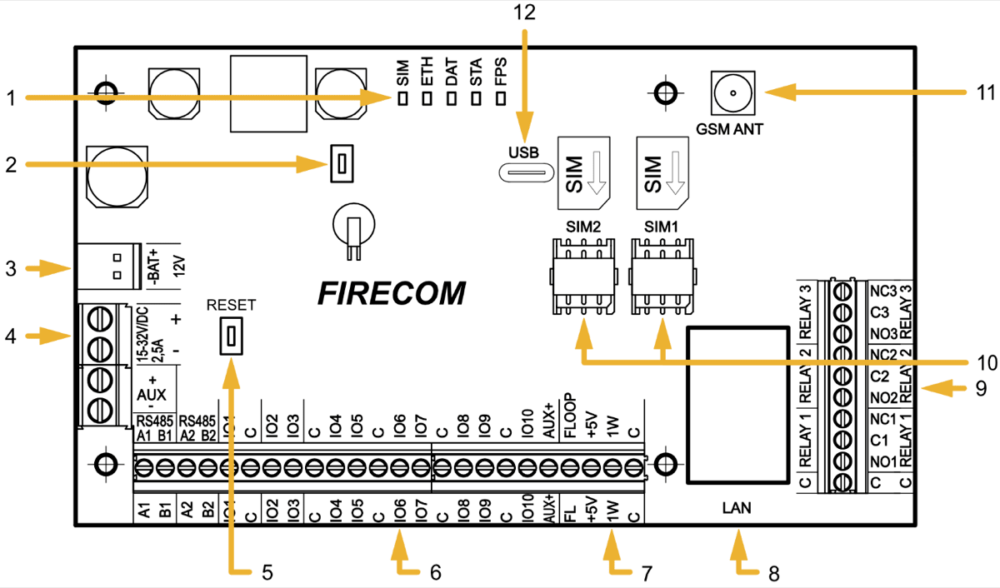

1. Indicadores luminosos
2. Botón
3. No está activo
4. Bloque de terminales de la fuente de alimentación de respaldo
5. Bloque de terminales de la fuente de alimentación principal
6. Botón “RESET”
7. Terminales para conectar dispositivos externos

### Propósito de los terminales 

| Terminal | Descripción |
|----------|-------------|
| Power terminal „+“ | Terminal de conexión de alimentación positiva (15-32 VCC) |
| Power terminal „-“ | Terminal de fuente de alimentación negativa (15-32 VCC) |
| BAT+ | Terminal positivo para conectar una batería de 12 V |
| BAT- | Terminal negativo para conectar una batería de 12 V |
| AUX+ | Terminal positivo de alimentación de 12 V para dispositivos externos |
| AUX- | Terminal común (negativo) |
| A1 RS485 | Bus RS485 para conectar expansores iO |
| A2 RS485 | Bus RS485 para conectar el panel de control de alarma contra incendios |
| IO1 – IO10 | Terminales de entrada/​salida (ajuste de fábrica - entrada) |
| C | Terminal común (negativo) |
| AUX+ | Terminal positivo de alimentación de 12 V para dispositivos externos |
| FLOOP | Terminal para conectar un detector de incendios de 2 hilos |
| +5 V | Terminal positivo de alimentación de 5 V para dispositivos 1-Wire |
| 1 WIRE | Terminal de bus de datos 1-Wire |
| C | Terminal común (negativo) |
| NO1/​C1/​NC1 | 1 relé salida PGM |
| NO2/​C2/​NC2 | 2 relé salida PGM |
| NO3/​C3/​NC3 | 3 relé salida PGM |

### LED indicador de operación 

| Indicador | Estado de la luz | Descripción |
|-----------|------------------|-------------|
| SIM | Off | Sin conexión a la red móvil |
| SIM | Verde parpadeando | La conexión a una red móvil está en curso |
| SIM | Verde sólido | La tarjeta SIM está registrada en la red móvil |
| SIM | Verde sólido con parpadeo amarillo | El comunicador está conectado a una red móvil. Nivel de señal 4G suficiente -3 niveles (tres destellos amarillos) |
| ETH | Verde parpadeando | Problema de DHCP o cable LAN desconectado |
| ETH | Verde sólido | Conectado a la red LAN |
| DAT / DATA | Off | No hay mensajes de eventos no enviados |
| DAT / DATA | Verde sólido | El mensaje se está enviando |
| DAT / DATA | Amarillo sólido (DAT) | Hay mensajes no enviados en la memoria |
| STA / TROUBLE | Verde parpadeando (STA) | No hay problemas de operación |
| STA / TROUBLE | Off (TROUBLE) | No hay problemas de operación |
| STA / TROUBLE | 1 parpadeo rojo | Tarjeta SIM no encontrada |
| STA / TROUBLE | 2 parpadeos rojos | Problema con el código PIN de la tarjeta SIM (código PIN incorrecto) |
| STA / TROUBLE | 3 parpadeos rojos | Problema con el registro a la red móvil |
| STA / TROUBLE | 4 parpadeos rojos | No es posible conectarse al receptor CRA usando el canal 1 |
| STA / TROUBLE | 5 parpadeos rojos | No es posible conectarse al receptor CRA usando el canal 2 |
| STA / TROUBLE | 6 parpadeos rojos | Sin alimentación de red |
| STA / TROUBLE | 7 parpadeos rojos | Mal funcionamiento de AUX (sobrecorriente) |
| STA / TROUBLE | 8 parpadeos rojos | Falla de la batería |
| STA / TROUBLE | 9 parpadeos rojos | Cable LAN desconectado |
| STA / TROUBLE | 10 parpadeos rojos | Problema de LAN DHCP |
| FPS / POWER | Off | La fuente de alimentación no está conectada |
| FPS / POWER | Verde sólido | No hay problemas con las fuentes de alimentación |
| FPS / POWER | 1 parpadeo verde | No hay alimentación de CA |
| FPS / POWER | 2 parpadeos verdes | Voltaje de la fuente de alimentación de reserva insuficiente |

### Componentes necesarios para la instalación 

Antes de comenzar la instalación, asegúrese de tener:

1.  Un cable USB tipo Type-C para configuración.

2.  Al menos un cable de 4 hilos para conectar el comunicador al panel de control de incendios.

3.  Un destornillador de cabeza plana de 2,5 mm.

4.  Una antena GSM externa si la cobertura de la red en el área es deficiente.

5.  Una tarjeta nano-SIM activada (las solicitudes de código PIN se pueden desactivar).

6.  El manual de la central de incendios al que se conectará el comunicador.

Ordene los componentes necesarios por separado en su distribuidor local.

## Alimentacion comunicador 

### Fuente de alimentación principal 

El comunicador debe recibir alimentación de una fuente de alimentación de CC. Para garantizar un suministro de energía ininterrumpido, se debe conectar una batería de 12 V al comunicador.

### Fuente de alimentación de respaldo 

Si ocurriesen problemas con la alimentación del sistema desde la fuente de alimentación principal, se generará un informe de evento de *„DC Fault”* y el comunicador cambiará automáticamente a la batería de respaldo de 12 V. Si el voltaje de la batería cae a 11.5 V, se generará un informe de evento de “*Batería Baja” (“Low Battery”)*. La batería se desconectará si el voltaje cae por debajo de 9.5 V. Si se restablece el voltaje de la red AC, se generará un informe de “*Restablecimiento de DC” (“DC Restore”)* y el proceso de carga de la batería comenzará automáticamente. Cuando el voltaje de la batería aumente a 12.6 V, se generará un informe de evento de “*Restauración De Batería” (“Battery Restore”)*.

### Kit de comunicador 

| Nombre | Cantidad |
|----|:--:|
| Placa de comunicador FIRECOM con antena, integrada en una carcasa metálica | 1 pza. |
| Carcasa metálica con fuente de alimentación por impulsos Mean Well | 1 pza. |
| Resistencia 10 kΩ | 20 pzas. |
| Cable para conectar batería | 1 pza. |
| Sensor de manipulación | 1 pza. |
| Bloque de terminales con fusible de 3.15 A | 1 pza. |
| Elementos de fijación (tornillos - 4 und., tacos de nailon - 4 und.) | 1 |

!!! note
    El cable USB Type-C para programar el comunicador se vende por separado.
## Instalación del comunicador 

**Dimensiones de la placa *FIRECOM***

La figura muestra las dimensiones de la placa y sus orificios de montaje. Las dimensiones están en milímetros.

### Orden de conexión de dispositivos 

1.  Si está utilizando una tarjeta SIM, inserta una tarjeta SIM activada en el soporte de la tarjeta SIM.

2.  Si está utilizando una red LAN, conecte el cable LAN.

3.  Conecte las salidas PGM del panel de incendios, detectores de incendios, dispositivos de señalización de acuerdo con los diagramas presentados.

4.  Conecte los cables de alimentación de CA a los terminales.

5.  Inserta la batería de respaldo en el marco de montaje. Conecta las terminales de la batería a las terminales BAT + / BAT– del comunicador.

!!! note
    Al elegir una batería, tenga en cuenta que debe cargarse al 80 % en 24
    horas y la capacidad restante en las siguientes 48 horas para cumplir
    con la norma EN54.
### Conexión de sensores 

La placa del comunicador tiene 10 terminales IO1-IO10 (zonas) para conectar sensores. Usando expansores (iO-8, iO-MO, iO-LORA, iO8-LORA), la cantidad de entradas se puede aumentar hasta 32 uds. Cualquier terminal IO se puede configurar como entrada y establecer atributos: tipo de entrada (NA, NC, EOL, EOL_T, ATZ, ATZ_T); sensibilidad y eventos de corto plazo en el circuito; funciones de entrada (zonas), consulte la sección 6.6 Ventana “Zonas”.

#### Diagrama para conectar sensores.

  <figure style="margin: 0;">
    
  </figure>
  <figure style="margin: 0;">
    
  </figure>
  <figure style="margin: 0;">
    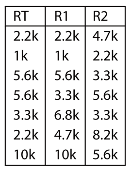
  </figure>

  <figure style="margin: 0;">
    
  </figure>
  <figure style="margin: 0;">
    
  </figure>
  <figure style="margin: 0;">
    
  </figure>

  <figure style="margin: 0;">
    
  </figure>
  <figure style="margin: 0;">
    
  </figure>

### Conexión de detectores de humo 

Diagramas de cableado para detectores de incendios de dos cables.

Conexión de detectores de incendio de dos hilos a salida "**FLOOP**". Si se utiliza este esquema de conexión, es necesario especificar la entrada "**2-Wire loop (FLOOP)**" en la ventana "Zonas" para la entrada (IOx). La corriente de activación del detector de incendios debe ser superior a 10 mA. Se pueden conectar hasta 8 detectores de incendios a la salida “**FLOOP**“.

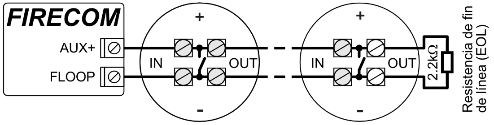

Diagrama de cableado para detectores de incendios de dos hilos con módulo de relé SM1. Para conectar el circuito del detector de humo a la entrada seleccionada, es necesario activar la entrada (IOx) y configurar el tipo de circuito (NO, NC, EOL, EOL_T, ATZ, ATZ_T) (ver párrafo 6.6 “Ventana "Zonas"”). La salida (IO10) debe configurarse en el modo de funcionamiento "**Sensor de fuego reiniciado**" (consulte la sección 6.7 "Ventana "PGM"").

\* El relé (K1) se utiliza para detectar un cable roto y retirar el detector de incendios. Si no se utiliza un relé (K1), se debe cortocircuitar el contacto K1.

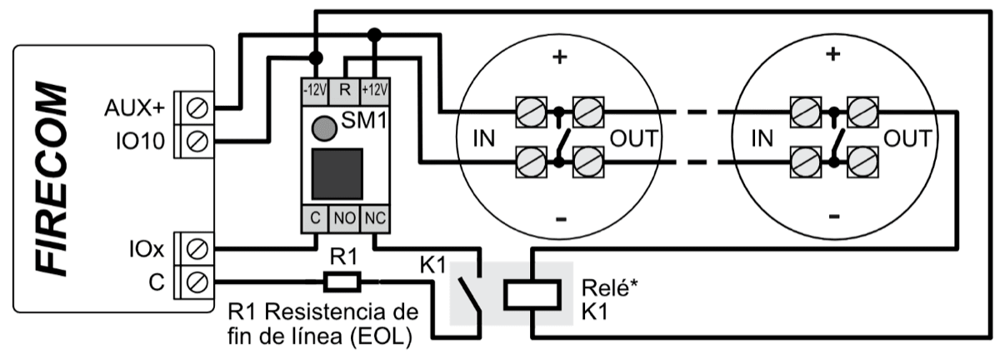

o

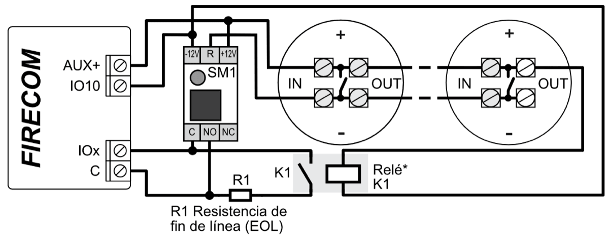

Conexión de detectores de incendios de cuatro hilos.

Para conectar un circuito de detector de humo a la entrada seleccionada, debe activar la entrada (IOx) y configurar el tipo de circuito (NA, NC, EOL, EOL_T, ATZ, ATZ_T) (consulte el párrafo 6.6 “Ventana “Zonas””). La salida (IO10) debe configurarse en el modo de funcionamiento "Sensor de fuego reiniciado" (consulte la sección 6.7 "Ventana "Salidas “PGM"").

\* El relé (K1) se utiliza para detectar un cable roto y retirar el detector de incendios. Si no se utiliza un relé (K1), se debe cortocircuitar el contacto K1.

### Diagrama para conectar el comunicador a un panel de control de incendios 

  <figure style="margin: 0;">
    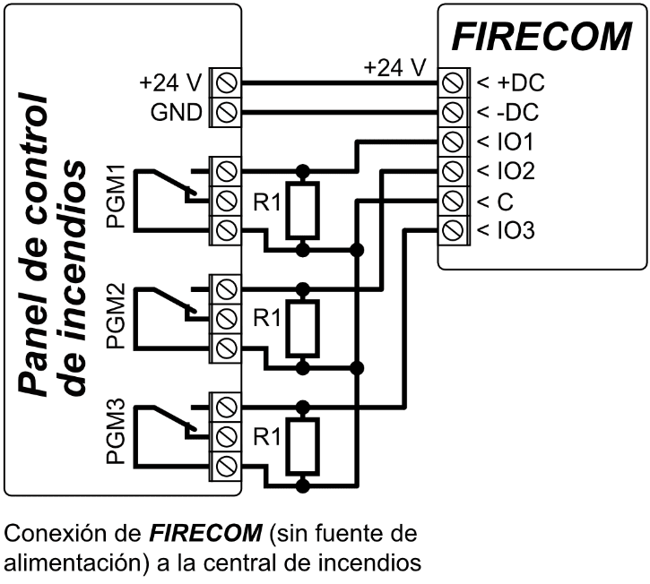
  </figure>
  <figure style="margin: 0;">
    
  </figure>

Si desea monitorear el estado del panel de alarma contra incendios, conecte sus salidas correspondientes a las entradas FIRECOM. Las salidas (PGM1, PGM2, PGM3) del panel de incendios deben configurarse como salidas de estado del panel (Alarma, Problema, etc.).

### Diagrama para conectar a la central de incendios con el protocolo ESPA4.4.4 

  <figure style="margin: 0;">
    
  </figure>
  <figure style="margin: 0;">
    
  </figure>

Configuración del comunicador FIRECOM con TrikdisConfig al conectar el panel de control de alarma contra incendios con el protocolo **ESPA4.4.4**.

1.  Seleccione **ESPA4.4.4**.

2.  Seleccione el tipo de conexión.

3.  El comunicador FIRECOM y el panel de control de incendios deben tener la misma configuración de transmisión de datos.

4. Ingrese números de teléfono y correo electrónico de los usuarios que deben recibir mensajes de FIRECOM.

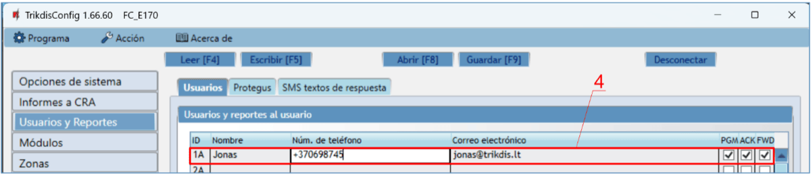

5. Si desea que el usuario reciba mensajes (o llamadas) sobre eventos, marque la casilla **SMS** (o **Llamada**).

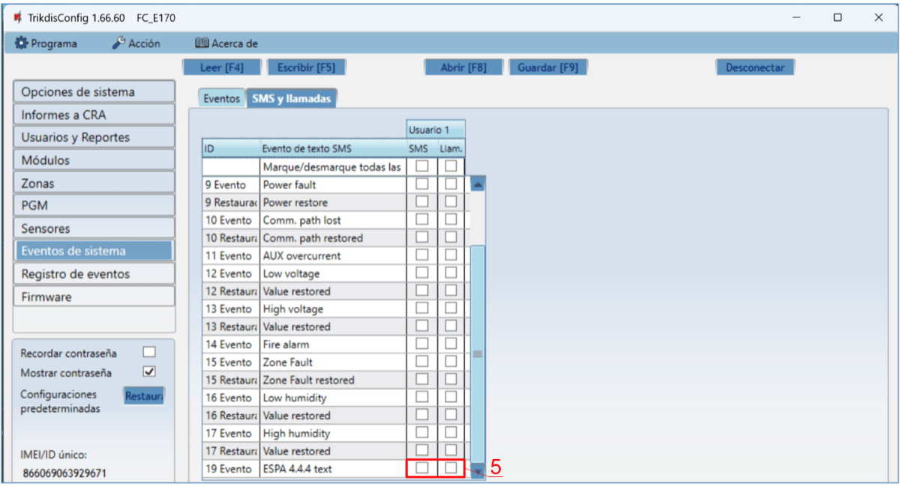

6. Configure el canal de comunicación si se deben enviar mensajes al receptor CRA. Los mensajes de eventos se transmiten utilizando el protocolo SIA DC-09.

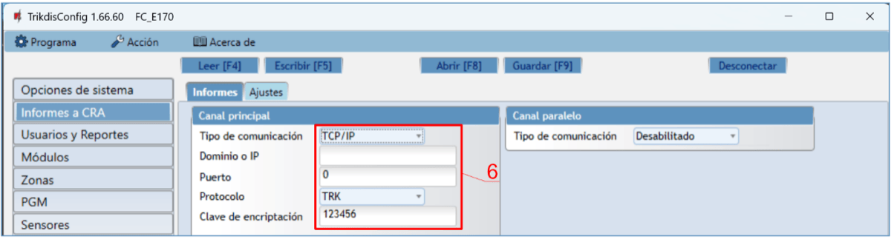

Pruebe el sistema. Active la alarma contra incendios y verifique que los mensajes FIRECOM se envíen a la CRA (estación central de monitoreo) y a Protegus2.

### Diagrama para conectar a la central de incendios NSC Solution 

  <figure style="margin: 0;">
    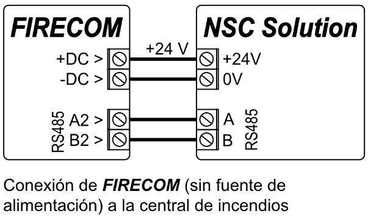
  </figure>
  <figure style="margin: 0;">
    
  </figure>

Configuración del comunicador FIRECOM con TrikdisConfig al conectar el panel de control de alarma contra incendios **NSC Solution**.

1.  Seleccione el panel de control de alarma contra incendios **NSC Solution**.

2.  La “**NSC slavе address**” no debe coincidir con la dirección de los módulos del panel de control de incendios conectados.

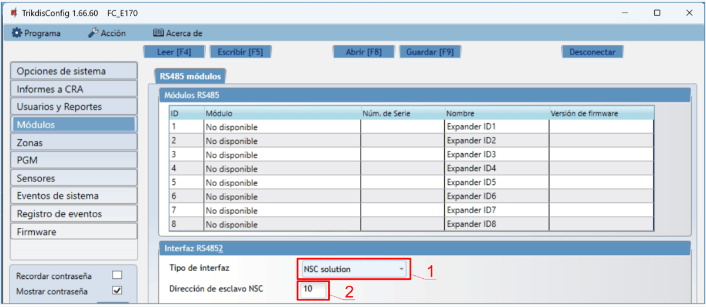

3. Introduzca los números de teléfono y el correo electrónico de los usuarios que deben recibir mensajes de FIRECOM.

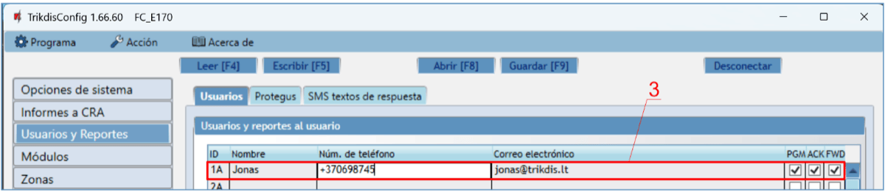

4. Los usuarios recibirán mensajes SMS y llamadas telefónicas sobre los eventos que estén marcados. Puede agregar códigos de eventos CID adicionales en la columna **CID**. Debe ingresar mensajes de **Texto SMS** junto a los nuevos códigos. Si desea que el usuario reciba mensajes (o llamadas) sobre eventos, marque la casilla **SMS** (o **Llamada**).

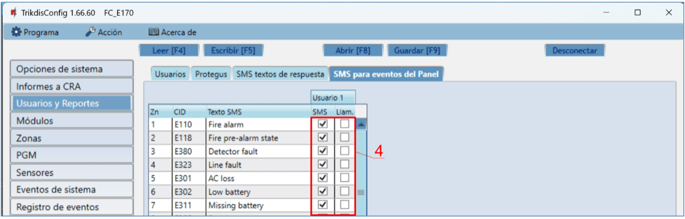

5. Configure el canal de comunicación si los mensajes deben enviarse al receptor CRA.

Después de configurar el comunicador FIRECOM, encienda la alimentación del panel de control de incendios. Espere a que se cargue el software del panel de control de incendios. Es necesario escanear los módulos conectados al bus RS485 en el panel de control de incendios. En el panel de control de incendios, presione: **PROG.>INSTALLER>(Ingrese el código de instalador) 00000 OK>(Seleccione) SETTINGS>ENTER>(Seleccione) SCAN RS485>ENTER**. Espere a que se complete el escaneo. Regrese a la pantalla principal presionando “**CANCEL**” dos veces.

Pruebe el sistema. Active la alarma contra incendios y verifique que los mensajes FIRECOM se envíen a la CRA (estación central de monitoreo) y a Protegus2.

###  Diagrama para conectar a la central de incendios INIM Smartline 

  <figure style="margin: 0;">
    
  </figure>
  <figure style="margin: 0;">
    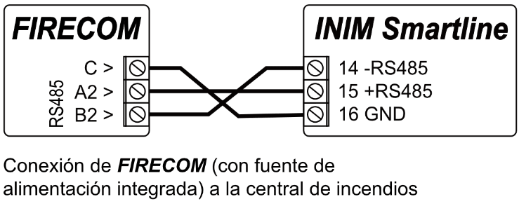
  </figure>

El modo "**Slave**" debe configurarse para el panel **INIM Smartline** cuando se conecta al comunicador FIRECOM a través del bus RS485.

!!! note
    No puede conectar el FIRECOM usando el bus RS485 si los
    repetidores están conectados al panel **INIM Smartline**. / Los módulos
    de expansión iO no son compatibles cuando el FIRECOM está
    conectado al panel **INIM Smartline** a través del bus RS485.
Configuración del comunicador FIRECOM con TrikdisConfig al conectar el panel de control de alarma contra incendios **INIM Smartline**.

1.  Seleccione el panel de alarma contra incendios **INIM Smartline**.

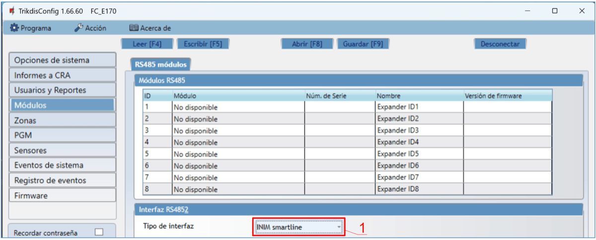

2. Introduzca los números de teléfono y el correo electrónico de los usuarios que deben recibir mensajes de FIRECOM.

3. Los usuarios recibirán mensajes SMS y llamadas telefónicas sobre los eventos que estén marcados. Puede agregar códigos de eventos CID adicionales en la columna **CID**. Debe ingresar mensajes de **Texto SMS** junto a los nuevos códigos. Si desea que el usuario reciba mensajes (o llamadas) sobre eventos, marque la casilla **SMS** (o **Llamada**).

4. Configure el canal de comunicación si los mensajes deben enviarse al receptor CRA.

Pruebe el sistema. Active la alarma contra incendios y verifique que los mensajes FIRECOM se envíen a la CRA (estación central de monitoreo) y a Protegus2.

### Diagrama para conectar a la central de incendios C-TEC Cast ZFP 

  <figure style="margin: 0;">
    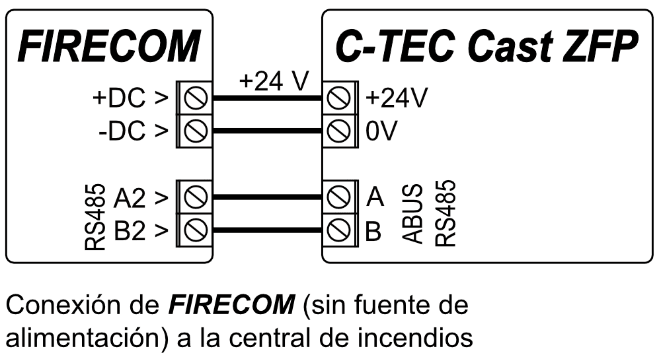
  </figure>
  <figure style="margin: 0;">
    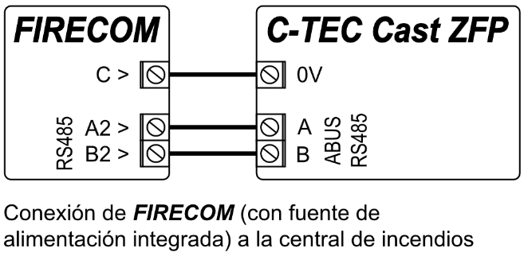
  </figure>

Configuración del comunicador **FIRECOM** con TrikdisConfig al conectar el panel de alarma contra incendios **C-TEC Cast ZFP.**

1.  Seleccione el panel de control de alarma contra incendios **C-TEC Cast ZFP**.

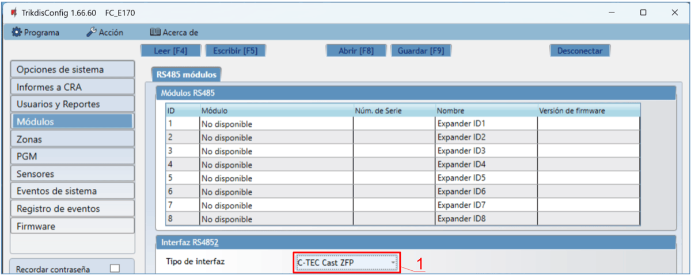

2. Introduzca los números de teléfono y el correo electrónico de los usuarios que deben recibir mensajes de FIRECOM.

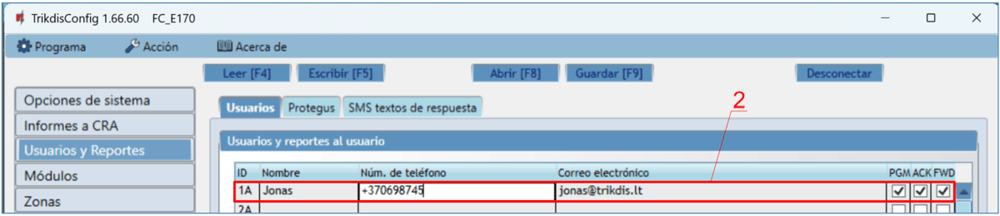

3. Los usuarios recibirán mensajes SMS y llamadas telefónicas sobre los eventos que estén marcados. Puede agregar códigos de eventos CID adicionales en la columna **CID**. Debe ingresar mensajes de “**Texto SMS**” junto a los nuevos códigos. Si desea que el usuario reciba mensajes (o llamadas) sobre eventos, marque la casilla **SMS** (o **Llamada**).

4. Configure el canal de comunicación si los mensajes deben enviarse al receptor CRA.

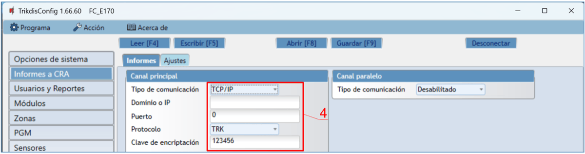

Instale el programa **ZFPtools** en su computadora. Inicie el programa **ZFPtools**. Encienda la alimentación de la central de incendios. Espere mientras se carga el software de la central de incendios. Conecte el cable USB2.0 A-B entre la central de incendios y el ordenador.

5. Abra la pestaña „**Node View**“.

6. Lea la configuración del panel de incendios en la computadora.

7. Ingrese el código (el código de fábrica es 4444).

2.  Haga clic en „ОК“.

3. Seleccione „BMS Interface“.

2.  Haga clic en el icono gratuito.

11. Haga clic en „**Edit Devices**“.

12. En la pestaña " **Device** ", ingrese el nombre del sistema.

13. En la pestaña "**Properties**", ingrese el nombre del sistema.

14. Especifique el bus “**ABUS RS485**” al que está conectado el comunicador FIRECOM.

15. Personalizar los mensajes de eventos.

16. Escriba la configuración en la central de incendios.

17. Ingrese el código (el código de fábrica es 4444).

18. Haga clic en „ОК“.

La central de incendios está programada. Desconecte el cable USB2.0 A-B de la central de incendios.

Pruebe el sistema. Active la alarma contra incendios y verifique que los mensajes FIRECOM se envíen a la CRA (estación central de monitoreo) y a Protegus2.

### Diagrama para conectar un sensor de temperatura 

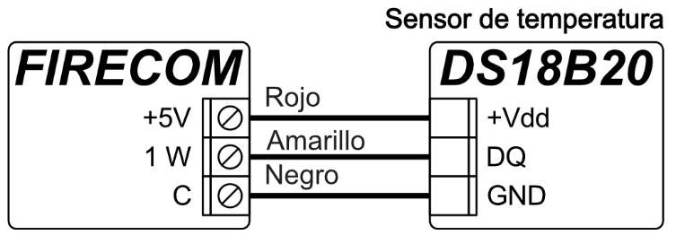 / 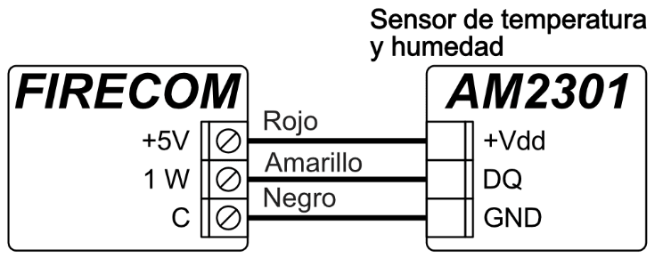

### Diagramas para conectar un relé y un indicador LED 

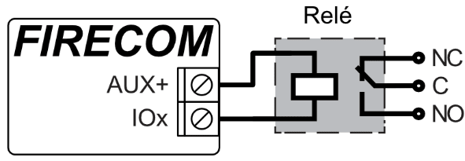 / 

### Diagrama para conectar las entradas del panel de incendio al comunicador 

Según la norma EN54, el panel de incendio desde el comunicador debe recibir información sobre la falla de comunicación con la Central de Monitoreo, así como sobre el envío exitoso de mensajes a la CRA. Conecte las salidas PGM (por ejemplo: “Relay1” y “Relay2”) del comunicador a las entradas especiales del panel de incendio. La salida PGM del “Relay1” debe establecerse en "Falla CMS". La salida PGM del “Relay2” debe establecerse en "ACK recibido". La salida del “Relay1” se activa en caso de violación del canal de comunicación con la CRA. La salida del “Relay2” se activa durante 5 seg. al enviar con éxito un mensaje a la CRA.

### Diagramas para conectar los módulos expansores de la serie iO 

Para aumentar el número de zonas (IN) y salidas (OUT) al comunicador, conecte un expansor de E/S de la serie Trikdis iO cableado o inalámbrico. La configuración de FIRECOM con módulos de extensión se describe en la sección 6.5 "Ventana "Módulos"".

  <figure style="margin: 0;">
    
  </figure>
  <figure style="margin: 0;">
    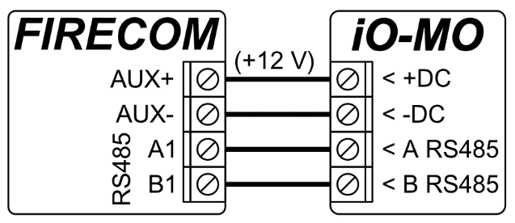
  </figure>

Diagrama de conexión para los módulos expansores LORA.

### Iniciando el comunicador 

Encienda el comunicador. Los LED del comunicador deberían funcionar de la siguiente manera:

- El indicador "**STA**" debe parpadear en verde, lo que indica que hay suficiente voltaje de suministro;

- El indicador "**SIM**" debe brillar en verde y parpadear en amarillo periódicamente al menos 3 veces; y/o el indicador "**ETH**" es verde cuando está conectado a una red LAN.

!!! note
    Nivel de señal móvil suficiente: 3 (tres destellos amarillos del
    indicador "**SIM**"). / Si se cuentan menos destellos amarillos del
    indicador "**SIM**", entonces la intensidad de la señal móvil es
    insuficiente. Le recomendamos que seleccione una ubicación diferente
    para instalar el comunicador, cambie la ubicación de la antena o utilice
    una antena más sensible. / La indicación luminosa del comunicador se
    describe en la sección 1.4 " LED indicador de operación ". / Si las
    luces del comunicador no están encendidas, verifique la fuente de
    alimentación y las conexiones de cableado.
## Configuración rápida con el software TrikdisConfig 

1.  Descargue el software de configuración de TrikdisConfig en [www.trikdis.com](http://www.trikdis.com) (En el campo de búsqueda TrikdisConfig) e instálelo.

2.  Utilizando el cable USB Type-C FIRECOM conecte al ordenador.

3.  Ejecutar TrikdisConfig. El software reconocerá automáticamente que el comunicador está conectado y se abrirá una ventana para la configuración.

4.  Haga clic en **Leer [F4]** para leer la configuración del comunicador. Si se le solicita, introduzca el código de administrador o instalador de 6 dígitos en la ventana emergente.

A continuación, describiremos las configuraciones que deben cambiarse para que el comunicador comience a enviar mensajes a la aplicación Protegus2 o al CRA.

### Ajustes para la conexión con la aplicación Protegus2 

**En la ventana " Opciones de sistema ":**

1.  Introduzca el código “**PIN de la tarjeta SIM”**.

2.  Cambiar el nombre “**APN”**. “**APN”** se puede encontrar en la página web del operador de la tarjeta SIM (“**Internet**” es universal y funciona en muchas redes de los operadores).

**En la ventana " Usuarios y Reportes":**

3. Seleccione la casilla **“Activar conexión”** a la nube de PROTEGUS.

2.  Cambie el Código de acceso de la nube para iniciar sesión con Protegus2 si usted desea que los usuarios requieran ingresarlo cuando se agrega el sistema a la app de Protegus2 (contraseña por defecto – 123456).

**En la ventana “Informes a CRA”:**

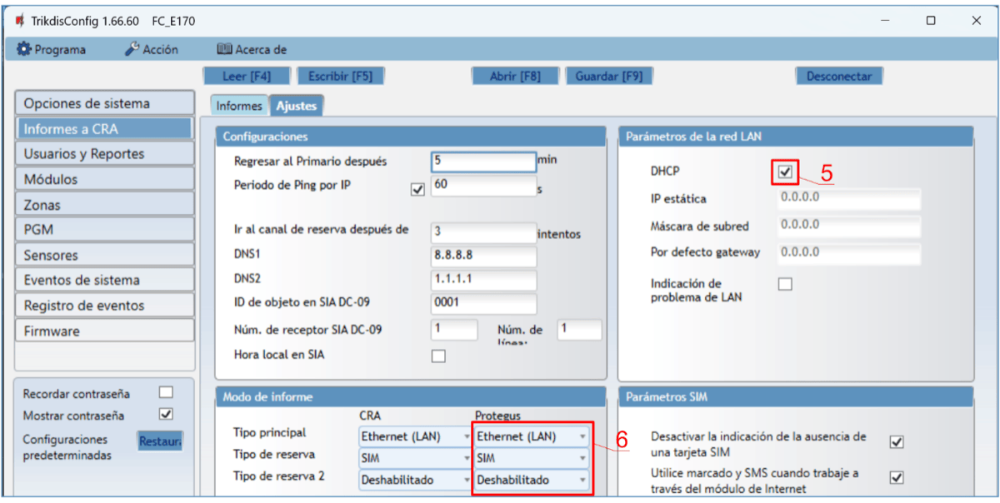

3. Si se conecta un cable LAN al comunicador, marque la casilla “**DHCP**” (modo de registro automático) para que el comunicador FIRECOM lea automáticamente la configuración de red (máscara de subred, puerta de enlace) y se le asigne una dirección IP.

2.  Se establece el orden preferido de envío de mensajes a través de los canales en Protegus2. Los tipos de canales de comunicación se establecen en orden. Si no es posible establecer una conexión a través del canal de comunicación principal, se realiza la transición al canal de comunicación de respaldo, etc. Si el tipo de conexión de respaldo logró transmitir el mensaje al Protegus2, se intentará el tipo de conexión "**Regresar a principal**" después del intervalo de tiempo especificado.

**En la ventana “Zonas”:**

3. Marque las casillas si desea que los usuarios reciban notificaciones de Protegus2 sobre los cambios en los estados de las zonas.

**En la ventana “PGM”:**

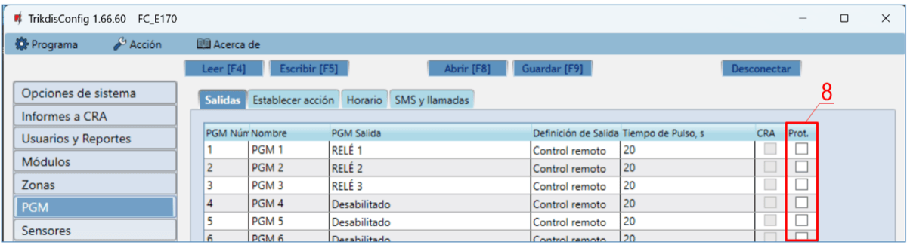

4. Marque las casillas si desea que los usuarios reciban notificaciones a Protegus2 sobre los cambios en los estados de salida de PGM.

**En la ventana "Eventos de sistema":**

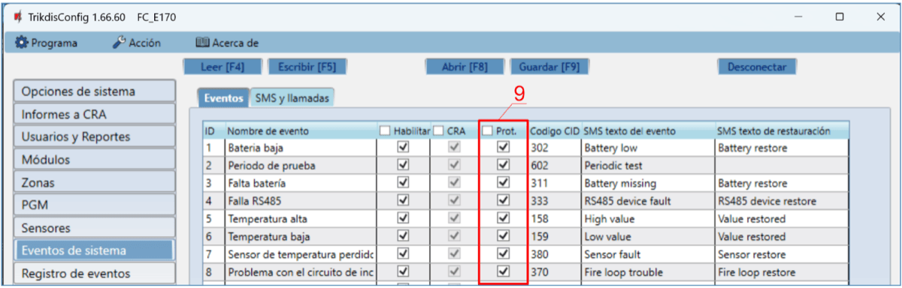

5. Marque las casillas si desea que los usuarios reciban notificaciones a Protegus2 sobre cambios en los estados de eventos internos del comunicador.

Después de terminar la configuración, haga clic en el botón **Escribir [F5]** y desconecte el cable USB.

!!! note
    Para obtener más información acerca de otros ajustes en FIRECOM
    TrikdisConfig véase el capítulo 6 "Configuración de parámetros con
    el software TrikdisConfig".
### Ajustes para la conexión con la Central Receptora de Alarmas 

**En la ventana de “Opciones de systema”:**

1.  Introduzca **Objeto ID** proporcionado por la Central Receptora de Alarmas (4 caracteres, 0-9, A-F. **No utilice números de objeto FFFE, FFFF**.).

2.  Introduzca el código “**PIN de la tarjeta SIM”**.

3.  Cambiar el nombre “**APN”**. “**APN”** se puede encontrar en la página web del operador de la tarjeta SIM (“**Internet**” es universal y funciona en muchas redes de los operadores).

**En la ventana "Informes a CRA":**

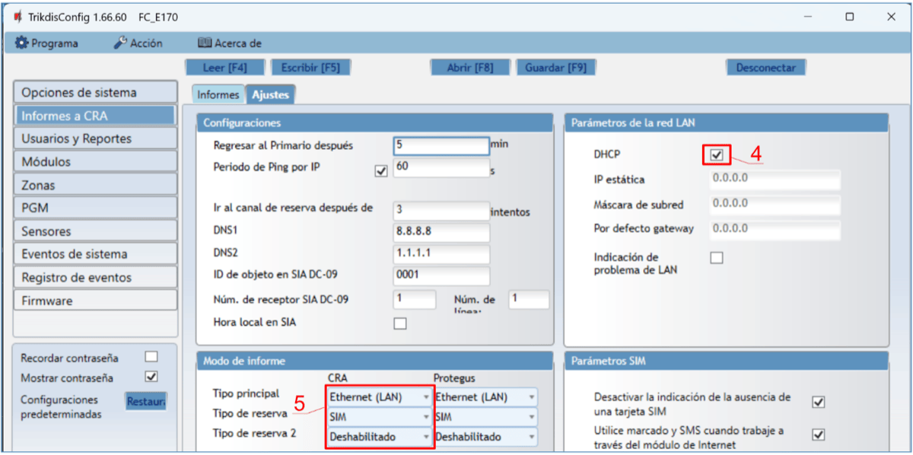

4. Si se conecta un cable LAN al comunicador, marque la casilla (modo de registro automático) para que el comunicador FIRECOM lea automáticamente la configuración de red (máscara de subred, puerta de enlace) y se le asigne una dirección IP.

2.  Se establece el orden preferido de envío de mensajes a través de los canales en CRA. Los tipos de canales de comunicación se establecen en orden. Si no es posible establecer una conexión a través del canal de comunicación principal, se realiza la transición al canal de comunicación de respaldo, etc. Si el tipo de conexión de respaldo logró transmitir el mensaje al CRA, se intentará el tipo de conexión "**Regresar a principal**" después del intervalo de tiempo especificado.

**En la ventana "Informes a CRA":**

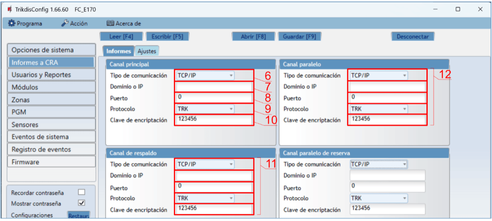

3. **Tipo de comunicación** – seleccionar el método de conexión **IP**.

2.  **Dominio o IP** – **-**introduzca la dirección IP o el dominio del receptor.

3.  **Puerto** – introduzca el número de puerto de red del receptor.

4.  **Protocolo** – seleccione el tipo de protocolo para sus mensajes de eventos: **TRK** (para los receptores de TRIKDIS), **DC-09_2007** o **DC-09_2012** (a receptores universales), **TL150** (para los receptores de SUR-GARD).

5.  **Clave de encriptación** – introduzca la clave de cifrado que se establece en el receptor.

!!! note
    Si seleccionó el protocolo **DC-09**, además, en la pestaña
    "**Configuraciones"** de la ventana de **"Informes a CRA"** ingrese los
    números de objeto, línea y receptor.
11. (Recomendado) Configure los parámetros de **Canal de** **Respaldo** del **Canal Principal**.

12. Configure los parámetros de **Canal paralelo** si los mensajes se enviarán al segundo receptor CRA.

Después de terminar la configuración, haga clic en **Escribir [F5**] y desconecte el cable USB.

!!! note
    Para obtener más información acerca de otros ajustes en FIRECOM
    TrikdisConfig véase el capítulo 6 "Configuración de parámetros con
    el software TrikdisConfig ".
## Control remoto 

### Conexión del comunicador a la app Protegus2 

Con Protegus2, los usuarios pueden ver el estado del sistema y recibir notificaciones sobre los eventos del sistema.

1.  Descargue y abra la aplicación Protegus2 o utilice la versión de navegador de internet: [www.protegus.app](https://www.protegus.app):

    

      
      
      
    

2.  Inicie sesión con su nombre de usuario y contraseña o regístrese para crear una nueva cuenta.

!!! note
    Al agregar el sistema a Protegus2, el comunicador FIRECOM
    debe:
    
    1.  Se instala una tarjeta SIM activada y se ingresa o deshabilita un
        código PIN;
    
    2.  Tenga habilitado el servicio Protegus. Consulte la
        ventana 6.4 "Usuarios y Reportes";
    
    3.  Encienda la alimentación (el LED "**STA**" debe parpadear en
        verde);
    
    4.  Estar conectado a una red (el LED de "**SIM**" debe ser verde fijo
        y parpadear en amarillo; y/o el indicador "**LAN**" se enciende en
        verde cuando está conectado a la red LAN).
3. Haga clic en Agregar nuevo sistema e ingrese el número de "IMEI/Unique ID" del *FIRECOM*. Se puede encontrar en el dispositivo y en la etiqueta del empaque. Después de ingresar la ID única, haga clic en el botón “Siguiente”.

### Configuración y control a través de mensajes SMS 

1.  **Cambiar la contraseña de administrador**

Para garantizar la seguridad, cambie la contraseña de SMS de administrador predeterminada. Enviar un mensaje SMS del siguiente formato:

#### PSW 123456 xxxxxx

| **123456** | Contraseña de administrador predeterminada      |
|------------|-------------------------------------------------|
| **xxxxxx** | Nueva contraseña de administrador de 6 símbolos |

1.  **Permitir a otros usuarios controlar**

Solo los números de teléfono desde la lista de los usuarios pueden controlar el sistema mediante mensajes SMS o llamadas telefónicas. Desde un teléfono de administrador, envíe mensajes SMS con los números de teléfono y nombres de otras personas para que puedan controlar el sistema:

#### SETN xxxxxx PHONEx=+PHONENR#NAME#EMAIL

| **xxxxxx** | contraseña de administrador de 6 símbolos |
|----|----|
| **x** | Número de usuario en la lista. (Si escribe 1 como número de usuario, transferirá sus derechos de administrador al otro usuario) |
| **PHONENR** | Número de teléfono del usuario |
| **NAME** | Nombre del usuario |
| **EMAIL** | Correo electrónico del usuario |

#### Lista de comandos SMS

| Comando | Dato | Descripción |
|---------|------|-------------|
| INFO |  | Solicitar información sobre el comunicador. La respuesta incluirá información: nombre del objeto, tipo de comunicador, número IMEI, nivel de señal GSM, versión de firmware, número de serie. Por ejemplo: INFO 123456 |
| RESET |  | Reinicie el dispositivo. Por ejemplo: RESET 123456 |
| OUTPUTx | ON | Prendiendo la salida, "x" identifica el número de salida. |
| OUTPUTx | OFF | Por ejemplo: OUTPUT1 123456 ON |
| OUTPUTx | PULSE=ttt | Apagando la salida, "x" identifica el número de salida. |
| OUTPUTx |  | Por ejemplo: OUTPUT1 123456 OFF |
| OUTPUTx |  | Encienda una salida durante unos segundos. “x” es el número de salida de OUT y “ttt” es un número de tres dígitos que especifica el tiempo de pulso en segundos. Por ejemplo: OUTPUT1 123456 PULSE=002 |
| PSW | New password | Cambia la contraseña. Por ejemplo: PSW 123456 654123 |
| TIME | YYYY/MM/DD,12:00:00 | Establecer fecha y hora. / Por ejemplo: TIME 123456 2023/05/09,12:23:00 |
| TXTA | Nombre del objeto | Especificar un nombre de objeto. Por ejemplo: TXTA 123456 House |
| RDR | PhoneNR#SMStext | Reenviar mensajes SMS al número especificado. El número de teléfono debe comenzar con un signo "+" y el código internacional del país. |
| RDR | PhoneNR#SMStext | Por ejemplo: RDR 123456 +37061234567#forwarded text |
| ASKI | Solicitar mensaje SMS sobre estados de entradas IN. |
| ASKI | Por ejemplo: ASKI 123456 |
| ASKO | Solicitar mensaje SMS sobre estados de salidas OUT. |
| ASKO | Por ejemplo: ASKO 123456 |
| ASKT |  | Enviar mensaje SMS con valores de todos los sensores de temperatura. / Ejemplo: ASKT 123456 |
| FRS |  | Restablece la salida del sensor de incendio, si la salida OUT tiene asignada la función "Sensor de fuego reiniciado". Ejemplo: FRS 123456 |
| SETN | PhoneX=PhoneNR#Name#email | Agregue un número de teléfono, un nombre de usuario y asígnelo al usuario "x". “x” es la línea del número de teléfono en la lista. El número de teléfono debe comenzar con un símbolo "+" y el código internacional del país. El número de teléfono y el nombre de usuario deben estar separados por un símbolo „#”. Por ejemplo: / SETN 123456 PHONE5=+37061234567#JOHN#john@trikdis.com |
| SETN | PhoneX=DEL | Eliminar el número de teléfono y el nombre del usuario del sistema. / Por ejemplo: SETN 123456 PHONE5=DEL |
| UUSD | *Uusd code# | Enviar un código USSD al operador. Por ejemplo: UUSD 123456 *245# |
| CONNECT | Protegus=ON | Conéctese a la nube de Protegus. |
| CONNECT | Protegus=OFF | Por ejemplo: CONNECT 123456 PROTEGUS=ON |
| CONNECT | Code=123456 | Desconéctese de la nube de Protegus. |
| CONNECT | IP=0.0.0.0:8000 | Por ejemplo: CONNECT 123456 PROTEGUS=OFF |
| CONNECT | IP=0 | Código de servicio en la nube de Protegus. / Por ejemplo: CONNECT 123456 CODE=123456 |
| CONNECT | ENC=123456 | Especifique la IP TCP y el puerto del canal de conexión del servidor principal. Por ejemplo: CONNECT 123456 IP=0.0.0.0:8000 |
| CONNECT | APN=Internet | Para apagar el canal principal. Por ejemplo: CONNECT 123456 IP=0 |
| CONNECT | USER=user | Llave de encriptación TRK. Por ejemplo: CONNECT 123456 ENC=123456 |
| CONNECT | PSW=password | Nombre APN. Por ejemplo: CONNECT 123456 APN=INTERNET |
| CONNECT |  | Usuario de APN. Por ejemplo: CONNECT 123456 USER=User |
| CONNECT |  | Contraseña APN. Por ejemplo: CONNECT 123456 PSW=Password |

### Controle las salidas PGM mediante llamadas telefónicas 

Realice estas acciones si desea controlar una salida PGM de forma remota:

- El usuario debe tener permiso para controlar las salidas OUT y la salida OUT debe tener asignado el tipo “Control remoto” (usando TrikdisConfig).

- Llamar al número de la tarjeta SIM del FIRECOM. El *FIRECOM* contestará la llamada y podrá marcar comandos usando el teclado del teléfono (ver la tabla).

#### Lista de comandos del teclado del teléfono móvil

| Botones del teclado | Función | Descripción |
|---------------------|---------|-------------|
| [número de salida]*[número de estado]# | Control de SALIDA seleccionado | Controla la salida PGM especificada. Estado : [0] – salida apagada; [1] – salida activada; [2] – apagado por tiempo de pulso; [3] – encienda por tiempo de pulso; (el tiempo de pulso se especifica en el software TrikdisConfig, tabla “PGM”) [*] – este símbolo muestra el final del comando. Por ejemplo (encienda la salida 1): 1*1# Por ejemplo (apaga la salida 1): 1*0# Por ejemplo (encienda la salida 2 para el tiempo de pulso especificado en la tabla TrikdisConfig "PGM"): 2*3# |
| # | Vuelva a intentar ingresar el comando | Si cometió un error al ingresar el comando, presione “#” en el teclado del teléfono e ingrese el comando nuevamente. |

## Configuración de parámetros con el software *TrikdisConfig* 

### Barra de Estado 

Después de conectar FIRECOM y haciendo clic en **Leer [F4]**, TrikdisConfig proporcionará información sobre el dispositivo conectado en la barra de estado.

| Nombre | Descripción |
|----|----|
| IMEI/​Identificación única | Número IMEI del dispositivo |
| Estado | Estado operativo |
| Dispositivo | Tipo de dispositivo (debe mostrar FC_xxxx) |
| SN | Número de serie del dispositivo |
| BL | Versión del Bootloader |
| FW | Versión de firmware del dispositivo |
| HW | Versión de hardware del dispositivo |
| Estado | Tipo de conexión con el programa (USB o remoto) |
| Propósito | Muestra el nivel de acceso (se muestra después de ingresar un código de acceso) |

Cuando se hace clic en el botón **Leer [F4]**, el programa leerá y mostrará la configuración almacenada en el FIRECOM. Con TrikdisConfig, puedes modificar la configuración deseada de acuerdo con las descripciones de las ventanas del programa que se muestran a continuación.

### Ventana "Opciones de sistema" 

**Pestaña “Sistema General”**

**Grupo de configuraciones "General"**

- **Objeto ID** – si los informes se enviarán al CRA, ingresa el **Objeto ID** (número hexadecimal de 4 símbolos, 0-9, A-F) proporcionado por el CRA. (**No utilice números de objeto FFFE, FFFF.**).

- **Nombre del objeto** – el nombre dado al objeto que se utilizará en los mensajes SMS enviados al usuario.

- **Periodo de test** - cuando la casilla está marcada, los mensajes de "Test" se enviarán cada período establecido.

- **Comenzar test en** – marca la casilla y especifica la hora en que se deben enviar los informes de prueba.

- **Borrar eventos después del reinicio** – si la casilla está marcada, todos los informes de eventos no enviados en la memoria intermedia se eliminarán si se reinicia el comunicador.

- **Idioma de texto** – se utilizarán símbolos específicos del idioma seleccionado en los mensajes SMS.

- Es posible **Suspender informe de eventos cuando**... suceden **mismos eventos por**....

- **Restaurar eventos después de reporte ...** – establece el tiempo después del cual se cancelará la suspensión de informes de eventos. El tiempo puede ser de 0 a 999 minutos.

- **Llamada** – cuando se produzca un evento, el FIRECOM llamará al usuario(s) tantas veces como se configure. Si la llamada es rechazada o respondida, el FIRECOM dejará de llamar. La duración de una llamada es de 20 segundos.

- **EOL tipo** – especificar los valores nominales de las resistencias conectadas a los sensores (EOL – End Of Line. RT+R1+R2. Resistencia RT - sabotaje; resistencia R1 - sensor Nr.1; resistencia R2 - sensor Nr.2).

- **Prueba de ruta de comunicación** – especifique el intervalo de tiempo después del cual el comunicador verificará los canales de comunicación de respaldo enviando mensajes al CSP. Después de enviar los mensajes a través de los canales de comunicación de respaldo, el comunicador volverá al canal de comunicación principal.

**Grupo de configuraciones “SIM”**

- **Pin de la tarjeta SIM** – Ingrese el código PIN de la tarjeta SIM. Este código puede ser deshabilitado al insertar la tarjeta SIM en el celular**.**

  - **APN** – ingrese el APN (Nombre de Punto de Acceso). Es requerido para conectar el comunicador al internet. El APN puede ser encontrado en el sitio web del operador de la tarjeta SIM (el “Internet” es universal y funciona en muchas redes de los operadores.
- **Usuario / Contraseña -** si el operador de telefonía móvil lo requiere, debe ingresar el nombre de usuario y la contraseña en los campos correspondientes.

- **ICCID bloqueado** - ingrese el número ICCID de la tarjeta SIM si desea que el comunicador funcione solo con esta tarjeta SIM.

**Grupo de configuraciones “Ajustes de hora”**

Puedes configurar la hora haciendo clic en el botón “**Establecer hora de PC”**. Si se elige “**Desactivado”** en el campo “**Tiempo de sincronización”**, se configurará la hora de la computadora para el comunicador. Si se elige un módem o un servidor en el campo “**Tiempo de sincronización”**, el comunicador sincronizará su hora de acuerdo con ese módem o servidor.

- **Zona horaria (horas)** – especifica la zona horaria de tu país.

- **Tiempo establecido**– especifica un servidor para sincronizar el reloj interno del FIRECOM. La sincronización se produce después de encender el comunicador.

- **Horario de verano** – si marca la casilla, el reloj interno del comunicador cambiará automáticamente al horario de verano o invierno.

- **Retraso por fallo de alimentación, s** - en el caso de un corte de energía eléctrica, se enviará una notificación de corte de energía después del tiempo de retraso especificado. Cuando se restablezca la tensión de alimentación, se enviará una notificación de la recuperación de la tensión de alimentación después del retardo de tiempo especificado.

**Pestaña “Groups”**

Las zonas se pueden combinar en grupos. El nombre de cada grupo se puede cambiar.

**Pestaña “Acceso”**

**Grupo de configuraciones “Códigos de acceso”**

- **Código de administrador** – (código predeterminado: 123456) proporciona acceso total a la configuración (el código debe ser de 6 símbolos de longitud; puede consistir en letras y/o números latinos). Por razones de seguridad, modifícala a una contraseña de 6 símbolos que solamente usted conozca.

- **Contraseña SMS** – contraseña para control remoto y programación a través de mensajes SMS (código predeterminado - 123456). Por razones de seguridad, modifícala a una contraseña de 6 símbolos que solamente usted conozca.

- **Código de instalador** – (código predeterminado: 654321) da acceso a instaladores para configurar el sistema. Por razones de seguridad, modifícala a un código de 6 símbolos que solamente usted conozca.

!!! note
    Si se establece el *código de administrador* predeterminado (123456),
    después de presionar **Leer [F4]**, el programa inmediatamente
    mostrará los parámetros operativos actuales del dispositivo sin
    solicitar el código.
**Grupo de configuraciones “Permisos de instalador”**

El administrador puede establecer qué parámetros puede cambiar el instalador.

### Ventana "Informes a CRA" 

**Pestaña “Informes”**

El comunicador envía mensajes a la CRA a través de Internet móvil (y/o LAN).

El canal de comunicación de respaldo se utiliza en caso de violación del canal de comunicación principal. Los mensajes se transmiten a la CRA encriptados y protegidos con contraseña. Se requiere el receptor Trikdis para recibir y transmitir mensajes al programa de monitoreo::

- Para mensajes IP: programa de recepción IPcom Windows/Linux, hardware receptor IP/SMS RL14 o receptor multicanal RM14.

**Grupo de configuraciones “Canal principal” (“Canal paralelo”)**

- **Tipo de comunicación** – elige un protocolo para comunicarse con el receptor (TCP/IP, UDP/IP).

- **Dominio o IP** – ingresa el dominio o la dirección IP del receptor.

- **Puerto** – ingresa el número de puerto de red del receptor.

- **Protocolo** – seleccione en que tipo de código serán enviados los eventos: **TRK** (a receptor TRIKDIS), **DC-09_2007** o **DC-09_2012** (a receptores universales. Al seleccionar el protocolo SIA DC, puede seleccionar el formato de mensajería SIA- DCS), **TL150** (para los receptores de SUR-GARD).

- **Clave de encriptación** – clave de encriptación de 6 dígitos y que debe coincidir con la clave de encriptación del receptor CRA.

Grupo de configuraciones “Canal de respaldo” (“Canal paralelo de reserva”)

Habilite el modo de canal de respaldo para permitir que se envíen mensajes a través del canal de respaldo si se interrumpe la comunicación en el canal principal. Configure un canal de respaldo usando la misma configuración que se describió anteriormente.

**Pestaña “Ajustes”**

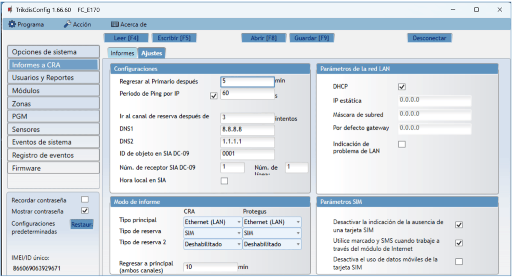

**Grupo de configuraciones “Configuraciones”**

- **Regresar al Primario después** – período de tiempo después del cual el FIRECOM intentará recuperar la conexión utilizando el canal primario, en minutos.
- **Período de Ping por IP** – periodo para enviar corazonadas PING internas. Estos mensajes sólo son enviados a través del canal GPRS. El receptor no reenviara los mensajes PING al software de monitoreo para evitar sobre cargarlo. Las notificaciones sólo serán enviadas al software de monitoreo si el receptor falla en recibir los mensajes PING del dispositivo dentro de un lapso de tiempo establecido.

Por defecto, la notificación de “Conexión perdida” será transmitida al software de monitoreo si el mensaje PING no es recibido en el receptor en tiempos mayores al establecido en el dispositivo. Por ejemplo, si el PING es establecido para 3 minutos, el receptor transferirá la notificación de “Conexión perdida” si no recibe un PING en los próximos 9 minutos.

Las corazonadas de PING mantienen la sesión activa de comunicación entre el dispositivo y el receptor. Una sesión activa es requerida para conexiones remotas, control y configuración del dispositivo. Recomendamos establecer un periodo de PING no mayor a 5 minutos. .

- **Ir al canal de reserva después de** – ingresa cuántos intentos fallidos de enviar mensajes utilizando el canal primario deben pasar antes de cambiar al *canal de* *respaldo*.

- **DNS1, DNS2** – direcciones del servidor DNS.

- **ID de objeto en SIA DC-09** – especifica el número de objeto.

- **Núm. de receptor SIA DC-09** – especifica el número del receptor.

- **Núm. de línea SIA DC-09** – especifica el número de línea.

- **Hora local en SIA** - marque la casilla para indicar el tiempo configurado en el módulo en los mensajes enviados a la estación de monitoreo.

**Grupo de configuración "Modo de informe"**

Se establece el orden preferido de envío de mensajes a través de los canales CRA y al Protegus2. Los tipos de canales de comunicación se establecen en orden. Si no es posible establecer una conexión a través del canal de comunicación principal, se realiza la transición al canal de comunicación de respaldo, etc. Si el tipo de conexión de respaldo logró transmitir el mensaje al CRA, se intentará el tipo de conexión "**Regresar a principal**" después del intervalo de tiempo especificado.

- **Tipo principal** – selecciona un tipo de conexión (SIM, Ethernet (LAN)) con el receptor CRA y Protegus2.

- **Tipo de reserva** – selecciona un tipo de conexión (SIM, Ethernet (LAN)) con el receptor CRA y Protegus2.

- **Tipo de reserva 2** – seleccione un tipo de conexión (SIM, Ethernet (LAN)) con el receptor CRA y Protegus2.
- **Regresar a principal (ambos canales)** – período de tiempo después del cual el FIRECOM intentará recuperar la conexión utilizando el canal primario, en minutos.

**Grupo de configuración "Parámetros de la red LAN"**

- **DHCP** – modo para registrarse en la red LAN (manual o automática). Marca la casilla y el comunicador del FIRECOM leerá automáticamente la configuración de red (máscara de subred, puerta de enlace) y se le asignará automáticamente una dirección IP (modo de registro automático).

- **IP** **estática** – dirección IP estática para el modo de registro manual.

- **Máscara de subred** – máscara de subred para el modo de registro manual.

- **Por defecto gateway** – puerta de enlace para el modo de registro manual.

- **Indicación de problema de LAN** - marque la casilla para que el LED del comunicador se encienda cuando falle el enlace de comunicación LAN.

**Grupo de configuración "Parámetros SIM"**

- **Desactivar la indicación de la ausencia de una tarjeta SIM** – cuando se marca la casilla, el comunicador FIRECOM no mostrará una indicación de que no hay una tarjeta SIM insertada.

- **Utilice el marcado y SMS cuando trabaje a través del módulo de Internet** – marcar esta casilla permitirá controlar el comunicador mediante llamadas telefónicas y mensajes SMS. Si la casilla no está marcada y hay una red LAN disponible, no se utilizarán SMS ni llamadas telefónicas. Si la casilla no está marcada y no hay red LAN, el FIRECOM aún podrá controlarse mediante llamadas telefónicas y mensajes SMS. El *FIRECOM* enviará mensajes SMS al usuario.

- **Desactiva el uso de datos móviles de la tarjeta SIM** – marcar esta casilla desactivará el uso de los datos móviles de la tarjeta SIM. Los datos solo se enviarán mediante LAN. Si una red LAN no está disponible, el FIRECOM almacenará datos en la memoria. Cuando se restaure la red LAN, el FIRECOM enviará datos mediante LAN.

### Ventana “Usuarios y Reportes” 

**Pestaña “Usuarios”**

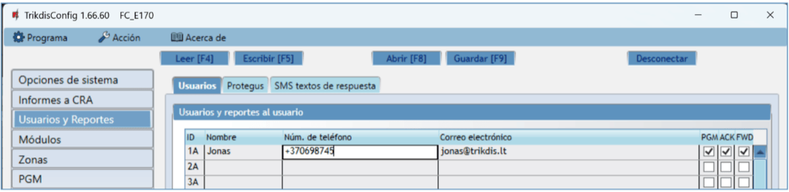

**Grupo de configuración “Usuarios y reportes al usuario”**

- **ID** – número de usuario en la lista.

- **Nombre** – nombre de usuario. Estos nombres se utilizarán en los mensajes SMS de eventos.

- **Núm. de teléfono** – el número de teléfono del usuario que recibirá los mensajes SMS. Los números deben ingresarse con el código internacional. Los primeros 8 números de teléfono recibirán informes utilizando mensajes y llamadas telefónicas.

- **Correo electrónico** - ingresa el correo electrónico del usuario, así el usuario será invitado a Protegus2 para controlar el sistema.

- **PGM** – si la casilla está marcada, el usuario puede controlar las salidas de forma remota (llamada, SMS).

- **ACK** – si la casilla está marcada, el FIRECOM enviará mensajes SMS con texto de respuesta SMS al usuario después de cada comando SMS recibido.

- **FWD** – si la casilla está marcada, los mensajes SMS recibidos de usuarios que no sean del sistema se reenviarán al usuario (por ejemplo, saldo de la cuenta de la tarjeta SIM, mensajes promocionales aleatorios, etc.).

**Pestaña “Protegus”**

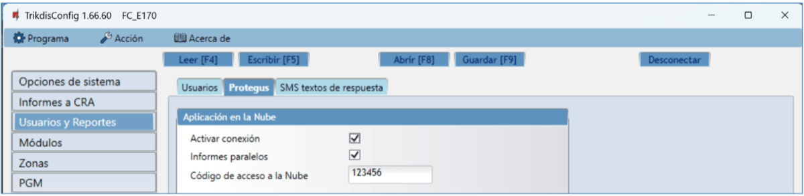

**Grupo de configuración “Aplicación en la Nube”**

- **Activar conexión** – habilite el servicio Protegus2 para permitir que el FIRECOM intercambie datos con la aplicación Protegus2 y configure el dispositivo de forma remota usando TrikdisConfig.

- **Informes paralelos** – habilite el envío de mensajes paralelos a través del canal principal y a Protegus2. Los informes solo se enviarán a Protegus2 y a los usuarios después de que se hayan enviado a la empresa de seguridad.

- **Código de acceso a la Nube** – código de 6 dígitos para conectarse con Protegus2 (código predeterminado - 123456).

**Pestaña “SMS textos de respuesta”**

**Grupo de configuración “Texto de respuesta SMS”**

- El texto para las respuestas a los comandos enviados mediante mensajes SMS se puede personalizar en la columna de “**Texto de SMS**”. También aquí están los textos de los mensajes SMS que se utilizan al activar entradas o salidas.

### Ventana “Módulos” 

**Pestaña „RS485 módulos“**

**Grupo de configuración “Módulos RS485”**

- **ID** – número del módulo en la lista.

- **Módulo** – elija el módulo que se está utilizando (módulos iO-8, iO-MO, iO-LORA, iO8-LORA, PB-LORA, REL-LORA) de la lista de módulos.

- **Núm. de Serie** ingrese el número de serie del módulo, que se indica en el paquete o en la caja del módulo.

- **Nombre** – puedes darle un nombre al módulo.

- **Versión de firmware** – la versión del firmware se mostrará cuando el FIRECOM encuentre el módulo conectado.

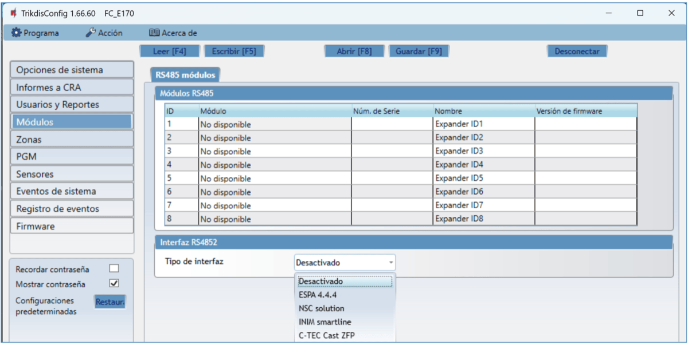

**Grupo de configuración “Interfaz RS485 2”**

Las centrales de incendios (con protocolo **ESPA4.4.4**, **NSC solución**, **INIM smartline**, **C-TEC Cast ZFP**) se pueden conectar al bus RS485 2 del comunicador FIRECOM. El diagrama de conexión de la central de incendios y su configuración se muestran en los párrafos 3.5- 3.8.

### Ventana “Zonas” 

**Pestaña “Configuraciones de zonas”**

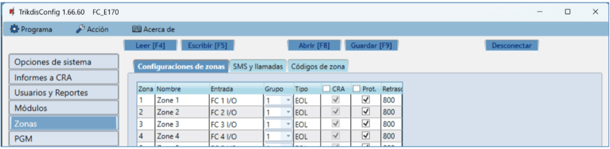

- **Zona** – el número de la zona en la lista.

- **Nombre** - ingrese el nombre de la zona.

- **Entrada** – puedes seleccionar qué entrada IN del módulo expansor o FIRECOM se asignará a la zona.

- **Grupo** - asignar una zona a un grupo.

- **Tipo** – elige el tipo de circuito conectado a la entrada de zona IN de una lista: NC – normalmente cerrado; NO – normalmente abierto; EOL - con una resistencia *end of line*; EOL_T - con una resistencia *end of line* y monitoreo de manipulación; ATZ – circuito normalmente cerrado de dos zonas con resistencias *end of line*, sin función de monitoreo de manipulación (para usar este tipo, elige la segunda zona ATZ en la lista de entrada); ATZ_T – circuito normalmente cerrado de dos zonas con resistencias *end of line*, con función de monitoreo de manipulación (para usar este tipo, elige la segunda zona ATZ en la lista de entrada).

- **CRA** – si la casilla está marcada, los informes de eventos de zona se enviarán a la estación central de monitoreo (CRA).

- **Prot**. – si la casilla está marcada, los informes de eventos de zona se enviarán a la nube de Protegus2.

- **Retraso** – tiempo de reacción de la zona entrada IN, en milisegundos.

**Pestaña “SMS y llamadas”**

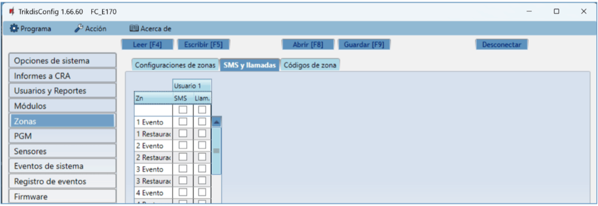

Esta pestaña se mostrará si al menos el número de teléfono de un Usuario se describe en la ventana "Usuarios y Reportes". Esta configuración solo se puede realizar para los primeros 8 usuarios.

- **Zn** – número de zona con la palabra de identificación del evento. Puede ser "*Evento*" o "*Restaurar*".

- **Usuario / SMS y Llam.** – elige de qué manera se informará a los usuarios sobre los eventos en cada zona individual, mediante mensajes SMS y/o llamadas telefónicas.

**Pestaña “Códigos de zona”**

Cuando se activa una zona, el comunicador enviará un mensaje de evento. A la entrada se le asigna un CID (SIA), que se enviará a la estación de monitoreo (CRA) y a Protegus2.

- **Zona** - ingrese el nombre de la zona.

- **Habilitar** – marque las casillas de eventos que enviarán mensajes a CRA y Protegus2.

- **E/R -** especificar la condición para el envío del evento por parte del comunicador ("Evento" (E) o "Restaurar" (R)).

- **CID** - código de evento en formato Contact ID.

- **SIA** – código de evento en formato SIA.

- **Grupo** – ingrese el número de grupo que se enviará después de que ocurra el evento.

- **Zona** - ingrese el número de zona que se enviará después de que ocurra el evento.

### Ventana “PGM” 

**Pestaña “Salidas”**

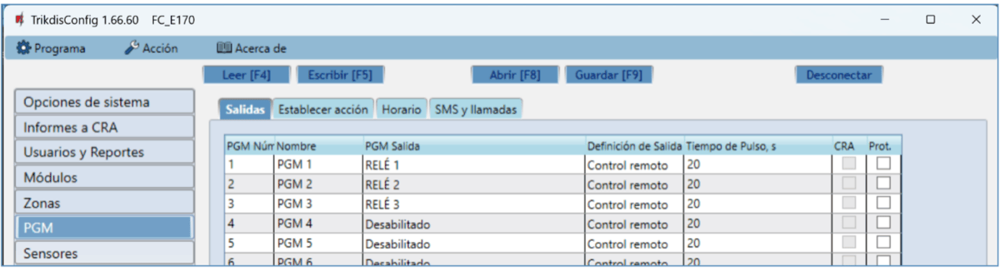

- **PGM Núm.** – especifica el número de salida de PGM en la lista.

- **Nombre -** ingrese el nombre de la salida PGM.

- **PGM Salida** – asigna las salidas OUT del FIRECOM o una salida de expansor.

- **Definición de Salida** – elige el modo operativo de la salida OUT.

- **Tiempo de Pulso, s** – puedes establecer la duración de activación de OUT desde 0 a 9999 segundos.

- **CRA** – si esta casilla está marcada, los informes de activación/desactivación de la salida PGM se enviarán a la estación central de monitoreo (CRA).

- **Prot.** – si la casilla está marcada, los informes de activación/desactivación de la salida PGM se enviarán a la nube de Protegus2.

**Pestaña “Establecer acción”**

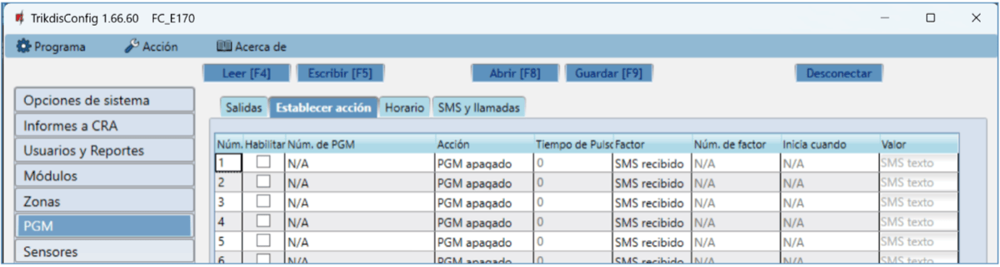

- **Núm.** – número de salida en la lista.
- **Habilitar** – activa el algoritmo de operación PGM.

- **Núm. de PGM** – selecciona la salida OUT PGM deseada que se controlará después de que ocurra el evento descrito en las columnas “**Factor”, “Núm. de Factor”, “Iniciar cuando”, “Valor”**.

- **Acción**:
- **PGM apagado** – estado de salida OUT - "apagado".

- **PGM encendido** –estado de salida OUT - "encendido".

- **Pulse apagado** – estado inicial de salida OUT - "encendido". Después del comando, el estado OUT se convertirá en "apagado" durante el tiempo del pulso, y más tarde volverá automáticamente al estado "encendido" inicial.

- **Pulse encendido** – estado inicial de salida OUT - "apagado". Después del comando, el estado OUT se activará durante el **Tiempo de Pulso**, y luego volverá automáticamente al estado inicial "apagado".
- **Tiempo de Pulso, s** – puedes configurar el tiempo de pulso desde 0 a 9999 segundos.

- **Factor/Núm. de Factor** – elige qué evento *(Entrada, SMS recibido, Fallo de zona)* encenderá la salida OUT.

  - La programación se pueden asignar a una salida OUT. La programación muestra cuándo se debe activar la salida. Se pueden preparar hasta 10 programaciones diferentes en la **pestaña Programador**.

- **Inicia cuando** – puedes establecer una condición adicional para activar la salida OUT según el evento “**Factor”**.

- **Valor** – dependiendo de la condición elegida en la columna “**Factor”** se puede especificar un valor (texto del mensaje SMS recibido). Si se identifica este valor, se realizará la acción (elegida en la columna “**Acción”**). El texto del mensaje SMS se puede separar usando símbolos de %. Los símbolos % se utilizan para separar la palabra clave que cambiará el estado de una salida PGM de todo el mensaje SMS recibido.

**%.....%** - parte del texto del mensaje SMS recibido debe coincidir con el texto ingresado entre símbolos de % (por ejemplo **%hoUSe%**. El texto en un mensaje SMS debe incluir el texto "**hoUSe**". Ejemplo de un mensaje SMS: **VacationhoUSe25864**).

**.....%** - el comienzo del mensaje SMS recibido debe coincidir con el texto ingresado hasta el símbolo % (por ejemplo, **hoUSe%**. El mensaje SMS debe comenzar con el texto **"hoUSe"**. Ejemplo de un mensaje SMS: **hoUSeddss**).

**%.....** – el final del mensaje SMS recibido debe coincidir con el texto ingresado después del símbolo %. (por ejemplo, **%hoUSe**. El mensaje SMS debe terminar con el texto **"hoUSe"**. Ejemplo de un mensaje SMS: **1144hoUSe**).

El texto del mensaje SMS distingue entre mayúsculas y minúsculas.

**Pestaña “Horario”**

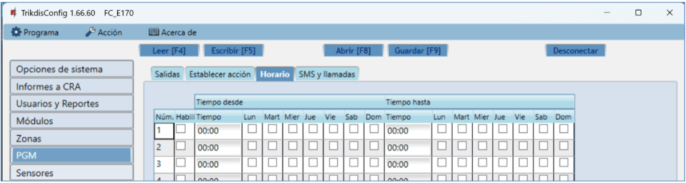

- **Núm.** – número de horario en la lista.

- **Habilitar** – activa la programación.

- **Tiempo desde** – establece la hora en que se activará OUT (hora de inicio programada).

- **Tiempo hasta** – configura la hora en que se apagará OUT (hora de finalización programada).
- **Lun – Dom** – puedes marcar los días de la semana en que OUT deberá activarse/desactivarse.

**Pestaña “SMS y llamadas”**

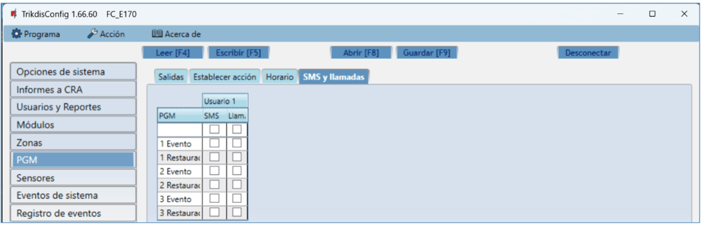

Esta pestaña se mostrará si al menos el número de teléfono de un Usuario se describe en la ventana "Usuarios y Reportes". Esta configuración solo se puede realizar para los primeros 8 usuarios.

- **PGM** – muestra el número de salida OUT y el tipo de evento de activación/desactivación (“**Evento**” - evento de activación de salida OUT y “**Restauración**” - evento de desactivación de salida OUT).

- **Usuario / SMS y Llam.** – elige a qué usuarios informar utilizando mensajes SMS y/o llamadas telefónicas cuando la salida OUT está activada/desactivada.

### Ventana "Sensores" 

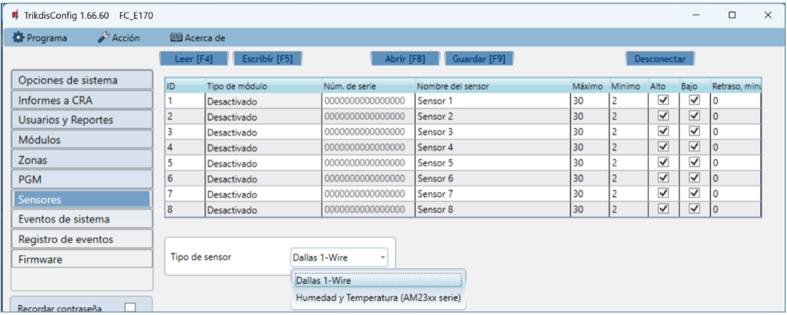

- **ID** – número del sensor de temperatura en la lista.

- **Tipo de módulo** – elige un sensor de temperatura para asignar a la ID.

- **Núm. de Serie.** - número de serie del sensor de temperatura leído por el comunicador.

- **Nombre del sensor** – asigna un nombre al sensor de temperatura.

- **Máximo** – cuando la temperatura es superior a esta configuración, se generará un informe de evento. Para que se genere un mensaje de evento, la casilla “**Alto”** debe estar marcada.

- **Mínimo** – cuando la temperatura es inferior a esta configuración, se generará un informe de evento. Para que se genere un mensaje de evento, la casilla “**Bajo”** debe estar marcada.

- **Retraso** - se enviará un evento si el valor medido (Máx. o Mín.) por el sensor se excede dentro del tiempo establecido. El tiempo de retraso se ingresa en minutos.

- **Tipo de sensor** – elige el tipo de sensor de temperatura conectado (“**Dallas 1Wire”** - se pueden conectar hasta 8 sensores de temperatura de este tipo. Si se eligen los sensores de Dallas, se vincularán automáticamente; “**Humedad y temperatura” (AM23xx serie)** - se puede conectar un sensor de temperatura y humedad AM2301. Si se utilizará el sensor de “Humedad y Temperatura”, debe asignarse manualmente en la columna “**Tipo de módulo”**).

### Ventana “Eventos de sistema” 

**Pestaña “Eventos”**

- **ID** – número de evento en la lista.

- **Nombre de evento** – nombre del evento.

- **Habilitar** – permite el reconocimiento de eventos y la generación de informes.

- **CRA** – los informes de eventos seleccionados se enviarán al CRA.

- **Prot**. – los informes de eventos seleccionados se enviarán a la nube de Protegus2.

- **Código CID** – Código ID de contacto del evento.

- **SMS texto del evento** – texto SMS de evento.

- **SMS texto de restauración** - texto SMS de evento de restauración.

**Pestaña “SMS y llamadas”**

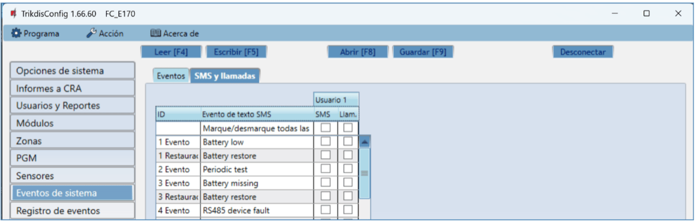

Esta pestaña se mostrará si al menos el número de teléfono de un Usuario se describe en la ventana "Usuarios y Reportes". Esta configuración solo se puede realizar para los primeros 8 usuarios.

- **ID** – número y palabra de identificación (Evento, Restauración) del evento.

- **Evento de texto SMS** – texto que se usará en mensajes de SMS del evento.

- **Usuario / SMS y Llam.** – elige las formas en que se informará a los usuarios sobre cada evento: mensaje **SMS** y/o **Llamada** telefónica.

### Ventana “Registro de eventos” 

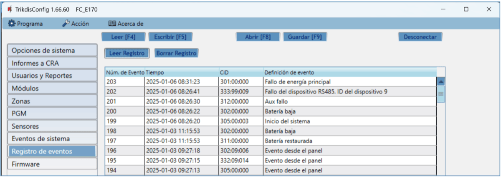

- Botón **“Leer Registro”** – comando para leer el registro de eventos desde la memoria del dispositivo.

- **Borrar Registro** – comando para borrar las entradas del registro de eventos de la memoria del dispositivo.

- En la tabla, puedes encontrar el “**Núm. de Evento”**, “**Tiempo”**, código “**CID”** y “**Definición de evento”**. El registro de eventos puede mostrar hasta 1000 eventos almacenados en la memoria del FIRECOM.

### Restablecer la configuración predeterminada 

Para restablecer la configuración predeterminada del comunicador, haz clic en el botón “**Restaurar”** en TrikdisConfig.

## Configuración Remota 

!!! note
    La configuración remota solo funcionará cuando el FIRECOM:
    
    1.  La tarjeta SIM insertada ha sido activada y el código PIN ha sido
        ingresado o deshabilitado.
    
    2.  La servicio Protegus2 está activada. Podrá encontrar
        información sobre como activar la nube en la sección 6.4 Ventana de
        "Usuarios y Reportes".
    
    3.  La fuente de alimentación está conectada (el LED de "**STA**" -
        verde parpadeante);
    
    4.  Estar registrado en la red (el LED de "**SIM**" de iluminarse de
        color verde y parpadear de color amarillo; y/o el indicador verde
        "**ETH**" está encendido cuando está conectado a la red LAN).
    
    Si "**SIM**" está en amarillo fijo o "**DAT**" está en amarillo
    fijo, el dispositivo no puede conectarse a la red móvil y/o al servicio
    Protegus2.
1.  En su PC abra el software de configuración de TrikdisConfig.

2.  En la sección de acceso remoto ingrese el IMEI/número único de ID. Este número puede ser encontrado en el dispositivo y en la etiqueta del empaque.

3. (Opcional) en el espacio del nombre de Sistema ingrese el nombre deseado para el comunicador.

2.  Presione „**Configuración”**.

3.  En la nueva ventana de clic en **Leer [F4].** A petición, ingrese el código del administrador o instalador. Para guardar la contraseña, seleccione “Recordar contraseña” en la ventana principal.

4.  Establezca las opciones deseadas y presione **Escribir [F5].**

## Desempeño de la Prueba del Comunicador 

Después de que la configuración y la instalación hayan sido completadas, lleve a cabo una prueba de sistema:

1.  Para probar una entrada del comunicador, actívela. Compruebe si los eventos fueron recibidos por el Centro de recepción de alarmas (CRA) y/o la aplicación Protegus2.

2.  Para probar las salidas del comunicador, enciéndalas de forma remota y verifique su funcionamiento. Asegúrese de que los eventos hayan sido recibidos por el Centro de recepción de alarmas (CRA) y/o la aplicación Protegus2.

3.  Realice una prueba de alarma contra incendios para ver si el CRA recibe los eventos correctamente.

## Actualización del firmware 

!!! note
    Cuando el comunicador esté conectado a TrikdisConfig, el programa
    ofrecerá actualizar el firmware del dispositivo si es que hay alguna
    actualización disponible. Las actualizaciones requieren una conexión al
    internet. / Si hay un antivirus instalado en su computadora, puede que
    este bloquee la opción de actualización de firmware. En este caso usted
    debe reconfigurar su software de antivirus.
El firmware del comunicador puede ser actualizado o cambiado de forma manual. Después de una actualización, el comunicador mantendrá cualquier opción establecida. Cuando escriba el firmware de forma manual, este puede ser cambiado a una versión más reciente o antigua. Para actualizar:

1.  Abra ***TrikdisConfig**.*

2.  Conecte el comunicador a través de cable USB Type-C a la computadora o conéctese al comunicador de forma remota. Si existe una versión más nueva del firmware, el software ofrecerá descargar el archivo de la versión más nueva del firmware.

3.  Seleccione la parte de “**Firmware”** del menú.

4. Presione “Abrir firmware” y seleccione el archivo de firmware requerido.

2.  Presione **Actualizar [F12]**.

3.  Espere a que se complete la actualización.

## Requerimientos de Seguridad 

El comunicador sólo debe ser instalado y mantenido por un personal cualificado.

Por favor, lea atentamente este manual antes de la instalación con el fin de evitar errores que pueden conducir a un mal funcionamiento o incluso daños en el equipo.

Siempre que desconecte la fuente de alimentación antes de realizar las conexiones eléctricas.

Los cambios, modificaciones o reparaciones no autorizadas por el fabricante deberán invalidar la garantía.

Cumpla con la normativa local y no deseche su sistema de alarma inutilizables o sus componentes con los residuos domésticos.
