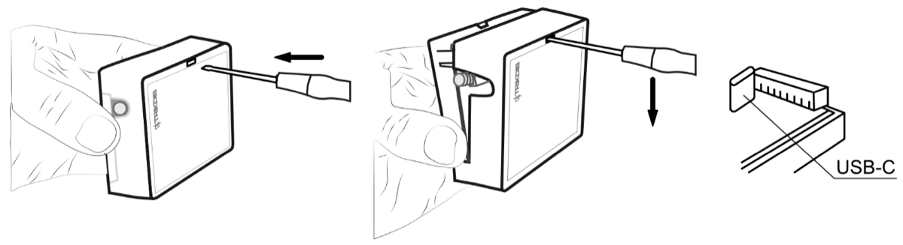

# celular/Ethernet GET Comunicador

  

## Descripción 

El comunicador está diseñado para transmitir mensajes sobre eventos del panel de control al Centro de Monitoreo y a la aplicación Protegus2.

El comunicador celular GET se puede conectar directamente a los paneles de control (DSC, Paradox, UTC Interlogix (CADDX), Texecom, Innerrange, Honeywell) o a un comunicador telefónico (que admite el protocolo de comunicación Contact ID transmitido por tonos DTMF) del panel de control.

Comunicador funciona con la aplicación Protegus2. Con Protegus2 los usuarios pueden controlar su sistema de alarma de forma remota y recibir notificaciones sobre eventos del sistema de seguridad. La aplicación Protegus2 funciona con todos los paneles de control de seguridad de varios fabricantes a los que está conectado el comunicador GET. El comunicador puede transmitir notificaciones de eventos a la CRA y trabajar con Protegus2 simultáneamente.

**Características**

El comunicador GET se puede conectar al bus serie (Serial bus) o al bus de teclado (Keypad bus) o al comunicador telefónico (TIP/RING) del panel de control.

Envía eventos al receptor en una CRA:

- Envía eventos a los receptores de hardware o software TRIKDIS que funcionan con cualquier software de monitoreo.

- Puede enviar información de eventos a SIA DC-09 receptores. El anexo contiene tabla de conversión de los códigos (Contact ID a SIA).

- Puede enviar información de eventos a SUR-GARD receptores.

- Supervisión de la conexión mediante sondeo al receptor de IP cada 30 segundos (o por período definido por el usuario).

- Canal de respaldo, que se utilizará si se pierde la conexión con el canal primario.

- Con canales de comunicación paralelos se pueden enviar eventos a dos receptores al mismo tiempo.

- Cuando el servicio *Protegus2* está habilitado, los eventos se envían primero a CRA, y solo luego se envían a los usuarios de la aplicación.

Funciona con la aplicación Protegus2:

- Notificaciones de sonidos especiales y "Push" que informan sobre eventos.

- Armado/Desarmado de forma remota.

- Control remoto de dispositivos conectados (luces, portones/barreras, sistemas de ventilación, calefacción, aspersores, etc.).

- Diferentes derechos de usuario para administrador, instalador y usuario.

**Informes a los usuarios finales:**

- Los usuarios pueden ser informados con la aplicación Protegus2.

**Salidas y entradas controlables:**

- 2 entradas/salidas universales. Modo de funcionamiento se establece como entrada o salida.

- Salidas controladas por Protegus2.

**Configuración rápida:**

- Las configuraciones pueden guardarse en un archivo y escribirse rápidamente en otros comunicadores.

- Dos niveles de acceso para configurar el dispositivo para el administrador de CRA y para el instalador.

- Configuración remota y actualización de firmware.

### Lista de paneles de Control compatibles 

| Fabricante | Modelo |
|------------|--------|
| DSC® | <u>PC585</u>, <u>PC1404</u>, <u>PC1565</u>, <u>PC1616</u>, <u>PC1832</u>, <u>PC1864</u>, PC5020 |
| PARADOX® | <u>SPECTRA SP4000</u>, <u>SP5500</u>, <u>SP6000</u>, <u>SP7000</u>, <u>SP65</u>, <u>SP5500+</u>, <u>SP6000+</u>, <u>SP7000+</u> |
| PARADOX® | <u>MAGELLAN MG5000</u>, <u>MG5050</u>, <u>MG5050E</u>, <u>MG5050+</u>, <u>MG5075</u> |
| PARADOX® | <u>DIGIPLEX EVO48</u>, <u>EVO192</u>, <u>EVOHD</u>, <u>EVOHD+</u> |
| PARADOX® | SPECTRA 1727, 1728, 1738 |
| PARADOX® | ESPRIT E55 |
| UTC Interlogix® | <u>NetworX (Caddx) NX-4v2</u>, <u>NX-6v2</u>, <u>NX-8v2</u>, <u>NX-8e</u> |
| Texecom® | <u>Premier 24</u>, <u>48</u>, <u>88</u>, <u>168</u>, <u>640</u> /​ <u>Premier Elite 12</u>, <u>24</u>, <u>48</u>, <u>64</u>, <u>88</u>, <u>168</u>, <u>640</u> |
| Innerrange® | Inception, Integriti |
| Honeywell® | <u>Ademco Vista-15</u>, <u>Ademco Vista-20</u>, <u>Ademco Vista-48</u> |

> **<u>Subrayado</u>** - paneles de control controlados directamente por GET. Paneles de control Paradox, que se controlan directamente, debe contener la versión de firmware V.4 o superior.
>
> \* Los paneles de control de otros fabricantes se conectan al comunicador GET mediante los terminales TIP RING de la línea telefónica del panel de control.

### Tipos de Comunicador 

Este manual es para comunicadores LTE.

### Especificaciones 

| Parámetro | Descripción |
|-----------|-------------|
| Conexión de red | LTE /​ Ethernet |
| Conexión al panel de control | Bus serie, bus de teclado o TIP RING |
| Entradas /​Salidas universales | 2, se puede establecer ya sea como entrada IN con el tipo: NC, NO, NC con EOL, NO con EOL, NC con DEOL, NO con DEOL (EOL = 2,2 kΩ), o la salida OUT (colector abierto (OC) 150 mA) |
| Módem EG915U-EU /​ (Europa) | LTE FDD: B1/​B3/​B5/​B7/​B8/​B20/​B28 |
| Módem EG915U-EU /​ (Europa) | GSM: B2/​B3/​B5/​B8 |
| Módem EG915U-LA /​ (América Latina) | LTE FDD: B2/​B3/​B4/​B5/​B7/​B8/​B28/​B66 |
| Módem EG915U-LA /​ (América Latina) | GSM: B2/​B3/​B5/​B8 |
| Módem BG95-M5 (Cat M1) | LTE-FDD: B1/​B2/​B3/​B4/​B5/​B8/​B12/​B13/​B18/​B19/​B20/​B25/​B26/​B27/​B28/​B66/​B85 |
| Módem BG95-M5 (Cat M1) | EGPRS: 850/​900/​1800/​1900 MHz |
| Voltaje de la fuente de alimentación | 10-18 V DC |
| Consumo de Energía | 175 mA |
| Protocolos de Transmisión | TRK, DC-09_2007, DC-09_2012, TL150 |
| Encriptación del mensaje | AES 128 |
| Memoria de eventos no enviados | Hasta 60 eventos |
| Modificación de los ajustes | Con el software de configuración TrikdisConfig de forma remota o local a través del puerto USB-С. |
| Entorno de Operación | Temperatura de -10 °C a 50 °C, humedad relativa - desde 80% a +20 °C |
| Dimensiones del Comunicador | 113 x 70 x 25 mm |
| Peso | 110 g |

### Tablero del Comunicador 

1.  Antena GSM conector SMA.

2.  Luces Indicadoras.

3.  Ranura Frontal de Apertura de la Cubierta.

4.  Terminal para conexiones externas.

5.  Botón de "REINICIO".

6.  Ranura Tarjeta SIM2.

7.  Ranura Tarjeta SIM1.

8.  Puerto USB-С para la programación del comunicador.

9.  Conexión Ethernet zócalo RJ45.

### Propósito de las terminales 

| Terminal | Descripción |
|----------|-------------|
| +12 VDC | +10 V/​+18 V fuente de alimentación |
| -12 VDC | 0 V fuente de alimentación |
| CLK | Terminal de bus serial para conexión directa al panel de control |
| I/​O 1 | 1r terminal de entrada/​salida (configuración predeterminada – OUT) |
| I/​O 2 | 2do terminal de entrada/​ salida (configuración predeterminada – OUT) |
| COM | Común (negativo) |
| A 485 | No utilizado |
| LAN | Conector RJ45 para conexión de cable LAN |
| TIP | Terminal para conectar con panel de control TIP terminal |
| RING | Terminal para conectar con panel de control RING terminal |

### LED indicador de operación 

| Indicador | Estado de la luz | Descripción |
|-----------|------------------|-------------|
| NETWORK LTE | Off | Sin conexión a la red celular |
| NETWORK LTE | Amarillo parpadeando | Conectándose a la red celular |
| NETWORK LTE | Verde sólido con parpadeo amarillo | El comunicador está conectado a la red celular. / La potencia de la señal celular suficiente para el nivel 3 de 4G (tres parpadeos amarillos) |
| NETWORK LAN | Off | No conectado a una red de computador |
| NETWORK LAN | Verde sólido | El comunicador está conectado a una red de computador |
| DATA | Off | No hay eventos no enviados |
| DATA | Verde sólido | Los eventos no enviados se almacenan en el búfer |
| DATA | Verde parpadeando | (Modo de configuración) Los datos se transfieren a/desde el comunicador |
| POWER | Off | La fuente de alimentación está apagada o desconectada |
| POWER | Verde sólido | La fuente de alimentación está encendida con suficiente voltaje |
| POWER | Amarillo sólido | La tensión de alimentación es insuficiente (≤11.5V) |
| POWER | Verde sólido y parpadeo amarillo | (Modo de configuración) Comunicador está listo para la configuración |
| POWER | Amarillo sólido | (Modo de configuración) No hay conexión con la computadora |
| TROUBLE | Off | No hay problemas de operación |
| TROUBLE | 1 parpadeo rojo | Error de conexión en el nivel "físico" (PHY Link status error), revisa el cable LAN |
| TROUBLE | 2 parpadeos rojos | Error de tarjeta SIM1 |
| TROUBLE | 3 parpadeos rojos | Error de tarjeta SIM2 |
| TROUBLE | 7 parpadeos rojos | Conexión perdida con el panel de control (serial bus) |
| INTERFACE | - | No utilizado |

### Esquema estructural del uso del dispositivo GET 

!!! note
    Antes de empezar, asegúrese de tener todo lo necesario:
    
    1.  Cable USB-C para la configuración.
    
    2.  Por lo menos 4 alambres para conectar el comunicador con el panel de
        control.
    
    3.  Un cable CRP2 para conectarse con el puerto serial del panel de
        Paradox.
    
    4.  Desatornillador de cabeza plana.
    
    5.  Suficiente señal de antena GSM.
    
    6.  Tarjeta SIM activada (la petición por el código PIN puede ser
        desactivada).
    
    7.  Manual de instalación del panel de control de seguridad.
    
    Ordene los componentes necesarios de forma separada de su distribuidor
    local.
## ¿Cómo configurar el comunicador con el software de TrikdisConfig? 

1.  Descargue el software de TrikdisConfig de [www.trikdis.com](http://www.trikdis.com) (en la barra de búsqueda ponga TrikdisConfig) e instálelo.

2.  Abra la cubierta del GET con el desatornillador de cabeza plana como se muestra a continuación:

    

3.  Usando el cable USB-С conecte el GET a la computadora.

4.  Abra el programa de configuración de TrikdisConfig. El software reconocerá de forma automática el comunicador conectado y abrirá una ventana para su configuración.

5.  De clic en Read (F4) para leer la información sobre los parámetros del comunicador e ingrese el código del Administrador o del Instalador en la ventana saliente.

A continuación, habrá una descripción de las opciones que necesitan ser configurados para el comunicador, para que este empiece a enviar notificaciones al CRA y para permitir que el control de seguridad sea controlado por la app de Protegus2.

### Opciones de conexión para la app de Protegus2 

**En la ventana de “Configuración del panel”:**

1.  Si el comunicador está conectado a los terminales TIP/RING del panel de control, entonces debe configurarse en “**AUTO**”.

1.  Si el comunicador está conectado al bus del teclado o al bus serie del panel de control, seleccione el modelo de panel de control que se conectará al comunicador.

2.  Marque la casilla “**Control directo**” si desea que el usuario pueda controlar el panel de control con un código (código de usuario del panel de seguridad) y la aplicación Protegus2. Esta configuración se especifica para paneles de seguridad con control directo.

3.  Para controlar directamente los paneles de control de Paradox y Texecom, ingrese la “**Contraseña de descarga de PC**”. El código debe coincidir con el código ingresado en el panel de control.

!!! note
    Para que funcione el control directo del panel, usted necesitará cambiar
    las opciones del panel. El cómo hacer esto está descrito en el capítulo
    4 "Programación del panel de control". En esta sección usted encontrará
    información de cómo cambiar la "**Contraseña de descarga de PC**".
**Ventana de “Informes para usuario”, pestaña de “Servicio Protegus”:**

4. Habilitar la conexión a la “**Servicio *Protegus”***.

2.  Cambie el “**Código de acceso a** **Protegus*” si usted desea que los usuarios requieran ingresarlo cuando se agrega el sistema a la app de Protegus2 (сontraseña por defecto – 123456). Importante: si cambias el código vía TrikdisConfig, también debes cambiarlo en la aplicación Protegus2***.

**En la ventana de la “Configuración de la red”**

Estos ajustes deben realizarse si el comunicador está conectado a una red LAN.

3. Marque la casilla "**Usar DHCP**" para que el comunicador lea automáticamente la configuración de red de la computadora (máscara de subred, puerta de enlace) y asigne una dirección IP.

Si tiene una tarjeta SIM (o dos tarjetas SIM) insertada en su dispositivo, debe realizar las siguientes configuraciones:

4. Ingrese el código PIN para la tarjeta SIM.

2.  Cambie el nombre “**APN”**, el “**APN”** puede ser encontrado en el sitio del operador de la tarjeta SIM (el “Internet” es universal y funciona en muchas redes de los operadores).

3.  **DNS1** - dirección predeterminada del servidor DNS de Google. **Independientemente de su configuración de IP, asegúrese de que sus direcciones DNS coincidan con las admitidas por su ISP**.

4.  **DNS2** - dirección predeterminada del servidor DNS de Google. **Independientemente de su configuración de IP, asegúrese de que sus direcciones DNS coincidan con las admitidas por su ISP**.

**En la ventana de la “CRA informes”**

12. Se establece el orden preferido para el envío de mensajes a través de los canales de comunicación a la CRA y a Protegus2. Los tipos de canales de comunicación se establecen en orden. Si no es posible establecer una conexión a través del canal de comunicación "**Primario**", se realiza una transición al canal de comunicación "**Respaldo**", etc. Si fue posible enviar un mensaje a través del canal de comunicación "**Respaldo**", luego de un intervalo de tiempo específico, se intentará volver al canal de comunicación "**Primario**".

Cuando termine con la configuración, de clic en **Escribir [F5]** y desconecte el cable USB.

!!! note
    Para más información sobre otras opciones de comunicador GET en
    TrikdisConfig vea el capítulo 6 de "Configuración con el programa
    TrikdisConfig".
### Configuración para conectarse con el CRA 

**En la ventana de “Ajustes del sistema”**

1.  Ingrese el número de ID del objeto (**No utilice números de objeto FFFE, FFFF**.).

**En la ventana de “Configuración del panel”**

2. Si el comunicador está conectado a los terminales TIP/RING del panel de control, entonces debe configurarse en “**AUTO**”.

3. Si el comunicador está conectado al bus del teclado o al bus serie del panel de control, seleccione el modelo de panel de control que se conectará al comunicador.

**En la ventana de “CRA informes”**

4. **Modo** – seleccione el modo de conexión IP.

2.  **Protocolo** – seleccione el tipo de protocolo para mensajes de evento: **TRK8** (para los receptores de TRIKDIS), **DC-09_2007** o **DC-09_2012** (a receptores universales), **TL150** (para los receptores de SUR-GARD).

3.  **Clave de encriptación** – Ingrese la llave de encriptación que está establecida en el receptor.

4.  **Dominio o IP** – ingrese la dirección del dominio o IP del receptor.

5.  **Puerto** – ingrese el número de puerto de la red del receptor.

6.  **TCP o UDP** – elija un protocolo de transmisión de evento (TCP o UDP), en donde se transmitirán los eventos.

7.  (Recomendado) Configure los ajustes para el “**Modo del canal de reserva**”.

    

8.  Se establece el orden preferido para enviar mensajes a través de los canales de comunicación a la CRA y a Protegus2. Los tipos de canales de comunicación se establecen en orden. Si no es posible establecer una conexión a través del canal de comunicación "**Principal**", se realiza una transición al canal de comunicación "**Reserva**", etc. Si fue posible enviar un mensaje a través del canal de comunicación "**Reserva**", luego de un intervalo de tiempo específico, se intentará volver al canal de comunicación "**Principal**".

**En la ventana de “Configuración de la red”**

Estos ajustes deben realizarse si el comunicador está conectado a una red LAN.

12. Marque la casilla "**Usar DHCP**" para que el comunicador lea automáticamente la configuración de red de la computadora (máscara de subred, puerta de enlace) y asigne una dirección IP.

Si tiene una tarjeta SIM (o dos tarjetas SIM) insertada en su dispositivo, debe realizar las siguientes configuraciones.

13. Ingrese el código PIN para la tarjeta SIM.

14. Cambie el nombre “**APN**”, el “**APN**” puede ser encontrado en el sitio del operador de la tarjeta SIM (el “Internet” es universal y funciona en muchas redes de los operadores).

15. **DNS1** - dirección predeterminada del servidor DNS de Google. **Independientemente de su configuración de IP, asegúrese de que sus direcciones DNS coincidan con las admitidas por su ISP**.

16. **DNS2** - dirección predeterminada del servidor DNS de Google. **Independientemente de su configuración de IP, asegúrese de que sus direcciones DNS coincidan con las admitidas por su ISP**.

Cuando la configuración esté lista, de clic en **Escribir [F5]** y desconecte el cable USB.

!!! note
    Para más información sobre otras opciones de comunicador GET en
    TrikdisConfig vea el capítulo 6 de "Configuración con el programa
    TrikdisConfig".
## Instalación y cableado 

### Proceso de instalación 

1.  Retire la cubierta superior y extraiga la terminal de contacto.

2.  Retire la placa PCB.

3.  Fije la parte inferior para el lugar adecuado para poner los tornillos.

4.  Coloque la placa PCB de nuevo en la caja, inserte terminal de contacto.

5.  Atornille la antena celular

6.  Inserte la tarjeta nano-SIM.

7.  Cierre la cubierta superior.

8.  Si se utilizará una red LAN para transmitir eventos a la CRA, se debe conectar un cable LAN al comunicador.

!!! note
    Puede instalar una o dos tarjetas SIM en el comunicador. / Asegúrese de
    que la tarjeta SIM esté activada. / Asegúrese de que el servicio de
    Internet móvil esté habilitado si se utilizará la aplicación
    Protegus2 o la comunicación con la CRA a través del canal IP. / Si
    desea evitar ingresar el código PIN de la tarjeta SIM en
    TrikdisConfig, inserte la tarjeta SIM en el teléfono y desactive
    la función de solicitud de código PIN.
### Diagramas para conectar un comunicador a paneles de control 

Siguiendo uno de estos diagramas provistos a continuación, conecte el comunicador con el panel de control.

### Diagrama para conectar el comunicador al bus de teclado y comunicador telefónico (terminales TIP/RING) del panel PARADOX SP/SP+/MG/MG+ 

Al conectar el comunicador al bus del teclado y a los terminales TIP/RING del panel de control, debe realizar las siguientes configuraciones para el comunicador GET:

1.  Seleccione “**AUTO**”.

2.  Seleccione el modelo de panel de control “**7. Paradox SP+/MG+ series KeyBus**”.

3.  Seleccione “**Control directo**” si desea que los usuarios puedan controlar el panel usando la aplicación Protegus2 usando su propio código de teclado.

4.  Para controlar directamente el panel de seguridad, ingrese la “**Contraseña de descarga de PC**”. Debe coincidir con la contraseña ingresada en el panel de seguridad.

El panel de control Paradox debe programarse para transmitir eventos al CMS y para control remoto desde la aplicación Protegus2.

| **Celda** |    **Datos**     | **Celda** | **Datos** |
|:---------:|:----------------:|:---------:|:---------:|
|    801    | \*\*\*\*\*\*\*\* |    815    |  123456   |
|    811    |       1111       |    911    |   1234    |
|    812    |       2222       |           |           |

### Diagrama de conexión para control el panel de control a través de la zona de keyswitch 

Siga este esquema si el panel de control será controlado, pero no de forma directa, pero con una salida PGM GET para prender/apagar la zona de keyswitch del sistema.

!!! note
    El comunicador GET tiene 2 terminales de entrada/salida
    universales que se pueden configurar para que funcionen como SALIDA. Las
    salidas PGM (OUT) pueden controlar dos áreas (secciones) de la alarma de
    seguridad. Para dicho control, es necesario en el programa
    TrikdisConfig en la ventana "**Configuración del panel**"
    desmarcar la casilla "**Control directo**". En la aplicación
    Protegus2, es necesario realizar las configuraciones que se
    describen en el párrafo 5.2 "Configuraciones adicionales para
    armar/desarmar el sistema con la zona keyswitch".
El comunicador está conectado al bus del teclado o al bus serie del panel de control. / El Armado/Desarmado del panel de control se realiza a través de la zona del interruptor (keyswitch).

El comunicador está conectado a los terminales TIP/RING del panel de control. / El Armado/Desarmado del panel de control se realiza a través de la zona del interruptor (keyswitch).

### Diagramas para la conexión de entrada 

El comunicador tiene dos terminales de E/S universales que se pueden configurar en el modo de operación IN (entrada). El siguiente circuito se puede conectar al terminal de entrada: NC, NO, NO/EOL, NC/EOL, NO/DEOL, NC/DEOL. La configuración de un tipo diferente de entrada se realiza con el programa TrikdisConfig en la ventana "**IN/OUT**" **-> “Tipo”**.

Diagramas de tipo de circuito de entrada NC, NO, NO/EOL, NC/EOL, NO/DEOL, NC/DEOL:

### Esquema de cableado de un relé 

Con los contactos de relé se puede controlar (encender/ apagar) diversos aparatos eléctricos. El terminal de I/O del comunicador debe configurarse en un modo de salida (OUT).

### Encendido del comunicador 

Prenda la fuente de alimentación del panel de control. El indicador de luz LED en el comunicador GET debe mostrar:

- El LED de “POWER” se iluminará de color verde cuando se encuentre prendido;

- El LED de “NETWORK LTE” se iluminará de color verde y parpadeará de color amarilla cuando se registre a una red.

!!! note
    Nivel de señal 4G suficiente - 3 (3 destellos amarillos del indicador
    "NETWORK LTE"). / Si cuenta menos destellos amarillos del indicador
    "NETWORK LTE", entonces la intensidad de la señal de la red móvil es
    insuficiente. Se recomienda buscar otro lugar para instalar el
    comunicador o utilizar una antena externa. / La indicación luminosa de
    los indicadores del comunicador se describe en la sección 1.6 "LED
    indicador de operación". / Si los LED del comunicador GET no
    están encendidos, verifique la fuente de alimentación y las conexiones
    de cableado.
## Programación de paneles de control 

### Programación de paneles de control cuando el comunicador está conectado al bus de teclados o bus serie

A continuación, se describirá cómo programar los paneles de control para que el comunicador GET puede leer eventos del panel y pueda controlarlo de forma remota.

Para habilitar el control remoto del panel de control, asegúrese que la casilla de Armado/Desarmado Remoto se encuentre seleccionada en la ventana de “**Configuración del panel**” de TrikdisConfig.

#### DSC

Los paneles DSC no necesitan ser programados.

#### PARADOX

Los paneles de control de Paradox necesitan ser programados sólo para control directo con Protegus2. No necesita programar los paneles de Paradox para que puedan leer eventos.

Para el control remoto de los paneles de Paradox, usted necesita establecer la contraseña de descarga de la computadora. Esta contraseña debe ser igual a la contraseña que fue establecida en la ventana de “**Configuración del panel**” de TrikdisConfig, cuando la casilla a un lado de Armado/Desarmado Remoto fue seleccionada.

Para establecer esta contraseña, con el teclado conectado al panel de control:

- Para las series MAGELLAN, SPECTRA: vaya a la celda 911 e ingrese la contraseña de cuatro dígitos de la descarga de computadora.

- Para las series DIGIPLEX EVO: vaya a la celda 3012 e ingrese la contraseña de cuatro dígitos de la descarga de computadora.

#### TEXECOM

Los paneles de control de Texecom necesitan ser programados para leer eventos y tener control remoto.

Usted necesita establecer el código UDL del panel de Texecom. Esta contraseña debe ser igual a ala contraseña que fue establecida en la ventana de “**Configuración del panel**”, cuando la casilla a un lado de Armado/Desarmado remoto fue seleccionada.

El panel de control puede ser programado con el software de Texecom – Wintex. Ingrese el código UDL (4-digitos) en la ventana de Opción de Comunicación, en la pestaña de Opciones.

También, puede programar con el teclado conectado al panel de control:

1.  Ingrese el código de 4-digitos del instalador y presione el botón de [Menu} para entrar al menú de programación.

2.  Presione el [9] inmediatamente después de esto.

3.  Presione [7][6], y luego [2]. Ingrese el código UDL de 4-digitos (el código UDL debe ser igual a la contraseña de inicio de sesión de la computadora para el comunicador GET).

4.  Presione [Yes] y salgase del modo de programación presionando [Menu].

#### UTC INTERLOGIX (CADDX)

Con el teclado conectado al panel de control:

1.  Presione [\*][8] e ingrese el código del instalador (por defecto es – 9713).

2.  Ingrese el número del dispositivo asignado al comunicador conectado (por defecto – 0)

3.  Establezca la configuración de abajo para cada fila. En secuencia, presione la posición, número del segmento e ingrese la configuración requerida. Si da clic [\*][asterisco] usted regresará al campo de entrada local.

| Posición | Segmento | Configuración |
|----------|----------|---------------|
| 23 | 3 | 12345678 |
| 37 (no es necesario) | 3 | 12345678 |
| 37 (no es necesario) | 4 | 1234567* |
| 90 | 3 | 12345678 |
| 93 | 3 | 12345678 |
| 96 | 3 | 12345678 |
| 99 | 3 | 12345678 |
| 102 | 3 | 12345678 |
| 105 | 3 | 12345678 |
| 108 | 3 | 12345678 |

Después de haber programado todos los campos enlistados, presione [Exit] dos veces para salir del modo de programación.

#### INNERRANGE

La versión del panel de control de **Innerrange Inception** debe ser el **2.3.0.3507-r0** o mayor.

El panel de control debe estar conectado al internet. Conéctese con **Innerrange Inception** al ingresar en: <https://skytunnel.com.au/inception/SERIALNUMBER>, donde el **SERIALNUMBER** es el número del controlador que podrá encontrar en la cubierta del panel.

Abra la ventana de **Configuration>General>Alarm Reporting**. En el grupo "**3rd Party Device Reporting** ", debe instalar:

1.  **Enable 3rd Party Device Reporting** – seleccione esta casilla.

2.  **3rd Party Device Type** – establezca “Trikdis”.

3.  **Serial port** – establezca “Serial Port 1 (Plugged In, In Use By 3rd Party Device)”.

4.  Guarde la configuración y salgase de la aplicación.

#### HONEYWELL ADEMCO VISTA

Siga estos pasos para los paneles **Honeywell Ademco Vista-20 y Honeywell Ademco Vista-48**. La versión del firmware del panel debe ser V5.3 o superior.  Con un teclado que está conectado al panel:

1.  Entrar en el modo de programación. Ingrese el código del instalador [4] [1] [1] [2] y luego [8] [0] [0]. Alternativamente, encienda la fuente de alimentación del panel. En 50 segundos después de encender la fuente de alimentación, presione los botones [\*] y [#] al mismo tiempo (este método puede usarse cuando se salió del modo de programación presionando el teclado [\*] [9] [8]).

2.  Active el envío de información de Contacto ID del evento a través de LRR. Presione [\*] [2] [9] [1] [#] en el teclado.

3.  Cuando use la función „Armar/Desarmar Remoto“, permita usar la segunda dirección AUI. En el teclado, presione [\*] [1] [8] [9] [1] [1] [#].

4.  Salga del modo de programación. En el teclado presione [\*] [9] [9].  

### Programación de paneles de control al conectar un comunicador a los terminales TIP/RING del panel de control 

Para que el panel de control envíe eventos a través del comunicador telefónico, debe estar encendido y configurado correctamente. Siguiendo el manual de programación del panel, configure el comunicador telefónico del panel de control:

1.  Active el comunicador telefónico del panel PSTN.

2.  Introduzca el número de teléfono receptor de la Centro de Monitoreo (se puede utilizar cualquier número de más de 2 dígitos. El GET recogerá y responderá cuando la central llama a cualquier número de teléfono).

3.  Elegir el modo DTMF.

4.  Seleccione el protocolo de comunicación Contact ID.

5.  Introduzca el número de cuenta de 4 dígitos del panel.

Establezca la zona de panel de control, al que está conectada la salida OUT GET, para utilizarse con el interruptor de llave de zona para activar/ desactivar el panel de control de forma remota.

!!! note
    La llave de zona puede ser momentánea (pulso) o nivel. Por defecto, la
    salida controlable del GET se establece en modo de pulso por 3
    segundos. Se puede cambiar la duración del impulso o cambiar al modo de
    configuración de nivel en Protegus2. véase el capítulo 5.2
    "Configuraciones adicionales para armar/desarmar el sistema con la zona
    keyswitch".
#### PROGRAMACIÓN DE COMUNICADOR TELEFÓNICO DE HONEYWELL VISTA

Usando el teclado del panel de control ingrese a estas secciones y configúrelas como se describe:

- \*41 - introduzca el número de teléfono de receptor de la CRA;

- \*43 - introduzca el número de cuenta del panel de control;

- \*47 - establezca el tono de marcación a [1] e introduzca el número de intentos de llamada;

- \*48 – utilice la configuración predeterminada, \*48 debe ajustarse a 77;

- \*49 - Spit/ doble mensaje. \*49 debe ajustarse a 5;

- \*50 – el retardo para el envío de eventos de alarma de robo (opcional). El valor por defecto es [2,0]. Con ella la transmisión de mensajes de evento se retrasa durante 30 segundos. Si desea que el mensaje se envíe de inmediato, ajuste [0,0].

#### AJUSTES ESPECIALES PARA PANEL DE HONEYWELL VISTA 48

Si desea utilizar el comunicador GET con el panel Honeywell Vista 48, configure las siguientes secciones como se describe:

| Sección | Datos                         | Sección | Datos | Sección | Datos |
|:-------:|-------------------------------|:-------:|:-----:|:-------:|:-----:|
|  \* 41  | 111 (# telefónico receptor)   |  \* 60  |   1   |  \* 69  |   1   |
|  \* 42  | 1111                          |  \* 61  |   1   |  \* 70  |   1   |
|  \* 43  | 1234 (número de cuenta panel) |  \* 62  |   1   |  \* 71  |   1   |
|  \* 44  | 1234                          |  \* 63  |   1   |  \* 72  |   1   |
|  \* 45  | 1111                          |  \* 64  |   1   |  \* 73  |   1   |
|  \* 47  | 1                             |  \*65   |   1   |  \* 74  |   1   |
|  \* 48  | 7                             |  \* 66  |   1   |  \* 75  |   1   |
|  \* 50  | 1                             |  \* 67  |   1   |  \* 76  |   1   |
|  \* 59  | 0                             |  \* 68  |   1   |         |       |

Cuando todos los ajustes necesarios están configurados, es necesario salir del modo de programación. Ingrese \*99 en el teclado.

#### UTC INTERLOGIX(CADDX)

Programación del panel de control **Interlogix NX-4V2** (**NX-6V2**, **NX-8V2**) cuando el comunicador está conectado a los terminales TIP/RING del panel de control.

|  | Entrada con teclado | Descripción |
|--|---------------------|-------------|
|  | *89713 | Ingrese al modo de programación |
|  | 0# |  |
| Location 0 | 0# |  |
| Location 0 | 1*2*3*4*# |  |
| Location 1 | 1# |  |
| Location 1 | 1*2*3*4*# |  |
| Location 2 | 2# |  |
| Location 2 | 1*# |  |
| Location 4 | 4# | Todos los LED de zonas están encendidos (segment 1) |
| Location 4 | 12345678* | Todos los LED de zonas están encendidos (segment 2) |
| Location 4 | 12345678*# |  |
| Location 23 | 23# | Todos los LED de zonas están encendidos (segment 3) |
| Location 23 | ** | Todos los LED de zonas están encendidos (segment 3) |
| Location 23 | 12345678*# | Todos los LED de zonas están encendidos (segment 3) |
| Location 37 | 37# | Todos los LED de zonas están encendidos (segment 3) |
| Location 37 | ** | Todos los LED de zonas están encendidos (segment 4) |
| Location 37 | 12345678* |  |
| Location 37 | 12345678*# |  |
|  | EXIT EXIT | Salir del modo de programación |

## Control remoto 

### Agregar el cominicador a la aplicación Protegus2

Con Protegus2, los usuarios podrán controlar su sistema de alamas de forma remota. Podrán ver el estado del sistema y recibir notificaciones sobre eventos del sistema.

1.  Descargue y abra la aplicación Protegus2 o utilice la versión de navegador de internet: [<u>www.protegus.eu/login</u>](http://www.protegus.eu/login):

    

      
      
      
    

2.  Inicie sesión con su nombre de usuario y contraseña o regístrese para crear una nueva cuenta.

!!! note
    Al agregar GET a Protegus2, revise si:
    
    1.  La tarjeta SIM insertada ha sido activada y el código PIN ha sido
        ingresado o deshabilitado;
    
    2.  El servicio Protegus2 está habilitado. Ver párrafo 6.5
        "Ventana "Informes para usuario"";
    
    3.  La fuente de alimentación está conectada (el LED de "POWER" debe
        iluminarse de color verde);
    
    4.  El comunicador GET está conectado a la red móvil (el LED de
        "NETWORK LTE" de iluminarse de color verde y parpadear de color
        amarillo).
3. De clic en "**Añadir nuevo sistema**" e ingrese el número de GET “**IMEI/Unique ID**”. Este número puede ser encontrado en el dispositivo y en la etiqueta del empaque. Haga clic en "**Siguiente**".

4. Ingrese el nombre del sistema. Haga clic en el botón "**Siguiente**".

### Configuraciones adicionales para armar/desarmar el sistema con la zona keyswitch 

!!! note
    La zona de panel de control, donde la salida del comunicador GET
    se encuentra conectada, tiene que ser establecida a modo de keyswitch.
Siga las instrucciones de abajo si el panel de control no será controlado de forma directa, pero con la salida del GET PGM, prendiendo/apagando el panel de control de la zona de keyswitch.

1.  Haga clic en el botón "**Continuar**".

2. Ingrese "**Nombre de partición**". Habilite el control de salida PGM mediante la aplicación Protegus2.

2.  Seleccione “**Pulso**” o “**Nivel**”, dependiendo de cómo esté configurado el tipo de zona del interruptor de llave. Si es necesario, puede cambiar el intervalo de pulso.

3.  Haga clic en el botón "**Guardar**".

4. Si hay otra sección área, debes hacer clic en “**Haga clic para agregar una partición**”. La configuración de la salida PGM es similar a la descrita anteriormente.

2.  Después de completar la configuración, haga clic en el botón "**Saltar**".

### Control del sistema con Protegus2 

1.  Haga clic en el icono de estado del sistema "Desarm".

2.  *Protegus2* recibirá un mensaje sobre el cambio en el estado del sistema de seguridad y el ícono de estado cambiará de estado.

## Configuración con el programa TrikdisConfig 

### Barra de Estado 

Después de conectar el comunicador GET y haciendo clic en **Leer [F4]**, TrikdisConfig proporcionará información sobre el dispositivo conectado en la barra de estado.

**Barra de Estado**

| Nombre | Descripción |
|----|----|
| IMEI/​Identificación única | Número IMEI del dispositivo |
| Estado | Estado de acción |
| Dispositivo | Tipo de dispositivo (GET) |
| SN | Número de serie |
| BL | Versión del cargador de arranque |
| FW | Versión de firmware |
| HW | Versión del hardware |
| Estado | Estado de conexión |
| Administrador | Nivel de acceso (aparece después de que sea confirmado el código de acceso) |

Al presionar el botón **Leer [F4]**, el programa TrikdisConfig leerá y mostrará la configuración del comunicador GET. Con TrikdisConfig haga los ajustes necesarios como se describe a continuación.

### Ventana de “Ajustes del sistema” 

**Grupo de opciones “General”**

- **Número de objeto** - si los mensajes se enviarán al CRA, debe especificar el número de objeto (número hexadecimal de 6 dígitos, 0-9, A-F. **No use números de objeto FFFE, FFFF**), que es proporcionado por el Centro de Monitoreo.

- **ID del módulo** - ingrese el número de identificación del módulo.

- **Tiempo** **establecido** – elija qué servidor usar para la sincronización de hora.

**Grupo de opciones de “Acceso”**

Al configurar el comunicador GET hay dos niveles de acceso para el administrador e instalador:

- **Código de administrador** – da acceso total a la configuración del comunicador (código de fábrica - 123456).

- **Código de instalador** – brinda acceso limitado a la configuración del comunicador (el código de fábrica es 654321).

- **Sólo un administrador puede restaurar -** al marcar la casilla, será posible restaurar la configuración de fábrica del comunicador solo después de ingresar el código de administrador.

Nota: Si el campo " **Sólo un administrador puede restaurar** " está marcado y no conoce el código del administrador, entonces el fabricante UAB "Trikdis" puede restaurar la configuración de fábrica (este es un servicio pago).

- **Permitir que el instalador cambie** – el administrador establece qué parámetros podrá cambiar el instalador.

!!! note
    Los códigos de Administrador y de Instalador deben consistir de 6
    dígitos o caracteres en latín.
### Ventana de “Configuración del panel” 

**Grupo de opciones “TLF”**

El comunicador se conecta a los terminales TIP RING de la línea telefónica del panel de control.

- **Protocolo de comunicación** – configurado en "**AUTO**".

- **Primer tono HSK/Segundo tono HSK** – tono de "handshake" del panel de control.

- **Usar ID de cuenta del panel de control** – si el campo está marcado, el comunicador enviará mensajes con el número de objeto ingresado en el panel de сontrol.

- **Esperar confirmación de CRA** – si este campo está marcado, luego de cada mensaje enviado, el comunicador esperará la confirmación del receptor IP de que el mensaje ha sido recibido. Si el comunicador no recibe un reconocimiento, no generará una señal de “kiss-off”. El comunicador telefónico de la central de alarma reenviará el mensaje si no recibe la señal de fin de comunicación.

- **Frecuencia del tono de marcado** - la frecuencia con la que el comunicador GET se comunica con el comunicador telefónico del panel de control.

**Grupo de opciones “Bus de Data”**

El comunicador está conectado al bus del teclado o al bus serie del panel de control.

- **Protocolo del panel** - seleccione el protocolo de notificación de eventos (CID o SIA).

- Seleccione el „**Tipo de Panel”** al que está conectado el comunicador.

- **Control directo** – marque la casilla y el comunicador GET controlará directamente el panel de control. Este parámetro se muestra para paneles de intrusión con control directo. La sección 4.1 "Programación de paneles de control cuando el comunicador está conectado al bus de teclados o bus serie " describe cómo configurar paneles de control con control directo.

- **Evento** - marque la casilla para que el comunicador envíe mensajes de eventos a la CRA ya Protegus2.

- **Contraseña de descarga de PC** – para el control directo de los paneles de control de Paradox y Texecom, se debe ingresar un código de PC/UDL. El código debe coincidir con el código ingresado en el panel de control. La programación de paneles de control se describe en la sección 4.1 "Programación de paneles de control cuando el comunicador está conectado al bus de teclados o bus serie ".

### Ventana de “CRA informes” 

**Pestaña de parámetros “CRA ajustes”**

Los eventos pueden ser enviados a través de varios canales de comunicación. Los primeros y segundos canales de comunicación pueden ser operados de forma simultánea y el comunicador puede enviar eventos a dos receptores al mismo tiempo. El canal de respaldo puede ser asignado para los primeros y segundos canales, los cuales serán usados cuando la conexión al canal primario es interrumpida.

La comunicación está codificada y está protegida por una contraseña. El receptor TRIKDIS es requerido para recibir y enviar información de evento al software de monitoreo.

- **Para conectarse a través de IP** – software receptor IPcom Windows/Linux, hardware IP/SMS receptor RL14.

**Grupo de opciones del “Canal de comunicación principal”**

- **Modo** – seleccione el método de comunicación (IP) con el receptor CRA.

- **Protocolo** – seleccione en que tipo de código serán enviados los eventos: **TRK8** (a receptor TRIKDIS), **DC-09_2007** o **DC-09_2012** (a receptores universales), **TL150** (para los receptores de SUR-GARD).

- **Clave de encriptación** – clave de cifrado de mensajes de 6 dígitos. La clave de cifrado ingresada en el comunicador debe coincidir con la clave de cifrado almacenada en el receptor CRA.

- **Dominio o IP** – ingrese la dirección del dominio o IP del receptor.

- **Puerto** – ingrese el número del puerto de la red.

- **TCP o UDP** – seleccione en que protocolo (TCP o UDP) deberían ser enviados los eventos.

Grupo de opciones de “Modo del canal de reserva”

Habilite el modo de enlace de respaldo para que el enlace de respaldo envíe los mensajes cuando falle el enlace principal. La configuración del canal de comunicación de respaldo es similar a la configuración del canal principal.

**Grupo de opciones de “Segundo canal”**

Los eventos de este canal son transmitidos en paralelo con el primer canal. Cuando el segundo canal es habilitado, los eventos pueden ser enviados de forma simultanea por dos receptores (por ejemplo, CRA local y centralizado) Las opciones del canal paralelo son las mismas que las descritas anteriormente.

**Pestaña de “Ajustes”**

**Grupo de opciones “Ajustes”**

- **Periodo de prueba** – el período de envío de mensajes de prueba para verificar el canal de comunicación. Los mensajes de prueba se envían mediante códigos Contact ID y se transfieren al software de monitoreo.

- **Periodo de ping IP** – período para enviar señales de ping PING internas. Estos mensajes se envían únicamente por el canal IP. El receptor no envía mensajes PING al software de monitoreo sin sobrecargarlo. El software de monitoreo recibe información solo cuando el receptor no recibe mensajes PING del comunicador dentro de un período de tiempo establecido.

> De manera predeterminada, el receptor enviará un mensaje de "Conexión perdida" al software de monitoreo después de que haya transcurrido tres veces el período de tiempo establecido para el mensaje PING del comunicador. Por ejemplo: si el período PING se establece en 3 minutos. El receptor transmitirá un mensaje de pérdida de comunicación después de 9 minutos.
>
> Juntos, los mensajes PING mantienen una sesión de comunicación activa entre el dispositivo y el receptor. Se requiere una sesión de comunicación activa para la configuración y el control remotos del comunicador. Se recomienda establecer la duración del período PING en no más de 5 minutos.

- **Ir al canal de reserva después de... intentos** – ingrese el número de intentos fallidos de enviar un mensaje a través del canal de comunicación principal. Después de un intento fallido de transmitir un mensaje la cantidad de veces establecida, el comunicador cambiará para transmitir mensajes a través del enlace de respaldo.

- **Volver a principal después** – ingrese el período de tiempo después del cual el comunicador GET intentará restablecer la comunicación y enviar mensajes a través del canal “**Principal**”.
- **Línea Núm.** – ingrese el número de línea en el receptor.

- **Receptor Núm.** - ingrese el número del receptor.

**Grupo de opciones “Modo de informe”**

Se establece el orden preferido de envío de mensajes a través de los canales CRA y al Protegus2. Los tipos de canales de comunicación se establecen en orden. Si no es posible establecer una conexión a través del canal de comunicación “**Principal**”, se realiza la transición al canal de comunicación de “**Respaldo**”, etc. Si el tipo de conexión de “**Respaldo**” logró transmitir el mensaje al CRA, se intentará el tipo de conexión regresar a “**Principal**" después del intervalo de tiempo especificado.

> • **Tipo principal** – selecciona un tipo de conexión (LAN, SIM1, SIM2) con el receptor CRA y Protegus2.
>
> • **Tipo de reserva** – selecciona un tipo de conexión (LAN, SIM1, SIM2) con el receptor CRA y Protegus2.
>
> • **Tipo de reserva 2** – seleccione un tipo de conexión (LAN, SIM1, SIM2) con el receptor CRA y Protegus2.

- **Prueba de conexión** - especifique el período de tiempo durante el cual se deben probar los tipos de conexión seleccionados (LAN, SIM1, SIM2).

### Ventana de “Informes para usuario” 

**Pestaña de la “Servicio Protegus”**

El servicio Protegus permite a los usuarios monitorear y controlar remotamente el comunicador. Puede encontrar más información sobre el servicio de Protegus en [www.protegus.eu](http://www.protegus.eu).

- **Activar conexión** – marque la casilla para habilitar el servicio Protegus2. El comunicador GET podrá comunicarse con la aplicación Protegus2. Con el programa TrikdisConfig, puede configurar de forma remota su comunicador.

- **Código de accesso a Protegus** – código de conexión de 6 dígitos para Protegus2 (código de fábrica - 123456). Si la contraseña ha sido cambiada usted tendrá que reingresarla cuando agregue el sistema en la app de Protegus2. Esta es una medida de seguridad adicional. Importante: si cambias el código vía TrikdisConfig, también debes cambiarlo en la aplicación Protegus2.

- **Informes paralelos** – permite el envío de informes paralelos utilizando el *canal primario* y a Protegus2. Los mensajes a Protegus2 sólo se enviarán después de que los mensajes hayan sido enviados a CRA.

### Ventana de “Configuración de la red” 

**Pestaña de la “LAN”**

**Estos ajustes deben realizarse si el comunicador está conectado a una red LAN.**

**Grupo de opciones de la “Ajustes de Ethernet”**

- **Usar DHCP** – marque la casilla para que el comunicador se conecte automáticamente a la LAN (modo de registro automático). Si la conexión no funcionó automáticamente, debe ingresar (modo de registro manual):
- **IP estática** – dirección IP del comunicador.

- **Máscara de subred** – máscara de subred.

- **Por defecto gateway** – para conectarse a internet.
- **DNS1, DNS2** – (Sistema de Nombre de Dominio) identifica el servidor que especifica la dirección IP del dominio. Usada cuando el dominio está establecido en el campo de canal de comunicación de Dominio o IP (no dirección IP). Las opciones por defecto son direcciones de servidores DNS establecidas por Google. **Independientemente de su configuración de IP, asegúrese de que sus direcciones DNS coincidan con las admitidas por su ISP.**

**Pestaña de la “SIM1”**

!!! note
    1.  Asegúrese de que la tarjeta SIM ha sido activada y funciona, antes
        de usarla.
    
    2.  Asegúrese de que el servicio de Internet móvil de la tarjeta SIM
        esté activado.

Estos ajustes deben realizarse si se inserta una tarjeta SIM en la ranura SIM1 del comunicador.

**Grupo de opciones de la “Tarjeta SIM”**

- **Pin de la tarjeta SIM** – ingrese el código PIN de la tarjeta SIM. Este código puede ser deshabilitado al insertar la tarjeta SIM en el celular.

- **APN** – ingrese el APN (Nombre de Punto de Acceso). Se requiere APN para conectar el comunicador a Internet. El APN puede ser encontrado en el sitio web del operador de la tarjeta SIM (el “Internet” es universal y funciona en muchas redes de los operadores.

- **Usuario, Contraseña** - contraseña: ingrese el nombre de usuario y la contraseña para APN si es necesario.

- **SIM ICCID** – ingrese el número ICCID de la tarjeta SIM si desea que el comunicador funcione solo con esta tarjeta SIM.

- **DNS1/DNS2** - (Domain Name System en inglés) ingrese la dirección IP del servidor de dominio. Se usa cuando el campo Dominio o IP especifica un dominio. De forma predeterminada, las direcciones del servidor DNS de Google están configuradas. **Independientemente de su configuración de IP, asegúrese de que sus direcciones DNS coincidan con las admitidas por su ISP.**

- **Preferred operator** – después de ingresar el código del operador de la red móvil, el comunicador se conectará solo a la red del operador seleccionado. El código del operador de telefonía móvil consta de códigos MCC y MNS.

**Pestaña de la “SIM2”**

Estos ajustes deben realizarse si se inserta una tarjeta SIM en la ranura SIM2 del comunicador.

**Grupo de opciones de la “Tarjeta SIM”**

- **Pin de la tarjeta SIM** – ingrese el código PIN de la tarjeta SIM. Este código puede ser deshabilitado al insertar la tarjeta SIM en el celular.

- **APN** – ingrese el APN (Nombre de Punto de Acceso). Se requiere APN para conectar el comunicador a Internet. El APN puede ser encontrado en el sitio web del operador de la tarjeta SIM (el “Internet” es universal y funciona en muchas redes de los operadores.

- **Usuario, Contraseña** - contraseña: ingrese el nombre de usuario y la contraseña para APN si es necesario.

- **SIM ICCID** – ingrese el número ICCID de la tarjeta SIM si desea que el comunicador funcione solo con esta tarjeta SIM.

- **DNS1/DNS2** - (Domain Name System en inglés) ingrese la dirección IP del servidor de dominio. Se usa cuando el campo Dominio o IP especifica un dominio. De forma predeterminada, las direcciones del servidor DNS de Google están configuradas. **Independientemente de su configuración de IP, asegúrese de que sus direcciones DNS coincidan con las admitidas por su ISP.**

- **Preferred operator** – después de ingresar el código del operador de la red móvil, el comunicador se conectará solo a la red del operador seleccionado. El código del operador de telefonía móvil consta de códigos MCC y MNS.

### Ventana de “IN/OUT“ 

El comunicador tiene 2 terminales universales (entrada/salida). La tabla puede configurar el modo de funcionamiento del terminal (Apagado, IN, OUT). La entrada debe especificar el tipo de circuito a conectar NC, NO, NO / EOL, NC / EOL, NO / DEOL, NC / DEOL.

Se pueden conectar sensores adicionales a las entradas del comunicador. Cuando se activa el sensor, el comunicador enviará un mensaje de evento. A la entrada se le asigna un código de Contact ID (SIA), que se enviará a CRA y Protegus2.

- **Activar** – verifique los campos del evento donde se enviarán los mensajes a CRA y Protegus2.

- **E/R** – especifique la condición de envío del evento interno del comunicador (**Evento** o **Restaurar**).

- **CID** – código de evento.

- **SIA** - código de evento.

- **Part**. – ingrese el número de área que se enviará cuando ocurra el evento interno y se reinicie el sistema.

- **Zona** - ingrese el número de zona que se enviará cuando ocurra el evento interno y el sistema se reinicie.

### Ventana de “Resumen del incidente” 

Esta ventana le permitirá prender, apagar y modificar los mensajes internos enviados por su dispositivo. Deshabilitar el mensaje interno en esta ventana prevendrá que sea enviado a pesar de otras opciones.

- **COMMUNICATION** – mensaje de falla de comunicación entre el panel de control y comunicador GET.

- **LAN_FAILURE** - mensaje de error de comunicación LAN.

- **POWER** – aviso de baja tensión de red.

- **REMOTE_FINISHED** – mensaje sobre desconexión de configuración remota con TrikdisConfig.

- **REMOTE_STARTED** – mensaje de inicio de sesión remoto para configurar comunicador GET con TrikdisConfig.

- **SIM1_FAILURE** - mensaje sobre falla de comunicación en la red móvil.

- **SIM2_FAILURE** - mensaje sobre falla de comunicación en la red móvil.

- **TEST** – mensaje de prueba periódica.

!!! note
    Los mensajes de prueba periódicos se configuran en la ventana del
    programa "**CRA informes**" **→ Ajustes → Período de prueba.**
- **Activar** – marque la casilla para habilitar el envío de mensajes.

Puede cambiar el código Contact ID (SIA) de cualquier evento, cambiar el número de “**Partición**” y el número de “**Zona**”, que se indican en el mensaje.

### Restablecer la configuración de fábrica 

Para restablecer el comunicador a la configuración de fábrica, presione el botón „**Restaurar”** en ***TrikdisConfig*.**

Otra forma de restaurar la configuración de fábrica.

La fuente de alimentación está conectada al comunicador. Mantenga presionado el botón "REINICIO" en el tablero del comunicador. Mantenga presionado el botón “REINICIO” durante 10 segundos hasta que los indicadores LED ("NETWORK", "POWER", "TROUBLE") se apaguen y el indicador LED "POWER" se encienda. Suelte el botón "REINICIO". Se han restablecido los ajustes de fábrica del comunicador.

## Configuración Remota 

!!! note
    La configuración remota sólo funcionará sí:
    
    1.  La tarjeta SIM insertada ha sido activada y el código PIN ha sido
        ingresado o deshabilitado;
    
    2.  O un cable LAN está conectado;
    
    3.  El servicio Protegus2 está habilitado, consulte la sección 6.5
        Ventana "Informes para usuario";
    
    4.  La fuente de alimentación está conectada (el LED de "**POWER**" debe
        iluminarse de color verde);
    
    5.  El comunicador GET está registrado en la red móvil (el LED de
        "**NETWORK LTE**" de iluminarse de color verde y parpadear de color
        amarillo).
1.  En su PC abra el software de configuración de TrikdisConfig.

2.  En el campo "**ID único**", ingrese el número IMEI del comunicador GET. Este número puede ser encontrado en el dispositivo y en la etiqueta del empaque.

3. En el campo "**Nombre del sistema**", escriba el nombre del comunicador.

2.  Presione “**Configuración”**.

3.  Se abrirá la ventana de configuración del comunicador GET. Presione el botón **Leer [F4]** para leer la configuración del comunicador. Si aparece una ventana pidiéndole que ingrese el código de administrador o instalador, ingrese el código de administrador o instalador de 6 dígitos. Marque la casilla junto a Recordar contraseña y presione el botón **Escribir [F5].**

4.  Realice los ajustes necesarios para el comunicador. Escriba estos cambios en GET presionando el botón **Escribir [F5]**. Haga clic en el botón “**Desconectar**” y salga del programa TrikdisConfig.

## Desempeño de la Prueba del Comunicador 

Después de que la configuración y la instalación hayan sido completadas, lleve a cabo una prueba de sistema:

Genere un evento:

1.  Generar un evento:

- Armando y desarmando sistemas de seguridad.

- Activando una alarma de zona cuando el sistema de seguridad esté armado.

1.  Asegúrese de que el evento llegue al CRA y/o sea recibido en la aplicación de Protegus2.

2.  Active la entrada del comunicador y verifique que los usuarios reciban mensajes de eventos.

3.  Active las salidas del comunicador de forma remota y asegúrese de que las salidas se activen y que los usuarios reciban mensajes de eventos.

4.  Si el panel de control será controlado de forma remota, arme/desarme el sistema de seguridad de forma remota al usar la app Protegus2.

## Actualización del firmware 

!!! note
    Cuando el comunicador esté conectado a TrikdisConfig, el programa
    ofrecerá actualizar el firmware del dispositivo si es que hay alguna
    actualización disponible. Las actualizaciones requieren una conexión al
    internet. / Si hay un antivirus instalado en su computadora, puede que
    este bloquee la opción de actualización de firmware. En este caso usted
    debe reconfigurar su software de antivirus.
El firmware del comunicador puede ser actualizado o cambiado de forma manual. Después de una actualización, el comunicador mantendrá cualquier opción establecida. Cuando escriba el firmware de forma manual, este puede ser cambiado a una versión más reciente o antigua. Para actualizar:

1.  Abra ***TrikdisConfig**.*

2.  Conecte el comunicador a través de cable USB a la computadora o conéctese al comunicador de forma remota. Si existe una versión más nueva del firmware, el software ofrecerá descargar el archivo de la versión más nueva del firmware.

3.  Seleccione la parte de „**Firmware**” del menú.

4. Presione “Abrir firmware” y seleccione el archivo de firmware requerido.

2.  Presione **Actualizar [F12]**.

3.  Espere a que se complete la actualización.

## Requerimientos de Seguridad 

El sistema de alarma de seguridad deberá ser instalado y mantenido por personal calificado.

Antes de la instalación, por favor lea con cuidado este manual, para poder evitar cualquier error que lleve al mal funcionamiento o incluso daño del equipo.

Desconecte la fuente de alimentación antes de hacer cualquier conexión eléctrica.

Los cambios, modificaciones o reparaciones no están autorizadas por el fabricante, y esto eliminará sus derechos a una garantía.

Por favor actúe de acuerdo a sus reglas locales y no se deshaga de su sistema de alarma sin uso o sus componentes con otro desecho normal de su casa.

## Anexo 

El comunicador recibidos desde panel de control los códigos de Contacto ID convierte a códigos SIA.

**Tabla de conversión de los códigos Contacto ID a código SIA**

| **Evento del sistema** | **Código de informe CID** | **Código de informe de SIA** |
|----|:--:|:--:|
| Alarma médica | E100 | "MA" |
| Emergencia personal | E101 | "QA" |
| Incendio en la zona: <z> | E110 | "FA" |
| Flujo de aguas detectado en la zona: <z> | E113 | "SA" |
| Alarma de la estación manual en la zona: <z> | E115 | "FA" |
| Pánico en la zona: <z> | E120 | "PA" |
| Alarma de pánico por el usuario: <v> | E121 | "HA" |
| Alarma de pánico en la zona: <z> | E122 | "HA" |
| Alarma de pánico en la zona: <z> | E123 | "PA" |
| Alarma de pánico en la zona: <z> | E124 | "HA" |
| Alarma de pánico en la zona: <z> | E125 | "HA" |
| Alarma activa en la zona: <z> | E130 | "BA" |
| Alarma activa en la zona: <z> | E131 | "BA" |
| Alarma activa en la zona: <z> | E132 | "BA" |
| Alarma activa en la zona: <z> | E133 | "BA" |
| Alarma activa en la zona: <z> | E134 | "BA" |
| Alarma activa en la zona: <z> | E135 | "BA" |
| Tamper activo en la zona: <z> | E137 | "TA" |
| Intrusión verificada en la zona: <z> | E139 | "BV" |
| Alarma activa en la zona: <z> | E140 | "UA" |
| Fallo del sistema (143) | E143 | "UA" |
| Tamper activo en la zona: <z> | E144 | "TA" |
| Tamper activo en la zona: <z> | E145 | "TA" |
| Alarma activa en la zona: <z> | E146 | "BA" |
| Alarma activa en la zona: <z> | E150 | "UA" |
| Gas detectado en la zona: <z> | E151 | "GA" |
| Pérdida de agua detectada en la zona: <z> | E154 | "WA" |
| Foil Rotura detectado en la zona: <z> | E155 | "BA" |
| Alta temperatura en el sensor: <n> | E158 | "KA" |
| Baja temperatura en el sensor: <n> | E159 | "ZA" |
| CO detectado en la zona: <z> | E162 | "GA" |
| Falla en zona de fuego: <z> | E200 | "FS" |
| Monitoreo de alarma | E220 | "BA" |
| Fallo del sistema (300) | E300 | "YP" |
| Pérdida de fuente de alimentación AC | E301 | "AT" |
| Batería baja | E302 | "YT" |
| Fallo del sistema (304) | E304 | "YF" |
| Reiniciar sistema en zona: <z> | E305 | "RR" |
| Programación del panel modificada | E306 | "YG" |
| Apagado del sistema | E308 | "RR" |
| Fallo en la batería (309) | E309 | "YT" |
| Fallo de toma a tierra | E310 | "US" |
| Fallo en batería (311) | E311 | "YM" |
| Sobrecarga en fuente de alimentación (312) | E312 | "YP" |
| Restablecimiento del ingeniero por usuario: <v> (313) | E313 | "RR" |
| Fallo en Sirena/Relé | E320 | "RC" |
| Fallo del sistema (321) | E321 | "YA" |
| Fallo del sistema (330) | E330 | "ET" |
| Fallo del sistema (332) | E332 | "ET" |
| Fallo del sistema (333) | E333 | "ET" |
| Fallo del sistema (336) | E336 | "VT" |
| Fallo del sistema (338) | E338 | "ET" |
| Fallo del sistema (341) | E341 | "ET" |
| Fallo del sistema (342) | E342 | "ET" |
| Fallo del sistema (343) | E343 | "ET" |
| Fallo del sistema (344) | E344 | "XQ" |
| Fallo de comunicación del sistema (350) | E350 | "YC" |
| Fallo de comunicación del sistema (351) | E351 | "LT" |
| Fallo de comunicación del sistema (352) | E352 | "LT" |
| Fallo del sistema (353) | E353 | "YC" |
| Fallo de comunicación del sistema (354) | E354 | "YC" |
| Fallo del sistema (355) | E355 | "UT" |
| Problema de fuego en zona: <z> | E373 | "FT" |
| Problema en la zona: <z> | E374 | "EE" |
| Problema en la zona: <z> | E378 | "BG" |
| Problema en la zona: <z> | E380 | "UT" |
| Avería en zona inalámbrica: <z> | E381 | "US" |
| Fallo del módulo inalámbrico (382) | E382 | "UY" |
| Tamper activo en la zona: <z> | E383 | "TA" |
| Batería baja en zona inalámbrica: <z> | E384 | "XT" |
| Problema en la zona: <z> (389) | E389 | "ET" |
| Problema en la zona: <z> (391) | E391 | "NA" |
| Problema en la zona: <z> (393) | E393 | "NC" |
| Usuario <v> desarmó el sistema | E400 | "OP" |
| Usuario <v> desarmó el sistema | E401 | "OP" |
| Desarme automático | E403 | "OA" |
| Desarmado diferido <v> usuario | E405 | "OR" |
| Alarma cancelada por el usuario: <v> | E406 | "BC" |
| Usuario <v> desarmó de forma remota | E407 | "OP" |
| Usuario <v> armó rápido | E408 | "OP" |
| Desarmado remoto | E409 | "OS" |
| Solicitud de devolución de llamada realizada por CRA | E411 | "RB" |
| Descarga de datos realizada con éxito | E412 | "RS" |
| Acceso denegado para el usuario: <v> | E421 | "JA" |
| Entrada por usuario <v> | E422 | "DG" |
| Acceso Forzado <z> zona | E423 | "DF" |
| Acceso de salida denegado para el usuario <v> | E424 | "DD" |
| Salida usuario <v> | E425 | "DR" |
| Usuario <v> desarmó demasiado pronto | E451 | "OK" |
| Usuario <v> armó el sistema demasiado tarde | E452 | "OJ" |
| Usuario <v> Falló al abrir | E453 | "CT" |
| Usuario <v> Falló al cerrar | E454 | "CI" |
| Auto armado fallido | E455 | "CI" |
| Armado parcial por el usuario: <v> | E456 | "CG" |
| Violación de salida por usuario: <v> | E457 | "EE" |
| Armado parcial por el usuario: <v> | E458 | "OR" |
| Recent arm <v> user | E459 | "CR" |
| Introducido código incorrecto | E461 | "JA" |
| Tiempo de auto-armado ampliado por usuario: <v> | E464 | "CE" |
| Dispositivo deshabilitado (501) | E501 | "RL" |
| Dispositivo deshabilitado (520) | E520 | "RO" |
| Sensor inalámbrico deshabilitado en la zona: <z> (552) | E552 | "YS" |
| Zona <z> anulada | E570 | "UB" |
| Zona <z> anulada | E571 | "FB" |
| Zona <z> anulada | E572 | "MB" |
| Zona <z> anulada | E573 | "BB" |
| Anulación de grupo por usuario: <v> | E574 | "CG" |
| Zona <z> anulada | E576 | "UB" |
| Bypass en zona <z> cancelado | E577 | "UB" |
| Ventilación de zona anulada | E579 | "UB" |
| Prueba de recorrido activada por usuario <v> | E607 | "TS" |
| Informe de prueba manual | E601 | "RX" |
| Informe de test periódico | E602 | "RP" |
| Evento del sistema (605) | E605 | "JL" |
| Evento del sistema (606) | E606 | "LF" |
| Problema en el informe de test periódico | E608 | "RY" |
| Evento del sistema (622) | E622 | "JL" |
| Evento del sistema (623) | E623 | "JL" |
| Hora y fecha restablecida por usuario <v> | E625 | "JT" |
| Fecha/hora inexacta | E626 | "JT" |
| Programación de sistema iniciada | E627 | "LB" |
| Programación del sistema terminada | E628 | "LS" |
| Evento del sistema (631) | E631 | "JS" |
| Evento del sistema (632) | E632 | "JS" |
| Sistema no activo (654) | E654 | "CD" |
| Alarma médica restaurada | R100 | "MH" |
| Emergencia personal restaurada | R101 | "QH" |
| No más alarma de incendio en la zona: <z> | R110 | "FH" |
| No más alarma de flujo de aguas en la zona: <z> | R113 | "SH" |
| Alarma de pánico restablecida en la zona: <z> | R120 | "PH" |
| Alarma de pánico cancelada por el usuario: <v> | R121 | "HH" |
| Alarma de pánico restablecida en la zona: <z> | R122 | "PH" |
| Alarma de pánico restablecida en la zona: <z> | R123 | "PH" |
| Alarma de pánico restablecida en la zona: <z> | R124 | "HH" |
| Alarma de pánico restablecida en la zona: <z> | R125 | "HH" |
| No más alarma en la zona: <z> | R130 | "BH" |
| No más alarma activa en la zona: <z> | R131 | "BH" |
| No más alarma activa en la zona: <z> | R132 | "BH" |
| No más alarma en la zona: <z> | R133 | "BH" |
| No más alarma en la zona: <z> | R134 | "BH" |
| No más alarma en la zona: <z> | R135 | "BH" |
| No más tamper en la zona: <z> | R137 | "TA" |
| No más alarma en la zona: <z> | R140 | "UH" |
| No más fallo del sistema (143) | R143 | "ER" |
| No más tamper en la zona: <z> | R144 | "TR" |
| No más tamper en la zona: <z> | R145 | "TR" |
| No más alarma en la zona: <z> | R146 | "BH" |
| No más alarma en la zona: <z> | R150 | "UH" |
| No más alarma de gas en la zona: <z> | R151 | "GH" |
| No más alarma de pérdida de agua en la zona: <z> | R154 | "WH" |
| Foil Rotura restaurado en la zona: <z> | R155 | "BH" |
| La temperatura se ha normalizado en el sensor: <n> | R158 | "KH" |
| La temperatura se ha normalizado en el sensor: <n> | R159 | "ZH" |
| No más alarma de CO en la zona: <z> | R162 | "GH" |
| No más falla en la zona de fuego: <z> | R200 | "FV" |
| Monitoreo de restauración de alarma | R220 | "BH" |
| No más fallo del sistema (300) | R300 | "YA" |
| Fuente de alimentación AC OK | R301 | "AR" |
| Batería OK | R302 | "YR" |
| No más fallo del sistema (304) | R304 | "YG" |
| Restablecimiento del sistema restaurado en la zona: <z> | R305 | "RR" |
| No más fallo en batería (309) | R309 | "YR" |
| Falla de tierra restablecido | R310 | "UR" |
| No más fallo en batería (311) | R311 | "YR" |
| Restaurar la sobrecarga de corriente de la fuente de alimentación (312) | R312 | "YQ" |
| No más fallo en Sirena/Relé | R320 | "RO" |
| No más fallo del sistema (321) | R321 | "YH" |
| No más fallo del sistema (330) | R330 | "ER" |
| No más fallo del sistema (332) | R332 | "ER" |
| No más fallo del sistema (333) | R333 | "ER" |
| No más fallo del sistema (336) | R336 | "VR" |
| No más fallo del sistema (338) | R338 | "ER" |
| No más fallo del sistema (341) | R341 | "ER" |
| No más fallo del sistema (342) | R342 | "ER" |
| No más fallo del sistema (344) | R344 | "XH" |
| No más fallo de comunicación del sistema (350) | R350 | "YK" |
| No más fallo de comunicación del sistema (351) | R351 | "LR" |
| No más fallo de comunicación del sistema (352) | R352 | "LR" |
| No más fallo del sistema (353) | R353 | "YK" |
| No más fallo de comunicación del sistema (354) | R354 | "YK" |
| No más fallo del sistema (355) | R355 | "UJ" |
| Restablecido problema de fuego en zona: <z> | R373 | "FJ" |
| No más problema en la zona: <z> | R374 | "EA" |
| No más problema en la zona: <z> | R380 | "UJ" |
| No más avería en zona inalámbrica: <z> | R381 | "UR" |
| No más fallo del módulo inalámbrico (382) | R382 | "BR" |
| No más tamper en la zona: <z> | R383 | "TR" |
| Batería OK en zona inalámbrica: <z> | R384 | "XR" |
| No más problema en la zona: <z> (391) | R391 | "NS" |
| No más problema en la zona: <z> (393) | R393 | "NS" |
| Usuario <v> armó el sistema | R400 | "CL" |
| Usuario <v> armó el sistema | R401 | "CL" |
| Armado automático | R403 | "CA" |
| Usuario <v> armó de forma remota | R407 | "CL" |
| Desarmado rápido | R408 | "CL" |
| Armado remoto | R409 | “CS” |
| Usuario <v> armó el modo Stay | R441 | "CG" |
| Usuario <v> armó demasiado pronto | R451 | “CK” |
| Usuario <v> desarmó el sistema demasiado tarde | R452 | “CJ” |
| Usuario <v> Falló al cerrar | R454 | “CI” |
| Armado parcial por el usuario: <v> | R456 | "CG" |
| Recent disarm <v> user | R459 | “CR” |
| Dispositivo habilitado (501) | R501 | "RG" |
| Dispositivo habilitado (520) | R520 | "RC" |
| Sensor inalámbrico habilitado en la zona: <z> (552) | R552 | "YK" |
| Bypass en zona <z> cancelado | R570 | "UU" |
| Bypass en zona <z> cancelado | R571 | "FU" |
| Bypass en zona <z> cancelado | R572 | "MU" |
| Bypass en zona <z> cancelado | R573 | "BU" |
| Anulación de grupo por usuario: <v> cancelada | R574 | "CF" |
| Bypass en zona <z> cancelado | R576 | "UU" |
| Bypass en zona <z> cancelado | R577 | "UU" |
| Bypass de la zona de ventilación cancelada | R579 | "UU" |
| Prueba de recorrido desactivada por usuario <v> | R607 | "TE" |
| Hora y fecha restablecida por usuario <v> | R625 | "JT" |
| Sistema activo (654) | R654 | "CD" |
