# Transmisor T16

## **Descripción**

El transmisor RF - T16 es un dispositivo de radio multifuncional utilizado para la transmisión de mensajes de eventos a través del panel de control por medio de redes de radio TRIKDIS.

El transmisor puede enviar sus propios mensajes de eventos y mensajes de eventos recibidos desde los paneles de control al CRA (centro de recepción de alarmas) con la posibilidad de reenviar hasta el usuario final.

**Características**

Comunicación

- Envía mensajes de eventos a CRA.

- Protocolos de red de radio RAS3, RAS2M, LARS1, LARS.

- Potencia de salida desde 1 W a 5 W.

- Posibilidad de utilizar transmisor IP externo como canal de comunicación principal.

- Transmisión de mensajes de eventos mediante códigos de Сontacto ID y 4 + 2.

- El uso del ID de cuenta del panel de control para sistemas de áreas múltiples.

Configuración

- Instalación rápida y fácil.

- Actualizaciones de firmware.

- Dos tipos de niveles de acceso (cuentas), para el instalador y para el administrador.

- Capacidad para configurar de forma remota cuando se utiliza un transmisor IP

Puerto serial, entradas y salidas

- Puerto serial universal para conectar varios paneles de control.

- La interfaz de línea fija TIP/RING puede aceptar mensajes del panel de control en códigos de Contacto ID y 4 + 2.

- Interfaz RS485 para transmisores IP y módulos de extensión.

- 6 entradas, tipos seleccionables: NC, NO, EOL (2,2 kΩ). (*T16V*, *T16U*)

5 entradas, tipos seleccionables: NC, NO, EOL (2,2 kΩ). (*T16U5*)

- 1 salida. (*T16V*, *T16U*)

2 salidas. (*T16U5*)

### Descripción de operación

Cuando se conecta a los terminales de un panel de control, él transmisor lee las señales desde el panel de control y los transforma en mensajes que se corresponden con códigos de protocolo Contact ID.

Si el transmisor está configurado para transmitir en sistema de codificación de radio RAS-3, él mensaje *de Contacto* *ID* se transmitirá sin cambios. Si el transmisor está configurado para transmitir en otro sistema de codificación de radio, los mensajes se convierten en códigos de ese sistema. La tabla de conversión se guarda en la memoria del transmisor y se puede modificar si es necesario. Si el equipo *TRIKDIS* se utiliza para la recepción, los mensajes transmitidos en cualquier en la codificación se envían al programa de monitoreo en sus significados precisos.

Los circuitos eternos tipo *NC, NO* o *EOL = 2,2 kΩ* se pueden conectar a los terminales *IN* del transmisor (entradas). Si el estado de circuito alterado o restaurado al estado inicial, el transmisor enviará un mensaje de evento.

El transmisor envía mensajes del panel de control utilizando una frecuencia de radio y codificación preestablecidos. El mismo mensaje se puede repetir 1-10 veces. Es posible configurar el transmisor para enviar mensajes en dos codificaciones de sistemas de radio diferentes, dos frecuencias de radio diferentes y con diferentes números de identificación del objeto protegido.

El transmisor envía periódicamente mensajes de **Prueba** para evaluar la conectividad. La recepción de estos mensajes es controlada por el centro de recepción del software de monitoreo. También es posible enviar constantemente mensajes **PING**, la recepción de las cuales son controladas por el hardware del centro de recepción.

El transmisor comprueba automáticamente la fuente de electricidad. Si el voltaje cae por debajo de 11,5 ± 0,2V, el transmisor enviará un mensaje acerca de que la tensión de la fuente de electricidad es insuficiente. Si el voltaje sube por encima de 12,6 ± 0,2V, el transmisor enviará un mensaje sobre la restauración del voltaje de la fuente de electricidad.

Si la fuente de electricidad cae por debajo de 10 ± 0,2V, el transmisor cambiará al modo de reposo. Antes de cambiar, el transmisor enviará un mensaje sobre la caída de voltaje. Mientras opera en modo de reposo, el transmisor no almacenará ni enviará ningún mensaje. El transmisor cambiará el modo de reposo al modo normal solo cuando la fuente de electricidad suba a 12,6 V y permanezca estable después de conectar la potencia del transmisor.

**Fuente de electricidad** **DC**. el T16 debe conectarse directamente a las terminales de corriente (AUX) o terminales de la batería de 12 V. El área de sección transversal de cable de poder del transmisor no debe ser menor que 1mm2. Al transmitir datos, el transmisor consume 1,2 A de la corriente, la estabilidad de la fuente de electricidad es importante para el funcionamiento confiable del transmisor.

**Antena**. La antena es muy importante para asegurar una conexión de buena calidad. Use solo una antena especificada para la frecuencia y potencia correctas. Si está utilizando una antena de 1/4 λ, debe estar orientada verticalmente y montada lo más alto posible. Evite montar la antena en lugares donde los escudos metálicos o particiones de concreto podrían bloquear la antena de recepción. La calidad de la conectividad es mejor cuando las antenas del transmisor y del receptor están a la vista una de la otra. Por lo general, la calidad de la conectividad se puede mejorar montando la antena lo más alto posible. La antena debe conectarse al transmisor mediante un cable coaxial de 50 Ω. Cuanto más largo sea el cable, mayor será la pérdida de señal. Se recomienda utilizar un cable de no más de 10 metros. Cuando la longitud del cable es inferior a 5 m, se recomienda un cable RG-58U o un cable mejor. Use un cable con menor atenuación para cables más largos. Cuando el transmisor esté instalado, verifique la calidad de la conectividad. Para hacer esto, envíe algunos mensajes y verifique el nivel de señal en el receptor. Un nivel de señal no inferior a 3 es suficiente.

**Cable de datos**. El cable de datos que conecta el transmisor de radio y el panel de control no debe medir más de 50cm. Si el cable de datos es más largo, debe usarse un cable blindado. El cable de datos se conecta en la central al bus del teclado, conexión serie o comunicador telefónico de la central. Evite montar el cable en paralelo con Cables de corriente de aires acondicionados, el cable de la antena u otras fuentes de campo electromagnético.

**Interfaz** **RS485**. Módulos W485 y TM17 pueden ser conectados a la interfaz RS485 del transmisor. Cuando la longitud del bus RS485 es más grande a 1m, use un cable de par trenzado (STP 4x2x0,5). Evite montar el cable en paralelo con cables de electricidad de aires acondicionados, el cable de la antena u otras fuentes de campo electromagnético.

### Parámetros técnicos

| Parametro | T16V | T16U | T16U5 |
|----|----|----|----|
| Fuente de corriente eléctrica | 10-15 V DC |  |  |
| Consumo actual | Hasta 50 mA (modo de espera) /​ Hasta 1,2 A (modo de envío) |  |  |
| Frecuencias de radio | 136 MHz – 174 MHz (VHF) | 430 MHz – 512 MHz (UHF) | 430 MHz – 470 MHz (UHF) |
| Canales de radio | 2 |  |  |
| Resistencia de salida de RF | 50 Ω |  |  |
| Emisiones secundarias | Cumple los requisitos de EN 300 113 |  |  |
| Protocolos de radiodifusión | RAS3, RAS2M, LARS, LARS1, LARS_RAS2M, LARS1_RAS2M |  |  |
| Tiempo de transmisión | 60-400 ms (depende del protocolo de radio elegido) |  |  |
| Memoria | Hasta 32 mensajes. |  |  |
| Entradas | 6, tipos seleccionables: NC, NO, EOL (2,2 кΩ) | 6, tipos seleccionables: NC, NO, EOL (2,2 кΩ) | 5, tipos seleccionables: NC, NO, EOL (2,2 кΩ) |
| Salida | 1, tipo OC, voltaje de conmutación 15 V, 1 A | 1, tipo OC, voltaje de conmutación 15 V, 1 A | 2, tipo OC, voltaje de conmutación 15 V, 1 A |
| Formato de mensaje de evento | Contacto ID;​ 4+2 |  |  |
| Entorno operativo | Temperatura desde -20° C a +50° C, humedad relativa del aire 80% a +20° C |  |  |
| Dimensiones | 113 x 71 x 26 mm |  |  |
| Peso | 0,10 kg |  |  |

Receptores para mensajes enviados en diferentes formatos de sistemas de radio por **transmisores series** T16

|                   | RAS-002 | RAS-2M | LARS  | LARS1 | RAS-3_CID |
|:------------------|:-------:|:------:|:-----:|:-----:|:---------:|
| TRIKDIS R7        |  **+**  | **+**  | **+** | **+** |           |
| TRIKDIS RF7       |  **+**  | **+**  | **+** | **+** |           |
| TRIKDIS R11       |  **+**  | **+**  | **+** | **+** |   **+**   |
| TRIKDIS RF11      |  **+**  | **+**  | **+** | **+** |   **+**   |
| Otros fabricantes |         |        | **+** | **+** |           |

### Elementos de transmisor

|  |  | Conector SMA para antena. Luces LED indicadoras. Ranura para abrir la tapa superior. Terminales para la conexión de cables. |
|----|----|----|
| T16V, T16U | T16U5 |  |

### Propósito de los terminales

| Terminal | Descripción |
|:---|:---|
| \+ DC | Terminal de corriente (10- 15 V DC terminal positivo) |
| \- DC | Terminal de corriente (10-15V DC terminal negativo) |
| Rx /​ CLK | Terminal de bus serial para conexión directa al panel de control |
| Tx /​ DATA | Terminal de bus serial para conexión directa al panel de control |
| A RS485 | Terminal A del bus *RS485* |
| A RS485 | Terminal B del bus *RS485* |
| COM/​RING | Terminal común (negativo) o terminal RING del comunicador telefónico |
| TIP | Terminal comunicador telefónico TIP |
| IN1 /​ R-1 | 1ro terminal de entrada, tipos seleccionables: NC, NO, EOL (2,2 kΩ). (ajuste de fábrica NO). O terminal de monitoreo de línea telefónica |
| IN2 /​ T-1 | 2do terminal de entrada, tipos seleccionables: NC, NO, EOL (2,2 kΩ). (ajuste de fábrica NO). O terminal para monitorear la línea telefónica |
| IN3 | 3ro terminal de entrada, tipos seleccionables: NC, NO, EOL (2,2 kΩ). (ajuste de fábrica NO) |
| IN4 | 4to terminal de entrada, tipos seleccionables: NC, NO, EOL (2,2 kΩ). (ajuste de fábrica NO) |
| COM | Terminal común (negativo) |
| IN5 | 5to terminal de entrada, tipos seleccionables: NC, NO, EOL (2,2 kΩ). (ajuste de fábrica NO) |
| IN6 /​ o | 6to terminal de entrada, tipos seleccionables: NC, NO, EOL (2,2 kΩ). (ajuste de fábrica NO). (T16V, T16U) |
| OUT 1 | Terminal de salida, abierto colector tipo, corriente hasta 1 A. (T16U5) |
| OUT 1 /​ o | Terminal de salida, abierto colector tipo, corriente hasta 1 A. (T16V, T16U) |
| OUT 2 | Terminal de salida, abierto colector tipo, corriente hasta 1 A. (T16U5) |

### Indicación LED de funcionamiento

| Indicador | Estado de luz | Descripción |
|----|----|----|
| NETWORK / (RED) | Parpadeo verde | El transmisor de radio está enviando datos. |
| DATA / (DATOS) | Verde sin parpadeo | Hay mensajes de eventos no enviados en el búfer de memoria. |
| DATA / (DATOS) | Rojo sin parpadeo | Desbordamiento de memoria intermedia |
| DATA / (DATOS) | Parpadeo rojo (1/1) | Problema de conexión del panel de control |
| DATA / (DATOS) | Parpadeo rojo (1/10) | Problema de conexión del módulo RS-485 |
| POWER / (PODER) | Parpadeo verde | El voltaje de la fuente de electricidad está presente |
| POWER / (PODER) | Parpadeo amarillo | Voltaje de fuente de alimentación de bajo nivel |
| POWER / (PODER) | Parpadeo verde y amarillo | (modo de configuración) el cable USB está conectado |

### Componentes necesarios para la instalación

Antes de comenzar la instalación, asegúrese de tener:

1.  Un cable USB, necesario para la configuración (tipo Mini-B);

2.  Al menos un cable de 4 cables para conectar el transmisor al panel de control;

3.  El manual del panel de control de seguridad al que se conectará el transmisor;

4.  Antena;

5.  Destornillador con cabeza plana de 2,5 mm.

Puede solicitar los materiales a su distribuidor local.

## Esquemas e instalación

### Esquemas para conectar paneles de control

**Lista de paneles de control a los que los transmisores** T16V, T16U **y** T16U5 **se puede conectar**

| Fabricante | Modelo de panel de alarma | T16V, T16U, T16U5 |
|----|----|:--:|
| DSC® | PC1616, PC1832, PC1864, PC1616, PC1832, PC1864 | **+** |
| PYRONIX® | MATRIX 424, MATRIX 832, MATRIX 832+, MATRIX 6, MATRIX 816 | **+** |
| GE® | CADDX NX-4, NX-6, NX-8, NX-8E | **+** |
| PARADOX® | SPECTRA SPxxxx, 1727, 1728, 1738 | **+** |
| PARADOX® | MAGELLAN MG5000, MG5050 | **+** |
| PARADOX® | DIGIPLEX EVO48, EVO192, EVOHD, NE96, EVO96 | **+** |
| PARADOX® | ESPRIT E55, E65, 728ULT, 738ULT | **+** |
| SECOlink | PAS832 | **+** |
| TEXECOM | PREMIER 412, 816, 816+, 832 / PREMIER ELITE 12, 24, 48, 88, 168, 640 | **+** |
| CROW | RUNNER | **+** |
| ARGUS-SPECTR | Strelec RROP | **+** |
| BOLID | C2000 | **+** |
| ROVALANT | A6-06 (LARS / MAYAK) | **+** |
| RISCO | LightSYS | **+** |
| Honeywell | Vista | **+** |
| INIM | Smartline | **+** |
| Telephone communicator | CID; 3/1, 4/1, 4/2 2300; 3/1, 4/1, 4/2 1400 | **+** |

Las zonas (entradas IN) de los tranmisores T16V, T16U, T16U5 se pueden conectar directamente a varios dispositivos (por ejemplo: sensores, botón de pánico, salida de sirena) o a las salidas programables PGM del panel de control. Debes elegir la zona correcta (entrada *IN)* de tipo dependiendo de la operación de ser conectado el dispositivo.

**Fuente de alimentación DC**. Use un cable con un área de sección transversal de no menos de 1 mm² para conectar el transmisor. Evite utilizar cables largos (longitud recomendada - hasta 1 m). Evite montar el cable en paralelo con los cables de corriente de aires acondicionados, el cable de la antena u otras fuentes fuertes de campo electromagnético. El transmisor de radio consume 1,2 A de corriente mientras está en modo de envío, por lo tanto, se necesita una fuente de energía estable para alimentar el transmisor (los terminales AUX del panel de control, o conectarse directamente a los terminales de la batería).

**Cable de datos**. El cable de datos que conecta el transmisor T16 y el panel de control no debe superar los 50 cm. Si el cable de datos es más largo, debe usarse un cable blindado. El cable de datos se conecta en la central al bus del teclado, conexión serie o comunicador telefónico de la central. Evite montar el cable en paralelo con los cables de alimentación de aire acondicionado, el cable de la antena u otras fuentes de campo electromagnético.

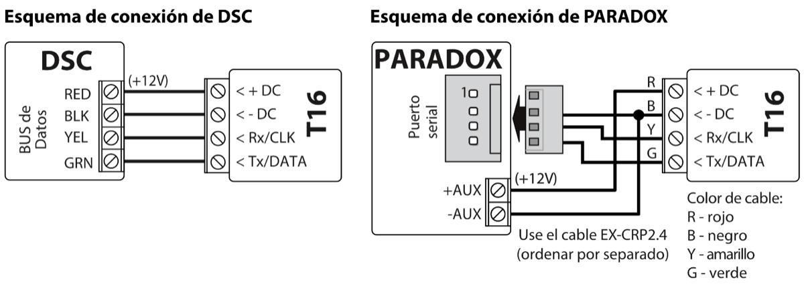

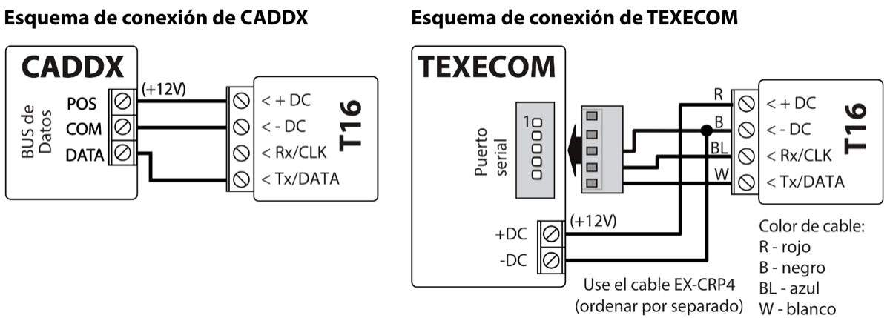

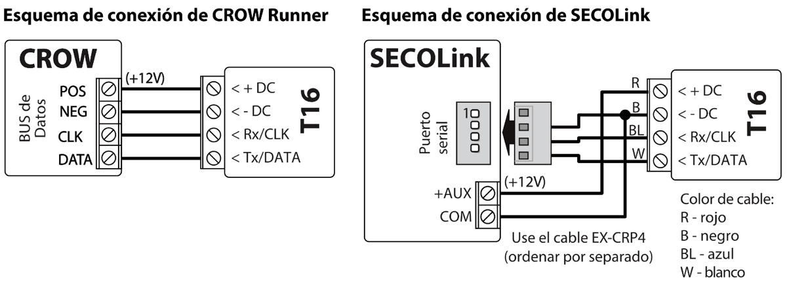

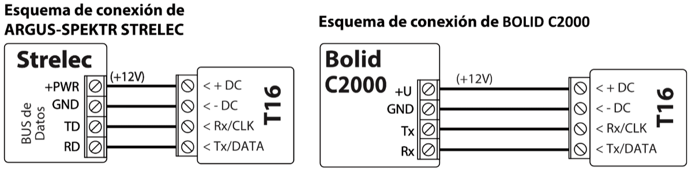

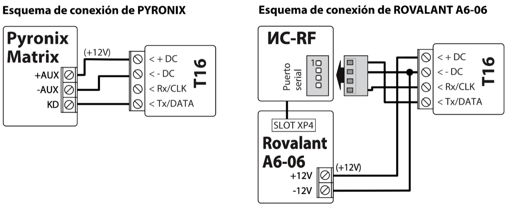

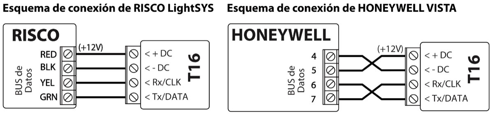

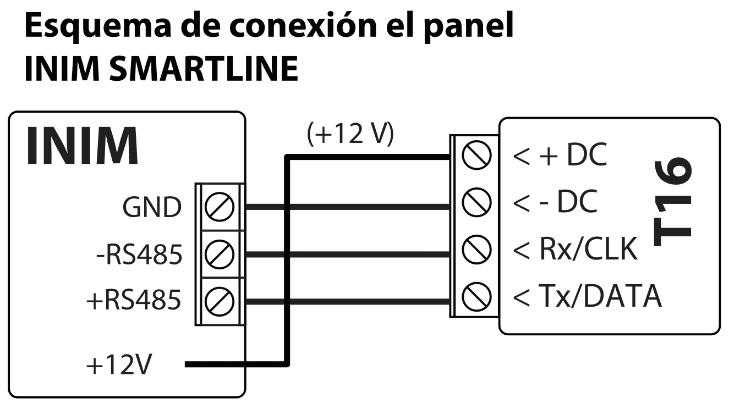

### Esquema para conectar el marcador de línea fija del panel de control

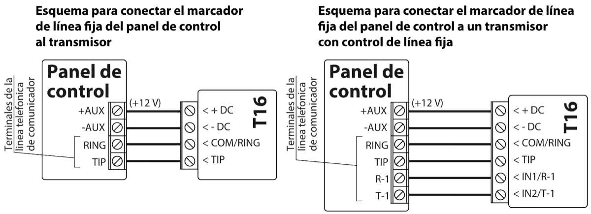

!!! note
    El *T16* no puede ser conectado a una línea telefónica fija. Refiriéndose a las instrucciones de programación del panel de control, configure los siguientes parámetros para el marcador de línea fija del panel de control:

- Introducir el número de identificación de 4 símbolos del panel de control (Número de cuenta, 0-9, A-F);

- Ingrese el número de receptor celular de 2 símbolos que el panel llamará cuando ocurra un evento (por ejemplo: 12). Si la regla de programación TLC del panel lo requiere, ingrese un símbolo de fin de número al final del número;

- Configure el método de retransmisión de mensajes a tonos DTMF;

- Establezca el protocolo Contact ID de transferencia de mensajes automático;

- Si desea transmitir mensajes especiales o el panel de control no tiene generación automática de códigos de Contact ID, ingrese los códigos de evento requeridos manualmente.

Forme un mensaje de panel y verifique el funcionamiento de la interfaz. El parpadeo del indicador de DATOS se mostrará cuando el transmisor esté leyendo los mensajes del panel.

Asegúrese de que el transmisor haya enviado correctamente todos los mensajes del panel de control que se formaron durante la prueba al destinatario seleccionado.

### Esquemas para conectar entradas

El transmisor tiene 6 (o 5) terminales de entrada (IN1, IN2, IN3, IN4, IN5, IN6) para conectar circuitos de tipo NO, NC, EOL. La configuración de fábrica para todas las entradas es de tipo NO. El tipo de circuito de entrada se puede cambiar en la TrikdisConfig ventana **Informes → Entradas**.

Esquemas para la conexión de circuitos tipo NO, NC, EOL:

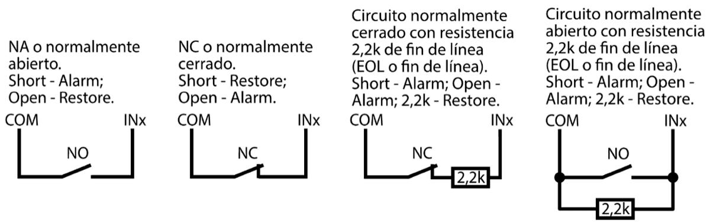

### Esquema para conectar PGM del panel de control

Las entradas del transmisor (IN) deben configurarse en NO o NC.

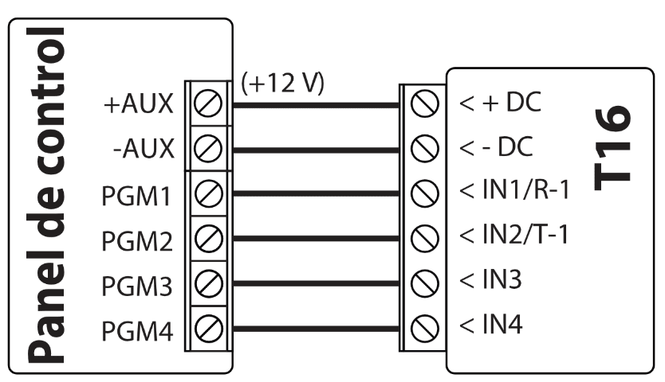

### Esquema para conectar una sirena

La sirena debe estar conectada cuando el *TM17* esté conectado al transmisor. Una sirena que consume hasta 1 A se puede conectar a la corriente de salida del transmisor OUT1 (o OUT2) *T16*. Se activa si una de las entradas del transmisor (IN) se activa en modo armado. La sirena se apaga después de 3 minutos o después de usar una tecla de contacto.

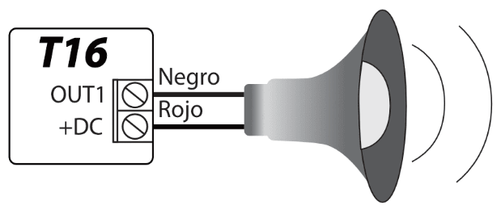

### Esquemas de conexión del módulo RS485

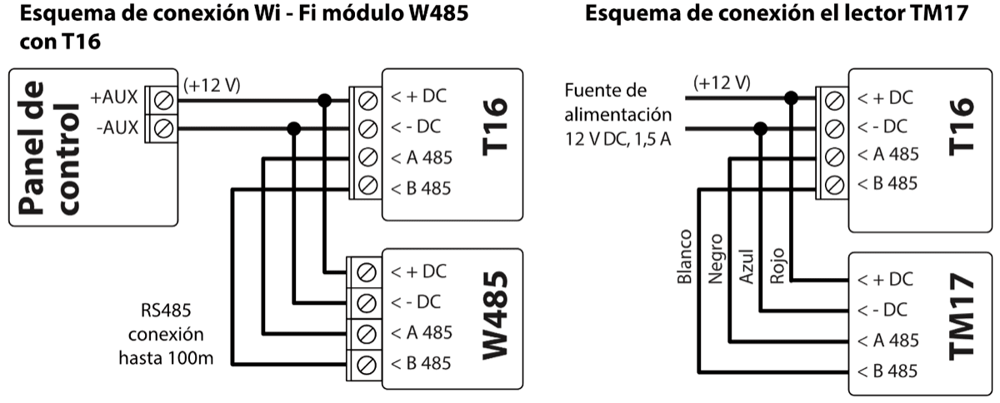

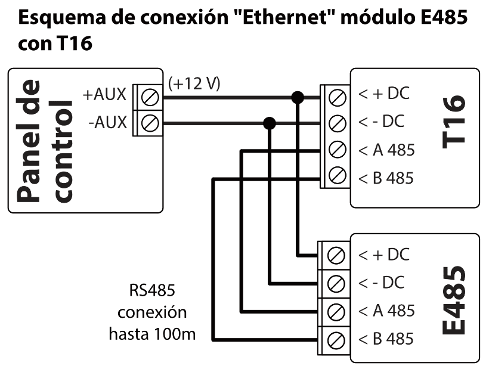

Cuando el bus de datos RS485 es más largo a 1m, use un cable de par trenzado (STP 4x2x0,5). Evite montar el cable en paralelo con los cables de electricidad de aires acondicionados, el cable de la antena u otras fuentes de campo electromagnético.

El módulo wifi W485 es compatible con el transmisor de radio T16. El *W485* envía mensajes de forma inalámbrica a través del enrutador de internet Wi-Fi al CRA (centro de recepción de alarmas).

El módulo E485 es compatible con el transmisor de radio T16. El *E485* envía mensajes a través de una red de computadoras cableada al CRA (сentro de recepción de alarmas).

## Configuración de parámetros con el software TrikdisConfig

1.  Descarga el software de configuración TrikdisConfig desde www.trikdis.com (puede encontrar el programa escribiendo ” TrikdisConfig ” en la barra de búsqueda) e instálelo.

2.  Retire la tapa frontal del T16 usando un destornillador de cabeza plana como se muestra a continuación:

1.  Conecte el T16 a una computadora usando un cable USB Mini-B.

2.  Inicie el programa de configuración TrikdisConfig. El programa reconocerá automáticamente el dispositivo conectado. Si es necesario, ingrese la clave de administrador o instalador en una ventana emergente y TrikdisConfig abrirá automáticamente la ventana de configuración de T16.

### Descripción de la barra de estado de TrikdisConfig

Una vez el T16 esté conectado al software TrikdisConfig, el programa mostrará información sobre el dispositivo conectado en la barra de estado:

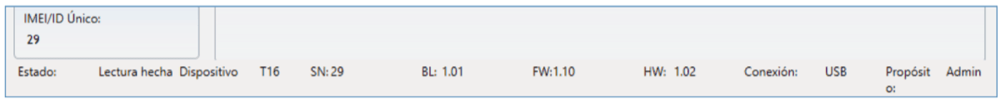

| Nombre | Descripción |
|:---|:---|
| Identificación única | Número de serie del dispositivo |
| Estado | Estado operacional |
| Dispositivo | Tipo de dispositivo (debe mostrar T16) |
| SN | Número de serie del dispositivo |
| BL | Versión del cargador de arranque |
| FW | Versión de firmware del dispositivo |
| HW | Versión de hardware del dispositivo |
| Estado | Tipo de conexión con el programa (vía USB o remoto) |
| Propósito | Nivel de acceso (se muestra después de que se aprueba el código de acceso) |

!!! note
    Haga clic en **Leer \[F4\]** para hacer que el programa lea y muestre las configuraciones que actualmente están guardadas en el dispositivo. / Haga clic en **Escribir \[F5\]** para guardar las configuraciones realizadas en el programa en el dispositivo. / Haga clic en **Guardar \[F9\]** para guardar la configuración en un archivo de configuración. Puede cargar la configuración guardada en otros dispositivos más tarde. Esto permite configurar rápidamente múltiples dispositivos con la misma configuración. / Haga clic en **Abrir \[F8\]** y elija un archivo de configuración para ver las configuraciones previamente guardadas. / Si desea volver a la configuración predeterminada, haga clic en el botón **Restaurar** en la parte inferior izquierda de la pantalla. Después de hacer clic en el botón Leer \[F4\], el programa leerá la configuración de la configuración actualmente guardado en el T16. Con TrikdisConfig, configure los parámetros requeridos usando las siguientes descripciones de la ventana del programa.

### Ventana „Principal“

**Pestaña “Ajustes”**

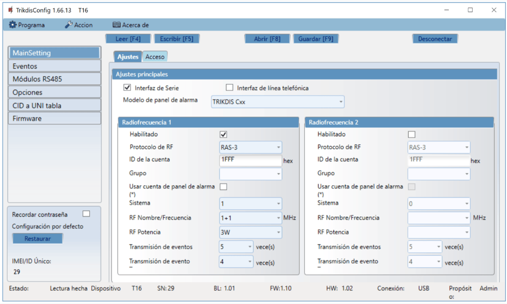

**Grupo de configuración “Ajustes principales”**

- **Interfaz de Serie –** marque la casilla para indicar que el T16 está conectado al puerto serie.

- **Interfaz de línea telefónica** **-** marque la casilla para indicar que el T16 está conectado al comunicador telefónico del panel de control.

- **Modelo de panel de alarma -** especifique el tipo de panel de control al que se conectará el transmisor.

**Grupo de configuraciones** **“Radiofrecuencia 1”**

- **Habilitado -** marque la casilla para encender el canal de radio del transmisor.

- **Protocolo de RF -** especifique el protocolo de radio que se utilizará (RAS-2M, RAS-3, LARS, LARS1, LARS_RAS2M, LARS1_RAS2M).

- **ID de la cuenta -** ingrese el número de identificación del usuario para los eventos internos y de panel enviados por el transmisor.

- **Grupo** - ingrese la identificación de usuario parcial (utilizada solo con el protocolo LARS RF).

- **Usar cuenta de panel de alarma -** marque la casilla y los eventos del panel de control se enviarán con la ID del panel de control. No todos los paneles permiten utilizar el número de identificación.

- **Sistema -** número de sistema de red de radio. Se utiliza para asignar objetos (usuarios) a grupos en una red de radio.

- **RF Nombre/Frecuencia -** el nombre de la frecuencia del canal de radio, se puede describir en la ventana **Opciones\> Radiofrecuencias disponibles**.

- **RF Potencia** - Elija la potencia del transmisor (1-5 W).

- **Transmisión de eventos** - ingrese la cantidad de veces que se repetirán las transmisiones de eventos (1-10 veces) (Recomendado dejar la configuración por defecto).

- **Transmisión de eventos Test -** ingrese cuantas veces repetir las transmisiones de prueba (1-10 veces) (Recomendado dejar la configuración por defecto).

**Grupo de configuraciones** **“Radiofrecuencia 2”**

Los ajustes son idénticos a **Radiofrecuencia** **1**.

**Pestaña “Accesso”**

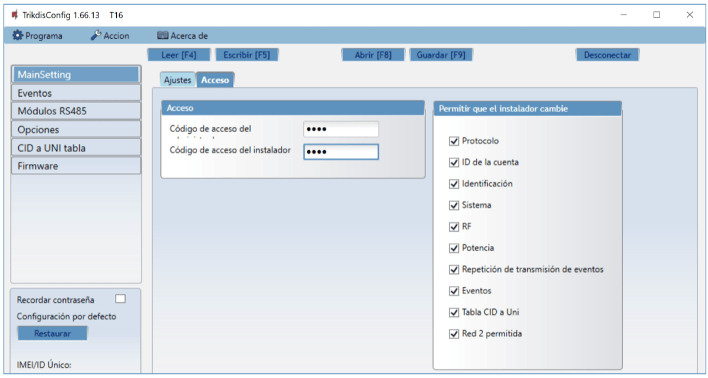

**Grupo de configuraciones “Accesso”**

Al configurar el **transmisor** **RF** T16 hay dos niveles de acceso para el administrador e instalador:

- **Código de acceso del administrador -** otorga acceso total a la configuración del transmisor. El código puede ser de hasta 6 símbolos de largo y se compone de números o caracteres latinos (código predeterminado - 1234).

- **Código de acceso del instalador** - otorga acceso limitado a la configuración del transmisor (código de fábrica - 1234).

**Grupo de configuraciones “Permitir que el instalador cambie”**

Administrador puede especificar que opciones pueden ser cambiadas por el instalador.

### Ventana de “Eventos”

**Pestaña “Entradas”**

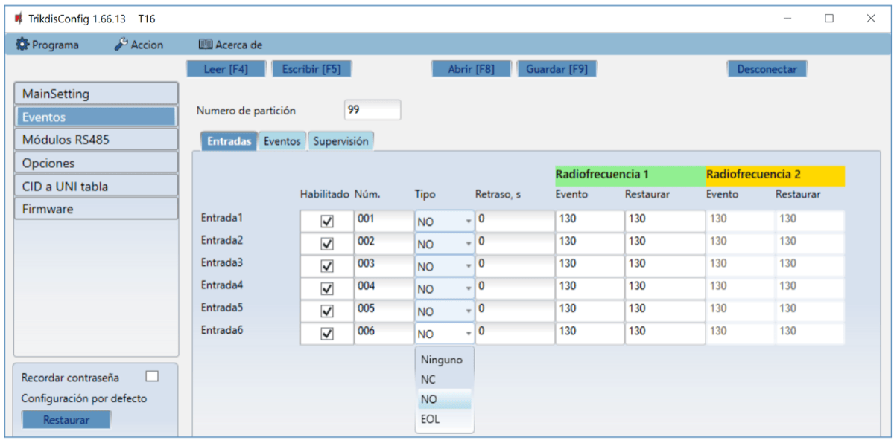

- **Habilitado -** marque la casilla para enviar eventos cuando la entrada se dispara.

- **Núm. -** asigna un número a la entrada.

- **Tipo -** especifique el tipo de entrada (NO, NC, EOL).

- **Retraso -** Tiempo de retardo de disparo de entrada(s)**.**

- **Evento** **F1** - código de evento enviado a través del primer canal de la emisora de radio (el código CID se establece automáticamente).

- **Restaurar** **F1** - código de restauración de evento enviado mediante el primer canal del transmisor de radio (el código CID se establece automáticamente).

- **Evento F2** - código de evento enviado usando el segundo canal del transmisor de radio (el código CID se establece automáticamente).

- **Restaurar** **F2 -** código de restauración de evento enviado mediante el segundo canal del transmisor de radio (el código CID se establece automáticamente).

**Pestaña “Eventos”**

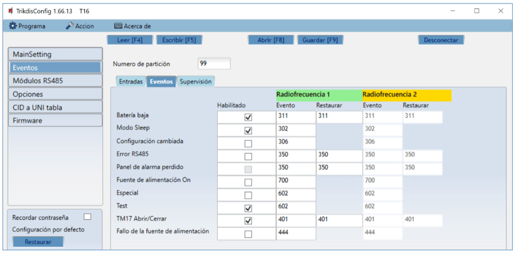

- **Habilitado -** marque la casilla para activar el envío de eventos internos:

  - **Batería baja -** fuente de electricidad inferior a 11,5 V.

  - **Modo Sleep -** fuente de electricidad inferior a 10 V.

  - **Configuración cambiada -** Cambio en la configuración del transmisor.

  - **Error** **RS485 -** problema con dispositivos conectados a la Bus RS485.

  - **Panel de alarma perdido -** perdida conexión entre transmisor y panel de control.

  - **Fuente de alimentaci**ó**n On -** El transmisor se ha encendido.

  - **Especial** - uso de código especial en la red de radio, cuando se usa un repetidor de señal de radio con los modos de “escucha” y “cancelación”.

  - **Test -** mensaje de prueba periódica.

  - **TM17 Abrir/Cerrar -** para enviar mensajes de Abrir/Cerrar cuando se utiliza el lector TM17.

  - **Fallo de la fuente de alimentación -** el evento de falla de la fuente de electricidad se envía cuando el voltaje del contacto es inferior a 11,5 V al enviar mensajes.

- **Radiofrecuencia 1** - códigos de eventos internos que se enviarán utilizando el primer canal de radio después de la activación y restauración del evento.

- **Radiofrecuencia 2** - Códigos de eventos internos que se enviarán utilizando el segundo canal de radio después del evento de activación y restauración.

**Pestaña “Supervisión”**

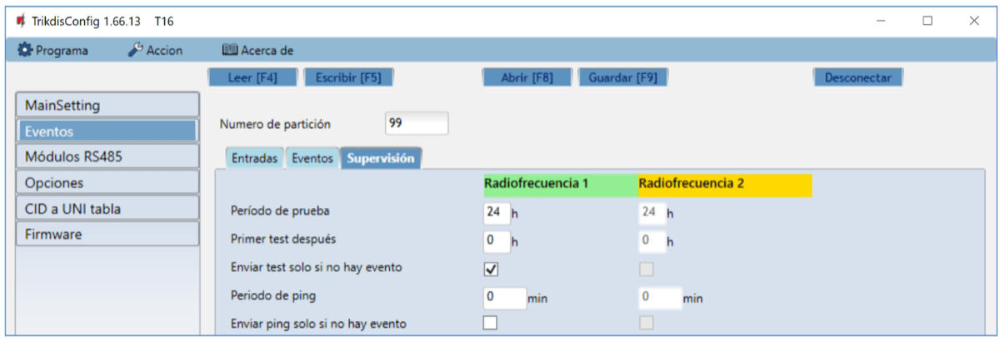

- **Período de prueba -** especifique el intervalo de tiempo entre dos mensajes de prueba utilizando los canales 1 y 2. El propósito de las pruebas periódicas es inspeccionar periódicamente la funcionalidad de los sistemas de radio. Un periodo de prueba típico es de 24 h. Se puede acortar hasta 1 hora. El software de monitoreo CRA rastrea automáticamente el mensaje de prueba. Se genera una advertencia si no hay mensajes de prueba del objeto.

- **Primer test después -** especifique el tiempo para retrasar el primer mensaje después de encenderlo. El objetivo es poder distribuir el envío de mensajes a lo largo del día (24 horas) para evitar sobrecargas en la red. Especificar tiempos para los canales 1 y 2.

- **Enviar test solo si no hay evento -** marque la casilla para enviar mensajes de prueba solo cuando no se estén enviando mensajes de evento.

- **Período de ping -** especifique el intervalo de tiempo para enviar las señales de silbido. El objetivo principal de los mensajes de silbido es monitorear el funcionamiento del equipo del objeto protegido. Los mensajes de silbido se generan en intervalos cortos (cada 5-10 minutos) y enviado. Los mensajes de silbido son monitoreados automáticamente por el receptor CRA. Es importante comprender que la red de radio debe utilizarse para transmitir mensajes sobre eventos, esto significa que los mensajes de silbido solo se pueden utilizar para los objetos protegidos más importantes de una red para evitar una sobrecarga de la red.

- **Enviar ping solo si no hay evento** - marque la casilla para enviar señales de silbido solo cuando no se estén enviando mensajes de evento.

### Ventana “Módulos RS485”

**Pestaña “Lista de módulos”**

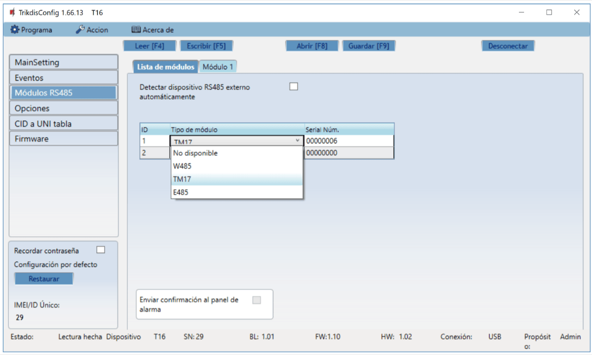

- **Detectar** **dispositivo** **externo** **RS485 automáticamente -** marque la casilla para habilitar la identificación automática de los módulos conectados al bus RS485.

- **Tipo de módulo -** seleccione el módulo conectado al bus RS485 del transmisor de la lista.

- **Serial Núm. -** especifique el número de serie del módulo conectado. Puede encontrar el número en una etiqueta en el módulo conectado o en su embalaje.

!!! note
    Solo puedes conectar uno de cada uno TM17 y Módulos W485(o E485) al transmisor T16. **Pestaña “Módulo 1”**

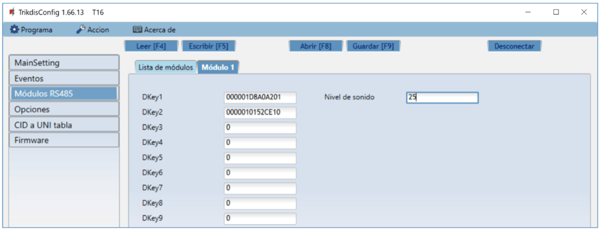

Es posible conectar un lector TM17 al transmisor T16. Después de conectar el lector TM17, el transmisor se puede utilizar como panel de control. Se pueden asignar hasta 9 teclas de contacto (iButton) al lector (una de las cuales es la “clave maestra”) para controlar el estado del sistema de seguridad (armado/desarmado).

- **Dkey** **1** **-** **Dkey** **9** - ingrese los números de identificación de las teclas de contacto (iButton).

- **Nivel de** **sonido -** ingrese el nivel de intensidad de la señal de audio del lector (de 0 a 100).

#### Registro de llaves de contacto (iButton)

1.  Si la lista de llaves de contacto está vacía, se agrega la primera llave del lector, se guarda en la primera línea de la lista y se convierte en la **llave Maestra**.

2.  Para activar el modo de registro de teclas de contacto, debe mantener presionada la **llave Maestra** contra el lector de llaves durante al menos 10 segundos. El indicador de “Estado” se apagará. Cuando se activa el modo de registro, el indicador LED en el lector TM17 comenzará a parpadear en verde y se reproducirá una señal de audio.

3.  Mantenga presionada la llave que desea registrar contra el lector. La señal de audio del lector se apagará. La llave ahora se agrega a la lista. Retire la llave del lector. El indicador verde del lector dejará de parpadear y se iluminará en verde continuo. Después de unos segundos, el lector sale automáticamente del modo de registro de llave. El indicador “Estado” se iluminará en verde y el LED verde del lector se apagará.

4.  Para agregar otra llave, ingrese nuevamente el modo de registro de llave.

5.  Para eliminar todas las llaves (incluida la llave Maestra), mantenga pulsada la **Llave Maestra** contra el lector por nada menos de 20s.

#### Uso del transmisor como panel de control

Después de conectar el TM17 lector, el transmisor se puede utilizar como panel de control. Los contactos de los sensores de seguridad se pueden conectar a las entradas del transmisor (IN1 - IN6). Si el módulo W485 (o E485) se conecta adicionalmente al transmisor RF, entonces el sistema de seguridad se puede controlar de forma remota a través de una red informática.

**Ajustes predeterminados de las entradas** **(IN)** **y salida** **(OUT)**

| Terminal | Descripción |
|:---|:---|
| IN 1 | Primera entrada de terminal, tipos seleccionables: NC, NO, EOL (2,2kΩ) (ajuste predeterminado NO). /​ Zona de entrada/​salida. Justo después de que el sistema de alarma está activado, la zona puede ser violada durante el tiempo de salida. Si la zona permanece violada después del tiempo de salida, se formará una señal de salida OUT1 y se enviará un mensaje. /​ Si se viola la zona cuando el sistema de alarma está armado, comienza el conteo del tiempo deentrada. Si el sistema de alarma no está desarmado durante este tiempo, se formará una señal de salida OUT1 y se enviará un mensaje. |
| IN2 (IN3, IN4, IN5, IN6) | Terminales de entrada 2 (3, 4, 5, 6), tipos seleccionables: NC, NO, EOL (2,2kΩ) (ajuste predeterminado NO). /​ Zona instantánea. Si se viola la zona cuando el sistema de alarma esté armado, se formará una señal de salida OUT1 (o OUT2) y se enviará un mensaje inmediatamente. |
| OUT1 /​ o | Terminal de salida, tipo colector abierto, corriente hasta 1 A. Para conectar una sirena. (T16V, T16U) |
| OUT2 | Terminal de salida, tipo colector abierto, corriente hasta 1 A. Para conectar una sirena. (T16U5) |

Los indicadores LED parpadeantes en el TM17 informan sobre las entradas activadas durante el tiempo que el sistema está armado. Cuando se desarma la alarma (manteniendo una llave en el lector), los indicadores no dejan de parpadear. Para detener el parpadeo de los indicadores, mantenga presionada la llave al lector nuevamente.

**Indicación LED de funcionamiento del** **lector *TM17***

| Indicador | Estado | Descripción |
|----|----|----|
| 1 (2, 3, 4, 5, 6) | Apagado | Zona no activada |
| 1 (2, 3, 4, 5, 6) | Rojo sin parpadeo | Zona activada |
| 1 (2, 3, 4, 5, 6) | Parpadeo rojo | La zona activada hizo que el sistema de seguridad se activara. |
| State / (Estado) | Verde sin parpadeo | El área de alarma de seguridad está desarmada. |
| State / (Estado) | Parpadeo verde | El conteo regresivo de salida se lleva a cabo |
| State / (Estado) | Rojo sin parpadeo | La zona de alarma de seguridad esta armada. |
| State / (Estado) | Parpadeo rojo | El tiempo de entrada se está contando |
| Trouble (Problema) | Apagado | No hay problemas operacionales |
| Trouble (Problema) | 9 parpadeos rojos | Problema con la conexión al módulo RS485 |

**Pestaña “W485”**

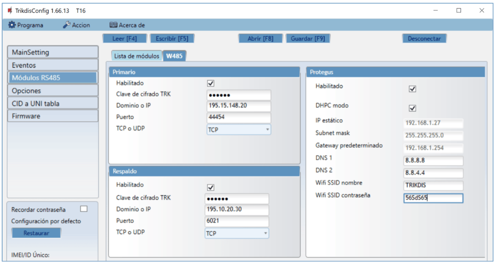

**Grupo de opciones de “Primario”**

- **Habilitado** - habilitar el canal principal de transferencia de mensajes.

- **Clave de cifrado TRK** – Ingrese la llave de encriptación que está establecida en el receptor.

- **Dominio o IP** – ingrese la dirección del dominio o IP del receptor.

- **Puerto** – ingrese el número del puerto de la red.

- **TCP o UDP** – seleccione en que protocolo (TCP o UDP) deberían ser enviados los eventos.

**Grupo de opciones de “Respaldo”**

Habilite el modo de respaldo de canal para enviar eventos a través de canales de respaldo si la conexión se ha perdido. Las opciones de los canales de respaldo son las mismas que las descritas arriba.

**Grupo de opciones de “Protegus”**

- **Habilitado** - marque la casilla para habilitar la mensajería a Protegus.

- **DHCP Modo** - modo del módulo WiFi para registrarse en la red (manual o automático).

- **IP estático** - dirección IP estática para cuando se establece el modo de registro manual.

- **Subnet mask** - máscara de subred para cuando se establece el modo de registro manual.

- **Gateway** **predeterminado** - dirección de Puerto de enlace para cuando se establece el modo de registro manual.

- **DNS1, DNS2** – (Sistema de Nombre de Dominio) identifica el servidor que especifica la dirección IP del dominio. Usada cuando el dominio está establecido en el campo de canal de comunicación de Dominio o IP (no dirección IP). Las opciones por defecto son direcciones de servidores DNS establecidas por Google.

- **WiFi SSID nombre** - nombre de la red WiFi a la que se conectará el W485.

- **WiFi SSID contraseña** - contraseña de red WiFi.

**Pestaña “E485”**

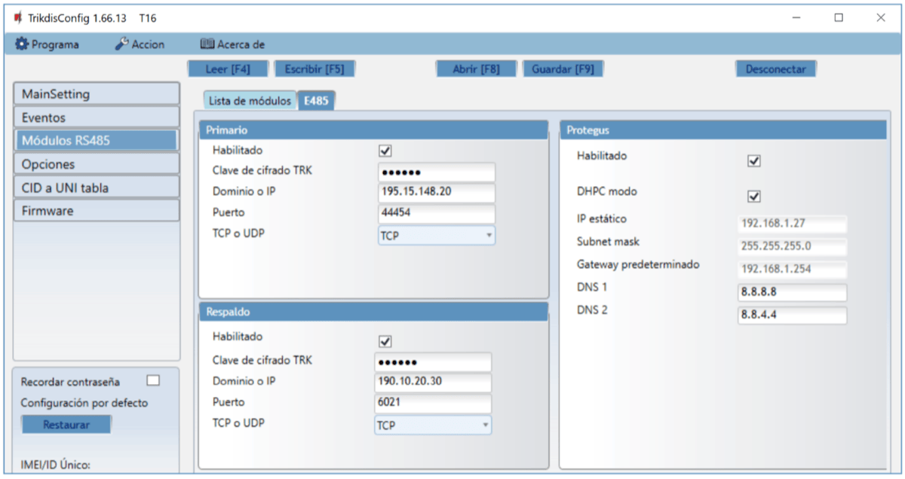

**Grupo de opciones de “Primario”**

- **Habilitado** - habilitar el canal principal de transferencia de mensajes.

- **Clave de cifrado TRK** – Ingrese la llave de encriptación que está establecida en el receptor.

- **Dominio o IP** – ingrese la dirección del dominio o IP del receptor.

- **Puerto** – ingrese el número del puerto de la red.

- **TCP o UDP** – seleccione en que protocolo (TCP o UDP) deberían ser enviados los eventos.

**Grupo de opciones de “Respaldo”**

Habilite el modo de respaldo de canal para enviar eventos a través de canales de respaldo si la conexión se ha perdido. Las opciones de los canales de respaldo son las mismas que las descritas arriba.

**Grupo de opciones de “Protegus”**

- **Habilitado** - marque la casilla para habilitar la mensajería a Protegus.

- **DHCP Modo** - modo del módulo ethernet para registrarse en la red (manual o automático).

- **IP estática** - dirección IP estática para cuando se establece el modo de registro manual.

- **Subnet mask** - máscara de subred para cuando se establece el modo de registro manual.

- **Gateway** **predeterminado** - dirección de Puerto de enlace para cuando se establece el modo de registro manual.

- **DNS1, DNS2** – (Sistema de Nombre de Dominio) identifica el servidor que especifica la dirección IP del dominio. Usada cuando el dominio está establecido en el campo de canal de comunicación de Dominio o IP (no dirección IP). Las opciones por defecto son direcciones de servidores DNS establecidas por Google.

### Ventana de “Opciones”

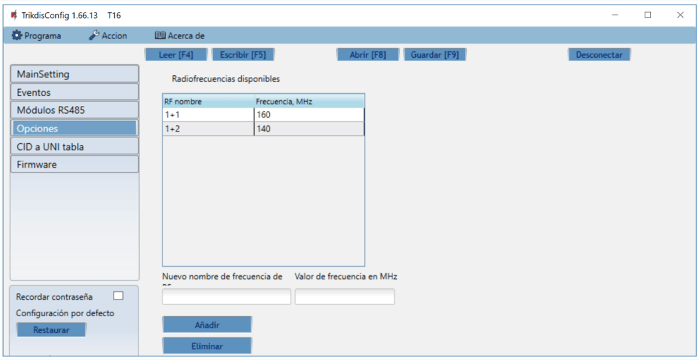

**Grupo de ajustes “Radiofrecuencias disponibles”**

Puede Añadir/Eliminar frecuencias de radio que el transmisor T16 puede usar para/de la lista. Las frecuencias de radio se dan “Nombres”.

### Ventana “CID a UNI tabla”

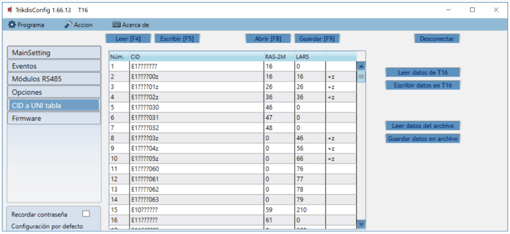

Los códigos de Contact ID recibidos desde el panel de control se convierten en códigos del sistema de radio (RAS2M, LARS). Solamente los mensajes de Contact ID descritos en la tabla (columna CID) se convierten a los códigos del sistema de radio y enviado al CRA. El símbolo “?” indica cualquier número en esta posición. El símbolo “z” significa que el número en la posición se agrega al código del sistema de radio principal. La tabla es editable, pero cámbiela de forma responsable y solo si es obligatorio hacerlo, porque si hay errores en la tabla, es posible que el sistema no funcione correctamente.

!!! note
    Después de terminar la configuración, haga clic en **Escribir** **\[F5\]**, espere a que se guarden los datos y desconecte el cable USB.

### Restauracion de la configuración de fabrica

Para restaurar la configuración de fábrica del **transmisor**, haga clic en el botón **Restaurar** en el programa TrikdisConfig.

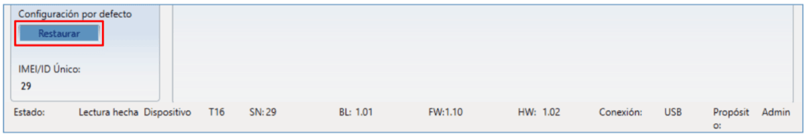

### Prueba del transmisor RF T16

Cuando la configuración y la instalación hayan finalizado, realice una comprobación del sistema:

1.  Compruebe si la corriente está encendida;

2.  Para probar las entradas del T16, habilítelas y asegúrese de que los mensajes correctos lleguen al receptor CRA;

3.  Realice una prueba de alarma para asegurarse de que los eventos del sistema de alarma son recibidos correctamente por el CRA (centro de recepción de alarma).

### Actualización de firmware

!!! note
    Después de conectar el T16 a TrikdisConfig, el programa ofrecerá automáticamente actualizar el firmware del dispositivo si hay actualizaciones disponibles. Esta función requiere una conexión a internet. / Si el software antivirus está instalado en su computadora, puede bloquear la función de actualización automática del firmware. En este caso, tendrá que reconfigurar su software antivirus. El firmware del T16 se puede actualizar o cambiar manualmente. Todos los ajustes anteriores del T16 permanecerán después de la actualización si la casilla **“Guardar configuraciones”** está marcada. Si el firmware se instala manualmente, se puede cambiar a una versión más nueva o más antigua. Realice estos pasos:

1.  Lanzamiento TrikdisConfig.

2.  Usando un cable USB Mini-B, conecte el T16 a un ordenador. Si hay disponible una versión más nueva del firmware, el programa ofrecerá automáticamente la instalación.

3.  Escoger **Firmware.**

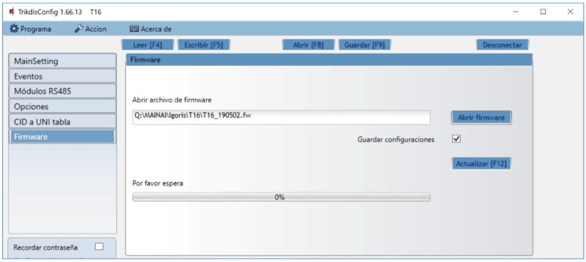

4.  Haga clic en el botón **Abrir firmware** y seleccione el archivo de firmware requerido. Si no tiene el archivo, los <u>usuarios registrados</u> pueden descargar el archivo de firmware más reciente desde www.trikdis.com, en la sección de descarga T16.

5.  Haga clic en el botón **Actualizar** **\[F12\]**.

6.  Espera a que se completen las actualizaciones.

## Precauciones de Seguridad

El transmisor T16 debe ser instalado y mantenido solo por personal calificado.

Lea este manual detenidamente antes de la instalación para evitar errores que puedan provocar un mal funcionamiento o incluso dañar el equipo.

Siempre desconecte la fuente de electricidad antes de hacer cualquier conexión eléctrica.

Cualquier cambio, modificación o reparación no autorizada por el fabricante anulará la garantía.

