# Celular panel de control CG17

  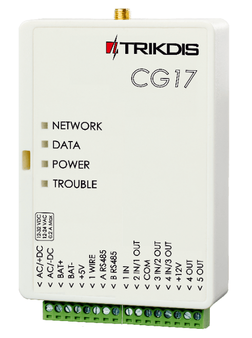

## Descripción 

CG17 es un panel de control multifuncional con un comunicador celular integrado. El panel de control le permite crear un sistema de 12 zonas cableadas o inalámbricas, divididas en 8 particiones.

Con el CG17 puede:

- Instalar un sistema de seguridad simple que pueda ser monitoreado y controlado remotamente.

- Controlar varios equipos de forma remota (por ejemplo, sistemas de calefacción y ventilación, puertas automáticas).

- Monitorear la temperatura, el nivel de combustible, nivel de voltaje DC u otros parámetros.

- Notificar a los usuarios sobre eventos.

- Enviar notificaciones de eventos al receptor de una empresa de seguridad.

**Características**

Envía eventos al receptor de una CRA:

- Envía eventos a los receptores de hardware o software TRIKDIS que funcionan con cualquier software de monitoreo.

- Puede enviar información de eventos a SIA DC-09 receptores.

- Supervisión de la conexión mediante sondeo al receptor de IP cada 30 segundos (o por período definido por el usuario).

- Canal de respaldo, que se utilizará si se pierde la conexión con el canal primario.

- Los eventos se pueden informar a la CRA con mensajes SMS. Se enviarán SMS incluso si la conexión de datos deja de funcionar en la red del operador móvil.

- Cuando el servicio *Protegus2* está habilitado, los eventos se envían primero a CRA, y solo luego se envían a los usuarios de la aplicación.

Funciona con la aplicación Protegus2:

- "Push" y notificaciones especiales de sonido que informan sobre eventos.

- Armado/Desarmado de forma remota.

- Control remoto de dispositivos conectados (luces, portones/barreras, sistemas de ventilación, calefacción, aspersores, etc.).

- Monitoreo remoto de temperatura (con expansores iO, iO-WL o iO-LORA).

- Diferentes derechos de usuario para administrador, instalador y usuario.

- Los usuarios también pueden ser informados sobre eventos con mensajes SMS y llamadas telefónicas.

**Notifica a los usuarios sobre eventos:**

- Llama a números de teléfono específicos (hasta 8 usuarios).

- Envía mensajes SMS sobre eventos.

- "Push" y notificaciones especiales de sonido de eventos utilizando la aplicación Protegus2.

**Sistema remoto y control de salida:**

- Usando la aplicación Protegus2.

- Usando el lector de teclas de contacto (iButton).

- Usando un lector RFID con teclado (Wiegand 26/34).

- Llamar al número de la tarjeta SIM instalada.

- Enviando mensajes SMS.

- Usando un algoritmo automático "*si... entonces*". Por ejemplo, cuando una entrada está habilitada o la temperatura excede un cierto límite, se activará una salida.

**Admite estos expansores:**

- Expansores cableados o inalámbricos de la serie iO, LORA, que aumentan el número de entradas (IN) y salidas (OUT).

- Receptor GPS (útil para proteger cajeros automáticos y máquinas expendedoras).

- Sensor de nivel de combustible. Para proteger tanques de combustible o monitorear el nivel de combustible.

- Energía de respaldo y carga de batería de 12 V.

**Entradas y salidas**

- 1 entrada, 2 salidas y 3 terminales I/O (Entrada/Salida) de doble propósito que se pueden configurar como terminales de entrada (IN) o salida controlable (OUT).

- Bus de datos "*1-Wire*" para conectar sensores de temperatura (hasta 8) y un lector de teclas de contacto (iButton).
- El número de entradas (IN) o salidas (OUT) se puede aumentar a 12 utilizando expansores cableados o inalámbricos de la serie iO, LORA.

**Instalación simple:**

- Configuración predeterminada para usar como panel de control o como comunicador.

- La configuración se puede guardar en un archivo y escribir rápidamente en otros dispositivos.

- Configuración utilizando un cable USB o de forma remota utilizando el software TrikdisConfig.

- Dos tipos de niveles de acceso (usuarios), para el instalador y para el administrador.

### Tipos de dispositivo 

Este manual se aplica a estos modelos CG17:

- CG17_12, CG17 panel de control con módem 2G.

- CG17_14, CG17_1E, CG17_1S, CG17 panel de control con módem 4G.

### Especificaciones

| Parámetro | Descripción |
|-----------|-------------|
| Frecuencias de módem GSM /​ GPRS | 850 /​ 900 /​ 1800 /​ 1900 MHz |
| Frecuencias de módem 4G: Europa America Latina | - Bandas LTE-FDD: B1/​B3/​B5/​B7/​B8/​B20/​B28 /​ - Bandas GSM: B2/​B3/​B5/​B8 /​ - Bandas LTE-FDD: B2/​B3/​B4/​B5/​B7/​B8/​B28/​B66 /​ - Bandas GSM: B2/​B3/​B5/​B8 |
| Voltaje de la fuente de alimentación | 16-24 V DC o 16-18 V AC |
| Consumo de Energía | Hasta 50 mA (en espera), /​ Hasta 200 mA (a corto plazo, transmitiendo) |
| Fuente de alimentación de respaldo [BAT] | Batería de plomo de 12 V - ácido |
| Corriente de carga de la batería | Hasta 500 mA |
| Tensión y corriente de alimentación para dispositivos externos [+12 V] | 12 V DC, hasta 1 A |
| Terminales de doble propósito [IN /​ OUT] | 3, se puede configurar como NC, NO, EOL = entradas de tipo 10 kΩ, EOL_T o salidas de tipo de colector abierto con corriente de hasta 100 mA |
| Numero de areas | 8 |
| Número de zonas | 4, (se puede ampliar a 12 zonas con expansores) |
| Número de salidas PGM | 2 (puede alcanzar a 5 si los terminales I/​O se configuran como salidas. Puede expandirse a 12 salidas con expansores) |
| 1-WIRE longitud del bus de datos | Hasta 30 m |
| Sensores de temperatura compatibles | Maxim®/​Dallas® DS18S20, DS18B20 |
| Número máximo de sensores de temperatura conectados al bus de datos 1-WIRE | 8 |
| Llaves de contacto compatibles (iButton) [1-WIRE] | Maxim®/​Dallas® DS1990A |
| Número máximo de llaves de contacto (iButton) | 12 |
| Longitud del bus de datos RS485 | Hasta 300 m |
| Número máximo de dispositivos conectados al bus de datos RS485 | 8 |
| Teclado compatible | Crow CR-16, Crow LCD, Crow touch keypad |
| Módulos soportados | iO-8 – módulo expansor;​ /​ iO – módulo expansor;​ /​ iO-MOD – iO-WL – Transmisor-receptor de ondas de radio;​ /​ iO-WL – módulo expansor inalámbrico;​ /​ RF-SH – receptor de ondas de radio para sensores inalámbricos;​ /​ E485 – módulo para conectarse a la red Ethernet;​ /​ W485 – módulo para conectarse a la red WiFi;​ /​ TM17 – lector iButton;​ /​ CZ-Dallas – lector iButton;​ /​ FLS - sensor de nivel de combustible Strela RS485;​ /​ iO-LORA - módulo expansor;​ /​ iO8-LORA - módulo expansor;​ /​ PB-LORA – botón de pánico;​ /​ REL-LORA – módulo expansor . |
| Capacidad de memoria intermedia | 60 eventos |
| Numero de canales de comunicacion | 2 (1er canal: principal, de respaldo;​ 2do canal: Protegus) |
| Reloj interno | Si |
| Canales de informes de eventos | GPRS o 4G, SMS |
| Comunicación con CRA | TCP/​IP o UDP/​IP, o SMS |
| Protocolos de comunicación | TRK, cifrado SIA DC-09_2007, SIA DC-09_2012, SIA DC-09_IPcom |
| Entorno de Operación | temperatura de -10°C a + 50°C, humedad relativa del aire hasta 80% a 0- + 20°C (sin condensación) |
| Dimensiones del Comunicador | 113x 70 x 25 mm |
| Peso | 0.10 kg |

### Tablero del panel de control 

1.  Antena GSM conector SMA.

2.  Luces Indicadoras.

3.  Ranura Frontal de Apertura de la Cubierta.

4.  Terminal para conexiones externas.

5.  Puerto USB Mini-B para la programación del panel de control.

6.  Ranura Tarjeta SIM.

### Propósito de las terminales 

| Terminal | Descripción |
|----------|-------------|
| AC /​ +DC | Terminal de fuente de alimentación (16-18 V AC o positivo 16-24 V DC) |
| AC /​ -DC | Terminal de fuente de alimentación (16-18 V AC o negativo 16-24 V DC) |
| BAT+ | Terminal positivo de la batería de respaldo de 12 V |
| BAT- | Terminal negativo de la batería de respaldo de 12 V |
| +5 V | Terminal positivo de alimentación de 5 V para dispositivos de “1-Wire” |
| 1 WIRE | Terminal de bus de datos de “1-Wire” |
| A 485 | Contacto RS485 para conectar la entrada iO o expansor de salida u otros aditamentos |
| 1 IN | 1er terminal de entrada (ajuste predeterminado "Entrada", tipo de zona EOL) |
| 2 I/​O | Terminal de entrada /​ salida: 2do terminal de entrada o terminal de salida de tipo OC. (configuración predeterminada "Interior", tipo de zona EOL) |
| COM | Común (negativo) |
| 3 I/​O | Terminal de entrada /​ salida: 3er terminal de entrada o terminal de salida de tipo OC. (configuración predeterminada "Instantáneo", tipo de zona EOL) |
| 4 I/​O | Terminal de entrada /​ salida: 4ta terminal de entrada o terminal de salida de tipo OC. (configuración predeterminada "Fuego", tipo de zona EOL) |
| +12 V | Terminal positivo de alimentación de 12 V para dispositivos externos |
| 5 OUT | Terminal de salida de tipo OC (configuración predeterminada "Sensor de Fuego reiniciado") |
| 6 OUT | Terminales de salida de tipo OC (configuración predeterminada "Sirena") |

### LED indicador de operación 

| Indicador | Estado de la luz | Descripción |
|-----------|------------------|-------------|
| NETWORK / (Red) | Verde sólido | Conectado a la red GSM |
| NETWORK / (Red) | Parpadeo amarillo | Indicación de la intensidad de la señal GSM de 0 a 5. La intensidad suficiente es 3 |
| DATA / (Datos) | Verde sólido | El mensaje esta siendo enviado |
| DATA / (Datos) | Sólido amarillo | Hay eventos no enviados en el búfer de datos |
| POWER / (Fuente de alimentación) | Parpadeo verde | La tensión de alimentación es suficiente |
| POWER / (Fuente de alimentación) | Parpadeo amarillo | La tensión de alimentación es insuficiente |
| POWER / (Fuente de alimentación) | Parpadeo verde y amarillo | El modo de configuración está activado |
| TROUBLE / (Problema) | Off | No problemas operativos |
| TROUBLE / (Problema) | 1 parpadeo | No tarjeta SIM |
| TROUBLE / (Problema) | 2 parpadeos | El código PIN de la tarjeta SIM es incorrecto |
| TROUBLE / (Problema) | 3 parpadeos | No se puede conectar a la red GSM |
| TROUBLE / (Problema) | 4 parpadeos | No se puede conectar al receptor IP usando el canal primario |
| TROUBLE / (Problema) | 5 parpadeos | No se puede conectar al receptor IP utilizando el canal de respaldo |
| TROUBLE / (Problema) | 6 parpadeos | El reloj interno del CG17 no está configurado |
| TROUBLE / (Problema) | 7 parpadeos | Voltaje de suministro de energía insuficiente del suministro de respaldo |
| TROUBLE / (Problema) | 8 parpadeos | Sin corriente alterna |
| TROUBLE / (Problema) | 9 parpadeos | Problemas con la conexión al módulo RS485 |

### Componentes necesarios para la instalación

Antes de comenzar la instalación, asegúrese de tener los componentes necesarios que puede solicitar a su distribuidor local.

## Configuración rápida con el software TrikdisConfig 

1.  Descargue el software de TrikdisConfig de [www.trikdis.com](http://www.trikdis.com) (en la barra de búsqueda ponga TrikdisConfig) e instálelo.

2.  Abra la cubierta del CG17 con el desatornillador de cabeza plana como se muestra a continuación:

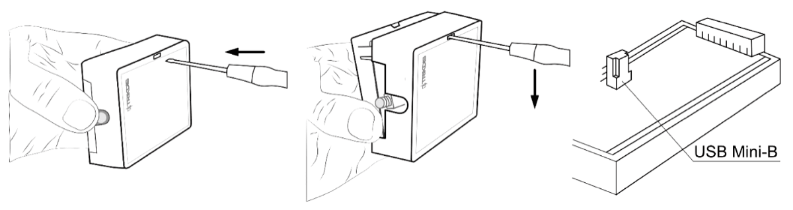

1.  Usando el cable USB mini-B conecte el CG17 a la computadora.

2.  Abra el programa de configuración de TrikdisConfig. El software reconocerá de forma automática el CG17 conectado y abrirá una ventana para su configuración.

3.  De clic en **Leer (F4)** para leer la información sobre los parámetros del CG17 e ingrese el código del Administrador o del Instalador en la ventana saliente.

A continuación, describimos qué configuraciones deben establecerse para que el CG17 comience a enviar eventos a la CRA y para permitir que el sistema de seguridad se controle por la app de Protegus2.

### Opciones de conexión para la app de Protegus2 

**En la ventana "Opción del sistema", pestaña "SIM":**

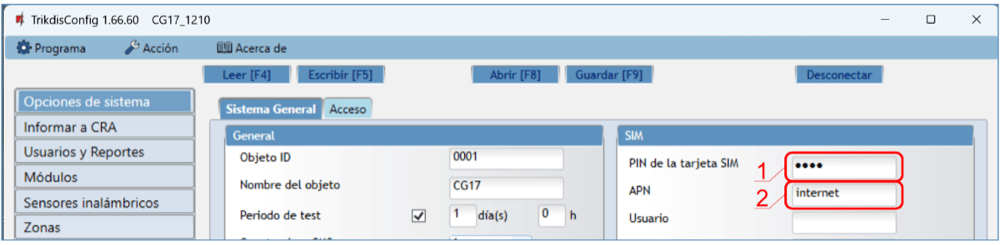

1.  Ingrese el código “**PIN de la tarjeta SIM**”.

2.  Cambiar el nombre de “**APN**”. Puede encontrar “**APN**” en el sitio web del operador de la tarjeta SIM ("internet" es universal y funciona en muchas redes de operadores).

**En la ventana "Usuarios y Reportes", pestaña "Servicio PROTEGUS":**

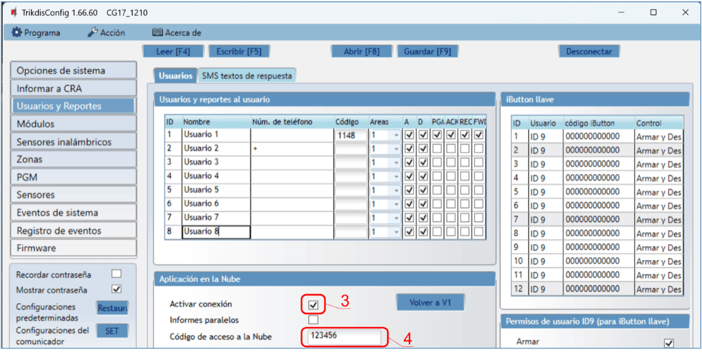

3. Habilitar la conexión a la Servicio Protegus.

2.  Cambie el “**Código de acceso a la Nube**” para iniciar sesión con Protegus2 si usted desea que los usuarios requieran ingresarlo cuando se agrega el sistema a la app Protegus2 (contraseña por defecto – 123456).

Cuando termine con la configuración, de clic en **Escribir [F5]** y desconecte el cable USB.

!!! note
    Para obtener más información sobre otras configuraciones de CG17
    en TrikdisConfig, consulte el capítulo 4 „Descripción de la
    ventana de TrikdisConfig".
### Configuración para conectarse con el CRA 

**En la ventana de “Opciones de sistema”:**

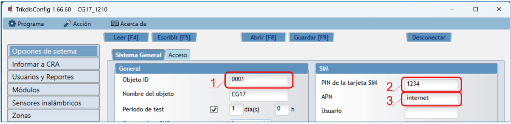

1.  Ingrese el número de ID de objeto provisto por la CRA (4 caracteres, 0-9, A-F. **No utilice números de objeto FFFE, FFFF.**).

2.  Ingrese el código “**PIN de la tarjeta SIM**”.

3.  Cambiar el nombre de “**APN**”. Puede encontrar “**APN**” en el sitio web del operador de la tarjeta SIM ("internet" es universal y funciona en muchas redes de operadores).

**En la configuración de la ventana "Informar a CRA" para "Canal principal":**

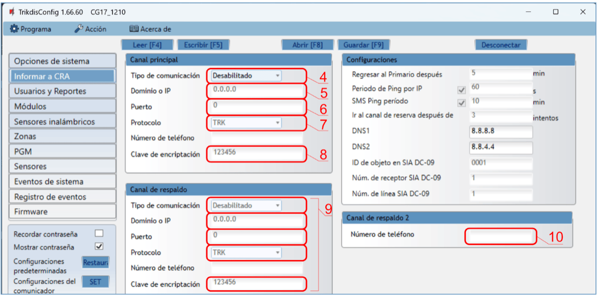

4. **Tipo de comunicación** - seleccione el método de conexión IP (No recomendamos SMS como el canal primario).

2.  **Dominio o IP** - ingrese la dirección del Dominio o IP del receptor.

3.  **Puerto** - ingrese el número de puerto de la red del receptor.

4.  **Protocolo** - seleccione el tipo de protocolo para mensajes de evento: **TRK** (para los receptores de TRIKDIS), **DC-09_2007, DC-09_2012** o **DC-09_IPcom** (a receptores universales).

5.  **Clave de encriptación** - Ingrese la llave de encriptación que está establecida en el receptor.

!!! note
    Si quiere que la comunicación con CRA sea establecida a través de
    mensajes SMS, sólo necesita establecer la llave de "**Encriptación**" y
    el "**Número de Teléfono**". Los mensajes SMS pueden ser recibidos por
    los receptores TRIKDIS, receptor IP/SMS RL14 y recibidor SMS
    GM14. / SI usted seleccione el protocolo **DC-09**, adicionalmente
    en la pestaña de "**Opciones**" ingrese los números del objeto, línea y
    receptor.
1.  (Recomendado) Configurar ajustes de “**Canal de respaldo**”**.**

2.  (Recomendado) Ingrese el número de informe de SMS del “**Canal de respaldo 2**”.

    Cuando termine con la configuración, de clic en **Escribir [F5]** y desconecte el cable USB.

!!! note
    Para obtener más información sobre otras configuraciones de CG17
    en TrikdisConfig, consulte el capítulo 4 „Descripción de la
    ventana de TrikdisConfig".
## Instalación y cableado 

### Proceso de instalación

1.  Antes de comenzar, asegúrese de que el nivel de señal GSM sea suficiente en el lugar donde se montará el *CG17*.

2.  Retire la cubierta superior y extraiga la terminal de contacto.

3.  Retire la placa PCB.

4.  Fije la base de la carcasa en el lugar deseado con tornillos.

5.  Coloque la placa PCB de nuevo en la caja, inserte terminal de contacto.

6.  Atornille la antena celular.

7.  Inserte la tarjeta nano-SIM. La tarjeta SIM ya debe estar activada en la red GSM y todos los servicios requeridos deben estar habilitados, es decir, la tarjeta debe poder llamar, enviar y recibir mensajes SMS, usar Internet móvil. Pregunte al operador de red móvil de su tarjeta SIM cómo habilitar los servicios requeridos.

!!! note
    Cheque si la tarjeta SIM ha sido activada. / Asegúrese de que el
    servicio de Internet móvil esté activado si se utilizará la conexión a
    través del canal IP. / Para evitar ingresar el código PIN en
    TrikdisConfig, inserte la tarjeta SIM en su celular y apague la
    función de petición de PIN.
8. Si desea poder configurar el CG17 de forma remota, inserte una tarjeta SIM con solicitudes de código PIN deshabilitadas. Envíe un mensaje SMS: **CONNECT 123456 PROTEGUS=ON,APN=INTERNET**

2.  La configuración remota se describe en el capítulo 5.5 "Configuración de parámetros de forma remota".

3.  Cierre la cubierta superior.

### Diagramas para la conexión de entrada 

El *CG17* tiene cuatro entradas IN para conectar varios sensores del sistema de alarma. Posibles formas de conectar un sensor: NO - contacto normalmente abierto; NC - contacto normalmente cerrado; EOL - circuito normalmente cerrado con una resistencia de final de línea de 10 kΩ; EOL_T - normalmente cerrado con resistencia de fin de línea, con reconocimiento de sabotaje y falla de cable.

#### Configuración de fábrica de las zonas (entradas)

| Zona  | Descripción                                                       |
|-------|-------------------------------------------------------------------|
| 1 IN  | Configuración por defecto “Entrada”, tipo de zona EOL, Área 1     |
| 2 I/​O | Configuración por defecto “Interior”, tipo de zona EOL, Área 1    |
| 3 I/​O | Configuración por defecto “Instantaneo”, tipo de zona EOL, Área 1 |
| 4 I/​O | Configuración por defecto “Fuego”, tipo de zona EOL, Área 1       |

El cambio de configuración de zonas, la asignación de particiones se describen en la sección 4.7 “Ventana “Zonas””.

Posibles esquemas de conexión:

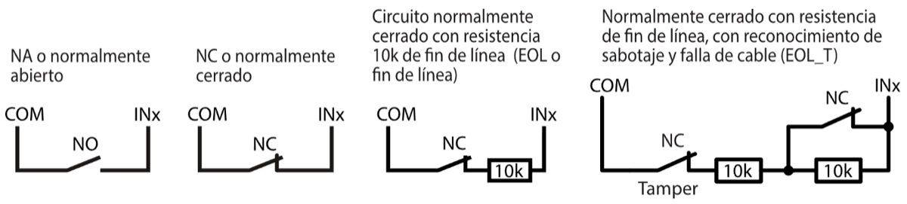

### Esquemas para conectar un detector de humo

Asigne una salida PGM a la función “**Sensor de fueg reiniciado**” (consulte la ventana TrikdisConfig “PGM” -> pestaña “Salidas”) para que el detector de humo pueda reiniciarse después de una alarma.

- **Conexión de un detector de humo de cuatro cables**

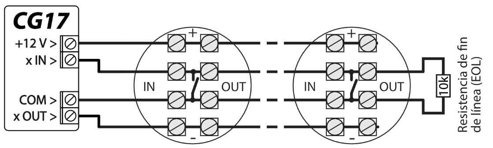

- **Conexión de un detector de humo de dos cables**

1)  usando una zona EOL (o NC, sin resistencia).

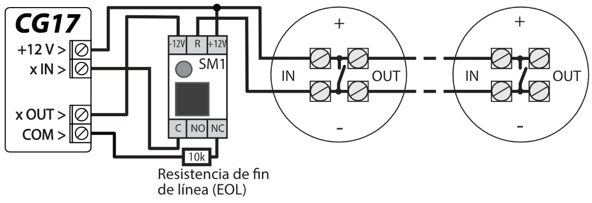

1)  usando una zona EOL (o NO, sin resistencia).

\* SM1: un módulo de compatibilidad creado por Trikdis que permite reiniciar de forma remota un detector de humo de dos cables después de una alarma activada.

### Esquemas para conectar un sensor de temperatura 

- Los sensores de temperatura deben conectarse de acuerdo con el esquema dado. Los sensores de temperatura Maxim® / Dallas® DS18S20, DS18B20 (hasta 8 unidades) se pueden conectar al *CG17*.

- Si el cable que conecta el sensor de temperatura es superior a 0,5 m, recomendamos utilizar un cable de par trenzado (UTP4x2x0,5 o STP4x2x0,5).

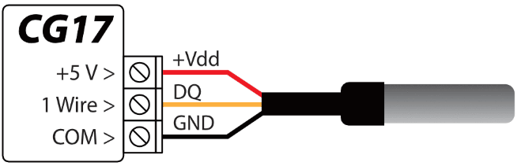

Color de cable:

**Rojo** - **Vdd**, conéctelo al terminal de “+5 V”;

**Amarillo** - **DQ**, conéctelo al terminal de “1-Wire”;

**Negro** - **GND**, conéctelo al terminal “COM”.

### Esquemas para conectar un relé y un LED 

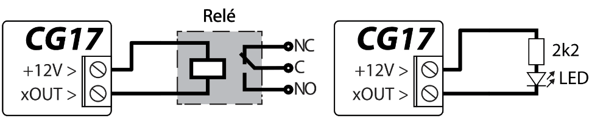

### Esquemas para conectar lectores de clave de contacto 

El lector TM17 debe estar conectado al CG17 utilizando un bus de datos RS485. La longitud del cable de un bus de datos RS485 puede ser de hasta 100 m. Se pueden conectar hasta ocho lectores TM17 al CG17.

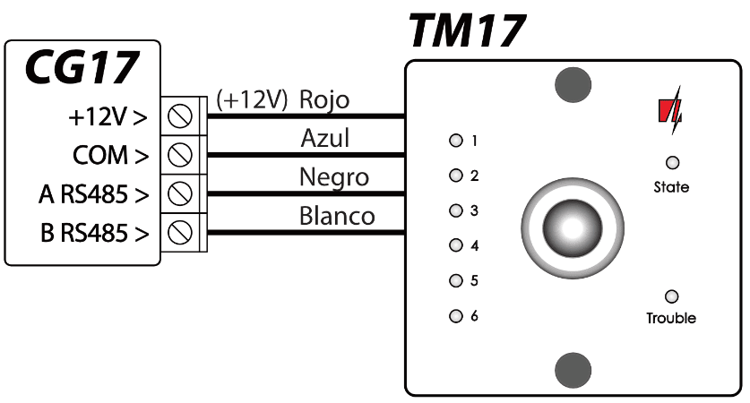

El lector de llaves **iButton** debe estar conectado al CG17 utilizando el puerto "1-Wire". La longitud del cable puede ser de hasta 30 m.

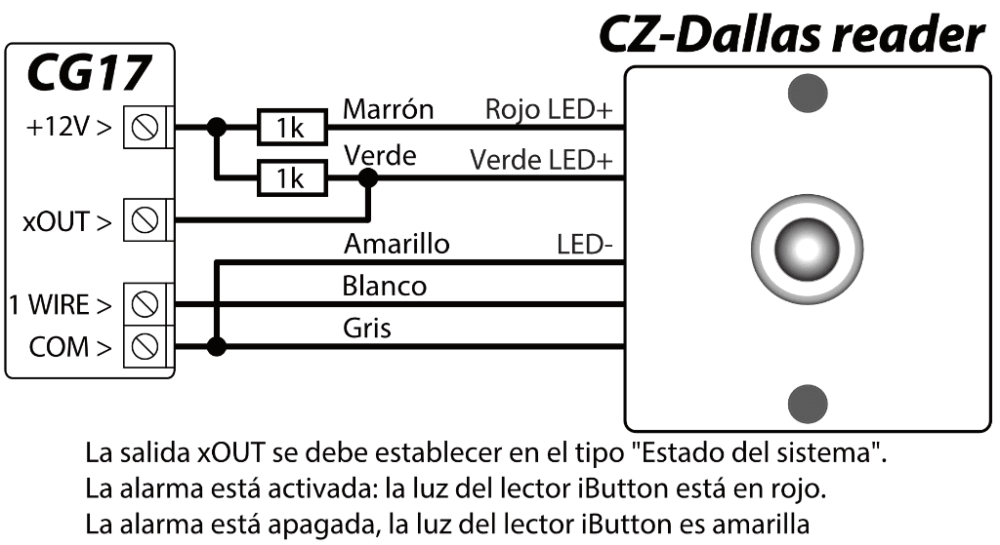

!!! note
    La vinculación de la llave electrónica al CG17 se describe en el
    capítulo 4.4.1 "Registro de llaves de contacto (iButton)".
### Esquema para conectar un sensor inalámbrico transceptor RF-SH 

El transceptor *RF-SH* con sensor inalámbrico está diseñado para trabajar con dispositivos inalámbricos (sensores de movimiento, contactos magnéticos, sirena, controles remotos, etc.). Se puede conectar un receptor *RF-SH* al *CG17*.

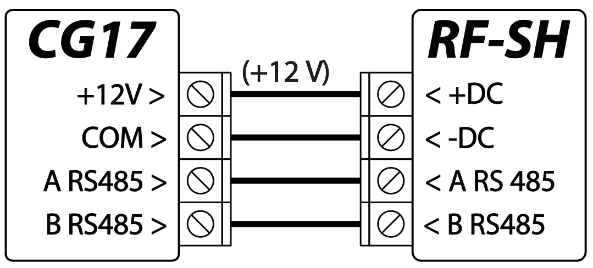

### Esquemas para conectar módulos expansores de la serie iO 

Si el panel de control CG17 necesita tener más entradas IN o salidas OUT, conecte un expansor de entrada y salida TRIKDIS serie iO cableado o inalámbrico. La configuración CG17 para módulos de expansión se describe en el capítulo 4.5 “Ventana “Módulos”. Se pueden conectar hasta ocho módulos de expansión iO-8 al CG17. El módulo iO-8 puede utilizar todas o solo algunas zonas. El número total de zonas CG17 es de 12 unidades.

  <figure style="margin: 0;">
    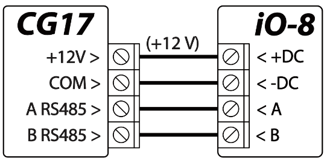
  </figure>
  <figure style="margin: 0;">
    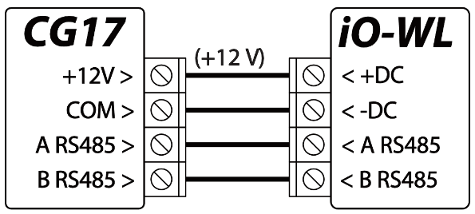
  </figure>

### Esquemas para conectar el teclado Crow CR-16 

Se pueden conectar hasta 8 teclados (Crow CR-16 Runner, Crow LCD Runner, Crow Touch Runner o Crow CR-16 PowerWave) al *CG17*. En *TrikdisConfig*, cabe señalar que se utilizará el teclado Crow (consulte el capítulo 4.2 "Ventana de" Opciones de sistema ").

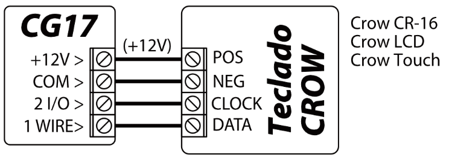

### Esquemas para conectar una sirena 

- Se puede conectar una sirena que consume hasta 1 A de corriente a la salida 5 OUT o la salida 6 OUT.

- Se puede conectar una sirena que consume hasta 100 mA de corriente a cualquier salida OUT.

- La salida OUT debe tener asignada la función "Sirena" y debe tener un área de sistema de seguridad establecida.

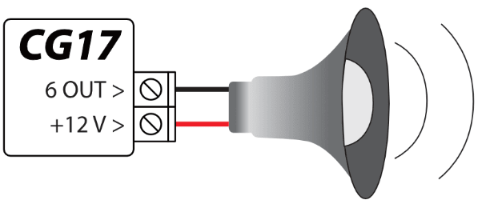

### Esquemas para conectar módulos de extensión de la serie iO 

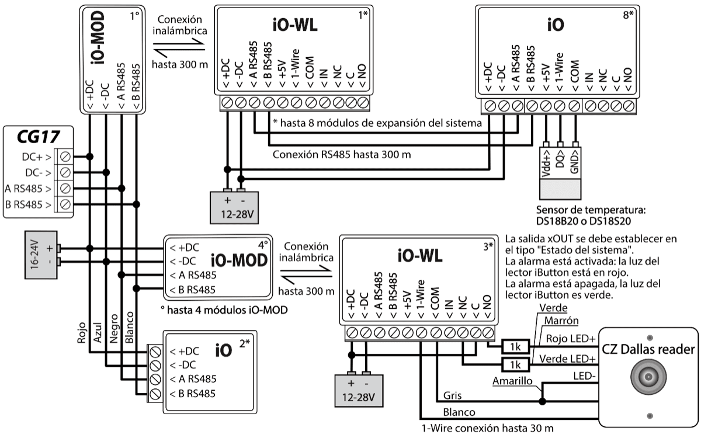

**Nota:**

- Si el cable que conecta el sensor de temperatura mide más de 0,5 m, se recomienda utilizar un cable de par trenzado (UTP4x2x0.5 o STP4x2x0.5).

- A un CG17 puede conectar:

  - Hasta cuatro módulos iO-MOD.

  - Hasta ocho módulos iO o/y iO-WL.

- Los lectores **iButton** y los sensores de temperatura deben conectarse al terminal de “*1-Wire*”.

### Esquemas para la conexión del sensor de nivel de combustible Strela RS485 

Se puede conectar un sensor de combustible „STRELA S485” al CG17. Cuando el sensor de combustible está conectado, los otros módulos de expansión (iO-8, iO, iO-WL, RF-SH, TM17, E485, W485, iO-LORA, iO8-LORA, PB-LORA, REL-LORA) no se conectan al CG17.

Configuración y preparación del sensor de nivel de combustible para trabajar con el CG17

Es obligatorio calibrar el sensor de nivel de combustible "STRELA S485" (<http://strela-fls.com/products/fuel_level_sensors_strela.html>) utilizando la “DUTConfig” (<http://strela-fls.com/programs.html>) del software de calibración del fabricante y especificar la capacidad del tanque de combustible - de lo contrario, las mediciones del sensor pueden ser imprecisas.

1.  Conecte el sensor de nivel de combustible a una computadora con un adaptador de programación. Presione el botón "marrón" en el adaptador para que se ilumine el indicador verde en la sección UART RS-485.

2.  Inicie el programa “**DUTConfig**”. Elija “**Interface sensor**”.

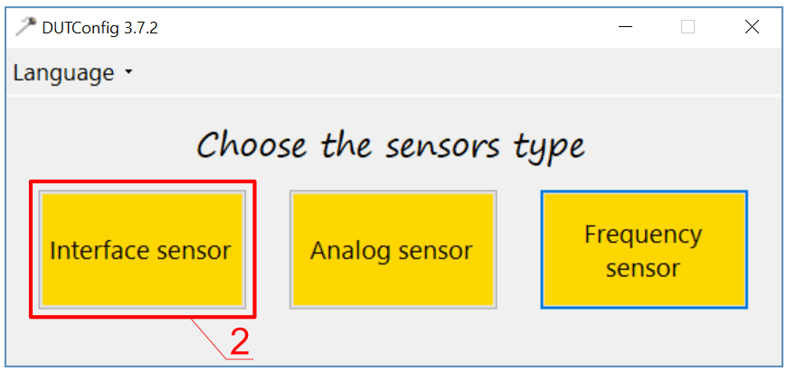

3. Establezca el modo "**View**" "**Standart**".

2.  Haga clic en "**Connect**" y espere.

    

3.  Cuando el sensor está conectado a “DUTConfig”, aparece un cuadro "**Connection: on**".

    

4.  Haga clic en el botón "**Edit**" y calibre el sensor en los modos de tanque lleno y vacío.

5.  Calibración en condiciones reales: a) El tanque de combustible está lleno y el sensor está dentro del tanque de combustible: haga clic en el botón “**Full tank**”; b) El tanque de combustible está vacío, cuando el sensor se retira del tanque de combustible - haga clic en el botón “**Empty tank**”.

6.  Haga clic en el botón "**OK**" para guardar los valores.

    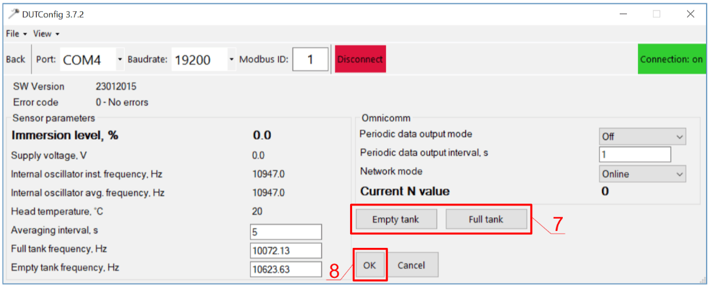

7.  Cambia el modo "**View**" a "**Extended**".

10. Complete la tabla de acuerdo con la forma del tanque de combustible. Método simple: simplemente configure 0% de inmersión como 0 litros y 100% de inmersión como la capacidad de su tanque de combustible (el tanque de combustible en el ejemplo tiene una capacidad de 200 l).

11. Una vez que haya terminado de completar la tabla, haga clic en "**OK**".

12. Haz clic en el botón “**Disconnect**”.

13. Desconecte el sensor de nivel de combustible y conéctelo al CG17.

### Esquemas para conectar una batería 

Se puede conectar una batería de 12 V al CG17. Si se pierde la alimentación de AC, se enviará un mensaje de evento "Falla de AC" y el CG17 cambiará automáticamente a la batería de 12 V.

- Cuando el voltaje de la batería cae a 11.5 V, se enviará un mensaje de evento "Batería baja".

- Cuando el voltaje de la batería cae por debajo de 9,5 V, si no hay alimentación de AC, el CG17 se apagará.

- Cuando se restablece la alimentación de AC, se enviará un mensaje de evento "Restauración de AC" y el proceso de carga de la batería se iniciará automáticamente.

- Cuando el voltaje de la batería aumenta a 12,6 V, se enviará un mensaje de evento "Restauración de la batería”.

**Conectar la batería:**

- Inserte la batería de respaldo en la carcasa.

- Conecte los cables de la batería a los contactos BAT +/ BAT– de la fuente de energía de respaldo del *CG17*.

- Verifique que la corriente de carga del *CG17* sea suficiente para cargar la batería.

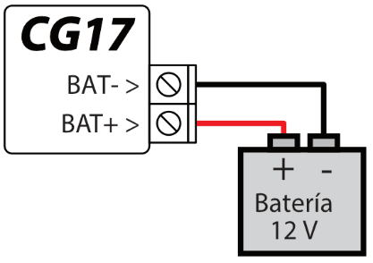

### Esquema para conectar el CG17 a un panel de control de seguridad 

*CG17* funciona en modo comunicador. El tipo de entrada de *CG17* debe establecerse en NO ir NC y la definición "24\_ horas". / Las entradas *CG17* podrían describirse con mensajes de texto SMS que el usuario recibirá cuando las entradas sean de evento / restauración. / Las salidas PGM del panel de control deben asignarse a eventos específicos.

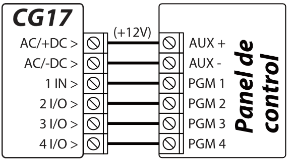

### Medida de tensión con CG17 

El *CG17* se puede utilizar para medir voltaje DC. Se pueden seleccionar cuatro entradas de CG17 1IN, 2IN, 3IN, 4IN para medición de voltaje. Se mide el voltaje de 0 V a 30 V (exceder los 30 V causará daños al panel de control *CG17*). La tensión medida debe conectarse a los terminales “1IN” y “COM”. “1IN” - terminal positivo. “COM’’ - terminal negativo.

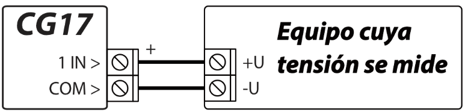

Conecte el CG17 a una computadora con un cable USB Mini-B. Ejecute TrikdisConfig. El software reconocerá automáticamente el CG17 conectado y abrirá una ventana para la configuración. En la ventana “**Sensor**”, especifique el “**In1 Voltaje**” y también especifique la cantidad de voltaje por encima de la cual se generará un mensaje.

- **Máximo** - cuando el voltaje es superior a este ajuste, se generará un mensaje de evento. Para que se genere un mensaje de evento, la casilla “**Alta**” debe estar marcada.

- **Mínimo** - cuando el voltaje es menor que este ajuste, se generará un mensaje de evento. Para que se genere un mensaje de evento, la casilla “**Baja**” debe estar marcada.

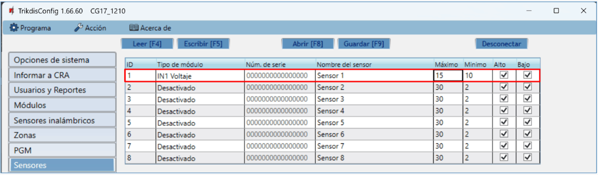

La salida PGM se puede controlar cuando se mide un voltaje por encima de un valor establecido o por debajo de un valor establecido. En TrikdisConfig, debe seleccionar la salida PGM y configurarla en el modo de funcionamiento del “**Control remoto**”.

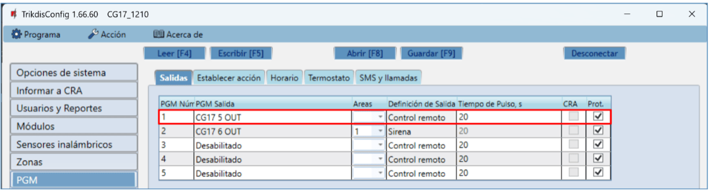

Vaya a la pestaña “**Establecer acción**”.

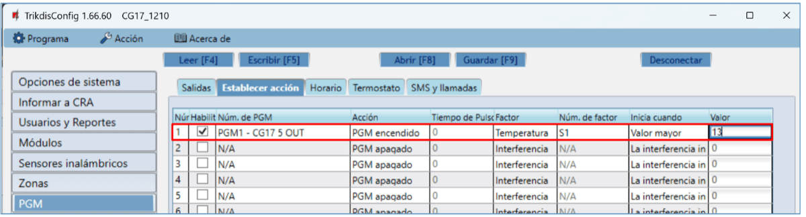

- **Habilitar** – habilita la PGM.

- **Núm. de PGM** – especificar la salida PGM que será controlada por la entrada “1IN”.

- **Acción** - establecer el modo de funcionamiento de la salida PGM:
- **PGM apagado** – desactivar la salida PGM.

- **PGM encendido** – habilitar salida PGM.

- **Pulse apagado** – habilite la salida OUT durante la duración del pulso (después de recibir un comando, la salida se activa durante la duración del pulso y luego se apaga)**.**

- **Pulse encendido** – apagando la salida OUT durante la duración del pulso (después de recibir un comando, la salida se apaga durante la duración del pulso y luego se enciende).
- **Tiempo de Pulso, s** – establecer la duración del pulso de operacion (0-9999 segundos).
- **Factor - Temperatura** establecida.

- **Núm. de Factor** – asigne una entrada de medición de voltaje 1IN.

- **Inicia cuando** - establecer una condición adicional para la activación de la salida PGM.
- **Valor** – - especifique el voltaje (V) que el controlador monitoreará y controlará la salida PGM.

### Esquema para conectar el módulo WiFi W485 

El módulo *W485* envía mensajes al CRA (Centro de Recepción de Alarmas) y a *Protegus2* utilizando un enrutador de Internet WiFi. Cuando la conectividad WiFi está disponible, el *CG17* envía mensajes de evento a través del módulo *W485*. Cuando se interrumpe la conectividad WiFi, el *CG17* envía mensajes a través de GPRS. Cuando se restablece la conectividad WiFi, el *CG17* vuelve a enviar mensajes a través de *W485*. / La configuración *W485* (credenciales de red Wi-Fi) se establece en la configuración *CG17* en la ventana TrikdisConfig ”Módulos” del capítulo 4.5. / No necesita una tarjeta SIM cuando utiliza el *W485* con el panel de seguridad *CG17*. / Se puede conectar un módulo *W485* al *CG17*.

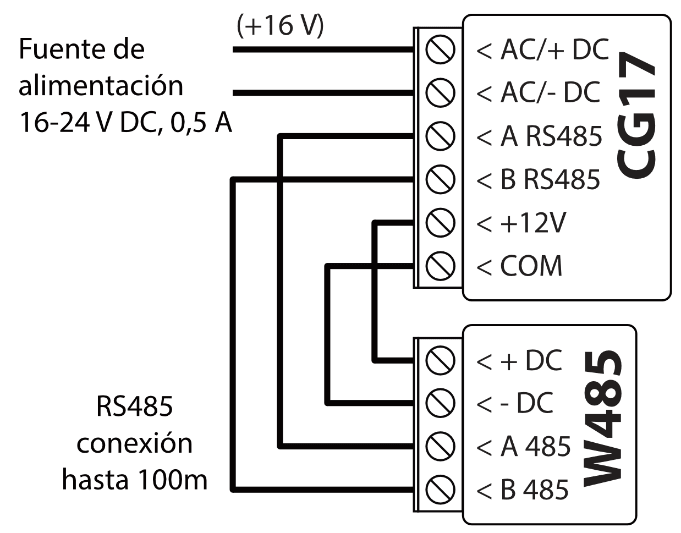

### Esquema para conectar el módulo Ethernet E485

El módulo *E485* envía mensajes al CRA y a *Protegus* por medio de una conexión a internet por cable. Usando el *E485* con *CG17*, los mensajes de CRA y *Protegus2* se envían a través de internet por cable y no se usa internet móvil. Si se interrumpe una conectividad a internet por cable, el *CG17* envía mensajes a través de Internet móvil. Cuando se restablece la conectividad a Internet por cable, el *CG17* comienza a enviar mensajes a través de *E485*. / La configuración del módulo *E485* para funcionar con el *CG17* se describe en la Ventana del capítulo 4.5. „Módulos”. / No necesita una tarjeta SIM cuando utiliza el *E485* con el panel de seguridad *CG17*. / Se puede conectar un módulo *Е485* al *CG17*.

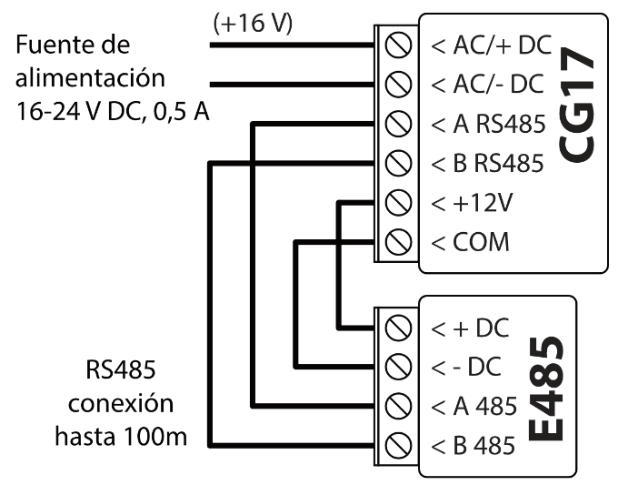

### Esquema para conectar de los módulos de expansión iO-LORA 

La versión de firmware del controlador CG17 es 1.18 y superior.

Conecte el transceptor RF-LORA a CG17. Después de esto, podrá utilizar los módulos iO-LORA, iO8-LORA, PB-LORA, REL-LORA. Se puede conectar un transceptor RF-LORA al CG17.

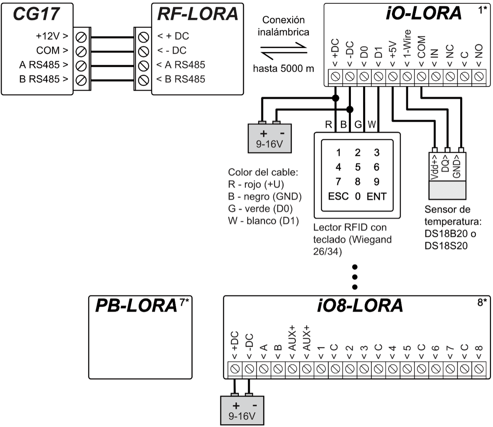

Ejecute TrikdisConfig. Conecte el CG17 mediante un cable USB Mini-B a su computadora o de forma remota. Presione el botón **Leer [F4]** en el programa TrikdisConfig para mostrar los valores actuales de los parámetros operativos del controlador. Cuando se le solicite, ingrese el código de administrador o instalador en la ventana emergente. En la lista "**Módulos**", seleccione el módulo LORA que está utilizando. En el campo "**Núm. de serie**", ingrese el número de serie del módulo.

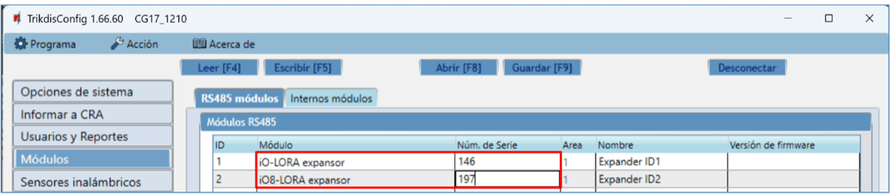

Haga clic en **Escribir [F5]** después de realizar cambios. Espere a que se complete la actualización. Haga clic en "**Desconectar**" y desconecte el cable USB.

## Configuración de parámetros con el software TrikdisConfig 

1.  Descargue el software de configuración TrikdisConfig de www.trikdis.com/ (ingrese “TrikdisConfig” en el campo de búsqueda) e instálelo.

2.  Retire la tapa del CG17 con un destornillador de punta plana como se muestra a continuación:

1.  Conecte el CG17 a una computadora con un cable USB Mini-B.

2.  Inicie el programa de configuración TrikdisConfig. El programa reconocerá automáticamente el dispositivo conectado y abrirá automáticamente la ventana de configuración CG17.

3.  Haga clic en el botón **Leer [F4]** para ver los parámetros actuales del CG17. Si se le solicita, ingrese el código de administrador o instalador en la ventana emergente.

### Descripción de la barra de estado de TrikdisConfig 

Una vez que el CG17 está conectado al software TrikdisConfig, el programa mostrará información sobre el dispositivo conectado en la barra de estado:

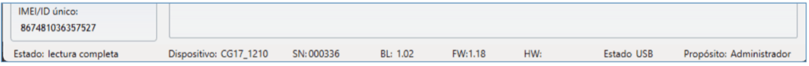

#### Barra de Estado

| Nombre | Descripción |
|----|----|
| IMEI/​ID único | Número IMEI del dispositivo |
| Estado | Estado de acción |
| Dispositivo | Tipo de dispositivo (CG17) |
| SN | Número de serie |
| BL | Versión del cargador de arranque |
| FW | Versión de firmware |
| HW | Versión del hardware |
| Estado | Estado de conexión |
| Propósito | Nivel de acceso (aparece después de que sea confirmado el código de acceso) |

!!! note
    Haga clic en **Leer [F4]** para que el programa lea y muestre las
    configuraciones que están guardadas actualmente en el
    dispositivo. / Haga clic en **Escribir [F5]** para guardar la
    configuración que se muestra en la pantalla en el dispositivo. / Haga
    clic en **Guardar [F9]** para guardar la configuración en un archivo
    de configuración. Puede cargar la configuración guardada en otros
    dispositivos más adelante. Esto permite configurar rápidamente múltiples
    dispositivos con la misma configuración. / Haga clic en **Abrir [F8]**
    y elija un archivo de configuración para ver las configuraciones
    guardadas previamente. / Si desea volver a la configuración
    predeterminada, haga clic en el botón "**Restaurar**" en la esquina
    inferior izquierda de la pantalla.
Cuando se hace clic en el botón **Leer [F4]**, el programa leerá y mostrará la configuración actualmente guardada en el CG17. Con TrikdisConfig, establezca los parámetros necesarios utilizando las siguientes descripciones de la ventana del programa.

### Ventana de „Opciones de sistema” 

**Pestaña de parámetros „Sistema general”**

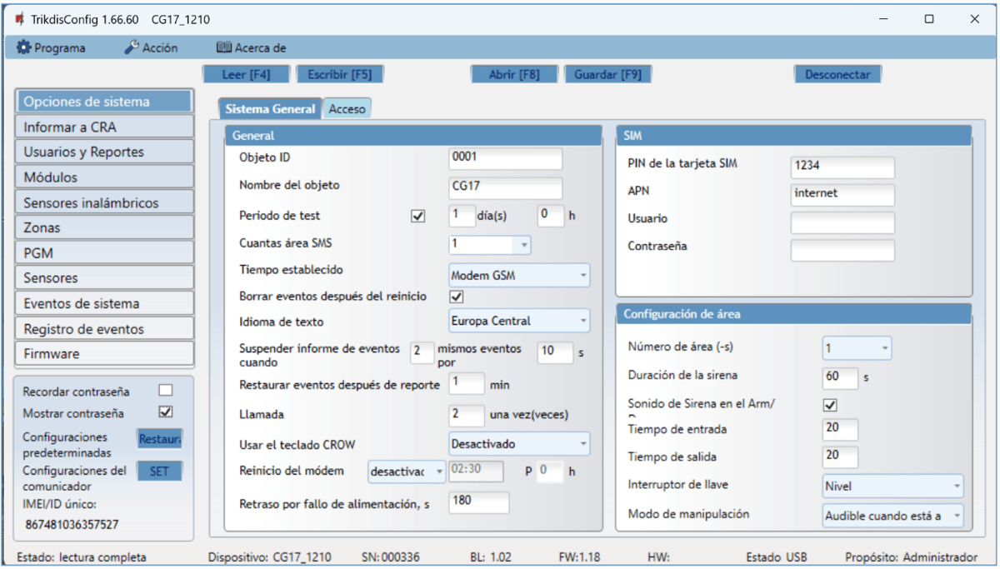

**Grupo de opciones “General”**

- Si los eventos se van a enviar al CRA, ingrese el “**Objeto ID**” (número hexadecimal de 4 símbolos, 0-9, A-F. **No utilice números de objeto FFFE, FFFF.**) proporcionado por el CRA.

- **Nombre del objeto -** se usará en mensajes SMS sobre eventos (se pueden usar hasta 20 símbolos, letras y números).

- **Período de test** - cuando se marca la casilla, se enviarán mensajes periódicos de "Prueba" cada período establecido.

- **Cuantas áreas SMS** - los estados de las áreas elegidas se enviarán en el mensaje de prueba.

- **Tiempo establecido** - elija un servidor para sincronizar la hora. Si elige "*Servidor IP*", la hora se sincronizará con la hora del receptor IP, si elige "*Módem GSM*", la hora se sincronizará con la hora del servidor del proveedor de servicios GSM.

- **Borrar eventos después del reinicio** - todos los mensajes de eventos no enviados se eliminarán después de restablecer.

- **Idioma de texto** - establezca el idioma preferido y los símbolos específicos de ese idioma se utilizarán en los mensajes SMS.

- Puede **Suspender informes de eventos cuando...** suceden varios **mismos eventos por... s**.

- **Restaurar eventos después de reporte...** - establece el tiempo después del cual se cancelará la suspensión de los informes de eventos. El tiempo puede ser de 0 a 999 minutos.

- **Llamada** - después de un evento, el CG17 llamará a los usuarios tantas veces como se especifique. Si la llamada es rechazada o respondida, el CG17 dejará de llamar. El tiempo de llamada es de 20 segundos.

- **Usar el teclado CROW** – especifica el tipo de teclado (**Crow CR-16, Crow LCD, Crow Touch**) conectado al panel de control.

- **Reinicio del módem** - puedes configurar el módem para que se reinicie a una hora específica.

- **Retraso de fallo de alimentación -** en el caso de un corte de energía eléctrica, se enviará una notificación de corte de energía después del tiempo de retraso especificado. Cuando se restablezca la tensión de alimentación, se enviará una notificación de la recuperación de la tensión de alimentación después del retardo de tiempo especificado.

**Grupo de opciones de “SIM”**

- Ingrese el código “**PIN de la tarjeta SIM**”.

- **APN** - nombre del punto de acceso a Internet móvil del proveedor de servicios. Debe ingresar el “**APN**” si los mensajes de evento deberán enviarse al servicio en la nube de Protegus o al CRA a través de GPRS.
- Si el proveedor de servicios GPRS de la tarjeta SIM lo requiere, ingrese el nombre de usuario y la contraseña de APN en los campos “**Usuario**” y “**Contraseña**”.

**Grupo de opciones de “Configuración de área”**

- **Número de área (-s)** establece el número de areas independientes del sistema de alarma.

Si la sirena está conectada y una salida OUT (debe asignarse a un área) se configura como "*Sirena*":

- **Duración de la sirena** - duración del funcionamiento de la sirena cuando se activa la alarma. El tiempo se establece de 0 a 999 segundos.

- **Sonido de Sirena en el arm/disarm** - la sirena emitirá un sonido corto una vez cuando el panel de control esté armado y dos veces cuando esté desarmado.

- **Tiempo de entrada** - hora de entrada a través de la zona de "*Entrada*". El tiempo se establece de 0 a 999 segundos.

- **Tiempo de salida** - tiempo para salir a través de la zona "*Entrada*". El tiempo se establece de 0 a 999 segundos. Cuando el panel de control se arma usando la aplicación Protegus2 o una llamada telefónica, el sistema no contará el “**Tiempo de salida**”.

- **Interruptor de llave** - establece el modo de armado/desarmado de la alarma usando la zona "*Interruptor de llave*". Puedes elegir el control usando “*Pulso*” o “*Nivel*”.

- **Modo de manipuliación** - elige el tipo de reacción (Silencio, Audible cuando está armado, Siempre audible) cuando el sistema detecta un evento de sabotaje del sensor. "Silencio": los destinatarios recibirán informes de eventos, pero la sirena no se encenderá; " Audible cuando está armado": los destinatarios recibirán informes de eventos, pero la sirena se encenderá solo si el evento ocurre cuando el sistema está activado; " Siempre audible": los destinatarios recibirán informes de eventos y la sirena se encenderá incluso cuando el sistema de alarma esté desactivado.

**Pestaña de parámetros “Acceso”**

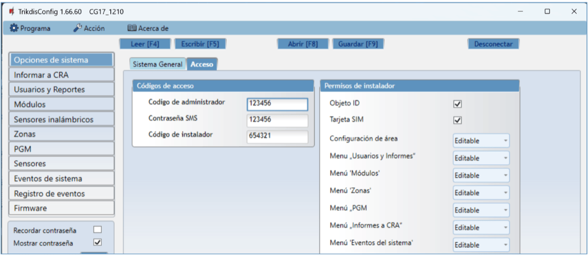

**Grupo de opciones de “Códigos de acceso”**

- **Código de administrador** - (código predeterminado: 123456) proporciona acceso completo a la configuración (el código debe tener 6 símbolos de largo; debe constar de letras y/o números latinos).

- **Contraseña SMS -** (código predeterminado: 123456) es por seguridad cuando se controla con mensajes SMS. Para garantizar más seguridad, cámbielo a un código de 6 símbolos que solo usted conoce.

- **Código del instalador** - (código predeterminado: 654321) le da al instalador acceso a la configuración. Para garantizar la seguridad, cámbielo a un código de 6 símbolos que solo usted conoce.

!!! note
    Si se establece el *código de administrador* predeterminado (123456), el
    software no requerirá que se ingrese y al hacer clic en **Leer [F4]**
    se mostrarán de inmediato los parámetros actualmente guardados en el
    dispositivo.
**Grupo de opciones de “Permisos de instalador”**

- Para configurar los derechos del instalador.

### Ventana “Informar a CRA” 

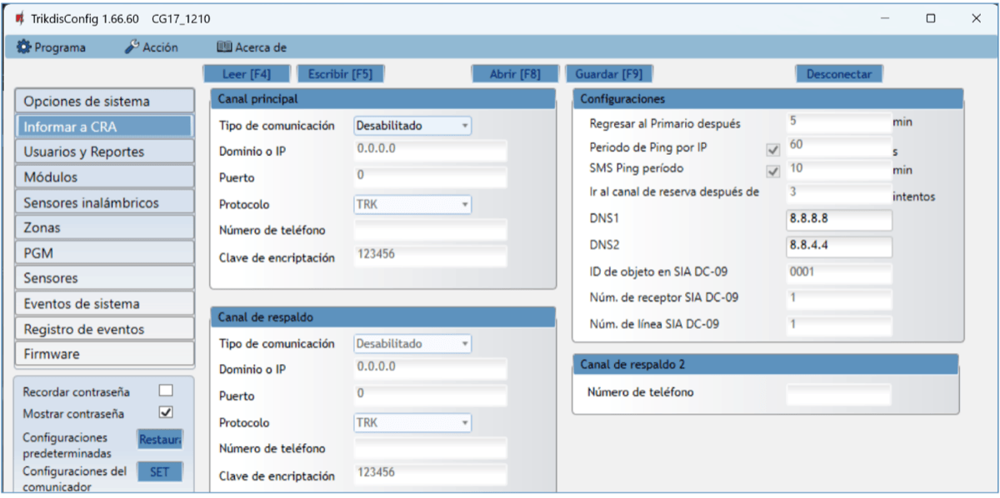

**Grupo de opciones de “Canal principal” y “Canal de respaldo”**

- **Tipo de comunicación** - elija un protocolo para la comunicación con el receptor (TCP/IP, UDP/IP, SMS).

- **Dominio o IP** - ingrese el dominio o la dirección IP del receptor.

- **Puerto** - ingrese el número de puerto de red del receptor.

- **Protocolo** - **TRK** para transferencia de eventos con receptores Trikdis, **SIA DC-09** para transferencia de eventos con receptores universales.

- **Número de teléfono** - número de teléfono del receptor CRA capaz de recibir mensajes SMS.

- **Clave de encriptación** - clave de cifrado de mensajes de 6 dígitos que debe coincidir con la clave de cifrado del receptor CRA.

**Grupo de opciones “Configuraciones”**

- **Regresar a Primario después** - período de tiempo después del cual el CG17 intentará recuperar la conexión con el canal primario, en minutos.

- **Período de Ping por IP** - período para enviar señales PING para verificar la conectividad en el canal GPRS, en segundos. Para habilitar estas señales, marque la casilla.

- **SMS PING período** - período para enviar señales PING para verificar la conectividad en el canal SMS, en minutos. Para habilitar estas señales, marque la casilla.

- **Ir la canal de reserve después de… intentos** - ingrese cuántos intentos fallidos de enviar mensajes usando el canal primario deben ocurrir antes de cambiar al canal de respaldo.

- **DNS1 - DNS2** - Direcciones del servidor DNS.

- **ID de objeto en SIA DC-09** - especifique el número de objeto.

- **Núm. de receptor SIA DC-09** - especifique el número del receptor.

- **Núm. de línea SIA DC-09** - especificar número de línea.

**Grupo de opciones “Canal de respaldo 2”**

- **Núm. de teléfono** - número de teléfono de un receptor CRA capaz de recibir mensajes SMS (por ejemplo: 370xxxxxxxx). El canal SMS de respaldo se usa cuando los mensajes no se pueden enviar usando los canales primario y de respaldo. Esta función es extremadamente útil porque funciona incluso cuando la conectividad IP se interrumpe en la red del operador móvil. Este canal solo funciona cuando el modo GPRS está configurado para los canales primario y secundario. Los mensajes SMS se enviarán al centro receptor: 1) tan pronto como se encienda el CG17 por primera vez; y 2) después de la pérdida de conectividad TCP / IP o UDP / IP en los canales primario y de respaldo.

### Ventana “Usuarios y Reportes“ 

**Pestaña de parámetros “Usuarios”**

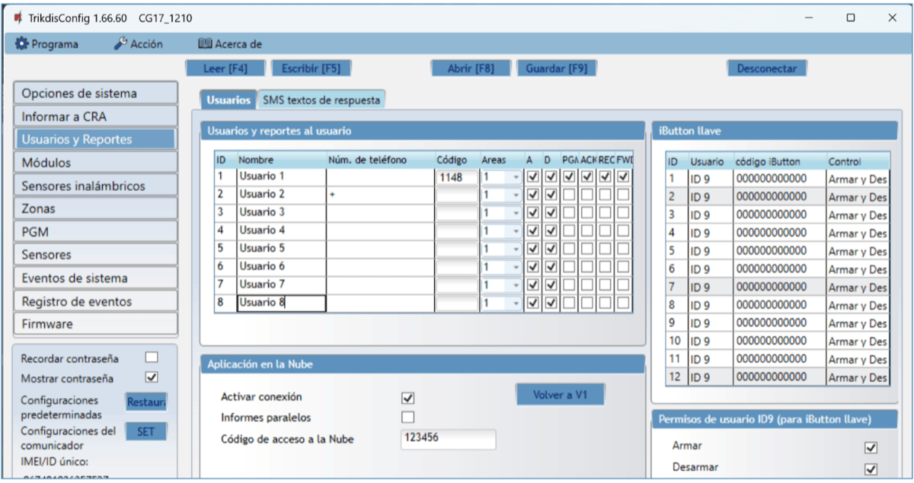

**Grupo de opciones de “Usuarios y reportes al usuario”**

- **ID** - número de usuario en la lista.

- **Nombre** - nombre de usuario o dirección de correo electrónico. El nombre quedará registrado en el mensaje SMS. El administrador puede especificar la dirección de correo electrónico del usuario. Esto permitirá al usuario utilizar la aplicación Protegus2.

- **Núm. de teléfono** - número de teléfono del usuario. Este número puede controlar la alarma de forma remota y recibirá mensajes SMS. Los números deben ingresarse con el código internacional.

- **Código** - el código para armar y desarmar la alarma dada para cada usuario.

- **Áreas** - áreas que el usuario puede controlar. El usuario ID9 solo puede controlar el área 1, el parámetro no se puede editar.

- **A** - marque la casilla si desea permitir al usuario ARMAR el panel de control.

- **D** - marque la casilla si desea permitir al usuario DESARMAR el panel de control.

- Si las casillas **PGM** y **REC** no están marcadas, pero ambas **A** y **D** están seleccionadas, cuando el usuario llama al CG17, su llamada será rechazada, y el panel de control cambiará su estado operativo al estado opuesto, es decir, el panel de control estará armado o desarmado.

  - Si solo se marca **PGM**, el usuario puede llamar al CG17 y encender o apagar la salida deseada usando los comandos de tono DTMF.

  - **REC** - próximamente.

- **ACK** - si la casilla está marcada, el CG17 enviará los mensajes con el texto de respuesta SMS después de cada comando recibido en los mensajes SMS.

  - **FWD** - marque esta casilla si desea reenviar los mensajes SMS recibidos de usuarios que no pertenecen al sistema (por ejemplo, saldo de la cuenta de la tarjeta SIM, mensajes promocionales aleatorios, etc.) al usuario.

**Grupo de opciones “Aplicación en la Nube”**

- **Activar connexion** - habilita el servicio Protegus para que el CG17 pueda intercambiar datos con la aplicación Protegus2. También permite la configuración remota con TrikdisConfig.

- **Informes paralelos** - habilite el envío paralelo de mensajes utilizando el canal principal y Protegus2.

- **Código de acceso a la Nube** - código de 6 dígitos para conectarse con Protegus2.

**Grupo de opciones de “iButton llave”**

!!! note
    ¡Se puede asignar más de una llave a un usuario! Todas las llaves recién
    registradas se asignarán al "Usuario ID9" (sin nombre). Los nombres solo
    se pueden asignar a ocho usuarios. Los permisos para el "Usuario ID9" se
    pueden establecer utilizando los permisos del grupo de configuración
    "Usuario ID9".
- **ID** - número de llave en la lista.

- **Usuario** - el usuario al que está asignada la llave. Para asignar una llave a un usuario, cambie la “ID9” a la ID de cualquier otro usuario de la tabla "Usuarios y reportes al usuario". (por ejemplo, para asignar una llave al usuario número 3, cambie “ID9” a “ID3”).

- **Código iButton** - número de identificación de llave iButton o número ID de la tarjeta RFID.

- **Control** – elija qué acción debe realizar el panel de control después de leer la llave (por ejemplo, TM17): No permitido / Armar / Desarmar / Armar y Desarmar.

#### Registro de llaves de contacto (iButton) 

1.  Si la lista "**iButtons**" está vacía, la primera llave registrada se guarda en la primera línea de la lista y se convierte en la “**Llave maestra**”.

2.  Para activar el modo de registro de llave de contacto, mantenga presionada la "**Llave maestra**" contra el lector de llaves durante al menos 10 segundos. Cuando el modo de registro está activado, el indicador LED "*State*" del lector de llave TM17 comenzará a parpadear en verde.

3.  Para registrar las llaves de usuario, adjúntelas contra el lector de llaves una por una. 3 señales de sonido del lector indicarán que la llave ha sido registrada.

4.  Cuando termine de registrar las llave de contacto del usuario (iButton), mantenga presionada la "**Llave maestra**" contra el lector de llaves para desactivar el modo de registro. Cuando el modo de registro está apagado, el indicador LED "*State*" del lector de llave TM17 dejará de parpadear.

5.  Para eliminar todas las llaves (incluida la “**llave maestra**”), sostenga la clave maestra contra el lector durante al menos 20 segundos*.*

!!! note
    ¡La "**Llave maestra**" solo debe usarse para registrar otras llaves
    de contacto!
#### Registro de tarjeta RFID 

Se utiliza un panel de control CG17 con módulo iO-LORA al que se conecta un lector RFID con teclado. En el campo “iButton llave”, ingrese el número de identificación de la tarjeta RFID.

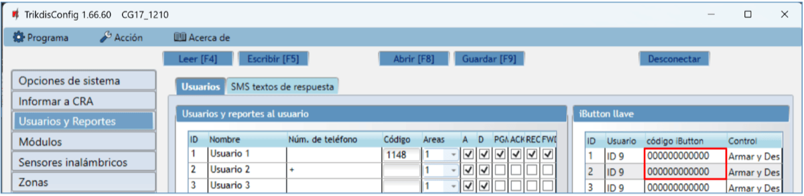

Haga clic en Escribir [F5] después de realizar cambios. Espere a que se complete la actualización.

**Pestaña de parámetros “SMS textos de respuesta”**

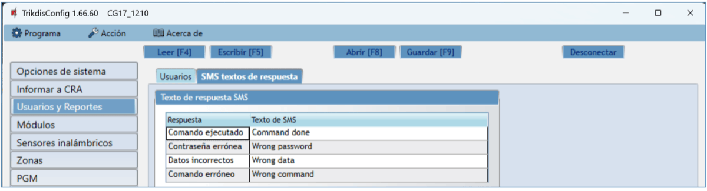

**Grupo de opciones de “Texto de respuesta SMS”**

- Los textos de respuestas a los comandos de control enviados mediante mensajes SMS se pueden editar en el campo “**Texto de SMS**”**.**

### Ventana “Modulos”

**Pestaña de parámetros “RS485 módulos”**

- **ID** – número del módulo en la lista.

- **Módulo** – seleccione de la lista el módulo (iO, iO-WL, TM17, iO-8, RF-SH, FLS, E485, W485, iO-LORA, iO8-LORA, PB-LORA, REL-LORA) que está conectado al CG17 a través de RS485.

- **Núm de Serie** – introduzca el número de serie del módulo (6 dígitos), que se indica en las etiquetas adhesivas en caso y el embalaje del módulo.

- **Area** – asigne el módulo a un área (el TM17 mostrará el estado del área a la que está asignado y también el estado de las zonas asignadas al área).

- **Nombre** – puedes ponerle un nombre al módulo.
- **Versión de firmware** – la versión del firmware se mostrará una vez que el CG17 detecte el módulo conectado.

**Ventana de configuración del módulo WiFi *W485***

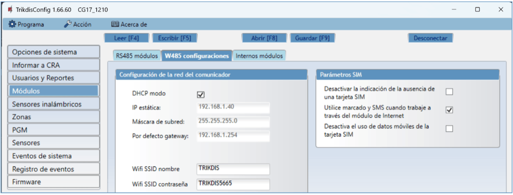

**Grupo de opciones de “Configuración de la red del comunicador”**

- **DHCP Modo** - modo del módulo WiFi para registrarse en la red (manual o automático).

- **IP estática** - dirección IP estática para cuando se establece el modo de registro manual.

- **Máscara de subred** - máscara de subred para cuando se establece el modo de registro manual.

- **Por defecto gateway** - dirección de Puerto de enlace para cuando se establece el modo de registro manual.

- **WiFi SSID nombre** - nombre de la red WiFi a la que se conectará el W485.

  - **WiFi SSID contraseña** - contraseña de red WiFi.

**Grupo de opciones de “Parámetros SIM”**

- **Desactivar la indicación de la ausencia de una tarjeta SIM** – marcar esta casilla deshabilitará la indicación de la ausencia de SIM cuando el CG17 funciona sin una SIM.

- **Utilice el marcado y SMS cuando trabaje a través del módulo de internet** – Al marcar esta casilla, se utilizará la llamada y el SMS para comunicarse con el módulo WiFi conectado W485. Si el campo no está marcado y hay Internet, no se utilizan SMS ni llamadas. Si el campo está desmarcado e Internet no está presente, se utilizan SMS y llamadas para informar al usuario.

- **Desactiva el uso de datos móviles de la tarjeta SIM** - Marcar esta casilla deshabilitará el uso de datos móviles en la tarjeta SIM. Los datos solo se enviarán a través del módulo W485. Si Internet desaparece, CG17 almacenará los datos en la memoria. Cuando se reconstruye Internet, CG17 envió información a través del módulo W485.

En la tabla, puede asignar eventos de Contacto ID y códigos de restauración al evento de falla del bus de datos RS485. Cuando la conexión entre el W485 y el CG17 se interrumpe o se restablece, el CG17 enviará un mensaje con el código CID asignado a la aplicación CRA y Protegus2.

!!! note
    Debe configurar el CG17 para enviar mensajes a CRA y
    Protegus2, consulte los capítulos 2.2 "Configuración para
    conectarse con el CRA" y. 2.1 "Opciones de conexión para la app
    Protegus2". / **No necesita una tarjeta SIM, cuando utiliza el *W485*
    con el panel de seguridad *CG17* (firmware de Ver.1.13).**
#### Ventana de configuración del módulo ethernet *E485*

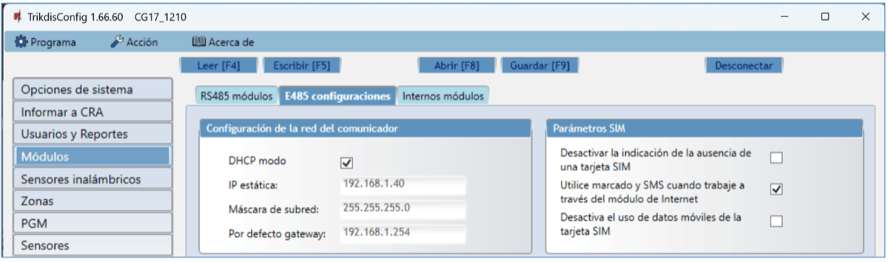

**Grupo de opciones de “Configuración de la red del comunicador”**

- **DHCP Modo** - modo del módulo ethernet para registrarse en la red (manual o automático).

- **IP estática** - dirección IP estática para cuando se establece el modo de registro manual.

- **Máscara de subred** - máscara de subred para cuando se establece el modo de registro manual.

  - **Por defecto gateway** - dirección de Puerto de enlace para cuando se establece el modo de registro manual.

**Grupo de opciones de “Parámetros SIM”**

- **Desactivar la indicación de la ausencia de una tarjeta SIM** – marcar esta casilla deshabilitará la indicación de la ausencia de SIM cuando el CG17 funciona sin una SIM.

- **Utilice el marcado y el SMS cuando trabaje a través del módulo de internet** – Al marcar esta casilla, se utilizará la llamada y el SMS para comunicarse con el módulo Wi-Fi conectado E485. Si el campo no está marcado y hay Internet, no se utilizan SMS ni llamadas. Si el campo está desmarcado e Internet no está presente, se utilizan SMS y llamadas para informar al usuario.

- **Desactiva el uso de datos móviles de la tarjeta SIM** - Marcar esta casilla deshabilitará el uso de datos móviles en la tarjeta SIM. Los datos solo se enviarán a través del módulo E485. Si Internet desaparece, CG17 almacenará los datos en la memoria. Cuando se reconstruye Internet, CG17 envió información a través del módulo E485.

En la tabla, puede asignar eventos de Contacto ID y códigos de restauración al evento de falla del bus de datos RS485. Cuando la conexión entre el W485 y el CG17 se interrumpe o se restablece, el CG17 enviará un mensaje con el código CID asignado a la aplicación CRA y Protegus2.

!!! note
    Debe configurar el CG17 para enviar mensajes a CRA y
    Protegus, consulte los capítulos 2.2 "Configuración para
    conectarse con el CRA" y. 2.1 "Opciones de conexión para la app
    Protegus2". / **No necesita una tarjeta SIM, cuando utiliza el *E485*
    con el panel de seguridad *CG17* (firmware de Ver.1.13).**
**Pestaña de parámetros “Internos módulos”**

**Grupo de opciones de “Módulos internos”**

- **Tipo de módulo** – elija el módulo GPS que se está utilizando.

- Reporte de coordenadas cada \_\_ min, cuando no se encuentra en movimiento o cada \_\_ segundo, cuando no se encuentra en – especificar intervalos para enviar coordenadas cuando está en modo ordinario y cuando se detecta movimiento o se activa la alarma en la zona.

- **Detección de movimiento** – si la casilla está marcada, la alarma se activará si la diferencia entre las coordenadas es mayor que la especificada. Las coordenadas se enviarán con más frecuencia.

- **Coeficientes para promedio, Promedio lento** – las coordenadas promediadas se envían cuando no hay movimiento (el promedio se toma del número especificado de coordenadas - 256 u otro número especificado).

- **Coeficiente para promedio, Rapido** – las coordenadas promediadas se envían cuando hay movimiento o la zona está en estado de alarma (el promedio se toma del número especificado de coordenadas - 8 u otro número especificado).

- Generar alarma cuando se detecta movimiento generar si el área está armada (instantáneamente si no se selecciona ninguno) - si la casilla está marcada, el código de evento CID se envía al CRA y el usuario al Protegus2, cuando se detecta movimiento.

- **Acelerar el envio de coordenadas cuando las alarmas en la zona** – especifique la zona del sistema de seguridad a la que está conectado un sensor. Si se activa el sensor (interpretado como una alarma de zona), el CG17 envía coordenadas con mayor frecuencia.

- **Detener informes después de la alarma cuando no hay movimiento para** - especificar intervalo de tiempo (en minutos). Si las coordenadas no cambian y no hay alarma de zona durante este tiempo, el envío de coordenadas vuelve al modo normal.

Los mensajes con las coordenadas se envían al programa de monitoreo Monas MS.

#### Vinculación de un sensor de nivel de combustible “STRELA RS485” 

!!! note
    El sensor de nivel de combustible "**Strela RS485**" debe calibrarse con
    la configuración "**DUTconfig**" del software del fabricante antes de
    usarse. El sensor de nivel de combustible se conecta a la computadora
    mediante un adaptador y luego se calibra. Una vez que el sensor de nivel
    de combustible "**Strela RS485**" esté conectado al CG17, otros
    módulos RS485 (iO, iO-WL, TM17, iO-8,
    RF-SH, E485, W485, iO-LORA, iO8-LORA,
    PB-LORA, REL-LORA) se volverán inactivos.
**Grupo de opciones de “Módulos RS485”**

- **Módulo** – seleccione el módulo “**Sensor de combustible FLS**”.

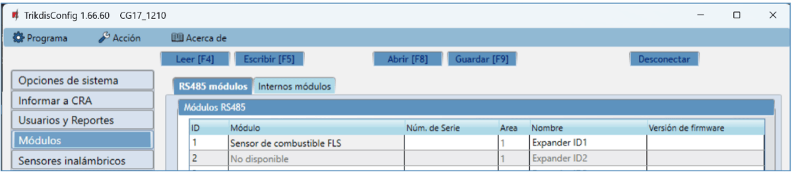

Haga clic en **Escribir [F5]**. Espere hasta que se guarden los datos. Retire el cable USB del CG17. Espere aproximadamente 1 minuto. Conecte el cable USB al CG17. Haga clic en **Leer [F4]**. El programa leerá y mostrará la configuración actualmente guardada en el CG17. El número de serie y la “**Versión de firmware**” del sensor de nivel de combustible “**Strela S485**” aparecerá en la ventana del programa “**Módulos**”.

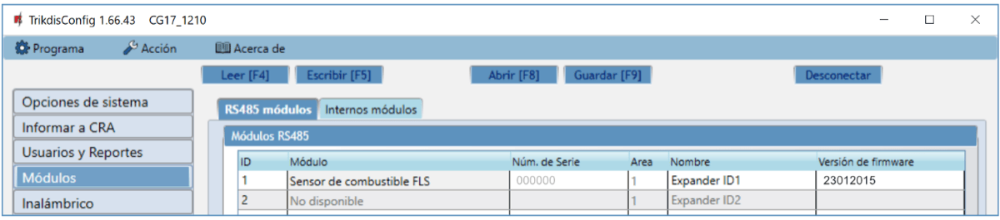

Abra la ventana de “**Sensores**”**.**

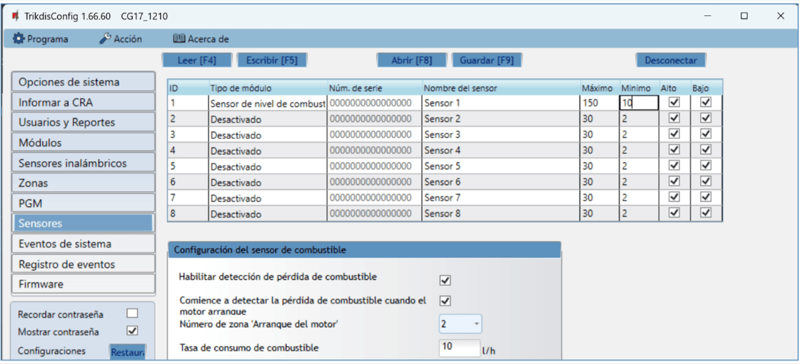

- **Tipo de módulo** - elija “**Sensor de nivel de combustible**”.

- **Nombre del sensor** - nombra el sensor.

- **Máximo** - ingrese la cantidad máxima de combustible (en litros). Cuando la cantidad real es mayor que la especificada en esta configuración, se formará un mensaje de evento. Para que se envíe el mensaje, la casilla “**Alta**” debe estar marcada.

- **Minimo** - ingrese la cantidad mínima de combustible (en litros). Cuando la cantidad real es inferior a la especificada en esta configuración, se formará un mensaje de evento. Para que se envíe el mensaje, la casilla “**Baja**” debe estar marcada.

**Grupo de opciones de “Configuración del sensor se combustible”**

- **Habilitar detección de pérdida de combustible** - marcando la casilla, habilite el monitoreo del nivel de combustible.

- **Comience a detector la pérdida de combustible cuando el motor arranque** - si la casilla está marcada, el monitoreo del nivel de combustible comenzará cuando se arranque el motor. La señal de arranque del motor debe enviarse a la entrada (zona) CG17 que se elige en la siguiente configuración.

- **Número de zona "Arranque del motor"** - especifique el número de la entrada CG17 (IN) que habilitará el arranque del motor.

- **Tasa de consume de combustible** – ingrese la tasa de consumo de combustible.

El usuario será informado sobre los cambios repentinos de nivel de combustible con un mensaje SMS. El usuario puede editar el texto del mensaje SMS.

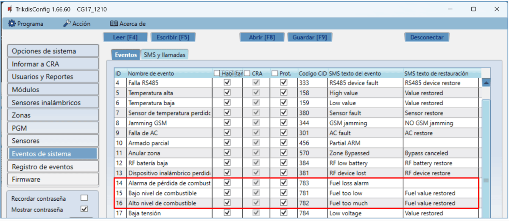

Descripción del funcionamiento del sensor de nivel de combustible. El sensor de nivel de combustible “**Strela RS485**” está conectado al CG17 (consulte 3.10 "Esquemas para la conexión del sensor de nivel de combustible “Strela RS485”"). Los parámetros de medición se establecen para el CG17. El sensor de nivel de combustible inicia las mediciones:

1.  Cuando se marca la casilla "**Habilitar detección de p pérdida de combustible**". Cuando se enciende el CG17, el sensor de nivel de combustible comienza a monitorear el consumo de combustible. Las mediciones se detienen cuando se apaga la alimentación del CG17.

2.  Las casillas " **Habilitar detección de pérdida de combustible** " y "**Iniciar detección de pérdida de combustible cuando el motor arranca**" están marcadas. Además, se debe especificar el número de la entrada (IN) que iniciará la supervisión del nivel de combustible cuando esté habilitado (arranque del motor). Cuando se restablece la entrada (IN) (motor apagado), se detendrá la supervisión del nivel de combustible.

Cada vez que se enciende el sensor de nivel de combustible, mide el nivel de combustible actual y lo compara con el nivel de combustible que se guardó en la memoria antes de apagar el sensor. Si el nivel actual de combustible es más bajo, el CG17 envía mensajes sobre la pérdida de combustible a la compañía de seguridad y / o a los usuarios.

Durante el funcionamiento, el sensor de nivel de combustible mide el nivel de combustible cada intervalo de tiempo y lo compara con la tasa de consumo. Si el consumo de combustible en un intervalo de tiempo es mayor que la tasa de consumo de combustible ingresada, el CG17 envía mensajes a la compañía de seguridad y / o a los usuarios.

### Ventana “Sensores Inalámbricos” 

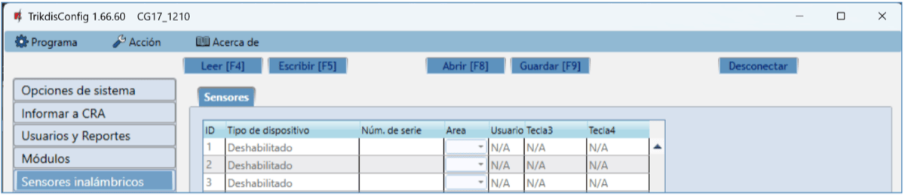

CG17 puede funcionar con sensores inalámbricos, sirenas y controles remotos Shepherd de la marca Crow utilizando el módulo RF-SH.

#### Emparejamiento de un transceptor RF-SH de dispositivo inalámbrico con el CG17 

1.  Conecte el transceptor **RF-SH** al CG17 de acuerdo con el esquema en 3.7 “Esquema para conectar un sensor inalámbrico transceptor RF-SH”.

2.  Enciende el poder.

3.  Conecte un cable USB Mini-B al ***CG17*.**

4.  Inicie el programa TrikdisConfig, haga clic en el botón **Leer [F4]**.

5.  En la lista “**Módulos**”, elija "**RF-SH expansor inalámbrico**".

6.  Ingrese el número de serie del dispositivo en el campo “**Número de serie**”.

7.  Haga clic en **Escribir [F5]**.

8.  Desenchufe el cable USB Mini-B.

9.  Espere 1 minuto para que el CG17 y **RF-SH** se conecten entre sí.

10. Conecte el cable USB Mini-B al CG17.

11. Haga clic en **Leer [F4]**.

12. La “**Versión de firmware**” del **RF-SH** aparecerá en la ventana "**Módulos**".

13. El módulo **RF-SH** ahora está emparejado con el CG17.

Todos los sensores inalámbricos se pueden emparejar a la vez.

#### Emparejamiento de sensores inalámbricos (FW2) 

1.  Asegúrese de que el transceptor **RF-SH** esté emparejado con el CG17 (consulte el capítulo 4.6.1 anterior).

2.  Enciende el poder.

3.  Retire la tapa del transceptor **RF-SH**.

4.  Mantenga presionado el botón “**LEARN**” del módulo **RF-SH** hasta que el indicador LED “**LEARN**” comience a parpadear en verde.

5.  Suelta el botón.

6.  Un indicador verde de “**LEARN**” parpadeante indica que el **RF-SH** está en modo de registro de sensor inalámbrico.

7.  Inserte una batería en el sensor inalámbrico y espere hasta que los indicadores LED del sensor dejen de parpadear.

8.  Presione brevemente el botón “Tamper” en el sensor y suéltelo.

9.  Después de soltar el botón “Tamper”, la indicación LED del sensor cambiará:

    1.  El indicador parpadea en verde y rojo - el sensor se ha agregado correctamente al sistema.

    2.  El indicador parpadea solo en verde - el enlace del sensor ha fallado. Repita el procedimiento de registro.

    3.  Indicador que parpadea en rojo - voltaje de la batería demasiado bajo (cambie la batería).

10. Mantenga presionado el botón “**LEARN**” del transceptor **RF-SH** hasta que el indicador LED “**LEARN**” deje de parpadear en verde. El transceptor **RF-SH** ha salido del modo de enlace.

11. Conecte un cable USB Mini-B al CG17.

12. Inicie TrikdisConfig, haga clic en el botón **Leer [F4]**.

13. Habrá una lista de sensores inalámbricos registrados en la ventana “**Sensores inalámbricos**” del programa TrikdisConfig. Los códigos de 7 símbolos en el “**Número de serie**” el campo debe coincidir con los códigos del sensor que se encuentran en la parte posterior de la carcasa o en el tablero.

14. Los sensores deben distribuirse en zonas y áreas del panel de alarma CG17 (ventana “**Zonas**”). Después de hacer los cambios, presione **Escribir [F5]**.

15. El sensor inalámbrico ahora está emparejado con el sistema.

!!! note
    Eliminar sensores inalámbricos de la memoria del CG17:
    
    1.  Conecte un cable USB Mini-B al CG17.
    
    2.  Inicie TrikdisConfig, haga clic en el botón **Leer [F4]**.
    
    3.  En la ventana "**Sensores inalámbrica**" de TrikdisConfig,
        especifique "**Deshabilitado**" en el campo "**Tipo de
        dispositivo**" en la línea del sensor inalámbrico que desea eliminar
        y haga clic en **Escribir [F5]**. El sensor inalámbrico ahora se
        elimina de la memoria del CG17.
#### Emparejamiento un llavero inalámbrico (FW2) 

1.  Asegúrese de que el transceptor RF-SH esté emparejado con el *CG17* (consulte el capítulo 4.6.1 anterior).

2.  Enciende el poder.

3.  Retire la tapa del transceptor RF-SH.

4.  Mantenga presionado el botón “LEARN” del módulo RF-SH hasta que el indicador LED “LEARN” comience a parpadear en verde.

5.  Suelta el botón.

6.  Un indicador verde de “LEARN” parpadeante indica que el RF-SH está en modo de registro de sensor inalámbrico.

7.  En el control remoto, mantenga presionados simultáneamente los botones 3 y 4. El indicador parpadeará en ámbar. Después de unos segundos, se apagará y el indicador verde se iluminará por un corto tiempo.

8. Suelte los botones 3 y 4. El llavero está registrado en CG17.

2.  Mantenga presionado el botón “**LEARN**” en el receptor **RF-SH** hasta que el LED “**LEARN**” deje de parpadear en verde. Modo de registro salido del receptor **RF-SH**.

3.  Conecte un cable USB Mini-B al CG17.

4.  Inicie TrikdisConfig, haga clic en el botón **Leer [F4]**.

5.  En la ventana del software **TrikdisConfig** “**Sensores inalámbricos**”, el texto "**Control remoto**" debe aparecer en el campo “**Tipo de dispositivo**” y en el campo "**Número de serie**" debe tener un código de 7 símbolos que coincida con el código en la parte posterior del llavero remoto.

6.  Al llavero se le debe asignar la “**Área**” del panel de control CG17, que controlará.

7.  En el campo “**Usuario**”, especifique el número del usuario

8.  Puede asignar funciones adicionales a los botones 3 y 4 del controlador (Desarmar; Armar; Pánico silencioso; Pánico).

9.  Después de hacer los cambios, haga clic en **Escribir [F5]**.

10. El controlador inalámbrico ahora está emparejado con el Sistema.

!!! note
    Restaurar la configuración de fábrica del control remoto:
    
    1.  Mantenga presionados simultáneamente los botones 2 y 3 del llavero.
        El indicador parpadea en verde y rojo.
    
    2.  Los indicadores se apagan. Suelta los botones. El control remoto ha
        sido restaurado a la configuración de fábrica.
#### Emparejamiento de una sirena inalámbrica (FW2)

1.  Asegúrese de que el transceptor **RF-SH** esté emparejado con el CG17 (consulte el capítulo 4.6.1 anterior).

2.  Enciende el poder.

3.  Retire la tapa del transceptor **RF-SH**.

4.  Mantenga presionado el botón “**LEARN**” del módulo **RF-SH** hasta que el indicador LED “**LEARN**” comience a parpadear en verde.

5.  Suelta el botón.

6.  Un indicador verde de “**LEARN**” parpadeante indica que el **RF-SH** está en modo de registro de sensor inalámbrico.

7.  Retire la tapa de la sirena.

8.  Conecte una fuente de alimentación a la sirena.

9.  El destello de la sirena parpadeará raramente durante 30 segundos. Cuando el indicador deja de parpadear, la sirena está lista para conectarse.

10. Mantenga presionado el botón “**LEARN**” en el tablero de la sirena.

11. El flash parpadeará.

12. Cuando el flash deja de parpadear, se registrará la sirena. Suelte el botón “**LEARN**”.

13. Mantenga presionado el botón “**LEARN**” en el receptor **RF-SH** hasta que el LED “**LEARN**” deje de parpadear en verde. Modo de registro salido del receptor **RF-SH.**

14. Conecte un cable USB Mini-B al CG17.

15. Inicie TrikdisConfig, haga clic en el botón **Leer [F4]**.

16. En la ventana del software TrikdisConfig “**Sensores inalámbricos**”, el texto “**Sirena**” debe aparecer en el campo “**Tipo de dispositivo**” y en el campo “**Número de serie**” debe tener un código de 7 símbolos que coincida con el código en el tablero de la sirena.

17. Ingrese un número de área en el campo “**Área**” y haga clic en **Escribir [F5]**.

18. La sirena inalámbrica ahora está completamente emparejada con el sistema.

!!! note
    Restaurar la configuración de fábrica de la sirena:
    
    1.  Retire la cubierta de la sirena.
    
    2.  Apague el poder de la sirena.
    
    3.  Mantenga presionado el botón "**LEARN**" en el tablero de sirenas y
        conecte la alimentación.
    
    4.  Mantenga el botón "**LEARN**" hasta que la sirena parpadee 3 veces.
    
    5.  Suelte el botón "**LEARN**". Un flash de sirena raramente parpadeará
        durante otros 30 segundos.
    
    6.  El flash deja de parpadear. Configuración de fábrica restaurada para
        sirena inalámbrica.
#### Emparejamiento de sensores inalámbricos (SH)

1.  Asegúrese de que el transceptor **RF-SH** esté emparejado con el CG17 (consulte el capítulo 4.6.1 anterior).

2.  Enciende el poder.

3.  Retire la tapa del transceptor **RF-SH**.

4.  Mantenga presionado el botón “**LEARN**” del módulo **RF-SH** hasta que el indicador LED “**LEARN**” comience a parpadear en verde.

5.  Suelta el botón.

6.  Un indicador verde de “**LEARN**” parpadeante indica que el **RF-SH** está en modo de registro de sensor inalámbrico.

7.  Inserte la batería en el sensor inalámbrico y espere hasta que el LED del sensor deje de parpadear en verde o rojo. Cuando se completa el proceso de registro, el LED verde se encenderá durante 3 segundos y se apagará.

8.  Si el proceso de registro falla, el LED dejará de parpadear. Retire la batería, espere diez segundos y repita el proceso de registro.

9.  Mantenga presionado el botón “**LEARN**” en el receptor **RF-SH** hasta que el LED “**LEARN**” deje de parpadear en verde. Modo de registro salido del receptor **RF-SH.**

10. Conecte un cable USB Mini-B al CG17.

11. Inicie TrikdisConfig, haga clic en el botón **Leer [F4]**.

12. Habrá una lista de sensores inalámbricos registrados en la ventana “**Sensores inalámbricos**” del programa TrikdisConfig. Los códigos de 7 símbolos en el “**Número de serie**” el campo debe coincidir con los códigos del sensor que se encuentran en la parte posterior de la carcasa o en el tablero.

13. Los sensores deben distribuirse en zonas y áreas del panel de alarma CG17 (ventana “**Zonas**”). Después de hacer los cambios, presione **Escribir [F5]**.

14. El sensor inalámbrico ahora está emparejado con el sistema.

!!! note
    Eliminar sensores inalámbricos de la memoria del CG17:
    
    1.  Conecte un cable USB Mini-B al CG17.
    
    2.  Inicie TrikdisConfig, haga clic en el botón **Leer [F4]**.
    
    3.  En la ventana "**Sensores inalámbricos**" de TrikdisConfig,
        especifique "**Deshabilitado**" en el campo "**Tipo de
        dispositivo**" en la línea del sensor inalámbrico que desea eliminar
        y haga clic en **Escribir [F5]**. El sensor inalámbrico ahora se
        elimina de la memoria del CG17.
#### Emparejamiento un teclado inalámbrico (SH) 

1.  Asegúrese de que el transceptor **RF-SH** esté emparejado con el CG17 (consulte el capítulo 4.6.1 anterior).

2.  Enciende el poder.

3.  Retire la tapa del transceptor **RF-SH**.

4.  Mantenga presionado el botón “**LEARN**” del módulo **RF-SH** hasta que el indicador LED “**LEARN**” comience a parpadear en verde.

5.  Suelta el botón.

6.  Un indicador verde de “**LEARN**” parpadeante indica que el **RF-SH** está en modo de registro de sensor inalámbrico.

7.  Inserte la batería en el teclado y espere hasta que la luz roja verde  en el teclado deje de parpadear. Cuando se complete el proceso de registro, el indicador verde se iluminará durante 3 segundos en el teclado y se apagará

8.  Mantenga presionado el botón “**LEARN**” en el receptor **RF-SH** hasta que el LED “**LEARN**” deje de parpadear en verde. Modo de registro salido del receptor **RF-SH.**.

9.  Conecte un cable USB Mini-B al CG17.

10. Inicie TrikdisConfig, haga clic en el botón **Leer [F4]**.

11. TrikdisConfig muestra una lista de teclados inalámbricos registrados en la ventana “**Sensores inalámbricos**”. El campo “**Número de serie**” registrará el número de serie de 7 dígitos. El número debe coincidir con el número de serie del teclado, que está escrito en la parte posterior de la caja o en la pizarra.

12. Especifique un número de área en el campo “**Área**” e ingrese el número de un usuario en el campo “**Usuario**”.

13. Después de hacer los cambios, haga clic en **Escribir [F5]**.

14. El teclado inalámbrico está completamente registrado.

!!! note
    Eliminar sensores inalámbricos de la memoria del CG17:
    
    1.  Conecte un cable USB Mini-B al CG17.
    
    2.  Inicie TrikdisConfig, haga clic en el botón **Leer [F4]**.
    
    3.  En el campo "**Tipo de dispositivo**" de la ventana
        TrikdisConfig "**Sensores inalámbricos**", en lugar de
        "**Teclado SH**", especifique "**Dishabilitado**" y haga clic en
        **Escribir [F5]**. El teclado inalámbrico ahora se elimina de la
        memoria del CG17.
### Ventana “Zonas” 

**Pestaña de parámetros “Configuraciones de zonas”**

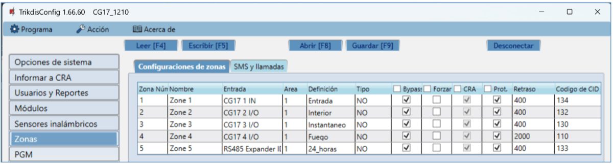

- **Zona Núm.** – el número de la zona en la lista.

- **Nombre -** ingrese el nombre de la zona.

- **Entrada** – elija un CG17 o entrada de módulo externo IN para asignar a la zona.

- **Area** – asignar una zona a un área.

- **Definición** – puedes asignar a cada zona una de estas funciones:

  - **Entrada** – para conectar un contacto de puerta de entrada magnética. Puede establecer tiempos de entrada y salida para este tipo de zona.

Después de que se arma la alarma, se permite la violación de la zona de "*Entrada*" dentro del tiempo de salida. Si la zona aún se viola cuando se acabó el tiempo, las salidas OUT “*Sirena*” y “*Destello*” se activan y se envían informes de alarma.

Cuando la alarma está armada, una violación de la zona de "*Entrada*" inicia el contador de tiempo de entrada, durante el cual la alarma debe desarmarse. Si la alarma aún no está desarmada cuando se acabó el tiempo, las salidas OUT "*Sirena*" y "*Destello*" se activan y se envían informes de alarma.

- **Interior** – para conectar un sensor de movimiento a la puerta de entrada.

Cuando la alarma está armada, si se viola la zona "*Interior*", las salidas OUT "*Sirena*" y "*Destello*" se activan y se envían informes de alarma.

Si la alarma está armada y la primera zona que se violará es la zona "*Entrada*", la zona "*Interior*" también se puede violar durante el tiempo de entrada establecido. Si la alarma no se desarma cuando el tiempo de entrada establecido es alto, las salidas OUT "*Sirena*" y "*Destello*" se activan y se envían informes de alarma.

- **Instantaneo** – para conectar sensores de movimiento. Si se viola la zona "*Instantánea*" cuando se activa la alarma, las salidas OUT "*Sirena*" y "*Destello*" se activan y se envía un mensaje sobre la activación de la alarma.

- **Fuego** – para conectar sensores de fuego. Si se viola esta zona, las salidas OUT "*Sirena*" y "*Destello*" se activan inmediatamente y se envía un mensaje sobre el evento.

  - **Interruptor de llave** – diseñado para conectar un teclado numérico o interruptor. Después de haber violado la zona, se activará o desactivará el modo de alarma. La alarma se encenderá después del tiempo de retraso de salida.

  - **24 horas** – para conectar detectores de rotura de cristal y antisabotaje (tamper). Si se viola esta zona, las salidas OUT "*Sirena*" y "*Destello*" se activan inmediatamente y se envía un mensaje sobre el evento.

  - **Silenciosa** – Habiendo violado la zona, se envía inmediatamente una señal de alarma sobre la activación de la alarma, y las salidas OUT "*Sirena*" y "*Destello*" permanecen apagadas.

  - **Silenciosa 24h** – diseñado para conectar el botón de pánico. Habiendo violado la zona, las salidas OUT "Siren" y "Flash" se disparan instantáneamente y se envía una alarma sobre la alarma.
- **Tipo** – elija el tipo de circuito conectado a la entrada de zona IN de la lista: NC - normalmente cerrado, NO - normalmente abierto, EOL - resistencia de final de línea de 10 kΩ; EOL_T - con una resistencia fin de la línea (10 kΩ) y monitoreo de manipulación.

- **Bypass** – marque esta casilla si desea omitir una zona e ignorar cuando se activa.

- **Forzar** – marque esta casilla si desea permitir armar el sistema de seguridad con una zona abierta. Si el panel de control está armado, violar la zona que está en modo "*Forzar*" activará la alarma.

- **CRA/Prot.**– si la casilla está marcada, los mensajes de evento para esta zona se enviarán a CRA y a la nube Protegus.

- **Retraso** – tiempo de respuesta de entrada "IN", milisegundos.

- **Codigo de CID** – Códigos de CID para eventos. El código se establecerá automáticamente cuando elija una definición de zona.

**Pestaña de parámetros “SMS y llamadas“**

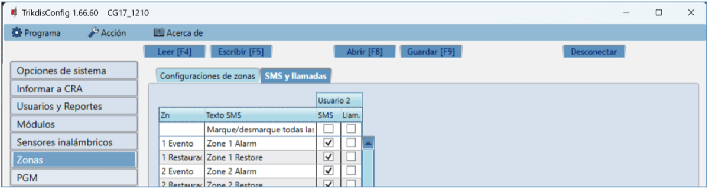

Esta ventana solo aparecerá si se ha agregado al menos un número de teléfono de usuario a la ventana " Usuarios y Reportes".

- **Zn** – número de zona con palabra de identificación de evento. Puede ser "*Evento*" o "*Restaurar*".

- **Texto SMS** – descripción del evento de zona que se utilizará en los mensajes SMS enviados a los usuarios.

- **SMS/Llamada** – marque las formas en que los usuarios serán informados sobre los eventos: mensajes SMS y / o Llamadas.

### Ventana “PGM” 

**Pestaña de parámetros “Salidas”**

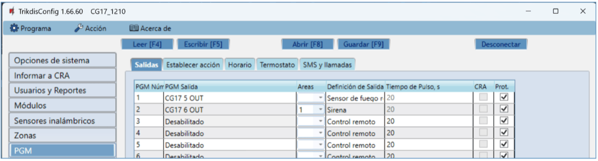

- **PGM Núm.**– el número de PGM en la lista.

- **PGM Salida** – asigne las salidas OUT del CG17 o expansor externo.

- **Areas** – asignar una salida OUT a un área.

- **Definición de Salida**– elija el modo operativo para la salida "OUT":
- **Sirena** – para conectar una sirena.

- **Control remoto** – para controlar dispositivos externos.

- **Sensor de fuego reiniciado** – para restablecer un sensor de fuego después de activar.

- **Estado del Sistema** – diseñado para conectar una indicación del estado del sistema de alarma.

- **Destello** si el panel de control está armado, se forma una señal de línea, si se dispara, una señal de tipo pulso. La señal se corta cuando se apaga la alarma.

- **Termostato** - la salida OUT se controlará de acuerdo con la temperatura del sensor de temperatura establecida.
- **Tiempo de Pulso, s** – establecer la duración de la operación de salida OUT en modo pulsado (0-9999 segundos).

- **CRA** – si esta casilla está marcada, los informes de activación/desactivación de la salida PGM se enviarán a la central de monitoreo (CRA).

- **Prot.** – si la casilla está marcada, los informes de activación/desactivación de la salida PGM se enviarán a la nube de Protegus.

**Pestaña de parámetros “Establecer acción”**

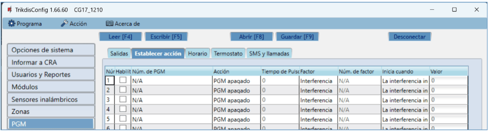

- **Núm.** – número de salida en la lista.
- **Habilitar** – habilita la PGM.

- **Núm. de PGM** – indique la salida OUT, que será controlada por los eventos indicados en las columnas “**Factor**”, “**Núm. de factor**”, “**Inicia cuando**”, “**Valor**”.

- **Acción**:
- **PGM apagado** – desactivar la salida PGM.

- **PGM encendido** – habilitar salida PGM.

- **Pulse apagado** – habilite la salida OUT durante la duración del pulso (después de recibir un comando, la salida se activa durante la duración del pulso y luego se apaga)**.**

- **Pulse encendido** – apagando la salida OUT durante la duración del pulso (después de recibir un comando, la salida se apaga durante la duración del pulso y luego se enciende).
- **Tiempo de Pulso, s** – Se establece la duración del pulso de operación (0-9999 segundos).
- **Factor/ Núm. de Factor** – la condición se establece (*Entrada, Temperatura, Horario, Interferencia, Problema del sensor de temperature, iButton llave, Armar, Desarmar, SMS recibido*), que determinará la inclusión de la salida OUT.
- Puede asignar un horario a una salida para activar la salida en momentos específicos. En la pestaña „**Horario**“, puede preparar 10 horarios.
- **Inicia cuando** – puede establecer una condición adicional para activar la salida OUT dependiendo del evento “**Factor**”.

- **Valor** – dependiendo de la condición seleccionada en la columna “**Factor**” (SMS recibido, Sensor), puede establecer el valor (texto del mensaje SMS entrante o especificar el valor de voltaje o temperatura) que se utilizará para controlar la salida PGM.

El texto del mensaje SMS se puede resaltar con un signo de %. El símbolo % separa la palabra clave PGM de todo el texto SMS.

**%.....%** - la parte de texto de un mensaje SMS entrante debe coincidir con el texto ingresado entre % símbolos (ejemplo: **%sMS%**. En el mensaje SMS el texto debe contener el texto "**sMS**". Ejemplo de mensaje SMS: **1155sMS332**)

**.....%** - el inicio del texto del mensaje SMS entrante debe coincidir con el texto grabado antes del símbolo % (ejemplo: **sMS%**. El texto del mensaje SMS debe iniciar el texto "**sMS**". Ejemplo de mensaje SMS: **sMS332**).

**%.....** - el final del texto del mensaje SMS entrante debe coincidir con el texto grabado después del símbolo % (ejemplo: **%sMS**. El texto del mensaje SMS debe finalizar el texto "**sMS**". Ejemplo de mensaje SMS: **1155sMS**).

Las letras mayúsculas y minúsculas son importantes en los mensajes SMS.

**Pestaña de parámetros “Horario”**

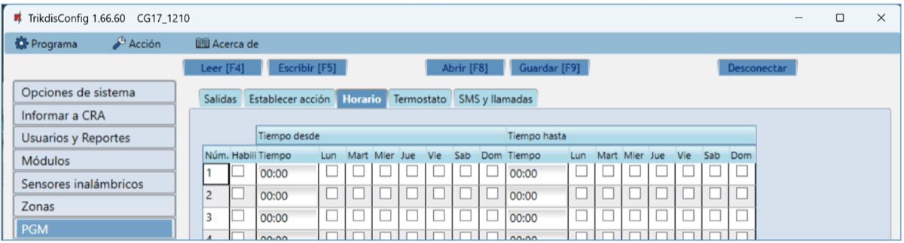

- **Núm.** – número de horario en la lista.

- **Habilitar** – habilitar el horario.

- **Tiempo desde** – establecer la hora en que se activará OUT (hora de inicio Horario).

- **Tiempo hasta** – configure la hora en que se apagará OUT (hora de finalización Horario).
- **Lun – Dom** – puede marcar los días de la semana en que OUT deberá activarse / desactivarse.

**Pestaña de parámetros “Termostato”**

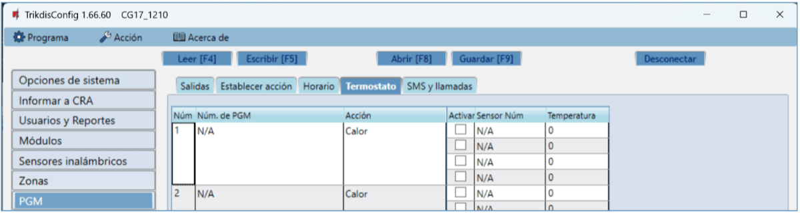

- **Núm.** – número del termostato en la lista.

- **Núm. de PGM** – especifique el número de la salida PGM que controlará el termostato.

- **Acción** – especificar el modo de funcionamiento del termostato: calor o frío.

- **Activar** – Si la casilla está marcada, el termostato funcionará con el sensor de temperatura elegido de acuerdo con la temperatura establecida.

- **Sensor Núm.** – asignar un sensor de temperatura a un termostato.

- **Temperatura** – establecer la temperatura que mantendrá el termostato.

**Pestaña de parámetros “SMS y llamadas”**

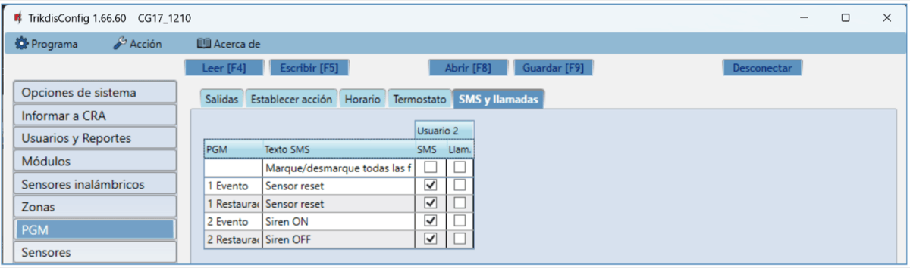

Esta ventana solo aparecerá si se ha agregado al menos un número de teléfono de usuario a la ventana " Usuarios y Reportes".

- **PGM** – indica el número de salida y el tipo de evento Evento/Restauración (Evento - enciende la salida OUT / Restauración - apaga la salida OUT).

- **Texto SMS** – texto del evento (Evento/Restauración) de la salida OUT, que se incluirá en el mensaje SMS.

- **Usuario / SMS y Llamada** – elija cómo (por mensaje SMS y/o llamada) se informará al usuario acerca de activar/desactivar la salida.

### Ventana “Sensores” 

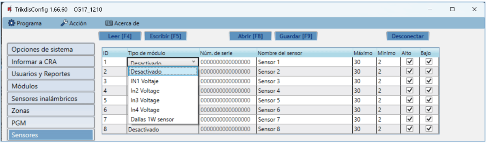

- **ID** – número del sensor en la lista.

- **Tipo de módulo** – sensor de temperatura (CG17 detecta automáticamente los sensores de temperatura conectados).

- **Núm. de serie –** número de serie del sensor de temperatura leído por el panel de control.

- **Nombre del sensor** – dar un nombre al sensor de temperatura.

- **Máximo** – cuando la temperatura es más alta que esta configuración, se generará un mensaje de evento. Para que se genere un mensaje de evento, la casilla “**Alto**” debe estar marcada.

- **Minimo** – cuando la temperatura es inferior a esta configuración, se generará un mensaje de evento. Para que se genere un mensaje de evento, la casilla “**Bajo**” debe estar marcada.

### Ventana “Eventos de sistema” 

**Pestaña de parámetros “Eventos”**

- **ID** – número de evento en la lista.

- **Nombre de evento** – nombre del evento.

- **Habilitar** – marque la casilla para permitir el envío de un mensaje de evento.

- **CRA/Prot.** – los mensajes sobre el evento elegido se enviarán al CRA y / o a la nube Protegus.

- **Codigo CID** – código CID del evento.

- **SMS texto del evento** – texto de mensaje SMS de evento.

- **SMS texto de restauración** – Texto del mensaje SMS del evento de restauración.

**Pestaña de parámetros “SMS y llamadas”**

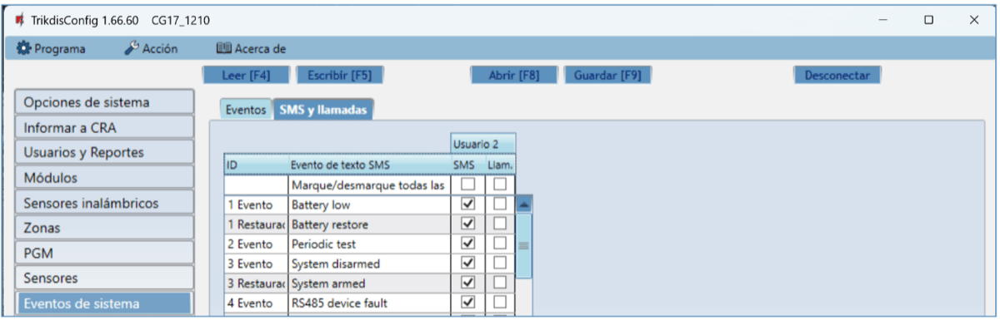

Esta ventana solo aparecerá si se ha agregado al menos un número de teléfono de usuario a la ventana " Usuarios y Reportes".

- **ID** – número de evento y palabra de identificación (Evento, Restauración).

- **Evento de texto SMS** – texto que se usará en mensajes SMS de eventos.

- **Usuario / SMS y Llamada** – elija cómo informar a los usuarios sobre cada tipo de evento, a través de mensajes **SMS** y/o **Llamadas** telefónicas.

### Ventana “Registro de Eventos” 

- **Leer Registro** botón – para leer las entradas del diario de eventos desde la memoria del dispositivo.

- **Borrar Registro** botón – para borrar las entradas del diario de eventos de la memoria del dispositivo.

- Puede encontrar el “**Número de evento**”, “**Tiempo**”, “**Código CID**”, “**Definición de evento**” en la tabla. Se pueden mostrar hasta 1000 eventos guardados en la memoria del CG17 en el registro de eventos.

### Restauración de la configuración de fábrica 

Para “**Restaurar**” la configuración de fábrica, es necesario hacer clic en el botón Restaurar en la ventana TrikdisConfig.

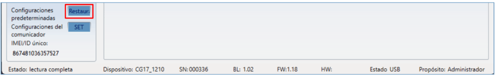

## Control remote 

### Control con la aplicación Protegus2 

Los usuarios de Protegus2 pueden controlar su sistema de seguridad de forma remota. También pueden ver el estado del sistema y recibir notificaciones sobre eventos del sistema.

1.  Descargue y abra la aplicación Protegus2 o utilice la versión de navegador de internet: [www.protegus.app](https://www.protegus.app)<u>.</u>

    

      
      
      
    

2. Inicie sesión con su nombre de usuario y contraseña o regístrese para crear una nueva cuenta.

2.  De clic en agregar un nuevo sistema e ingrese el número de *CG17* “ID únique/IMEI”. Este número puede ser encontrado en el dispositivo y en la etiqueta del empaque.

!!! note
    Al agregar el CG17 a Protegus2:
    
    1.  El servicio en la nube Protegus debe estar habilitado. La
        activación del servicio se describe en el capítulo 4.4 Ventana
        "Usuarios y Reportes" (Grupo de opciones de "Aplicación en la
        Nube");
    
    2.  Se debe insertar una tarjeta SIM activada y se debe ingresar o
        deshabilitar el código PIN;
    
    3.  La fuente de alimentación está conectada (el LED de "**POWER**" debe
        iluminarse de color verde);
    
    4.  Debe estar conectado a la red (el LED "**NETWORK**" debe ser verde
        fijo y parpadear en amarillo).
    
    Si el LED de "**NETWORK**" o "**DATA**" se ilumina de color amarillo, el
    producto a fallado en su intento de conexión con la red celular y/o
    Protegus2.
#### Armado/Desarmado del sistema de alarma con Protegus2 

1.  Vaya a la aplicación *Protegus2* y en la ventana del sistema presione el botón "ARM”.

2.  En el menú, seleccione el modo que desea activar e ingrese el código de usuario.

3.  Cuando el sistema cambia el modo, el icono de "ARM" también cambiará.

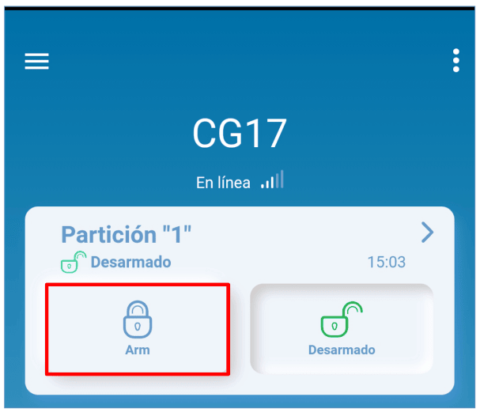

#### Agregar otros usuarios a Protegus2 

| Inicie la aplicación Protegus2 en su teléfono. Inicie sesión con su nombre de usuario y contraseña. Haga clic en “Configuración”. |  |
|-----------------------------------------------------------------------------------------------------------------------------------|--|
| Haga clic en “Configuración del sistema”. |  |
| Haga clic en “Usuarios”. |  |
| Haga clic en “Añadir nuevo usuario”. |  |
| Ingrese la dirección de correo electrónico o el nombre de usuario. Ingrese el número de teléfono del usuario. Ingrese el código. Seleccione la Partición que administrará el usuario. Marque la salida PGM que controlará el usuario. Haga clic en “Añadir usuario”. |  |
| Aparece un nuevo usuario en la lista de usuarios. Haga clic en “Inicio” para volver a la ventana principal. |  |
|  |  |

### Gestión del equipo de SMS 

1.  **Arme o desarme el sistema de seguridad con comandos SMS**

> #### ARM xxxxxx SYS:x
>
> #### DISARM xxxxxx SYS:x

| xxxxxx | Contraseña de administrador de 6 símbolos (predeterminada: 123456) |
|----|----|
| ***x*** | Número de área del sistema de seguridad (1-8) |

1.  **Cambiar la contraseña del administrador**

Por razones de seguridad, cambie la contraseña de administrador de SMS de fábrica. Envía el siguiente mensaje SMS:

#### PSW 123456 xxxxxx

| 123456 | Contraseña de administrador predeterminada      |
|--------------|-------------------------------------------------|
| xxxxxx | Nueva contraseña de administrador de 6 símbolos |

1.  **Permitir que otros usuarios controlen**

El sistema puede controlarse mediante números de teléfono que figuran como usuarios. El usuario puede controlar el sistema de mensajes SMS o llamadas telefónicas. Desde el teléfono del administrador, envíe un mensaje SMS en el siguiente formato para agregar un usuario:

#### SETN xxxxxx PHONEx=+PHONENR#NAME

| *xxxxxx* | Contraseña de administrador de 6 símbolos |
|----|----|
| *x* | Número de usuario en la lista. (Si escribe 1 como número de usuario, transferirá sus derechos de administrador a otro usuario). |
| *PHONENR* | Número de teléfono del usuario |
| *NAME* | Nombre de usuario |

1.  **Restablecer los detectores de humo**

Restablezca los detectores de humo de forma remota mediante un mensaje SMS:

#### FRS xxxxxx

!!! note
    Contraseña de administrador de 6 símbolos
!!! note
    La salida OUT a la que están conectados los sensores de incendio debe
    tener configurado el tipo "Sensor de fuego reiniciado". La salida 5
    OUT tiene este tipo de conjunto establecido de forma predeterminada.
#### Lista de comandos de SMS

| Comando | Dato | Descriptión |
|---------|------|-------------|
| INFO |  | Solicitar información sobre el controlador. El tipo de controlador, el número IMEI, el número de serie y la versión del firmware se incluirán en la respuesta. / Por ejemplo: INFO 123456 |
| RESET |  | Reinicie el dispositivo. Por ejemplo: RESET 123456 |
| OUTPUTx | ON | Encienda una salida, "x" es el número de salida. / Por ejemplo: OUTPUT1 123456 ON |
|  | OFF | Apague una salida, "x" es el número de salida. / Por ejemplo: OUTPUT1 123456 OFF |
|  | PULSE=ttt | Encienda una salida durante un tiempo específico: "x" es el número de salida OUT y "ttt" es un número de tres dígitos que especifica el tiempo de pulso en segundos. Por ejemplo: OUTPUT1 123456 PULSE=002 |
| PSW | Nueva contraseña | Cambiar contraseña. Por ejemplo: PSW 123456 654123 |
| TIME | YYYY/MM/DD,12:00:00 | Establecer fecha y hora. Por ejemplo: TIME 123456 2018/01/03,12:23:00 |
| TXTA | Nombre del objeto | Registro de nombre de objeto. Por ejemplo: TXTA 123456 House |
| TXTE | Z1= / ........ / Z12= | Mensaje SMS de alarma de zona personalizada: Z1 ... Z12 - ingrese el número de zona. Por ejemplo: TXTE 123456 Z1=ALARM in Zone1 |
| TXTR | Z1= / ........ / Z12= | Personalizar texto de restauración de zona: Z1 ... Z12 - ingrese el número de zona. Por ejemplo: TXTR 123456 Z1=Restore Zone1 |
| RDR | PhoneNR#SMStext | Reenviar mensajes SMS al número especificado. El número de teléfono debe comenzar con un signo "+" y un código de país internacional. / Por ejemplo: RDR 123456 +37061234567#forwarded text |
| ASKI |  | Enviar mensaje SMS sobre estados de entradas IN. / Por ejemplo: ASKI 123456 |
| ASKO |  | Enviar mensaje SMS sobre estados de salidas OUT. / Por ejemplo: ASKO 123456 |
| ASKT |  | Enviar mensaje SMS con valores de todos los sensores de temperatura. / Por ejemplo: ASKT 123456 |
| DISARM | SYS:x | Desarme el panel de control, "x" es el número de área (1-8). / Por ejemplo: DISARM 123456 SYS:1 |
| ARM | SYS:x | Arme el panel de control, "x" es el número de área (1-8). / Por ejemplo: ARM 123456 SYS:1 |
| FRS |  | Restablece la salida del sensor de fuego, si la salida OUT tiene asignada la función "Sensor de fuego reiniciado". Por ejemplo: FRS 123456 |
| SETN | PhoneX=PhoneNR# Nombre | Agregue un número de teléfono, nombre de usuario y asígnelo al usuario "x". "X" es la línea del número de teléfono en la lista. El número de teléfono debe comenzar con un símbolo "+" y un código de país internacional. El número de teléfono y el nombre de usuario deben estar separados por un símbolo #. / Por ejemplo: SETN 123456 PHONE5=+37061234567#JOHN |
|  | PhoneX=DEL | Eliminar el número de teléfono y el nombre del usuario. / Por ejemplo: SETN 123456 PHONE5=DEL |
| UUSD | *Uusd code# | Envía un código UUSD al operador. Por ejemplo: UUSD 123456 *245# |
| CONNECT | Protegus=ON | Conéctese al servicio en la nube Protegus. / Por ejemplo: CONNECT 123456 PROTEGUS=ON |
| CONNECT | Protegus=OFF | Desconectarse del servicio en la nube Protegus. / Por ejemplo: CONNECT 123456 PROTEGUS=OFF |
| CONNECT | Code=123456 | Código de servicio en la nube Protegus. Por ejemplo: CONNECT 123456 CODE=123456 |
| CONNECT | IP=0.0.0.0:8000 | Especifique el TCP IP y el puerto del canal de conexión del servidor principal. Por ejemplo: CONNECT 123456 IP=0.0.0.0:8000 |
| CONNECT | IP=0 | Para apagar el canal principal. Por ejemplo: CONNECT 123456 IP=0 |
| CONNECT | ENC=123456 | Clave de cifrado TRK. Por ejemplo: CONNECT 123456 ENC=123456 |
| CONNECT | APN=Internet | Nombre APN. Por ejemplo: CONNECT 123456 APN=INTERNET |
| CONNECT | USER=user | Usuario APN. Por ejemplo: CONNECT 123456 USER=User |
| CONNECT | PSW=password | Contraseña APN. Por ejemplo: CONNECT 123456 PSW=Password |
| SETHx | Ty=45 | Los ajustes son para el termostato "x". "X" es el número del termostato, que puede ser 1,2,3,4. |
| SETHx | Sy=2 | Establece la temperatura del modo „y“ (se pueden asignar 4 modos). / Por ejemplo (asigne el primer termostato al segundo modo a + 45oC): / SETH1 123456 T2=45 |
| SETHx | O=1 | Establece el número del sensor de temperatura en modo „y“ (se pueden asignar 4 modos) mediante el cual se realizará la medición. / Por ejemplo (asigne 2 sensores de temperatura al segundo termostato para el primer modo): SETH2 123456 S1=2 |
| SETHx | A=2 | Al termostato se le asigna una salida OUT (debe establecerse en una salida OUT de "Control remoto" o "Termostato"). Por ejemplo (asignar primera salida al primer termostato): SETH1 123456 O=1 |
| SETHx | M=C | Especifica el sensor de temperatura de funcionamiento del termostato (seleccione uno de los cuatro sensores de temperatura de funcionamiento del termostato especificados). Por ejemplo (asigne el primer termostato al tercer sensor de temperatura del termostato): SETH1 123456 A=3 |
| SETHx |  | El modo de funcionamiento del termostato está configurado: C - enfriamiento; H - calentamiento. Por ejemplo (establecer el modo de enfriamiento para el primer termostato): SETH1 123456 M=С |
| SETHx |  | Un solo mensaje SMS puede cambiar una o más configuraciones. Las configuraciones individuales están separadas por comas. / Por ejemplo: SETH2 123465 T2=55,S3=5,A=3,O=1,M=H / Para el segundo termostato, configure una segunda temperatura de + 55oC; el tercer modo funcionará de acuerdo con el sensor de temperatura 5; un sensor de temperatura del modo 3 estará activo; asignado a la salida de control 1 OUT; modo de funcionamiento del termostato calefacción. |
| ASKH |  | Envía la configuración de todos los termostatos a través de SMS. La información básica es si el termostato está encendido, enfriando o calentando, el número del modo de termostato activo y los valores para todas las temperaturas establecidas. Por ejemplo: ASKH 123456 |

### Control mediante llamada telefónica

!!! note
    Si no se han agregado usuarios al sistema, el primero en llamar al
    CG17 se convertirá en el administrador del sistema y será el único
    que pueda controlar el CG17 mediante llamadas telefónicas y
    comandos SMS. / Si desea permitir que otros usuarios controlen el
    sistema mediante llamadas telefónicas, agréguelos con
    TrikdisConfig o con comandos SMS.
**Comandos de control de llamadas telefónicas *CG17***

Control de salidas OUT utilizando llamadas telefónicas:

1.  Si el sistema de seguridad tiene 1 área o el usuario no tiene asignado el derecho de controlar las salidas: llame al CG17 y el controlador rechazará la llamada. El modo de protección del sistema de seguridad cambiará al estado opuesto.

2.  Si al usuario se le asigna el derecho de controlar las salidas OUT y la salida OUT se le asigna el tipo "Control remoto" (usando TrikdisConfig), o el sistema de seguridad CG17 tiene 2 o más áreas: llame al CG17. El *CG17* responderá la llamada y puede marcar comandos usando el teclado del teléfono (consulte la tabla a continuación).

    **Lista de comandos del teclado del teléfono móvil**

| Botones del teclado | Función | Descripción |
|---------------------|---------|-------------|
| [1] | Cambiar modo de protección | Cambia el modo de protección al opuesto al actual. Por ejemplo: 1 |
| [2][salida núm.][#][estado núm.][*] | Control de salida seleccionada OUT | Controla una salida especificada OUT. Estado: [0] – apague la salida; [1] – habilitar salida; [2] – apagar durante la duración del pulso; [3] – encender durante la duración del pulso; (el tiempo de pulso se especifica en el software TrikdisConfig, tabla "PGM") [*] – este símbolo muestra el final del comando. Por ejemplo (encienda la salida 5OUT): 21#1* Por ejemplo (active la salida 6OUT para el Tiempo de pulso especificado en la tabla "PGM" de TrikdisConfig): 22#3* |
| [6][área núm.][#] | Encender el área seleccionada del sistema de seguridad | Por ejemplo (habilitar 2 áreas del panel de control): 62# |
| [7][área núm.][#] | Desarme el área del sistema de seguridad | Por ejemplo (desarmado 1 área del control de panel): 71# |

### Establecer parámetros de forma remota 

!!! note
    La configuración remota solo funcionará cuando:
    
    1.  El servicio en la servicio Protegus está habilitado. La
        activación del servicio se describe en el capítulo 4.4 Ventana
        "Usuarios y Reportes" (grupo de configuración "Aplicación en la
        Nube");
    
    2.  Se inserta una tarjeta SIM activada y se ingresa o deshabilita el
        código PIN;
    
    3.  La alimentación está encendida (el LED "POWER" es verde fijo);
    
    4.  Está conectado a la red (el LED "NETWORK" es verde fijo y parpadea
        en amarillo).
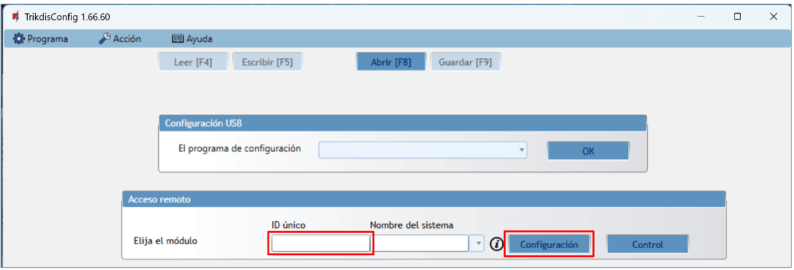

1.  Descargue el software TrikdisConfig de www.trikdis.com .

2.  Asegúrese de que el controlador esté conectado a Internet y que la conexión con Protegus esté habilitada.

3.  Inicie el software de configuración TrikdisConfig y en el campo "**ID único**" del grupo "**Acceso remoto**" ingrese el número IMEI de su CG17 (el número IMEI se puede encontrar en las etiquetas en la parte posterior del dispositivo y en el paquete).

4.  (Opcional) En el campo "**Nombre del sistema**" asigne un nombre al CG17 con este IMEI.

5.  Presione “**Configuración**”.

6.  Haga clic en el botón **Leer [F4]** y el programa leerá los valores de los parámetros establecidos actualmente en el CG17. Si aparece una ventana para ingresar el código de administrador, ingrese el código de administrador de 6 símbolos. Si desea que el programa recuerde el código, marque la casilla junto a “**Recordar contraseña”** y haga clic en el botón **Escribir [F5].**

7.  Realice los cambios deseados en la configuración del CG17 y haga clic en **Escribir [F5]**. Si desea desconectarse del CG17, haga clic en “**Desconectar**” y salga del programa TrikdisConfig.

### Control remoto con TrikdisConfig

1.  Descargue el software de configuración TrikdisConfig de www.trikdis.com/ (ingrese “TrikdisConfig” en el campo de búsqueda) e instálelo.

2.  Asegúrese de que el panel de control esté conectado a Internet. El servicio en la nube Protegus debe estar habilitado.

3.  Inicie el software de configuración TrikdisConfig y en el campo “**ID único**” del grupo de acceso remoto ingrese el número IMEI de su CG17 (el número IMEI se puede encontrar en las etiquetas en la parte posterior del dispositivo y en el paquete).

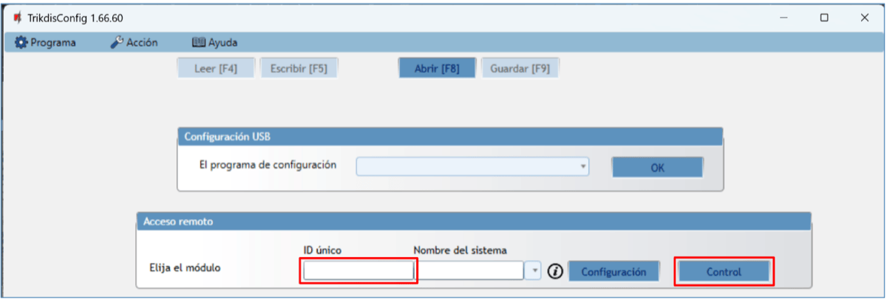

1.  Presione “**Control**”**.**

2.  Ingrese el “**Código de autoservicio**” (código predeterminado - 123456) y presione el botón “**OK**”.

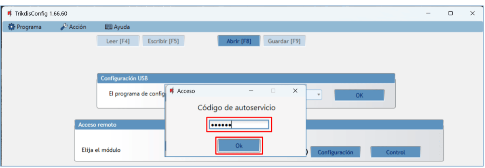

3. Se abre la ventana "**Control remoto**", donde puede controlar las “**Particiones**” del panel de control, controlar los estados de la “**Zona**”, controlar las “**Salidas PGM**” y controlar la “**Temperatura**”.

2.  Pestaña “**Particiones**”. Presione el botón “**DESARMAR**” (o “**ARMAR**”) e ingrese el código de usuario y el área del panel de control de seguridad será “**DESARMAR**” (o “**ARMAR**”).

3. Pestaña “**Zonas**”. Esta ventana muestra el estado de las zonas. El “**Bypass**” de zona se puede activar.

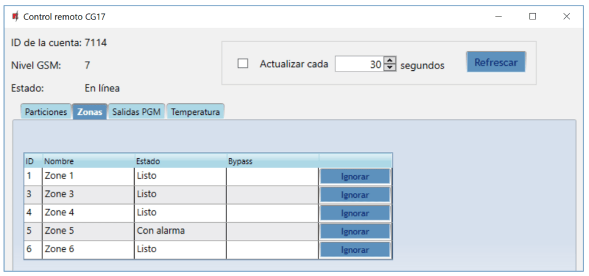

4. Pestaña de “**Salidas PGM**”. En esta ventana, puede controlar las “**Salidas PGM**” que están configuradas en “**Control remoto**”.

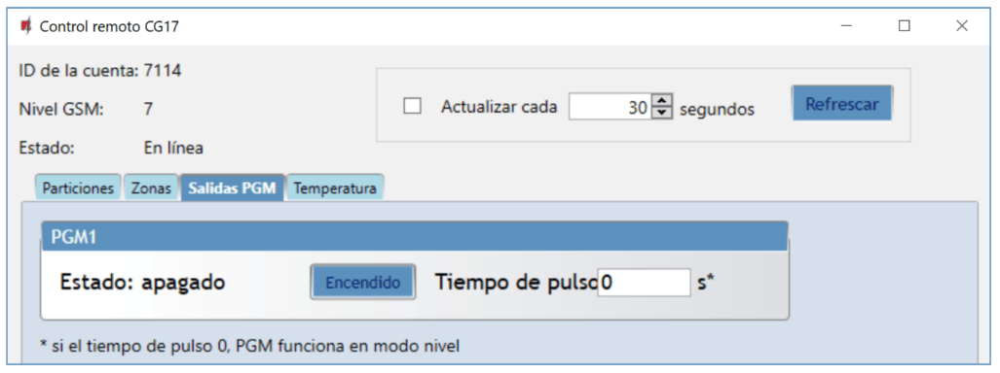

10. Pestaña de “**Temperatura**”. En esta ventana, puede controlar las lecturas de los sensores de temperatura.

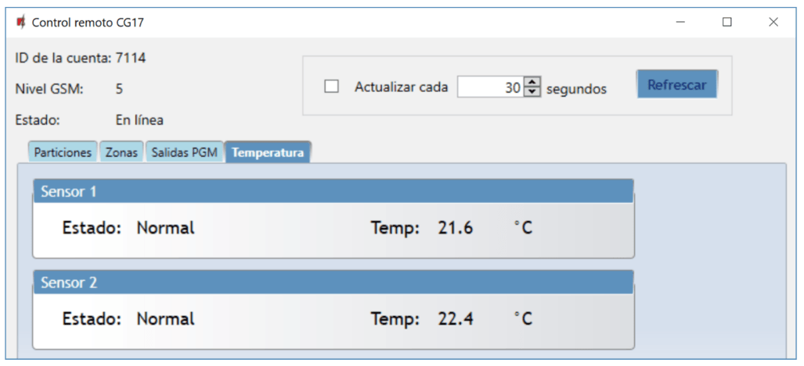

## Desempeño de la Prueba 

Después de la instalación y configuración, realice una prueba del sistema:

1.  Compruebe si la alimentación está encendida;

2.  Verifique la conectividad de la red (indicador de “NETWORK”): la intensidad suficiente de la señal GSM es el nivel 5 (verde sólido durante 4 segundos y cinco destellos amarillos). La intensidad suficiente de la señal 3G es el nivel 3 (sólido verde durante 4 segundos y tres destellos amarillos). Si la luz roja “TROUBLE” parpadea 5 veces, busque otro lugar para montar el CG17;

3.  Para probar las entradas del CG17, actívelas y verifique si los mensajes correctos llegan a los destinatarios;

4.  Para probar las salidas del CG17, actívelas de forma remota y compruebe si los mensajes correctos llegan a los destinatarios y las salidas se activan correctamente;

5.  Pruebe la alarma para asegurarse de que la estación central de monitoreo acepte los eventos correctamente.

## Actualización del firmware 

!!! note
    Cuando el CG17 esté conectado a TrikdisConfig, el programa
    ofrecerá actualizar el firmware del dispositivo si es que hay alguna
    actualización disponible. Las actualizaciones requieren una conexión al
    internet. / Si hay un antivirus instalado en su computadora, puede que
    este bloquee la opción de actualización de firmware. En este caso usted
    debe reconfigurar su software de antivirus.
El firmware del CG17 puede ser actualizado o cambiado de forma manual. Después de una actualización, el CG17 comunicador mantendrá cualquier opción establecida. Cuando escriba el firmware de forma manual, este puede ser cambiado a una versión más reciente o antigua. Para actualizar:

1.  Abra ***TrikdisConfig**.*

2.  Conecte el CG17 a través de cable USB a la computadora o conéctese al CG17 de forma remota. Si existe una versión más nueva del firmware, el software ofrecerá descargar el archivo de la versión más nueva del firmware.

3.  Seleccione la parte de “**Firmware**” del menú.

    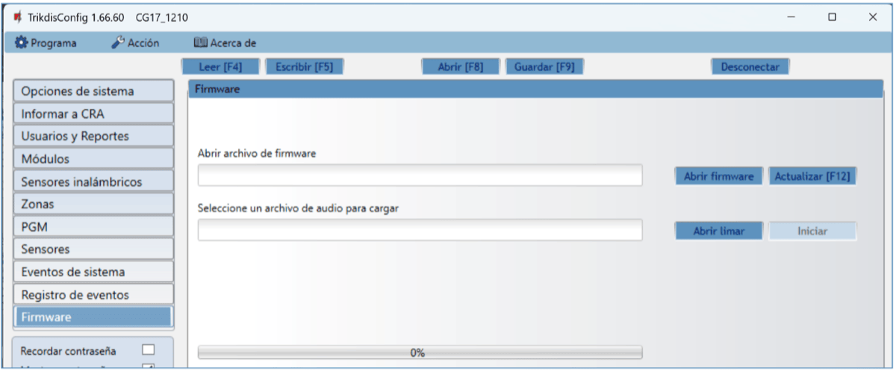

4.  Presione “Abrir firmware” y seleccione el archivo de firmware requerido. Si no tiene el archivo, el archivo de la versión más nueva del firmware puede ser descargado por usuario registrado desde [www.trikdis.com](http://www.trikdis.com), bajo la sección de descargar del CG17.

5.  Presione **Actualizar [F12]**.

6.  Espere a que se complete la actualización.

## Celular panel de control CG17

## Precauciones de seguridad 

El sistema electrónico de protección contra intrusos solo puede ser instalado y reparado exclusivamente por personal técnico cualificado.

Lea detenidamente este manual antes de la instalación para evitar errores que puedan provocar un mal funcionamiento del dispositivo o incluso dañarlo.

Desconecte siempre el dispositivo de la fuente de alimentación antes de conectarlo a la red eléctrica.

Cualquier cambio, modificación o reparación del producto realizada por alguien que no sea el fabricante anulará la garantía del fabricante.

Siga las reglas de clasificación de residuos y no deseche los componentes del equipo no utilizados junto con otros residuos domésticos.
