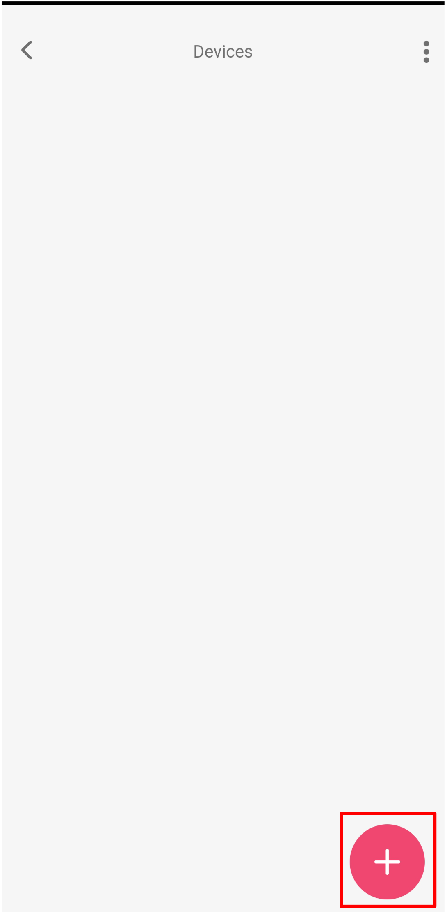
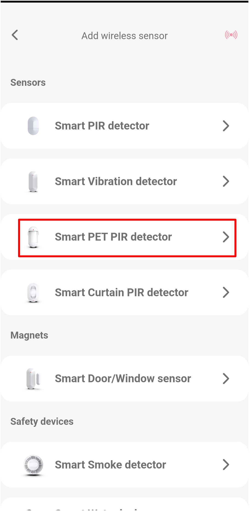
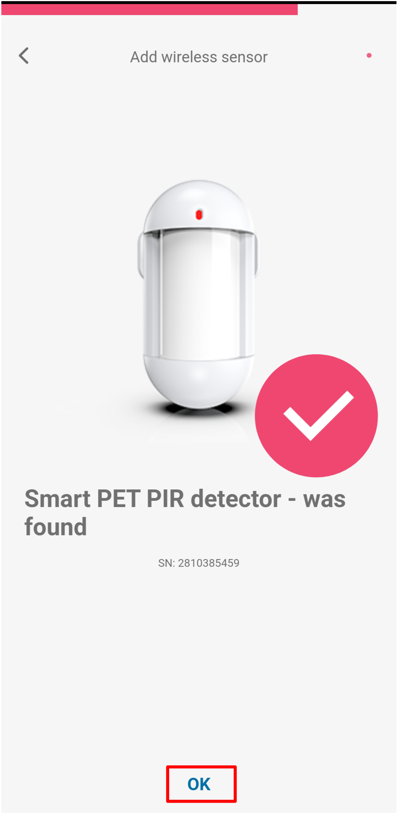
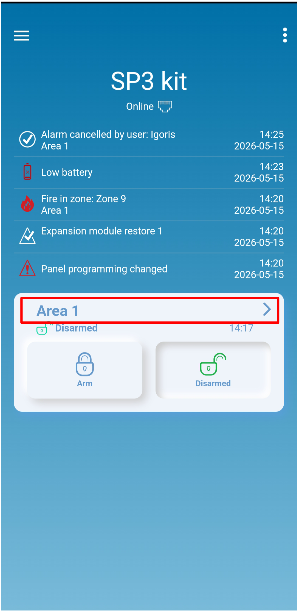
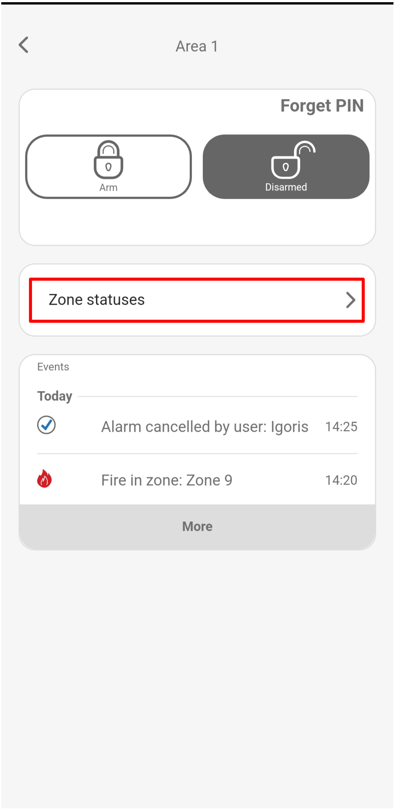
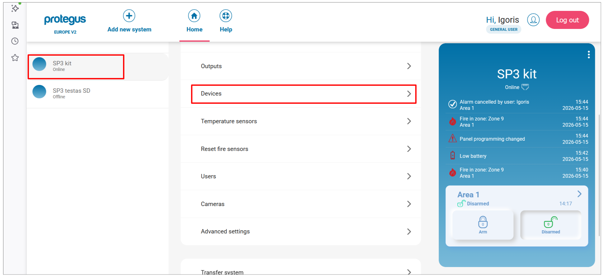
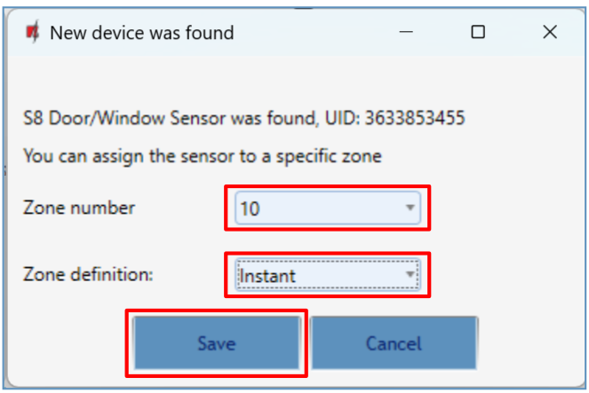

# Añadir sensores inalámbricos S8/S9 a FLEXi SP3

{ .trik-hero-img }

> [!NOTE]
> **Idioma de las capturas:** las interfaces de Protegus y TrikdisConfig de esta guía se muestran en inglés. Los nombres en negrita de botones y menús de los pasos coinciden con las etiquetas en inglés de las capturas.

Vincule sensores inalámbricos S8 (detectores PIR, contactos magnéticos para puertas y ventanas, detectores de humo, sirenas y mandos a distancia) al panel de control FLEXi SP3. Elija el método de configuración.

> [!IMPORTANT]
> **Requisito de firmware:** para admitir sensores inalámbricos S8, el FLEXi SP3 debe ejecutar el firmware de revisión 4 (`SP3_xxx4_0122.fw`, versión 1.22 o posterior).

> [!NOTE]
> **Requisito de hardware:** antes de vincular sensores, conecte el transceptor RF-S8 al bus RS485 del SP3 – consulte la [sección 3.13, diagrama de cableado del receptor RF-S8](index.md) – y regístrelo en la pestaña Módulos de TrikdisConfig.

**Antes de empezar: prepare los sensores** (se aplica a todos los métodos):

- Si un sensor se vinculó anteriormente a cualquier panel, desvincúlelo primero: mantenga pulsado el **botón de aprendizaje durante 5 segundos** y suéltelo cuando el indicador parpadee **tres veces en verde**.
- Inserte las pilas en todos los sensores que vaya a vincular.
- Durante la vinculación, mantenga el transceptor RF-S8 **a una distancia mínima de 1 m** de los sensores.

---

=== "Protegus móvil"

    La aplicación Protegus debe estar instalada en el teléfono y el sistema SP3 ya debe estar añadido a su cuenta.

    1. Abra la aplicación Protegus y seleccione el sistema **SP3 kit**. Toque **⋮** en la esquina superior derecha.

        { .trik-mob-img }

    2. Toque **System configuration**.

        { .trik-mob-img }

    3. Toque **Devices**.

        { .trik-mob-img }

    4. Toque el botón **+** para añadir un sensor nuevo.

        { .trik-mob-img }

    5. Seleccione el tipo de sensor que desea vincular (por ejemplo, **Smart PET PIR detector**).

        { .trik-mob-img }

    6. La aplicación muestra el sensor en modo **Learning** con un diagrama del botón de aprendizaje. **Mantenga pulsado el botón de aprendizaje** hasta que el indicador verde permanezca encendido durante 2 segundos.

        { .trik-mob-img }

    7. Cuando se detecta el sensor, aparece una confirmación con su número de serie. Toque **OK**.

        { .trik-mob-img }

    8. El sensor aparece en la lista con una etiqueta **NEW**. Toque el sensor para abrir sus ajustes.

        { .trik-mob-img }

    **Configure los ajustes de zona:**

    9. Toque **Zone settings** para desplegar la sección.

        { .trik-mob-img }

    10. Configure **Definition** (por ejemplo, 24 hours) y **Type** (por ejemplo, NO), y después toque **Confirm**.

        { .trik-mob-img }

    11. Para añadir otro sensor, toque **+** y repita los pasos 5–10. Cuando haya vinculado todos los sensores, toque **Next**.

        { .trik-mob-img }

    12. Un cuadro de diálogo confirma que la vinculación se ha realizado correctamente. Toque **Close**.

        { .trik-mob-img }

    **Compruebe el estado de las zonas:**

    13. En la pantalla de inicio del sistema, toque el mosaico **Area 1**.

        { .trik-mob-img }

    14. Toque **Zone statuses**.

        { .trik-mob-img }

    15. La pantalla **Zone status / bypass** muestra todas las zonas. Un icono de alerta rojo significa que el sensor está abierto o activado en ese momento. Los interruptores de bypass permiten desactivar temporalmente zonas individuales.

        { .trik-mob-img }

=== "Protegus web"

    Abra [web.protegus.app](https://web.protegus.app) en un navegador de escritorio. El sistema SP3 ya debe estar añadido a su cuenta.

    1. Seleccione el sistema SP3 en el panel izquierdo y, a continuación, haga clic en **Devices** en el menú del sistema.

        

    2. Haga clic en el botón **+** para añadir un sensor inalámbrico nuevo.

        

    3. Se abre el panel **Add wireless sensor** con todos los tipos de sensores compatibles. Haga clic en el tipo de sensor que desea vincular (por ejemplo, **Smart PET PIR detector**).

        

    4. La aplicación cambia al modo **Learning** y muestra el sensor con un diagrama que indica la ubicación del botón de aprendizaje.

        **Mantenga pulsado el botón de aprendizaje** hasta que el indicador verde permanezca encendido durante 2 segundos (aproximadamente 4–5 segundos).

        

    5. Cuando el panel detecta el sensor, aparece una confirmación con su número de serie. Haga clic en **OK**.

        

    6. El sensor aparece en la lista con una etiqueta **NEW**. Para añadir otro sensor, haga clic en **+** y repita los pasos 3–5. Cuando haya vinculado todos los sensores, haga clic en **Next**.

        

    7. Un cuadro de diálogo confirma que la vinculación se ha realizado correctamente. Haga clic en **Close**.

        

    **Configure los ajustes de zona:**

    8. En la lista **Devices**, haga clic en un sensor vinculado para abrir sus ajustes. Haga clic en **Zone settings** para desplegar la sección.

        

    9. Configure **Definition** (por ejemplo, Instant) y **Type** (por ejemplo, NO) para la zona.

        

    **Compruebe el estado de las zonas:**

    10. En la pantalla de inicio, haga clic en el mosaico **Area 1**.

        

    11. Haga clic en **Zone statuses**.

        

    12. El panel **Zone status / bypass** muestra todas las zonas. Un icono de alerta rojo en una zona significa que el sensor está abierto o activado en ese momento. Los interruptores de bypass permiten desactivar temporalmente zonas individuales.

        

=== "TrikdisConfig"

    Hay dos métodos: **remoto** (por red) o **local** (USB, sin necesidad de red).

    #### Vinculación remota

    Requisitos: tarjeta SIM activada con PIN desactivado, internet móvil activado en la SIM, servicio en la nube Protegus habilitado, SP3 encendido (**PWR** parpadeando en verde) y SP3 conectada a la red (**NET** en verde fijo y parpadeando en amarillo).

    > [!WARNING]
    > No registre ni desvincule sensores mientras el panel esté en modo de aprendizaje para otra operación. Antes de vincularlos, desvincule cada sensor: mantenga pulsado el botón de aprendizaje durante 5 s hasta que parpadee tres veces en verde. **Si un sensor se desvincula accidentalmente, deja de funcionar hasta que se vuelva a vincular.**

    1. Abra TrikdisConfig. En la sección **Remote access**, introduzca el **Unique ID** del panel (impreso en la etiqueta del dispositivo) y haga clic en **Configure**.

        

    2. Haga clic en **Read [F4]**. Introduzca el código de administrador o instalador si se le solicita.

    3. Vaya a **Wireless sensors** y haga clic en **Learn sensors**.

        

    4. Se abre el cuadro de diálogo **Learning mode**. Para cada sensor, mantenga pulsado el botón de aprendizaje durante 5 segundos hasta que parpadee **cuatro veces en verde**.

        

        

    5. Cuando se detecta un sensor, se abre el cuadro de diálogo **New device was found**. Configure **Zone number** y **Zone definition** (por ejemplo, Instant), y haga clic en **Save**.

        

    6. La línea de estado de Learning mode confirma que el dispositivo se ha registrado. Repita los pasos 4–5 para cada sensor adicional.

        

    7. Haga clic en **Stop learning**. Cuando se le solicite guardar los nuevos parámetros, haga clic en **Yes**.

        

    8. Haga clic en **Read [F4]**. La pestaña **Wireless sensors** muestra ahora todos los sensores registrados con sus números de serie.

        

    9. Abra la pestaña **Zones**. Confirme las asignaciones de zonas y áreas. Configure **Type** como `EOL-T` para habilitar la supervisión antimanipulación. Haga clic en **Write [F5]**.

        

    #### Vinculación local (sin red)

    El transceptor RF-S8 tiene un botón **LEARN** en su placa de circuito; utilícelo para entrar y salir del modo de aprendizaje sin ordenador.

    

    1. Confirme que el RF-S8 está registrado en el SP3 (visible en la lista de módulos después de configurar el firmware).
    2. Encienda el SP3.
    3. Retire la cubierta del RF-S8.
    4. Mantenga pulsado el botón **LEARN** del RF-S8 hasta que el LED NETWORK parpadee en verde/rojo. Suéltelo.
    5. Vincule cada sensor: mantenga pulsado su botón de aprendizaje durante 5 s hasta que parpadee cuatro veces en verde. El LED NETWORK se ilumina brevemente en verde después de cada vinculación correcta.
    6. Cuando termine, mantenga pulsado el botón **LEARN** del RF-S8 hasta que el LED NETWORK deje de parpadear. Suéltelo: el transceptor sale del modo de aprendizaje.
    7. Conecte USB Mini-B al SP3. Abra TrikdisConfig → **Read [F4]**.
    8. Confirme los números de serie en la pestaña **Wireless sensors**.
    9. Asigne las zonas y áreas en la pestaña **Zones** → **Write [F5]**.

    #### Eliminar un sensor inalámbrico

    1. Conéctese al SP3 (por USB o de forma remota) → **Read [F4]**.
    2. En **Wireless sensors**, configure el **Device type** del sensor como `Disabled`.
    3. Haga clic en **Write [F5]**.

---

## Referencia de LED: transceptor RF-S8

| LED | Estado | Significado |
|-----|--------|-------------|
| NETWORK | Parpadeando en verde/rojo | Modo de aprendizaje activo |
| NETWORK | Verde fijo (5 s) | Sensor registrado correctamente |
| POWER | Apagado | Sin tensión de alimentación |
| POWER | Parpadeando en verde | Funcionamiento normal |
| POWER | Parpadeando en amarillo | Tensión de alimentación baja (≤ 11,5 V) |
| POWER | Amarillo fijo | Sin comunicación RS485 con el SP3 |
