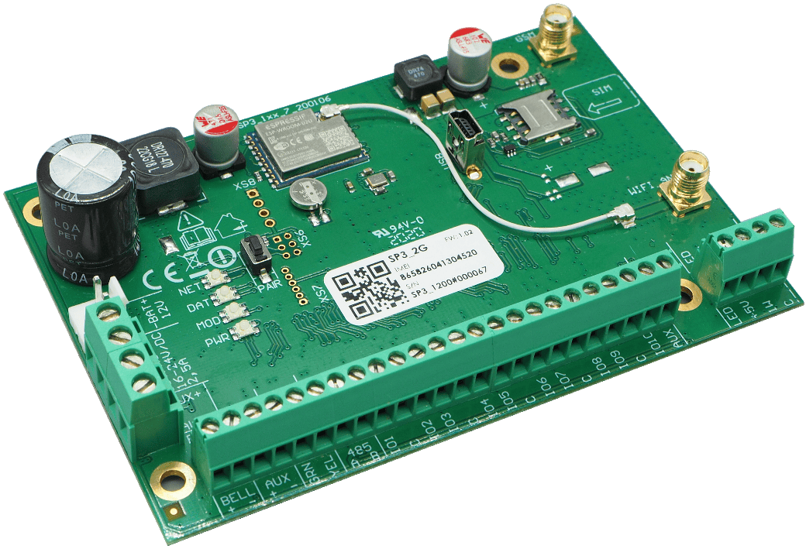
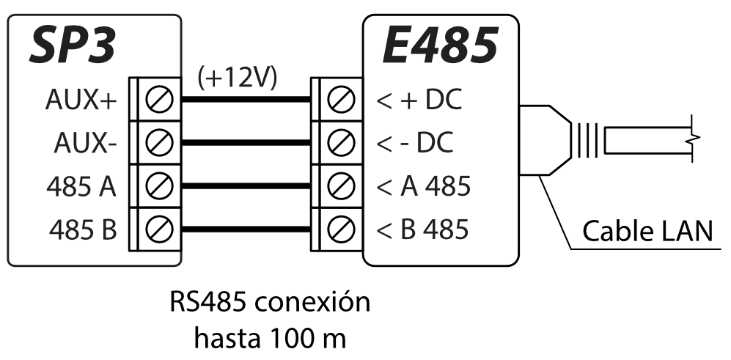
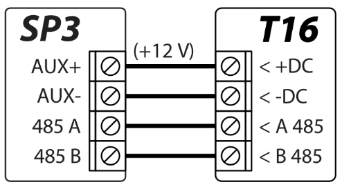
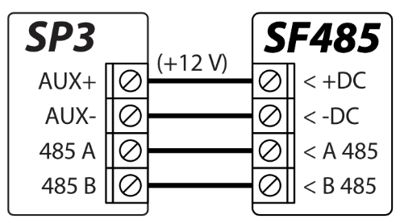
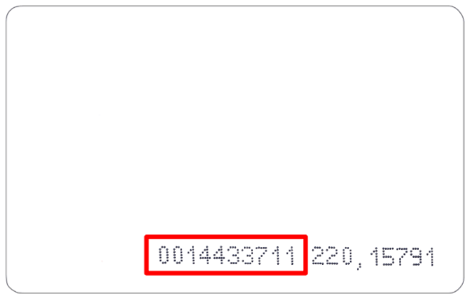

# El panel de control *„FLEXi“ SP3* es el procesador de un sistema de alarma contra incendios y de allanamiento (a las instalaciones) con un módulo WiFi incorporado y un módem celular 2G o 4G. El panel de control permite agrupar 32 alámbricas e inalámbricas en un sistema de 8 particiones. Los usuarios pueden cambiar los modos de protección para estas áreas de forma remota (por ejemplo, a través de la aplicación móvil Protegus2, SMS, llamadas telefónicas) y mediante el uso de varios dispositivos que permiten la identificación personal (por ejemplo, teclados alámbricos e inalámbricos, llaves electrónicas, tarjetas RFID, etc.). Después de cualquier evento del sistema, se enviará un informe a la estación central de monitoreo (CRA) y/o al servidor en la nube de Protegus a través de redes de internet usando WiFi, y/o a través de redes móviles usando una tarjeta SIM

## Descripción

El panel de control *„FLEXi“ SP3* es el procesador de un sistema de alarma contra incendios y de allanamiento (a las instalaciones) con un módulo WiFi incorporado y un módem celular 2G o 4G. El panel de control permite agrupar 32 alámbricas e inalámbricas en un sistema de 8 particiones. Los usuarios pueden cambiar los modos de protección para estas áreas de forma remota (por ejemplo, a través de la aplicación móvil Protegus2, SMS, llamadas telefónicas) y mediante el uso de varios dispositivos que permiten la identificación personal (por ejemplo, teclados alámbricos e inalámbricos, llaves electrónicas, tarjetas RFID, etc.). Después de cualquier evento del sistema, se enviará un informe a la estación central de monitoreo (CRA) y/o al servidor en la nube de Protegus a través de redes de internet usando WiFi, y/o a través de redes móviles usando una tarjeta SIM.

**¿Cuándo recomendamos implementar el panel de control „FLEXi“ SP3?**

- Cuando se establece un nuevo sistema de seguridad electrónico para instalaciones pequeñas o de tamaño medio que necesita tener zonas cableadas e inalámbricas, donde una compañía de seguridad seleccionada se ocupa de la protección, el personal especializado se encarga del mantenimiento técnico, mientras que toda la información del sistema está disponible para el propietario de las instalaciones en la forma más conveniente.

- Si el sistema de alarma actual de hasta 32 zonas no admite agregar, por ejemplo, zonas inalámbricas, agrupación de zonas y controles remotos, no hay opción para permitir que una compañía de seguridad se encargue de proteger las instalaciones, o no hay la facilidad para permitir que el propietario de las instalaciones o los miembros de su familia supervisen y controlen el sistema de alarma de forma remota con la aplicación móvil de Protegus2. En estos y muchos otros casos se debe reemplazar la placa del panel de control con la placa „FLEXi“ SP3 y establecer los valores nominales de todas las resistencias de los circuitos EOL (End-Of-Line) del sensor del sistema mientras se programa el „FLEXi“ SP3.

- Cuando el sistema de alarma necesita realizar otras funciones además de la protección de las instalaciones, por ejemplo, abrir puertas y portones, regar el césped, iluminar, calentar, ventilar, enfriar, controlar otros sistemas de forma remota y funciones automáticas de arranque y finalización.

- El *„FLEXi“ SP3* es insuperable en el mercado cuando se trata de guardar los datos móviles de la tarjeta SIM sin reducir el nivel de protección proporcionado por la compañía de seguridad, y ofrece la oportunidad al propietario de las instalaciones de controlar el sistema a través aplicación móvil de Protegus2.

**Características**

Transmite informes a la estación central de monitoreo (CRA) de la compañía de seguridad:

- Transmisión de informes de eventos utilizando el módulo WiFi incorporado (red WiFi), o con prioridad elegida entre la red WiFi y la tarjeta SIM, es decir, utilizando el módem 2G o 4G integrado.

- Es posible conectar otros módulos al *„FLEXi“ SP3* para enviar informes a través de Ethernet u ondas de radio VHF o UHF canal de comunicación Sigfox con prioridad elegida.

- Cualquier compañía de seguridad puede aceptar estos informes, siempre que su estación central de monitoreo incluya algún software moderno de TRIKDIS o un hardware receptor IP o un receptor IP que utilice el protocolo SIA DC-09 IP de otros fabricantes.

- Diseñado en base a dos décadas de experiencia en la transmisión de informes a los receptores de la estación de monitoreo central principal y auxiliar, lo que permite a las compañías de seguridad proporcionar el más alto nivel de protección a instalaciones con sistemas de alarma basados en el panel de control „FLEXi“ SP3.

- Una configuración para la necesidad de enviar al CRA, para enviar informes obligatorios primero al CRA, y luego a particulares.

- Posibilidad de enviar informes de eventos a dos estaciones centrales de monitoreo de diferentes compañías de seguridad.

- Una multitud de canales de transmisión de mensajes y múltiples configuraciones para la prioridad de transmisión.

**Transmite informes a particulares:**

- Se comunica con la aplicación móvil de Protegus2 a través de WiFi y, si la tarjeta SIM está insertada, a través de redes móviles. La aplicación advierte sobre eventos del sistema mediante notificaciones de sonido.

- Envía informes de eventos a través de mensajes SMS a 8 números telefónicos.

- Llama a 8 números telefónicos e informa sobre eventos con notificaciones de voz pregrabadas (Para panel de seguridad SP3_12xx con versión de firmware hasta 1.13 inclusivo).

- Activa remotamente el modo de protección seleccionado (Activar/Desactivar/Estancia/Suspensión).

- Control remoto de dispositivos conectados (sistema de iluminación, puertas automáticas, ventilación, calefacción, sistemas de riego, etc.).

- Detección remota de temperatura.

**Entradas y salidas (I/O):**

- 10 terminales de I/O, cada uno se puede configurar como terminal de entrada (IN) o salida (OUT). Tipos de entrada (IN): ATZ, EOL, NC, NO. Se pueden usar diferentes valores nominales de resistencias en los circuitos de tipo EOL y ATZ. El número de entradas IN se puede ampliar a 32 con el uso de teclados y módulos de expansión iO-8 e iO-WL.

- La placa cuenta con 2 salidas. BELL es para controlar la sirena, y LED es para controlar las luces indicadoras. El número de salidas se puede ampliar a 16 utilizando los módulos de expansión iO-8 e iO-WL. Siete configuraciones operativas de salida. A cada salida se le puede asignar una lógica operativa, un programa de operación preestablecido, cualidades, por ejemplo, modo termostato

- El bus de datos de un cable (1-Wire) es para conectar sensores de temperatura (hasta 8) o un sensor de temperatura y humedad (1) y un lector de mando a distancia (iButton).

- El bus de datos GRN-YEL es para conectar 8 teclados del mismo tipo.

- El bus de datos RS485 es para conectar: módulos expansores de la serie iO; Transmisor-receptor inalámbrico de sensor de onda de radio RF-SH; Módulo Ethernet E485; Transmisor de ondas de radio T16 VHF o UHF; módulo **Sigfox**.

**Control del sistema de alarma**

- 40 códigos de control del sistema de alarma (un código es de 4 dígitos). Es posible establecer la forma en que se debe ingresar el código de usuario para que se reconozca como un código de coacción, es decir, ingresar el código de usuario de esta manera desactivará la alarma, pero se enviará un informe especial al CRA indicando que la alarma fue desactivada como resultado de una coacción.

- Control con teclados: SK-LED TouchPad (Protegus SK232LED W), SK-LCD TouchPad (FLEXi SK232LCD); Paradox K636, K10H (V) K32 + LED, K32LED, K32LCD+, K35, TM50, TM70; Teclado Crow CR16, CR-LCD; Lector electrónico de claves CZ-Dallas (iButton); lector de llave electrónica TM17; Lector RFID (Wiegand 26/34).

- Control remoto: a través de llamada telefónica, mensaje SMS y aplicación móvil de Protegus2.

**Instalación simple:**

- Múltiples tamaños de kits de montaje para „FLEXi“ SP3 que incluyen un marco blanco decorativo de metal con un transformador reductor incorporado o fuente de alimentación de impulso.

- La configuración operativa predeterminada del „FLEXi“ SP3 basada en años de experiencia permite instalar 7 de cada 10 sistemas de seguridad de instalaciones pequeñas y medianas rápidamente y sin cambiar los parámetros.

- El panel de control „FLEXi“ SP3 puede reemplazar un panel anterior sin tener que cambiar los valores nominales de las resistencias de los circuitos EOL.

- La configuración se puede guardar en un archivo y usarse más tarde.

- Configuración del dispositivo mediante cable USB o de forma remota con el software TrikdisConfig.

- La conexión remota con el software TrikdisConfig permite cambiar los parámetros del panel de control „FLEXi“ SP3 y monitorear el funcionamiento del panel.

- Dos niveles de acceso para configurar parámetros: instalador y administrador.

### Especificaciones técnicas

| Parámetro | Descripción |
|----|----|
| Voltaje de alimentación \[AC /​ DC\] | 16 V AC o 16-24 V DC, 2,5 A |
| Consumo de corriente | Hasta 50 mA (en espera), /​ Hasta 200 mA (a corto plazo, mientras se envía) |
| Fuente de energía de respaldo \[BAT\] | 12 V Batería de ácido - plomo, 4 Ah/​7 Ah |
| Corriente de carga de la batería | Hasta 500 mA |
| Voltaje y corriente de alimentación para dispositivos externos \[AUX\] | 12 V DC, hasta 1 A |
| Salida de sirena \[BELL\] | 1 A |
| Salida \[LED\] | 0.1 A |
| Salida PGM | 0.1 A |
| Módulo WiFi | Sí, incorporado |
| Frecuencia WiFi, protocolo, tipo de cifrado | 2,4 GHz, 802.11 b/​g/​n, WPA, WPA2, WPA mixto |
| Tipo de configuración de red WiFi | DHCP o manual |
| Tarjeta SIM | 1, tamaño NANO |
| Frecuencias de módem GSM/​GPRS | 850 /​ 900 /​ 1800 /​ 1900 MHz |
| Frecuencias de módem 4G „FLEXi” SP3_14E /​ „FLEXi” SP3_24E /​ EMEA /​ Tailandia | B1/​B3/​B7/​B8/​B20/​B28 |
| Frecuencias de módem 4G „FLEXi” SP3_24S /​ América Latina /​ Australia /​ Nueva Zelanda | B1/​B3/​B4/​B5/​B7/​B8/​B28 |
| Frecuencias de módem 4G „FLEXi” SP3_24A /​ Norteamérica | B2/​B4/​B12 |
| Direcciones de transmisión de informes | A receptores principales y de respaldo de 2 compañías de seguridad diferentes;​ Al servidor en la nube de Protegus, a aplicación móvil Protegus2 en iOS/​Android;​ A 8 teléfonos móviles a través de mensajes SMS. Llama a 8 teléfonos móviles. Si un usuario responde la llamada, se anuncia el evento mediante voz (Para panel de seguridad SP3_12xx con versión de firmware hasta 1.13 inclusivo). |
| Canales de transmisión de informes de eventos | GPRS o 4G, WiFi, LAN (con módulo E485), SMS, Llamada de voz (Para panel de seguridad SP3_12xx con versión de firmware hasta 1.13 inclusivo), ondas de radio VHF/​UHF (con transmisor T16) |
| Protocolos para conexión a CRA | TCP /​ IP o UDP /​ IP, o SMS |
| Codificación de eventos | Códigos de identificación de contacto |
| Cifrado de Informe | TRK AES 128, SIA IP AES 128 |
| Reloj interno | Si |
| Capacidad de memoria Buffer | 60 eventos |
| Memoria de registro de eventos | Hasta 1000 eventos. Las entradas más antiguas se eliminan automáticamente. |
| Códigos de usuario | 40 |
| Código de coacción | Se pueden elegir dos métodos de entrada de código durante la programación |
| Terminales de doble propósito \[I/​O\] | 10;​ Función IN o OUT seleccionada durante la programación. Si se selecciona IN, tipos disponibles: NC, NO, EOL, EOL_T, 3EOL, ATZ, ATZ_T. Si se selecciona OUT, la terminal se convierte en colector abierto (OC) con una corriente de hasta 100 mA |
| Número de particiones | 8 |
| Número de zonas | 10 (20 zonas si se usa ATZ), (se puede ampliar a 32 zonas con expansores) |
| Número de salidas PGM | 2 (puede alcanzar a 12 si los terminales IO se configuran como salidas. Puede expandirse a 16 salidas con expansores) |
| Cantidad máxima de teclados conectados | 8 |
| Teclados compatibles | SK-LED TouchPad (Protegus SK232 LED W) /​ SK-LCD TouchPad (FLEXi SK232 LCD) /​ Paradox K636 /​ Paradox K10H(V) /​ Paradox K32 LED /​ Paradox K32+ LED /​ Paradox K32LCD+ /​ Paradox K35 /​ Paradox TM50 /​ Paradox TM70 /​ Crow CR16 /​ Crow CR-LCD |
| Máximo de lectores RFID (Wiegand 26/​34) | 2 |
| Longitud del bus de datos de 1-Wire \[1 WIRE\] | Hasta 30 m |
| Sensores de temperatura compatibles | Maxim®/​Dallas® DS18S20, DS18B20;​ Serie AM2301 |
| Máximo de sensores de temperatura conectados al bus de datos de 1-Wire | 8 (Dallas) o 1 (si se usa un sensor de la serie AM2301) |
| Teclas electrónicas compatibles (iButton) \[1 WIRE\] | Maxim®/​Dallas® DS1990A |
| Máximo de teclas electrónicas (iButton) | 40 |
| Longitud del bus de datos RS485 | Hasta 100 m |
| Maximo de dispositivos conectados al bus de datos RS485 | 8 |
| Módulos soportados | iO-8 – módulo expansor;​ /​ iO – módulo expansor;​ /​ iO-MOD – iO-WL – Transmisor-receptor de ondas de radio;​ /​ iO-WL – módulo expansor inalámbrico;​ /​ RF-SH – receptor de ondas de radio para sensores inalámbricos;​ /​ E485 – módulo para conectarse a la red Ethernet;​ /​ TM17 – lector iButton;​ /​ CZ-Dallas – lector iButton;​ /​ T16 – Transmisor de ondas de radio VHF o UHF;​ /​ iO-LORA - módulo expansor;​ /​ iO8-LORA - módulo expansor;​ /​ Lector RFID. |
| Ambiente de operación | Temperatura desde -10°C a 50°C, humedad relativa del 80% a 20°C, sin condensación. |
| Dimensiones del panel de control | 117x79x25 mm |
| Peso | 0.1 kg |

### Lista de módulos compatibles

| Nombre del módulo | Corriente |
|----|----|
| Teclado SK-LED TouchPad (Protegus SK232 LED W) | Min 60 mA, max 150 mA |
| Teclado SK-LCD TouchPad (FLEXi SK232 LCD) | Min 25 mA, max 60 mA |
| Teclado Paradox K636 | Min 40 mA, max 70 mA |
| Teclado Paradox K10H(V) | Min 44 mA, max 72 mA |
| Teclado Paradox K32 LED | Min 49 mA, max 148 mA |
| Teclado Paradox K32+ LED | Min 49 mA, max 148 mA |
| Teclado Paradox K32LCD+ | Min. 70 mA, max. 150 mA |
| Teclado Paradox K35 | Min 30 mA, max 70 mA |
| Teclado Paradox TM50 | Мin 100 mA, max 230 mA |
| Teclado Paradox TM70 | Min 200 mA, max 330 mA |
| Teclado Crow CR16 | Min 40 mA, max 75 mA |
| Teclado Crow CR-LCD | Min 40 mA, max 75 mA |
| iO-8 módulo expansor | Max 20 mA |
| iO módulo expansor | Max 50 mA |
| iO-MOD – iO-WL Transmisor-receptor de ondas de radio | Min 50 mA, max 150 mA |
| iO-WL – módulo expansor inalámbrico | Max 200 mA |
| RF-SH – transmisor receptor sensores inalámbricos | Max 100 mA |
| Comunicador Ethernet E485 | Min 50 mA, max 150 mA |
| TM17 lector iButton | Max 50 mA |
| CZ-Dallas lector iButton | Max 25 mА |
| T16 (VHF o UHF) Transmisor de ondas de radio | Min 100 mA, max 1.2 A |
| Lector RFID (Wiegand 26/​34) | Max 100 mA |
| iO-LORA módulo expansor | Max 50 mA |
| iO8-LORA módulo expansor | Max 50 mA |

### Uso de terminales externos

1.  Luces indicadoras de conectividad y operación.
2.  Bloque de terminales de la fuente de alimentación de respaldo.
3.  Bloque de terminales de la fuente de alimentación principal.
4.  Bloque de terminales externo.
5.  Bloque de terminales del bus de datos de 1-WIRE.
6.  Conector SMA para antena WiFi.
7.  Entrada Nano-SIM.
8.  Conector tipo SMA para antena GSM.
9.  Conector USB Mini-B para configurar los ajustes del panel de control.

| Terminal | Descripción |
|----|----|
| Power terminal | Terminal de fuente de alimentación (16 V AC o positivo 16-24 V DC) |
| Power terminal | Terminal de fuente de alimentación (16 V AC o negativo 16-24 V DC) |
| BAT+ | Terminal positivo 12 V de Fuente de alimentación de respaldo |
| BAT- | Terminal negativo 12 V de Fuente de alimentación de respaldo |
| AUX+ | Terminal positivo de alimentación de 12 V para dispositivos externos. |
| AUX- | Terminal negativa común |
| GRN | Bus de datos del teclado |
| YEL | Bus de datos del teclado |
| A 485 | Terminal A del bus de datos *RS485* |
| B 485 | Terminal B del bus de datos *RS485* |
| IO1 – IO9 | Terminales de entrada/​salida (configuración predeterminada: entrada) |
| IO10 | Terminal de entrada/​salida (configuración predeterminada: Salida PGM, Sensor de fuega reiniciado) |
| C | Terminal negativa común |
| LED | Salida PGM (configuración predeterminada: Estado del sistema) |
| +5 V | Terminal positivo de alimentación de 5 V para dispositivos *1-Wire* |
| 1 WIRE | Terminal de bus de datos *1-Wire* |
| C | Terminal negativa común |

### Indicador LED de operación

| Indicador LED | Light status | Descripción |
|----|----|----|
| NET | Verde parpadeante | La tarjeta SIM se está registrando en la red GSM. |
| NET | Verde solido | Tarjeta SIM registrada en la red GSM. |
| NET | Amarillo parpadeante | Indica que la intensidad de la señal GSM de 0 a 5. 3 es suficiente. |
| DAT | Apagado | No hay mensajes de eventos no enviados. |
| DAT | Verde solido | El mensaje se está enviando. |
| DAT | Amarillo solido | Mensajes de eventos no enviados en la memoria intermedia. |
| MOD | Verde parpadeante | Conectando a la red WiFi. |
| MOD | Verde solido | Conectado a la red WiFi. |
| PWR | Verde solido | Sin problemas de operación. |
| PWR | 1 destello rojo | No se detectó la tarjeta SIM |
| PWR | 2 destellos rojos | La tarjeta PIN de la tarjeta SIM es incorrecta |
| PWR | 3 destellos rojos | No es posible conectarse a la red GSM |
| PWR | 4 destellos rojos | No es posible conectarse al receptor CRA usando el canal 1 |
| PWR | 5 destellos rojos | No es posible conectarse al receptor CRA usando el canal 2 |
| PWR | 6 destellos rojos | Reloj interno no configurado |
| PWR | 7 destellos rojos | Voltaje de alimentación auxiliar insuficiente |
| PWR | 8 destellos rojos | Sin corriente alterna |
| PWR | 9 destellos rojos | No es posible conectarse a la red WiFi |

## Alimentacion panel de control

### Fuente de alimentación principal

El panel de control y el sistema de alarma en su totalidad pueden alimentarse desde una fuente de corriente alterna o continua. En ambos casos, se debe conectar una fuente de alimentación auxiliar (una batería de 12 V) al sistema para garantizar que la fuente de alimentación no se interrumpa. Para cumplir con los requerimientos del estándar EN50131, la batería de respaldo debe ser capaz de funcionar durante 12 horas para una seguridad Grado II o 60 horas para seguridad Grado III después de interrumpirse la energía de la fuente de alimentación principal. Tenga en cuenta el consumo de corriente total de los módulos conectados adicionales, el consumo de corriente de los módulos individuales se muestra en el capítulo 1.2 “Lista de módulos compatibles”.

### Fuente de alimentación de respaldo

Si ocurriesen problemas con la alimentación del sistema desde la fuente de alimentación principal, se generará un informe de evento de *AC Fault* y el panel cambiará automáticamente a la batería de respaldo de 12 V. Si el voltaje de la batería cae a 11.5 V, se generará un informe de evento de *Batería Baja (Low Battery)*. La batería se desconectará si el voltaje cae por debajo de 9.5 V. Si se restablece el voltaje de la red AC, se generará un informe de *Restablecimiento de AC (AC Restore)* y el proceso de carga de la batería comenzará automáticamente. Cuando el voltaje de la batería aumente a 12.6 V, se generará un informe de evento de *Restauración De Batería (Battery Restore)*.

### Kits de panel de control

#### Panel de control *„FLEXi“ SP3*

| Nombre                                    | Cantidad |
|:------------------------------------------|:---------|
| Placa de Panel de control „FLEXi“ SP3     | 1 pza.   |
| Cable para conectar batería               | 1 pza.   |
| Resistencia 2.2 kΩ                        | 20 pzas. |
| Resistencia 4.7 kΩ                        | 10 pzas. |
| Separador de plástico (piezas de montaje) | 4 pzas.  |
| Antena ME301M con cable de 2.5 m de largo | 2 pzas.  |

#### KIT Panel de control *„FLEXi“ SP3*

| Nombre | Cantidad |
|:---|:---|
| Placa de Panel de control „FLEXi“ SP3, integrado en marco de metal | 1 pza. |
| Marco de metal K01 con transformador de 40 VA | 1 pza. |
| Resistencia 2.2 kΩ | 20 pzas. |
| Resistencia 4.7 kΩ | 10 pzas. |
| Antena ME301M con cable de 2.5 m de largo | 2 pzas. |
| Cable para conectar batería | 1 pza. |
| Sensor de manipulación | 1 pza. |
| Bloque de terminales con fusible de 0.5 A | 1 pza. |

#### KITi Panel de control *„FLEXi“ SP3*

| Nombre | Cantidad |
|:---|:---|
| Placa de Panel de control „FLEXi“ SP3, integrado en marco de metal | 1 pza. |
| Marco de metal K02 con fuente de alimentación Mean Well de impulso | 1 pza. |
| Resistencia 2.2 kΩ | 20 pzas. |
| Resistencia 4.7 kΩ | 10 pzas. |
| Antena ME301M con cable de 2.5 m de largo | 2 pzas. |
| Cable para conectar batería | 1 pza. |
| Sensor de manipulación | 1 pza. |
| Bloque de terminales con fusible de 3.15 A | 1 pza. |

!!! note
    El cable USB (tipo Mini-B) para programar el panel de control se vende por separado.

## Instalación del sistema

### Orden de instalación recomendada

**Planeación del sistema:**

- Dibuja un plano de las instalaciones y marca las áreas donde se instalará el marco metálico con el panel de control, teclado(s), señalizadores, equipos controlados automáticamente o remotamente por el panel de control.

- Después de evaluar las instalaciones, los requerimientos planteados para su protección y las características de los posibles sensores, elige la cantidad de sensores a utilizar, sus tipos y las ubicaciones para instalarlos.

#### Instalación del panel de control en el marco de montaje

La placa del panel de control se puede instalar en un marco de montaje que ya cuenta con un transformador reductor con un fusible de 500 mA instalado y espacio destinado a una batería de respaldo. / Instala el panel de control en el marco de plástico o metálico elegido usando separadores de plástico. Si eliges un marco de metal, no olvides colocarla a tierra durante la instalación. El marco elegido debe cumplir con los requerimientos descritas en las normas EN 60950 y EN 50131.

**Dimensiones de la placa „FLEXi“ SP3**

La siguiente imagen muestra las dimensiones de la placa y sus orificios de montaje (en milímetros), y la ubicación de los orificios.

#### Orden de conexión de dispositivos

1.  Conecta las antenas GSM y WiFi a los conectores para antena.

2.  Inserta una tarjeta SIM activada en el soporte de la tarjeta SIM.

3.  Usando los diagramas de conexión entregados y los diagramas de conexión de cada dispositivo a conectar, conecta los contactos magnéticos de puertas y ventanas, sensores de movimiento, fuego y otros sensores, señalizadores, teclados y dispositivos controlados. Conecta los sensores de manipulación del marco y de montaje en pared a los terminales del panel.

4.  Conecta los cables de la fuente de alimentación principal a las terminales AC/DC del panel de control. Enciende la fuente de alimentación principal. El *„FLEXi“ SP3* reconocerá los teclados, expansores e interfaces que estén conectados correctamente utilizando buses de datos 1-WIRE y YEL/GRN.

5.  Inserta la batería de respaldo en el marco de montaje. Conecta las terminales de la batería a las terminales BAT + / BAT– del panel de control.

!!! note
    La batería debe recargarse en menos de 72 horas para que el sistema de alarma cumpla con Seguridad Clase II o 24 horas para cumplir con la Seguridad Clase III.

#### Recomendaciones para configurar los parámetros del panel de control

1.  Consulta el capítulo 5 “Configuración de parámetros en TrikdisConfig” para información sobre cómo conectarse al panel para configurarlo.

2.  Configuración del sistema:

    1.  **Particiones**. Si deseas activar la protección para grupos de zonas específicos por separado, el sistema de alarma se puede dividir en particiones. Consulta el capítulo 5.2 Ventana “Opciones del sistema” sobre cómo dividir el sistema y establecer los atributos necesarios para la partición.

    2.  **Zonas.** Consulta el capítulo 5.7 Ventana “Zonas” para configurar cada zona de acuerdo con las características de los sensores y la operación deseada de la alarma cuando ocurra un evento en esa zona. Si el sistema de alarma se divide en particiones, cada zona se puede asignar a un área deseada.

    3.  **Usuarios.** Los *usuarios* del sistema deben ser creados para controlar el sistema de alarma a través del teclado, la llave iButton o una llamada telefónica (mensaje SMS). Consulta el capítulo 5.4 Ventana “Usuarios e Informes” sobre cómo crear usuarios y asignarles permisos.

3.  Envío de mensajes:

    1.  **Configuración de hora.** La hora del panel de control debe establecerse para recibir mensajes con marcas de tiempo exactas. Consulta el capítulo 5.2 Ventana “Opciones del sistema”.

    2.  **Habilitar envío de informes.** La configuración predeterminada habilita la función del envío de informes para todos los eventos. Si se produce algún evento, su informe se enviará a los destinatarios establecidos mediante los canales establecidos. Consulta el capítulo 5.10 Ventana “Eventos del sistema” sobre cómo deshabilitar la notificación de eventos específicos.

    3.  **Parámetros de la tarjeta SIM.** Si los mensajes deben enviarse a través de redes móviles, se deben establecer los parámetros para la tarjeta SIM que se está utilizando (consulta el capítulo 5.2 Ventana “Opciones del sistema”).

    4.  **Informes a la estación central de monitoreo.** El envío de informes a la estación central de monitoreo está deshabilitado en la configuración predeterminada. Consulta el capítulo 5.3 Ventana “Informes al CRA” sobre cómo configurar los parámetros para enviar mensajes al CRA.

    5.  **Informes al usuario.** La comunicación con el servidor en la nube de Protegus está habilitada de forma predeterminada, y el envío de informes mediante mensajes SMS y llamadas telefónicas está desactivado. Consulta el capítulo 5.10 Ventana “Eventos del sistema” sobre cómo configurar los parámetros para enviar informes al teléfono móvil del usuario.

4.  Control remoto del sistema:

    1.  **Acceso de usuario.** El sistema de alarma puede ser controlado de forma remota (llamada telefónica y/o mensajes SMS) por los usuarios cuyos números de teléfono se ingresen en la lista de usuarios. Consulta el capítulo 5.4 Ventana “Usuarios e Informes” sobre cómo ingresar números de teléfono.

    2.  **Control vía llamada telefónica.** Las llamadas telefónicas permiten activar o desactivar todo o parte del sistema de seguridad, controlar (encender o apagar) los equipos conectados a las salidas PGM. Consulta el capítulo 4.4 “Control vía llamada telefónica” sobre qué parámetros cambiar para permitir que las llamadas telefónicas modifiquen el estado de una salida PGM seleccionada que tiene un circuito de control conectado.

    3.  **Control vía mensajes SMS.** Con los mensajes SMS, es posible modificar algunos de los parámetros operativos del panel de control, activar o desactivar todo o parte de las instalaciones, controlar (encender o apagar) el equipo conectado a las salidas PGM. Consulta la lista de comandos SMS en el capítulo 4.3 “Configuración y control vía mensajes SMS”.

5.  Adicionalmente:

    1.  **Modificación de códigos de control.** Recomendamos cambiar los códigos de configuración y control de alarma predeterminados del panel a algo que solo usted conozca.

        - El código de usuario **Maestro** se puede cambiar en la sección **Usuarios e Informes** del menú del programa.

        - El código para **control remoto por SMS** se puede cambiar en la ventana **Opciones del Sistema** del menú del programa, en el campo **Contraseña SMS** de la sección **Acceso**.

        - **Los códigos de acceso para conectarse con TrikdisConfig** se pueden modificar en la sección **Acceso** en **Opciones del Sistema** del menú del programa.

### Conexión de sensores

Hay 10 terminales IO1 – IO10 (entradas) en la placa del panel de control para conectar circuitos de sensores. El número de entradas se puede ampliar a 32 utilizando expansores de entrada (iO, iO8, iO-WL, RF-SH, iO-LORA, iO8-LORA). Cualquier terminal puede configurarse como entrada y asignarse atributos de zona: tipo de circuito (NO, NC, EOL, EOL_T, 3EOL , ATZ, ATZ_T); sensibilidad a eventos temporales del circuito; función de zona (Delay, Instant, Instant Stay, Interior, Interior Stay, Fire, Keyswitch, 24_hour, Silent, Silent 24h), consulta el capítulo 5.7 Ventana “Zonas”. Los expansores iO8 e iO8-LORA admiten todos los tipos de resistencia de zona (tipos EOL) del panel de control.

#### Diagrama para conectar sensores.

<figure style="margin: 0;">

</figure>

<figure style="margin: 0;">

</figure>

<figure style="margin: 0;">

</figure>

<figure style="margin: 0;">

</figure>

<figure style="margin: 0;">

</figure>

<figure style="margin: 0;">

</figure>

<figure style="margin: 0;">

</figure>

<figure style="margin: 0;">

</figure>

<figure style="margin: 0;">

</figure>

### Conexión de detectores de humo

Diagrama para conectar detectores de humo de dos cables.

Diagrama de cableado para detectores de humo de dos cables a salida PGM (LED). Al utilizar este esquema para conectar detectores de incendios, es necesario marcar el campo ” **LED out for 2Wire fire sensor**” con una marca de verificación (consulte el capítulo 5.2 “Ventana“ Opciones de sistema ””).

Diagramas de cableado para detectores de humo de dos hilos con módulo de relé SM1. Para conectar un circuito detector de humo a una entrada (IOx), la entrada debe tener asignada la función Zona de incendio (consulta el capítulo 5.7 Ventana “Zonas”).

Para conectar un circuito detector de humo a una salida PGM (IO10) seleccionada, la función de ***Reinicio del Sensor de Fuego** (Fire Sensor Reset)* debe asignarse a la salida (consulta el capítulo 5.8 Ventana “PGM”).

o

Diagrama para conectar detectores de humo de cuatro cables.

Para conectar un circuito detector de humo a una entrada (IOx), la entrada debe tener asignada la función *Zona de incendio* (consulta el capítulo 5.7 Ventana “Zonas”).

Para conectar un circuito detector de humo de cuatro cables a una salida PGM (IO10) seleccionada, la función de ***Reinicio del Sensor de Fuego** (Fire Sensor Reset)* debe asignarse a la salida (consulta el capítulo 5.8 Ventana “PGM”).

### Diagrama para conectar una sirena

El diagrama muestra la conexión y la configuración de la sirena exterior **MR100**. Si el panel de control utilizará un método diferente para monitorear la EOL (la configuración de fábrica es 2.2 kOhm EOL) del circuito de sabotaje de sirena (terminales SAB), es necesario cerrar los contactos JPS1 y conectar una resistencia de la clasificación correspondiente en serie a El circuito de sabotaje. El tipo de zona de **24_horas** está configurado de fábrica para la entrada IO9.

### Diagrama para conectar teclados y lectores RFID (Wiegand 26/34)

Se pueden conectar hasta 8 dispositivos al bus de datos del teclado. El tipo de teclado conectado debe especificarse en el software TrikdisConfig (consulta el capítulo 5.5 Ventana “Módulos”). El panel de control reconocerá y vinculará automáticamente los dispositivos conectados.

Se pueden conectar hasta 2 lectores RFID al panel de control. Si cuentan con 2 lectores RFID conectados al panel de control, no se pueden conectar teclados.

### Diagrama para conectar lectores TM17, CZ-Dallas

El lector iButton **CZ-Dallas** se conecta al „FLEXi“ SP3 utilizando el bus de datos *“1 Wire”.* La longitud de los cables que se conectan al bus de datos puede ser de hasta 30 m:

El lector **TM17** se conecta al „FLEXi“ SP3 utilizando el bus de datos *RS485*. La longitud de los cables que se conectan al bus de datos *RS485* puede ser de hasta 100 m.

### Diagrama para conectar un sensor de temperatura

 / 

### Diagramas para conectar un relé y un indicador LED

Usando las terminales de relé es posible controlar (encender/apagar) de forma remota varios dispositivos eléctricos. El terminal I/O universal del panel debe configurarse como una salida (OUT) y debe tener asignada la definición de Control remoto.

### Diagrama para conectar el comunicador Ethernet E485

El módulo *E485* permite que el panel de control envíe y reciba comandos de control utilizando una conexión a internet alámbrica. Si un módulo *E485* está conectado al panel de control, los informes al CRA y a *Protegus2* se enviarán a través de Internet alámbrico y no se utilizará el internet móvil. Si se pierde la conectividad a internet por cable, se utilizará el internet móvil para enviar informes al CRA. Al restablecerse la conectividad a internet por cable, el panel de control dejará de usar el internet móvil y pasará a comunicarse con CRA y la aplicación móvil *Protegus2* a través del *E485*, es decir, internet por cable.

Consulta el capítulo 5.3 Ventana “Informe al CMS” sobre cómo elegir la prioridad de conectividad (GPRS, LAN, WiFi). La configuración del „FLEXi“ SP3 para el módulo Ethernet E485 se describe en el capítulo 5.5. Ventana “Módulos”.

Si el E485 está conectado, no es necesaria una tarjeta SIM para el panel de control.

### Diagrama para conectar un RF-SH

Con el *RF-SH* es posible conectar 64 controles remotos inalámbricos, 16 sirenas inalámbricas, 32 sensores inalámbricos y 8 teclados inalámbricos al sistema de seguridad. / La configuración del *„FLEXi“ SP3* para los módulos de expansión se describe en el capítulo 5.5 Ventana “Módulos”.

### Diagramas para conectar módulos expansores de la serie iO

Si el panel de control de seguridad „FLEXi“ SP3 necesita más entradas IN o salidas OUT, conecta un expansor de entradas y salidas serie TRIKDIS iO alámbrico o inalámbrico. La configuración del „FLEXi“ SP3 para los módulos de expansión se describe en el capítulo 5.5 Ventana “Módulos”.

<figure style="margin: 0;">

</figure>

<figure style="margin: 0;">

</figure>

### Diagrama para conectar el transmisor RF T16

El transmisor RF - *T16* utilizado para la transmisión de mensajes de eventos a través del panel de control de seguridad por medio de redes de radio TRIKDIS. / El transmisor puede enviar sus propios mensajes de eventos y mensajes de eventos recibidos desde los paneles de control de seguridad al CRA (centro de recepción de alarmas) con la posibilidad de reenviar hasta el usuario final.

### Diagrama para conectar módulo SF485

El *SF485* actúa como un canal de comunicación de respaldo para transmitir eventos del panel de control de seguridad al CRA (centro de recepción de alarmas) o a la aplicación móvil *Protegus2* a través de la red SigFox cuando los eventos no se pueden transmitir en el canal de comunicación principal. Los mensajes se transmiten en formato Contact ID.

### Iniciando el panel de control

Para encender el panel de control, primero debes encender la fuente de alimentación. Los indicadores LED del panel de control deben operar de la siguiente manera:

- El diodo PWR debe parpadear color verde - esto indica que el voltaje de la fuente de alimentación es suficiente;

- El diodo NET debe estar verde fijo y parpadear periódicamente en amarillo no menos de 3 veces - el color verde indica que la tarjeta SIM se ha registrado correctamente en la red móvil, y el número de parpadeos verdes indica la intensidad de la señal móvil.

!!! note
    Una intensidad de red móvil suficiente es 3 (tres destellos amarillos en el indicador NET). / Si observas menos destellos amarillos del diodo NET, la intensidad de la red móvil es insuficiente. Recomendamos elegir un lugar diferente para instalar el panel de control, cambiar la ubicación de la antena o usar una antena móvil más sensible. / Si la indicación de la luz es diferente, consulta el capítulo 1.4 “Indicación de operación LED” para conocer el motivo. / Si todas las luces indicadoras del „FLEXi” SP3 están apagadas, verifica la fuente de alimentación y las conexiones.

## Control remoto

### Vincular el *„FLEXi“ SP3* a la cuenta *Protegus2*

Con Protegus2, los usuarios pueden controlar el sistema de alarma de forma remota. También pueden ver el estado del sistema y recibir informes de eventos del sistema.

1.  Si aún no tiene una cuenta personal en el servidor en la nube de Protegus, ingresa a la página [www.protegus.app](https://www.protegus.app) usando un navegador web y crea una cuenta haciendo clic en el enlace *Registrarse (Sign up)*.

    

      

    

2.  Haz clic en el enlace que recibirás en tu correo electrónico para activar tu cuenta.

3.  Descarga e instala la aplicación móvil Protegus2 en tu teléfono inteligente.

4.  Ejecuta la aplicación móvil Protegus2 en tu teléfono inteligente e inicia sesión con tu nombre de usuario y contraseña.

!!! note
    Al agregar un „FLEXi” SP3 a Protegus2:

    1.  Se debe insertar una tarjeta SIM activada y se debe ingresar el
        código PIN;

    2.  El servicio en la nube de Protegus debe estar habilitado.
        Consulta el capítulo 5.4 "Usuarios e Informes" (pestaña
        **Protegus**);

    3.  La alimentación debe estar encendida (el LED "PWR" debe estar
        verde fijo);

    4.  Debe estar conectado a la red (el LED "NET" debe estar verde fijo
        si está conectado a la red GSM; y/o el LED "MOD" debe estar verde
        fijo si está conectado a la red WiFi).

5.  Haga clic en “Agregar nuevo sistema” e ingrese el número “ID único/IMEI” del *“Flexi” SP3*, que encontrará en el producto o en la etiqueta del embalaje. Haga clic en el botón “Siguiente”.

### Activar/desactivar el sistema utilizando *Protegus2*

1.  Para controlar el panel de control, inicie sesión en *Protegus2*.

2.  En *Protegus2*, haga clic en el botón “Armado” (o “Desarmado”). En la ventana que se abre, ingrese el código de usuario del panel de control.

3.  Si el programa no responde a tus comandos o las vistas de la ventana del programa son completamente diferentes, ingresa a *Configuración* -\> *Configuración del sistema* -\> ¿Sistema desincronizado? y haz clic en el botón “Sync”.

### Configuración y control vía mensajes SMS

El panel de control de seguridad „FLEXi“ SP3 se puede controlar y configurar de forma remota con mensajes SMS.

Estructura del mensaje SMS: Comando `[espacio]` Contraseña `[espacio]` Datos

La contraseña SMS predeterminada del panel de control es **123456**. ¡Por razones de seguridad, recomendamos cambiarla a algo que solo usted conozca y no olvides!

#### Lista de comandos SMS

| Comando | Datos | Descripción |
|----|----|----|
| INFO |  | Solicitar información sobre el panel de control. El nombre del objeto, el estado de la partición, el número IMEI, la intensidad de la señal GSM, la versión del firmware y el número de serie se incluirán en la respuesta. Ejemplo: INFO 123456 |
| RESET |  | Restablecer el dispositivo. Ejemplo: RESET 123456 |
| OUTPUTx | ON | Activar una salida, “x” es el número de salida. Ejemplo: OUTPUT1 123456 ON |
| OUTPUTx | OFF | Desactivar una salida, “x” es el número de salida. / Ejemplo: OUTPUT1 123456 OFF |
| OUTPUTx | PULSE=ttt | Activar una salida durante un tiempo específico - “x” es el número de salida OUT y “ttt” es un número de tres dígitos que especifica el tiempo de pulso en segundos. Ejemplo: OUTPUT1 123456 PULSE=002 |
| PSW | New password | Cambiar contraseña. Ejemplo: PSW 123456 654123 |
| TIME | YYYY/MM/DD,12:00:00 | Establecer fecha y hora. Ejemplo: TIME 123456 2018/01/03,12:23:00 |
| TXTA | Object name | Especificar el nombre del objeto. Ejemplo: TXTA 123456 Namas |
| RDR | PhoneNR#SMStext | Reenvía mensajes SMS al número especificado. El número de teléfono debe comenzar con un símbolo “+” y el código internacional del país. / Ejemplo: RDR 123456 +37061234567#forwarded text |
| ASKI |  | Enviar mensaje SMS con estados de entradas IN. Ejemplo.: ASKI 123456 |
| ASKO |  | Enviar mensaje SMS con estados de salidas OUT. Ejemplo: ASKO 123456 |
| ASKA |  | Enviar mensaje SMS con estados de áreas. Ejemplo: ASKA 123456 |
| ASKT |  | Enviar mensaje SMS con valores de todos los sensores de temperatura. / Ejemplo: ASKT 123456 |
| DISARM | SYS:x | Desactivar la alarma, “x” es el número de partición (1-8). / Ejemplo: DISARM 123456 SYS:1 |
| ARM | SYS:x | Activar la alarma, “x” es el número de partición (1-8). / Ejemplo: ARM 123456 SYS:1 |
| STAY | SYS:x | Activar área “x” en modo En Casa (Stay), “x” es el número de partición (1-8). / Ejemplo: STAY 123456 SYS:1 |
| SLEEP | SYS:x | Activar área “x” en modo Sleep (Noche), “x” es el número de partición (1-8). / Ejemplo: SLEEP 123456 SYS:1 |
| FRS |  | Restablece la salida del sensor de incendio, si la salida OUT tiene asignada la función “Restablecer sensor de incendio”. Ejemplo: FRS 123456 |
| SETN | PhoneX=PhoneNR#Name#email | Agrega un número de teléfono, nombre de usuario y lo asigna al usuario “x”. “x” es la línea del número de teléfono en la lista. El número de teléfono debe comenzar con un símbolo “+” y el código de país internacional. El número de teléfono y el nombre de usuario deben estar separados por un símbolo \#. / Ejemplo: SETN 123456 PHONE5=+37061234567#JOHN#john@peter.com |
| SETN | PhoneX=DEL | Elimina el número de teléfono y el nombre de usuario de la lista. / Ejemplo: SETN 123456 PHONE5=DEL |
| UUSD | \*Uusd code# | Envía un código UUSD al operador. Ejemplo: UUSD 123456 \*245# |
| CONNECT | Protegus=ON | Conectarse al servicio en la nube Protegus. Ejemplo: CONNECT 123456 PROTEGUS=ON |
| CONNECT | Protegus=OFF | Desconectarse del servicio en la nube Protegus. Ejemplo: CONNECT 123456 PROTEGUS=OFF |
| CONNECT | Code=123456 | Código de servicio en la nube de Protegus. Ejemplo: CONNECT 123456 CODE=123456 |
| CONNECT | IP=0.0.0.0:8000 | Especifica el puerto y la IP TCP del canal de conexión del servidor principal. / Ejemplo: CONNECT 123456 IP=0.0.0.0:8000 |
| CONNECT | IP=0 | Para apagar el canal principal. Ejemplo: CONNECT 123456 IP=0 |
| CONNECT | ENC=123456 | Clave de cifrado TRK. Ejemplo: CONNECT 123456 ENC=123456 |
| CONNECT | APN=Internet | Nombre APN. Ejemplo: CONNECT 123456 APN=INTERNET |
| CONNECT | USER=user | Usuario APN. Ejemplo: CONNECT 123456 USER=User |
| CONNECT | PSW=password | Contraseña APN. Ejemplo: CONNECT 123456 PSW=Password |

### Control con llamada telefónica

!!! note
    El administrador del sistema puede controlar el panel de control mediante mensajes SMS y llamadas telefónicas. / Si deseas permitir que otros controlen el sistema a través de llamadas telefónicas, ingresa sus datos de identificación utilizando el software TrikdisConfig o comandos SMS. / **<u>El control de llamadas telefónica no funciona con los paneles de control de seguridad *SP3_хх7х*. Los paneles de control de seguridad *SP3_12xx* no tienen mensaje de voz con firmware 1.14 y superior.</u>** **Comandos de control de llamadas telefónicas del „FLEXi“ SP3**

Control de salidas OUT y particiones del sistema de alarma con llamadas telefónicas:

1.  Si al usuario se le asigna el permiso de controlar las salidas OUT y la salida OUT se le asigna el tipo “Control remoto” (usando TrikdisConfig), o el sistema de seguridad „FLEXi“ SP3 se divide en 1 o más áreas: llame al número de teléfono de la Tarjeta SIM del „FLEXi“ SP3. El *„FLEXi“ SP3* responderá la llamada y podrás marcar comandos usando el teclado numérico del teléfono (consulta la siguiente tabla).

#### Lista de comandos del teclado para teléfono móvil

| Botones del teclado | Función | Descripción |
|----|----|----|
| *\[1\]\[área no\]\[#\]* | Activar el área seleccionada del sistema de alarma | Ejemplo. (activar área 1): 11# |
| *\[2\]\[área no\]\[#\]* | Desactivar el área seleccionada del sistema de alarma | Ejemplo. (desactivar área 1): 21# |
| *\[3\]\[salida no\]\[#\]\[estado no\]* | Control de salida OUT seleccionada | Controla una salida OUT especificada. / Estado: / *\[0\]* – salida desactivada; / *\[1\]* – salida activada; / *\[2\]* – desactivada por tiempo de pulso; / *\[3\]* – activada por tiempo de pulso; / (el tiempo de pulso se especifica utilizando el software TrikdisConfig, en la ventana “PGM”) / Ejemplo. (establecer la salida 1OUT en estado “encendido”): 31#1 / Ejemplo. (establecer la salida 2OUT en estado “encendido” por el **tiempo de pulso** especificado en la tabla ***TrikdisConfig** en* “PGM”): 32#3 |
| *\[4\]\[grabación no\]\[#\]* | Iniciar grabación del archivo de sonido seleccionado | Ejemplo. (iniciar grabación de voz 1): 41# |
| *\[5\]* | Escuchar (1-5) la grabación de voz que acabas de realizar | Ejemplo: ***5*** |
| *\[6\]* | Guardar la grabación de voz | Ejemplo: ***6*** |

Una señal de audio acompaña al principio y al final de la grabación del archivo de audio. Tiempo de grabación de archivos de audio 15 seg. Una señal de audio acompaña al final de la reproducción de audio. El final de la grabación de audio se indica mediante una señal audible. Otras acciones solo se pueden tomar cuando se escucha la señal audible.

## Configuración de parámetros con el software *TrikdisConfig*

1.  Descarga el software de configuración TrikdisConfig desde <u>www.trikdis.com/</u> (ingresa “TrikdisConfig” en el campo de búsqueda) e instálalo.

2.  Conecta el „FLEXi“ SP3 a una computadora con un cable USB Mini-B.

**Nota:** Si se conecta el „FLEXi“ SP3 a una computadora con un cable USB mientras está encendido y en funcionamiento, el „FLEXi“ SP3 dejará de realizar las funciones del panel de control y cambiará al modo de programación.

1.  Inicia el software de configuración TrikdisConfig. El programa reconocerá automáticamente el dispositivo conectado y abrirá automáticamente la ventana de configuración del „FLEXi“ SP3.

2.  Haz clic **en Leer \[F4\]** para consultar los parámetros actuales del „FLEXi“ SP3. Si aparece una ventana emergente, ingresa el código de *administrador* o *instalador*.

### Descripción de la barra de estado de TrikdisConfig

Cuando el „FLEXi“ SP3 está conectado, TrikdisConfig mostrará información en la barra de estado sobre el dispositivo conectado.

| Nombre | Descripción |
|----|----|
| IMEI/​ID único | Número IMEI del dispositivo |
| Estado | Estado operativo |
| Dispositivo | Tipo de dispositivo (debe mostrar SP3_xxxx) |
| SN | Número de serie del dispositivo |
| BL | Versión del Bootloader |
| FW | Versión de firmware del dispositivo |
| HW | Versión de hardware del dispositivo |
| Estado | Tipo de conexión con el programa (USB o remoto) |
| Propósito | Muestra el nivel de acceso (se muestra después de ingresar un código de acceso) |

Cuando se hace clic en el botón **Leer \[F4\]**, el programa leerá y mostrará la configuración almacenada en el „FLEXi“ SP3. Con TrikdisConfig, puedes modificar la configuración deseada de acuerdo con las descripciones de las ventanas del programa que se muestran a continuación.

### Ventana “Opciones de Sistema”

**Pestaña “Sistema general”**

**Grupo de configuraciones “General”**

- Si los informes se enviarán al CRA, ingresa el **Objeto ID** (número hexadecimal de 4 símbolos, 0-9, A-F) proporcionado por el CRA. (**No utilice números de objeto FFFE, FFFF.**).

- **Nombre del objeto** – se incluirá en los informes enviados a través de mensajes SMS (se pueden utilizar hasta 20 símbolos, letras y números).

- **Período de test** – si la casilla está marcada, se enviarán informes de prueba periódicos cada período establecido, a menos que se marque **Comenzar test en** y se establezca una hora.

- **Comenzar test en** – marca la casilla y especifica la hora en que se deben enviar los informes de prueba.

- **Cuántas área SMS** – los modos de protección actuales de las áreas especificadas se incluirán en el informe de prueba periódico.

- **Borrar eventos después del reinicio** – si la casilla está marcada, todos los informes de eventos no enviados en la memoria intermedia se eliminarán si se reinicia el panel de control.

- **Idioma de texto** – se utilizarán símbolos específicos del idioma seleccionado en los mensajes SMS.

- Es posible **Suspender informe de eventos cuando**… suceden **mismos eventos por**…

- **Restaurar eventos después de reporte** – establece el tiempo después del cual se cancelará la suspensión de informes de eventos. El tiempo puede ser de 0 a 999 minutos.

- **Llamada** – cuando se produzca un evento, el „FLEXi“ SP3 llamará al usuario(s) tantas veces como se configure. Si la llamada es rechazada o respondida, el „FLEXi“ SP3 dejará de llamar. La duración de una llamada es de 20 segundos.

- **EOL tipo** – especificar los valores nominales de las resistencias conectadas a los sensores (EOL – End Of Line. RT+R1+R2. Resistencia RT - sabotaje; resistencia R1 - sensor Nr.1; resistencia R2 - sensor Nr.2).

- **Prueba de ruta de comunicacion** – especifique el intervalo de tiempo después del cual el panel de control verificará los canales de comunicación de respaldo enviando mensajes al CSP. Después de enviar los mensajes a través de los canales de comunicación de respaldo, el panel de control volverá al canal de comunicación principal.

- **Salida de LED para sensor de incendio** - marque la casilla cuando conecte el sensor de fuego de dos cables a la salida LED.

**Grupo de configuraciones “SIM”**

- Ingresa el **PIN de la tarjeta SIM**. Si el código PIN está deshabilitado para la tarjeta SIM, no cambies el código predeterminado.

  - **APN** – nombre del punto de acceso a internet móvil del proveedor de servicios. Debes ingresar el APN si los mensajes de eventos deberán enviarse a la nube de Protegus o al CRA a través de internet móvil.

- Si el proveedor de servicios de la red GPRS lo requiere, ingresa el nombre de usuario y la contraseña del APN en los campos **Usuario** y **Contraseña**.

- **Locked ICCID** - ingrese el número ICCID de la tarjeta SIM si desea que el panel de control funcione solo con esta tarjeta SIM.

**Grupo de configuraciones “Ajustes de hora”**

Puedes configurar la hora haciendo clic en el botón **Establecer hora de PC**. Si se elige **Desactivado** en el campo **Tiempo de Sincronización**, se configurará la hora de la computadora para el panel de control. Si se elige un módem o un servidor en el campo **Tiempo de Sincronización**, el panel de control sincronizará su hora de acuerdo con ese módem o servidor.

- **Zona horaria (horas)** – especifica la zona horaria de tu país. Por ejemplo, si el panel de control se instalará en Lituania, ingresa **+3**.

- **Tiempo establecido** – especifica un servidor para sincronizar el reloj interno del „FLEXi“ SP3. La sincronización se produce después de encender el panel de control.

- **Horario de verano** – si marca la casilla, el reloj interno del panel de control cambiará automáticamente al horario de verano o invierno.

- **Retraso de falla de AC, s** - en el caso de un corte de energía eléctrica, se enviará una notificación de corte de energía después del tiempo de retraso especificado. Cuando se restablezca la tensión de alimentación, se enviará una notificación de la recuperación de la tensión de alimentación después del retardo de tiempo especificado.

**Pestaña “Particiones”**

- **Particiones habilitadas** – ingresa el número de partes independientes en las que se dividirá el sistema de alarma.

- **Nombre de partición** – ingresa el nombre de la partición.

- **Entrada** – tiempo para ingresar a una *Zona con retardo*, caminar hacia un teclado y desactivar el sistema de alarma. El tiempo puede estar entre 0 y 999 segundos.

- **Salir** – tiempo para salir de las instalaciones en una *Zona con retardo* después de ingresar el código de activación del sistema de alarma usando un teclado. El tiempo puede estar entre 0 y 999 segundos. Si el sistema de alarma se activa de forma remota, por ejemplo, través de la aplicación móvil Protegus2, el sistema no contará el tiempo de salida y se activará de inmediato.

- **Sirena** –duración de la sirena una vez que se activa la alarma. El tiempo puede estar entre 0 y 999 segundos.

- **Sonido** - la sirena emitirá un sonido corto una sola vez cuando la alarma se active y dos veces cuando se desactive.

- **Re-ARM** – marca esta casilla si requieres que el sistema vuelva a activar automáticamente el sistema de alarma después de que el sistema se desarmó de forma remota, pero la *Zona con retardo* no se rompió durante el tiempo de entrada establecido.

- **Force-ARM** – marca esta casilla para permitir cambiar el sistema al modo de protección (ARM) incluso si se rompen las *zonas Stay*, siempre que no se rompa la *Zona de entrada*.

- **Interruptor de llave** – elige de qué manera - Pulso o Nivel - se debe activar una *zona Keyswitch* para que el sistema habilite o deshabilite la protección de las instalaciones.

- **Tamper** – elige el tipo de reacción (silencioso, sonoro cuando está activado, siempre sonoro) cuando el sistema detecta un evento de sabotaje del sensor. “Silencioso”: los destinatarios recibirán informes de eventos, pero la sirena no se encenderá; “Sonoro cuando está activado”: los destinatarios recibirán informes de eventos, pero la sirena se encenderá solo si el evento ocurre cuando el sistema está activado; “Siempre sonoro”: los destinatarios recibirán informes de eventos y la sirena se encenderá incluso cuando el sistema de alarma esté desactivado.

**Pestaña “Agendario”**

En esta tabla, puedes organizar escenarios para activar y desactivar automáticamente el sistema de seguridad eligiendo diferentes días de la semana y días festivos.

- **Habilitar** – activa la programación para cuando se activara y desactivara automáticamente el sistema.

- **Partición** – especifica la partición afectada por la programación específica.

- **Hora** – establece la hora en que se debe realizar la acción específica.

- **Not Armed** - marque la casilla y la acción programada se realizará solo si el panel de control no está armado en modo AWAY.

- **Acción** – configura el modo de protección (Disarm/Arm/Sleep/Stay) al que el sistema cambiará automáticamente a la hora especificada.

- **Lunes, …Domingo** – marca los días de la semana en los que el tiempo y el modo de protección establecidos serán válidos.

- **Festivos** – establece el comportamiento de la programación durante días festivos (Desactivado/Ignorar en festivos/Adicional en festivos/Solo festivos). Desactivo (Disabled): no tomar en cuenta festivos. Ignorar en días festivos (Ignore on holidays): no aplica el horario durante los días festivos. Adicional en festivos (Additional when holidays): realiza una acción adicional durante los festivos. Solo festivos (Only holidays): aplica el horario durante los festivos.

- **Grupo de festivos** –especifica un grupo de festivos (Any - Cualquiera/1/2/3/4) que la programación considere festivos. Si se elige ” Any”, la programación funcionará en modo festivo durante cualquier día festivo activo.

**Pestaña “Festivos”**

- **Habilitar** –marca esta casilla para habilitar los festivos.

- **Fecha de inicio** –establece la fecha de inicio de los festivos.

- **Fecha de finalización** – establece la fecha de finalización de los festivos. Si los festivos duran solo un día, esta fecha debe coincidir con la **Fecha de inicio**.

- **Grupo 1, Grupo 2, Grupo 3, Grupo 4** – combinar los festivos en grupos.

**Pestaña “Problemas de sistema”**

Si se marca al menos un campo de falla interna del panel de control, entonces el panel de control no podrá armarse si esta falla está presente.

**Pestaña “Acceso”**

**Grupo de configuración “Códigos de acceso”**

- **Código de administrador** – *(código predeterminado: 123456)* proporciona acceso total a la configuración (el código debe ser de 6 símbolos de longitud; puede consistir en letras y/o números latinos).

- **Contraseña SMS** – *(contraseña predeterminada: 123456)* se utiliza para controlar el sistema de forma segura vía mensajes SMS. Por razones de seguridad, modifícala a una contraseña de 6 símbolos que solamente usted conozca.

- **Código de instalador** – *(código predeterminado: 654321)* da acceso a instaladores para configurar el sistema. Por razones de seguridad, modifícala a un código de 6 símbolos que solamente usted conozca.

!!! note
    Si se establece el *código de administrador* predeterminado (123456), después de presionar **Leer \[F4\]**, el programa inmediatamente mostrará los parámetros operativos actuales del dispositivo sin solicitar el código. **Grupo de configuración “Permisos de instalador”**

- Especifica los permisos del instalador.

### Ventana “Informes a CRA”

**Pestaña “Informes”**

**Grupos de configuración “Canal primario” y “Canal de respaldo”**

- **Tipo de comunicación** – elige un protocolo para comunicarse con el receptor (TCP/IP, UDP/IP, SMS).

- **Dominio o IP** – ingresa el dominio o la dirección IP del receptor.

- **Puerto** –ingresa el número de puerto de red del receptor.

- **Protocolo** – **TRK** para transferencia de datos utilizando receptores Trikdis, **SIA DC-09** para receptores IP capaces de recibir informes de eventos transmitidos en protocolos SIA DC-09.

- **Núm. de teléfono** – (solo para mensajes SMS) ingresa el número de teléfono de un receptor TRIKDIS SMS. El número de teléfono debe comenzar con el código internacional del país (por ejemplo, 370xxxxxxxx).

- **Clave de encriptación** – clave de encriptación de 6 dígitos y que debe coincidir con la clave de encriptación del receptor CRA.

Si se establecen los parámetros para el canal paralelo (parallel channel), los informes se enviarán utilizando ambos canales simultáneamente. Ambos canales no se pueden configurar para el mismo receptor.

**Grupos de configuración “Canal de respaldo 2” y “Canal paralelo de reserva 2”**

- **Núm. de teléfono** – (solo para mensajes SMS) ingresa el número de teléfono de un receptor TRIKDIS SMS. El número de teléfono debe comenzar con el código internacional del país (por ejemplo, 370xxxxxxxx).

**Pestaña “Ajustes”**

**Grupo de configuración “Configuraciones”**

- **Regresar al Primario después** – período de tiempo después del cual el „FLEXi“ SP3 intentará recuperar la conexión utilizando el canal primario, en minutos.

- **Período de Ping por IP** – período para enviar señales PING para verificar la conectividad en el canal GPRS, en segundos. Para habilitar estas señales, marca la casilla.

- **SMS Ping período** – período para enviar señales PING para verificar la conectividad en el canal SMS, en minutos. Para habilitar estas señales, marca la casilla.

- **Ir al canal de reserva después de** – ingresa cuántos intentos fallidos de enviar mensajes utilizando el canal primario deben pasar antes de cambiar al *canal de* *respaldo*.

- **DNS1, DNS2** – direcciones del servidor DNS.

- **ID de objeto en SIA DC-09** – especifica el número de objeto.

- **Núm. de receptor SIA DC-09** – especifica el número del receptor.

- **Núm. de línea SIA DC-09** – especifica el número de línea.

- **Local time in SIA -** marque la casilla para indicar el tiempo configurado en el módulo en los mensajes enviados a la estación de monitoreo.

!!! note
    Independientemente de la configuración de IP, asegúrese de que las direcciones DNS coincidan con las admitidas por su ISP. **Grupo de configuración “Modo de informe”**

Se establece el orden preferido de envío de mensajes a través de los canales CRA y al Protegus2. Los tipos de canales de comunicación se establecen en orden. Si no es posible establecer una conexión a través del canal de comunicación principal, se realiza la transición al canal de comunicación de respaldo, etc. Si el tipo de conexión de respaldo logró transmitir el mensaje al CRA, se intentará el tipo de conexión “**Regresar a principal**” después del intervalo de tiempo especificado.

- **Tipo principal** – selecciona un tipo de conexión (SIM, WiFi, LAN(E485)) con el receptor CRA y Protegus2.

- **Tipo de reserva** – selecciona un tipo de conexión (SIM, WiFi, LAN(E485)) con el receptor CRA y Protegus2.

- **Tipo de reserva 2** – seleccione un tipo de conexión (SIM, WiFi, LAN(E485)) con el receptor CRA y Protegus2.

- **Radio T16 /SF485** – marca esta casilla si el transmisor T16 se utilizará para transmitir información. El transmisor T16 funciona como un canal de conectividad de respaldo si se utiliza al menos uno de los otros métodos de conexión (SIM, WiFi, LAN(E485)). Si no existen otros métodos de conexión, será el principal. El *T16* solo se puede usar para enviar informes al CRA.

- **Regresar a principal (ambos canales)** – período de tiempo después del cual el „FLEXi“ SP3 intentará recuperar la conexión utilizando el canal primario, en minutos.

**Grupo de configuración “Parámetros de la red del comunicador”**

- **DHCP modo** – modo para registrarse en la red WiFi (manual o automática). Marca la casilla y el panel de control del „FLEXi“ SP3 leerá automáticamente la configuración de red (máscara de subred, puerta de enlace) y se le asignará automáticamente una dirección IP (modo de registro automático).

- **IP** **estática** – dirección IP estática para el modo de registro manual.

- **Máscara de subred** – máscara de subred para el modo de registro manual.

- **Por defecto gateway** – puerta de enlace para el modo de registro manual.

- **WiFi SSID nombre** – nombre de la red WiFi (a la que se conectará el panel de control „FLEXi“ SP3).

- **WiFi SSID contraseña** – contraseña de red WiFi.

**Grupo de configuración “Parámetros SIM”**

- **Desactivar la indicación de la ausencia de una tarjeta SIM** – cuando se marca la casilla, el panel de control „FLEXi“ SP3 no mostrará una indicación de que no hay una tarjeta SIM insertada.

- **Utilice el marcado y SMS cuando trabaje a través del módulo de Internet** – marcar esta casilla permitirá controlar el panel mediante llamadas telefónicas y mensajes SMS. Si la casilla no está marcada y hay una red WiFi disponible, no se utilizarán SMS ni llamadas telefónicas. Si la casilla no está marcada y no hay red WiFi, el „FLEXi“ SP3 aún podrá controlarse mediante llamadas telefónicas y mensajes SMS. El *„FLEXi“ SP3* enviará mensajes SMS al usuario.

- **Desactivar el uso de datos móviles de la tarjeta SIM** – marcar esta casilla desactivará el uso de los datos móviles de la tarjeta SIM. Los datos solo se enviarán mediante WiFi. Si una red WiFi no está disponible, el „FLEXi“ SP3 almacenará datos en la memoria. Cuando se restaure la red WiFi, el „FLEXi“ SP3 enviará datos mediante WiFi.

### Ventana “Usuarios y Reportes”

**Pestaña “Usuarios”**

**Grupo de configuración “Usuarios y reportes al usuario”**

- **Nombre** – del usuario. Estos nombres se utilizarán en mensajes SMS de eventos.

- **Núm. de teléfono** – el número de teléfono del usuario que se utilizará para controlar el sistema de alarma de forma remota y recibirá mensajes SMS. Los números deben comenzar con el código internacional del país. Los primeros 8 números de teléfono recibirán informes utilizando mensajes y llamadas telefónicas.

- **Correo electronico** – ingresa el correo electrónico del usuario, así el usuario será invitado a Protegus2 para controlar el sistema.

- **Código** – el código de activado y desactivado del sistema de alarma asignado al usuario.

- **Tag código** – ingresa el número de identificación de una tarjeta RFID, un mando RFID o una llave electrónica iButton.

- **Áreas** – las áreas que el usuario específico puede controlar.

- **A** – marca la casilla si deseas permitir al usuario ACTIVAR la alarma.

- **D** – marque la casilla si deseas permitir que el usuario DESACTIVE la alarma.

- **PGM** – si la casilla está marcada, el usuario puede llamar al „FLEXi“ SP3 y activar o desactivar las salidas OUT deseadas con tonos DTMF.

- **ACK** – si la casilla está marcada, el „FLEXi“ SP3 enviará al usuario mensajes SMS con **texto de respuesta SMS** sobre la finalización de los comandos recibidos.

- **FWD** – si la casilla está marcada, los mensajes SMS recibidos de no-usuarios del sistema (por ejemplo, saldo de la cuenta de la tarjeta SIM, mensajes promocionales aleatorios, etc.) se reenviarán al usuario.

#### Vinculación de llaves RFID (tarjetas)

Puedes agregar llaves (tarjetas) RFID ingresando sus números ID en el campo Tag código en *TrikdisConfig*. Haz clic en el botón Escribir \[F5\] para escribir la lista de llaves (tarjeta) RFID en el panel de control.

#### Vinculación de llaves electrónicas (iButton)

Vinculación de llaves electrónicas con el lector TM17.

1.  Si la lista **Tag code** está vacía, la primera clave se debe escribir en la primera línea de la lista y se convierte en la **llave maestra**.

2.  Para activar el modo de vinculación de la llave de contacto, mantén presionada la **llave maestra** contra el “ojo” del lector de llaves durante al menos 10 segundos. Cuando el modo de vinculación está activado, el indicador LED del lector de teclas TM17 comenzará a parpadear en verde.

3.  Para vincular claves de usuario, sostenlas contra el “ojo” del lector de llaves una por una. 3 señales sonoras del lector indicarán que la llave ha sido vinculada al sistema.

4.  Cuando termines de vincular las llaves electrónicas (iButton) del usuario, mantén presionada la **llave maestra** contra el lector de claves para desactivar el modo de vinculación. Cuando el modo de vinculación está apagado, el indicador LED del lector de teclas TM17 dejará de parpadear.

5.  Para eliminar todas las llaves (incluyendo la llave maestra), sostén la **llave maestra** contra el lector durante al menos 20 segundos.

Vinculación de llaves electrónicas con el lector CZ-Dallas.

1.  Si la lista **Tag code** está vacía, la primera clave se debe escribir en la primera línea de la lista y se convierte en la **llave maestra**.

2.  Para activar el modo de vinculación de la llave de contacto, mantén presionada la **llave maestra** contra el “ojo” del lector de llaves durante al menos 10 segundos.

3.  Para vincular las llaves de cada usuario, sostenlas contra el “ojo” del lector de llaves una por una.

4.  Cuando termines de vincular las llaves electrónicas (iButton) del usuario, mantén presionada la **tecla maestra** contra el lector para desactivar el modo de vinculación.

5.  Para eliminar todas las llaves (incluyendo la llave maestra), sostén la **llave maestra** contra el lector durante al menos 20 segundos.

!!! note
    El propósito de la llave maestra es de vincular otras llaves electrónicas. Si utilizas la llave maestra para los comandos ACTIVAR/DESACTIVAR, su ejecución tendrá un retraso. **Pestaña “Protegus”**

**Grupo de configuración “Aplicación en la Nube”**

- **Activar conexión** – habilita el servicio en la nube de Protegus, el „FLEXi“ SP3 podrá intercambiar datos con la aplicación Protegus2 y será posible configurar el panel de control de forma remota utilizando TrikdisConfig.

- **Informes paralelos** – marque la casilla para que los mensajes se envíen simultáneamente a través del canal principal (al CRA) y a Protegus2.

- **Código de acceso a la Nube** – código de 6 dígitos para conectarse con Protegus2.

**Pestaña “SMS Textos de respuesta”**

**Grupo de configuración “Textos de respuesta SMS”**

- El texto para las respuestas a los comandos enviados mediante mensajes SMS se puede personalizar en la columna de **Texto de SMS**.

### Ventana “Módulos”

**Pestaña “Teclados”**

- **Serie (Serial)** – el número de serie del teclado detectado automáticamente por el panel de control. Para eliminar un teclado, ingresa ceros.

- **Tipo de teclado** – tipo de teclado, detectado automáticamente por el panel de control.

- **Eliminar** - botón para eliminar el teclado de la lista.

**Grupo de configuración “Parámetros del teclado”**

- **Tipo de teclado** – especifica el tipo de teclado (Crow CR16, Paradox LED, lector Wiegand) conectado al panel de control (terminales GRN, YEL).

- **Wiegand adicional en 1IO/2IO** – marca la casilla si se conectará un lector de tarjetas RFID adicional. Se puede conectar un lector adicional a las terminales IO1 e IO2, las cuales no se pueden usar como entradas o salidas en este caso.

- **Duress tipo de código** – elige un tipo de código de coacción. Si estas obligado a activar o desactivar el sistema de alarma e ingresar el código de coacción, el sistema activará o desactivará el sistema e inmediatamente enviará una advertencia silenciosa al CRA (estación central de monitoreo).

- **Rápido ARM** – los botones ARM, STAY, SLEEP se pueden usar para activar rápidamente el sistema de seguridad sin ingresar un código.

- **Códigos incorrectos hasta que se bloqueo** – ingresa el número de códigos incorrectos permitidos antes de bloquear el teclado.

- **Temporizador de bloqueo** – ingresa el tiempo durante el cual el teclado estará bloqueado.

- **Tipo de alarma de pánico** – especificar qué alarma (**Audible** / **Silenciosa** / **Desactivada**) suena cuando presiona las teclas de función **Panic Alarm** en el teclado. Cuando se configura la alarma **Audible**, los mensajes de alarma se envían a Protegus2 y a la CRA (centro de recepción de alarmas), y el panel de alarma hace sonar una alarma audible en el teclado y enciende la sirena. Cuando se configura la alarma **Silenciosa**, los mensajes de alarma se envían a Protegus2 y a la CRA, y el panel de alarma silencia las señales audibles. Si el valor se establece en **Desactivado**, los mensajes de alarma no se enviarán a Protegus2 ni a la CRA.

- **Tipo de alarma médica** – especificar qué alarma (**Audible** / **Silenciosa** / **Desactivada**) sonará la alarma cuando se presionen las teclas de función de **Alarma Médica** en el teclado. Cuando la alarma **Audible** está configurada, los mensajes de alarma se envían a Protegus2 ya la CRA, y el panel de seguridad hace sonar una alarma audible en el teclado y enciende la sirena. Cuando se establece la alarma **Silenciosa**, los mensajes de alarma se envían a Protegus ya la CRA, y el panel de alarma deshabilitará las señales audibles. Si el valor se establece en **Desactivado**, los mensajes de alarma no se enviarán a Protegus2 ni a la CRA.

- **Tipo de alarma de incendio** - especificar qué alarma (**Audible** / **Silenciosa** / **Desabilitado**) sonará cuando presione las teclas de función de **Alarma de Incendio** en el teclado. Cuando la alarma **Audible** está configurada, los mensajes de alarma se envían a Protegus2 ya la CRA, y el panel de seguridad hace sonar una alarma audible en el teclado y enciende la sirena. Cuando se establece la alarma **Silenciosa**, los mensajes de alarma se envían a Protegus2 ya la CRA, y el panel de alarma deshabilitará las señales audibles. Si el valor se establece en **Desabilitado**, los mensajes de alarma no se enviarán a Protegus2 ni a la CRA.

- **Low voltage reader (1IO/2IO)** – marque la casilla para cambiar el protocolo de comunicación entre el panel de control y el lector si el lector RFID conectado no funciona.

- **Use fingerprint** – marque la casilla si se conectará un lector de huellas dactilares con protocolo Wiegand 26/34.

- **Do not change charset** - marque la casilla para no cambiar la codificación de texto de los nombres de zonas y particiones para el teclado SK-LCD TouchPad.

**Pestaña “RS485 módulos”**

**Grupo de configuración “Módulos RS485”**

- **ID** – número del módulo en la lista.

- **Módulo** – elige el módulo que se está utilizando (iO, iO-WL, TM17, iO-8, RF-SH, E485, iO-MO, iO-LORA, iO8-LORA) de la lista de módulos.

- **Núm. de serie** – número requerido de 6 dígitos que aparece en las etiquetas adhesivas en el marco y el embalaje del módulo.

- **Área** – asigna el módulo a un área (el TM17 mostrará el estado del área a la que está asignado y también los estados de las zonas asignadas a la misma área).

- **Nombre** – puedes darle un nombre al módulo.

- **Versión de firmware** – cuando el „FLEXi“ SP3 encuentra el módulo conectado se mostrará la versión de su firmware.

**Pestaña “E485 configuraciones”**

**Grupo de configuración “Configuración de la red del comunicador”**

- **DHCP modo** – modo para registrarse en la red LAN (manual o automática). Marca la casilla y el panel de control del „FLEXi“ SP3 leerá automáticamente la configuración de red (máscara de subred, puerta de enlace) y se le asignará automáticamente una dirección IP (modo de registro automático).

- **IP** **estática** – dirección IP estática para el modo de registro manual.

- **Máscara de subred** – máscara de subred para el modo de registro manual.

- **Por defecto gateway** – puerta de enlace para el modo de registro manual.

### Ventana “Inalámbrico”

El *„FLEXi“ SP3* es compatible con los sensores inalámbricos Crow de las series FW2 y Shepherd, sirenas y controladores inalámbricos que utilizan el módulo RF-SH.

#### Vinculación del transmisor-receptor inalámbrico RF-SH al panel de control *„FLEXi“ SP3*

1.  Conecta el transmisor-receptor RF-SH y el „FLEXi“ SP3 de acuerdo al diagrama del capítulo 3.10 “Diagrama para conectar RF-SH”.

2.  Enciende la fuente de alimentación.

3.  Conecta un cable USB Mini-B al „FLEXi“ SP3.

4.  Ejecuta el programa TrikdisConfig, haz clic en el botón **Leer \[F4\]**.

5.  En la lista **Módulos**, elige el transmisor-receptor inalámbrico RF-SH.

6.  En el campo **Núm. de serie**, ingresa el número de serie del dispositivo.

7.  Haz clic en **Escribir \[F5\]**.

8.  Desconecta el cable USB Mini-B.

9.  Espera 1 minuto para que el „FLEXi“ SP3 y el RF-SH se vinculen.

10. Conecta un cable USB Mini-B al „FLEXi“ SP3.

11. Haz clic en **Leer \[F4\]**.

12. La versión de firmware del RF-SH aparecerá en la ventana **“Módulos”**.

13. El módulo **RF-SH** ahora está vinculado al „FLEXi“ SP3.

Todos los sensores inalámbricos se pueden vincular simultáneamente.

#### Vinculación de sensores (serie FW2) inalámbricos

1.  Asegúrate de que el transmisor-receptor RF-SH esté conectado al „FLEXi“ SP3 (consulta el capítulo 5.6.1).

2.  Enciende la fuente de alimentación.

3.  Retira la cubierta superior del transmisor-receptor RF-SH.

4.  Mantén presionado el botón **LEARN** en el módulo RF-SH hasta que el indicador LED **LEARN** comience a parpadear en verde.

5.  Suelta el botón.

6.  El indicador verde **LEARN** parpadeante significa que el RF-SH está en modo de vinculación de sensor inalámbrico.

7.  Inserta una batería en el sensor inalámbrico y espera hasta que los indicadores LED del sensor dejen de parpadear.

8.  Mantén presionado el botón **LEARN** en el módulo RF-SH hasta que el indicador LED **LEARN** deje de parpadear de color verde. El transmisor-receptor RF-SH ha finalizado del modo de enlace.

9.  Conecta un cable USB Mini-B al „FLEXi“ SP3.

10. Ejecuta TrikdisConfig, haz clic en el botón **Leer \[F4\]**.

11. Puedes encontrar una lista de sensores inalámbricos vinculados en la ventana **Inalámbrico** del software TrikdisConfig. Los códigos de 7 dígitos en la columna de **Núm. de serie** deben coincidir con los códigos impresos en las carcasas o placas de los sensores.

12. Debes asignar los sensores a zonas y particiones del panel de control de seguridad (ventana **Zonas**). Haz clic en **Escribir \[F5\]** después de realizar los cambios.

13. El sensor inalámbrico ahora está vinculado correctamente al sistema.

!!! note
    Para eliminar los sensores inalámbricos de la memoria del ***„FLEXi” SP3***:

    1.  Conecta un cable USB Mini-B al „FLEXi" SP3.

    2.  Ejecuta TrikdisConfig, haz clic en el botón **Leer [F4]**.

    3.  En la ventana **Inalámbrico** de TrikdisConfig, en la columna
        **Tipo de dispositivo**, selecciona **Desactivar** en lugar del
        **sensor inalámbrico** que deseas eliminar y haz clic en **Escribir
        [F5]**. El sensor inalámbrico ahora se eliminará de la memoria del
        „FLEXi" SP3.

#### Vinculación de un control remoto (serie FW2) inalámbrico

1.  Asegúrate de que el transmisor-receptor RF-SH esté conectado al *„FLEXi“ SP3* (consulta el capítulo 5.6.1).

2.  Enciende la fuente de alimentación.

3.  Retira la cubierta superior del transmisor-receptor *RF-SH*.

4.  Mantén presionado el botón LEARN en el módulo *RF-SH* hasta que el indicador LED LEARN comience a parpadear en color verde.

5.  Suelta el botón.

6.  El indicador verde LEARN parpadeante significa que el *RF-SH* está en modo de vinculación de equipo inalámbrico.

7.  En el controlador inalámbrico, mantén presionados los botones 3 y 4 al mismo tiempo. El indicador LED comenzará a parpadear en color amarillo. Después de unos segundos, se detendrá y se encenderá un indicador color verde durante un breve período de tiempo.

8.  Suelta los botones 3 y 4. El controlador inalámbrico ahora está vinculado.

9.  Mantén presionado el botón LEARN del transmisor-receptor **RF-SH** hasta que el indicador LED **LEARN** deje de parpadear de color verde. El transmisor-receptor **RF-SH** ha finalizado el modo de vinculación.

10. Conecta un cable USB Mini-B al „FLEXi“ SP3.

11. Ejecuta TrikdisConfig, has clic en **Leer \[F4\]**.

12. En la ventana **Inalámbrico** del software TrikdisConfig, el texto **Controlador remoto** debe aparecer en el campo **Tipo de dispositivo** y el campo **Núm. de serie** debe tener un código de 7 símbolos que coincida con el código en la parte posterior del controlador remoto.

13. En el campo **Área**, especifica el área del sistema de seguridad que controlará el controlador inalámbrico (activar/desactivar).

14. En el campo **Usuario**, especifica el número del usuario.

15. Puedes asignar funciones adicionales a los botones 3 y 4 del controlador (Activar, Desactivar área; Alarma silenciosa; Alarma de pánico).

16. Haz clic en **Escribir \[F5\]** después de realizar los cambios.

17. El controlador inalámbrico ahora está vinculado con éxito al sistema.

!!! note
    Restablecer el controlador inalámbrico a la configuración predeterminada:

    1.  Presiona los botones 2 y 3 al mismo tiempo y mantenlo presionado
        hasta que el indicador comience a parpadear en color verde y rojo.

    2.  Puedes soltar los botones cuando el indicador deje de parpadear. La
        memoria del controlador se ha borrado.

#### Vinculación de una sirena inalámbrica (serie FW2)

1.  Asegúrate de que el transmisor-receptor RF-SH esté conectado al „FLEXi“ SP3 (consulta el capítulo 5.6.1).

2.  Enciende la fuente de alimentación.

3.  Retira la cubierta superior del transmisor-receptor RF-SH.

4.  Mantén presionado el botón **LEARN** en el módulo RF-SH hasta que el indicador LED **LEARN** comience a parpadear en color verde.

5.  Suelta el botón.

6.  El indicador verde **LEARN** parpadeante significa que el RF-SH está en modo de vinculación de equipo inalámbrico.

7.  Retira la tapa de la sirena.

8.  Conecta una fuente de alimentación a la sirena.

9.  El destello de la sirena parpadeará inusualmente durante 30 segundos. Cuando el indicador deja de parpadear, la sirena está lista para conectarse.

10. Mantén presionado el botón **LEARN** en el tablero de la sirena.

11. El flash comenzará a parpadear.

12. Suelta el botón. Cuando el flash deje de parpadear, la sirena se habrá vinculado correctamente.

13. Mantén presionado el botón **LEARN** del transmisor-receptor **RF-SH** hasta que el indicador LED **LEARN** deje de parpadear verde. El transmisor-receptor **RF-SH** ha salido del modo de vinculación.

14. Conecte un cable USB Mini-B al „FLEXi“ SP3.

15. Ejecuta TrikdisConfig, haz clic en **Leer \[F4\]**.

16. En la ventana **Inalámbrico** del software TrikdisConfig, el texto **Sirena** debe aparecer en el campo **Tipo de dispositivo** y el campo **Núm. de serie** debe tener un código de 7 dígitos que coincida con el código en la placa de la sirena.

17. Especifica un número de área en el campo **Área** y haz clic en **Escribir \[F5\]**.

18. La sirena interna inalámbrica ahora está vinculada al sistema.

!!! note
    Restablecer la sirena inalámbrica a la configuración predeterminada:

    1.  Retira la tapa de la sirena.

    2.  Desconecta la energía de la sirena.

    3.  Presiona el botón **LEARN** en la placa de la sirena y enciende la
        alimentación de energía.

    4.  Mantén presionado el botón **LEARN** hasta que el destello de la
        sirena parpadee 3 veces.

    5.  Suelta el botón **LEARN**. El destello de la sirena parpadeará en
        intervalos inusuales durante otros 30 segundos.

    6.  El destello dejará de parpadear. Se ha restaurado la configuración
        predeterminada de la sirena inalámbrica.

#### Vinculación de sensores inalámbricos (serie SH)

1.  Asegúrate de que el transmisor-receptor RF-SH esté vinculado al „FLEXi“ SP3 (consulta el capítulo 5.6.1).

2.  Enciende la fuente de alimentación.

3.  Retira la cubierta superior del transmisor-receptor RF-SH.

4.  Mantén presionado el botón **LEARN** en el módulo RF-SH hasta que el indicador LED **LEARN** comience a parpadear en verde.

5.  Suelta el botón.

6.  El indicador verde **LEARN** parpadeante significa que el RF-SH está en modo de vinculación de sensor inalámbrico.

7.  Inserta una batería en el sensor inalámbrico y espera hasta que el indicador LED del sensor deje de parpadear en verde y amarillo. Cuando se complete el proceso de vinculación, el indicador LED verde en el sensor se encenderá durante 3 segundos y luego se apagará.

8.  Si el proceso de vinculación falla, el indicador LED dejará de parpadear. Retira la batería, espera aproximadamente 10 segundos y repite el proceso de vinculación.

9.  Mantén presionado el botón **LEARN** del transmisor-receptor **RF-SH** hasta que el indicador LED **LEARN** deje de parpadear en verde. El transmisor-receptor **RF-SH** ha salido del modo de vinculación.

10. Conecte un cable USB Mini-B al „FLEXi“ SP3.

11. Ejecuta TrikdisConfig, haz clic en **Leer \[F4\]**.

12. Puedes encontrar una lista de sensores inalámbricos vinculados en la ventana **Inalámbrico** del software TrikdisConfig. Los códigos de 7 dígitos en la columna **Núm. de serie** deben coincidir con los códigos impresos en las carcasas o placas de los sensores.

13. Debes asignar los sensores a zonas y particiones del panel de control de seguridad (ventana **Zonas**). Haz clic en **Escribir \[F5\]** después de realizar los cambios.

14. El sensor inalámbrico ahora está vinculado al sistema.

!!! note
    Para eliminar sensores inalámbricos de la memoria del „FLEXi” SP3:

    1.  Conecta un cable USB Mini-B al „FLEXi" SP3.

    2.  Ejecuta TrikdisConfig, haz clic en el botón **Leer [F4]**.

    3.  En la ventana **Inalámbrico** de TrikdisConfig, en la columna
        **Tipo de dispositivo**, seleccione **Desactivado** en lugar del
        sensor inalámbrico que deseas eliminar y haz clic en **Escribir
        [F5]**. El sensor inalámbrico ahora se eliminará de la memoria del
        „FLEXi" SP3.

#### Vinculación de un teclado inalámbrico (serie SH)

1.  Asegúrate de que el transmisor-receptor RF-SH esté conectado al „FLEXi“ SP3 (consulta el capítulo 5.6.1).

2.  Enciende la fuente de alimentación.

3.  Retira la cubierta superior del transmisor-receptor RF-SH.

4.  Mantén presionado el botón **LEARN** en el módulo RF-SH hasta que el indicador LED **LEARN** comience a parpadear en verde.

5.  Suelta el botón.

6.  El indicador verde **LEARN** parpadeante significa que el RF-SH está en modo de vinculación de equipo inalámbrico.

7.  Inserta las baterías en el teclado y espere a que el indicador LED verde – rojo  deje de parpadear. Cuando se complete el proceso de vinculación, el indicador LED verde  en el teclado se encenderá durante 3 segundos y luego se apagará.

8.  Mantén presionado el botón **LEARN** del transceptor RF-SH hasta que el indicador LED **LEARN** deje de parpadear en verde. El transmisor-receptor RF-SH ha salido del modo de vinculación.

9.  Conecta un cable USB Mini-B al „FLEXi“ SP3.

10. Inicia TrikdisConfig, haz clic en **Leer \[F4\]**.

11. En la ventana **Inalámbrico** del software TrikdisConfig, el texto **Teclado SH** debe aparecer en el campo **Tipo de dispositivo** y el campo **Núm. de serie** debe tener un código de 7 símbolos que coincida con el código en la parte posterior de la carcasa del teclado.

12. Especifica un número de área en el campo **Área**.

13. Haz clic en **Escribir \[F5\]** después de realizar los cambios.

14. El teclado inalámbrico ahora está vinculado al sistema.

!!! note
    Para eliminar sensores inalámbricos de la memoria del „FLEXi” SP3:

    1.  Conecta un cable USB Mini-B al „FLEXi" SP3.

    2.  Ejecuta TrikdisConfig, haz clic en el botón **Leer [F4]**.

    3.  En la ventana **Inalámbrico** de TrikdisConfig, en la columna
        **Tipo de dispositivo**, selecciona **Desactivado** en lugar de
        **Teclado SH** y haz clic en **Escribir [F5]**. El teclado
        inalámbrico ahora se eliminará de la memoria del „FLEXi" SP3.

### Ventana “Zonas”

**Pestaña “Configuraciones de zonas”**

- **Zona** – el número de la zona en la lista.

- **Nombre** - ingrese el nombre de la zona.

- **Entrada** – puedes seleccionar qué entrada IN del módulo expansor o „FLEXi“ SP3 se asignará a la zona.

- **Área** – asigna la zona a un área.

- **Definición** – a cada zona se le puede asignar una de estas funciones de zona:

  - **Entrada** – para conectar un contacto de entrada magnética en la puerta. Puedes establecer tiempos de entrada y salida para este tipo de zona. Después de que se active la alarma, se permite la violación de la zona de “Entrada con Retraso” dentro del tiempo de salida. Si la zona aún se viola cuando después de acabarse el tiempo, las salidas OUT “Sirena” y “Flash” se activan y se envían informes de alarma. Cuando la alarma este activada, una violación de la zona de “Entrada con Retraso” inicia el contador de tiempo de entrada, durante el cual la alarma debe desactivarse. Si la alarma aún no está desactivada y se acabó el tiempo, las salidas OUT “Sirena” y “Flash” se activan y se envían informes de alarma.

  - **Interior** – para conectar un sensor de movimiento a la puerta de entrada.

Si el sistema de alarma está activado y se activa la zona “Interior”, se activan las señales de salida OUT para “Sirena” y “Flash” y se envía un informe sobre la activación del sistema de alarma.

Si el sistema de alarma está activado y la zona “Entrada con Retraso” se activa primero, la zona “Interior” también se puede activar durante el tiempo de entrada establecido. Si la alarma no se desactiva durante el tiempo de entrada establecido, las señales de salida OUT para “Sirena” y “Flash” se activan y se envía un informe sobre la activación del sistema de alarma.

- **Interior Stay** – para conectar un sensor de movimiento a la puerta de entrada.

Si el sistema de alarma está activado y se activa la zona “Interior”, se activan las señales de salida OUT para “Sirena” y “Flash” y se envía un informe sobre la activación del sistema de alarma

Si el sistema de alarma está activado y la zona “Entrada con Retraso” se activa primero, la zona “Interior Stay” también se puede activar durante el tiempo de entrada establecido. Si la alarma no se desactiva durante el tiempo de entrada establecido, las señales de salida OUT para “Sirena” y “Flash” se activan y se envía un informe sobre la activación del sistema de alarma.

Cuando el sistema de alarma está activado en modo STAY, las zonas de “Interior Stay” no están protegidas.

- **Instantáneo** – para conectar sensores de movimiento. Si se viola la zona “Instantáneo” cuando la alarma esta activada, las salidas OUT “Sirena” y “Flash” se activan y se envía un mensaje sobre la activación de la alarma.

- **Instant Stay** – para conectar sensores de movimiento. Si se viola una zona de “Instant Stay” cuando la alarma está activada, las salidas OUT “Sirena” y “Flash” se activan y se envía un mensaje sobre la activación de la alarma. Cuando el sistema de alarma está activado en modo STAY, las zonas de “Instant Stay” no están protegidas.

- **Fuego** – para conectar sensores de fuego. Si se viola esta zona, las salidas OUT “Sirena” y “Flash” se activan inmediatamente y se envía un informe de evento.

  - **Interruptor de llave** – para conectar un teclado u otro interruptor. Si el interruptor activa esta zona, la alarma de seguridad se activará o desactivará. La alarma se activará después de que pase el **tiempo de salida** establecido.

  - **24_horas** – para conectar detectores de rotura de cristal y manipulación. Si se viola esta zona, las salidas OUT “Sirena” y “Flash” se activan inmediatamente y se envía un informe de evento.

  - **Silenciosa** – si la alarma está activada y se viola esta zona, se enviará un informe de evento de inmediato, pero no se generarán señales de salida OUT de “Sirena” y “Flash”.

  - **Silenciosa_24h** – para conectar botones de pánico. Si se viola esta zona, se enviará inmediatamente un informe de evento independientemente del estado del sistema de seguridad, pero no se activarán las señales de salida “Sirena” y “Flash”.

- **Tipo** – elige el tipo de circuito conectado a la entrada de zona IN de una lista: NC – normalmente cerrado; NO – normalmente abierto; EOL - con una resistencia *end of line*; EOL_T - con una resistencia *end of line* y monitoreo de manipulación; ATZ – circuito normalmente cerrado de dos zonas con resistencias *end of line*, sin función de monitoreo de manipulación (para usar este tipo, elige la segunda zona ATZ en la lista de entrada); ATZ_T – circuito normalmente cerrado de dos zonas con resistencias *end of line*, con función de monitoreo de manipulación (para usar este tipo, elige la segunda zona ATZ en la lista de entrada); 3EOL - con una resistencia *end of line* y monitoreo de manipulación (esta configuración es para cuando se utiliza un detector de movimiento PIR con función antienmascaramiento).

- **Timbre** - marque la casilla y el teclado emitirá un pitido cuando se active la zona.

- **Bypass** – marca esta casilla si deseas permitir que esta zona se anule e ignore cuando se active.

- **Forzar** – marca esta casilla si deseas permitir el activado del sistema de seguridad con la zona abierta. Cuando la alarma está activada, las zonas abiertas configuradas en modo “Forzar” se desconectarán temporalmente. Después de restaurar la zona, se encenderán y se controlarán nuevamente. Una violación de esta zona activará una alarma.

- **CRA** – si la casilla está marcada, los informes de eventos de zona se enviarán a la estación central de monitoreo (CRA).

- **Prot.** – si la casilla está marcada, los informes de eventos de zona se enviarán a la nube de Protegus.

- **Retraso** – tiempo de reacción de la zona entrada IN, en milisegundos.

- **Código CID** – códigos ID de contacto de evento. Este código se completará automáticamente después de seleccionar una definición para la zona.

- **Sonido (Sound)** – especifica el número de la grabación de voz que se reproducirá al usuario cuando el panel de control del „FLEXi“ SP3 llame durante una alarma (esta función es válida para el panel de seguridad SP3_12xx con versión de firmware hasta 1.13 inclusivo).

**Pestaña “SMS y llamadas”**

Esta pestaña solo se mostrará si hay al menos un usuario en la ventana *“Usuarios y Reportes”.*

- **Zn** – número de zona con la palabra de identificación del evento. Puede ser “*Evento*” o “*Restaurar*”.

- **Texto SMS** – descripción del evento de zona que se incluirá en los informes de eventos enviados al usuario mediante mensajes SMS.

- **Usuario / SMS y Llamada** – elige de qué manera se informará a los usuarios sobre los eventos en cada zona individual, mediante mensajes SMS y/o llamadas telefónicas.

### Ventana “PGM”

**Pestaña “Salidas”**

- **PGM Núm.** – especifica el número de salida de PGM en la lista.

- **Nombre** - ingrese el nombre de la salida PGM.

- **PGM Salida** – asigna las salidas OUT del „FLEXi“ SP3 o un dispositivo externo a la PGM.

- **Áreas** – asigna la salida OUT a un área.

- **Definición de salida** – elige el modo operativo de la salida OUT.

- **Sirena** – para conectar una sirena.

- **Control remoto** – para controlar dispositivos eléctricos externos.

- **Sensor de fuego de reiniciado** – para restablecer un sensor de incendio después de la activación.

- **Estado del sistema** – para conectar un indicador de estado del sistema de seguridad. Por ejemplo, un LED puede mostrar cuando la alarma está activada/desactivada.

- **Destello** – si la alarma está activada, se genera una señal de línea, si se dispara se mostrará una señal de tipo de pulso. La señal se corta cuando se desactiva la alarma.

- **Termostato** – esta configuración hará que la salida PGM funcione en modo termostato. Se debe conectar un sensor de temperatura al „FLEXi“ SP3. La salida PGM debe tener configurado el modo termostato y debe especificarse la temperatura que debe mantener.

- **Timbre** – para repetir las señales de sonido desde un teclado.

- **Tiempo de pulso, s** – puedes establecer la duración de activación de OUT desde 0 a 9999 segundos.

- **CRA** – si esta casilla está marcada, los informes de activación/desactivación de la salida PGM se enviarán a la estación central de monitoreo (CRA).

- **Prot.** – si la casilla está marcada, los informes de activación/desactivación de la salida PGM se enviarán a la nube de Protegus.

**Pestaña “Establecer acción”**

- **Núm.** – número de salida en la lista.

- **Habilitar** – activa el algoritmo de operación PGM.

- **Núm. de PGM** – selecciona la salida OUT PGM deseada que se controlará después de que ocurra el evento descrito en las columnas **Factor, Núm. de Factor, Iniciar cuando, Valor**.

- **Acción**:

- **PGM apagado** – estado de salida OUT - “apagado”.

- **PGM encendido** –estado de salida OUT - “encendido”.

- **Pulse apagado** – estado inicial de salida OUT - “encendido”. Después del comando, el estado OUT se convertirá en “apagado” durante el tiempo del pulso, y más tarde volverá automáticamente al estado “encendido” inicial.

- **Pulse encendido** – estado inicial de salida OUT - “apagado”. Después del comando, el estado OUT se activará durante el **Tiempo de Pulso**, y luego volverá automáticamente al estado inicial “apagado”.

- **Tiempo de Pulso, s** – puedes configurar el tiempo de pulso desde 0 a 9999 segundos.

- **Factor/Núm. de Factor** – elige qué evento *(Entrada(zona), Temperatura, Programación, Manipulación, Sensor de temperatura perdido, iButton, Activar, Desactivar, SMS recibido)* encenderá la salida OUT.

  - La programación se pueden asignar a una salida OUT. La programación muestra cuándo se debe activar la salida. Se pueden preparar hasta 10 programaciones diferentes en la **pestaña Programador**.

- **Iniciar cuando** – puedes establecer una condición adicional para activar la salida OUT según el evento **Factor**.

- **Valor** – dependiendo de la condición elegida en la columna **Factor** (SMS recibido, Temperatura) se puede especificar un valor (texto del mensaje SMS recibido, voltaje o temperatura). Si se identifica este valor, se realizará la acción (elegida en la columna **Acción**). El texto del mensaje SMS se puede separar usando símbolos de %. Los símbolos % se utilizan para separar la palabra clave que cambiará el estado de una salida PGM de todo el mensaje SMS recibido.

**%…..%** - parte del texto del mensaje SMS recibido debe coincidir con el texto ingresado entre símbolos de % (por ejemplo **%hoUSe%**. El texto en un mensaje SMS debe incluir el texto “hoUSe”. Ejemplo de un mensaje SMS: **VacationhoUSe25864**).

**…..%** - el comienzo del mensaje SMS recibido debe coincidir con el texto ingresado hasta el símbolo % (por ejemplo, **hoUSe%**. El mensaje SMS debe comenzar con el texto **“hoUSe”**. Ejemplo de un mensaje SMS: **hoUSeddss**).

**%…..** – el final del mensaje SMS recibido debe coincidir con el texto ingresado después del símbolo %. (por ejemplo, **%hoUSe**. El mensaje SMS debe terminar con el texto **“hoUSe”**. Ejemplo de un mensaje SMS: **1144hoUSe**).

El texto del mensaje SMS distingue entre mayúsculas y minúsculas.

**Pestaña “Control”**

**Grupo de configuraciones “Control de Entrada/Salida”**

- **Lector** – se indican los lectores que se pueden conectar al panel de seguridad.

- **EN** – marque la casilla para permitir que el lector controle la salida PGM.

- **Código** - marque la casilla para que el lector pueda controlar la salida PGM especificada usando el código.

- **PGM** – especificar la salida PGM que controlará el lector. La salida PGM debe configurarse en modo de **Control remoto**.

- **PGM mode** – establecer el modo de activación de la salida PGM (**Pulso** o **Nivel**).

- **Acción de área** - indican el cambio del modo de seguridad del panel de seguridad cuando se conecta una llave iButton o una tarjeta RFID al lector.

**Grupo de configuraciones “Control de teclado Paradox”**

- **Llave de utilidad** - si mantiene presionadas las teclas de función durante 3 segundos, se activará la salida PGM. La salida PGM se activará por una duración de pulso (si el modo de operación es **Pulso**) o el nivel de la señal de salida PGM cambiará (si el modo de operación es **Nivel**).

**Pestaña “Horario”**

- **Núm.** – número de horario en la lista.

- **Habilitar** – activa la programación.

- **Tiempo desde** – establece la hora en que se activará OUT (hora de inicio programada).

- **Tiempo hasta** – configura la hora en que se apagará OUT (hora de finalización programada).

- **Lun – Dom** – puedes marcar los días de la semana en que OUT deberá activarse/desactivarse.

**Pestaña “Termostato”**

- **Núm.** – el número del termostato en la lista.

- **Núm. de PGM** – especifica el número de salida PGM que controlará el termostato.

- **Acción** – configura el modo de funcionamiento del termostato: calefacción o refrigeración.

- **Activar** – si la casilla está marcada, el termostato funcionará con el sensor de temperatura seleccionado de acuerdo con la temperatura establecida.

- **Sensor Núm. –** asigna un sensor de temperatura al termostato.

- **Temperatura –** establece la temperatura que mantendrá el termostato.

**Pestaña “SMS y llamadas”**

Esta pestaña solo se mostrará si hay al menos un usuario en la ventana *“Usuarios y Reportes”*. Esta configuración solo se puede realizar para los primeros 8 usuarios.

- **PGM** – muestra el número de salida OUT y el tipo de evento de activación/desactivación (“Evento” - evento de activación de salida OUT y “Restauración” - evento de desactivación de salida OUT).

- **Texto SMS** – el nombre del evento de activación/desactivación de la salida OUT, se utilizará en el mensaje SMS del evento.

- **Usuario / SMS y Llam.** – elige a qué usuarios informar utilizando mensajes SMS y/o llamadas telefónicas cuando la salida OUT está activada/desactivada.

### Ventana “Sensores”

- **ID** – número del sensor de temperatura en la lista.

- **Tipo de módulo** – elige un sensor de temperatura para asignar a la ID.

- **Núm. de serie –** número de serie del sensor de temperatura leído por el panel de control**.**

- **Nombre del sensor** – asigna un nombre al sensor de temperatura.

- **Máximo** – cuando la temperatura es superior a esta configuración, se generará un informe de evento. Para que se genere un mensaje de evento, la casilla **Alto** debe estar marcada.

- **Mínimo** – cuando la temperatura es inferior a esta configuración, se generará un informe de evento. Para que se genere un mensaje de evento, la casilla **Bajo** debe estar marcada.

- **Delay** - se enviará un evento si el valor medido (Máx. o Mín.) por el sensor se excede dentro del tiempo establecido. El tiempo de retraso se ingresa en minutos.

- **Tipo de sensor** – elige el tipo de sensor de temperatura conectado (**Dallas 1Wire** - se pueden conectar hasta 8 sensores de temperatura de este tipo. Si se eligen los sensores de Dallas, se vincularán automáticamente; **Humedad y temperatura (AM23xx serie)** - se puede conectar un sensor de temperatura y humedad AM2301. Si se utilizará el sensor de Humedad y Temperatura, debe asignarse manualmente en la columna **Tipo de módulo**).

### Ventana “Eventos de sistema”

**Pestaña “Eventos”**

- **ID** – número de evento en la lista.

- **Nombre de evento** – nombre del evento.

- **Habilitar** – permite el reconocimiento de eventos y la generación de informes.

- **CRA / Prot.** – los informes de eventos seleccionados se enviarán al CRA y/o a la nube de Protegus.

- **Código CID** – Código ID de contacto del evento.

- **SMS texto de evento** – texto SMS de evento.

- **SMS texto de restauración** –texto SMS de evento de restauración.

**Pestaña “SMS y llamadas”**

Esta pestaña solo se mostrará si hay al menos un usuario en la ventana *“Usuarios y Reportes”*.

- **ID** – número y palabra de identificación (Evento, Restauración) del evento.

- **Evento de texto SMS** – texto que se usará en mensajes de SMS del evento.

- **Usuario / SMS y Llamada** – elige las formas en que se informará a los usuarios sobre cada evento: mensaje **SMS** y/o **Llamada** telefónica.

### Ventana “Registro de eventos”

- Botón **Leer Registro** – comando para leer el registro de eventos desde la memoria del dispositivo.

- **Borrar Registro** – comando para borrar las entradas del registro de eventos de la memoria del dispositivo.

- En la tabla, puedes encontrar el **Núm. de Evento**, **Tiempo**, código **CID** y **Definición de evento**. El registro de eventos puede mostrar hasta 1000 eventos almacenados en la memoria del „FLEXi“ SP3.

### Restablecer la configuración predeterminada

Para restablecer la configuración predeterminada del panel de control, haz clic en el botón **Restaurar** en TrikdisConfig.

### Actualización de firmware

!!! note
    Después de conectar el „FLEXi” SP3 a TrikdisConfig, el programa solicitará automáticamente actualizar el firmware si existen actualizaciones disponibles. Se necesita una conexión a Internet para esta función. / Si el software antivirus está instalado en su computadora, puede bloquear la función de actualización automática de firmware. En este caso, deberá configurar su software antivirus. El firmware del „FLEXi“ SP3 también se puede actualizar manualmente. Todas las configuraciones anteriores del „FLEXi“ SP3 permanecen sin cambios después de una actualización. Si el firmware se instala manualmente, se puede cambiar a una versión más nueva o más antigua.

Realiza estos pasos:

1.  Ejecuta ***TrikdisConfig**.*

2.  Conecta el „FLEXi“ SP3 a una computadora con un cable USB Mini-B o conéctate al „FLEXi“ SP3 de forma remota. Si existe una versión más reciente del firmware, el programa ofrecerá instalarlo automáticamente.

3.  Abre la ventana **Firmware** de TrikdisConfig.

4.  Haz clic en el botón **Abrir firmware** y elige el archivo de firmware requerido. Si no tienes el archivo, los usuarios registrados pueden descargar el archivo de firmware más reciente desde la sección de descargas para „FLEXi“ SP3 en [www.trikdis.com](http://www.trikdis.com).

5.  Haga clic en el botón **Actualizar \[F12\]**.

6.  Espera a que finalicen las actualizaciones.

Una vez que se finalice la configuración, haz clic en el botón **Escribir \[F5\]** y desconecta el cable USB.

## Panel de Control

## Garantía y Limitación de Responsabilidad.

El panel de control tiene una garantía de 24 meses a partir de la fecha de la compra. Durante el período de garantía, se garantizan reparaciones sin costo por fallas causadas por el fabricante.

La garantía es válida si el panel de control fue instalado por personal capacitado siguiendo las instrucciones en este documento y las regulaciones aplicables para la instalación de equipos eléctricos y operado siguiendo las instrucciones de este documento y las regulaciones aplicables para la operación segura de equipos eléctricos.

El panel de control debe enviarse a reparación en el embalaje del fabricante junto con un informe de defectos que indique las características del funcionamiento defectuoso.

Una vez que la garantía ha expirado, los costos del mantenimiento técnico y las reparaciones del panel de control se realizan a cargo del comprador.

La garantía puede finalizar antes de tiempo si:

- Personal no autorizado reparó o intentó reparar el panel de control;

- El panel se usó para cualquier otro propósito que no sea el propuesto;

- El panel fue almacenado y/o instalado en lugares inadecuados con condiciones climáticas incompatibles o un ambiente químico corrosivos;

- El panel se rompió por fuerza mecánica y/o se dañó intencionalmente;

- El panel fue dañado por *circunstancias de fuerza mayor* (descarga de rayos, etc.).

El fabricante no es responsable por:

- el funcionamiento defectuoso del panel de control si el panel no se instala o no se usa de acuerdo con su manual.

- el funcionamiento defectuoso del panel de control si la causa es un mal funcionamiento o pérdida de conectividad GSM/GPRS/Internet o fallas en la red del operador.

- restricciones o terminación de los servicios de conectividad GSM/GPRS/Internet al comprador o usuario del panel, y no se compensará al comprador o usuario del panel por los daños a la propiedad o no relacionados a la propiedad causados por esto.

- restricciones o terminación del servicio de suministro eléctrico al comprador o usuario del panel, y no se compensará al comprador o usuario del panel por los daños a la propiedad o no relacionados a la propiedad causados por esto.

- robo, incendio en las instalaciones o cualquier otra pérdida sufrida por el comprador o usuario del panel, y no compensará al comprador o usuario del panel por los daños a la propiedad o no relacionados a la propiedad causados por estos eventos.

## Medidas de precaución

Lea este manual atentamente antes de usar el panel de control.

El panel de control „FLEXi“ SP3 es un dispositivo eléctrico, lo que significa que debe ser instalado y mantenido solo por personal capacitado siguiendo las instrucciones de este documento y las regulaciones aplicables para la instalación de equipos eléctricos.

¡La alimentación al panel debe estar desconectada durante la instalación!

El panel de control debe instalarse en una ubicación con acceso limitado dentro de las instalaciones y tener una distancia segura a los equipos electrónicos sensibles. El panel no es resistente a vibraciones, otros efectos mecánicos, humedad y ambientes químicos corrosivos. El panel de control cumple con los requerimientos aplicables a la Especificación Ambiental Clase II de la Norma EN 50131.

!!! warning

    Los marcos, transformadores, baterías y equipos de programación
    utilizados deben cumplir los requisitos de seguridad de la norma EN
    60950.

    El dispositivo se alimenta de una red de suministro eléctrico de 230 V y
    50 Hz a través de un transformador reductor Clase II que reduce el
    voltaje a 16-18 V o de una fuente de alimentación DC de 16-24V. Se
    utiliza una batería de 12 V con al menos 7 Ah de capacidad como fuente
    de alimentación auxiliar. El consumo de corriente depende de la potencia
    de los dispositivos externos conectados.

    Para protección, se debe instalar en el circuito de alimentación un
    interruptor de seguridad automático de dos polos. El espacio entre los
    contactos de apagado debe ser de al menos 3 mm. El interruptor de
    seguridad debe instalarse en una ubicación conocida por los
    especialistas que proveen mantenimiento al panel de control.

    Para desconectar el panel de control de la red eléctrica:

    - de la red de AC: apague el interruptor de seguridad automático;

    - de la batería: desconecta las terminales.
