# Dispositivos inalámbricos Paradox con FLEXi SP3 (RTX3)

  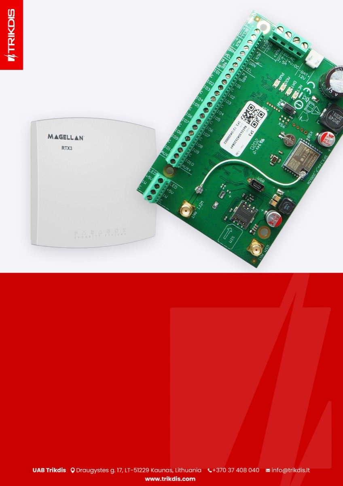

## Panel de control

El firmware del panel de seguridad debe reemplazarse con el firmware, que garantizará el funcionamiento de los sensores inalámbricos Paradox. El archivo de firmware se puede descargar como usuario registrado desde [www.trikdis.com](http://www.trikdis.com).

#### Tabla de compatibilidad para la modificación del panel de control y la versión de firmware

| Modificación del panel de control | Versión de firmware compatible con el panel de control |
|:--:|:--:|
|  | SP3_1xx1_0112.fw |
|  | SP3_3xx1_0112.fw |
|  | SP3_4xx1_0112.fw |
|  | SP3_5xx1_0112.fw |

Siga los pasos a continuación para reemplazar el firmware:

1.  Ejecuta TrikdisConfig.

2.  Conecte el “FLEXi” SP3 a su computadora con un cable USB Mini-B.

3.  Abre la ventana ***“*Firmware”** de TrikdisConfig.

4.  Haga clic en el botón ***“*Abrir Firmware”** y seleccione el archivo que desee instalar.

5.  Haga clic en el botón **Actualizar [F12]**.

6.  Espere a que se lleve a cabo la actualización del firmware.

7.  Haga clic en el botón ***“*Desconectar”** y desconecte el cable USB.

Conecte los cables de la fuente de alimentación principal a los terminales AC/DC del panel de control. Conecte el módulo *RTX3* al panel de control.

Inserte una tarjeta SIM activada en el soporte de la tarjeta SIM. Encienda la fuente de alimentación principal. Espera unos minutos. Con TrikdisConfig, conéctese de forma remota al panel de control “FLEXi“ SP3. La barra de estado de TrikdisConfig muestra información sobre la versión del firmware instalado (1). En la ventana ***“*Módulos”/”Teclados”**, la tabla contiene el módulo RTX3 (2) que está conectado al panel de control.

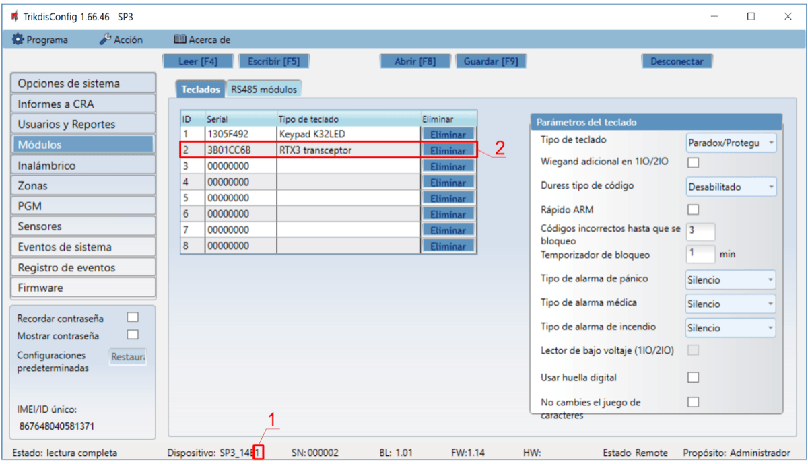

Después de conectar el módulo RTX3, el panel de control “FLEXi” SP3 puede funcionar con sensores inalámbricos de Paradox (contactos magnéticos, detectores de movimiento, detector de rotura de vidrio (G550), detector de humo (SD360), control remoto (REM2, REM25), sirenas ( SR230, SR250), teclados (K37), módulo de expansión (2 WPGM), repetidor (RPT1)).

## Vinculación de sensores inalámbricos

1.  Asegúrese de que el “FLEXi” SP3 haya registrado el receptor de sensor inalámbrico RTX3.

2.  Encienda la fuente de alimentación en el panel de control. Inserte las baterías en el sensor inalámbrico y espere hasta que los indicadores LED dejen de parpadear.

3.  Con TrikdisConfig, conéctese de forma remota al panel de control “FLEXi” SP3.

4.  En TrikdisConfig, en la ventana **“Inalámbrico”**, haga clic en el botón ***“*Emparejamiento de sensor”**.

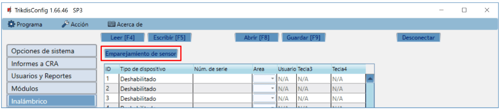

5.  Seleccione el tipo de dispositivo: ***“*Sensores”**.

6.  Presione el botón ***“*Comenzar”**.

7.  Presione el botón Tamper del sensor.

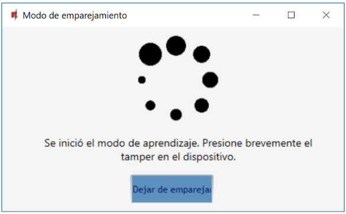

8.  Espere unos segundos. El panel de control detectará el sensor.

9.  El número ***“*UID”** debe coincidir con el número de serie del sensor que se muestra en la etiqueta de la placa del sensor.

10. Al sensor se le debe asignar un ***“*Número de zona”** y una ***“*Definición de zona”**.

11. Haga clic en ***“*Guardar”**.

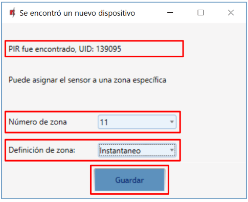

12. El sensor inalámbrico está incluido en la lista de dispositivos inalámbricos.

13. El número de ***“*UID”** debe coincidir con el número de serie del sensor, que se puede encontrar en la etiqueta de la placa del sensor.

14. Haga clic en ***“*Dejar de emparejamiento”** para completar el registro de sensores inalámbricos.

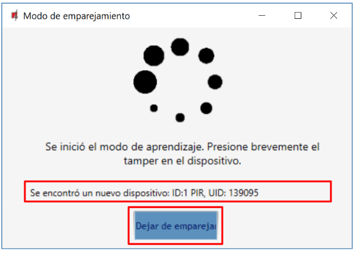

15. Haga clic en ***“*Yes”** para que el sensor se escriba en el panel de control “FLEXi” SP3.

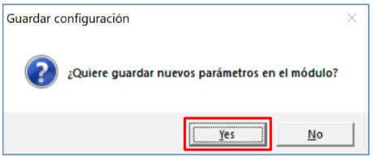

16. Se agregará un nuevo sensor inalámbrico a la lista de dispositivos ***“*Inalámbricos”**.

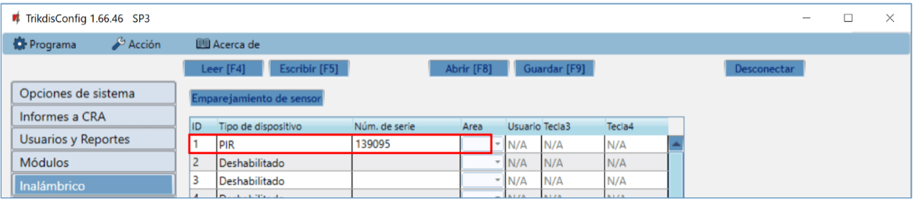

17. Debe asignar los sensores a ***“*Zonas”** y ***“*Área”** del panel de control de seguridad (ventana ***“*Zonas”**).

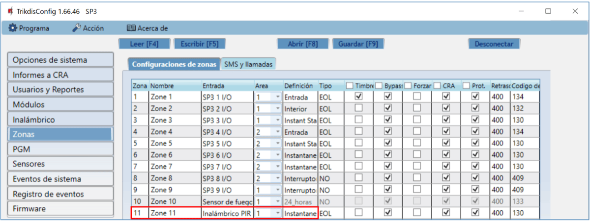

18. Haga clic en **Escribir [F5]** después de realizar los cambios.

19. El sensor inalámbrico ahora está vinculado al sistema.

!!! note
    Para eliminar sensores inalámbricos de la memoria del "FLEXi" SP3:

    1.  Conecte un cable USB Mini-B al "FLEXi" SP3.

    2.  Ejecuta TrikdisConfig, haga clic en el botón **Leer [F4]**.

    3.  En la ventana TrikdisConfig Inalámbrico, en la columna***"***
        **Tipo de dispositivo"**, seleccione ***"*Deshabilitado"** en lugar
        del ***"*Sensor inalámbrico"** que desea eliminar y haga clic en
        **Escribir [F5]**. El sensor inalámbrico ahora se elimina de la
        memoria del "FLEXi" SP3.
## Vinculación de un control remoto inalámbrico (llavero)

1.  Asegúrese de que el “FLEXi” SP3 haya registrado el receptor de sensor inalámbrico RTX3.

2.  Encienda la fuente de alimentación en el panel de control.

3.  Con TrikdisConfig, conéctese de forma remota al panel de control “FLEXi” SP3.

4.  En TrikdisConfig, en la ventana **“Inalámbrico”**, haga clic en el botón ***“*Emparejamiento de sensor”**.
5.  Seleccione el tipo de dispositivo: ***“*Colgantes”**.

6.  Presione el botón ***“*Comenzar”**.

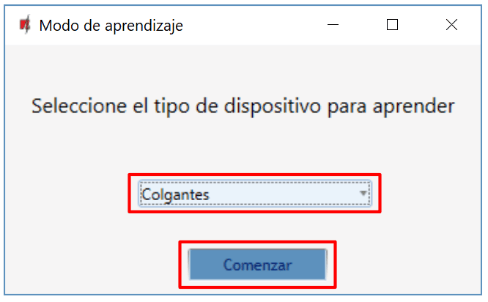

7.  Mantenga pulsado cualquier botón del mando a distancia para encender el LED del mando a distancia. Suelta el botón.

8.  Espere unos segundos. El panel de control detectará el llavero.

9.  El número de ***“*UID”** debe coincidir con el número de serie del control remoto, que se indica en la etiqueta en la parte posterior del control remoto.

10. En el campo ***“*Área”**, especifique la partición del sistema de seguridad que controlará la consola (Armar / Desarmar).

11. En el campo ***“*Usuario”**, ingrese el número de usuario al que se asignará el mando.

12. Haga clic en ***“*Guardar”**.

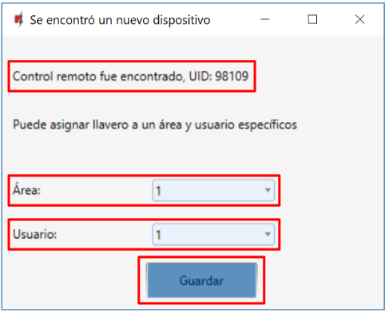

13. El llavero inalámbrico está incluido en la lista de dispositivos inalámbricos.

14. El número ***“*UID”** debe coincidir con el número de serie del llavero, que se encuentra en la parte posterior del control remoto.

15. Haga clic en ***“*Dejar de emparejamiento”** para completar el registro del colgante inalámbrico.

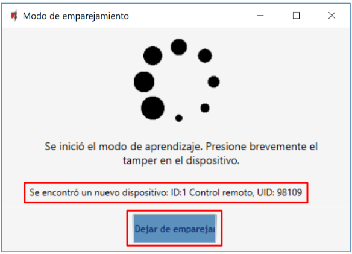

16. Haga clic en ***“*Yes”** para que el llavero se escriba en el panel de control “FLEXi” SP3.

17. Se ha agregado un llavero inalámbrico a la lista de dispositivos inalámbricos.
18. Puede asignar funciones adicionales a los botones 3 y 4 del llavero (Armado, Desarmado; Alarma silenciosa; Alarma de pánico; Control de PGM).

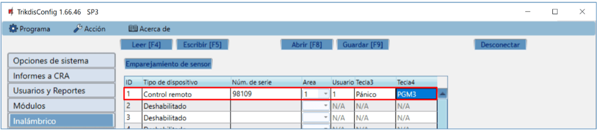

19. Haga clic en **Escribir [F5]** después de realizar los cambios.

20. El llavero inalámbrico ahora está vinculado al sistema.

!!! note
    Para eliminar el llavero inalámbrico de la memoria del ***"FLEXi"
    SP3***:

    1.  Conecte un cable USB Mini-B al "FLEXi" SP3.

    2.  Inicie TrikdisConfig, haga clic en el botón **Leer [F4]**.

    3.  En la ventana ***TrikdisConfig* *"*Inalámbrico"**, en la columna
        ***"*Tipo de dispositivo"**, seleccione ***"*Deshabilitado"** en
        lugar del llavero que desea eliminar y haga clic en **Escribir
        [F5]**. El llavero ahora se elimina de la memoria del ***"FLEXi"
        SP3***.
## Vinculación de una sirena inalámbrica

1.  Asegúrese de que el “FLEXi” SP3 haya registrado el receptor de sensor inalámbrico RTX3.

2.  Encienda la fuente de alimentación en el panel de control Inserte las baterías en la sirena inalámbrica.

3.  Con TrikdisConfig, conéctese de forma remota al panel de control “FLEXi” SP3.

4.  En TrikdisConfig, en la ventana ***“*Inalámbrico”**, haga clic en el botón ***“*Emparejamiento de sensor”**.
5.  Seleccione el tipo de dispositivo: ***“*Sirenas”**.

6.  Presione el botón ***“*Comenzar”**.

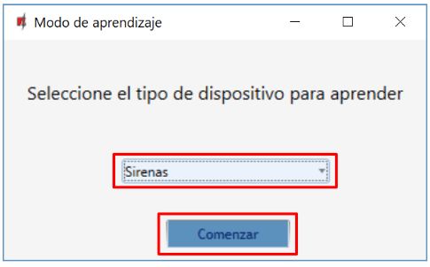

7.  Mantenga presionado el botón ***“*LEARN”** en el tablero de la sirena durante 3 segundos. El LED de la sirena comenzará a parpadear. Suelta el botón.

8.  Espere unos segundos. El panel de control detectará la sirena.

9.  El número de ***“*UID”** debe coincidir con el número de serie de la sirena, que se indica en la etiqueta en la placa de la sirena.

10. En el campo ***“*Área”**, especifique la sección del sistema de seguridad, cuya activación activará la sirena.

11. Haga clic en ***“*Guardar”**.

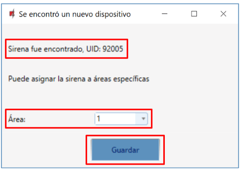

12. La sirena inalámbrica está incluida en la lista de dispositivos inalámbricos.

13. El número ***“*UID”** debe coincidir con el número de serie de la sirena, que se puede encontrar en la etiqueta adhesiva del tablero de la sirena.

14. Haga clic en ***“*Dejar de emparejamiento”** para completar el registro de la sirena inalámbrica.

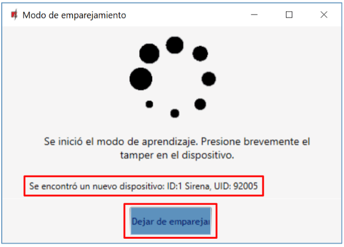

15. Haga clic en ***“*Yes”** para que la sirena se escriba en el panel de control “FLEXi” SP3.

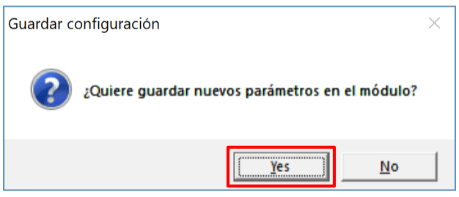

16. La sirena inalámbrica se ha agregado a la lista de dispositivos inalámbricos.

17. Haga clic en **Escribir [F5]** después de realizar los cambios.

18. La sirena inalámbrica ahora está vinculado al sistema.

!!! note
    Para eliminar la sirena inalámbrica de la memoria del "FLEXi" SP3:

    1.  Conecte un cable USB Mini-B al "FLEXi" SP3.

    2.  Inicie TrikdisConfig, haga clic en el botón **Leer [F4]**.

    3.  En la ventana TrikdisConfig **"Inalámbrico"**, en la columna
        ***"*Tipo de dispositivo"**, seleccione ***"*Deshabilitado"** en
        lugar de la ***"*Sirena"** que desea eliminar y haga clic en
        **Escribir [F5]**. La sirena inalámbrica ahora se elimina de la
        memoria del "FLEXi" SP3.
## Vinculación de un teclado inalámbrico

1.  Asegúrese de que el “FLEXi” SP3 haya registrado el receptor de sensor inalámbrico RTX3.

2.  Encienda la fuente de alimentación en el panel de control. Inserte las baterías en el teclado inalámbrico.

3.  Con TrikdisConfig, conéctese de forma remota al panel de control "FLEXi" SP3.

4.  En TrikdisConfig, en la ventana Inalámbrico, haga clic en el botón ***“*Emparejamiento de sensor”**.
5.  Seleccione el tipo de dispositivo: ***“*Teclados”**.

6.  Presione el botón ***“*Comenzar”**.

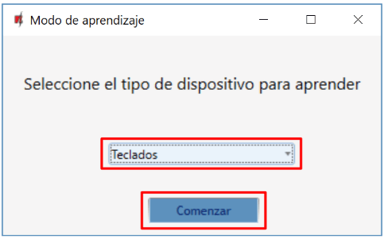

7.  Presione y mantenga presionados simultáneamente los botones **[**  **]** y **[BYP]** en el teclado durante 3 segundos. El teclado emitirá varios pitidos. Suelta los botones.

8.  Espere unos segundos. El panel de control detectará el teclado.

9.  El número de ***“*UID”** debe coincidir con el número de serie del teclado, que se puede encontrar en la etiqueta adhesiva en la parte posterior de la carcasa del teclado.

10. En el campo, especifique el ***“*Área”** del sistema de seguridad que controlará el teclado.

11. Haga clic en ***“*Guardar”**.

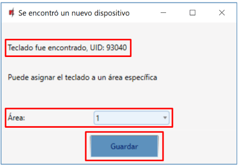

12. El teclado inalámbrico está incluido en la lista de dispositivos inalámbricos.

13. El número de ***“*UID”** debe coincidir con el número de serie del teclado, que se encuentra en la parte posterior de la carcasa del teclado.

14. Haga clic en ***“*Dejar de emparejamiento”** para completar el registro del teclado inalámbrico.

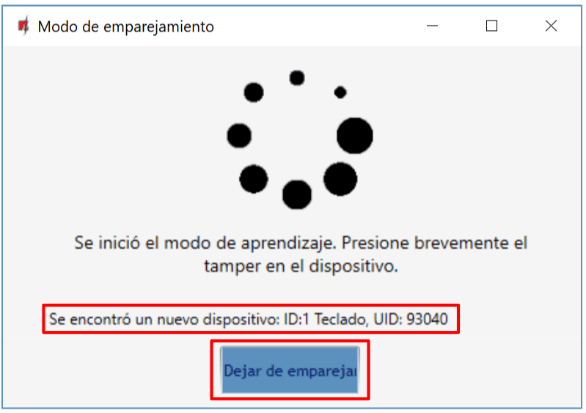

15. Haga clic en ***“*Yes”** para que el teclado se escriba en el panel de control “FLEXi“ SP3.

16. Se ha agregado el teclado inalámbrico a la lista de dispositivos inalámbricos.

17. Haga clic en **Escribir [F5]** después de realizar los cambios.

18. El teclado inalámbrico ahora está vinculado al sistema.

!!! note
    Para eliminar el teclado inalámbrico de la memoria del ***"FLEXi"
    SP3***:

    1.  Conecte un cable USB Mini-B al "FLEXi" SP3.

    2.  Inicie TrikdisConfig, haga clic en el botón **Leer [F4]**.

    3.  En la ventana TrikdisConfig Inalámbrico, en la columna
        ***"*Tipo de dispositivo"**, seleccione ***"*Deshabilitado"** en
        lugar del ***"*Teclado"** que desea eliminar y haga clic en
        **Escribir [F5]**. El teclado ahora se elimina de la memoria del
        "FLEXi" SP3.
## Vinculación del módulo 2WPGM

1.  Asegúrese de que el “FLEXi” SP3 haya registrado el receptor de sensor inalámbrico RTX3.

2.  Encienda la fuente de alimentación en el panel de control. Encienda la fuente el módulo 2WPGM.

3.  Con TrikdisConfig, conéctese de forma remota al panel de control “FLEXi” SP3.

4.  En TrikdisConfig, en la ventana “**Inalámbrico”**, haga clic en el botón ***“*Emparejamiento de sensor”**.
5.  Seleccione el tipo de dispositivo: ***“*PGM dispositivos”**.

6.  Presione el botón ***“*Comenzar”**.

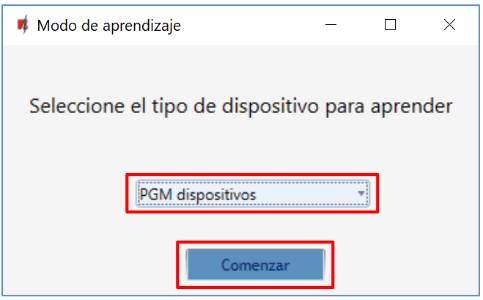

7.  Quite el puente **JP2** en el módulo 2WPGM y vuelva a colocar el puente después de unos segundos.

8.  Espere unos segundos. El panel de control detectará el módulo.

9.  El número de ***“*UID”** debe coincidir con el número de serie del módulo, que se indica en la etiqueta en la placa del módulo.

10. En el campo ***“*Seleccionar salida”**, especifique el número de salida PGM que desea asignar al módulo.

11. Haga clic en ***“*Guardar”**.

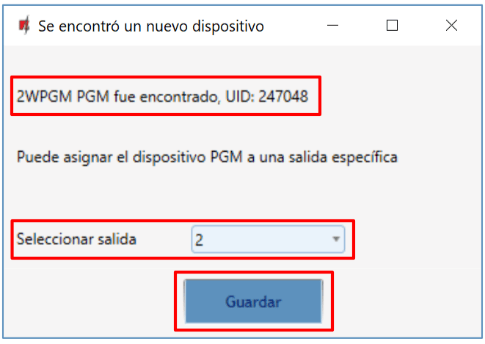

12. El módulo inalámbrico 2WPGM está incluido en la lista de dispositivos inalámbricos.

13. El número de **“UID”** debe coincidir con el número de serie del 2WPGM, que se puede encontrar en la etiqueta de la placa del módulo.

14. Haga clic en ***“*Dejar de emparejamiento”** para completar el registro del módulo inalámbrico 2WPGM.

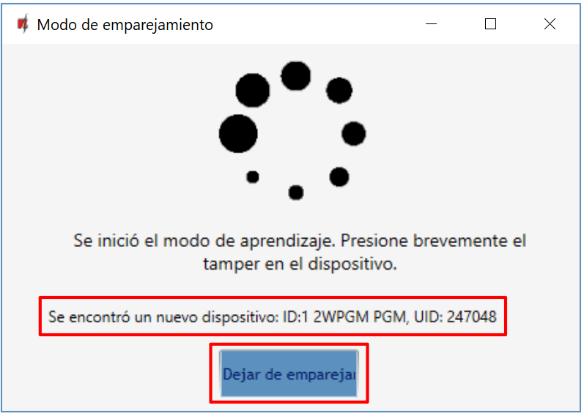

15. Haga clic en ***“*Yes”** para que el módulo inalámbrico 2WPGM se escriba en el panel de control “FLEXi” SP3.

16. El módulo inalámbrico 2WPGM se ha agregado a la lista de dispositivos inalámbricos.

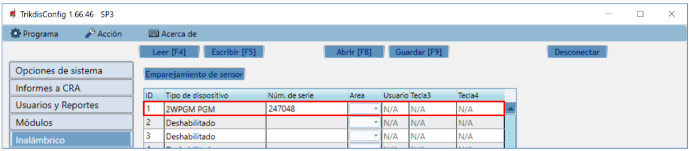

17. Se puede cambiar el nombre de la salida PGM.

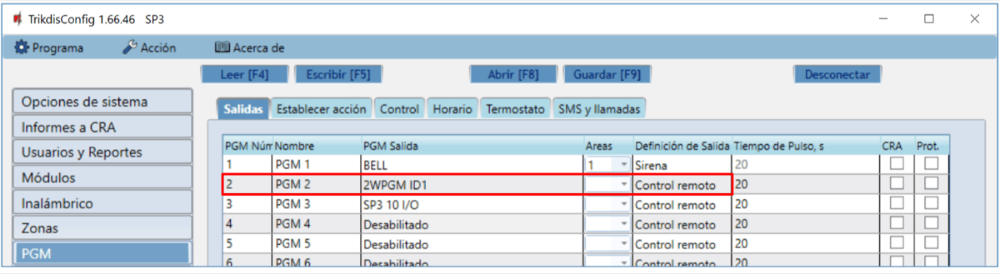

18. Haga clic en **Escribir [F5]** después de realizar los cambios.

19. El *2WPGM* inalámbrico ahora está vinculado al sistema.

!!! note
    Para eliminar el módulo inalámbrico 2WPGM de la memoria del
    "FLEXi" SP3:

    1.  Conecte un cable USB Mini-B al "FLEXi" SP3.

    2.  Inicie TrikdisConfig, haga clic en el botón **Leer [F4]**.

    3.  En la ventana TrikdisConfig ***"*Inalámbrico"**, en la columna
        ***"*Tipo de dispositivo"**, seleccione ***"*Deshabilitado"** en
        lugar del 2WPGM que desea eliminar y haga clic en **Escribir
        [F5]**. El *2WPGM* ahora se elimina de la memoria del
        "FLEXi" SP3.
## Vinculación de un repetidor inalámbrico RPT1

1.  Asegúrese de que el “FLEXi” SP3 haya registrado el receptor de sensor inalámbrico RTX3.

2.  Encienda la fuente de alimentación en el panel de control. Encienda la fuente el módulo RPT1.

3.  Con TrikdisConfig, conéctese de forma remota al panel de control “FLEXi” SP3.

4.  En TrikdisConfig, en la ventana **“Inalámbrico”**, haga clic en el botón ***“*Emparejamiento de sensor”**.
5.  Seleccione el tipo de dispositivo: ***“*Repetidores”**.

6.  Presione el botón ***“*Comenzar”**.

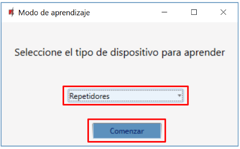

7.  Presione el botón ***“*LEARN”** en el repetidor RPT1.

8.  Espere unos segundos. El panel de control detectará el repetidor RPT1.

9.  El número de ***“*UID”** debe coincidir con el número de serie del repetidor, que se indica en la etiqueta en la placa del repetidor.

10. Haga clic en ***“*Dejar de emparejamiento”** para completar el registro de repetidores inalámbricos.

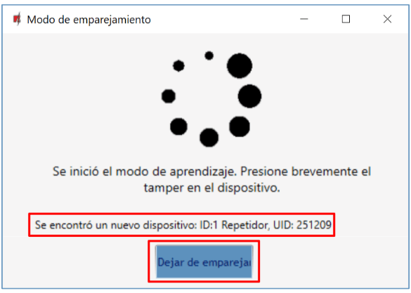

11. Haga clic en ***“*Yes”** para que el repetidor inalámbrico RPT1 se escriba en el panel de control “FLEXi” SP3.

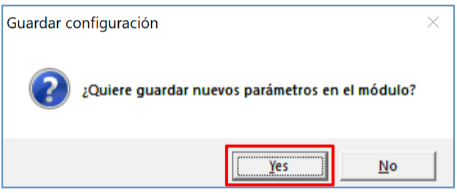

12. Se ha agregado el repetidor inalámbrico RPT1 a la lista de dispositivos inalámbricos.

13. Haga clic en **Escribir [F5]** después de realizar los cambios.

14. El repetidor inalámbrico RPT1 ahora está vinculado al sistema.

!!! note
    Para eliminar el repetidor inalámbrico RPT1 de la memoria del
    "FLEXi" SP3:

    1.  Conecte un cable USB Mini-B al "FLEXi" SP3.

    2.  Inicie TrikdisConfig, haga clic en el botón **Leer [F4]**.

    3.  En la ventana TrikdisConfig ***"*Inalámbrico"**, en la columna
        ***"*Tipo de dispositivo"**, seleccione ***"*Deshabilitado"** en
        lugar del***"*** **Repetidor"** que desea eliminar y haga clic en
        **Escribir [F5]**. El repetidor RPT1 ahora se elimina de la
        memoria del "FLEXi" SP3.
