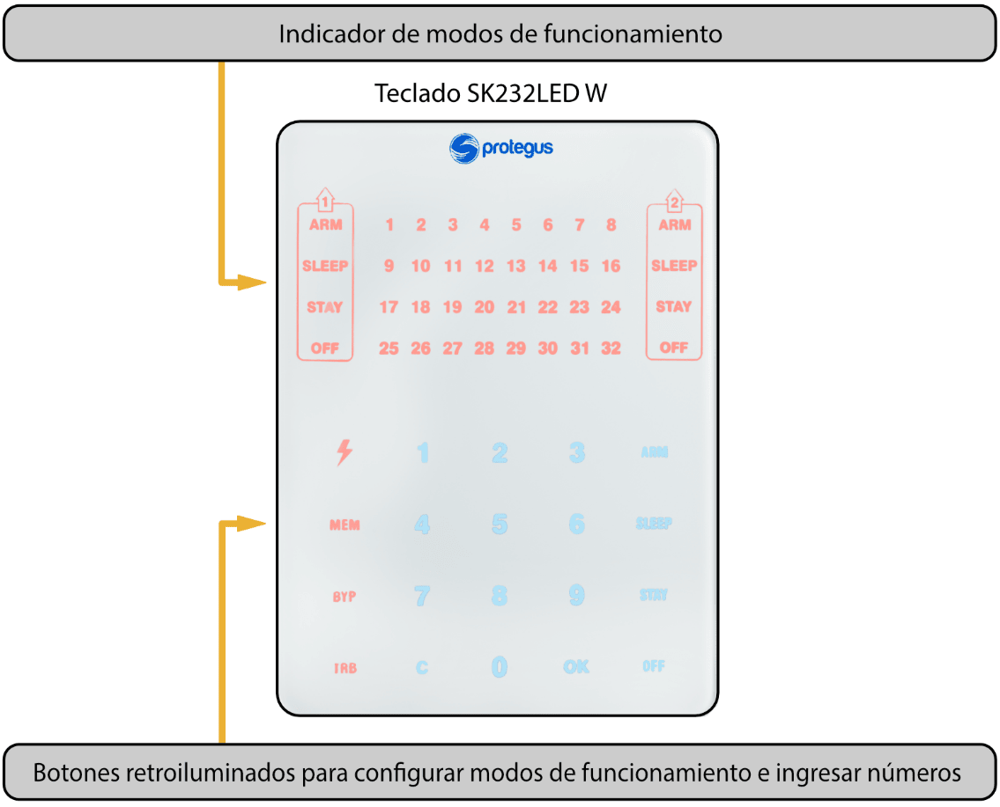
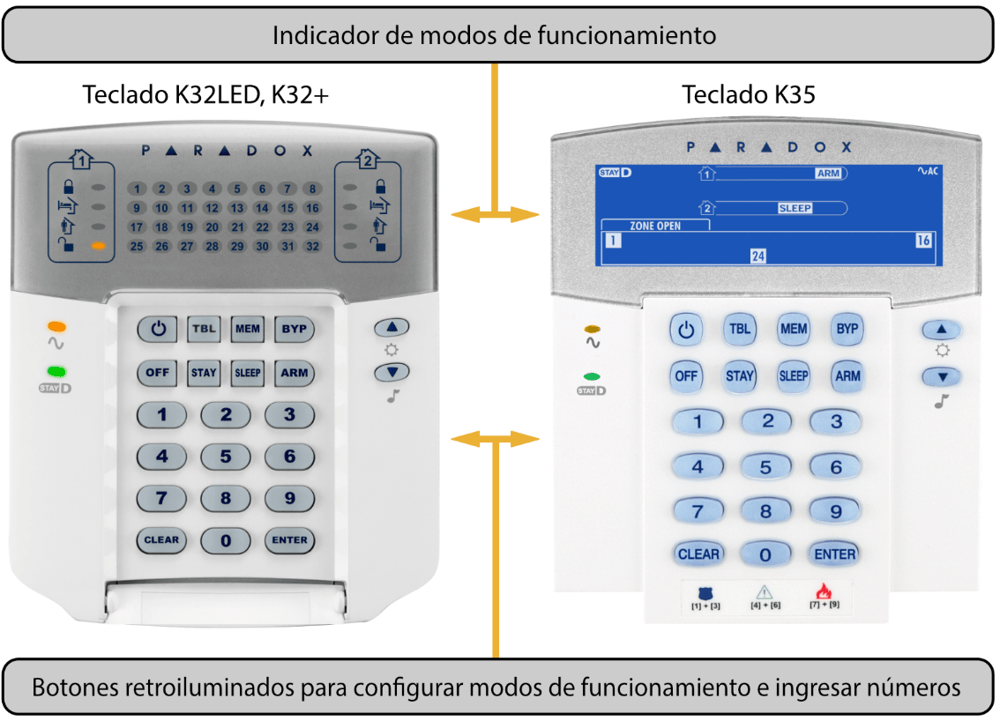

# Manual de usuario de FLEXi SP3 con teclados Protegus y Paradox

#### **Descripción**

## OFF (DESARMADO)

En este modo, solo algunas de las zonas están protegidas. La alarma solo reaccionará a eventos en zonas configuradas como **Incendio, 24 horas, Silencio 24H.**

### ARM (ARMADO)

En este modo, todas las zonas están protegidas. La alarma reaccionará a todos los eventos posibles.

### STAY (PERMANENCIA)

En este modo, una parte de las zonas están protegidas, pero se permite movimiento en las zonas configuradas como Interior **STAY** e **Instant STAY**. Si la alarma está funcionando en este modo y se viola una zona de **Retardo** (Delay Zone), la alarma se activará solo después de que haya transcurrido el tiempo de entrada.

### SLEEP (DESCANSO)

En este modo, una parte de las zonas están protegidas, pero se permite movimiento en las zonas configuradas como Interior **STAY** e **Instant STAY**. Si la alarma está funcionando en este modo y se viola una zona de **Retardo** (Delay Zone), la alarma se activará inmediatamente.

### Control del sistema de alarma

El sistema de alarma se puede controlar mediante los siguientes dispositivos:

- Teclados *Trikdis* Protegus SK232LEDW;

- Teclados *Paradox* K32+, K32LED, K636, K10LED V/H, K35, TM50, TM70;

- Teclados *Crow* CR-16, CR-LCD;

- Llaves *iButton*;

- Tarjetas *RFID*;

- Interruptor eléctrico, cambiando el estado de la zona seleccionada por el interruptor de llave;

- Teléfono (mediante llamada telefónica o enviando un mensaje SMS con contenidos específicos);

- App Protegus;

- Comando remoto desde la Central de Monitoreo.

### Control de Acceso

Los códigos de control se utilizan para dar a diferentes usuarios diferentes niveles de acceso para controlar el sistema de alarma. Los códigos de control de usuario constan de 4 dígitos. Al elegir e ingresar códigos de control, solo se usan números del 0 al 9, otros símbolos no están disponibles.

Tipos de códigos de control del sistema de alarma:

- Código de administrador – Una combinación de seis dígitos (código predeterminado: 123456). Solo hay un código de administrador. No se puede eliminar, pero se puede cambiar. El código de administrador permite agregar o eliminar códigos de control de otros usuarios. El código de administrador no puede armar/desarmar el sistema de alarma;

- Código de usuario – Una combinación de cuatro dígitos para armar/desarmar el sistema de alarma y para anular temporalmente las zonas de seguridad. Se recomienda asignar a cada usuario un código de control de alarma personal. La memoria del módulo FLEXi SP3 puede almacenar hasta 40 códigos de usuario;

- Contraseña SMS – Combinación de seis dígitos para controlar el sistema de alarma mediante mensajes SMS (Código predeterminado – 123456).

### Funciones de seguridad

### **Nombre**

#### **Descripción**

### Ignorar

Temporalmente (para un armado del sistema de alarma) ignora una zona de seguridad al cambiar el estatus de la alarma. La función se utiliza cuando es necesario armar la alarma, pero una zona no funciona correctamente y la falla no se puede reparar fácilmente.

### Sirena

El módulo puede usar una señal de sirena breve para advertir sobre el armado y desarmado del sistema de alarma en el lugar.

### Campana

Cuando la alarma está desarmada, el módulo puede advertir que una zona está siendo violada activando el zumbador del teclado y/o una salida PGM especialmente programada.

### Re-ARM

Se utiliza para proteger contra el desarme accidental de la alarma. Si la alarma se desactivó mediante una llamada telefónica, pero no se violó la zona de Retraso, la alarma volverá automáticamente a su modo de seguridad anterior después de que pase el tiempo de Retraso de Entrada.

### Funciones adicionales

| **Nombre** | **Descripción** |
|----|----|
| Medición de temperatura | Se pueden conectar hasta 8 sensores de temperatura DS18B20, DS18S20 o un sensor de temperatura y humedad AM2301 al módulo FLEXi SP3. Los intervalos de temperaturas permitidas se pueden configurar para cada uno de ellos individualmente. Si la temperatura cambia más allá de intervalo establecido, se creará y enviará un mensaje de evento a los usuarios. |
| Control remoto de dispositivos | Se pueden conectar dispositivos electrónicos adicionales a las salidas del colector abierto programable del módulo de seguridad FLEXi SP3 y se pueden controlar de forma remota. |

## Control de la alarma

### Control de la alarma con un teclado SK232LEDW

El teclado Trikdis SK232LEDW para control del sistema de alarma muestra los estados de 32 zonas y 2 participaciones.

**Botones para configurar modos de operación e ingresar números**

| Botón | Descripción |
|:---|----|
|  | Un brillo constante significa que el sistema de alarma está siendo alimentado desde la red de alimentación CA y si parpadea significa una falla en la batería. Si el botón está apagado significa que el suministro de voltaje está apagado o que el sistema está funcionando con la batería. Este botón también se utiliza para editar códigos de control y para restablecer los sensores de incendios. |
| MEM | Un brillo constante significa que en la memoria hay nueva información sobre la activación de la alarma, y si parpadea significa que el teclado está funcionando en modo MEM. Este botón también se utiliza para elegir el modo de visualización de la memoria. |
| BYP | Un brillo constante significa que hay zonas ignoradas temporalmente, y si parpadea significa que el teclado está funcionando en modo BYP. Este botón también se utiliza para seleccionar el modo de ignorar temporalmente. |
| TRB | Un brillo constante significa que se ha registrado un problema de funcionamiento, y si parpadea significa que el teclado está funcionando en modo TBL. Este botón también se utiliza para seleccionar el modo de visualización de problemas. |
| 1, 2 ...9, 0 | Botones para ingresar números. |
| C | Botón para salir de los modos y borrar valores. |
| OK | Botón para confirmar la elección especificada. |
| ARM | Botón para activar el modo de seguridad total **ARM**. |
| SLEEP | Botón para activar el modo **SLEEP**. |
| STAY | Botón para activar el modo **STAY**. |
| OFF | Botón para activar el modo **OFF** (Desarmar). |

> [!NOTE]
>     1. Para apagar el modo de programación o borrar un valor ingresado
incorrectamente, presione el botón **C**.

2. Si al menos una zona es violada, no será posible armar el sistema de
alarma (si la propiedad **FORCE** no está asignada a las zonas
violadas).
### Controlar la alarma con un teclado Paradox

El teclado Paradox K10LED V/H para control del sistema de alarma muestra los estados de 10 zonas y particiones.

El teclado Paradox K636 para control del sistema de alarma muestra los estados de 10 zonas y 1 partición.

Los teclados Paradox K32LED, K32+, K35 para control de sistema de alarma muestran los estados de 32 zonas y 2 particiones.

**Botones para configurar los modos de operación e ingresar números**

| **Botón** | **Descripción** |
|----|----|
|  | Botón para restablecer los sensores de incendio. |
| MEM | Un brillo constante significa que en la memoria hay nueva información sobre la activación de la alarma, y si parpadea significa que el teclado está funcionando en modo MEM. Este botón también se utiliza para elegir el modo de visualización de la memoria. |
| BYP | Un brillo constante significa que hay zonas ignoradas temporalmente, y si parpadea significa que el teclado está funcionando en modo BYP. Este botón también se utiliza para seleccionar el modo de ignorar temporalmente. |
| TBL | Un brillo constante significa que se ha registrado un problema de funcionamiento, y si parpadea significa que el teclado está funcionando en modo TBL. Este botón también se utiliza para seleccionar el modo de visualización de problemas. |
| 1, 2 ...9, 0 | Botones para ingresar números. |
| CLEAR | Botón para salir de los modos y borrar valores. |
| ENTER | Botón para confirmar la elección especificada. |
| ARM | Botón para activar el modo de seguridad total **ARM**. |
| SLEEP | Botón para activar el modo **SLEEP**. |
| STAY | Botón para activar el modo **STAY**. |
| OFF | Botón para activar el modo **OFF** (Desarmar). |
|  | Indicador de voltaje. Brillo constante – el voltaje de alimentación está encendido. Parpadeo – falla de la batería. Apagado – la fuente de voltaje de alimentación está apagada o el sistema está funcionando con la batería. |

> [!NOTE]
>     1. Para apagar el modo de programación o borrar un valor ingresado
incorrectamente, presione el botón **CLEAR**.

2. Si al menos una zona es violada, no será posible armar el sistema de
alarma (si la propiedad **FORCE** no está asignada a las zonas
violadas).
## Armado/Desarmado rápido del sistema de alarma

Armar/Desarmar el sistema de alarma usando un código cuando el sistema de seguridad tiene zonas **STAY**.

Los modos de seguridad **ARM, STAY** y **SLEEP** se cambian a **OFF/DISARM**, y **OFF/DISARM** se cambia al modo **ARM** o **STAY**. Cambiar el modo de seguridad:

1. Ingresar **Código de usuario**.

1. Si el sistema solo tiene una partición, omita el paso 2. Si el sistema tiene más de una partición, los números de las particiones en las que el usuario puede cambiar los modos se iluminarán en el teclado.

2. Presione los números de las particiones elegidas.

3. Las particiones que estaban en los modos **ARM, STAY** y **SLEEP** cambiarán al modo **OFF/DISARM**.

1. Cuando la alarma está apagada, el indicador **OFF** se iluminará.

2. Si la función **Sirena** (Bell Squawk) está habilitada, la sirena se activará dos veces por cortos periodos de tiempo mientras la alarma se apaga.

4. El tiempo de **retraso de salida** será contará hacia atrás para las particiones que estaban en modo de **OFF/DISARM**. Si se viola una zona de **Retraso** durante la cuenta regresiva, se activará el modo **ARM**, y si una zona de **Retraso** no se viola, se activará el modo **STAY**.

1. El indicador de teclado respectivo (**ARM** o **STAY**) se iluminará.

2. Si la función de **Sirena** está habilitada, la sirena se activará una vez por un corto periodo de tiempo mientras se enciente de la alarma.

### Armar la alarma en modo ARM

Para activar el modo de seguridad **ARM** para un sistema de alarma que está dividido en varias particiones:

1. Presione el botón **ARM** del teclado.

2. Ingrese el **Código de usuario** usando el teclado.

3. Presione los botones con los números de las particiones que quiere controlar.

4. Confirme su selección presionando el botón **OK** (o **ENTER**).

5. Antes de que se agote el tiempo de **Retraso de Salida**, abandone las instalaciones y cierre la puerta.

1. Durante la cuenta regresiva del tiempo de **Retraso de Salida**, el indicador **ARM** del teclado parpadeará, y cuando la alarma esté armada, este brillará de forma constante.

2. Si la función de **Sirena** está habilitada, la sirena se activará una vez por un corto periodo de tiempo mientras se enciente la alarma.

### Armar la alarma en modo STAY

Para activar el modo de seguridad **STAY** para un sistema de alarma que está dividido en múltiples particiones:

1. Presione el botón **STAY** del teclado.

2. Ingrese el **Código de usuario** usando el teclado.

3. Presione los botones con los números de las particiones que quiere controlar.

4. Confirme su selección presionando el botón **OK** (o **ENTER**).

5. El indicador **STAY** del teclado se iluminará.

1. Si la función de **Sirena** está habilitada, la sirena se activará una vez por un corto periodo de tiempo mientras se enciente la alarma.

> [!NOTE]
>     El modo **STAY** no está disponible a menos que una zona esté
configurada como **Interior STAY** o **Instant STAY**.
### Armar la alarma en modo SLEEP

Para actívate el modo de seguridad **SLEEP** para un sistema de alarma que está dividido en múltiples particiones:

1. Presione el botón **SLEEP** del teclado.

2. Ingrese el **Código de usuario** usando el teclado.

3. Presione los botones con los números de las particiones que quiere controlar.

4. Confirme su selección presionando el botón **OK** (o **ENTER**).

5. El indicador **SLEEP** del teclado se iluminará.

1. Si la función de **Sirena** está habilitada, la sirena se activará una vez por un corto periodo de tiempo mientras se enciente la alarma.

### Desarmar la alarma (modo OFF)

Cuando las instalaciones están aseguradas en modo **ARM** o **STAY**, la cuenta regresiva del tiempo de **Retraso de Entrada** comenzará si alguien ingresa a las instalaciones. Debe desarmar la alarma antes de que acabe la cuenta regresiva.

Para desactivar el modo de protección (active el modo **OFF/DISARM**):

1. Presione el botón **OFF** del teclado.

2. Ingrese el **Código de usuario** usando el teclado.

1. Si el sistema solo tiene una partición, omita los pasos 3 y 4.

3. Presione los botones con los números de las particiones que quiere controlar.

4. Confirme su selección presionando el botón **OK** (o **ENTER**).

1. Cuando la alarma esté apagada, el indicador **OFF** se iluminará.

2. Si la función de **Sirena** está habilitada, la sirena se activará dos veces durante un corto periodo de tiempo mientras se apaga la alarma.

#### Apagar la alarma después de que esta ha sido activada

Para apagar la alarma:

1. Ingrese el **Código de usuario**.

1. Si el sistema solo tiene una partición, omita los pasos 2 y 3.

2. Presione los botones con los números de las particiones que quiere controlar.

3. Confirme su selección presionando el botón **OK** (o **ENTER**).

1. Cuando la alarma esté apagada, el indicador **OFF** se iluminará.

2. Si la función de **Sirena** está habilitada, la sirena se activará dos veces durante un corto periodo de tiempo mientras se apaga la alarma.

3. El indicador **MEM** se iluminará y las zonas violadas comenzarán a parpadear. Presione **MEM** y entonces **C** (o **CLEAR**) para detener el parpadeo de las zonas violadas.

### Anulación Temporal de zona (Función Ignorar)

Para activar la función **Ignorar**:

1. Presione el botón **BYPASS** del teclado.

2. Ingrese el **Código de usuario**.

1. El indicador **BYP** comenzará a parpadear.

3. Ingrese los números de dos dígitos de las zonas que desea ignorar.

4. Confirme su selección presionando el botón **OK** (o **ENTER**).

5. El indicador BYP comenzará a brillar.

Para desactivar la función **Ignorar**, repita los mismos pasos anteriores.

### Visualización y borrado de la memoria de activación de alarma

Cuando se activa la alarma, el indicador **MEM** empieza a brillar. Para descubrir el motivo de la activación de la alarma:

1. Presione el botón **MEM** del teclado.

2. Los números que brillan indican qué zonas provocaron la activación de la alarma.

3. Para salir de este modo, presione el botón **C** (o **CLEAR**).

1. Si no se realizan acciones con el teclado, el modo de visualización de la memoria se apagará automáticamente después de un minuto, peor la memoria no se borrará y el indicador **MEM** seguirá brillando.

4. La memoria se borrará después de que se encienda la alarma y el indicador **MEM** deje de brillar.

### Restablecer los sensores de fuego (humo)

Después de la activación de los sensores de fuego (humo), para restablecer los sensores:

1. Mantenga presionado el botón  (o ) durante 3 segundos.

1. Se activará la salida PGM a la que están conectados los sensores de incendio y que está configurada para operar en el modo de **Restablecimiento del sensor de incendio**.

2. Los sensores de fuego (humo) conectados a la zona del panel de control se restablecerán.

### Botones de llamada de emergencia

El teclado se puede utilizar para enviar mensajes a la empresa de seguridad para indicar que se necesita ayuda o sobre peligro inminente. Esta función solo está disponible si está utilizando los servicios de una empresa de seguridad y el sistema de seguridad está conectado a la estación central de monitoreo.

Mantenga presionados los siguientes botones al mismo tiempo durante 3 segundos:

- **1** **3** para enviar un mensaje de **Pánico** por peligro inminente.

- **4** **6** para enviar un mensaje **Médico** sobre la necesidad de asistencia médica.

- **7** **9** para enviar un mensaje por **Incendio**.

### Solución de problemas del sistema de alarma

Si hay algún problema de funcionamiento, el indicador **TRB** del teclado se encenderá. Para ver los problemas operativos del sistema:

1. Presione el botón **TRB**.

2. Los grupos de problemas se iluminarán en el teclado.

3. Si desea ver un grupo de problemas, presione el botón correspondiente.

4. Para salir del modo de solución de problemas, presione el botón **C** (o **CLEAR**).

**Descripciones de problemas**

| Grupo de problemas | Descripción del grupo seleccionado |
|--------------------|------------------------------------|
| 1: Sistema | 1 Sin fuente de alimentación AC. |
| 1: Sistema | 2 Mal funcionamiento de la batería. |
| 1: Sistema | 3 Reloj no configurado. |
| 1: Sistema | 4 Se superó la corriente máxima permitida para la salida AUX. |
| 1: Sistema | 5 Se superó la corriente máxima permitida para la salida de la sirena. |
| 1: Sistema | 6 Sin sirena. |
| 1: Sistema | 7 Mal funcionamiento del circuito del detector de incendios. |
| 2: Comunicaciones | 1 Canal de conectividad principal defectuoso (todos los tipos de conexión). |
| 2: Comunicaciones | 2 Segundo canal de conectividad defectuoso (todos los tipos de conexión). |
| 2: Comunicaciones | 3 Canal de conectividad Protegus defectuoso (todos los tipos de conexión). |
| 2: Comunicaciones | 4 Sin tarjeta SIM. |
| 2: Comunicaciones | 5 Código PIN incorrecto para SIM. |
| 2: Comunicaciones | 6 No se puede conectar a la red GSM. |
| 2: Comunicaciones | 7 No se puede conectar a la red WiFi. |
| 2: Comunicaciones | 8 Problema de conectividad del módulo E485 (consulte la indicación LED del módulo). |
| 3: Sabotaje de la zona | Números de zonas con sabotajes violados. |
| 4: Bus 485 | Varios expansores de bus 485 con averías. |
| 5: Sensor RF faltante | Un sensor inalámbrico ya no está operativo (ha pasado el tiempo de verificación periódico). El número de zona muestra el orden desde una tabla RF separada. |
| 6: Batería RF baja | Un sensor inalámbrico ha indicado que su batería está a punto de agotarse. El número del sensor se puede encontrar en una tabla RF separada. |
| 7: Antienmascaramiento | Número de zonas con antienmascaramiento violados. |

### Programar códigos de control de usuario

#### Cambiar el código de administrador

**El código de administrador** se puede cambiar en el menú del software TrikdisConfig en la rama **System Options / Access / Access codes**.

#### Ingresar nuevos códigos de usuario

1. Presione el botón  (o ) en el teclado.

2. Ingrese el **Código de administrador** de 6 dígitos.

1. El botón  (o ) empezará a parpadear.

3. Ingrese un número de serie de usuario de dos dígitos que no esté en uso.

4. Ingrese el **Código de usuario** de 4 dígitos.

5. Vuelva a ingresar el **Código de usuario** de 4 dígitos.

6. Ingrese las particiones que el usuario podrá controlar.

7. Confirme su selección presionando el botón **OK** (o **ENTER**).

8. Para salir del modo de programación presione el botón **C** (o **CLEAR**).

#### Editar códigos de usuario

1. Presione el botón  (o ) en el teclado.

2. Ingrese el **Código de administrador** de 6 dígitos.

1. El botón  (o ) empezará a parpadear.

3. Ingrese el número de serie de usuario de dos dígitos deseado.

4. Ingrese el **Código de usuario** de 4 dígitos.

5. Vuelva a ingresar el **Código de usuario** de 4 dígitos.

6. Ingrese las particiones que el usuario podrá controlar.

7. Confirme su selección presionando el botón **OK** (o **ENTER**).

8. Para salir del modo de programación presione el botón **C** (o **CLEAR**).

#### Visualización de los estados de las particiones

Ver los estados de las particiones actuales.

## Operaciones de códigos de usuario con teclado Paradox

### Presione los botones 1 y 2 simultáneamente durante 3 segundos, el teclado debe emitir un pitido

### Presione el botón 2 durante 3 segundos, el teclado debe emitir un pitido
Los indicadores LED enumerados del 1 al 8 mostrarán los estados de las particiones: Encendido – el modo **ARM** está activado; Parpadeando – El modo **Stay** está activado; Apagado – Desarmado o apagado.

#### Eliminar códigos de usuario

Para eliminar códigos de usuario existentes:

1. Presione el botón  (o ) en el teclado.

2. Ingrese el **Código de administrador** de 6 dígitos.

1. El botón  (o ) empezará a parpadear.

3. Ingrese el número de serie de usuario de dos dígitos deseado.

4. Presione el botón **SLEEP**.

5. Para salir del modo de programación presione el botón **C** (o **CLEAR**).

#### Código de ataque (Duress)

Si se ve obligado a encender o pagar el sistema de alarma, si ingresa su código de usuario con la opción de Ataque habilitada, el sistema activará/desactivará el sistema de alarma e inmediatamente transmitirá una alarma silenciosa (Código Duress) Al Centro de Monitoreo. El código Duress debe ser habilitado por el instalador. Existen dos tipos de códigos: **Último dígito más alto** o **“0” en lugar del primer dígito**.

## Control mediante llaves iButton

> [!NOTE]
>     Si al menos una zona es violada, no será posible armar el sistema de
alarma.
Las llaves iButton se pueden utilizar para configurar los modos de seguridad **ARM / STAY / OFF** del sistema de alarma. El modo de seguridad SLEEP no está disponible.

Coloque la llave iButton contra el lector de llaves. El modo del sistema de alarma cambiará al modo opuesto. Si el sistema estaba armado, se desarmará. Si el sistema estaba desarmado, se armará y comenzará la cuenta regresiva del tiempo de **Retraso de Salida**. Si la zona configurada en **Retraso** no se viola durante el tiempo de salida y hay zonas configuradas en **Interior STAY** e **Instant STAY**, se activará el modo de seguridad **STAY**.

Se pueden eliminar las llaves existentes y agregar nuevas llaves a un sistema de alarma ya instalado y en funcionamiento mediante el software de configuración **TrikdisConfig** o usando un lector de llaves de contacto**.**

Vinculando llaves con el lector CZ-Dallas.

1. Si la lista de **códigos de etiqueta** está vacía, coloque la llave de contacto contra el “ojo” del lector y manténgala presionada durante 3 segundos. La llave se vinculará, se agregará a la primera línea de la lista y se convertirá en la **llave Maestra**.

2. Para activar el modo de vinculación de llave de contacto, mantenga la **llave Maestra** contra el “ojo” del lector de llaves durante al menos 10 segundos.

3. Para vincular las llaves de usuario, sosténgalas una a la vez contra el “ojo” del lector de llaves.

4. Cuando ya haya terminado de vincular las llaves electrónicas (*iButton*), mantenga presionada la **llave Maestra** contra el lector de llaves de nuevo para deshabilitar el modo de vinculación.

5. Para eliminar todas las llaves (incluida la llave Maestra), mantenga presionada la **llave Maestra** contra el lector durante al menos 20 segundos.

## Control mediante tarjetas RFID (etiquetas)

> [!NOTE]
>     Si al menos una zona es violada, no será posible armar el sistema de
alarma.
Las tarjetas RFID se pueden utilizar para configurar los modos **ARM** / **STAY** / **OFF** del sistema de alarma.

Se debe conectar un lector RFID Wiegand (26/34) con teclado al panel de control de seguridad. Se pueden agregar etiquetas RFID (tarjetas) ingresado sus números de identificación en el campo de **código de etiquetas** del software TrikdisConfig.

Sostenga la tarjeta RFID contra el lecto Wiegand o ingrese el [Código de usuario] en el teclado del lector Wiegand y presione [#]. El modo del sistema de alarma cambiará al modo opuesto. Si el sistema estaba armado, se desarmará. Si el sistema estaba desarmado, se armará y comenzará la cuenta regresiva del tiempo de **Retraso de Salida**. Si la zona configurada en **Retraso** no se viola durante el tiempo de salida y hay zonas configuradas en **Interior STAY** e **Instant STAY**, se activará el modo de seguridad **STAY**.

## Control mediante llamadas telefónicas

> [!NOTE]
>     Si al menos una zona es violada, no será posible armar el sistema de
alarma (si la propiedad **FORCE** no está asignada a las zonas
violadas). / Al controlar la alarma mediante llamadas telefónicas, solo
están disponibles los modos de seguridad **ARM** y **STAY**. Antes de
llamar, se recomienda verificar el modo de seguridad actual enviando una
solicitud para conocer el estatus de la partición a través de un mensaje
SMS (comando: **ASKA 123456**), y también verificar los estatus de la
zona actual enviando una solicitud de estatus de la zona mediante un
mensaje SMS (comando: **ASKI 123456**).
La programación del panel de control permite ingresar los números de teléfono de los usuarios y especificar lo que estos usuarios pueden controlar mediante llamadas telefónicas: armar/desarmar la alarma o controlar el equipo electrónico conectado a la salida **PGMx** del módulo.

Llame al número de la tarjeta SIM insertada en el módulo de control de seguridad FLEXi SP3. Si el número de teléfono desde el que usted está llamando está especificado en la memoria del módulo, el panel de control responderá la llamada y entonces podrá ingresar el comando de control (consulte la tabla de comandos de control).

### Lista de comandos que se pueden ingresar a través del teclado del teléfono

### 1[partición no][#]

### 2[ partición no][#]

### 3[salida no][#][stay no]

### Ej. (armar partición 2): 12#

### Ej. (desarmar partición 2): 22#

> [!NOTE]
> Controla una salida OUT especificada. Estatus: 0 – salida apagada; – salida apagada; 1 – salida encendida; 2 – apagada por tiempo de pulso; 3 – encendida por tiempo de pulso; (El tiempo de pulso se especifica mediante el software TrikdisConfig, en la table PGM) Ej. (Establecer la salida 1OUT al estatus “on” (encendido)): 31#1 Ej. (Establecer la salida 2OUT al estatus “on” para el Tiempo de pulso especificado en la tabla “PGM” de TrikdisConfig): ): 32#3
Si la función **Re-ARM** está activada, si la zona de **Retraso** no se viola después de que pase el tiempo de entrada establecido desde el momento que se ingresó el comando de desarme de la alarma, el sistema de alarma regresará automáticamente al modo de seguridad anterior.

## Control mediante mensajes SMS

Mediante mensajes SMS se puede controlar el panel de control de seguridad FLEXI SP3 y cambiar algunos de los parámetros del panel. Solo el software TrikdisConfig puede cambiar todos los parámetros del módulo.

Estructura de un mensaje SMS: Comando `[espacio]` Contraseña `[espacio]` Datos

Para un panel de control con configuración predeterminada, la contraseña SMS es 123456. Por razones de seguridad, recomendamos cambiarla a una combinación que solo usted conozca y ¡no olvide!

### Lista de comandos SMS

| Comando | Datos | Descripción |
|---------|-------|-------------|
| INFO |  | Solicita información sobre el panel de control. Se incluirán en la respuesta: el nombre del objeto, el estado de la partición, el número IMEI, la intensidad de la señal GSM, la versión del firmware y el número de serie. Ej.: INFO 123456 |
| RESET |  | Restablecer el dispositivo. Ej.: RESET 123456 |
| OUTPUTx | ON | Enciende una salida, “x” es el número de la salida. |
| OUTPUTx | ON | Ej.: OUTPUT1 123456 ON |
| OFF | Apague una salida, “x” es el número de la salida. |
| OFF | Ej.: OUTPUT1 123456 OFF |
|  | PULSE=ttt | Enciende una salida durante un tiempo específico – “x” es el número de la salida OUT y “ttt” es un número de tres dígitos que especifica el tiempo de pulso en segundos. / Ej.: OUTPUT1 123456 PULSE=002 |
| PSW | Nueva contraseña SMS | Cambia la contraseña SMS. Ej.: PSW 123456 654123 |
| TIME | YYYY/MM/DD,12:00:00 | Establece la fecha y hora. Ej.: TIME 123456 2020/01/02,12:23:00 |
| TXTA | Nombre del objeto | Especifica el nombre del objeto. Ej.: TXTA 123456 House |
| RDR | NoTeléfono#TextoSMS | Reenvía mensajes SMS al número especificado. El número de teléfono debe comenzar con un símbolo “+” y el código internacional del país. / Ej.: RDR 123456 +37061234567#texto reenviado |
| ASKI |  | Envía mensajes SMS con los estados de las entradas IN. Ej.: ASKI 123456 |
| ASKO |  | Envía mensajes SMS con los estados de las salidas OUT. Ej.: ASKO 123456 |
| ASKA |  | Envía mensajes SMS con los estados de las particiones. Ej.: ASKA 123456 |
| ASKT |  | Envía mensajes SMS con los valores de todos los sensores de temperatura. / Ej.: ASKT 123456 |
| DISARM | SYS:x | Desarma la alarma, “x” es el número de partición (1-8). Ej.: DISARM 123456 SYS:1 |
| ARM | SYS:x | Arma la alarma, “x” es el número de partición (1-8). Ej.: ARM 123456 SYS:1 |
| STAY | SYS:x | Arma la partición “x” en modo Stay, “x” es el número de partición (1-8). / Ej.: STAY 123456 SYS:1 |
| SLEEP | SYS:x | Arma la partición “x” en modo Sleep “x” es el número de partición (1-8). / Ej.: SLEEP 123456 SYS:1 |
| FRS |  | Restablece la salida del sensor de incendio, si a la salida OUT se le asigna la función “Restablecer sensor de incendio”. Ej.: FRS 123456 |
| SETN | TeléfonoX=NoTeléfono#Nombre#email | Agrega un número de teléfono y nombre de usuario y lo asigna al usuario “x”. “x” es la línea del número de teléfono en la lista. El número de teléfono debe comenzar con el símbolo “+” y el código internacional del país. El número de teléfono y el nombre de usuario deben estar separados por el símbolo “#”. / Ej.: SETN 123456 PHONE5=+37061234567#JOHN#john@trikdis.com |
|  | TeléfonoX=DEL | Elimina el número de teléfono y el nombre de usuario de la lista. / Ej.: SETN 123456 PHONE5=DEL |
| UUSD | *Código Uusd# | Envía un código UUSD al operador. Ej.: UUSD 123456 *245# |
| CONNECT | Protegus=ON | Conecta al servicio en la nube Protegus. Ej.: CONNECT 123456 PROTEGUS=ON |
|  | Protegus=OFF | Desconecta del servicio en la nube Protegus. Ej.: CONNECT 123456 PROTEGUS=OFF |
|  | Code=123456 | Código de servicio en la nube de Protegus. Ej.: CONNECT 123456 CODE=123456 |
|  | IP=0.0.0.0:8000 | Especifica el puerto y la TCP IP del canal de conexión del servidor principal. / Ej.: CONNECT 123456 IP=0.0.0.0:8000 |
|  | IP=0 | Para apagar el canal principal. Ej.: CONNECT 123456 IP=0 |
|  | ENC=123456 | Clave de cifrado TRK. Ej.: CONNECT 123456 ENC=123456 |
|  | APN=Internet | Nombre APN. Ej.: CONNECT 123456 APN=INTERNET |
|  | USER=usuario | Usuario APN. Ej.: CONNECT 123456 USER=User |
|  | PSW=contraseña | Contraseña APN. Ej.: CONNECT 123456 PSW=Password |

## Control de salidas PGM

Con el teclado puede controlar las salidas PGM. En el programa TrikdisConfig (**PGM / Control**), es necesario asignar las salidas PGM y el tipo de operación (Nivel o Pulso) a las teclas de la utilidad. Al presionar (o presionar y mantener) las teclas apropiadas en el teclado se activará la salida PGM asignada.

| Tecla de función | Tecla de función del teclado TM50, TM70 / (presione) | Nota Paradox / (presione y mantenga 3 seg.) |
|------------------|---------------------------------------------------------|------------------------------------------------|
| Tecla de función 1 | Utility key 1 | 1+2 |
| Tecla de función 2 | Utility key 2 | 4+5 |
| Tecla de función 3 | Utility key 3 | 7+8 |
| Tecla de función 4 | Utility key 4 | 2+3 |
| Tecla de función 5 | Utility key 5 | 5+6 |
| Tecla de función 6 | Utility key 6 | 8+9 |
