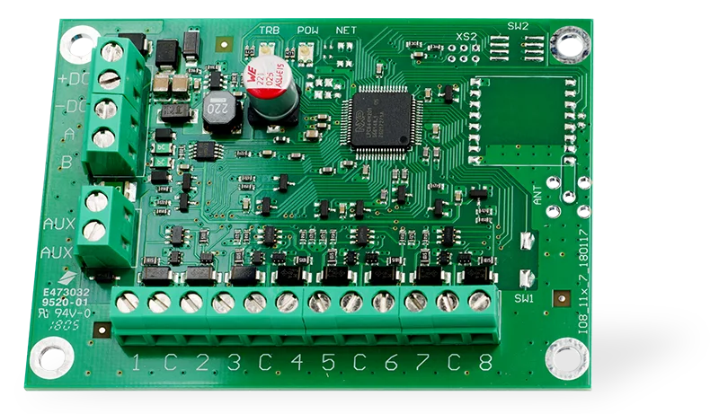

# iO-8 Expansor de entrada y salida

  

Con el expansor iO-8 puede aumentar el número de entradas y salidas en un dispositivo TRIKDIS compatible.

iO-8 tiene 8 contactos, que se pueden configurar en modo de entrada o salida.

Visite la página iO-8 en www.trikdis.com para obtener las especificaciones del dispositivo y una lista actualizada de dispositivos TRIKDIS compatibles.

Compatible con [SP3](../../control-panels/sp3/index.md), [CG17](../../control-panels/cg17/index.md), [GT+](../../alarm-communicators/cellular/gt-plus/index.md), [GT](../../alarm-communicators/cellular/gt/index.md), [G16](../../alarm-communicators/cellular/g16/index.md), [G16T](../../alarm-communicators/cellular/g16t/index.md), [G17F](../../alarm-communicators/fire-panels/g17f/index.md), [E16](../../alarm-communicators/e16/index.md), [E16T](../../alarm-communicators/e16t/index.md), [GATOR Cellular](../../gate-controllers/gator/index.md) y [GATOR WiFi](../../gate-controllers/gator-wifi/index.md).

**Siga estos pasos para configurar iO-8:**

1.  Conecte el iO-8 a un dispositivo TRIKDIS compatible como se muestra:

2.  Conecte las ENTRADAS como se muestra:

El módulo principal establece los diagramas de cableado y la resistencia nominal, al que está conectado el módulo de expansión iO-8.

3.  Conecte las SALIDAS como se muestra:

4.  Conecte un cable USB al dispositivo TRIKDIS principal y abra el software TrikdisConfig. Presione **Leer [F4]**.

5.  Vaya a la ventana Módulos y haga clic en una fila libre en el panel "RS485 Módulos". Seleccione "Expansor iO-8" en la lista desplegable como se muestra:

6.  Ingrese el No. de serie de iO-8 (solo números) en la celda de la derecha. Encontrará este número en la etiqueta de iO-8.

7.  En la selección del menú desplegable ENTRADAS y SALIDAS (Zonas y ventana de PGM) verá las entradas y salidas de iO-8, que puede habilitar.

    

La configuración puede variar según el dispositivo TRIKDIS principal. Configure los ajustes para zonas y salidas PGM según el manual del dispositivo principal.

8.  Una vez que haya terminado, presione Escribir [F5] y desconecte el cable USB.

9.  Hacer funcionar las entradas y cambiar las salidas para probar la instalación.
