# iO-LORA Expansor inalámbrico

  

## Descripción 

Los expansores inalámbricos iO-LORA con transceptor RF-LORA aumentan el número de entradas y salidas del panel de control "FLEXi" SP3 mediante comunicación RF bidireccional.

Compatible con el panel de control de seguridad [SP3](../../control-panels/sp3/index.md), [GATOR Cellular](../../gate-controllers/gator/index.md) y [GATOR WiFi](../../gate-controllers/gator-wifi/index.md).
Al expansor iO-LORA se pueden conectar sensor de temperatura (1 und.) y lectores de teclas de contacto ("iButton"). La salida PGM (relé) del expansor se puede controlar de forma remota (encendido/apagado) mediante varios dispositivos eléctricos. iO- LORA tiene una entrada digital.

**Características**

Comunicación:

- Alcance inalámbrico de línea de visión de hasta 5000 m.

- Hasta 8 und. se puede conectar al panel de control *"FLEXi" SP3* expansores inalámbricos *iO-LORA*.

- Los productos de la versión HW iO-LO_x30x_7_230418 vienen con una antena estándar adecuada para la mayoría de los casos. <u>En los casos en que sea necesario proporcionar una comunicación de alta calidad a la máxima distancia posible, se debe utilizar una antena (AX-ANT-KIT – 433 MHz, AX-ANT01S_SF – 868 MHz) con una mayor ganancia de señal de radio</u>.

Entradas y salidas:

- Bus "1-Wire" está destinado a la conexión de sensor de temperatura (1 und.) y lectores de teclas de contacto ("iButton").
- 1 entrada, tipo de entrada: NC, NO.

- 1 salida (relé).
**Conexión:**

- El expansor inalámbrico iO-LORA está conectado al panel de control "FLEXi" SP3 a través del transceptor RF-LORA.

### Parámetros Técnicos 

| Parámetro | Descripción |
|----|----|
| Frecuencia de transmisión | Modificación 4F: 433,3 - 434,7 MHz /​ Modificación 8F: 867 - 869 MHz |
| Tipo de modulación | LORA |
| Tensión de alimentación | 9-26 V DC |
| Consumo actual | hasta 50 mA (en espera) /​ hasta 100 mA (a corto plazo, mientras se envía) |
| Cifrado de mensajes | Si |
| Rango en área abierta | hasta 5000 m |
| Entrada | 1, tipo seleccionable: NC, NO |
| Salida | 1, relé, 250 V AC, 4 A |
| Sensores de temperatura compatibles | 1, Max®/​Dallas® DS18S20, DS18B20 |
| Entorno operativo | Temperatura de -20 ° C a +50 ° C, humedad relativa - de hasta 80% a +20 ° C |
| Dimensiones | 62 x 77 x 25 mm |
| Peso | 80 g |

### Elementos expansores 

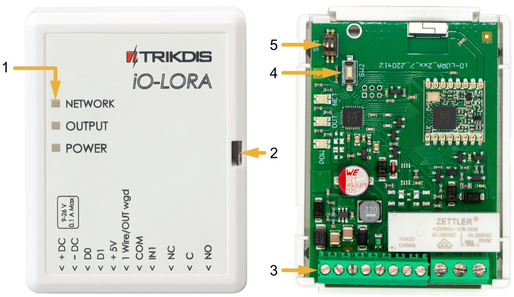

### Descripción del Bloque de Terminales 

| Terminal | Descripción |
|----|----|
| +DC | Terminal de poder (9-26 V DC positive) |
| -DC | Terminal de poder (9-26 V DC negativo) |
| D0 | No utilizado |
| D1 | No utilizado |
| +5V | Terminal positivo de alimentación de 5 V para dispositivos "**1-Wire**" |
| 1Wire /​ OUT wgd | Terminal de bus de datos "**1-Wire**" („**OUT wgd**“ - no utilizado ) |
| COM | Terminal común |
| IN1 | 1 entrada, tipo seleccionable NO, NC (configuración de fábrica: NO) |
| NC | Terminal de relevo NC |
| C | Terminal de relevo C |
| NO | Terminal de relevo NO |

### Indicación de LED 

| Indicador | Estados de LED | Descripción |
|-----------|----------------|-------------|
| NETWORK | Off | Sin señal de RF |
| NETWORK | Verde parpadeando | Nivel de señal RF de 0 a 10. Suficiente 4. |
| OUTPUT/KEY | Verde solido | Salida de relé activada |
| OUTPUT/KEY | Amarillo solido | Clave de contacto de Dallas activada |
| POWER | Off | Sin tensión de alimentación |
| POWER | Verde parpadeando | Nivel normal de tensión de alimentación |
| POWER | Amarillo parpadeando | Tensión de alimentación baja (≤11,5 V) |

## Esquemas de conexión 

### Fijación 

1.  Retire la tapa superior.

2.  Retire la placa PCB.

3.  Fijar la base de la caja en el lugar deseado usando tornillos.

4.  Vuelva a insertar la placa.

5.  Cierre la tapa superior.

### Esquema para la conexión de la fuente de alimentación 

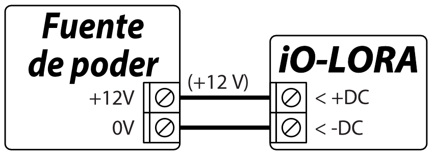

### Esquema para la entrada de conexión 

iO-LORA tiene una entrada. El tipo de entrada se puede configurar: NC, NO.

  <figure style="margin: 0;">
    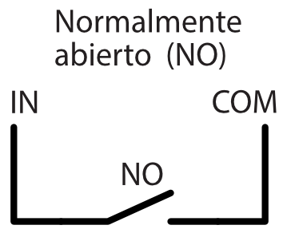
  </figure>
  <figure style="margin: 0;">
    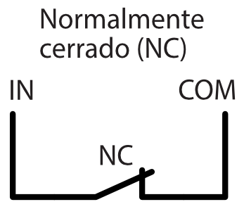
  </figure>

### Esquema para conectar un sensor de temperatura 

Los sensores de temperatura deben conectarse de acuerdo con el diagrama provisto. Los sensor de temperatura Max®/Dallas® DS18S20, DS18B20 (1 und.) se pueden conectar al expansor *iO- LORA*. Si se utiliza un cable mayor a 0.5 metros para conectar un sensor de temperatura, recomendamos utilizar un cable de par trenzado (UTP4x2x0.5 o STP4x2x0.5). / La terminal „+5V” en la placa sirve para alimentar dispositivos conectados al bus de datos "1-Wire" con voltaje de 5 V DC.

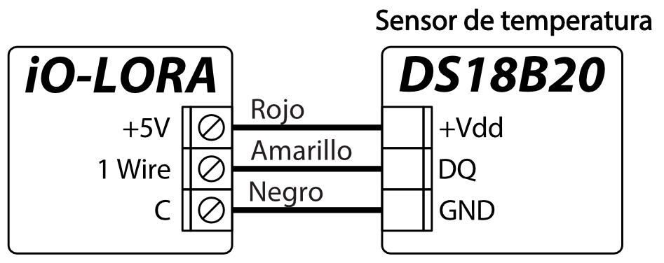

La corriente de salida máxima es de 0.2 A. La salida está protegida de sobrecargas. Si se excede la corriente máxima permitida, la alimentación se apagará automáticamente. El panel de control "FLEXi" SP3 reconoce y registra automáticamente el sensor de temperatura conectado.

### Esquema de conexión del lector CZ-Dallas 

El lector iButton **CZ-Dallas** se conecta al iO-LORA utilizando el bus de datos "**1 Wire**". La longitud de los cables que se conectan al bus de datos puede ser de hasta 30 m.

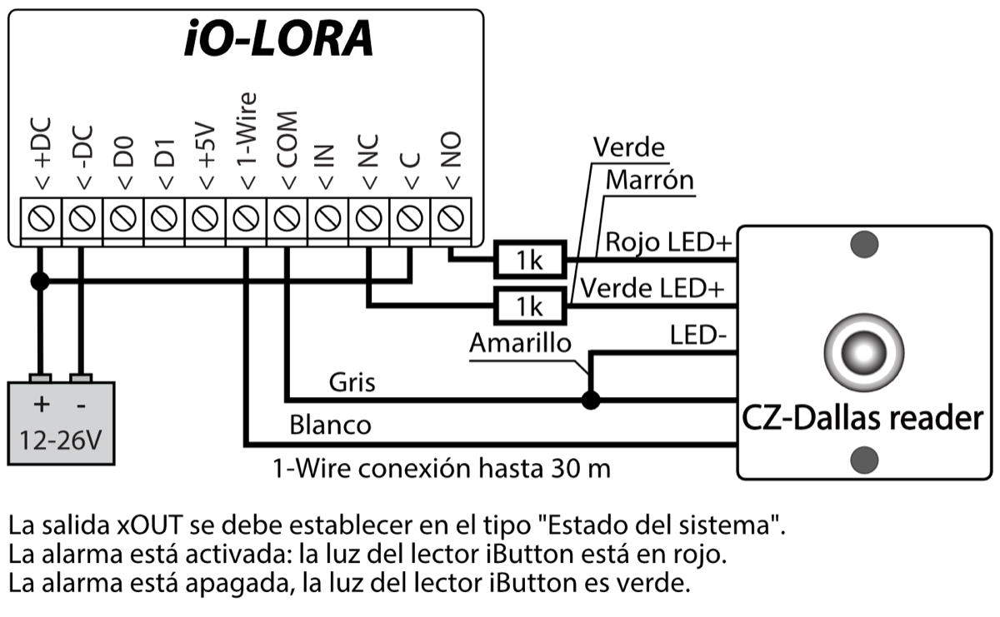

### Esquema de conexión de los módulos iO-LORA 

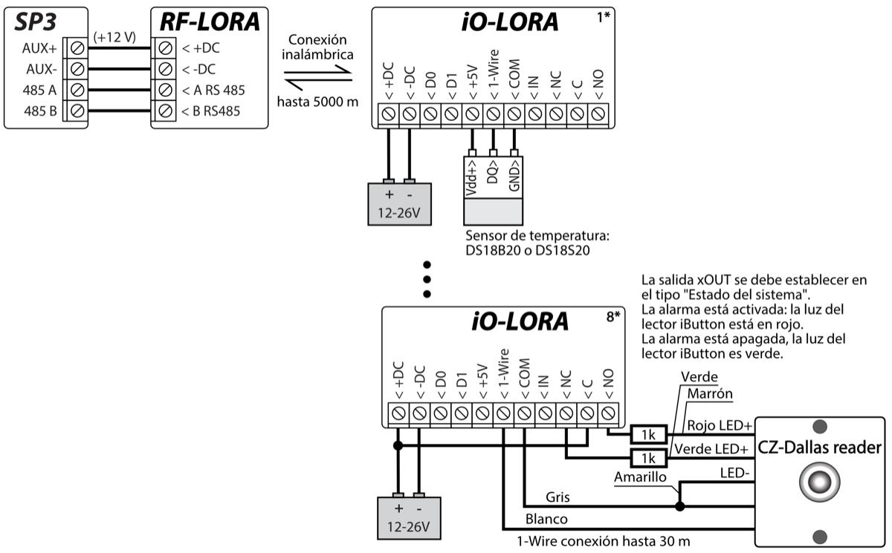

!!! note
    Se debe conectar un transceptor RF-LORA al panel de control
    "FLEXi" SP3 y se pueden conectar hasta 8 expansores
    inalámbricos iO-LORA. / Se recomienda utilizar un cable de par
    trenzado (UTP4x2x0,5 o STP4x2x0,5) para conectar el sensor de
    temperatura. / Lectores de llaves **CZ-Dallas** iButton y sensor de
    temperatura conectados al bus "**1-Wire**"**.**
## Panel de control de seguridad “FLEXi” SP3

1.  Se debe conectar un transceptor RF-LORA al panel de control "FLEXi" SP3.

2.  Encienda la fuente de alimentación del panel de control "FLEXi" SP3.

3.  Encienda la fuente de alimentación del expansor inalámbrico iO-LORA.

4.  Ejecuta ***TrikdisConfig**.*

5.  Conecta el "FLEXi" SP3 a una computadora con un cable USB Mini-B o conéctate al "FLEXi" SP3 de forma remota.

6.  Haga clic en **Leer [F4]** para ver los parámetros actuales "FLEXi" SP3. Si se le solicita, introduzca el código del administrador o instalador de en la ventana emergente.

7.  En la lista "**Módulos**", seleccione "**iO-LORA Expansor**".

8.  En el campo "**Núm. de Serie**", ingrese el número de serie del módulo.

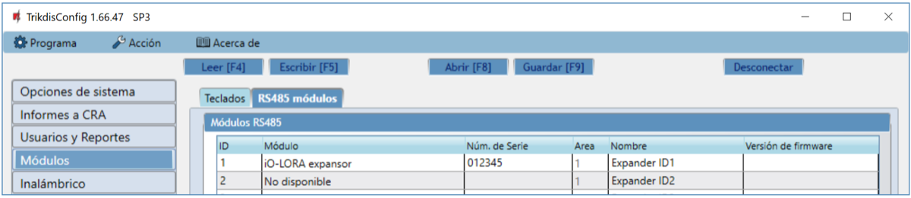

9.  En la pestaña "**Zonas**", configure la entrada del expansor.

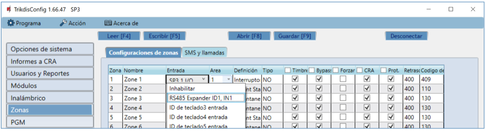

10. En la pestaña "**PGM**", realice los ajustes para la salida PGM del expansor.

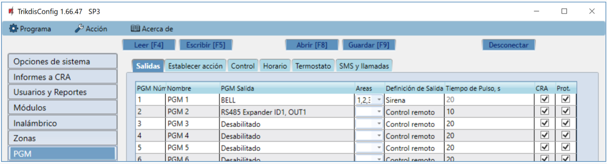

11. Los sensores de temperatura se incluirán en la lista de "**Sensores**" si se conecta un sensor de temperatura al expansor iO-LORA.

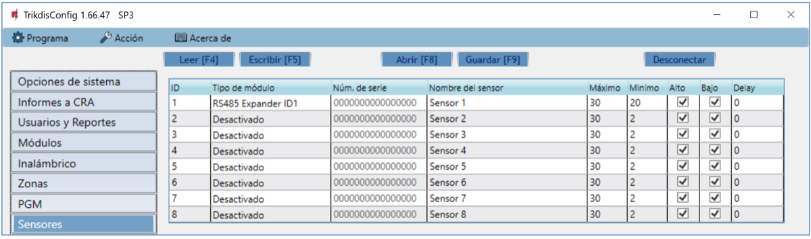

12. Una vez que se finalice la configuración, haz clic en el botón **Escribir [F5]**.

13. Espera a que finalicen las actualizaciones.

14. Haga clic en el botón "**Desconectar**" y desconecte el cable USB.

## Precauciones de seguridad 

Solo el personal calificado puede instalar y servicio el módulo de alarma de intrusión.

Por favor, lea atentamente este manual antes de la instalación con el fin de evitar errores que pueden conducir a un mal funcionamiento o incluso daños en el equipo.

Siempre desconecte la fuente de alimentación antes de realizar las conexiones eléctricas.

Los cambios, modificaciones o reparaciones no autorizadas por el fabricante deberán invalidar la garantía.

Cumpla con la normativa local y no deseche su sistema de alarma inutilizables o sus componentes con los residuos domésticos.
