# iO8-LoRa Expansor inalámbrico

  

## Descripción 

Los expansores inalámbricos iO-8-LORA con transceptor RF-LORA aumentan el número de entradas y salidas del panel de control "FLEXi" SP3 mediante comunicación RF bidireccional.

Compatible con el panel de control de seguridad [SP3](../../control-panels/sp3/index.md) y el controlador de acceso [GATOR Cellular](../../gate-controllers/gator/index.md).
El expansor inalámbrico iO-8-LORA tiene 8 terminales de I/O, cada uno de los cuales se puede configurar como entrada (IN) o como salida (OUT).

**Características**

Comunicación:

- Alcance inalámbrico de línea de visión de hasta 5000 m.

- Hasta 8 und. se puede conectar al panel de control *"FLEXi" SP3* expansores inalámbricos *iO-8-LORA*.

- Los productos de la versión HW iO8_x5xx_7_230419 vienen con una antena estándar adecuada para la mayoría de los casos. <u>En los casos en que sea necesario proporcionar una comunicación de alta calidad a la máxima distancia posible, se debe utilizar una antena (AX-ANT-KIT – 433 MHz, AX-ANT01S_SF – 868 MHz) con una mayor ganancia de señal de radio</u>.

Entradas y salidas:
- 8 terminales de I/O, cada uno se puede configurar como terminal de entrada (IN) o salida (OUT). Tipos de entrada (IN): ATZ, EOL, NC, NO. Se pueden usar diferentes valores nominales de resistencias en los circuitos de tipo EOL y ATZ.

**Conexión:**

- El expansor inalámbrico iO-8-LORA está conectado al panel de control "FLEXi" SP3 a través del transceptor RF-LORA.

### Parámetros Técnicos 

| Parámetro | Descripción |
|----|----|
| Frecuencia de transmisión | Modificación 4F: 433,3 - 434,7 MHz /​ Modificación 8F: 867 - 869 MHz |
| Tipo de modulación | LORA |
| Tensión de alimentación | 10-26 V DC |
| Consumo actual | hasta 50 mA (en espera) /​ hasta 120 mA (a corto plazo, mientras se envía) |
| Cifrado de mensajes | Si |
| Rango en área abierta | hasta 5000 m |
| Terminales de doble propósito [I/​O] | 8, función IN o OUT seleccionada durante la programación. Si se selecciona IN, tipos disponibles: NC, NO, EOL, EOL_T, 3EOL, ATZ, ATZ_T. Si se selecciona OUT, la terminal se convierte en colector abierto (OC) con una corriente de hasta 100 mA |
| Entorno operativo | Temperatura de -20 ° C a +50 ° C, humedad relativa - de hasta 80% a +20 ° C |
| Dimensiones | 65 x 90 x 12 mm |
| Peso | 80 g |

### Elementos expansores 

!!! note "Configuración del interruptor DIP 'SW2'"
    Para la versión HW iO8_x5xx_7_230419:

    1. Frecuencia de radio (`OFF` - RF1; `ON` - RF2). Diseñado para cambiar el canal de radio si el canal actual está muy cargado.
    2. Tipo de modulación (`OFF` - rápido; `ON` - lento). La posición `ON` permite aumentar la distancia de comunicación aproximadamente 2 veces (dependiendo de las condiciones ambientales). Pero si se garantiza una conexión de calidad usando la posición `OFF`, se recomienda usarla. En la posición `ON`, disminuye el rendimiento del sistema.

    **NOTA:** ¡En los dispositivos iO8-LORA y RF-LORA, las posiciones del interruptor `SW` deben coincidir! De lo contrario, la comunicación por radio no funcionará.

### Descripción del Bloque de Terminales 

| Terminal | Descripción                             |
|----------|-----------------------------------------|
| +DC      | Terminal de poder (10-26 V DC positive) |
| -DC      | Terminal de poder (10-26 V DC negativo) |
| A        | Terminal A del bus de datos *RS485*     |
| B        | Terminal B del bus de datos *RS485*     |
| 1- 8     | Terminales de entrada/​salida            |
| C        | Terminal negativa común                 |

### Indicación de LED 

| Indicador | Estados de LED | Descripción |
|-----------|----------------|-------------|
| NETWORK / (Red) | Off | Sin señal de RF |
| NETWORK / (Red) | Verde parpadeando | Nivel de señal RF de 0 a 10. Suficiente 3 |
| POWER / (Poder) | Off | Sin tensión de alimentación |
| POWER / (Poder) | Verde parpadeando | Nivel normal de tensión de alimentación |
| POWER / (Poder) | Amarillo parpadeando | Tensión de alimentación baja (≤11,5 V) |

## Esquemas de conexión 

### Esquema para la conexión de la fuente de alimentación 

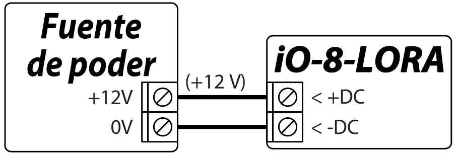

### Esquemas para la entradas de conexión 

Hay 8 terminales IO1 – IO8 (entradas) en la placa de expansión iO-8-LORA para conectar circuitos de sensores. Cualquier terminal puede configurarse como entrada y asignarse atributos de zona: tipo de circuito (NO, NC, EOL, EOL_T, 3EOL , ATZ, ATZ_T); sensibilidad a eventos temporales del circuito; función de zona (Delay, Instant, Instant Stay, Interior, Interior Stay, Fire, Keyswitch, 24_hour, Silent, Silent 24h).

  <figure style="margin: 0;">
    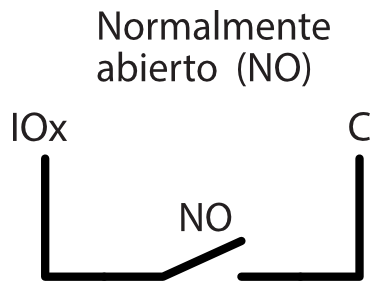
  </figure>
  <figure style="margin: 0;">
    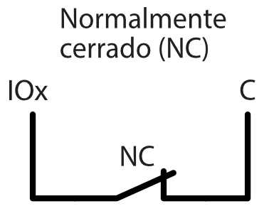
  </figure>
  <figure style="margin: 0;">
    
  </figure>

  <figure style="margin: 0;">
    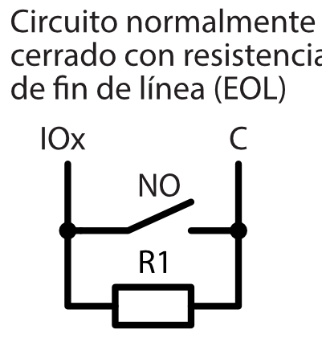
  </figure>
  <figure style="margin: 0;">
    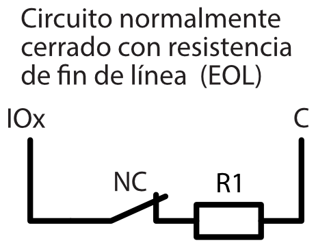
  </figure>
  <figure style="margin: 0;">
    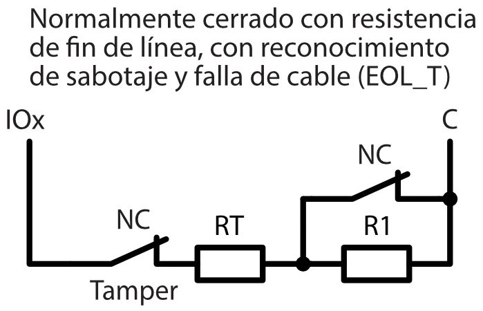
  </figure>

  <figure style="margin: 0;">
    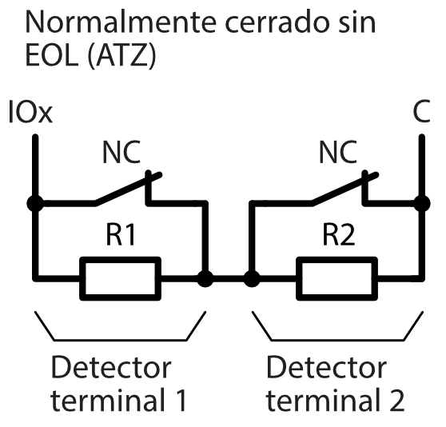
  </figure>
  <figure style="margin: 0;">
    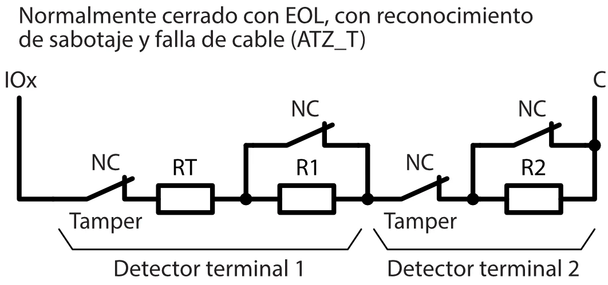
  </figure>

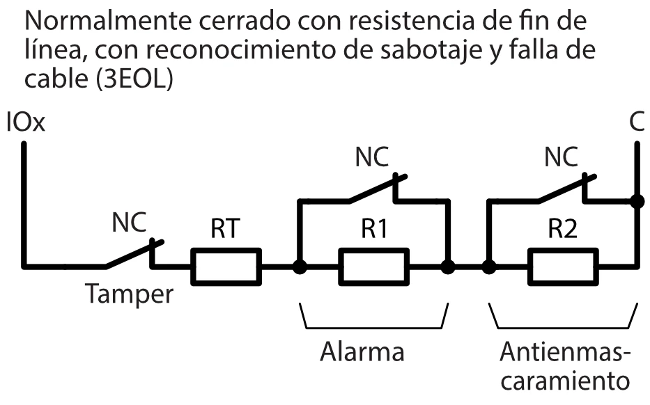

### Esquema para conectar un relé 

Usando las terminales de relé es posible controlar (encender/apagar) de forma remota varios dispositivos eléctricos. El terminal I/O universal del expansor inalámbrico *iO-8-LORA* debe configurarse como una salida (OUT) y debe tener asignada la definición de *"*Control remoto*"*.

### Esquema de conexión del expansor iO-8-LORA al panel de control "FLEXi" SP3 

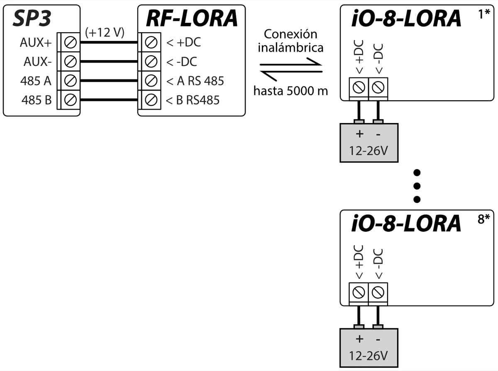

!!! note
    Se debe conectar un transceptor RF-LORA al panel de control
    "FLEXi" SP3 y se pueden conectar hasta 8 expansores
    inalámbricos iO-8-LORA.
## Panel de control de seguridad “FLEXi” SP3

1.  Se debe conectar un transceptor RF-LORA al panel de control "FLEXi" SP3.

2.  Encienda la fuente de alimentación del panel de control "FLEXi" SP3.

3.  Encienda la fuente de alimentación del expansor inalámbrico iO-8-LORA.

4.  Ejecuta ***TrikdisConfig**.*

5.  Conecta el "FLEXi" SP3 a una computadora con un cable USB Mini-B o conéctate al "FLEXi" SP3 de forma remota.

6.  Haga clic en **Leer [F4]** para ver los parámetros actuales "FLEXi" SP3. Si se le solicita, introduzca el código del administrador o instalador de en la ventana emergente.

7.  En la lista "**Módulos**", seleccione "**iO-8-LORA Expansor**".

8.  En el campo "**Núm. de Serie**", ingrese el número de serie del módulo.

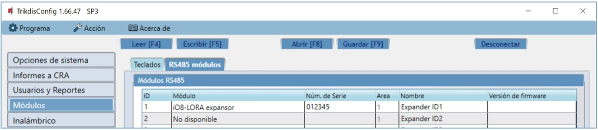

9.  En la pestaña "**Zonas**", configure la entradas del expansor.

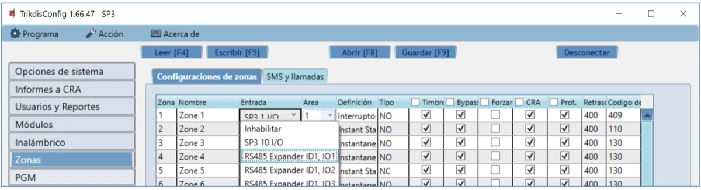

10. En la pestaña "**PGM**", realice los ajustes para la salidas PGM del expansor**.**

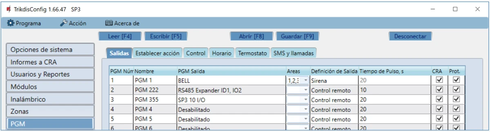

11. Una vez que se finalice la configuración, haz clic en el botón **Escribir [F5]**.

12. Espera a que finalicen las actualizaciones.

13. Haga clic en el botón "**Desconectar**" y desconecte el cable USB.

## Precauciones de seguridad 

Solo el personal calificado puede instalar y servicio el módulo de alarma de intrusión.

Por favor, lea atentamente este manual antes de la instalación con el fin de evitar errores que pueden conducir a un mal funcionamiento o incluso daños en el equipo.

Siempre desconecte la fuente de alimentación antes de realizar las conexiones eléctricas.

Los cambios, modificaciones o reparaciones no autorizadas por el fabricante deberán invalidar la garantía.

Cumpla con la normativa local y no deseche su sistema de alarma inutilizables o sus componentes con los residuos domésticos.
