# PB-LoRa Botón de pánico inalámbrico

  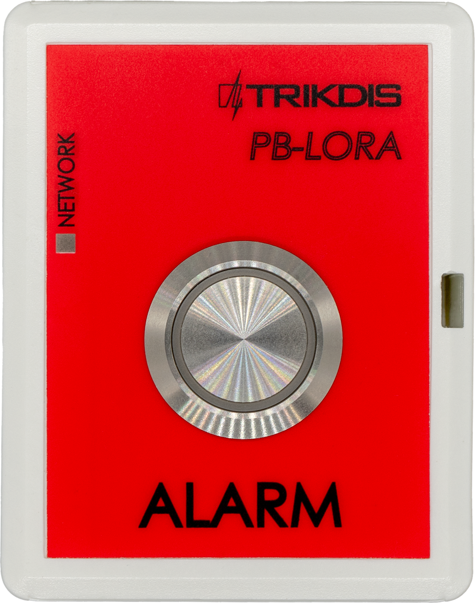

## Description

El *PB-LORA* está diseñado para la transmisión inalámbrica de un mensaje de llamada de emergencia. Una llamada de ayuda se inicia presionando un botón. Como dispositivo receptor de mensajes se utiliza el módulo RF-LORA, que se conecta al panel de control "FLEXi" SP3.

Compatible con el panel de control de seguridad [SP3](../../control-panels/sp3/index.md).

Se pueden asignar 8 botones de pánico PB-LORA al panel de control si el panel de control tiene la versión de firmware 1.17 o superior (por ejemplo: SP3_xxxx_0117.fw). Si el panel de control tiene la 2 reversión de firmware 1.16 o superior (por ejemplo, SP3_xxx2_0116.fw), entonces se pueden asignar 250 botones de pánico PB-LORA a este panel de control.

**Características**

**Comunicación:**

- La distancia operativa de la comunicación inalámbrica en la línea de visión directa es de hasta 5000 m.

**Conexión:**

- El pulsador de pánico inalámbrico *PB-LORA* se conecta a la central de seguridad *"FLEXi" SP3* a través del transceptor *RF-LORA*.
### Parámetros técnicos 

| Parámetro | Descripción |
|----|----|
| Frecuencia de transmisión | 433,3-434,7 MHz |
| Tipo de modulación | LORA |
| Tensión de alimentación | 3 V, batería CR123A |
| Duración de la batería | Al menos 3 años |
| Consumo actual | hasta 0,008 mA (en espera) /​ hasta 50 mA (a corto plazo, mientras se envía) |
| Cifrado de mensajes | Si |
| Rango en área abierta | hasta 5000 m |
| Entorno operativo | Temperatura de -10 ° C a +50 ° C, humedad relativa - de hasta 80% a +20 ° C |
| Dimensiones | 62 x 77 x 25 mm |
| Peso | 80 g |

### Elementos del botón de pánico 

> **Nota:** consulte la etiqueta del producto para la ubicación de cada elemento.

### Indicación LED de funcionamiento

| Indicador | Acción | Descripción |
|-----------|--------|-------------|
| NETWORK | Después de presionar el botón "ALARM" | Primer parpadeo verde: mensaje enviado, el voltaje de la batería es bueno. |
| NETWORK | Primer parpadeo rojo: mensaje enviado, el voltaje de la batería es bajo. | Primer parpadeo verde: mensaje enviado, el voltaje de la batería es bueno. |
| NETWORK | Segundo parpadeo rojo: se ha recibido la confirmación de la recepción del mensaje del módulo RF-LORA. |  |
| NETWORK | Después de presionar el botón "TAMP" |  |
| NETWORK | Primer parpadeo rojo: mensaje enviado, el voltaje de la batería es bajo. |  |
| NETWORK | Segundo parpadeo rojo: se ha recibido la confirmación de la recepción del mensaje del módulo RF-LORA. |  |
| NETWORK | Tercer a duodécimo parpadeo - nivel de señal de radio *. |  |

\* recomendado para su uso cuando hay al menos cuatro parpadeos.

NOTA: Después de insertar la batería, se recomienda esperar al menos 10 segundos antes de usar el dispositivo.  

## Instalación, diagramas de conexión 

### Fijación 

1.  Retire la tapa superior.

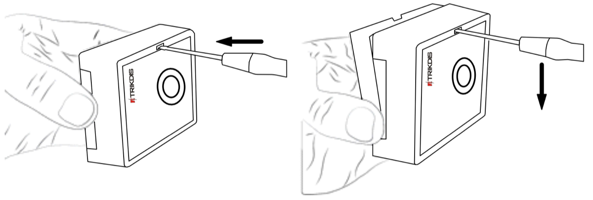

2.  Retire la placa PCB.

3.  Fijar la base de la caja en el lugar deseado usando tornillos.

4.  Vuelva a insertar la placa.

5.  Inserte la batería en el módulo.

6.  Cierre la tapa superior.

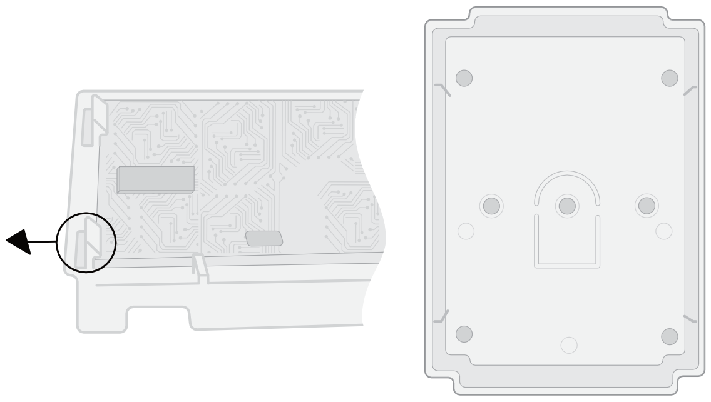

### Esquema de conexión del botón de pánico inalámbrico PB-LORA 

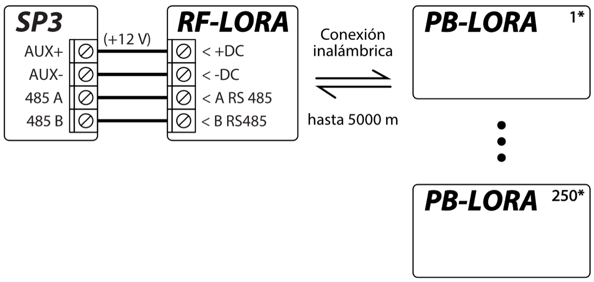

!!! note
    El transceptor RF-LORA debe estar conectado al panel de control
    "FLEXi" SP3. Hasta 8 botones de pánico inalámbricos
    PB-LORA (versión de firmware del panel de control 1.17 o superior.
    Por ejemplo: SP3_xxxx_0117.fw) o hasta 250 botones PB-LORA (si el
    panel de control tiene la 2 revisión de firmware 1.16 o superior. Por
    ejemplo: SP3_xxx2_0116.fw) se puede conectar al panel de control.
- 

## Panel de control de seguridad “FLEXi” SP3

El panel de control "FLEXi" SP3 debe tener instalada la versión de firmware 1.17 o superior (por ejemplo, SP3_xxxx_0117.fw).

1.  El transceptor RF-LORA debe estar conectado al panel de alarma "FLEXi" SP3.
2.  Encienda la fuente de alimentación a la unidad de control "FLEXi" SP3.

3.  El botón de pánico inalámbrico PB-LORA debe tener una batería instalada.

4.  Ejecute TrikdisConfig.

5.  Conecte "FLEXi" SP3 mediante un cable USB Mini-B a la PC o de forma remota.

6.  Haga clic en el botón **Leer [F4]** en TrikdisConfig para mostrar los valores actuales de los parámetros operativos de "FLEXi" SP3. Si se le solicita, ingrese el código de administrador o instalador en el cuadro que aparece.

7.  Seleccione "**PB-LORA Botón de pánico** " de la lista "**Módulos**".

8.  En el campo "**Núm. de Serie**" introduzca el número de serie del módulo PB-LORA.

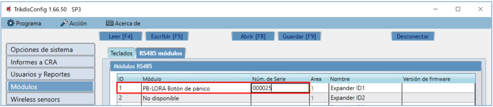

9.  En la lista **"Zonas",** configure el botón de pánico.

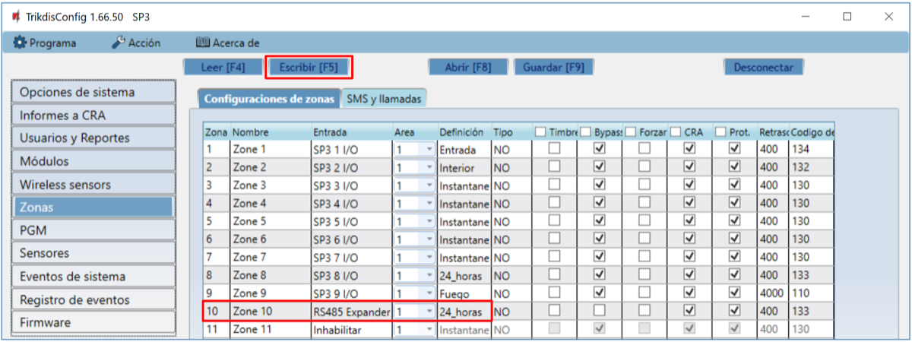

10. Presione **Escribir [F5]** después de realizar los cambios.

11. Espere a que se completen las actualizaciones.

12. Desconecte el cable USB Mini-B.

13. Espere 1 minuto. Presione el botón "**ALARM**" en el módulo PB-LORA.

14. Conecte el cable USB Mini-B al "FLEXi" SP3.

15. Presione **Leer [F4].**

16. En la lista de "**Módulos**", la línea " **PB-LORA Botón de pánico**" indicará la versión de Firmware.

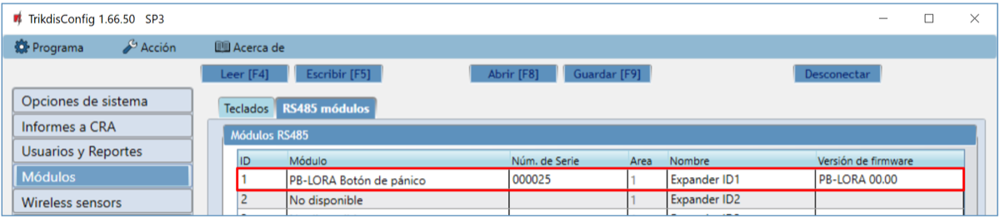

17. Haga clic en "**Desconectar**" y desconecte el cable USB.

!!! note
    Eliminación de botones de pánico inalámbricos PB-LORA de la
    memoria del "FLEXi" SP3:
    
    1.  Ejecute TrikdisConfig.
    1.  Conecte el "FLEXi" SP3 mediante un cable USB Mini-B a la
        computadora o conéctese al "FLEXi" SP3 de forma remota.
        Pulse el botón **Leer [F4]**.
    
    2.  En el programa TrikdisConfig, en la ventana "**Módulos**",
        en el campo "**Módulo**" donde se registró el botón de pánico
        PB-LORA, especifique "**No disponible**" y presione
        **Escribir [F5]**. Sensor inalámbrico eliminado de la memoria
        "FLEXi" SP3.
## Registro de 250 botones de pánico PB-LORA al panel de control "FLEXi" SP3 

En el panel de control "FLEXi" SP3, se debe instalar la 2ª revisión de firmware 1.16 o superior (por ejemplo, SP3_xxx2_0116.fw).

1.  El transceptor RF-LORA debe estar conectado al panel de alarma "FLEXi" SP3.

2.  Encienda la fuente de alimentación al panel de alarma "FLEXi" SP3.

3.  El botón de pánico inalámbrico PB-LORA debe tener una batería instalada.

4.  Ejecute TrikdisConfig.

5.  Conéctese a "FLEXi" SP3 de forma remota.

!!! note
    La configuración remota solo funcionará cuando **„*FLEXi" SP3***:
    
    1.  El canal de comunicación WiFi/LAN está configurado o se inserta una
        tarjeta SIM activada y se ingresa o deshabilita el código PIN.
    
    2.  Internet móvil está habilitado en la tarjeta SIM.
    
    3.  El servicio de servicio de Protegus está habilitado.
    
    4.  Encendido fuente de alimentación (el LED "**PWR**" parpadea en
        verde).
    
    5.  Registrado en la red (el LED "**NET**" está verde y parpadea en
        amarillo).
6.  En el campo "**Acceso remoto**" de TrikdisConfig, ingrese el número de "**ID único**" del panel de control "FLEXi" SP3. Encontrará este número en el embalaje del dispositivo y en el panel de control.

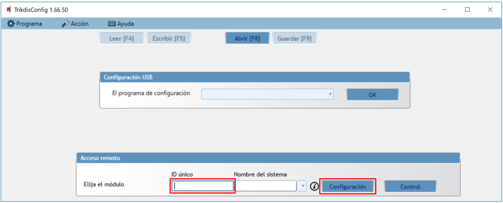

7.  Pulse "**Configuración**".

8.  En la ventana que se abre, presione **Leer [F4]**. Introduzca el código de administrador o instalador cuando se lo solicite el programa.

9.  Seleccione "**RF-LORA transceiver**" de la lista "**Módulos**".

10. En el campo "**Núm. de Serie**" introduzca el número de serie del módulo RF-LORA.

11. Presione **Escribir [F5]**.

12. Espere a que se completen las actualizaciones.

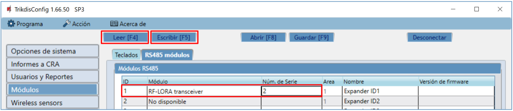

13. Espere 1 minuto.

14. Presione **Leer [F4].**

15. En la lista "**Módulos**", la línea "**RF-LORA transceiver**" indicará la versión de firmware.

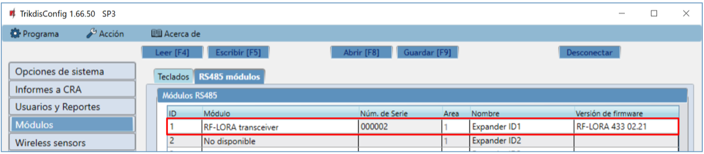

16. Vaya a la ventana "**Sensores inalámbricos**".

17. Pulse "**Emparejamiento de sensores**".

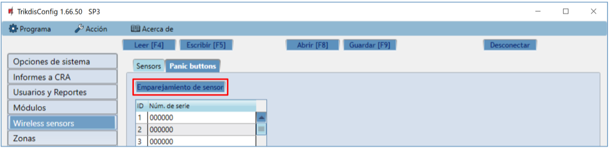

El registro de los botones de pánico inalámbricos se puede hacer para todos a la vez.

Al registrar botones de pánico PB-LORA, el módulo RF-LORA debe estar al menos a 1 m de distancia de los botones.

18. El LED "**DATA/TROUBLE**" comenzará a parpadear en rojo/verde en el módulo RF-LORA.

19. El módulo RF-LORA esta en el modo de preentrenamiento. TrikdisConfig abrirá la ventana del tutorial del programa.

20. Presione brevemente el botón "**TAMP**" en el tablero PB-LORA.

21. En el módulo RF-LORA, el indicador "**DATA/TROUBLE**" se iluminará en verde durante unos segundos. Después de eso, el LED "**DATA/TROUBLE**" en el módulo RF-LORA comenzará a parpadear en rojo/verde.

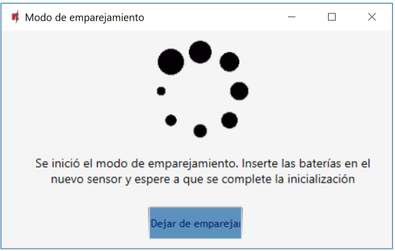

22. Después de unos segundos, el botón de pánico PB-LORA se agregará a la lista de sensores.

23. El número de “**UID**” debe coincidir con el número de serie del PB-LORA, que está escrito en la etiqueta de la caja.

24. Si necesita enseñar el siguiente botón de panico, debe presionar el botón "**TAMP**" en el tablero por un corto tiempo.

25. Si la carga de los sensores ha terminado, presione " **Dejar de emparejamiento**".

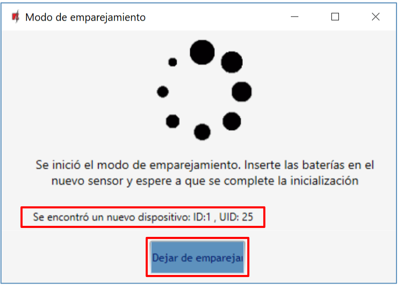

26. Presiona "**Sí**" en la ventana que se abre. Los registrados botones de pánico PB-LORA se almacenarán en la memoria del panel de control "FLEXi" SP3.

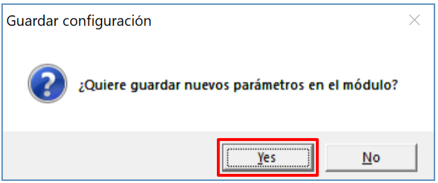

Espera unos minutos. Pulse el botón **Leer [F4].**

En TrikdisConfig, la ventana "**Sensores inalámbricos**" contendrá una lista de botones de pánico PB-LORA registrados. El campo "**Núm. de Serie**" contendrá los números de serie de 6 dígitos de los botones de pánico, que deben coincidir con los números de serie de PB-LORA impresos en la parte posterior de la caja.

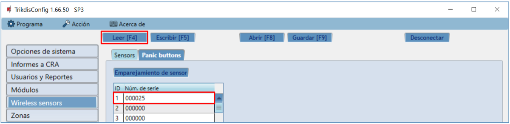

!!! note
    Eliminación de botones de pánico PB-LORA de la memoria del
    "FLEXi" SP3:
    
    1.  Ejecute TrikdisConfig.
    
    2.  Conecte el "FLEXi" SP3 mediante un cable USB Mini-B a la
        computadora o conéctese al "FLEXi" SP3 de forma remota.
        Pulse el botón **Leer [F4].**
    
    3.  En TrikdisConfig, en la ventana "**Sensores inalámbricos**",
        ingrese "**0**" en el campo "**Número de serie**" y presione
        **Escribir [F5].** El botón de pánico PB-LORA se elimina de
        la memoria "FLEXi" SP3.
## REQUERIMIENTOS DE SEGURIDAD

Solo el personal calificado puede instalar y servicio el módulo de alarma de intrusión.

Por favor, lea atentamente este manual antes de la instalación con el fin de evitar errores que pueden conducir a un mal funcionamiento o incluso daños en el equipo.

Siempre desconecte la fuente de alimentación antes de realizar las conexiones eléctricas.

Los cambios, modificaciones o reparaciones no autorizadas por el fabricante deberán invalidar la garantía.

Cumpla con la normativa local y no deseche su sistema de alarma inutilizables o sus componentes con los residuos domésticos.
