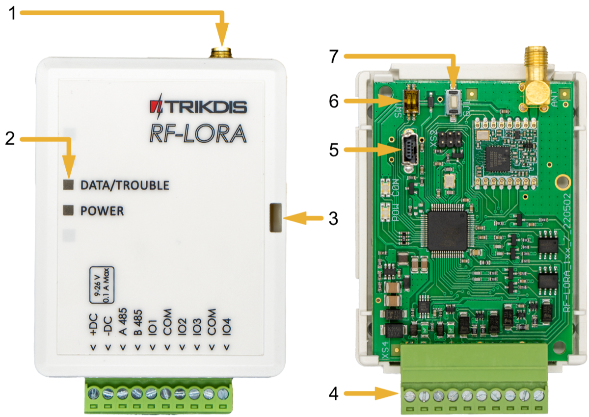
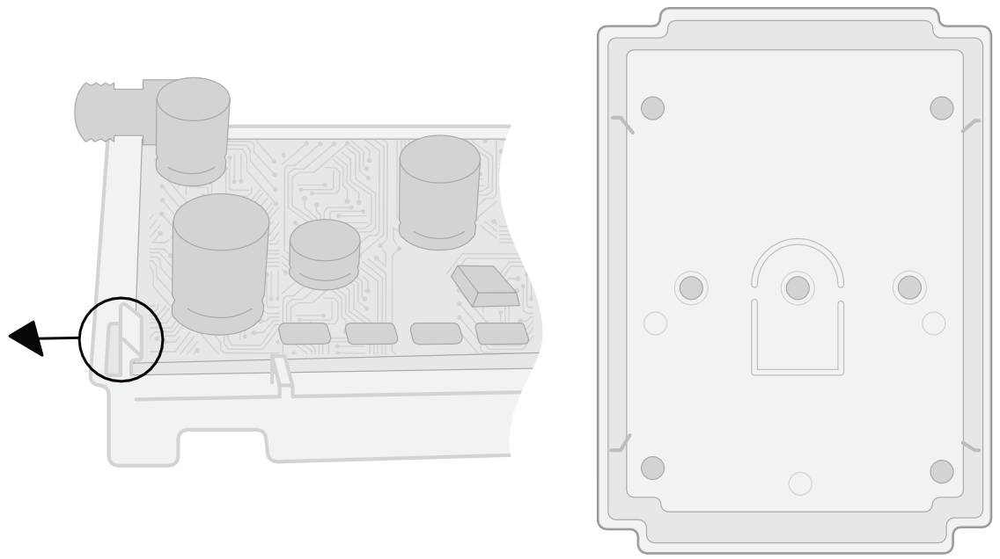
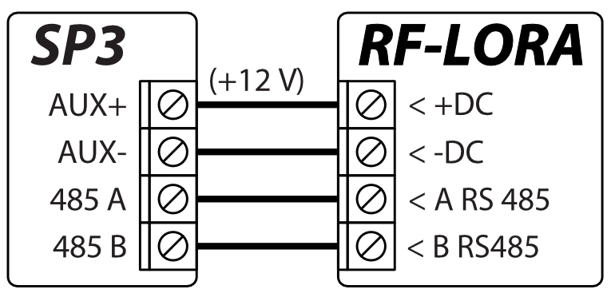
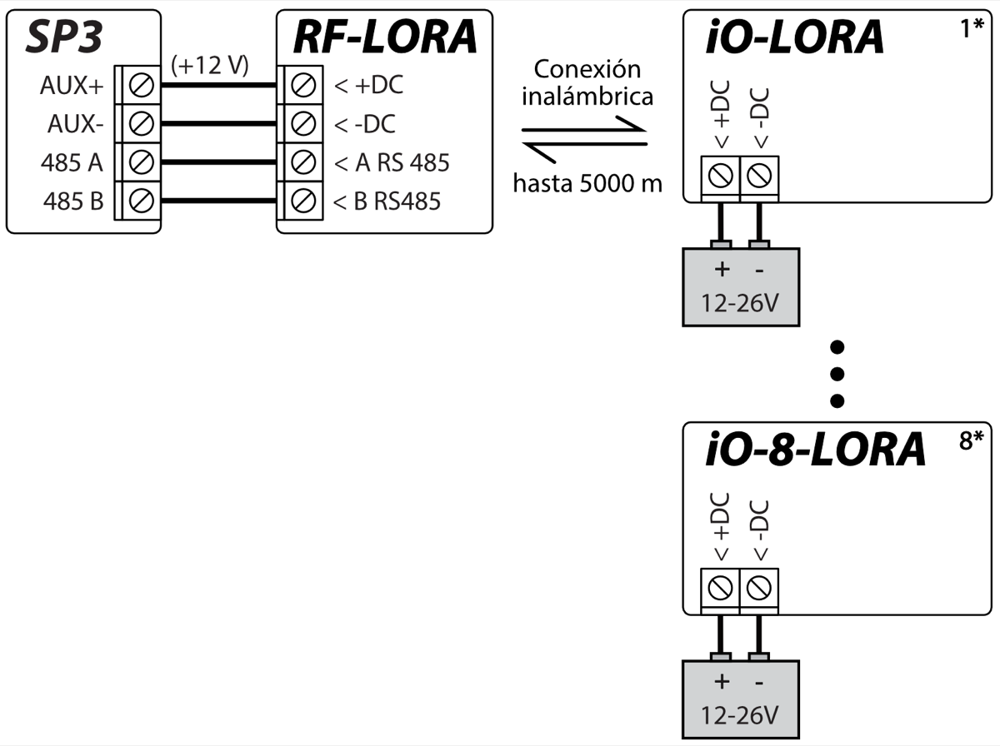
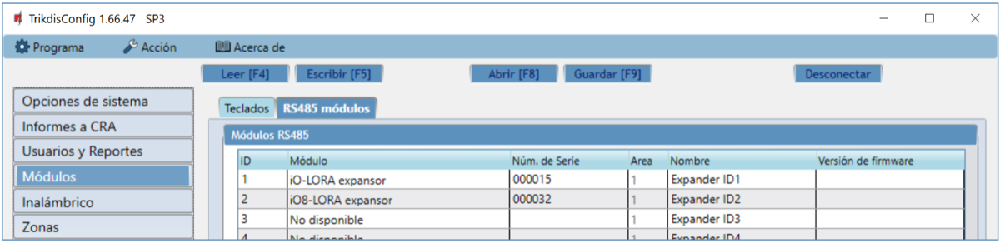
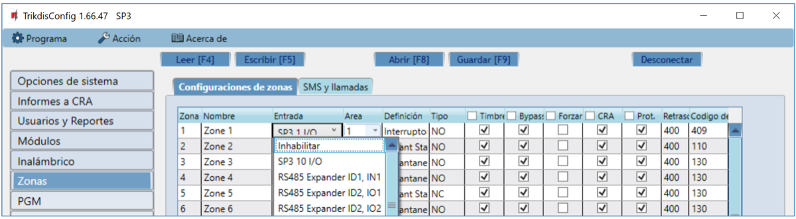
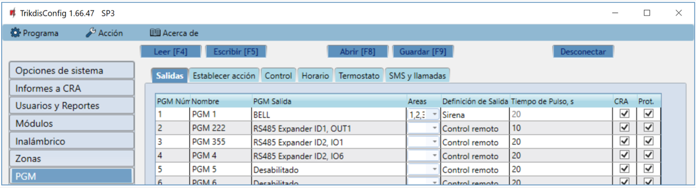

# RF-LoRa Expansor Inalámbrico

  

## Descripción

Transceptor RF-LORA con expansores inalámbricos iO-LORA e iO-8-LORA aumenta el número de entradas y salidas del panel de control "FLEXi" SP3 mediante comunicación RF bidireccional.

También compatible con los controladores de acceso a puertas y portones [GATOR Cellular](../../gate-controllers/gator/index.md) y [GATOR WiFi](../../gate-controllers/gator-wifi/index.md).
Se pueden conectar hasta 8 módulos LORA (iO-LORA, iO-8-LORA, PB-LORA) al panel de control "FLEXi" SP3 mediante el transceptor RF-LORA.

**Características**

Comunicación:

- Alcance inalámbrico de línea de visión de hasta 5000 m.

- Se puede conectar un transceptor *RF-LORA* al panel de control *"FLEXi" SP3*.

- El producto viene con una antena estándar adecuada para la mayoría de los casos. <u>En los casos en que sea necesario proporcionar una comunicación de alta calidad a la máxima distancia posible, se debe utilizar una antena (AX-ANT-KIT – 433 MHz, AX-ANT01S_SF – 868 MHz) con una mayor ganancia de señal de radio</u>.

Conexión:

- El transceptor *RF-LORA* se conecta al panel de control *"FLEXi" SP3* a través del bus RS485*.*
### Parámetros Técnicos 

| Parámetro | Descripción |
|----|----|
| Frecuencia de transmisión | Modificación 8F: 867-869 MHz /​ Modificación 4F: 433,3-434,7 MHz |
| Tipo de modulación | LORA |
| Tensión de alimentación | 9-26 V DC |
| Consumo actual | hasta 50 mA (en espera) /​ hasta 150 mA (a corto plazo, mientras se envía) |
| Cifrado de mensajes | Si |
| Rango en área abierta | hasta 5000 m |
| Entorno operativo | Temperatura de -20 ° C a +50 ° C, humedad relativa - de hasta 80% a +20 ° C |
| Dimensiones | 65 x 82 x 25 mm |
| Peso | 80 g |

### Elementos expansores

> **Nota:**

### Descripción del Bloque de Terminales 

| Terminal | Descripción                            |
|----------|----------------------------------------|
| +DC      | Terminal de poder (9-26 V DC positive) |
| -DC      | Terminal de poder (9-26 V DC negativo) |
| A 485    | Terminal A del bus de datos *RS485*    |
| B 485    | Terminal B del bus de datos *RS485*    |
| IO1-IO4  | No utilizado                           |
| COM      | No utilizado                           |

### Indicación de LED 

| Indicador | Estados de LED | Descripción |
|-----------|----------------|-------------|
| DATA/TROUBLE | Rojo parpadeante/fijo | La comunicación con el módulo está rota |
| DATA/TROUBLE | Verde/rojo parpadeando | Modo de vinculación del módulo LORA |
| DATA/TROUBLE | Verde encendido durante 3 segundos | Módulo LORA emparejado (en modo de emparejamiento) |
| POWER | Off | Sin tensión de alimentación |
| POWER | Verde parpadeando | Nivel normal de tensión de alimentación |
| POWER | Amarillo parpadeando | Tensión de alimentación baja (≤11,5 V) |
| POWER | Amarillo | Sin comunicación con el panel de control "FLEXi" SP3 vía RS485 |

## Esquemas de conexión 

### Fijación 

1.  Retire la tapa superior.

2.  Retire la placa PCB.

3.  Fijar la base de la caja en el lugar deseado usando tornillos.

4.  Vuelva a insertar la placa.

5.  Cierre la tapa superior.

### Conexión del transceptor RF-LORA al panel de control "FLEXi" SP3 

### Esquema de cableado para expansores LORA 

## Configuración con TrikdisConfig

1.  Se debe conectar un transceptor RF-LORA al panel de control "FLEXi" SP3.

2.  Encienda la fuente de alimentación del panel de control "FLEXi" SP3.

3.  Encienda la fuente de alimentación de los expansores inalámbricos iO-LORA y/o iO-8-LORA.

4.  Ejecuta ***TrikdisConfig**.*

5.  Conecta el "FLEXi" SP3 a una computadora con un cable USB Mini-B o conéctate al "FLEXi" SP3 de forma remota.

6.  Haga clic en **Leer [F4]** para ver los parámetros actuales "FLEXi" SP3. Si se le solicita, introduzca el código del administrador o instalador de en la ventana emergente.

7.  En la lista "**Módulos**", seleccione "**iO-LORA Expansor**" ("**iO-8-LORA Expansor**").

8.  En el campo "**Núm. de Serie**", ingrese el número de serie del módulo.

9.  En la pestaña "**Zonas**", configure la entradas del expansor.

10. En la pestaña "**PGM**", realice los ajustes para la salidas PGM del expansor**.**

11. Una vez que se finalice la configuración, haz clic en el botón **Escribir [F5]**.

12. Espera a que finalicen las actualizaciones.

13. Haga clic en el botón "**Desconectar**" y desconecte el cable USB.

14. Active las entradas y cambie las salidas para probar el dispositivo.

## Precauciones de seguridad 

Solo el personal calificado puede instalar y servicio el módulo de alarma de intrusión.

Por favor, lea atentamente este manual antes de la instalación con el fin de evitar errores que pueden conducir a un mal funcionamiento o incluso daños en el equipo.

Siempre desconecte la fuente de alimentación antes de realizar las conexiones eléctricas.

Los cambios, modificaciones o reparaciones no autorizadas por el fabricante deberán invalidar la garantía.

Cumpla con la normativa local y no deseche su sistema de alarma inutilizables o sus componentes con los residuos domésticos.
