# RF-S8 Transceptor inalámbrico

  

## Descripción 

Al conectar el transceptor RF-S8, "FLEXi" SP3 puede funcionar con sensores inalámbricos, sirenas y controles remotos “S8”.

Compatible con el panel de control de seguridad [SP3](../../control-panels/sp3/index.md).

**Características**

Comunicación:

- Alcance inalámbrico de línea de visión de hasta 500 m.

- Se puede conectar un transceptor *RF-S8* al panel de control *"FLEXi" SP3*.

- El producto viene con una antena estándar adecuada para la mayoría de los casos.

Conexión:

- El transceptor *RF-S8* se conecta al panel de control *"FLEXi" SP3* a través del bus RS485*.*
### Parámetros Técnicos 

| Parámetro | Descripción |
|----|----|
| Tensión de alimentación [DC] | 9-26 V DC |
| Consumo actual | Hasta 50 mA (en espera), /​ Hasta 100 mA (a corto plazo, mientras se envía) |
| Frecuencia de transmisión | 868 MHz |
| Intensidad de la señal de radio | 25 mW |
| Rango en área abierta | Hasta 500 m |
| Entorno operativo | Temperatura desde -10°C a +50°C, humedad relativa del 80% a +20°C, sin condensación |
| Dimensiones | 92x62x25 mm |
| Peso | 0,08 kg |

### Elementos del transceptor 

1.  Antena RF conector SMA

2.  Indicadores de LED.

3.  Ranura de apertura de la tapa frontal.

4.  Terminales para cableado.

5.  El conector USB Mini-B es para actualizaciones de software.

6.  Botón para activar/desactivar el modo de emparejamiento.

### Descripción del Bloque de Terminales 

| Terminal | Descripción                            |
|----------|----------------------------------------|
| +DC      | Terminal de poder (9-26 V DC positive) |
| -DC      | Terminal de poder (9-26 V DC negativo) |
| A 485    | Terminal A del bus de datos *RS485*    |
| B 485    | Terminal B del bus de datos *RS485*    |

### Indicación de LED 

| Indicador | Estados de LED | Descripción |
|-----------|----------------|-------------|
| NETWORK | Verde/rojo parpadeando | Modo de aprendizaje del sensor |
| NETWORK | Verde encendido durante 5 segundos | Sensor aprendido (en modo de aprendizaje) |
| POWER | Off | Sin tensión de alimentación |
| POWER | Verde parpadeando | Nivel normal de tensión de alimentación |
| POWER | Amarillo parpadeando | Tensión de alimentación baja (≤11,5 V) |
| POWER | Amarillo | Sin comunicación con el panel de control "FLEXi" SP3 vía RS485 |

## Cambio de software del panel de control 

El panel de seguridad **„*FLEXi” SP3*** debe estar equipado con la revisión de firmware 4 **SP3_xxx4\_0122.fw** (versión de firmware 1.22 o superior), lo que garantizará el funcionamiento de los sensores inalámbricos “S8”. El transceptor inalámbrico RF-S8 debe estar conectado al panel de seguridad.

Siga los pasos a continuación para reemplazar el firmware:

1.  De acuerdo con el esquema, conecte el módulo RF-S8 a „FLEXi” SP3.

2.  Encienda la fuente de alimentación del panel de control **„*FLEXi” SP3***.

3.  Ejecuta TrikdisConfig.

4.  Conecte el **„*FLEXi” SP3*** a su computadora con un cable USB Mini-B.

5.  Abre la ventana **„Firmware”** de TrikdisConfig.

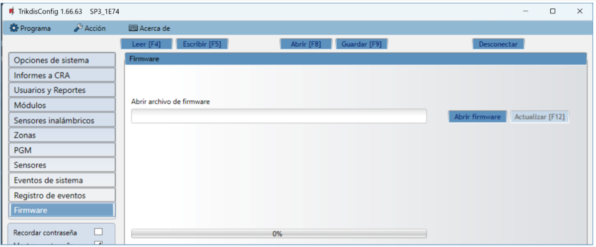

6.  Haga clic en el botón **„Abrir firmware”** y seleccione el archivo de firmware **SP3_xxx4\_0122.fw**.

7.  Haga clic en el botón **Actualizar [F12]**.

8.  Espere a que se lleve a cabo la actualización del firmware.

9.  Desconecte el cable USB Mini-B.

10. Espere 1 minuto.

11. Conecte el cable USB Mini-B a **„*FLEXi” SP3***.

12. La barra de estado de TrikdisConfig debe contener el número 4 en el nombre del panel de control.

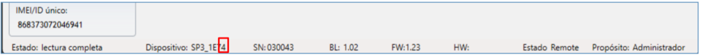

13. En la lista de módulos debe aparecer “**RF-S8 módulo**”, y también se indicará el número de serie y la versión del firmware. Si ve la versión de firmware del transceptor RF-S8, puede omitir los pasos 14 a 22.

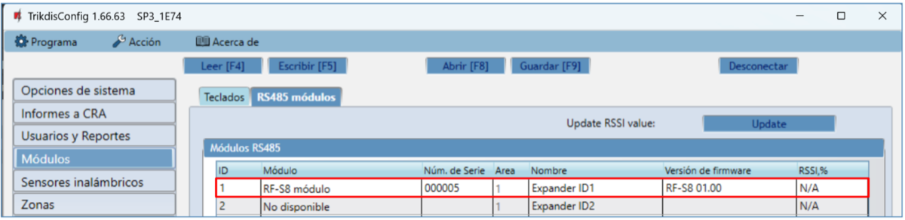

14. Si “**RF-S8 módulo**” no se indica en la lista, entonces debe seleccionar “**RF-S8 módulo**” en la lista.

15. En el **„Núm. de Serie”** campo, ingrese el número de serie del dispositivo RF-S8. El número de serie se puede encontrar en el dispositivo y en la etiqueta del embalaje.

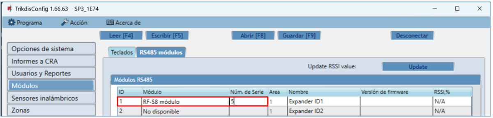

16. Haga clic en **Escribir [F5]**.

17. Desconecte el cable USB Mini-B.

18. Espere 1 minuto para que el **„*FLEXi” SP3 y el RF-S8*** se conecten.

19. Conecte el cable USB Mini-B a “FLEXi” SP3.

20. Haga clic en **Leer [F4]**.

21. La versión de firmware del RF-S8 aparecerá en la ventana **„Módulos”**.

22. El módulo RF-S8 ahora está vinculado al “FLEXi” SP3.

23. Desconecte el cable USB Mini-B.

24. Haga clic en **„Desconectar”**.

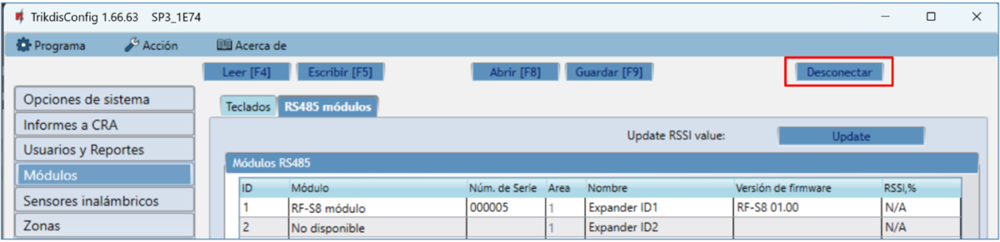

25. Espere 1 minuto.

## Vinculación de sensores inalámbricos 

### Registro remoto de sensores inalámbricos 

Mediante TrikdisConfig, conéctese de forma remota al panel de control **„*FLEXi” SP3***.

!!! note
    La configuración remota solo funcionará cuando **„*FLEXi" SP3***:
    
    1.  Se debe insertar una tarjeta SIM activada y se debe ingresar o
        deshabilitar el código PIN.
    
    2.  Internet móvil está activado en la tarjeta SIM.
    
    3.  El servicio en la nube de Protegus debe estar habilitado.
    
    4.  La alimentación debe estar encendida (el LED **„PWR"** debe estar
        parpadeando en verde).
    
    5.  Debe estar conectado a la red (el LED **„NET"** debe estar verde
        fijo y amarillo parpadeando).
!!! note
    **Los sensores inalámbricos se pueden registrar y cancelar en el panel
    de control. <u>Al desvincular los sensores inalámbricos del panel de
    control, el panel de control no debe estar en el modo de registro de
    sensores inalámbricos</u>. Antes de registrarlos, deben
    cancelarse. Mantenga presionado el botón de aprendizaje durante 5
    segundos. Cuando el indicador del sensor inalámbrico parpadee en verde
    tres veces, suelte el botón. El sensor inalámbrico se cancelará en el
    panel de control. Este procedimiento debe realizarse en todos los
    sensores inalámbricos antes de registrarlos. IMPORTANTE: SI EL SENSOR
    INALÁMBRICO SE DESVINCULAR ACCIDENTALMENTE, NO FUNCIONARÁ CON EL PANEL
    DE CONTROL.**
En la sección **„Acceso remoto”** ingrese el número **„ID único”** del panel de control. Este número se puede encontrar en el dispositivo y en la etiqueta del empaque.

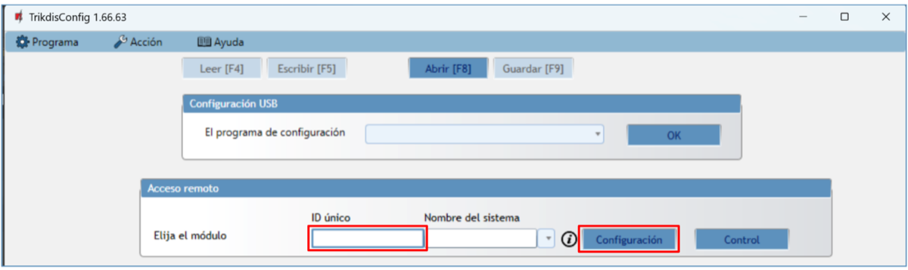

Haga clic en **„Configuración”**.

En la ventana recién abierta, haga clic en **Leer [F4]**. Si es necesario, introduzca el código de administrador o instalador.

Vaya a la ventana **„Sensores inalámbricos”**.

Haga clic en el botón **„Emparejamiento de sensor”**.

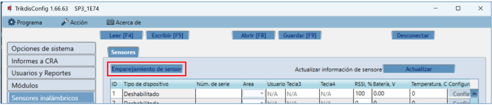

Todos los sensores inalámbricos se pueden vincular simultáneamente. Inserte la batería en el sensor inalámbrico (PIR, contacto magnético, sensor de inundación, sensor de humo, sirena).

Al registrar sensores, el módulo *RF-S8* debe estar al menos a 1 m de los sensores.

1.  El indicador “**NETWORK**” en el módulo **RF- S8** parpadeará en verde/rojo.

2.  Módulo RF-S8: cambia al modo de aprendizaje. TrikdisConfig abrirá la ventana de enlace del sensor.

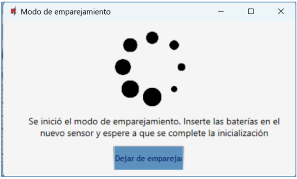

3.  Mantenga presionado el botón de aprendizaje durante 5 segundos. Cuando la luz indicadora parpadee en verde cuatro veces, suelte el botón.

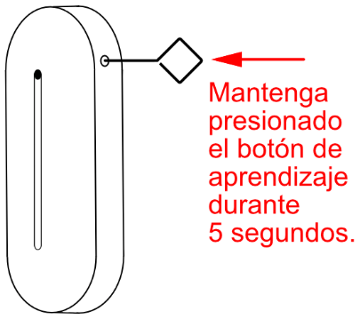

4.  En el módulo RF-S8, el indicador “**NETWORK**” se volverá verde por un corto tiempo (esto significa que el sensor está registrado). Después de unos segundos, el indicador “**NETWORK**” comenzará a parpadear en verde/rojo nuevamente.

5.  Se abrirá una nueva ventana en TrikdisConfig. El sensor debe tener asignado un **„Número de zona”** y una **„Definición de zona”**.

6.  Haga clic en **„Guardar”**.

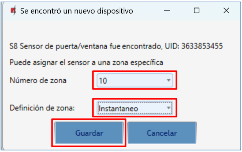

7.  El sensor inalámbrico está incluido en la lista de sensores.

8.  Si necesita agregar el siguiente sensor, presione el botón de aprendizaje en el sensor. Y realice los ajustes descritos anteriormente.

9.  Haga clic en **„Dejar de emparejamiento”** para completar el registro de sensores inalámbricos.

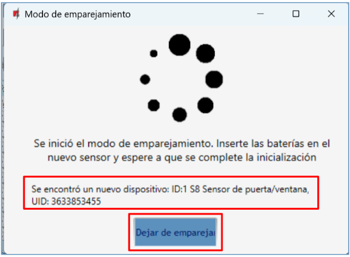

10. Haga clic en „**Sí**” para que los sensores se escriban en el panel de control **„*FLEXi” SP3*** o „**No**” si desea ajustar los parámetros de manera adicional.

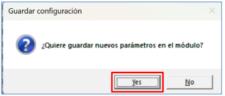

Espera unos minutos. Haga clic en **LEER [F4]**.

TrikdisConfig mostrará una lista de sensores inalámbricos registrados en la ventana **„Sensores inalámbricos”**. El campo "**Núm. de serie**" contendrá el número de serie.

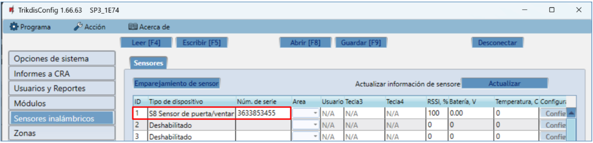

Verifique que los sensores estén correctamente asignados a las **„Zonas”** y **„Áreas”** del panel de control (ventana **„Zonas”**).

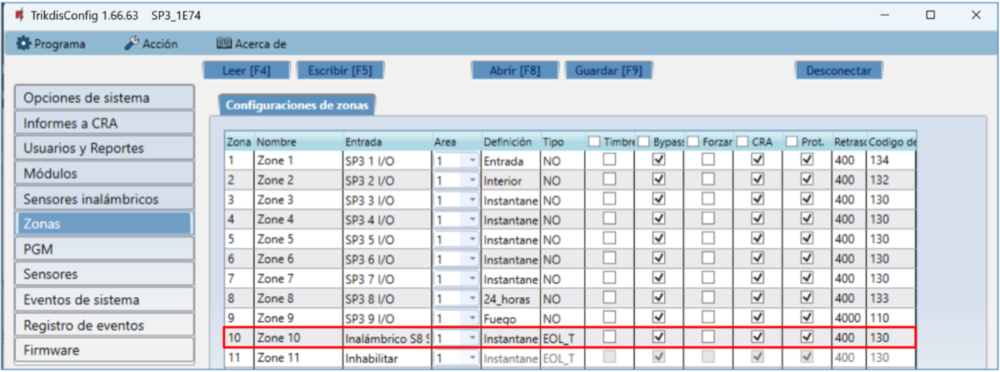

Si establece el tipo de zona **EOL-T**, se habilitará el modo de monitoreo de manipulación del sensor.

Haga clic en **Escribir [F5]** después de realizar los cambios.

!!! note
    Para eliminar sensores inalámbricos de la memoria del **„*FLEXi" SP3***:
    
    1.  Ejecuta ***TrikdisConfig**.*
    
    2.  Conecte el **„*FLEXi" SP3*** a una computadora mediante un cable USB
        Mini-B o conéctese al **„*FLEXi" SP3*** de forma remota. Haga clic
        en el botón **Leer [F4]**.
    
    3.  En la ventana de TrikdisConfig **„Sensores inalámbricos"**, en
        la columna **„Tipo de dispositivo"**, seleccione **„Deshabilitado"**
        en lugar del sensor inalámbrico que desea eliminar y haga clic en
        **Escribir [F5]**. El sensor inalámbrico ahora se elimina de la
        memoria del **„*FLEXi" SP3***.
### Registro de sensores inalámbricos sin acceso remoto 

Todos los sensores inalámbricos se pueden vincular simultáneamente. Inserte la batería en el sensor inalámbrico (PIR, contacto magnético, sensor de inundación, sensor de humo, sirena). **Al registrar sensores, el módulo *RF-S8* debe estar al menos a 1 m de los sensores.**

1.  Asegúrese de que el transceptor RF-S8 esté registrado con el panel de seguridad “FLEXi” SP3.

2.  Encienda el panel de seguridad “FLEXi” SP3.

3.  Retire la cubierta del transceptor RF-S8.

4.  Mantenga presionado el botón “**LEARN**” en el módulo RF-S8 hasta que el indicador “**NETWORK**” parpadee en verde/rojo.

5.  Suelte el botón "**LEARN**".

6.  Un indicador parpadeante “**NETWORK**” indica que el RF-S8 está en modo de registro de dispositivo inalámbrico.
7.  Mantenga presionado el botón de aprendizaje durante 5 segundos. Cuando la luz indicadora parpadee en verde cuatro veces, suelte el botón.

8.  En el módulo RF-S8, el indicador “**NETWORK**” se volverá verde por un corto tiempo (esto significa que el sensor está registrado).

9.  Después de unos segundos, el indicador “**NETWORK**” comenzará a parpadear en verde/rojo nuevamente.

10. Si necesita agregar el siguiente sensor, presione el botón de aprendizaje en el sensor.

11. Para completar el registro de sensores inalámbricos, debe presionar y mantener presionado el botón “**LEARN**” hasta que el indicador “**NETWORK**” deje de parpadear en verde/rojo. Suelte el botón "**LEARN**". El transceptor RF-S8 ha salido del modo de registro.

12. Conecte el cable USB Mini-B al “FLEXi” SP3.

13. Ejecute TrikdisConfig. Presione el botón **Leer [F4].**

14. TrikdisConfig mostrará una lista de sensores inalámbricos registrados en la ventana **„Sensores inalámbricos”**. El campo "**Núm. de serie**" contendrá el número de serie.

15. Verifique que los sensores estén correctamente asignados a las **„Zonas”** y **„Áreas”** del panel de control (ventana **„Zonas”**).

16. Haga clic en **Escribir [F5]** después de realizar los cambios.

17. Sensores inalámbricos registrados.
