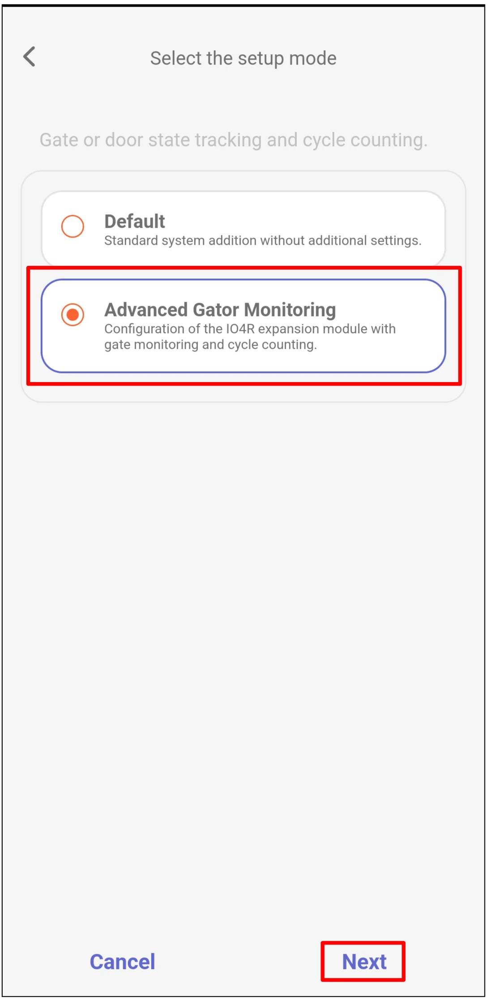
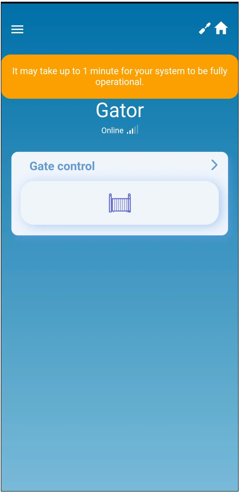
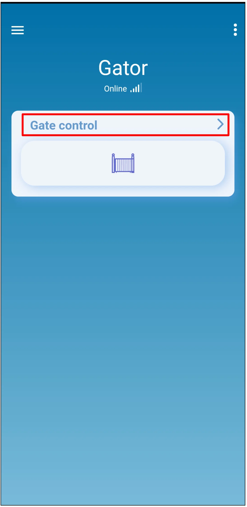

# Configuración rápida de GATOR LTE y GATOR WiFi con iO4R

  

Pasos breves de cableado y programación en Protegus2 para conectar un expansor iO4R a un controlador de puerta GATOR LTE o GATOR WiFi. Use esta guía junto con los manuales completos de [GATOR](../gator/index.md) y [GATOR WiFi](../gator-wifi/index.md) para los demás ajustes de instalación y configuración.

El iO4R se utiliza para la monitorización avanzada de puertas. Añade entradas Guard monitorizadas para sensores de seguridad de la puerta y permite una anulación temporal autorizada cuando se debe aislar un fallo del sensor hasta que se pueda realizar el servicio. Protegus2 también cuenta los ciclos completos de apertura y cierre de la puerta y avisa cuando corresponde el mantenimiento, ayudando a convertir llamadas no planificadas en visitas de servicio programadas y contratos de mantenimiento recurrentes.

!!! caution "Precaución"
    La instalación y el servicio deben ser realizados solo por personal cualificado. Desconecte la alimentación de red y la alimentación de baja tensión antes de cablear. Siga las instrucciones de seguridad del fabricante del operador de puerta y la normativa eléctrica local.

## Requisitos previos

- Controlador de puerta GATOR LTE o GATOR WiFi disponible para la configuración. Mantenga la alimentación desconectada durante el cableado.
- Número de serie del expansor iO4R.
- Cuenta de empresa o instalador en Protegus2 y el IMEI / Unique ID del controlador.
- Sensor de estado de puerta conectado a la entrada de posición de puerta del controlador.
- Sensores de seguridad de puerta conectados mediante el expansor iO4R, si se van a monitorizar o anular temporalmente en Protegus2.

## Cableado

Conecte el expansor iO4R al bus RS485 y a los terminales de alimentación del controlador como se muestra abajo.

!!! note "Nota"
    El esquema muestra las etiquetas de terminales de GATOR LTE. Para GATOR WiFi, use los terminales equivalentes `+DC`, `-DC`, `A RS485` y `B RS485` del manual de GATOR WiFi.

Use `3 I/O` como entrada de posición de puerta para el conteo de ciclos. Un ciclo se cuenta solo después de que la puerta se abre completamente y se cierra completamente.

!!! important "Importante"
    En la configuración de monitorización de Protegus2, `I/O 3` está reservado para la posición de puerta y el conteo de ciclos. No lo reasigne. Las entradas `IN1` e `IN2` están reservadas para Wiegand.

## Añadir el controlador y el iO4R en Protegus2

Inicie sesión en Protegus2 con la cuenta de empresa o instalador y añada el controlador.

  

    <strong>Paso 1.</strong> Toque <strong>Add new system</strong>.
    
  

  

    <strong>Paso 2.</strong> Introduzca el <strong>IMEI</strong> del controlador y toque <strong>Next</strong>.
    
  

  

    <strong>Paso 3.</strong> Seleccione <strong>Advanced Gator Monitoring</strong> y toque <strong>Next</strong>.
    
  

  

    <strong>Paso 4.</strong> Defina el número de <strong>Cycles</strong> tras el cual se requiere mantenimiento y toque <strong>Next</strong>.
    
  

  

    <strong>Paso 5.</strong> Active cada salida iO4R que esté conectada a un sensor de seguridad monitorizado o a un circuito de estado.
    
  

  

    <strong>Paso 6.</strong> Introduzca el <strong>Serial number</strong> del iO4R y toque <strong>OK</strong>.
    
  

  

    <strong>Paso 7.</strong> Para cada salida activada, defina el nombre y el icono, deje el <strong>Type</strong> de la salida como <strong>Guard</strong>, asigne la entrada iO4R correspondiente y defina el <strong>Type</strong> de la entrada según el cableado. En el ejemplo mostrado, el tipo de entrada es <strong>NO</strong>. Toque <strong>Next</strong>.
    
  

  

    <strong>Paso 8.</strong> Espere mientras Protegus2 escribe los datos.
    
  

  

    <strong>Paso 9.</strong> Toque <strong>Next</strong>.
    
  

  

    <strong>Paso 10.</strong> Introduzca el <strong>Name</strong> del sistema y toque <strong>Next</strong>.
    
  

  

    <strong>Paso 11.</strong> Toque <strong>Skip</strong>, salvo que quiera añadir usuarios ahora.
    
  

  

    <strong>Paso 12.</strong> Espere aproximadamente 1 minuto hasta que finalice.
    
  

## Transferir el sistema al usuario

Cuando la configuración esté completa, transfiera el sistema a la cuenta Protegus2 del usuario.

  

    <strong>Paso 13.</strong> Toque <strong>Menu</strong>.
    
  

  

    <strong>Paso 14.</strong> Toque <strong>Settings</strong>.
    
  

  

    <strong>Paso 15.</strong> Toque <strong>Transfer system</strong>.
    
  

  

    <strong>Paso 16.</strong> Introduzca la dirección de correo electrónico del usuario y toque <strong>Transfer</strong>.
    
  

## Comprobar la monitorización y el control de la puerta

El usuario debe iniciar sesión en Protegus2 con su cuenta después de la transferencia.

!!! warning "Advertencia"
    Anular un sensor de seguridad de puerta puede desactivar la protección de seguridad. Use la anulación solo como una acción de servicio temporal y autorizada, y restablezca el funcionamiento normal del sensor antes de dejar la instalación en servicio.

  

    <strong>Paso 17.</strong> Toque <strong>Gate control</strong> para ver el contador de ciclos de la puerta.
    
  

  

    <strong>Paso 18.</strong> Revise <strong>Total cycles</strong> y <strong>Cycles to maintenance</strong>. Si un instalador autorizado necesita inspeccionar el estado de los sensores de seguridad, toque <strong>Input status</strong>.
    
  

  

    <strong>Paso 19.</strong> Use <strong>Input status / bypass</strong> solo cuando se haya comprobado un sensor de seguridad y la anulación sea necesaria temporalmente.
    
  

  

    <strong>Paso 20.</strong> Toque el icono de control de puerta para abrir la puerta.
    
  

## Comprobación del sistema

1. Abra y cierre la puerta completamente y confirme que el contador de ciclos cambia como se espera.
2. Active cada entrada iO4R monitorizada y confirme que el estado de la entrada cambia en Protegus2.
3. Pruebe el icono de control de puerta y confirme que el operador de puerta responde correctamente.
