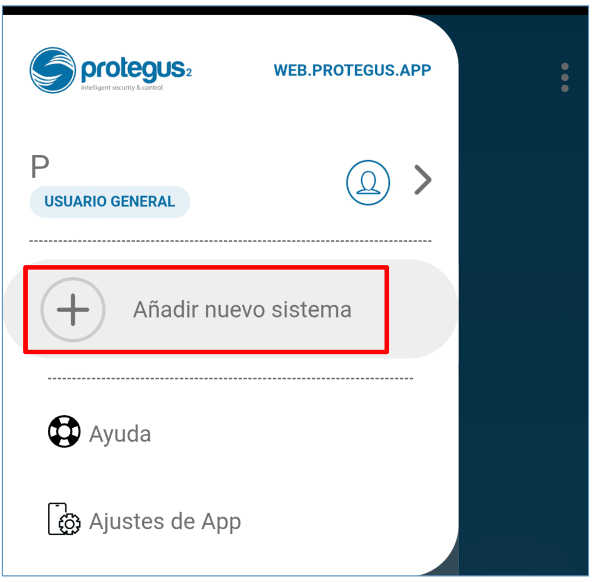
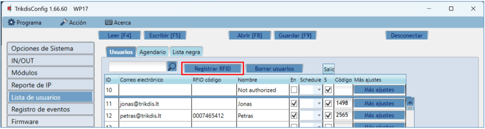
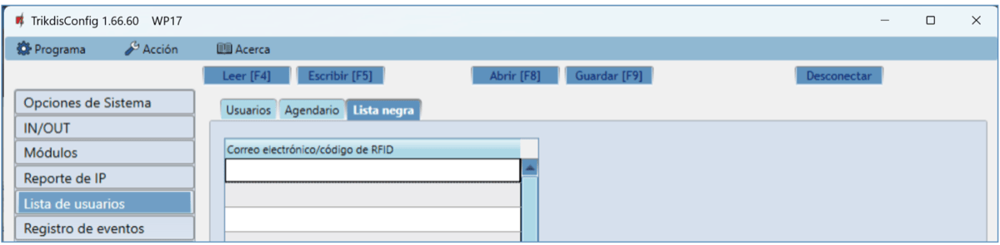

# El controlador GATOR WiFi está diseñado para el control remoto de puertas automáticas (u otros equipos eléctricos)

  

##  Descripción 

El controlador GATOR WiFi está diseñado para el control remoto de puertas automáticas (u otros equipos eléctricos).

Los usuarios pueden controlar controlador con la aplicación Protegus2.

El controlador puede registrar 1000 usuarios (debe especificar el correo electrónico del usuario). En el controlador GATOR WiFi, puede establecer un programa de control para el usuario, establecer un contador (cuántas veces el usuario puede controlar el sistema). El controlador puede enviar mensajes sobre la activación y restauración de entradas y salidas al receptor de la CRA y a la aplicación Protegus2.

**Características**

Control remoto

- Vía aplicación móvil/Internet *Protegus2*.

Los mensajes para los usuarios

- Envía mensajes de eventos a la aplicación *Protegus2*.

Los mensajes para la empresa de seguridad

- El controlador envía mensajes Contact ID por códigos a receptores de software o hardware que funcionan con cualquier programa de monitoreo.

- Puede enviar simultáneamente mensajes de eventos al receptor de la empresa de seguridad y trabajar con la aplicación *Protegus2.*

- Si se pierde la conexión con el receptor principal, los mensajes se envían automáticamente a un receptor de respaldo.

Entradas y salidas

- 4 entradas/salidas universales. Modo de funcionamiento se establece como entrada o salida.

- 1 de salida (OUT) - relé.

- Utilizando el expansor iO-LORA, puede agregar una entrada adicional y una salida (contacto de relé). Se puede agregar un total de 8 expansores iO-LORA (hasta 8 entradas y 8 salidas adicionales).

#### Configuraciones y la instalación

- Instalación rápida y fácil.

- La adición de nuevos usuarios y la supresión de los usuarios existentes se puede hacer con la aplicación Protegus2 (cuando inicie sesión con derechos de administrador), el software TrikdisConfig.

- Configurar el controlador con el programa TrikdisConfig de forma remota o conectando el controlador a la computadora con un cable USB Mini-B.

- Actualización remota del firmware.

### Parámetros Técnicos 

| Parámetro | Descripción |
|:---|----|
| Tensión de alimentación | 9-32 V DC |
| Consumo actual | 150 mA |
| Entradas /​Salidas universales | 4 , se puede establecer ya sea como entrada IN con el tipo: NC, NO, EOL = 10 kΩ, o la salida OUT (colector abierto (OC) 50 mA) |
| Salida | 1, relé, 1 A 30 V DC, 0,5 A 125 V AC |
| Comunicación con CRA | TCP/​IP o UDP/​IP a través de Wi-Fi |
| Protocolo de transferencia de datos | TRK_TCP o TRK_UDP |
| Clave de encriptación | Clave de cifrado de 6 dígitos |
| Frecuencia Wi-Fi | 2,4 GHz |
| Protocolo de Wi-Fi | 802.11 b/​g/​n |
| Tipo de encriptación | WPA, WPA2, WPA mixed |
| Tipo de configuración de red Wi-Fi | Configuración de red DHCP o manual (usando un teléfono móvil o computadora portátil) |
| Memoria de eventos no enviados | Hasta 60 eventos |
| Memoria de registro de eventos | Hasta 5000 eventos |
| Los usuarios que tienen permiso para controlar | 1000 |
| Módulos soportados | iO-LORA - módulo expansor (Al utilizar iO-LORA, se debe conectar un transceptor RF- LORA al GATOR WiFi) |
| Entorno operativo | Temperatura de -20 ° C a +50 ° C, humedad relativa - de hasta 80% a +20 ° C |
| Dimensiones | 88 x 62 x 26 mm |
| Peso | 80 g |

### Elementos de Controlador 

1.  Indicadores de LED.

2.  Ranura de apertura de la tapa frontal.

3.  Conector USB Mini-B para programar el controlador.

4.  Terminales para cableado.

5.  Botón para ingresar al modo de configuración de Wi-Fi.

### Descripción del Bloque de Terminales 

| Terminal | Descripción |
|----|:---|
| +DC | Terminal de poder (9-32 V CC, terminal positive) |
| -DC | Terminal de poder (9-32 V CC, terminal negativo) |
| 1 I/​O | Entrada /​ Salida de terminal universal (configuración de fábrica: Entrada, NO) |
| 2 I/​O | Entrada /​ Salida de terminal universal (configuración de fábrica: Entrada, NO) |
| 3 I/​O | Entrada /​ Salida de terminal universal (configuración de fábrica: Salida) |
| 4 I/​O | Entrada /​ Salida de terminal universal (configuración de fábrica: Salida) |
| +AUX | Terminal de potencia positiva para conectar dispositivos externos |
| NC | Terminal de relevo NC |
| C | Terminal de relevo C |
| NO | Terminal de relevo NO |
| A RS485 | Contacto A de *RS485* bus |
| B RS485 | Contacto B de *RS485* bus |

### Indicación de LED 

| Indicador | Estados de LED | Descripción |
|-----------|----------------|-------------|
| NETWORK / (Red) | Verde solido | Conectado a la red Wi-Fi |
| NETWORK / (Red) | Verde parpadeando | Se conecta a una red Wi-Fi |
| NETWORK / (Red) | Amarillo parpadeando | Nivel de señal Wi-Fi de 0 a 5 |
| NETWORK / (Red) | Parpadeo verde amarillo rápidamente | Modo de configuración de Wi-Fi |
| DATA / (Datos) | Verde solido | Se esta enviando un mensaje |
| DATA / (Datos) | Amarillo solido | Hay mensajes no enviados en la memoria del controlador |
| STATUS / (Estado) | Verde parpadeando | Sin problemas de operación |
| STATUS / (Estado) | 1 rojo parpadeos | Imposible conectarse a la red Wi-Fi |
| STATUS / (Estado) | 2 rojos parpadeos | Baja intensidad de la señal de Wi-Fi |
| STATUS / (Estado) | 3 rojos parpadeos | No se puede conectar al receptor en el canal principal |
| STATUS / (Estado) | 4 rojos parpadeos | Sin conexión al servidor de Protegus2 |
| STATUS / (Estado) | 5 rojos parpadeos | Sin conexión con el receptor en ambos canals |
| STATUS / (Estado) | 6 rojos parpadeos | El reloj interno no está configurado |
| STATUS / (Estado) | 7 rojos parpadeos | El voltaje de la fuente de alimentación es insuficiente |

Si el indicador LED no está funcionando, compruebe la alimentación y las conexiones.

!!! note "Nota"
    Antes de comenzar la instalación, asegúrese de que tiene los componentes
    necesarios:
    
    1.  Cable USB de tipo mini-B para configuración.
    
    2.  Cable constituido por al menos 4 cores para conectar el controlador.
    
    3.  Destornillador de cabeza plana de 2,5 mm.
    
    Solicite los componentes faltantes por separado a su distribuidor local.
### Controlador GATOR WiFi lista de embalaje estándar 

|  \- | Controlador GATOR WiFi        | 1 und. |
|----:|-------------------------------------|--------|
|  \- | Resistencia de 10 kΩ                | 3 und. |
|  \- | Cinta adhesiva de doble cara (5 cm) | 1 und. |
|  \- | Tornillo                            | 2 und. |

## Esquemas de cableado para el controlador GATOR WiFi

### Fijación 

1.  Retire la tapa superior. Tire la parte del enchufe del bloque de terminales.

2.  Retire la placa PCB.

3.  Fijar la base de la caja en el lugar deseado usando tornillos.

4.  Vuelva a insertar la placa y el bloque terminal.

5.  Cierre la tapa superior.

### Esquema para la conexión de la fuente de alimentación 

Usando cables, conectar el controlador GATOR WiFi de acuerdo con el esquema mostrado a continuación.

### Esquema para la conexión del lector RFID (Wiegand 26/34) 

La configuración del controlador con un lector RFID se describe en el capítulo 5.3. „Ventana „IN/OUT"". Con el lector RFID, solo se pueden controlar 5OUT.

Esquema para conectar lector RFID al controlador GATOR WiFi.

En el programa TrikdisConfig, marque el campo del “**Modo lector Wiegand’**. Cuando presiona el botón "**Salir**", la salida 5OUT del controlador se activará durante la duración del pulso establecida.

### Esquema para la conexión del módulo expansor iO-LORA 

Versión del programa operativo del controlador a partir de la 1.21.

Conecte el transceptor RF-LORA al GATOR WiFi. Después de esto, puedes utilizar el extensor iO-LORA con un lector RFID (Wiegand 26/34) conectado al controlador. El lector RFID controla la salida PGM de iO-LORA a la que está conectado. GATOR WiFi y 8 módulos iO-LORA conectados al controlador pueden controlar nueve puertas diferentes.

Ejecute TrikdisConfig. Conecte GATOR WiFi a su computadora mediante un cable USB Mini-B o de forma remota. Haga clic en el botón **Leer [F4]** en el programa TrikdisConfig para mostrar los valores actuales de los parámetros operativos del controlador. Si se le solicita, ingrese el código de administrador o instalador en el cuadro emergente. En la lista "**Módulo**", seleccione "**iO- LORA controlador**". Introduzca el número de serie del producto en el campo "**Núm. de serie**".

En la lista “**IN/OUT**”, configure “**6IN**” en “**Botón de salir**”. Cuando se presiona el botón "**Salir**", la salida "**OUT7**" de iO-LORA se activará durante la duración del pulso establecida.

En la lista "**Usuarios**", ingrese el número de tarjeta RFID, el nombre de usuario, habilite el permiso para controlar la PGM, especifique la PGM controlada y el código. Después de realizar los cambios, presione **Escribir [F5]**. Espere a que se completen las actualizaciones. Haga clic en "**Desconectar**" y desconecte el cable USB.

Activar la salida PGM con una tarjeta/código RFID. Presione el botón de salir (se debe activar la salida PGM).

### Diagramas esquemáticos para las entradas de conexión 

El controlador GATOR WiFi tiene cuatro terminales de **I/O** universales (que se pueden configurar como entrada o salida) a los que se pueden conectar detectores de alarma. Se puede establecer el tipo de entrada: NC, NO, EOL. A continuación se muestran los esquemas de conexión de las entradas (NC, NO, EOL):

### Esquema para la conexión del relé 

Usando los terminales del relé, es posible controlar (encender/apagar) de forma remota varios dispositivos eléctricos. El terminal de I/O del controlador debe configurarse en un modo de salida (OUT).

### Esquema para la conexión del LED 

El terminal de I/O del controlador debe configurarse en un modo de salida (OUT).

## Control vía aplicación Protegus2 

Con la aplicación Protegus2 usuarios podrán controlar de forma remota controlador. También será capaz de ver el estado del sistema y recibir todos los mensajes de eventos del sistema.

1.  Descargar y ejecutar la aplicación Protegus2 o utilizar la versión del navegador de Protegus2 en [www.protegus.app](https://www.protegus.app).

    

      
      
      
    

2.  Iniciar sesión con su nombre de usuario y contraseña o registrarse y crear una cuenta nueva.

!!! note "Nota"
    Al agregar controlador a Protegus2, verifique si:
    
    1.  La fuente de alimentación debe estar encendida (el LED
        "**STATUS**" debe parpadear en verde);
    
    2.  Debe estar registrado en la red (el LED "**NETWORK**" debe ser
        verde sólido y parpadear en amarillo).
Elija “**Añadir nuevo sistema**.

Introduzca el número de **ID único** (MAC) de controlador que se encuentra en el producto o en la etiqueta de los envases. Haga clic en "**Siguiente**".

Haga clic en "**Iniciar configuración WiFi WP17**".

Utilice un destornillador de punta plana para quitar la cubierta del GATOR WiFi. Mantenga presionado el botón “**PAIR**” durante 3 segundos. El indicador “**NETWORK**” comenzará a parpadear rápidamente en verde y amarillo. Suelte el botón. El controlador GATOR WiFi ha entrado en el modo de registro en la red WiFi.

Espere hasta que se encuentre el controlador GATOR WiFi (WP17). Haga clic en "**OK**".

Seleccione la red WiFi a la que se conectará el controlador GATOR WiFi.

Introduzca la contraseña de la red WiFi. Haga clic en "**OK**".

Haga clic en "**Conectar**".

Espere a que el controlador se conecte.

Introduzca el "**Nombre**" del sistema. Haga clic en "**Siguiente**".

Haga clic en "**Saltar**".

Espere 1 minuto. El controlador GATOR WiFi saldrá del modo de emparejamiento por sí solo después de unos minutos (o mantenga presionado el botón “**PAIR**” durante 3 segundos hasta que el indicador “**NETWORK**” deje de parpadear rápidamente en verde y amarillo).

Active la salida PGM haciendo clic en el icono “**Output5**”.

## Agregar un Widget en su teléfono 

El widget de control de puerta se puede cargar en la pantalla del teléfono. El teléfono debe tener un sistema operativo Android. El controlador debe estar registrado en la aplicación Protegus2. Inicie sesión en la aplicación Protegus2 en su teléfono. Cerrar la ventana de la aplicación.

Coloque el dedo sobre la pantalla y manténgalo presionado. Aparecerá la barra de opciones.

1.  Haga clic en “**Widgets**”.

Encuentra Protegus2 en la barra de opciones.

2. Haga clic en Protegus2.

3. Haga clic en „**Switch Protegus2**“.

4. Elija controlador „**Gator WiFi Output5**“**.**

2.  Haga clic en „ **AGREGAR WIDGET**“.

3. Aparecerá un icono en la pantalla del teléfono.

4. Regresa a la pantalla de inicio. Presiona el ícono.

Aparecerá en la pantalla un círculo que indica cuándo se activa el PGM.

5. Cuando el controlador está conectado al portón automático con indicación de estado de portón, el icono mostrará el estado de las puertas abiertas/cerradas.

## Definición de los parámetros utilizando el software TrikdisConfig 

Con TrikdisConfig puede cambiar la configuración del controlador GATOR WiFi (si la configuración predeterminada no es suficiente) de acuerdo con las descripciones de la ventana del programa a continuación.

1.  Descargar el software de configuración TrikdisConfig [www.trikdis.com/es](http://www.trikdis.com/es) (Introduzca “TrikdisConfig” en el campo de búsqueda) e instalarlo.

2.  Usando un destornillador de cabeza plana, retire la tapa de la controlador como se muestra a continuación:

1.  Conectar el controlador a un ordenador mediante un cable USB Mini-B.

2.  Lanzar el TrikdisConfig software de configuración. El programa reconocerá automáticamente el dispositivo conectado y se abrirá automáticamente la ventana de configuración controlador.

3.  Haga clic en **Leer [F4]** para ver los parámetros actuales controlador. Si se le solicita, introduzca el código del administrador o instalador de en la ventana emergente.

!!! note "Nota"
    El botón **Leer [F4]** hará que el programa lea y muestre la
    configuración actualmente guardada en el dispositivo. / El botón
    **Escribir [F5]** guardará los ajustes realizados en el programa para
    el dispositivo. / El botón **Guardar [F9]** guardará la configuración
    en un archivo de configuración. Puede cargar la configuración guardada a
    otros dispositivos más tarde. Esto permite configurar rápidamente varios
    dispositivos con la misma configuración. / El botón **Abrir [F8]**
    permitirá elegir un archivo de configuración y abrir la configuración
    guardada. / Si desea volver a la configuración predeterminada, haga clic
    en el botón "**Restaurar"** en la parte inferior izquierda de la
    ventana.
### Barra de estado TrikdisConfig 

Después de conectar el controlador GATOR WiFi al software TrikdisConfig, el software mostrará la información sobre el dispositivo conectado en la barra de estado:

| Nombre         | Descripción                                          |
|----------------|------------------------------------------------------|
| IMEI/​ ID único | Número MAC del dispositivo                           |
| Estado         | Estado operativo                                     |
| Dispositivo    | Tipo de dispositivo (debe mostrar – WP17_xxxx) |
| SN             | Número de serie del dispositivo                      |
| BL             | Versión lanzador                                     |
| FW             | Versión del firmware del dispositivo                 |
| HW             | Versión de hardware del dispositivo                  |
| Estado         | Tipo de conexión con el software (vía USB o remoto)  |

Cuando se hace clic en el botón **Leer [F4**], el programa leerá y mostrará los ajustes guardados actualmente en el controlador GATOR WiFi. Con TrikdisConfig, ajuste la configuración requerida de acuerdo con las descripciones de la ventana del programa a continuación.

### Ventana “Opciones de Sistema” 

**Grupo de ajustes “General”**

- **Objeto ID** – ingrese el número de cuenta (número hexadecimal de 4 símbolos, 0-9, A-F) proporcionado por el CRA (**No utilice números de objeto FFFE, FFFF**.).

- **Tiempo establecido** – seleccione el servidor mediante el cual se establecerá la hora.

- **Zona horaria** – se indica cuando se selecciona la sincronización de hora “**Servidor NTP”**.

- **Horario de verano** – al marcar la casilla se habilitará el cambio de hora automático en los meses de primavera/otoño.

- **DST región** – seleccione la región a la que pertenece su país.

- **Código de administrador** – con este código se puede cambiar todos los parámetros del controlador.

- **Idioma de la lista de usuarios** – seleccionar un idioma (la lista de usuarios se puede escribir en los caracteres del idioma seleccionado).

**Grupo de ajustes “Prueba periódica”**

- **Activar test** – si la casilla está marcada, los mensajes de prueba periódicas están habilitadas.

- **Período de test** – ajuste del envío de prueba período de tiempo.

- **Comenzar test en** – ajuste del tiempo de inicio de la prueba.

- **A la aplicación móvil** – si la casilla está marcada, el mensaje de prueba será enviado a Protegus2.

**Grupo de ajustes “Configuración de la red del comunicador”**

- **DHCP modo** – Modo controlador GATOR WiFi para registro de red (manual o automático). Marque la casilla de verificación (modo de registro automático) y el controlador escaneará automáticamente la configuración de red (máscara de subred, puerta de enlace) y asignará una dirección IP.

- **IP estática** – dirección IP estática para cuando se establece el modo de registro manual.

- **Máscara de subred** – máscara de subred para cuando se establece el modo de registro manual.

- **Por defecto gateway** – dirección de puerta de enlace para cuando se establece el modo de registro manual.

- **Wifi SSID nombre** – nombre de la red WiFi a la que se conectará el controlador GATOR WiFi.
- **Wifi SSID contraseña** – contraseña de red WiFi.

### Ventana “IN/OUT” 

**Pestaña “IN/OUT”**

Ventana de configuración de entrada / salida.

**Grupo de ajustes “Configuración de IN/OUT”**

- **Terminal** – números de terminales de entrada y salida del controlador.

- **Función** – tipo de terminal (entrada, salida, desactivar).

- **Nombre** - introduzca el nombre de la entrada **IN** o la salida **OUT**.

- **Tipo** – especifique el tipo de entrada (NC, NA, EOL = 10k) o salida (Pulso, Nivel).

- **Inactivo, min** – entrada estará inactivo durante el tiempo especificado después de la primera activación. Introduzca 0 si quieres desactivar esta función.

- **Retraso** - especificar el tiempo de respuesta de entrada (Input), ms.

- **CRA** – si la casilla está marcada, el mensaje se enviará al CRA (Centro de Respuesta de Alarma) y para Protegus2.

- **Sin restauración** – deshabilitar el envío de un mensaje sobre la restauración del estado de entrada o salida.
- **Tiempo de impulso, s** – tiempo durante el cual la salida es activada, cuando la producción se fija como tipo de “**Pulso”**.

- **Horario** – asignar el número de horario por el que se controlará la salida.

- **Asignar** – asignar entrada (IN) a salida. Al activar la entrada, puede determinar la posición real de la salida.

- **Confirmar** - especificar el número de entrada, cuando se activa la entrada, se habilitará el control de la salida (OUT).

- **CTRL by IN** - la entrada seleccionada activa la salida.

**Grupo de ajustes “Configuración del Tag”**

- **Modo lector Wiegand** – marque la casilla si se conectará un lector RFID (Wiegand 26/34) al controlador GATOR WiFi.

- **Evento de Entrada/Salida con Output** - Al marcar el campo, se enviarán mensajes de eventos de entrada / salida cuando la salida se controle de forma remota.

- **Deshabilitar el filtro del lector** - Al marcar la casilla se desactivará el filtro interno que se utiliza con un escáner que envía pulsos cortos.

- **Lector de baja tensión** – al marcar la casilla se habilitará el escáner de bajo voltaje.

**Pestaña “Agendario”**

Las salidas (OUT) se pueden controlar automáticamente de acuerdo con un programa establecido. Es necesario especificar la hora y los días de la semana, habilitar el horario y asignar un horario para la salida.

- **Nombre -** ingrese el nombre del horario.

- **Habilitar** - una vez marcado el campo, incluimos el horario en que la salida será controlada por el controlador.

- **Lock** - marque la casilla para prohibir el control de la salida por otros medios cuando se activa según el cronograma especificado.

- **MANUAL -** marque la casilla que evitará que el gráfico active la salida al inicio. El gráfico comenzará a funcionar solo cuando el usuario active la salida.

- **Modo de signal** – especificar el modo de funcionamiento de la salida PGM (**Pulso**: la salida se activará al principio y al final del programa durante la duración del pulso establecida; **Nivel**: la salida se activará durante el período de tiempo especificado).

- **Modo festivos** - especificar el modo en que debe funcionar el horario cuando comienzan las vacaciones (Deshabilitado / Ignorar en Festivos / Adicional cuando Festivos / Solo Festivos).

- **Festivos** - marque la casilla para usar un horario de vacaciones cuando el horario sea el mismo que el de vacaciones.

- **Tiempo desde** - indica la hora y los días de la semana en que se activará la salida del controlador.

- **Tiempo hasta** - indica la hora y los días de la semana hasta que se activará la salida.

  **Pestaña “Festivos”**

  Ingrese los días festivos durante los cuales será posible configurar la activación adicional de la salida (OUT) proporcionada en la tabla del “**Agendario**”.

  
- **En** – marque la casilla para incluir un intervalo de vacaciones específico.

- **Fecta de inicio** – especificar la fecha de inicio de las vacaciones.

- **Fecta de finalización** – especificar la fecha de finalización de las vacaciones.

- **Tiempo de inicio Festivos** – indicar la hora de inicio de las vacaciones.

- **Detener el tiempo Festivos** - especificar la hora de finalización de las vacaciones.

### Ventana „Módulos“ 

Los módulos iO-LORA se pueden conectar al controlador GATOR WiFi.

Al conectar un transceptor RF-LORA, se pueden conectar hasta 8 expansores inalámbricos iO-LORA al controlador GATOR WiFi. Los lectores RFID conectados a los módulos expansores iO - LORA inalámbricos pueden controlar hasta 8 puertas más (programa operativo del controlador de puerta GATOR WiFi versión 1.21 o posterior). Un expansor iO-LORA con un lector RFID controla solo una puerta.

- **Módulo** - seleccione el módulo que está conectado al controlador.

- **Núm. de Serie** - ingrese el número de serie del módulo (6 dígitos), indicado en las etiquetas de la caja y el paquete del módulo.

### Ventana “Reporte de IP” 

**Grupo de ajustes “Canal principal”**

Los mensajes del controlador GATOR WiFi se pueden enviar al CRA. Para ello es necesario configurar canales de comunicación con el receptor CRA.

- **Tipo de comunicación** – seleccione el método de transmisión del mensaje (TCP / IP o UDP / IP) a la CRA receptor.

- **Dominio o IP** – introduzca el dominio o la dirección IP del receptor CRA.

- **Puerto** – – ingrese el número de puerto del receptor de la CRA en la red.

- **Clave de encriptación** - clave de cifrado de mensajes de 6 dígitos que debe coincidir con la clave de cifrado del receptor CRA.

**Grupo de ajustes “Canal de respaldo”**

Las configuraciones son idénticas a las del canal de comunicación principal.

**Grupo de ajustes “Configuraciones”**

- **Regresar al Primario después** – periodo de tiempo tras el cual el controlador intentará recuperar la conexión con el canal primario.

- **Periodo de Ping por IP** – activar el envío de la señal PING y ajustar la duración de su período.

- **Ir al canal de reserva después de** – especificar cantidad de intentos de conexión con el canal principal, después de lo cual el controlador se conectará automáticamente al canal de conexión de respaldo.

**Grupo de ajustes “Aplicación en la Nube”**

- **Activar conexión** – habilitar el servicio Protegus2, el controlador GATOR WiFi será capaz de intercambiar datos con la aplicación Protegus2 y configuración remota con TrikdisConfig será posible.

- **Informes paralelos** – al marcar la casilla, los mensajes se enviarán en paralelo a la CRA y a los usuarios en la aplicación Protegus2. De lo contrario, los mensajes se enviarán a la aplicación Protegus2 solo después de la transferencia de datos a la CRA.

- **Código de acceso a la Nube** - código de 6 dígitos para conectar con Protegus2 (código de fábrica - 123456).

### Ventana “Lista de usuarios” 

**Pestaña “Usuarios”**

- **Correo electrónico** – introduzca la dirección de correo electrónico del usuario.

- **RFID código** – especifique el número de identificación de la tarjeta RFID (llavero) si un lector RFID está conectado al controlador y el usuario tendrá una tarjeta RFID (llavero).

- **Nombre** - introduzca su nombre de usuario.

- **En** – marque la casilla para que el usuario sea activado.

- **Horario** – seleccione el número de programa por el cual el usuario podrá controlar el controlador.

- **Salidas** – marque la casilla para que el usuario pueda controlar la salida (OUT).

- **Código** - si un lector RFID con un teclado Wiegand 26/34 está conectado al controlador, se le puede dar al usuario un código de control de cuatro dígitos.

- **Más ajustes** – al hacer clic en el campo, se abrirá una ventana de configuración de usuario adicional.

  **Configuración de usuario (números del 11 al 1010)**
- Habilitado – marque la casilla para permitir que el usuario controle las salidas.

- Nombre – introduzca nombre de usuario.

- Correo electrónico – ingrese la dirección de correo electrónico del usuario.

- Código RFID – Cuando un lector RFID con teclado (Wiegand 26/34) está conectado al controlador, el número de identificación de la tarjeta RFID (llavero) se puede asignar al usuario.

- Código del teclado – сuando el lector RFID con teclado (Wiegand 26/34) está conectado al controlador, se puede asignar un código de usuario al usuario.

- Asignar Agendario – al usuario se le asigna el número del horario (el número del horario y su configuración se establece en la pestaña "Agendario"), cuando el usuario puede controlar las salidas OUT.

- **Válido desde** – especificar la fecha y hora desde que el usuario puede controlar el controlador.

- **Válido hasta** – especificar la fecha y hora hasta la que el usuario puede controlar el controlador.

- **Habilitar contador** – marque la casilla para habilitar el contador.

- **Establecer contador** – especificar cuántas veces el usuario puede controlar la salida del controlador, dentro de un período de tiempo establecido.

- **Contador actual** – número actual de controles de salida del controlador.

- **Puede controlar salidas** - marcar el número de la salida que el usuario controlará.

- **Can control iO-LORA outputs** - marcar el número de la salida que el usuario controlará.

#### Registro RFID colgante (tarjeta) 

Conecte el lector RFID al controlador (consulte la p.2.3 "Esquema para la conexión del lector RFID (Wiegand 26/34)"). Encienda el controlador. Conecte el cable USB Mini-B al controlador. En el programa TrikdisConfig, en la ventana "IN / OUT", marque el campo del “**Modo lector Wiegand”**.

Haga clic en “**Registrar RFID”** en la ventana "Lista de usuarios".

Se abrirá la ventana de registro de colgantes RFID (tarjetas).

Conecte el colgante RFID (tarjeta) al lector RFID. Se abrirá una nueva ventana cuando el lector escanee el colgante (tarjeta). En él, ingrese el nombre de usuario y seleccione que “**El usuario puede controlar la salida PGM 5”**. Presione el botón “**AÑADIR”**. / Repita los pasos anteriores para agregar más tarjeta colgante RFID (tarjetas).

Cuando se complete el registro de todos los colgantes (tarjetas) RFID, presione el botón “**STOP el registro”**. / Presione el botón **Escribir [F5]** para guardar la lista pendiente de RFID en el controlador.

Los colgantes RFID (tarjetas) se pueden registrar en TrikdisConfig ingresando sus números de identificación en el campo “**RFID código”**. Dé un “**Nombre”** al usuario, marque el campo “**En**.” y un campo de “**Salidas”** gestionadas. Presione el botón **Escribir [F5]** para guardar la lista de colgantes (tarjetas) RFID en el controlador.

**Pestaña “Agendario”**

El usuario puede controlar las salidas de acuerdo con el “**Agendario”** establecido. El “**Agendario”** debe asignarse al usuario.

- **Nombre -** ingrese un nombre para el horario.

- **Habilitar** - Habilitar la programación de tiempo cuando el usuario será capaz de controlar las salidas del controlador.

- **Tiempo desde** - especificar la hora y día de la semana desde que el usuario puede controlar las salidas del controlador.

- **Tiempo hasta** - especificar el tiempo y los días de la semana hasta que el usuario puede controlar las salidas del controlador.

**Pestaña “Lista negra”**

La “**Lista negra”** contiene direcciones de correos electrónicos, números de ID del RFID colgante (tarjeta), que están excluidos de controlar el controlador.

Hay una manera fácil de agregar nuevos elementos a la lista negra directamente desde el registro de eventos. Haga clic derecho en dirección de correo electrónico o número de ID del RFID colgante (tarjeta) y seleccione "**Añadir a la lista negra**".

### Ventana “Registro de eventos” 

Haga clic en el botón “**Leer Registro”.** El registro de eventos se leerá desde la memoria del controlador. El registro de eventos proporciona información sobre las acciones del controlador y sus eventos internos.

### Restaurar ajustes de fabrica 

Conecte GATOR WiFi a su computadora mediante un cable USB Mini-B. Para restaurar la configuración a fábrica del controlador se necesita hacer clic en el botón “**Restaurar”** en la ventana del programa TrikdisConfig.

## Configuración de los parámetros de forma remota 

!!! note "Nota"
    La configuración remota sólo funcionará cuando:
    
    1.  El servicio Protegus2 está habilitado. Habilitación del
        servicio se describe en el capítulo 5.5 ventana "Reporte de IP";
    
    2.  Conectado a la red ("NETWORK" LED es de color verde parpadeo sólido
        y amarillo).
1.  Descargar el programa TrikdisConfig desde [www.trikdis.com](http://www.trikdis.com).

2.  Asegúrese de que el controlador está conectado a Internet y conexión a Protegus2 está activado.

3.  Poner en marcha el programa de configuración TrikdisConfig y en el campo “**ID único”** de la sección de acceso remoto introduzca el número MAC de su controlador (el número MAC se da en las etiquetas que se pueden encontrar en la parte inferior de la carcasa del dispositivo y en el embalaje).

4. En el campo “**Nombre del sistema”** puede dar cualquier nombre a este controlador. Haga clic en “**Configuración”.**

2.  La ventana de configuración del controlador se abrirá. Haga clic en el botón **Leer [F4]** para que el programa lea los parámetros configurados actualmente para el controlador. Si se abre una ventana para ingresar el código de Administrador, ingrese el código de administrador de seis símbolos. Para que el programa recuerde el código, marque la casilla junto a Recordar contraseña y haga clic en el botón **Escribir [F5]**.

3.  Configure los ajustes deseados para el controlador y luego haga clic en **Escribir [F5]**. Para desconectarse del controlador, haga clic en “**Desconectar”** y salga del programa TrikdisConfig.

## Realizar prueba del controlador GATOR WiFi 

Cuando la configuración e instalación están acabados, probar el sistema:

1.  Compruebe si el sistema está encendido;

2.  Compruebe la conectividad de red (indicador “**NETWORK”** debe ser sólido verde y parpadeará amarillo);

3.  Para probar las entradas del controlador GATOR WiFi, habilitar y asegurarse de que los destinatarios reciben los mensajes correctos;

4.  Para probar las salidas del controlador GATOR WiFi, enciéndalas de forma remota y asegúrese de que los destinatarios reciban los mensajes correctos y que las salidas se activen correctamente.

## La actualización del firmware de forma manual 

!!! note "Nota"
    Cuando el controlador está conectado a TrikdisConfig, el programa
    ofrecerá para actualizar el firmware del dispositivo si hay
    actualizaciones disponibles. Actualizaciones requieren una conexión a
    Internet. / Si el software antivirus instalado en su ordenador, éste
    puede bloquear la función de actualización automática del firmware. En
    este caso, tendrá que volver a configurar el software antivirus.
El firmware del controlador GATOR WiFi también se puede actualizar y modificar manualmente. Todos los parámetros anteriores controlador permanecen después de la actualización. Al escribir manualmente, el firmware se puede cambiar a una más antigua o una versión más nueva. Sigue estos pasos:

1.  Lanzar TrikdisConfig;

2.  Conectar el controlador a un ordenador mediante un cable USB Mini-B o conectarse a la controlador forma remota. Si una nueva versión de firmware disponible, el programa ofrecerá a instalarlo;

3.  Elegir el firmware rama menú;

4.  Haga clic en el botón “**Abrir firmware”** y seleccione el archivo de firmware requerido;

    

5.  Haga clic en el botón **Actualizar [F12];**

6.  Esperar a que se complete la actualización.

## Precauciones de seguridad 

El controlador sólo debe ser instalado y mantenido por un personal cualificado.

Por favor, lea atentamente este manual antes de la instalación con el fin de evitar errores que pueden conducir a un mal funcionamiento o incluso daños en el equipo.

Siempre desconecte la fuente de alimentación antes de realizar las conexiones eléctricas.

Los cambios, modificaciones o reparaciones no autorizadas por el fabricante deberán invalidar la garantía.

Cumpla con la normativa local y no deseche su sistema de alarma inutilizables o sus componentes con los residuos domésticos.
