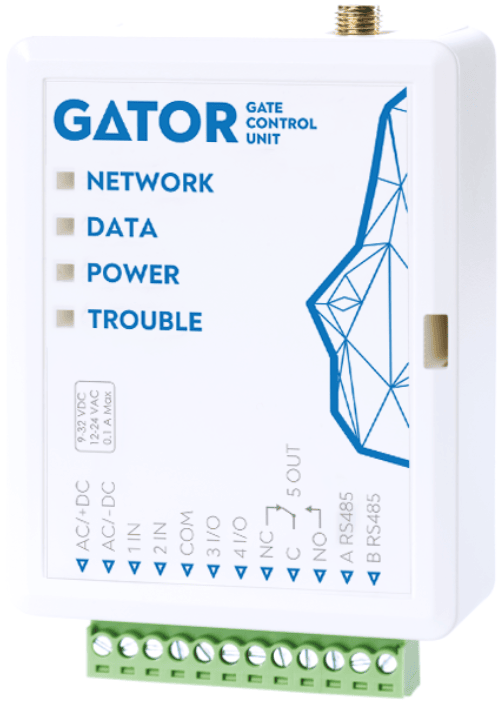
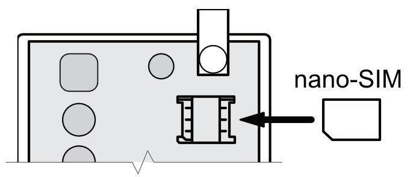
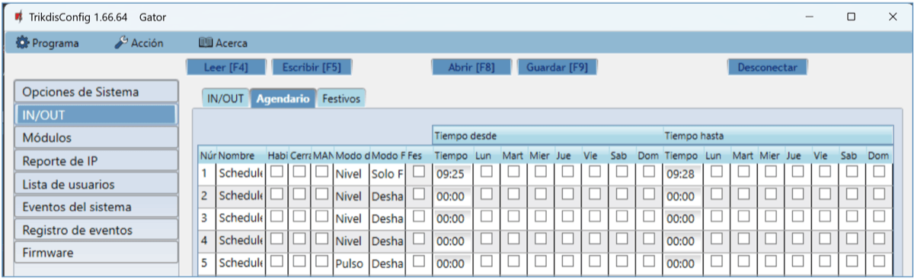

  

# Gator

GSM controlador puede controlar de forma remota puertas automáticas y otros equipos.

Los usuarios pueden controlar controlador con la aplicación Protegus2, llamadas telefónicas y mensajes SMS. El controlador puede almacenar 7 números de teléfono de administrador y 1000 números de teléfono de usuario. Un programa de control de usuario y contador para el número de veces que un usuario específico puede controlar el sistema se pueden establecer en la controlador. El controlador GSM puede enviar mensajes SMS informando cuando las entradas y salidas se activan y restauradas (el texto de los mensajes SMS es personalizable). El controlador es capaz de enviar mensajes de eventos al CRA. Al conectar un módulo WiFi (W485) o „Ethernet” (E485) al controlador GATOR, puede enviar notificaciones de eventos y controlar el controlador a través de una red de Internet inalámbrica o cableada sin usar los datos móviles de su tarjeta SIM. Al conectar el transceptor RF-LORA, puede conectar el expansor inalámbrico iO8-LORA (1 pieza) y los expansores inalámbricos iO-LORA (hasta 8 piezas) al controlador GATOR. Los lectores RFID conectados a los módulos de expansores inalámbricos iO-LORA pueden controlar hasta 8 salidas PGM (versión del software del controlador GATOR desde 2.13). Un expansor iO-LORA con lector RFID controla sólo una salida PGM.

**Características**

Control remoto

- Vía aplicación móvil/Internet *Protegus2*.

- Vía los mensajes SMS.

- Vía llamada telefónica.

Los mensajes para los usuarios

- Envía mensajes acerca de eventos a la aplicación *Protegus2* o con mensajes de texto SMS.

Los mensajes para la empresa de seguridad

- Envía la información de eventos en Contact ID códigos de identificación a Trikdis software y hardware receptores, que funcionan con cualquier software de monitoreo.

- Puede enviar simultáneamente mensajes de eventos al receptor de la empresa de seguridad y trabajar con la aplicación *Protegus2*.

- Si se pierde la conexión con el receptor principal, los mensajes se envían automáticamente a un receptor de respaldo.

Entradas y salidas

- 2 entradas (IN), de tipo seleccionable: NO; NC; EOL.

- 2 entradas/salidas universales. Modo de funcionamiento se establece como entrada o salida.

- 1 de salida (OUT) - relé.

- Con el expansor iO-LORA puede agregar adicionalmente 1 entrada y 1 salida (relé). Se pueden agregar un total de 8 expansores iO-LORA (agregue hasta 8 entradas adicionales y 8 salidas adicionales).

- Se pueden añadir entradas y salidas adicionales mediante el expansor iO8 o iO8-LORA. Se puede añadir un módulo de expansión iO8 o iO8-LORA al controlador GATOR.

**Configuraciones y la instalación**

- Instalación rápida y fácil.

- La adición de nuevos usuarios y la supresión de los usuarios existentes se puede hacer con la aplicación Protegus2 (cuando inicie sesión con derechos de administrador), mensaje SMS, el software TrikdisConfig.

- El dispositivo puede ser configurado ya sea mediante la conexión de un cable USB Mini-B o de forma remota vía el software TrikdisConfig.

- Actualización remota del firmware.

- Dos niveles de acceso para configurar el dispositivo, para el instalador y para el administrador.

### Parámetros Técnicos 

| Parámetro | Descripción |
|-----------|-------------|
| Frecuencias de módem GSM 2G | 850/​900/​1800/​1900 MHz |
| Frecuencias de módem 4G: /​ EU (Europa) /​ LA (América Latina) | LTE-FDD: B1/​B3/​B5/​B7/​B8/​B20/​B28 /​ LTE-FDD: B2/​B3/​B4/​B5/​B7/​B8/​B28/​B66 |
| Tensión de alimentación | 9-32 V DC /​ 12-24 V AC |
| Consumo actual | 100 mA |
| Entradas | 2, tipo seleccionable: NC, NO, EOL = 10 kΩ |
| Entradas /​Salidas universales | 2, se puede establecer ya sea como entrada IN con el tipo: NC, NO, EOL = 10 kΩ, o la salida OUT (colector abierto (OC) 50 mA) |
| Salida | 1, relé, 1 A 30 V DC, 0,5 A 125 V AC |
| Memoria de eventos no enviados | Hasta 60 eventos |
| Memoria de registro de eventos | Hasta 5000 eventos |
| Los usuarios que reciben mensajes y tienen permiso para controlar | 7 |
| Los usuarios que tienen permiso para controlar | 1000 |
| Entorno operativo | Temperatura de -20 ° C a +50 ° C, humedad relativa - de hasta 80% a +20 ° C |
| Dimensiones | 92 x 62 x 26 mm |
| Peso | 80 g |

### Elementos de Controlador 

1.  Indicadores de LED.

2.  Ranura de apertura de la tapa frontal.

3.  Conector USB Mini-B para programar el controlador.

4.  Terminales para cableado.

5.  Porta tarjetas Nano-SIM.

6.  Conector SMA para antena GSM.

### Descripción del Bloque de Terminales 

| Terminal | Descripción |
|----------|-------------|
| AC/​+DC | Terminal de poder (9-32 V DC positive;​ 12-24 V AC) |
| AC/​-DC | Terminal de poder (9-32 V DC negativo;​ 12-24 V AC) |
| 1 IN | 1ra entrada, tipo seleccionable NO, NC, EOL (configuración de fábrica: NO) |
| 2 IN | 2da entrada, tipo seleccionable NO, NC, EOL (configuración de fábrica: Desactivado) |
| COM | Terminal común |
| 3I/​O | Entrada/​Salida (configuración de fábrica: Desactivado) |
| 4 I/​O | Entrada/​Salida (configuración de fábrica: Desactivado) |
| NC | Terminal de relevo NC |
| C | Terminal de relevo C |
| NO | Terminal de relevo NO |
| A RS485 | Contacto A de RS485 bus |
| B RS485 | Contacto B de RS485 bus |

### Indicación de LED 

| Indicador | Estados de LED | Descripción |
|-----------|----------------|-------------|
| NETWORK / (Red) | Verde solido | Conectado a la red GSM |
| NETWORK / (Red) | Amarillo parpadeando | Indicación de la intensidad de la señal GSM de 0 a 5. La suficiente fuerza debe ser de 3 |
| DATA / (Datos) | Verde solido | El mensaje ha sido enviado |
| DATA / (Datos) | Amarillo solido | Hay mensajes nuevos no vistos en el buffer |
| POWER / (Poder) | Verde parpadeando | La carga es suficiente |
| POWER / (Poder) | Amarillo parpadeando | La carga es insuficiente |
| POWER / (Poder) | Verde y amarillo parpadeando | Modo de configuración activado |
| TROUBLE / (Problema) | Off | Sin problemas de operación |
| TROUBLE / (Problema) | 1 parpadeo | Ninguna tarjeta SIM ha sido insertada |
| TROUBLE / (Problema) | 2 parpadeos | El código de PIN de la tarjeta es incorrecto |
| TROUBLE / (Problema) | 3 parpadeos | Imposible conectarse a la red GSM |
| TROUBLE / (Problema) | 4 parpadeos | No se puede conectar a Protegus2 o al receptor primario de IP |
| TROUBLE / (Problema) | 5 parpadeos | No se puede conectar al receptor IP de respaldo |
| TROUBLE / (Problema) | 6 parpadeos | El reloj interno no está configurado |
| TROUBLE / (Problema) | 7 parpadeos | El voltaje de la fuente de alimentación es insuficiente |

Si el indicador LED no está funcionando, compruebe la alimentación y las conexiones.

!!! note
    Antes de comenzar la instalación, asegúrese de que tiene los componentes
    necesarios:
    
    1.  Cable USB de tipo mini-B para configuración.
    
    2.  Cable constituido por al menos 4 cores para conectar el controlador.
    
    3.  Destornillador de cabeza plana de 2,5 mm.
    
    4.  Antena GSM externa si la recepción es débil en la zona.
    
    5.  Activada tarjeta nano-SIM (puede tener desactivadas las solicitudes
        código PIN).
    
    6.  Manual de instrucciones para la puerta automática a la que el
        controlador de puerta GSM está a punto de ser conectados.
    
    > Pídalos por separado de su distribuidor local.
### Controlador de puerta GSM GATOR lista de embalaje estándar 

| - | GATOR GSM controlador de puerta | 1 und. |
|---|---------------------------------|--------|
| - | Antena GSM | 1 und. |
| - | Resistencia de 10 kΩ | 3 und. |
| - | Cinta adhesiva de doble cara (5 cm) | 1 und. |
| - | Tornillo | 2 und. |

## Esquemas de cableado para el GSM controlador 

### Fijación 

1.  Retire la tapa superior. Tire la parte del enchufe del bloque de terminales.

2.  Retire la placa PCB.

3.  Fijar la base de la caja en el lugar deseado usando tornillos.

4.  Vuelva a insertar la placa y el bloque terminal.

5.  Atornille la antena GSM.

6.  Inserte la tarjeta nano-SIM.

7.  Cierre la tapa superior.

### Esquema para la conexión de la fuente de alimentación 

Usando cables, conectar el controlador de acuerdo con el esquema mostrado a continuación.

### Diagramas esquemáticos para las entradas de conexión 

El controlador tiene cuatro entradas IN (dos de los cuales son universales y pueden funcionar ya sea como entradas o salidas) para la conexión de varios sensores de alarma. Estas entradas pueden operar en NC, NO, modos de EOL. Conectar las entradas de acuerdo con el tipo de entrada conjunto (NC, NO, EOL) como se muestra en los esquemas de abajo:

### Esquema para la conexión del relé 

Arriba está el esquema para la conexión del relé cuando el controlador está conectado a una fuente de alimentación de CC. Usando los terminales del relé, es posible controlar (encender/apagar) de forma remota varios dispositivos eléctricos. El terminal de I/O del controlador debe configurarse en un modo de salida (OUT).

### Esquema para conectar el controlador GATOR a un portón automático 

Todo el cableado debe realizarse con la fuente de alimentación desconectada. / Los usos y voltajes de las terminales del controlador de portón automático se describen en detalle en el manual del portón automático. / Los terminales IN, COM del portón automático se utilizan para controlar los portones. / EL portón automático cuenta con una salida de estado de portón (OUT) que indica cuándo están cerradas las puertas y cuándo están abiertas. La salida de estado del portón puede ser una salida de voltaje o una salida de relé. En el esquema, el relé K1 está conectado a una salida voltaje del portón automático. Existe un voltaje (~ 230V) entre las salidas de voltaje OUT y N de los portones automáticos cuando las puertas están abiertas. El relé intermedio K1 se activa cuando las puertas están abiertas y activa la entrada 1IN del controlador. El estado de la entrada 1IN del controlador proporciona información precisa sobre el estado de los portones (cuándo están cerradas las puertas y cuándo están abiertas).

### Esquema para la conexión del lector RFID (Wiegand 26/34) 

La configuración del controlador con un lector RFID se describe en el capítulo 5.3. „Ventana „IN/OUT"".

Esquema para conectar un solo lector RFID al controlador GATOR.

En el programa TrikdisConfig, debe tenerse en cuenta que se utilizará un lector RFID y el botón "**Salir**". Al presionar el botón "**Salir**", la salida 5OUT del controlador funcionará durante la duración del pulso establecida. Cuando el botón "**Salir**" no está conectado al controlador, no es necesario marcar el "**IO3 como botón de salida**".

Esquema para conectar dos lectores RFID al controlador GATOR.

Al conectar dos lectores RFID al controlador, debe tenerse en cuenta que en el programa TrikdisConfig debe marcar que se utilizarán dos lectores RFID.

### Esquema para conectar el módulo WiFi W485 

Versión de firmware del controlador desde 1.06. / El módulo *W485* envía mensajes al CRA (Centro de Recepción de Alarmas) y a *Protegus2* utilizando un enrutador de internet WiFi. Cuando la conectividad WiFi está disponible, el controlador envía mensajes de eventos a través del módulo *W485*. Cuando se interrumpe la conectividad WiFi, el contolador envía mensajes a través de GPRS. Cuando se restablece la conectividad WiFi, el contolador procede a enviar mensajes a través del *W485*. / La configuración del módulo WiFi *W485* para que funcione con el controlador se describe en el capítulo 5.4. “Ventana “Módulos””. / No necesita una tarjeta SIM cuando usa el *W485* con el controlador.

### Esquema para conectar el módulo "Ethernet" E485 

Versión de firmware del controlador desde 1.06. / El *E485* envía mensajes al CRA (Centro de Recepción de Alarmas) y a *GATOR* usando una conexión a internet por cable. Al utilizar el *E485* con el controlador, los mensajes al CRA y *Protegus2* se envían a través de Internet por cable y no se usa el internet móvil. Si se interrumpe una conectividad a internet por cable, el controlador envía mensajes a través de internet móvil. Al restablecerse la conectividad a internet por cable, el controlador comienza a enviar mensajes a través de *E485*. / La configuración del módulo *E485* para funcionar con el controlador se describe en el capítulo 5.4. “Ventana “Módulos””. / No necesita una tarjeta SIM cuando usa el *E485* con el controlador.

### Esquema para conectar del expansor iO-LORA con lector RFID 

La versión de firmware del controlador GATOR es de 2.13.

Conecte el transceptor RF-LORA al controlador GATOR. Luego puede utilizar el expansor iO-LORA, al que está conectado un lector RFID (Wiegand 26/34). El lector RFID controla la salida PGM del expansor iO-LORA al que está conectado.

Ejecute TrikdisConfig. Conecte GATOR mediante un cable USB Mini-B a su computadora o de forma remota. Presione el botón **Leer [F4]** y el programa TrikdisConfig mostrará la configuración actual del controlador. Cuando se le solicite, ingrese el código de administrador o instalador en la ventana emergente. Seleccione "**iO-LORA controller**" de la lista "**Módulos**". En el campo "**Núm. de Serie**", ingrese el número de serie del producto.

En la lista "**IN/OUT**", la entrada "**6 IN**" debe estar asignada al "**EXIT botón**". Cuando presiona el botón "**Salir**", la salida "**7 OUT**" del iO-LORA se activa durante la duración del pulso establecida.

En la lista "**Lista de usuarios**", especifique el número de tarjeta RFID, el nombre de usuario, habilite el permiso para controlar la salida PGM, especifique la salida PGM (que el usuario controlará), el código. Después de completar la configuración, haga clic en **Escribir [F5]**. Espere hasta que se complete el proceso de actualización de la configuración del controlador. Haga clic en "**Desconectar**" y desconecte el cable USB.

Activar la salida PGM con una RFID tarjeta/código. Presione el botón "**Salir**" (la salida PGM debe dispararse durante la duración del pulso establecida).

### Esquema para conectar del expansor iO8, iO8-LORA 

El controlador *GATOR* puede conectarse a un expansor *iO8* o *iO8-LORA* para aumentar el número de entradas (IN) y salidas (OUT). Se puede conectar un módulo de expansión *iO8* o *iO8-LORA* al controlador. / Diagrama de conexión del expansor *iO8*.

Diagrama de conexión del expansor iO8-LORA.

## Configuración rápida del controlador 

!!! note
    El controlador viene preconfigurado de fábrica para funcionar. Una
    llamada desde cualquier teléfono al número de tarjeta SIM del
    controlador activará la salida del relé 5 OUT durante 3 (tres) segundos.
    El controlador se puede instalar sin ninguna configuración adicional si
    dicho modo de operación es aceptable.
Para configurar rápidamente el controlador:

1.  Una tarjeta nano-SIM debe ser puesta en el controlador. Desactive las solicitudes de código PIN para la tarjeta antes de insertarla en el controlador.

2.  Conectar una fuente de alimentación a controlador (ver 2 esquema de cableado “Esquema para la conexión de la fuente de alimentación”).

3.  Conectar la alimentación para el controlador. Esto debería desencadenar la siguiente controlador indicaciones LED:

- El indicador “POWER” debe parpadear red;

- El indicador de “NETWORK” debe ser sólido verde y parpadeará en amarillo.

La configuración predeterminada permite el control de cualquier persona que llama al número de teléfono de la tarjeta SIM insertada en el controlador.

Si desea permitir que solo determinadas personas controlen el controlador, envíe un comando de SMS con los números de teléfono del usuario, que están autorizados (ejemplo: comando de SMS:

SETU 123456 +370xxxxxxxx#Peter). Después de recibir dicho comando, controlador solo reaccionará a los números de teléfono en la lista. El controlador ignorará las llamadas entrantes de otros números.

!!! note
    Si desea modificar los ajustes predeterminados de fábrica o activar
    otras funciones del controlador, consulte el capítulo 5"Configuración
    de los parámetros utilizando el software TrikdisConfig".
## Control remoto 

### Control con llamada telefónica 

!!! note
    El primero en llamar (o enviar un SMS) al controlador se convertirá en
    el administrador del sistema y será el único que podrá administrar y
    controlar el controlador con comandos de SMS.
Llame al número de la tarjeta SIM insertada en el controlador. El controlador rechaza automáticamente la llamada y enciende la salida del relé “**5 OUT**” durante 3 (tres) segundos. La configuración predeterminada de fábrica permite controlar a cualquier persona que llama al número de la tarjeta SIM que se inserta en el controlador.

### Control con el teclado del teléfono 

Controlador responde y permite controlar las salidas con una llamada telefónica, el usuario tiene permitido controlar varias salidas OUT:

1.  Llame al número de la tarjeta SIM del controlador. El controlador aceptará la llamada.

2.  Usando el teclado del teléfono, marque el comando de control (los ejemplos de comandos se pueden encontrar en la tabla Comandos de control DTMF).

#### Comandos de control DTMF (no funciona con productos GV17_2E70, GV17_2S70)

| DTMF código | Función | Descripción |
|-------------|---------|-------------|
| OUTPUT*STATE# | Output control | Output comando de control (activar/desactivar; activar/desactivar para el tiempo de pulso). OUTPUT – número de salida controlada STATE – comando de control: 0 – desactivar output; 1 – activar output; 2 – desactivar output para el tiempo de pulso; 3 – activar output para el tiempo de pulso; (el tiempo de pulso de salida se puede establecer usando el programa TrikdisConfig, en la tabla de configuraciones de Entrada/Salida) # - control comando de símbolo final. E.g. (activar output 5): 5*1# E.g. (active la entrada 4 para el tiempo de pulso): 4*3# |
| # | Símbolo de final de comando | Si cometió un error al escribir un comando, marque # e ingrese nuevamente el comando de control. |

### Control vía aplicación Protegus2 

Con GATOR usuarios podrán controlar de forma remota controlador. También será capaz de ver el estado del sistema y recibir todos los mensajes de eventos del sistema.

1.  Descargar y ejecutar la aplicación Protegus2 o utilizar la versión del navegador de Protegus2 en [www.protegus.app](http://www.protegus.app).

    

      
      
      
    

2.  Iniciar sesión con su nombre de usuario y contraseña o registrarse y crear una cuenta nueva.

!!! note
    Al agregar controlador a Protegus2, verifique si:
    
    1.  El servicio Protegus2 debe estar encendido. La activación del
        servicio se describe en el capítulo 5.5 Ventana "Reporte de IP";
    
    2.  La fuente de alimentación debe estar encendida (el LED "POWER"
        debe parpadear en verde);
    
    3.  Debe estar registrado en la red (el LED "NETWORK" debe ser verde
        sólido y parpadear en amarillo).
3. Elija “**Añadir nuevo sistema**”.

4. Introduzca el número de ID único (IMEI) de controlador que se encuentra en el producto o en la etiqueta de los envases. Haga clic en "**Siguiente**".

5. Ingrese el nombre del sistema. Haga clic en "**Siguiente**".

6. Haga clic en "**Saltar**".

7. Espera 1 minuto.

8. Active la salida PGM haciendo clic en el icono “**Output5**”.

### Agregar un Widget en su teléfono 

El control de puerta “**Widget**” se puede colocar en la pantalla de inicio de su teléfono. El controlador debe estar registrado en Protegus2. Inicia sesión en Protegus2 en tu teléfono. Cerrar la ventana de Protegus2.

Toque y mantenga pulsada la pantalla con el dedo. Aparecerá una barra de configuración.

1.  Presione “**Widgets**”.

Encuentre a Protegus2 en la barra de configuración.

2. Seleccione “Protegus2”.

3. Haga clic en "**Switch Protegus2**".

4. Elija controlador “**Gator Output 5**”**.**

2.  Presione “**AGREGAR WIDGET**”.

3. Aparecerá un icono en la pantalla del teléfono.

4. Regresa a la pantalla de inicio. Presiona el ícono.

> Aparecerá en la pantalla un círculo que indica cuándo se activa el PGM.

5. Cuando el controlador está conectado al portón automático con indicación de estado de portón, el icono mostrará el estado de las puertas abiertas/cerradas.

### Agregar usuarios al teléfono 

Inicie la aplicación Protegus2 en su teléfono. Inicie sesión con su nombre de usuario y contraseña.

1.  Haga clic en “**Configuración**”**.**

1.  Haga clic en “**Configuración del sistema**”.

2. Haga clic en “**Usuarios**”.

3. Haga clic en “**Añadir nuevo usuario**”.

4. Ingrese la dirección de correo electrónico del usuario.

2.  Ingrese el nombre de usuario.

3.  Ingrese el número de teléfono del usuario.

4.  Marque la salida PGM que controlará el usuario.

5.  Haga clic en “**Añadir usuario**”.

10. Aparece un nuevo usuario en la lista de usuarios.

11. Haga clic en “**Inicio**” para volver a la ventana principal.

### Control vía mensajes SMS 

Controlar la salida de relé OUT5 con estos comandos SMS:

> #### OUTPUT5 xxxxxx ON
>
> #### OUTPUT5 xxxxxx OFF
>
> #### OUTPUT5 xxxxxx PULSE=002

| xxxxxx | Contraseña de administrador de 6 símbolos (Código predeterminado - 123456). |
|----|----|
| ON | Activar la salida. |
| OFF | Desactivar la salida. |
| PULSE = ttt | Activa la salida por un tiempo específico. "ttt" es el tiempo de impulso en segundos. |

Se puede controlar otras salidas con SMS, pero primero deben activarse en TrikdisConfig.

Lista de comandos de control de SMS

| Comando | Datos | Descripción |
|---------|-------|-------------|
| OUTPUTx | ON | Activar salida. “x” - número de salida. Por ejemplo: OUTPUT5 123456 ON |
| OUTPUTx | OFF | Desactivar salida. “x” - número de salida. Por ejemplo: OUTPUT5 123456 OFF |
| OUTPUTx | PULSE=ttt | Activar salida para un período de tiempo. “ttt” es tiempo de pulso en segundos, de 1 a 999. Por ejemplo: OUTPUT5 123456 PULSE=002 |

### Configuración vía mensajes SMS 

1.  **Cambio de la contraseña del administrador**

Por razones de seguridad, cambie la contraseña de administrador por defecto. Enviar un mensaje SMS de este formato:

#### PSW 123456 xxxxxx

| 123456 | Contraseña de administrador predeterminada. |
|--------|---------------------------------------------|
| xxxxxx | Nueva contraseña de administrador 6-símbolo. |

1.  **Permitir que solo los usuarios autorizados controlen el sistema**

Puede permitir que solo personas específicas controlen el sistema. Desde el teléfono de un administrador, envíe mensajes SMS con los números de teléfono y nombres de los usuarios:

#### SETU xxxxxx +PHONENo#NAME#EMAIL

| xxxxxx  | Contraseña de administrador de 6 símbolos. |
|---------------|--------------------------------------------|
| PHONENo | Número de teléfono del usuario.            |
| NAME    | Nombre de usuario.                         |
| EMAIL   | Nombre de correo electrónico.              |

Una vez que se agrega el primer número a la lista de teléfonos del usuario del controlador, el controlador solo reaccionará a las llamadas telefónicas de los números en la lista. El controlador ignorará las llamadas de otros números.

1.  Otorgar derechos de administrador a otro usuario

    Puede otorgar derechos de administrador a otras personas. Recibirán mensajes de información del sistema y podrán agregar usuarios. Enviar un mensaje SMS de este formato:

#### SETA xxxxxx Nox=+PHONENo#NAME#EMAIL

| xxxxxx | Contraseña de administrador de 6 símbolos. |
|----|:---|
| Nox | x - número del administrador en la lista. (Si escribe 1, transferirá sus derechos de administrador a otro usuario). |
| PHONENo | Número de teléfono del usuario. |
| NAME | Nombre de usuario. |
| EMAIL | Nombre de correo electrónico. |

SMS lista de comandos de configuración

| Comando | Datos | Descripción |
|---------|-------|-------------|
| INFO |  | Solicitar información sobre el controlador. La respuesta incluirá: tipo de controlador, número IMEI, intensidad de la señal GSM, magnitud del voltaje de potencia, versión del software, número de serie, fecha y hora. Por ejemplo: INFO 123456 |
| ASKI |  | Consulta de estado de entrada. Por ejemplo: ASKI 123456 |
| ASKO |  | Consulta de estado de salida. Por ejemplo: ASKO 123456 |
| SETA | NoX=PhoneNo#Name#email | Agregar administrador a la lista (número de administrador de 1A a 7A). Agrega el número de teléfono, el nombre y el correo electrónico a la línea especificada. El número debe estar separado del nombre con un hash (#). El número debe comenzar con „+“ y el código internacional. Por ejemplo: SETA 123456 Nr3=+37061234567#John#john_M@trikdis.com |
| SETA | NoX=DEL | Elimina el número de teléfono y el nombre de la línea especificada. Por ejemplo: SETA 123456 Nr2=DEL |
| SETU | PhoneNo#Name#email | Añadir nuevo usuario (número de usuario de 11 a 1010). Agrega el número de teléfono, el nombre y el correo electrónico a la lista. El número debe estar separado del nombre con un hash (#). El número debe comenzar con „+“ y el código internacional. Por ejemplo: SETU 123456 +37061234567#Peter#peter_M@trikdis.com |
| DELU | PhoneNo | Eliminar usuario con un número de teléfono especificado. Por ejemplo: DELU 123456 +37061234567 |
| DELU | Name | Eliminar usuario con nombre especificado. Por ejemplo: DELU 123456 Peter |
| RESET |  | Reiniciar el controlador. Por ejemplo: RESET 123456 |
| PSW | New password | Cambiar la contraseña. Por ejemplo: PSW 123456 654123 |
| TXTA | Object name | Establecer el nombre del objeto. Por ejemplo: TXTA 123456 House |
| TXTE | N1= / …… / N5= | Establecer texto SMS sobre activación de entrada o salida. N1 ... N5 es el número del contacto en el bloque de terminales. Por ejemplo: TXTE 123456 N1=Alarm in the living room |
| TXTR | N1= / …… / N5= | Establecer texto SMS sobre la recuperación de entrada o salida. N1 ... N5 es el número del contacto en el bloque de terminales. Por ejemplo: TXTR 123456 N5=Relay turn off |
| SETD | IDx=yy | Establezca el tiempo de inactividad para la entrada "x". "yy" es el tiempo de inactividad en minutos, de 0 a 2880. Cuando se activa la entrada, el controlador enviará una notificación y no reaccionará ante ninguna interrupción adicional del circuito durante el tiempo de inactividad establecido. Si se ingresa 0, la inactividad se apagará. Por ejemplo: SETD 123456 ID1=30 |
| RESD | IDx | Restablece el tiempo de inactividad para la entrada "x", si la cuenta atrás ha comenzado. Por ejemplo: RESD 123456 ID1 |
| TIME | YYYY/MM/DD, / HH:mm:ss | Establecer fecha y hora. Por ejemplo: TIME 123456 2025/05/09,10:03:00 |
| RDR | PhoneNo#SMStext | Reenvíar el texto de SMS al número especificado. Por ejemplo: RDR 123456 +37061234567#Refill account by 10EUR |
| HELLO | ON | Habilite la función de informar a un nuevo usuario por mensaje SMS sobre su incorporación al controlador GATOR a través de la aplicación Protegus2 o mensaje SMS. Por ejemplo: HELLO 123456 ON |
| HELLO | OFF | Desactive la función de informar a un nuevo usuario por mensaje SMS sobre su incorporación al controlador GATOR a través de la aplicación Protegus2 o mensaje SMS. Por ejemplo: HELLO 123456 OFF |
| NATH | ON | Habilite el modo operativo “Not authorized” sin cambiar ninguna otra configuración. Por ejemplo: NATH 123456 ON Si el controlador controla múltiples salidas PGM, el SMS será el siguiente (activa “No autorizado” y las salidas PGM especificadas, y desactiva el resto): Por ejemplo: NATH 123456 ON=5,7,22 |
|  | OFF | Desactivar el modo de funcionamiento “Not authorized”. Por ejemplo: NATH 123456 OFF |
| UUSD | *UUSD code# | Enviar código USSD al operador móvil. Los códigos USSD especificados por el operador son para verificar o rellenar el saldo de la tarjeta SIM y para operaciones similares. Por ejemplo: UUSD 123456 *245# |
| CONNECT | Protegus=ON | Conéctar a la nube Protegus. E.g.: CONNECT 123456 PROTEGUS=ON |
| CONNECT | Protegus=OFF | Disconnect from Protegus cloud. Por ejemplo: CONNECT 123456 PROTEGUS=OFF |
| CONNECT | APN=Internet | APN nombre. Por ejemplo: CONNECT 123456 APN=INTERNET |
| CONNECT | USER=user | APN usuario. Por ejemplo: CONNECT 123456 USER=User |
| CONNECT | PSW=password | APN contraseña. Por ejemplo: CONNECT 123456 PSW=password |
| CONNECT | Code=password | Cambiar la contraseña de inicio de sesión de Protegus Cloud. Por ejemplo: CONNECT 123456 Code=123456 |

## Definición de los parámetros utilizando el software TrikdisConfig 

Con TrikdisConfig puede cambiar la configuración del controlador (si la configuración predeterminada no es suficiente) de acuerdo con las descripciones de la ventana del programa a continuación.

1.  Descargar el software de configuración TrikdisConfig [www.trikdis.com/es](http://www.trikdis.com/es) (Introduzca “TrikdisConfig” en el campo de búsqueda) e instalarlo.

2.  Usando un destornillador de cabeza plana, retire la tapa de la controlador como se muestra a continuación:

1.  Conectar el controlador a un ordenador mediante un cable USB Mini-B.

2.  Lanzar el TrikdisConfig software de configuración. El programa reconocerá automáticamente el dispositivo conectado y se abrirá automáticamente la ventana de configuración controlador.

3.  Haga clic en **Leer [F4]** para ver los parámetros actuales controlador. Si se le solicita, introduzca el código del administrador o instalador de en la ventana emergente.

!!! note
    El botón **Leer [F4]** hará que el programa lea y muestre la
    configuración actualmente guardada en el dispositivo. / El botón
    **Escribir [F5]** guardará los ajustes realizados en el programa para
    el dispositivo. / El botón **Guardar [F9]** guardará la configuración
    en un archivo de configuración. Puede cargar la configuración guardada a
    otros dispositivos más tarde. Esto permite configurar rápidamente varios
    dispositivos con la misma configuración. / El botón **Abrir [F8]**
    permitirá elegir un archivo de configuración y abrir la configuración
    guardada. / Si desea volver a la configuración predeterminada, haga clic
    en el botón "**Restaurar**" en la parte inferior izquierda de la
    ventana.
### Barra de estado TrikdisConfig 

Después de conectar el controlador al software TrikdisConfig, el software mostrará la información sobre el dispositivo conectado en la barra de estado:

| Nombre | Descripción |
|--------|-------------|
| IMEI /​ ID único | Número IMEI del dispositivo |
| Estado | Estado operativo |
| Dispositivo | Tipo de dispositivo (debe mostrar GV17_xxxx) |
| SN | Número de serie del dispositivo |
| BL | Versión lanzador |
| FW | Versión del firmware del dispositivo |
| HW | Versión de hardware del dispositivo |
| Estado | Tipo de conexión con el software (vía USB o remoto) |
| Administrador | Nivel de acceso (que se muestra después de que se aprueba el código de acceso) |

Cuando se hace clic en el botón **Leer [F4**], el programa leerá y mostrará los ajustes guardados actualmente en el controlador. Con TrikdisConfig, ajuste la configuración requerida de acuerdo con las descripciones de la ventana del programa a continuación.

### Ventana “Opciones de Sistema” 

**Grupo de ajustes “General”**

- **Objeto ID** - ingrese el número de cuenta (número hexadecimal de 4 símbolos, 0-9, A-F) proporcionado por el CRA (**No utilice números de objeto FFFE, FFFF**.).

- **Nombre del objeto** - cada notificación será enviado con el nombre del objeto.

- **Tiempo establecido** - elegir una fuente para ajustar el tiempo.

- **Sincronización de tiempo por SMS –** marque la casilla e ingrese el número de teléfono de la tarjeta SIM del controlador. El número de teléfono debe ingresarse con el código internacional.

- **Código de administrador** - con este código se puede cambiar todos los parámetros del controlador.

- **Idioma de texto** - los mensajes SMS se envían con los símbolos del lenguaje elegido.

- **Cuelgue después** - el controlador declina la llamada después del tiempo especificado.

- **Reinicio del módem** - puedes configurar el módem para que se reinicie a una hora específica.

**Grupo de ajustes “Prueba periódica”**

- **Activar test** - si la casilla está marcada, los mensajes de prueba periódicas están habilitadas.

- **Período de test** - ajuste del envío de prueba período de tiempo.

- **Comenzar test en** - ajuste del tiempo de inicio de la prueba.

- **Texto SMS para test** - introducir el texto del mensaje SMS de prueba.

- **A la aplicación móvil** - si la casilla está marcada, el mensaje de prueba será enviado a Protegus2.

**Grupo de ajustes “SIM”**

- **PIN de la SIM** - introducir el código PIN de la tarjeta SIM.

- **APN** - introducir el nombre APN. **Auto** - si la casilla está marcada, la tarjeta SIM buscará automáticamente el APN según la lista interna. La lista interna contiene APN de varios operadores móviles globales y APN de varios países para operadores móviles nacionales. Si no se encuentra el operador de red móvil, se utilizará el valor APN ingresado en el campo.

- **Usuario** - si es necesario, introduzca el nombre de usuario.

- **Contraseña** - si es necesario, introduzca la contraseña.

- **Operador preferido** - si se ingresa un código en el campo, el controlador solo se conectará al operador de red móvil seleccionado. El código del operador de red móvil se compone de los códigos MCC + MNC. Esta configuración es relevante para tarjetas SIM globales.

**Grupo de ajustes „Zona horaria“**

El controlador puede configurar la hora actual de su país. Para ello, debe indicar la zona horaria de su país e indicar si se aplica el horario de verano en su país.

- **Zona horaria (horas)** – marque la casilla e ingrese la zona horaria de su país.

- **Horario de verano** – marque la casilla si el horario de verano está en vigor en su país.

**Grupo de ajustes “SMS ack textos”**

El texto de los mensajes SMS que recibirá el usuario después de enviar comandos SMS.

- **Forzar mensaje de saludo** - marque la casilla para enviar un mensaje SMS a un nuevo usuario que fue agregado por mensaje SMS o aplicación Protegus2 al controlador. (Esta función se puede desactivar por SMS (HELLO 123456 OFF)).

### Ventana “IN/OUT” 

**Pestaña “IN/OUT”**

**Grupo de ajustes “Configuración de IN/OUT”**

- **Terminal** - números de terminales de entrada y salida del controlador

- **Función** - tipo de terminal (entrada, salida, desactivar).

- **Nombre -** ingrese el nombre de la entrada IN o la salida OUT.

- **Texto SMS para Evento** - introducir texto SMS evento de mensaje.

- **Texto SMS para Restaurar** - introducir SMS mensaje de texto para cuando el terminal se restablece.

- **Tipo** - especifique el tipo de entrada (NC, NA, EOL = 10k).

- **Inactivo, min** - entrada estará inactivo durante el tiempo especificado después de la primera activación. Introduzca 0 si quieres desactivar esta función.

- **CRA** - si la casilla está marcada, el mensaje se enviará al CRA (Centro de Respuesta de Alarma) y para Protegus2.

- **Sin restauración** - deshabilitar el envío de un mensaje sobre la restauración del estado de entrada o salida.
- **Tiempo de impulso, s** - tiempo durante el cual la salida es activada, Cuando la producción se fija como tipo de pulso.

- **Horario** – Asignar el número de horario por el que se controlará la salida.

- **Asignar** – asignar entrada (IN) a salida. Al activar la entrada, puede determinar la posición real de la salida.

- **CID** – Código Contact ID.

- **Confirmar** - especificar el número de entrada, cuando se activa la entrada, se habilitará el control de la salida (OUT).

- **CTRL by IN** - la entrada seleccionada activa la salida.

**Grupo de ajustes “Configuración del Tag”**

- **Modo lector Wiegand** - especifique el número de lectores Wiegand RFID conectados al controlador.

- **IO3 como botón de salida** - marque la casilla si el botón "Salida" está conectado a la entrada IO3 del controlador, y la activación de la entrada IO3 activará la salida (5OUT) durante la duración del pulso establecido.

- **Lector de baja tensión** – marque la casilla y se habilitará el modo de lector de bajo voltaje.

- **Deshabilitar el filtro del lector** - marque la casilla para deshabilitar el filtro interno del dispositivo para un lector que envía pulsos cortos.

**Grupo de ajustes „Work status“**

- **Habilitar la función „estado de trabajo“** - al marcar la casilla, active la indicación del estado del trabajo en la aplicación Protegus2.

- **Evento de Entrada/Salida con Output** - Al marcar el campo, se enviarán mensajes de eventos de entrada / salida cuando la salida se controle de forma remota.

- **Auto end of work** - puede especificar cuándo se completará el seguimiento del tiempo.

- **End work at/after** – indicar el final del registro del tiempo de trabajo. Dependiendo de la configuración anterior, se ingresa una hora específica del día o un intervalo de tiempo.

**Pestaña “Agendario”**

Las salidas (OUT) se pueden controlar automáticamente de acuerdo con un programa establecido.

- **Nombre -** ingrese el nombre del horario.

- **Habilitar** - una vez marcado el campo, incluimos el horario en que la salida será controlada por el controlador.

- **Lock** - marque la casilla para prohibir el control de la salida por otros medios cuando se activa según el cronograma especificado.

- **MANUAL -** marque la casilla que evitará que el gráfico active la salida al inicio. El gráfico comenzará a funcionar solo cuando el usuario active la salida.

- **Modo de signal** – especificar el modo de funcionamiento de la salida PGM (**Pulso**: la salida se activará al principio y al final del programa durante la duración del pulso establecida; **Nivel**: la salida se activará durante el período de tiempo especificado).

- **Modo festivos** - especificar el modo en que debe funcionar el horario cuando comienzan las vacaciones (Deshabilitado / Ignorar en Festivos / Adicional cuando Festivos / Solo Festivos).

- **Festivos** - marque la casilla para usar un horario de vacaciones cuando el horario sea el mismo que el de vacaciones.

- **Tiempo desde** - indica la hora y los días de la semana en que se activará la salida del controlador.

- **Tiempo hasta** - indica la hora y los días de la semana hasta que se activará la salida.

  Si el modo de salida PGM está configurado en “**Nivel**” y solo se especifica “**Tempo hasta**” en la tabla “**Agendario**”, la salida se apagará a la hora especificada si se enciende. Se debe asignar un programa de control de salida a una salida (OUT).

  **Pestaña “Festivos”**

  Ingrese los días festivos durante los cuales será posible configurar la activación adicional de la salida (OUT) proporcionada en la tabla del “**Agendario**”.

  
- **En** – marque la casilla para incluir un intervalo de vacaciones específico.

- **Fecta de inicio** – especificar la fecha de inicio de las vacaciones.

- **Fecta de finalización** – especificar la fecha de finalización de las vacaciones.

- **Anual** - marque esta casilla para habilitar fechas de vacaciones recurrentes cada año. El controlador solo verificará las fechas de vacaciones (mes y día).

- **Tiempo de inicio Festivos** – indicar la hora de inicio de las vacaciones.

- **Detener el tiempo Festivos** - especificar la hora de finalización de las vacaciones.

### Ventana „Módulos“ 

**Pestaña "Módulos"**

Los siguientes módulos se pueden conectar al controlador GATOR: iO-LORA, W485, ***E485*, *iO8, iO8-LORA***.

Al conectar el transceptor RF-LORA, puede conectar el extensor inalámbrico iO8-LORA (1 pieza) y/o extensores inalámbricos iO-LORA (hasta 8 piezas) al controlador GATOR. Los lectores RFID conectados a los módulos de expansores inalámbricos iO-LORA pueden controlar hasta 8 salidas PGM más (versión del software del controlador GATOR desde 2.13). Un expansor iO-LORA con lector RFID controla sólo una salida PGM.

Solo se puede conectar un expansor iO8 o iO8-LORA al controlador GATOR.

Si se cuenta con internet inalámbrico (WiFi) o internet por cable en el sitio de instalación del controlador, se puede conectar el módulo WiFi W485 o el módulo E485 “Ethernet“ al controlador. El módulo podrá transferir datos a Protegus2 y CRA (Centro de Recepción de Alarmas) a través de Internet. El uso de un módulo (W485 o E485) con controlador: 1) no utiliza internet móvil, también es posible desactivar la transmisión de datos GPRS del controlador; 2) Puede usar el controlador sin una tarjeta SIM (controlar por las aplicaciones Protegus2).

- **Módulo** – seleccione el módulo que está conectado al controlador del portón a través de RS485 de la lista.

- **Núm. de serie** – ingrese el número de serie del módulo (6 dígitos), indicado en las etiquetas de la caja y el paquete del módulo.

**Pestaña „Parámetros”**

**Ventana de configuración del módulo WiFi W485**

**Grupo de ajustes "Configuración de la red del comunicador"**

- **DHCP modo -** modo del módulo WiFi para registrarse en la red (manual o automático). Marque la casilla (modo de registro automático) y el módulo WiFi escaneará automáticamente la configuración de la red (máscara de subred, puerta de enlace) y se le asignará una dirección IP.

- **IP estática -** dirección IP estática para cuando se establece el modo de registro manual.

- **Máscara de subred -** máscara de subred para cuando se establece el modo de registro manual.

- **Por defecto gateway –** dirección de puerta de enlace para cuando se establece el modo de registro manual.

- **Wifi SSID nombre -** nombre de la red WiFi a la que se conectará el W485.

- **Wifi SSID contraseña** – contraseña de red WiFi.

**Grupo de ajustes "Parámetros SIM"**

- **Desactivar la indicación de la ausencia de una tarjeta SIM** – al marcar la casilla, se desactivará la indicación de la ausencia de la tarjeta SIM en el controlador.

- **Utilice marcado y SMS cuando trabaje a través del módulo de Internet -** marcar la casilla permitirá el control del controlador del portón a través de llamadas y SMS. Si el campo no está marcado y hay una red WiFi, entonces la llamada y los mensajes SMS no se usan. Si el campo no está marcado y no hay una red WiFi, entonces controlador puede administrar llamadas y mensajes SMS. Controlador enviará mensajes SMS al usuario.

- **Desactiva el uso de datos móviles de la tarjeta SIM –** al marcar la casilla, se desactivará el uso de datos móviles de la tarjeta SIM. Los datos solo se enviarán a través del módulo W485. Si la red WiFi está desconectada, los datos se almacenarán en el controlador. Después de restaurar la red WiFi, el controlador enviará los datos guardados a través del módulo W485.

**Ventana de configuración del módulo Ethernet E485**

**Grupo de ajustes "Configuración de la red del comunicador"**

- **DHCP modo -** modo del módulo “Ethernet“ para registrarse en la red (manual o automático).

- **IP estática -** dirección IP estática para cuando se establece el modo de registro manual.

- **Máscara de subred -** máscara de subred para cuando se establece el modo de registro manual.

- **Por defecto gateway –** dirección de puerta de enlace para cuando se establece el modo de registro manual.

**Grupo de ajustes "Parámetros SIM "**

- **Desactivar la indicación de la ausencia de una tarjeta SIM** – al marcar la casilla, se desactivará la indicación de la ausencia de la tarjeta SIM en el controlador.

- **Utilice marcado y SMS cuando trabaje a través del módulo de Internet -** marcar la casilla permitirá el control del controlador del portón a través de llamadas y SMS. Si el campo no está marcado y hay Internet, entonces no se utilizan llamadas ni mensajes SMS. Si el campo no está marcado y no hay Internet, entonces controlador puede administrar llamadas y mensajes SMS. Controlador enviará mensajes SMS al usuario.
- **Desactiva el uso de datos móviles de la tarjeta SIM –** al marcar la casilla, se desactivará el uso de datos móviles de la tarjeta SIM. Los datos solo se enviarán a través del módulo Ethernet E485. Si Internet desaparece, el controlador guarda los datos de la memoria. Cuando se restablezca Internet, el controlador enviará los datos guardados a través del módulo E485 "Ethernet".

### Ventana “Reporte de IP” 

El controlador puede enviar mensajes al receptor CRA de la empresa de seguridad.

**Grupo de ajustes “Canal principal”**

- **Tipo de comunicación** - elegir el tipo de comunicación (IP, SMS) con el CRA receptor.

- **Dominio o IP** - ingrese el dominio o la dirección IP del receptor.

- **Puerto** - introducir el número de puerto de red del receptor.

- **Número de teléfono** - el número de teléfono del receptor del CRA capaz de recibir mensajes SMS (por ejemplo: 370xxxxxxxx), cuando se selecciona el tipo de comunicación es SMS.

- **Clave de encriptación** - clave de cifrado de mensajes de 6 dígitos que debe coincidir con la clave de cifrado del receptor CRA.

**Grupo de ajustes “Canal de respaldo”**

Las configuraciones son idénticas a las del canal de comunicación principal.

**Grupo de ajustes “Configuraciones”**

- **Regresar al Primario después** - periodo de tiempo tras el cual el controlador intentará recuperar la conexión con el canal primario.

- **Periodo de Ping por IP** - activar el envío de la señal PING y ajustar la duración de su período.

- **SMS Ping per**í**odo** - activar el envío de la señal PING y ajustar la duración de su período.

- **Ir al canal de reserva después de** - especificar cantidad de intentos de conexión con el canal principal, después de lo cual el controlador se conectará automáticamente al canal de conexión de respaldo.

- **DNS1 y DNS2** - las direcciones IP de los servidores DNS.

**Grupo de ajustes “Canal de respaldo 2”**

- **Número de teléfono** - número de teléfono del receptor CRA capaz de recibir mensajes SMS (por ejemplo: 370xxxxxxxx). El canal de respaldo de SMS se usa cuando los mensajes no se pueden enviar con los canales primarios y de respaldo. Es extremadamente útil debido a que funciona incluso cuando la conectividad IP se interrumpe en la red del operador de telefonía móvil. Este canal sólo funciona cuando el modo GPRS está definido tanto por el canal principal y canal de reserva. Los mensajes SMS se enviarán al receptor de SMS en la CRA: 1) tan pronto como el controlador se habilita por primera vez; 2) después de la pérdida de TCP/IP o una conexión de UDP/IP en los canales principales y de reserva.

**Grupo de ajustes “Aplicación en la Nube”**

- **Activar conexión** - al marcar la casilla, habilite el servicio en la nube. El controlador podrá comunicarse con la aplicación Protegus2 y será posible configurar el controlador de forma remota con el programa TrikdisConfig.

- **Informes paralelos** - los mensajes se envían simultáneamente a la CRA, Protegus2 y para los usuarios. Cuando no esté habilitado, los mensajes a Protegus2 y a los usuarios se enviarán solo después de ser enviados a CRA.

- **Código de acceso a la Nube** - código de 6 dígitos para conectar con Protegus2 (código de fábrica - 123456).

### Ventana “Lista de usuarios” 

**Pestaña “Usuarios”**

- **ID -** número de usuario en orden. Los números con la letra “A” (de 1A a 7A) son los números de los administradores que pueden configurar, controlar las salidas del controlador y recibir mensajes. El resto de números (del 11 al 1010) son números de usuario que solo pueden controlar las salidas (OUT).

- **Correo electrónico** - introduzca la dirección de correo electrónico del usuario.

- **Teléfono/RFID** - especificar el número de teléfono del administrador (por ejemplo: +370xxxxxxxx).

- **Nombre** – introduzca su nombre de usuario.

- **En** – marque la casilla para que el usuario sea activado.

- **GRE -** marque la casilla para enviar un mensaje SMS al usuario de GATOR.

- **Hora** – seleccione el número de programa por el cual el usuario podrá controlar el controlador.

- **Salida** – marque la casilla para que el usuario pueda controlar la salida (OUT).

- **Código** - si un lector RFID con un teclado Wiegand 26/34 está conectado al controlador, entonces el usuario puede ingresar el código de control.

- **Marcar** - compruebe las salidas que se activarán automáticamente durante una llamada (si el usuario tiene varias salidas OUT asignadas), después de lo cual la llamada será rechazada.

- **Más ajustes** - al hacer clic en el campo, se abrirá una ventana de configuración de usuario adicional.

!!! note
    Si la casilla "**En**" no está habilitada para el usuario num.10 con el
    nombre "**No autorizado**", los usuarios que no estén en la lista de
    usuarios tendrán prohibido controlar el controlador con una llamada
    telefónica.
**Configuración de administrador (números de 1A a 7A)**

- ID – número del administrador.

- Habilitado – marque la casilla para permitir que el administrador controle las salidas.

- Nombre – ingrese el nombre del administrador.

- Correo electrónico – ingrese el correo electrónico del administrador.

- Teléfono o RFID código – ingrese el número de teléfono del administrador o el número de identificación de la tarjeta RFID del administrador.

- Código del teclado – si un lector RFID con un teclado Wiegand 26/34 está conectado al controlador, entonces el usuario puede ingresar el código de control.

- ACK para SMS mensajes – marque la casilla y el administrador recibirá respuestas por SMS cuando el controlador esté controlado y configurado por SMS.

- **Recibir SMS de prueba** – marque la casilla y el administrador recibirá mensajes de prueba.

- **Reenviar SMS desconocido** – marque la casilla y habilite el reenvío de mensajes SMS desde números de teléfono desconocidos.

- **Notificación por SMS para** – marcar las entradas (INx) y salidas (OUTx), cuya activación será notificada al administrador mediante mensajes SMS.

- **Puede controlar salidas** - marque el número de salida que será controlado por el administrador.

- **Saludo -** marque la casilla para enviar un mensaje SMS de bienvenida al usuario mediante el controlador GATOR.

- **Control automático de llamadas -** verifique las salidas que se activarán automáticamente en una llamada (si el usuario tiene varias salidas OUT asignadas), después de lo cual se rechazará la llamada.

  **Configuración de usuario (números del 11 al 1010)**
- ID - número de usuario.

- Habilitado – marque la casilla para permitir que el usuario controle las salidas.

- Nombre– introduzca nombre de usuario.

- Correo electrónico – ingrese la dirección de correo electrónico del usuario.

- Teléfono o RFID código – introduzca el número de teléfono del usuario o el número de RFID de la tarjeta de identificación del usuario.

- Código del teclado – introduzca el código de usuario del lector RFID con el teclado.

- Asignar Agendario – al usuario se le asigna el número del horario (los números de horario y sus configuraciones se establece en la pestaña "Agendario"), cuando el usuario puede controlar las salidas OUT.

- **Válido desde** – especificar la fecha y hora desde que el usuario puede controlar el controlador.

- **Válido hasta** – especificar la fecha y hora hasta la que el usuario puede controlar el controlador.

- **Habilitar contador** – marque la casilla para habilitar el contador.

- **Establecer contador** – especificar cuántas veces el usuario puede controlar la salida del controlador, dentro de un período de tiempo establecido.

- **Contador actual** - número actual de controles de salida del controlador.

- **Puede controlar salidas** - marcar el número de la salida que el usuario controlará.

- **Saludo -** marque la casilla para enviar un mensaje SMS de bienvenida al usuario mediante el controlador GATOR.

- **Control automático de llamadas -** verifique las salidas que se activarán automáticamente en una llamada (si el usuario tiene varias salidas OUT asignadas), después de lo cual se rechazará la llamada.

#### Registro RFID colgante (tarjeta) 

1.  Conecte el lector RFID al controlador (consulte la p.2.6 "Esquema para la conexión del lector RFID (Wiegand 26/34)"). Encienda el controlador. Conecte el cable USB Mini-B al controlador. Especifique cuántos lectores RFID están conectados en la ventana TrikdisConfig "IN / OUT".

Haga clic en “**Registrar RFID**” en la ventana "**Lista de usuarios**".

Se abrirá la ventana de registro de colgantes RFID (tarjetas).

Conecte el colgante RFID (tarjeta) al lector RFID. Se abrirá una nueva ventana cuando el lector escanee el colgante (tarjeta). En él, ingrese el nombre de usuario y seleccione que “**El usuario puede controlar la salida PGM 5**”. Presione el botón “**AÑADIR**”. / Repita los pasos anteriores para agregar más tarjeta colgante RFID (tarjetas). Cuando se complete el registro de todos los colgantes (tarjetas) RFID, presione el botón “**STOP el registro**”. / Presione el botón **Escribir [F5]** para guardar la lista pendiente de RFID en el controlador.

Los colgantes RFID (tarjetas) se pueden registrar en *TrikdisConfig* ingresando sus números de identificación en el campo Número de teléfono. Dé un nombre al usuario, marque el campo En. y un campo de “Salidas” gestionadas. Presione el botón Escribir [F5] para guardar la lista de colgantes (tarjetas) RFID en el controlador.

2. Registro de tarjeta colgante RFID (tarjeta) con la aplicación Protegus2.

En la aplicación *Protegus2*, seleccione “Añadir nuevo usuario”. Ingrese la dirección de correo electrónico, el nombre de usuario, el número de identificación del colgante RFID (tarjeta), el código de usuario de 4 caracteres (cuando use un lector de teclado RFID). Marcar la “Salida” controlada. Presione el botón “Guardar”. Nuevo usuario con colgante RFID (tarjeta) agregado a la lista de usuarios.

**Pestaña “Agendario”**

El usuario puede controlar las salidas de acuerdo con el “**Agendario**” establecido. El “**Agendario**” debe asignarse al usuario.

- **Nombre -** ingrese un nombre para el horario.

- **Habilitar** - Habilitar la programación de tiempo cuando el usuario será capaz de controlar las salidas del controlador.

- **Tiempo desde** - especificar la hora y día de la semana desde que el usuario puede controlar las salidas del controlador.

- **Tiempo hasta** - especificar el tiempo y los días de la semana hasta que el usuario puede controlar las salidas del controlador.

  **Pestaña “Lista negra”**

  

La “**Lista negra**” contiene direcciones de correos electrónicos, números de teléfonos de usuarios, números de ID del RFID colgante (tarjeta), que están excluidos de controlar el controlador.

Hay una manera fácil de agregar nuevos elementos a la lista negra directamente desde el registro de eventos. Haga clic derecho en un número de teléfono o dirección de correo electrónico y seleccione "**Agregar a la lista negra**".

### Ventana “Eventos de sistema” 

Configuración del envío de eventos del controlador a CRA y la aplicación Protegus2.

- **ID** – número de evento en la lista.

- **Nombre de evento** – nombre del evento.

- **Activado** – marque la casilla y podrá enviar un mensaje sobre el evento.

- **CRA** – los informes de eventos seleccionados se enviarán al CRA.

- **Nube** – los informes de eventos seleccionados se enviarán a la nube de Protegus2.

- **Codigo CID** – Código ID de contacto del evento.

### Ventana “Registro de eventos” 

Haga clic en el botón “**Leer Registro**”**.** El registro de eventos se leerá desde la memoria del controlador. El registro de eventos proporciona información sobre las acciones del controlador y sus eventos internos.

### Restaurar ajustes de fabrica 

Para restaurar la configuración a fábrica del controlador se necesita hacer clic en el botón “**Restaurar**” en la ventana del programa TrikdisConfig.

### Configuraciones para la indicación del estado de la puerta 

La aplicación y el “**Widget**” de Protegus2 pueden mostrar el estado actual de las puertas (cerradas o abiertas). Para que esto funcione, la entrada IN1 del controlador debe estar conectada a la salida del estado del portón automático como se muestra en el capítulo 2.5 "Esquema para conectar un controlador de portón automático al controlador ".

En la ventana "IN/OUT" de TrikdisConfig, asigne la entrada conectada a la salida controlador que controlará las puertas.

Si desea recibir mensajes SMS cuando los portones se abran o cierran, ingrese textos SMS para el evento de entrada 1IN.

En la ventana "**Usuarios**", haga clic en el botón “**Más ajustes**”**.**

En la ventana "Lista de Usuarios", marque la casilla IN1 si desea que el usuario reciba mensajes SMS sobre el estado del portón. Clic en “Guardar”.

## Configuración de los parámetros de forma remota 

!!! note
    La configuración remota sólo funcionará cuando:
    
    1.  El servicio Protegus2 está habilitado. Habilitación del
        servicio se describe en el capítulo 5.5 ventana "Reporte de IP";
    
    2.  Alimentación está conectada ("POWER" LED parpadea en verde);
    
    3.  Conectado a la red ("NETWORK" LED es de color verde parpadeo sólido
        y amarillo).
1.  Descargar el programa TrikdisConfig desde [www.trikdis.com](http://www.trikdis.com).

2.  Asegúrese de que el controlador está conectado a Internet y conexión a GATOR está activado.

3.  Poner en marcha el programa de configuración TrikdisConfig y en el campo “**ID único**” de la sección de acceso remoto introduzca el número IMEI de su controlador (el número IMEI se da en las etiquetas que se pueden encontrar en la parte inferior de la carcasa del dispositivo y en el embalaje).

4. En el campo “**Nombre del sistema**” puede dar cualquier nombre a este controlador. Haga clic en “**Configuración**”**.**

2.  La ventana de configuración del controlador se abrirá. Haga clic en el botón **Leer [F4]** para que el programa lea los parámetros configurados actualmente para el controlador. Si se abre una ventana para ingresar el código de Administrador, ingrese el código de administrador de seis símbolos. Para que el programa recuerde el código, marque la casilla junto a Recordar contraseña y haga clic en el botón **Escribir [F5]**.

3.  Configure los ajustes deseados para el controlador y luego haga clic en **Escribir [F5]**. Para desconectarse del controlador, haga clic en Desconectar y salga del programa TrikdisConfig.

## Realizar prueba de GSM controlador 

Cuando la configuración e instalación están acabados, probar el sistema:

1.  Compruebe si el sistema está encendido;

2.  Compruebe la conectividad de red (indicador de red debe ser sólido verde y parpadeará amarillo);

3.  Para probar las entradas del controlador, habilitar y asegurarse de que los destinatarios reciben los mensajes correctos;

4.  Para probar las salidas del controlador, enciéndalas de forma remota y asegúrese de que los destinatarios reciban los mensajes correctos y que las salidas se activen correctamente.

## La actualización del firmware de forma manual 

!!! note
    Cuando el controlador está conectado a TrikdisConfig, el programa
    ofrecerá para actualizar el firmware del dispositivo si hay
    actualizaciones disponibles. Actualizaciones requieren una conexión a
    Internet. / Si el software antivirus instalado en su ordenador, éste
    puede bloquear la función de actualización automática del firmware. En
    este caso, tendrá que volver a configurar el software antivirus.
El firmware del controlador también se puede actualizar y modificar manualmente. Todos los parámetros anteriores controlador permanecen después de la actualización. Al escribir manualmente, el firmware se puede cambiar a una más antigua o una versión más nueva. Sigue estos pasos:

1.  Lanzar TrikdisConfig.

2.  Conectar el controlador a un ordenador mediante un cable USB Mini-B o conectarse a la controlador forma remota. Si una nueva versión de firmware disponible, el programa ofrecerá a instalarlo.

3.  Elegir el firmware rama menú.

4.  Haga clic en el botón “**Abrir firmware**” y seleccione el archivo de firmware requerido.

    

5.  Haga clic en el botón **Actualizar [F12].**

6.  Esperar a que se complete la actualización.

## Precauciones de seguridad

El controlador de GSM sólo debe ser instalado y mantenido por un personal cualificado.

Por favor, lea atentamente este manual antes de la instalación con el fin de evitar errores que pueden conducir a un mal funcionamiento o incluso daños en el equipo.

Siempre desconecte la fuente de alimentación antes de realizar las conexiones eléctricas.

Los cambios, modificaciones o reparaciones no autorizadas por el fabricante deberán invalidar la garantía.

> Cumpla con la normativa local y no deseche su sistema de alarma inutilizables o sus componentes con los residuos domésticos.
