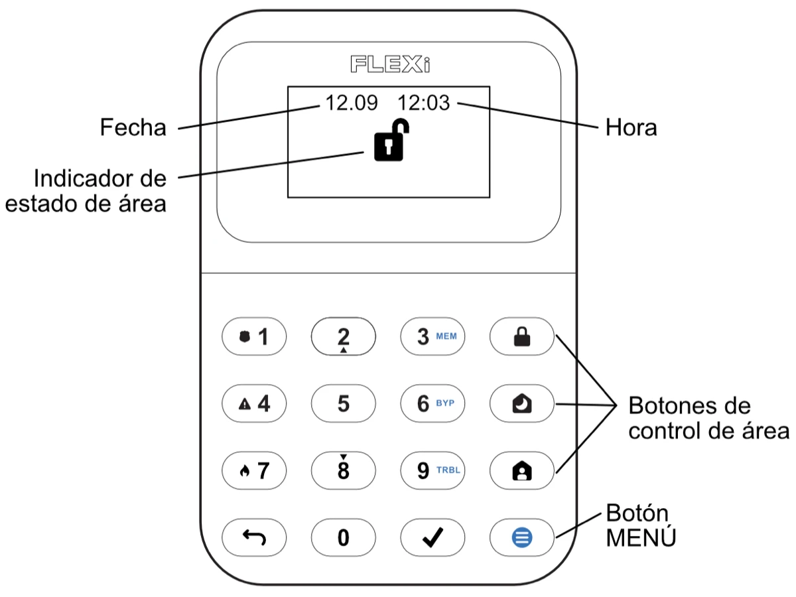
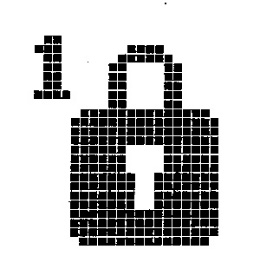
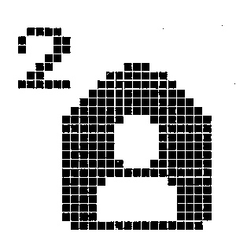
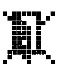

# FLEXi / Teclado SK-LCD button – Breve guía del usuario

## Vista General del Teclado

> [!NOTE]
> El teclado “SK-LCD button” para control del sistema de alarma muestra los estados de **64 zonas y 8 áreas.** Además, el teclado “SK- LCD button” se puede asignar para controlar una o más áreas deseadas (versión del programa operativo del panel de control desde FW: SP3_xxx4_0121). El teclado mostrará los estados del área asignada y de las zonas del área.

## Armado/Desarmado del Sistema de Alarma

### Armado de Sistema de Alarma

1. Asegúrese de que todas las zonas no estén violadas.

2. Presione el botón .

3. Ingrese el código de usuario.

4. Seleccione las áreas que desea activar.

5. Presione el botón .

6. Salga de las instalaciones dentro del tiempo establecido.

Cuando el sistema esté armado, el icono  se iluminará.

### Desarmado del Sistema de Alarma

1. Ingrese el código de usuario.

2. Presione el botón que corresponde al área que desea desactivar.

3. Presione el botón .

Después de desactivar la alarma, el icono  debería iluminarse.

### Activación del Modo SLEEP

(El perímetro de las instalaciones se encuentra asegurado. Se permite el movimiento en el interior. Si abre la puerta de entrada, la alarma se activará inmediatamente.):

1. Presione el botón .

2. Ingrese el código de usuario.

3. Presione el botón de área para activarlo.

4. Presione el botón .

5. El modo SLEEP se activará inmediatamente, sin retardo de salida.

El indicador de  se iluminará cuando se encuentre en modo SLEEP.
### Activación del Modo STAY
(El perímetro de las instalaciones está asegurado. Se permite el movimiento en el interior. Cualquier apertura de la puerta de entrada permite un retraso de tiempo durante el cual debe desactivar la alarma):

6. Presione el botón .

2. Ingrese el código de usuario.

3. Presione el botón de área para activarlo.

4. Presione el botón .

5. El modo STAY se activará inmediatamente, sin retardo de salida.

El indicador  se iluminará cuando se encuentre en modo STAY.

> [!NOTE]
> Para cambiar el estado del área al contrario, basta con ingresar el código de usuario y seleccionar el área deseada. Presione el botón  para eliminar los caracteres combinados o el comando.
## Botones de Emergencia

### Para enviar un mensaje de emergencia a su servicio de seguridad
- **Policía** – mantenga presionado el botón **1** por 3 seg.

- **Ayuda Médica** – mantenga presionado el botón **4** por 3 seg.

- **Servicio de Incendios** – mantenga presionado el botón **7** por 3 seg.

## Ajuste de Brillo de Iluminación e Indicador de Sonido

### Brillo de los botones del teclado

1. Presione el botón , luego **5** **3**.

2. Seleccione el brillo preferido de la luz de fondo de los botones del teclado usando los botones **2** y **8**.

3. Presione  para guardar el nuevo valor.

### El brillo de la pantalla LCD

4. Presione el botón , luego **5** **2**.

5. Utilice los botones **2** y **8** para seleccionar el brillo de retroiluminación LCD deseado.

6. Presione  para guardar el nuevo valor.

### Volumen de pulsaciones de teclas del teclado

7. Presione el botón , luego **5** **1**.

8. Seleccione el nivel de indicación de sonido preferido usando los botones **2** y **8**.

9. Presione  para guardar el nuevo valor.
> [!NOTE]
> Apague la iluminación del teclado en modo de espera. Presione  seguido de **5** **4**. Cambie el estado de la retroiluminación del teclado en modo de espera presionando **1** (retroiluminación encendida) o **2** (retroiluminación apagada). Presione  para guardar el nuevo valor.

## Ingresar o Cambiar / Códigos de Usuario o Maestro

### Para ingresar un Nuevo código o cambiar uno existente

1. Presione el botón , luego **0**.

2. Ingrese código **Maestro**, código por defecto – 1234.

3. Ingrese la secuencia numérica de doble dígito del usuario, ej., **02**.
> [!NOTE]
> Secuencia Numérica del código **Maestro**- **01**.

4. Ingrese un código de Nuevo usuario dos veces.

5. Presione los números secuenciales de las áreas que deberán ser controladas por el usuario.

6. Presione el botón . Presione el botón  para salir.

## Restablecimiento del Detector de Incendios (Humo)

### Para reestablecer el Detector de Incendios (Humo)

- Mantenga presionado el botón  por 3 segundos.
> [!NOTE]
> Los detectores de incendio no se reinician automáticamente después de la detección de emergencia por incendio. Solo se pueden reiniciar manualmente.

## Desactivación del Monitoreo de la Zona Temporal. (Función BYPASS)

### Activación de la Función BYPASS

1. Presione el botón , luego **6**.

2. Ingrese el código de control de la alarma.

3. Ingrese un número secuencial de dos dígitos de una zona en particular para deshabilitar su monitoreo. Para deshabilitar el monitoreo de varias zonas, ingrese números de dos dígitos de tales zonas.

4. Presione el botón . El icono  aparece en la pantalla LCD.

### Desactivar la función BYPASS

Repita las mismas acciones que en la desactivación del monitoreo de una zona particular.

## Eliminar Códigos de Usuario

### Para eliminar el código de usuario

1. Presione el botón , luego **0**.

2. Ingrese código **Maestro**.

3. Ingrese la secuencia numérica de doble dígito del usuario, ej., **02**.

4. Presione el botón  del teclado. Una señal Sonora se escuchará.

5. Presione el botón .

## Símbolos gráficos

| Símbolo | Descripción | Símbolo | Descripción |
|---|---|---|---|
|  | Panel de control no conectado |  | Problema de lazo de incendio |
|  | Partición 1 armada |  | Lista de problemas de red |
|  | Partición 4 desarmada |  | Problema de CMS 1 (2) |
|  | Partición 2 en STAY |  | Problema de nube |
|  | Partición 3 en SLEEP |  | Problema de tarjeta SIM |
|  | Botón MENU |  | Problema de contraseña de SIM |
|  | Botón ENTER |  | Problema de red de SIM |
|  | Partición |  | Problema de WiFi |
|  | Alarma |  | Problema de interfaz RS485 |
|  | Incendio |  | Problema de tarjeta SIM 2 |
|  | Código de usuario |  | Problema de LAN |
|  | Usuario |  | Batería baja inalámbrica |
|  | Entrada/Salida |  | Problema de alimentación |
|  | Zona abierta |  | Problema de sirena |
|  | Bypass |  | Problema de sabotaje |
|  | Memoria |  | Problema de anti-enmascaramiento |
|  | Problema |  | Problema inalámbrico |
|  | Lista de problemas del sistema |  | Problema de módulo expansor |
|  | Problema de alimentación AC |  | Ajustes |
|  | Problema de batería |  | Volumen |
|  | Sobrecorriente AUX |  | Brillo de LCD |
|  | Hora no configurada |  | Brillo del teclado |
|  | Sobrecorriente de sirena |  | Luz de espera O-Encendido / I-Apagado |
|  | Sirena no detectada |  | Información |
