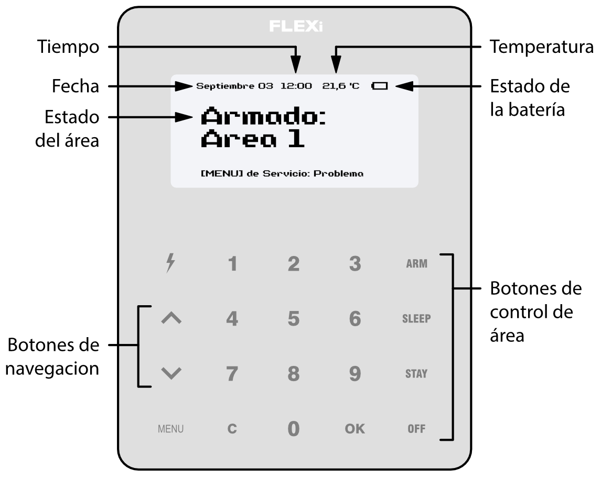

# FLEXi / El teclado SK-LCD TouchPad – Breve guía del usuario

## Descripción general del teclado

> [!NOTE]
> El teclado SK-LCD TouchPad para control del sistema de alarma muestra los estados de 64 zonas y 8 participaciones. Además, el teclado SK-LCD TouchPad se puede asignar para controlar una o más áreas deseadas (versión del programa operativo del teclado desde FW:1.41, versión del programa operativo del panel de control desde FW:SP3_xxx4_0119. La versión del firmware del teclado se puede ver presionando **MENU** **5** **0**). El teclado mostrará los estados del área asignada y de las zonas del área.

## Armado / Desarmado del sistema de alarma

### ARMAR el sistema de alarma

Asegúrese de que no haya áreas dañadas.

1. Presione el botón **ARM**.

2. Introduzca **[Código de usuario]**.

3. Si el sistema tiene solo una partición, omita los pasos 4 y 5.

4. Presione los botones de las áreas que desea controlar.

5. Confirme su selección presionando el botón **OK**.

6. Salga de las instalaciones durante el **Retardo de Salida**.

Durante la cuenta regresiva del **Retardo de Salida**, el tiempo para la salida se mostrará en el teclado, y el texto aparecerá en el teclado cuando se active el modo de armado: **Armado: Área**.

### DESARMAR el sistema de alarma

1. Presione el botón **OFF**.

2. Introduzca **[Código de usuario]**.

3. Si el sistema tiene solo una partición, omita los pasos 4 y 5.

4. Presione los botones de las áreas que desea controlar.

5. Confirme su selección presionando el botón **OK**.

Cuando se desarma, en la pantalla aparecerá el texto **Desarmado: Área**.

> [!NOTE]
> Para que el estado del área cambie al opuesto, es suficiente ingresar el código de usuario y seleccionar el área preferida. Para borrar símbolos o comandos ingresados, presione el botón **C**.

### Activación del modo SLEEP

(El perímetro de las instalaciones está asegurado. Se permite el movimiento hacia el interior. Si abre la puerta de entrada, la alarma se activará inmediatamente):

1. Introduzca **[Código de usuario]**.

2. Confirme su selección presionando el botón **OK**.

### Activación del modo STAY

(El perímetro de las instalaciones está asegurado. Se permite el movimiento en el interior. Cualquier apertura de la puerta de entrada permite un retraso de tiempo durante el cual debe desarmar la alarma):

1. Introduzca **[Código de usuario]**.

2. Confirme su selección presionando el botón **OK**.

## Botones de emergencia

**<u>Para enviar un mensaje de emergencia a su servicio de seguridad</u>**:

- **Panico**: mantenga pulsado el botón **1** durante 3 segundos.

- **Médica**: mantenga pulsado el botón **4** durante 3 segundos.

- **Incendio**: mantenga presionado el botón **7** durante 3 segundos.

## Brillo de iluminación y ajuste de sonido de indicación

<u>Para ajustar el brillo de la iluminación del teclado y el sonido de indicación</u>:

1. Presione el botón **5**.

## Introducción o cambio de códigos de Usuario o Maestros

<u>Para ingresar un código de usuario nuevo o cambiar el existente</u>:

1. Introduzca **[Código de administrador]** (código predeterminado: 123456).

## Reinicio del detector de incendios (humo) de dos cables

<u>Para restablecer los detectores de incendios (humo) de dos cables</u>:

- Mantenga pulsado el botón  durante 3 segundos.

> [!NOTE]
> Los detectores de incendios de dos cables no se reinician automáticamente después de la detección de emergencia por incendio. Solo se pueden restablecer manualmente.

## Desactivación temporal de la monitorización de zona (función BYPASS)

**<u>Activación de la función BYPASS</u>:**

1. Presione el botón **3**.

**<u>Desactivación de la función BYPASS</u>:**

Repita las mismas acciones que en la desactivación de la monitorización de una zona particular.

## Eliminar códigos de usuario

**<u>Para eliminar el código de usuario</u>:**

1. Introduzca **[Código de administrador]** (código predeterminado: 123456).
