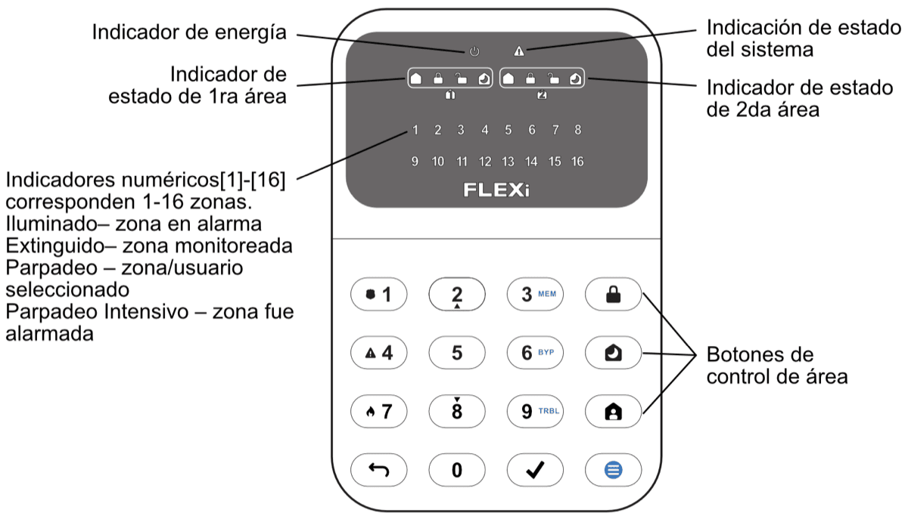

# FLEXi / Teclado SK-LED button – Breve guía del usuario

## Vista General del Teclado

> [!NOTE]
> El teclado “SK-LED button” para el control del sistema de alarma muestra los estados de 16 zonas y 2 particiones. Además, el teclado “SK-LED button” puede asignarse para controlar una o dos áreas deseadas (versión de firmware del teclado desde FW:1.0, versión de firmware del panel de control desde FW:SP3_xxx4_0120). El teclado mostrará los estados del área asignada y de las zonas del área.

## Armado/Desarmado del Sistema de Alarma

### Armado de Sistema de Alarma

1. Asegúrese de que todas las zonas no estén violadas (ninguno de los indicadores de zona esté encendido).

2. Presione el botón .

3. Ingrese el código de usuario.

4. Seleccione el botón de área que se activará.

5. Presione el botón .

6. Salga de las instalaciones dentro del tiempo establecido.

Una vez que se ingresa el código, el indicador  parpadeará durante el tiempo de retardo de salida. Cuando el sistema esté Armado, el indicador  se iluminará.

### Desarmado del Sistema de Alarma

7. Ingrese el código de usuario.

2. Presione el botón que corresponde al área que desea desactivar.

3. Presione el botón .

Cuando la alarma está desarmada, el indicador de apagado  debe estar encendido.

### Activación del Modo SLEEP

(El perímetro de las instalaciones se encuentra asegurado. Se permite el movimiento en el interior. Si abre la puerta de entrada, la alarma se activará inmediatamente.):

1. Presione el botón .

2. Ingrese el código de usuario.

3. Presione el botón de área para activarlo.

4. Presione el botón .

5. El modo SLEEP se activará inmediatamente, sin retardo de salida.

El indicador de  se iluminará cuando se encuentre en modo SLEEP.

### Activación del Modo STAY

(El perímetro de las instalaciones está asegurado. Se permite el movimiento en el interior. Cualquier apertura de la puerta de entrada permite un retraso de tiempo durante el cual debe desactivar la alarma):

6. Presione el botón .

2. Ingrese el código de usuario.

3. Presione el botón de área para activarlo.

4. Presione el botón .

5. El modo STAY se activará inmediatamente, sin retardo de salida.

El indicador  se iluminará cuando se encuentre en modo STAY.

> [!NOTE]
> Para cambiar el estado del área al contrario, basta con ingresar el código de usuario y seleccionar el área deseada. Presione el botón  para eliminar los caracteres combinados o el comando
## Botones de Emergencia

**<u>Para enviar un mensaje de emergencia a su servicio de seguridad</u>**
- **Policía** – mantenga presionado el botón **1** por 3 seg.

- **Ayuda Médica** – mantenga presionado el botón **4** por 3 seg.

- **Servicio de Incendios** – mantenga presionado el botón **7** por 3 seg.

## Ajuste de Brillo de Iluminación e Indicador de Sonido

### Brillo de los botones del teclado

1. Presione el botón , luego **1**.

2. Seleccione el brillo preferido de la luz de fondo de los botones del teclado usando los botones **2** y **8**.

3. Presione  para guardar el nuevo valor. Presione el botón  para salir.

**<u>El brillo de la indicación LED de zona:</u>**

4. Presione el botón , luego **4**.

5. Seleccione el brillo de iluminación preferido de la indicación de zona usando los botones **2** y **8**.

6. Presione  para guardar el nuevo valor. Presione el botón  para salir.

**<u>Volumen de pulsaciones de teclas del teclado:</u>**

7. Presione el botón , luego **7**.

8. Seleccione el nivel de indicación de sonido preferido usando los botones **2** y **8**.

9. Presione  para guardar el nuevo valor. Presione el botón  para salir.
> [!NOTE]
> Apague la iluminación del teclado en modo de espera. Al presionar  seguido de **5** se alternan los estados de retroiluminación de los indicadores del teclado en el modo de espera. Presione  para guardar el nuevo valor. Presione el botón  para salir.

## Ingresar o Cambiar / Códigos de Usuario o Maestro

### Para ingresar un Nuevo código o cambiar uno existente

1. Presione el botón , luego **0**.

2. Ingrese código *Maestro*, código por defecto – 1234.

3. Ingrese la secuencia numérica de doble dígito del usuario, ej., **02**.
> [!NOTE]
> Secuencia Numérica del código *Maestro*- **01**.

4. Ingrese un código de Nuevo usuario dos veces.

5. Presione los números secuenciales de las áreas que deberán ser controladas por el usuario.

6. Presione el botón . Presione el botón  para salir.

## Restablecimiento del Detector de Incendios (Humo)

### Para reestablecer el Detector de Incendios (Humo)

- Mantenga presionado el botón  por 3 segundos.
> [!NOTE]
> Los detectores de incendio no se reinician automáticamente después de la detección de emergencia por incendio. Solo se pueden reiniciar manualmente.

## Desactivación del Monitoreo de la Zona Temporal. (Función BYPASS)

### Activación de la Función BYPASS

1. Presione el botón , luego **6**.

2. Ingrese el código de control de la alarma. El indicador  empieza a parpadear en verde.

3. Ingrese un número secuencial de dos dígitos de una zona en particular para deshabilitar su monitoreo. Para deshabilitar el monitoreo de varias zonas, ingrese números de dos dígitos de tales zonas.

4. Presione el botón . El indicador  se empieza a iluminar en verde.

**<u>Desactivar la función BYPASS:</u>**

Repita las mismas acciones que en la desactivación del monitoreo de una zona particular.

## Eliminar Códigos de Usuario

### Para eliminar el código de usuario

1. Presione el botón , luego **0**.

2. Ingrese código *Maestro*.

3. Ingrese la secuencia numérica de doble dígito del usuario, ej., **02**.

4. Presione el botón  del teclado. Una señal Sonora se escuchará y el botón, indicando la secuencia numérica del usuario, cuyo código fue borrado de memoria, se extinguirá.

5. Presione el botón . Presione el botón  para salir.  Además, el teclado “SK- LED button” se puede asignar para controlar una o dos áreas deseadas (versión del programa operativo del teclado desde FW:1.0, versión del programa operativo del panel de control desde FW:SP3_xxx4_0120).
