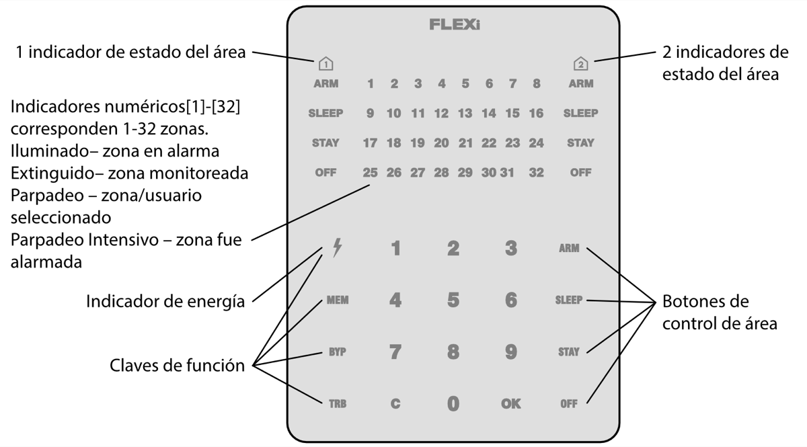

# FLEXi / Teclado SK-LED TouchPad – Breve guía del usuario

## Vista General del Teclado

> [!NOTE]
> El teclado SK-LED TouchPad para control del sistema de alarma muestra los estados de 32 zonas y 2 participaciones. Además, el teclado SK- LED TouchPad se puede asignar para controlar una o dos áreas deseadas (versión del programa operativo del teclado desde FW:3.0, versión del programa operativo del panel de control desde FW:SP3_xxx4_0119). El teclado mostrará los estados del área asignada y de las zonas del área.

## Armado/Desarmado del Sistema de Alarma

### Armado de Sistema de Alarma

1. Asegúrese de que no se violen todas las zonas (que ninguno de los indicadores de zona esté iluminado).

2. Ingrese el código de usuario.

3. Seleccione el botón de área que se activará.

4. Presione el botón **OK**.

5. Salga de las instalaciones dentro del tiempo establecido.

Ya que el código esté ingresado el indicador de Armado parpadeará durante el tiempo de salida establecido.

### Desarmado del Sistema de Alarma
1. Presione el botón de apagado **OFF**.

2. Ingrese el código de usuario.

3. Presione el botón del área particular que desea desensamblar.

4. Presione el botón **OK**.

Cuando la alarma está desarmada, el indicador de apagado (OFF) debe estar encendido, sin embargo, los indicadores del modo de ensamblaje deben apagarse.

### Activación del Modo SLEEP

(El perímetro de las instalaciones se encuentra asegurado. Se permite el movimiento en el interior. Si abre la puerta de entrada, la alarma se activará inmediatamente.):

1. Presione el botón **SLEEP**.

2. Ingrese el código de usuario.

3. Presione el botón de área para activarlo.

4. Presione el botón **OK**.

5. El modo SLEEP se activará inmediatamente, sin retardo de salida.

El indicador de SLEEP se iluminará cuando se encuentre en modo SLEEP.
### Activación del Modo STAY
(El perímetro de las instalaciones está asegurado. Se permite el movimiento en el interior. Cualquier apertura de la puerta de entrada permite un retraso de tiempo durante el cual debe desactivar la alarma):

1. Presione el botón **STAY**.

2. Ingrese el código de usuario.

3. Presione el botón de área para activarlo.

4. Presione el botón **OK**.

5. El modo STAY se activará inmediatamente, sin retardo de salida.

El indicador STAY se iluminará cuando se encuentre en modo STAY.

> [!NOTE]
> Para cambiar el estado del área a la opuesta, basta con ingresar el código de usuario y seleccionar el área preferida. Para borrar símbolos o comandos ingresados, presione el botón .
## Botones de Emergencia

**<u>Para enviar un mensaje de emergencia a su servicio de seguridad</u>**
- **Policía** – mantenga presionado el botón **1** por 3 seg.

- **Ayuda Médica** – mantenga presionado el botón **4** por 3 seg.

- **Servicio de Incendios** – mantenga presionado el botón **7** por 3 seg.

## Ajuste de Brillo de Iluminación e Indicador de Sonido

### Para ajustar el Brillo de Iluminación e Indicador de Sonido del teclado

1. Mantenga presionado el botón **C** por 3 seg.

2. Seleccione el brillo de iluminación preferido del indicador de zonas usando los botones **1** y **4**.

3. Seleccione el brillo de iluminación preferido de las teclas de la fila inferior utilizando los botones **2** y **5**.

4. Seleccione el nivel preferido de indicador de sonido usando los botones **3** y **6**.

5. Seleccione habilitar/deshabilitar la iluminación de indicación LED del teclado en modo de espera con la tecla **0**. Presione **0** si cada dos indicadores LED de las zonas están encendidos - la iluminación del teclado está apagada en el modo de espera, si todos los indicadores LED de las zonas están encendidos - la iluminación del teclado está encendida en el modo de espera.

6. Presione el botón **C** nuevamente para guardar la configuración.

## Ingresar o Cambiar / Códigos de Usuario o Maestro

### Para ingresar un Nuevo código o cambiar uno existente

1. Presione el botón .

2. Ingrese código *Maestro*, código por defecto – 1234. Los indicadores de zona, mostrando la secuencia numérica de esos Usuarios, cuyos códigos hayan sido ingresados, se iluminarán.

3. Ingrese la secuencia numérica de doble dígito del usuario, ej., **02**.
> [!NOTE]
> Secuencia Numérica del código *Maestro*- **01**.

4. Ingrese un código de Nuevo usuario dos veces.

5. Presione los números secuenciales de las áreas que deberán ser controladas por el usuario.

6. Presione el botón . Para salir, presione el botón **C** dos veces.

## Restablecimiento del Detector de Incendios (Humo) de Dos Cables

### Para reestablecer el Detector de Incendios (Humo) de dos cables

- Mantenga presionado el botón  por 3 segundos.
> [!NOTE]
> Los detectores de incendio de dos cables no se reinician automáticamente después de la detección de emergencia por incendio. Solo se pueden reiniciar manualmente.

## Desactivación del Monitoreo de la Zona Temporal. (Función BYPASS)

### Activación de la Función BYPASS

1. Presione el botón **BYP**.

2. Ingrese el código de control de la alarma. El indicador **BYP** empieza a parpadear.

3. Ingrese un número secuencial de dos dígitos de una zona en particular para deshabilitar su monitoreo. Para deshabilitar el monitoreo de varias zonas, ingrese números de dos dígitos de tales zonas.

4. Presione el botón . El indicador **BYP** se empieza a iluminar.

**<u>Desactivar la función BYPASS:</u>**

Ingrese un número de secuencia de dos dígitos de una zona en particular para deshabilitar su monitoreo. Para deshabilitar el monitoreo de varias zonas, ingrese números de dos dígitos de tales zonas.

## Eliminar Códigos de Usuario

### Para eliminar el código de usuario

1. Presione el botón .

2. Ingrese código *Maestro*. Los indicadores de zona, mostrando la secuencia numérica de esos Usuarios, cuyos códigos hayan sido ingresados, se iluminarán.

3. Ingrese la secuencia numérica de doble dígito del usuario, ej., **02**.

4. Presione el botón **SLEEP** del teclado. Una señal Sonora se escuchará y el botón, indicando la secuencia numérica del usuario, cuyo código fue borrado de memoria, se extinguirá.

5. Presione el botón  dos veces.
