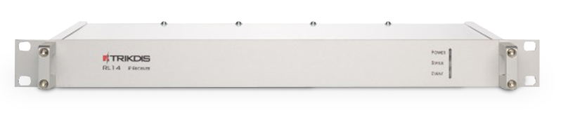

# RL14 Receptor IP/SMS

  

El receptor IP/SMS RL14 está destinado para Estaciones de Monitoreo Central (EMC). Está diseñado para recibir mensajes de los módulos de transmisión TRIKDIS enviados mediante los protocolos TCP/UDP y/o SMS.

El receptor procesa los mensajes recibidos y los transfiere al software de monitoreo a través de la red LAN o los puertos RS232.
