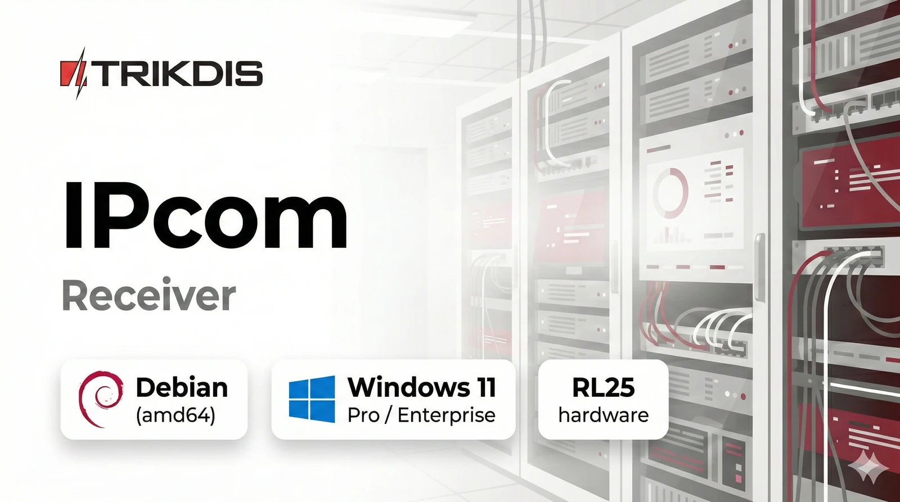

# Visión general del receptor IPcom v5

IPcom v5 es un receptor para recopilar, procesar, enrutar y supervisar eventos de sistemas de seguridad. Proporciona una interfaz web para operación y administración.

Las ediciones siguientes corresponden al mismo producto IPcom v5 con distintos modelos de implementación:

- Instalación en Windows
- Instalación en Linux (hardware o VM)
- Receptor de hardware RL25

## Variantes de implementación

| Variante | Qué significa | Uso típico |
| --- | --- | --- |
| Instalación en Windows | IPcom v5 instalado en Windows | Entornos pequeños o centrados en Windows |
| Instalación en Linux (hardware o VM) | IPcom v5 instalado en un servidor Linux o en una máquina virtual | Implementaciones escalables e infraestructura de servidor |
| Receptor de hardware RL25 | IPcom v5 en hardware RL25 dedicado | Implementación tipo appliance con Linux preconfigurado |

## Comparación de capacidades por implementación

Diferencias funcionales entre ediciones:

| Función | Instalación en Windows | Instalación en Linux (hardware o VM) | Instalación Linux en RL25 |
| --- | --- | --- | --- |
| Número de dispositivos supervisados | Hasta 500 objetos (se puede ampliar) | Hasta 50 000 por 1 GB de RAM | Hasta 50 000 por 1 GB de RAM |
| Aplicación Protegus 2 (retransmisión a través del receptor) | No | Sí | Sí |

`Retransmisión a través del receptor` significa que los eventos y estados de los dispositivos se reenvían a Protegus 2 mediante IPcom, y que las acciones compatibles pueden enviarse de vuelta a los dispositivos a través de IPcom.

## Requisitos de hardware

Use estas referencias de dimensionamiento al planificar nuevas instalaciones.

### Instalación en Linux (hardware o VM)

Requisitos de la plataforma Linux:

- La edición Linux de IPcom v5 solo es compatible con `amd64` (`x86_64`).
- El sistema operativo base recomendado es Debian Stable (`amd64`).
- Los enlaces de Debian `netinst` apuntan a la versión Stable actual y pueden cambiar con el tiempo.
- Para implementaciones controladas, fije el nombre exacto del archivo ISO o la versión de Debian en su documentación de despliegue.
- Las plataformas que no sean `amd64` (por ejemplo, `arm64`/`aarch64`) no son compatibles con la implementación Linux de IPcom v5.
- Si el hardware no es `amd64`, use una alternativa compatible, como la instalación en Windows o el hardware RL25.

| Tamaño de implementación | RAM | Almacenamiento |
| --- | --- | --- |
| Implementación base | 4 GB | SSD de 128 GB |
| Carga alta de objetos (alrededor de 100 000 objetos) | 8 GB | SSD de 128 GB |
| Carga alta de objetos con base de datos habilitada | 8 GB | SSD empresarial de 256 GB |

Notas:

- Para implementaciones con un uso intensivo de base de datos, la recomendación de un SSD empresarial de 256 GB se debe sobre todo a la resistencia (mayor DWPD), no solo a la capacidad bruta.
- Planifique espacio libre adicional en disco para registros, copias de seguridad y archivos de reversión de actualizaciones.

### Instalación en Windows

Especificación mínima recomendada:

- Windows 11 Pro o Windows 11 Enterprise
- CPU de 2 núcleos
- 8 GB de RAM
- HDD/SSD de 128 GB (SSD recomendado)

### Receptor de hardware RL25

- RL25 se suministra con SSD y RAM preinstalados.
- Use RL25 cuando se prefiera una implementación tipo appliance y hardware prevalidado.

## Capacidades compartidas (todas las variantes)

### Recepción y control principales

- Receptor IP, receptor SMS (opcional / GM14 / SMPP) y recepción por RS232.
- Configuración remota de TRIKDIS y control remoto de TRIKDIS.
- Supervisión, enrutamiento de mensajes y filtrado de mensajes por radio.
- Gestión del receptor mediante página web (HTTP/HTTPS).

### Protocolos e integraciones

- Protocolos compatibles: Trikdis (TCP/UDP/COM/SMS).
- Protocolos CMS/automatización: Split / Multi-Port Reporting.
- Formatos CMS: Ademco 685, Monas3, Surgard MLR2, MLR2000, SIA DC-09.
- Tipos de transporte CMS/automatización: cliente/servidor TCP, RS232, JSON, webhook.
- Interfaz SQL DB y exportación de información de objetos.

### Funciones de la interfaz y de operación

- Interfaz de usuario editable.
- Sustitución de cuenta a nivel de receptor y visualización de la cuenta relacionada (panel).
- Posibilidad de ignorar mensajes primarios.
- Bloqueo de dispositivos por ID (planificado).
- Registro de cambios de configuración.
- Panel de visión general del sistema del receptor.
- Actualización remota.
- Lista de usuarios multinivel.

## Alcance operativo

### Acceso y seguridad

- Inicio de sesión desde navegador mediante dirección IP o dominio con selección de puerto.
- Interfaz de gestión HTTP/HTTPS, con el uso de SSL descrito para acceso seguro.
- Lista de usuarios, cuenta de administrador, asignación de funciones y controles de sesión/token.

Para ver métodos de acceso paso a paso (web y `.exe` de Windows), consulte [Acceso e inicio de sesión](./ui/access-and-login.md).
Para ver procedimientos de creación de usuarios, contraseña, permisos y tokens, consulte [Pestaña Usuarios](./ui/screens/users.md).

Referencia operativa de seguridad:

- Restrinja el acceso a la interfaz de gestión por lista permitida de red o VPN.
- Use HTTPS con certificados válidos para todas las sesiones de administración.
- Mantenga `administrator` reservado para emergencias; use cuentas nominativas con privilegios mínimos para el trabajo diario.
- Rote credenciales y secretos de integración de forma periódica.

### Supervisión y operación

- Vista de panel del estado del sistema y de los objetos.
- Seguimiento de estados online/offline/no supervisado y estadísticas de eventos.
- Registros del sistema y registros de sesión para visibilidad operativa.

### Eventos, enrutamiento y manejo de protocolos

- Gestión de la lista de eventos con capacidades de filtrado y búsqueda.
- Gestión de ping/heartbeat para supervisión de conectividad.
- Gestión de enrutamiento y salidas para flujos CMS/automatización.

### Integración y datos

- Datos operativos respaldados por SQL y exportación de objetos.
- Compatibilidad API/integración mediante transporte JSON y webhook.

### Implementación y ciclo de vida

- Implementación en plataformas Windows y Linux.
- Flujos de importación/exportación de configuración y actualización remota.
- Licencias y consideraciones operativas del lado del servidor.

## Acceso rápido

Use estas páginas como puntos de entrada principales:

- Métodos de acceso y solución de problemas: [Acceso e inicio de sesión](./ui/access-and-login.md)
- Comportamiento operativo pantalla por pantalla: [Pestaña Estado](./ui/screens/status.md) (y el resto de la `Interfaz de usuario`)
- Procedimientos de usuarios y permisos: [Pestaña Usuarios](./ui/screens/users.md)
