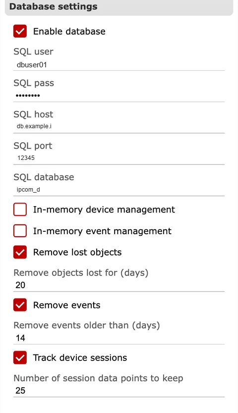

# General

**Propósito:** Configurar ajustes globales de la instancia que afectan a la sincronización horaria, la supervisión, el comportamiento de la base de datos, el acceso a la API y el manejo de eventos al inicio.

## Cuándo usarlo

- Durante la implementación inicial para definir identidad, sincronización horaria, API y conectividad con la base de datos.
- Al ajustar supervisión, retención o comportamiento de exportación para operaciones.

## Secciones y por qué importan {#general-sections}

### Misc.

Define el nombre de la instancia y los comportamientos de sesión. El nombre de la instancia aparece en la interfaz y ayuda a los operadores a confirmar que están trabajando sobre el receptor correcto. Opciones como `Generate restore on new session` influyen en cómo se emiten eventos de restore tras una reconexión, lo que afecta a la supervisión descendente. Los ajustes de sincronización horaria controlan si IPcom envía su reloj a los dispositivos y con qué frecuencia, lo que afecta directamente a las marcas de tiempo de los eventos.

**Comprobaciones y acciones operativas:**

- Supervisar: `Send IPCom time to devices` y el intervalo de sincronización. Señal de alerta: deriva horaria entre receptor y CMS.
- Supervisar: cambios en el nombre de la instancia. Señal de alerta: operadores seleccionando el receptor equivocado.
- Confirmar: `instance_name` no debe estar vacío.
- Confirmar: `synchronize_device_time_interval` debe ser mayor que `0`.

### Ajustes del rastreador de objetos

Controla la temporización de supervisión para dispositivos rastreados. Los multiplicadores de timeout y las tolerancias determinan cuándo un dispositivo se considera offline. Existen valores SMS separados cuando los dispositivos informan por SMS. Los contadores de eventos de restore ajustan cuándo el sistema emite mensajes de recuperación después de que un dispositivo vuelva a estar disponible.

**Comprobaciones y acciones operativas:**

- Supervisar: multiplicadores de timeout y tolerancias. Señal de alerta: falsas alarmas offline o tormentas de restore.
- Confirmar: `timeout_multiplier` y `sms_timeout_multiplier` deben estar en `1..100`.
- Confirmar: `timeout_tolerance` y `sms_timeout_tolerance` deben estar en `0..3600`.
- Confirmar: `event_count_for_restore` y `event_count_for_restore_sms` deben estar en `1..10`.

### Ajustes de la API

Define acceso API HTTPS, puerto y secretos. Estos ajustes controlan cómo se integran los sistemas externos con IPcom y deben mantenerse alineados con firewalls y proxies inversos. El estado del certificado TLS en esta sección ayuda a validar el acceso seguro.

La exposición de la API debe restringirse a redes de administración o integración de confianza.

**Comprobaciones y acciones operativas:**

- Supervisar: `Enable HTTP API`, puertos de API y estado TLS. Señal de alerta: ruta de gestión abierta inesperada o problemas de certificado.
- Supervisar: `Enable cluster`. Señal de alerta: deriva del estado del nodo o anomalías de failover.
- Confirmar: `api_port` y `api_http_port` deben estar entre `1` y `65535`.
- Confirmar: `api_jwt_secret` debe tener exactamente 64 caracteres.
- Confirmar: `private_key` y `public_key` no deben estar vacíos y deben apuntar a archivos PEM válidos.

### Ajustes de exportación de STATUS del dispositivo

Habilita un listener de exportación de estado y configura su puerto y la lista permitida de IP. Úselo para sistemas descendentes que consumen actualizaciones del estado de los dispositivos. El cifrado puede activarse cuando la exportación se envía por redes no confiables.

**Comprobaciones y acciones operativas:**

- Supervisar: valores de `Enabled`, `Port`, `Whitelist` y `Encrypt`. Señal de alerta: falta de exportación de estado o tráfico desde orígenes inesperados.
- Confirmar: el `port` de exportación STATUS del dispositivo debe estar en `1..65535`.
- Confirmar: si el cifrado de exportación STATUS está habilitado, la longitud de la clave debe ser exactamente de 16 caracteres.

### Ajustes de la base de datos

Habilita la base de datos SQL y configura detalles de conexión (usuario, contraseña, host, puerto, base de datos). Las opciones de gestión de dispositivos y eventos en memoria controlan qué se almacena en caché y cómo funciona la limpieza. Los valores de retención `Remove lost objects` y `Remove events` determinan cuánto tiempo se conservan los datos antes de limpiarse, lo que afecta al almacenamiento y a la profundidad de auditoría.

**Comprobaciones y acciones operativas:**

- Supervisar: `Enable database` y campos de conexión SQL. Señal de alerta: falta de registros/historial tras un reinicio.
- Supervisar: valores de retención `Remove lost objects` y `Remove events`. Señal de alerta: desaparición de datos antes de lo previsto por la política.
- Confirmar: si la base de datos está habilitada, `sqluser`, `sqlpass`, `sqlhost` y `sqldatabase` no deben estar vacíos.
- Confirmar: `sqlport` debe estar en `1..65535` (`0` hace que IPcom use el puerto predeterminado `3306`).
- Confirmar: `remove_lost_objects_age` y `remove_events_age` deben ser `1..365` días.
- Confirmar: `device_session_log_count` debe estar en `1..25`.

### Ajustes de eventos de inicio ignorables

Permite suprimir códigos de evento específicos durante el arranque del dispositivo. Esto es útil para reducir ruido durante reconexiones masivas o mantenimientos programados. Use la lista de eventos para añadir o quitar códigos que deben ignorarse.

**Comprobaciones y acciones operativas:**

- Supervisar: `Ignore events on device startup` y la lista de excepciones. Señal de alerta: alarmas críticas de arranque que no llegan al CMS.
- Confirmar: `event_code <= 0xFFF`, `group_no <= 0xFF`, `zone_no <= 0xFFF`, y cada tripleta debe ser única.

## Gestión de cambios

- Programe cambios en API, base de datos y retención durante ventanas de mantenimiento.
- Registre valores antes y después del cambio, así como el impacto esperado, para auditoría y reversión.
- Después de cada cambio, verifique `Estado`, `Registros` y las rutas de entrega de destino.
- Mantenga un camino de reversión listo para cambios relacionados con base de datos, API y clúster.
