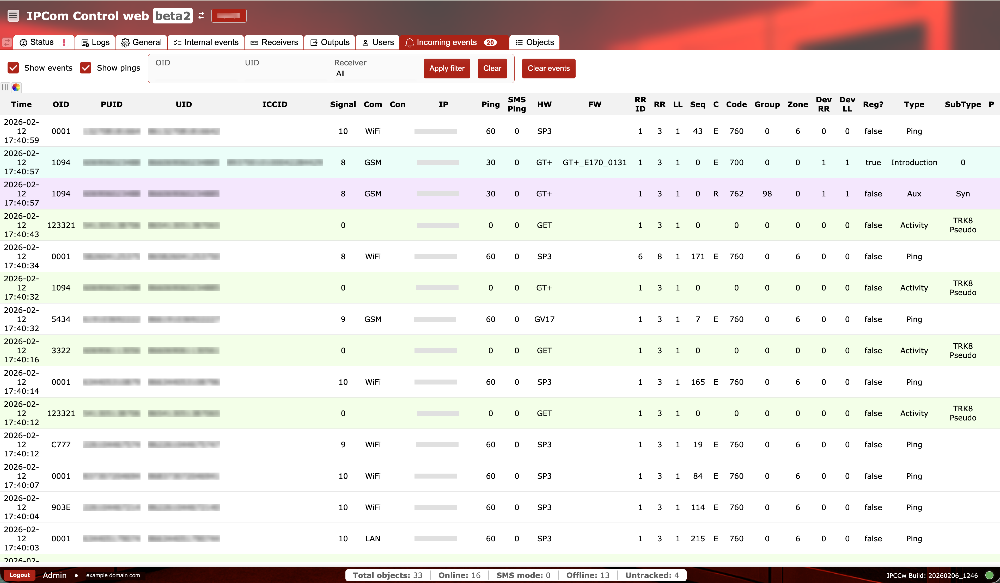
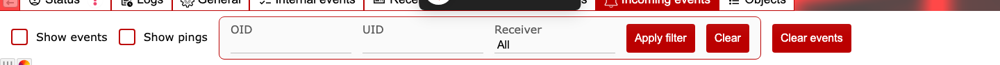

# Eventos entrantes

**Propósito:** Supervisar eventos y pings entrantes en tiempo real desde los dispositivos, y filtrarlos por dispositivo o receptor.

## Cuándo usarlo

- Al validar que los dispositivos están enviando eventos.
- Al solucionar problemas de enrutamiento, conectividad o decodificación de eventos.

## Secciones y por qué importan

### Filtros y acciones {#incoming-events-filters}

- `Show events` y `Show pings` alternan qué tipos de mensajes aparecen.
- Los filtros por `OID`, `UID` y `Receiver` reducen el flujo a un dispositivo o instancia concretos.
- `Apply filter` actualiza la vista, `Clear` restablece los campos de filtro y `Clear events` borra la lista actual.

Los filtros son esenciales para receptores de alto volumen donde desplazarse por el flujo bruto no es práctico.

### Tabla de eventos entrantes {#incoming-events-table}

La tabla es ancha y está agrupada por propósito:

- Identificación: `Time`, `OID`, `PUID`, `UID`, `ICCID` identifican el dispositivo.
- Conectividad: `Signal`, `Com` (tipo de comunicación), `Con` (protocolo), `IP`, `Ping`, `SMS Ping` muestran el estado del transporte.
- Versión del dispositivo: `HW` y `FW` ayudan a correlacionar el comportamiento con revisiones de hardware o firmware.
- Enrutamiento: `RR ID` (identificador de ruta), `RR` (valor de ruta del receptor) y `LL` (valor de línea) muestran el contexto de enrutamiento; `Dev RR` y `Dev LL` son valores de enrutamiento informados por el dispositivo. `Reg?` indica el estado de registro.
- Detalles del evento: `Seq`, `C`, `Code`, `Group`, `Zone`, `Type`, `SubType`, `P` definen la carga del evento.

Use estas columnas para confirmar que los eventos se decodifican y enrutan correctamente hacia la salida prevista.
Para ver definiciones completas de los campos, consulte `Glosario` en la navegación de IPcom.

### Comprobaciones y acciones operativas {#incoming-events-operational-checks}

Use dos pasadas rápidas durante el triaje de incidentes: primero asegúrese de que la vista del flujo es fiable, luego valide campos de enrutamiento y carga.

**Supervise esto en tiempo de ejecución:**

- Estado de filtro dejado activo sin querer. Señal de alerta: los operadores pierden eventos porque la vista está demasiado restringida.
- Deriva en `Time` y filas retrasadas. Señal de alerta: pico de latencia desde el dispositivo hasta el receptor.
- Incongruencia de enrutamiento entre `RR/LL` y la ruta esperada del receptor. Señal de alerta: los eventos aparecen bajo un contexto de ruta incorrecto.
- Combinaciones erróneas repetidas en `Code/Group/Zone`. Señal de alerta: desajuste de decodificación/análisis tras cambios de configuración.

**Confirme antes del uso en producción:**

- `Clear` devuelve la tabla al flujo completo esperado antes de un triaje amplio de incidentes.
- Los campos de identificación (`OID`, `UID`, `PUID`) corresponden a objetos conocidos.
- Los campos de transporte (`Con`, `IP`, `Ping`, `SMS Ping`) son coherentes con el modo de comunicación del dispositivo.
