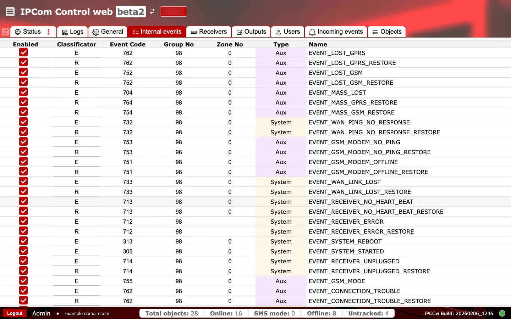

# Eventos internos

**Propósito:** Revisar y controlar eventos generados por el sistema y los códigos que se envían a los destinos descendentes.

## Cuándo usarlo

- Cuando necesite asignar eventos internos a códigos de CMS o automatización.
- Cuando necesite habilitar o suprimir eventos internos específicos.

## Secciones y por qué importan

### Lista de eventos internos {#internal-events-list}

Cada fila define cómo se representa una condición interna del sistema en los mensajes salientes. Aquí es donde se alinean los nombres de eventos internos con los códigos numéricos que espera la plataforma de supervisión.

### Columnas explicadas {#internal-events-columns}

- `Enabled`: si el evento está activo (marcado) o suprimido.
- `Classificator`: clasificador del evento (por ejemplo, `E` para evento, `R` para restore).
- `Event code`: código numérico enviado en la salida de eventos.
- `Group no` y `Zone no`: campos numéricos de enrutamiento usados por integraciones del receptor.
- `Type`: categoría como `System` o `Aux`.
- `Name`: identificador interno del evento (por ejemplo, `EVENT_SYSTEM_STARTED`).

Deshabilitar eventos o cambiar códigos afecta al enrutamiento descendente y a la interpretación de alarmas, por lo que los cambios deben coordinarse con la plataforma de supervisión.

### Comprobaciones y acciones operativas {#internal-events-operational-checks}

Use dos pasadas rápidas después de cualquier cambio: primero observe el comportamiento del evento en sistemas descendentes y luego confirme la integridad de las reglas en la tabla.

**Supervise esto en tiempo de ejecución:**

- Cambios inesperados en interruptores de habilitado/deshabilitado. Señal de alerta: las alarmas internas dejan de aparecer aguas abajo.
- Cambios inesperados en códigos de evento tras actualizaciones. Señal de alerta: el CMS empieza a decodificar incorrectamente los eventos internos.
- `Type` cambia entre `System` y `Aux` sin solicitud de cambio. Señal de alerta: clasificación descendente incorrecta.
- Reglas emparejadas `E` (evento) y `R` (restore) que dejan de coincidir. Señal de alerta: faltan eventos de restore.

**Confirme antes del uso en producción:**

- `classificator` es `E` (evento) o `R` (restore).
- `event_code`, `group_no` y `zone_no` están dentro de los rangos numéricos permitidos.
- `name` no está vacío.
- `type` es uno de los valores compatibles.
- La codificación está alineada con las reglas de análisis del CMS de su implementación antes de habilitarla.
