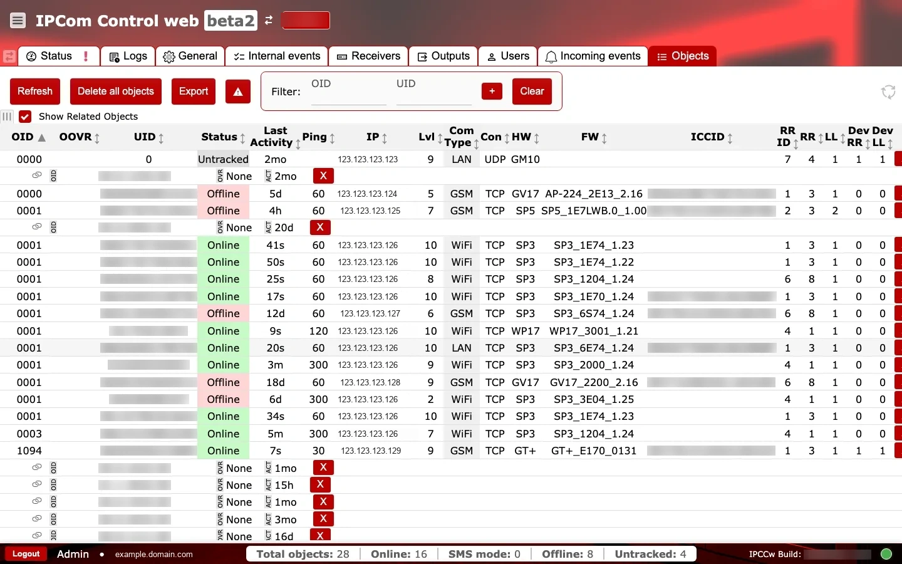

# Objetos

**Propósito:** Revisar y gestionar la lista de objetos rastreados (dispositivos), su estado y sus detalles de conexión.

## Cuándo usarlo

- Al buscar un dispositivo concreto o verificar su estado online.
- Al exportar listas de dispositivos o auditar problemas de conectividad.

## Secciones y por qué importan

### Acciones y filtros {#objects-actions-filters}

- `Refresh` recarga la lista para mostrar los estados más recientes de los dispositivos.
- `Delete all objects` elimina todos los objetos de la lista y solo debe usarse con aprobación explícita.
- `Export` descarga la lista para informes o análisis. [REVIEW]
- Los campos de filtro para `OID` y `UID` ayudan a reducir listas grandes, con `+` para aplicar y `Clear` para restablecer.
- `Show Related Objects` amplía la lista con entradas relacionadas.

### Tabla de lista de objetos {#objects-object-list}

Las columnas principales incluyen:

- Identificación: `OID`, `UID` e `ICCID` identifican el dispositivo y la SIM.
- Estado: `Status` y `Last Activity` muestran disponibilidad y la última hora informada.
- Conectividad: `Ping`, `IP`, `Lvl` (nivel de señal), `Com Type` (GSM/WiFi/LAN) y `Con` (TCP/UDP) muestran el estado del transporte.
- Versión del dispositivo: `HW` y `FW` ayudan a relacionar el comportamiento con niveles de firmware.
- Enrutamiento: `RR ID` (identificador de ruta), `RR` (valor de ruta del receptor) y `LL` (valor de línea) muestran el contexto de enrutamiento; `Dev RR` y `Dev LL` son valores de enrutamiento informados por el dispositivo.
- `OOVR` es un campo de supervisión del objeto. La semántica exacta sigue en [REVIEW].

Los indicadores rojos `X` en la columna `Ping` normalmente significan que no se registró ningún ping reciente.
Para ver definiciones completas de los campos, consulte `Glosario` en la navegación de IPcom.

### Comprobaciones y acciones operativas {#objects-operational-checks}

Use dos pasadas rápidas: primero supervise señales del estado de los objetos a lo largo del tiempo y luego confirme los valores de la tabla respecto al enrutamiento e inventario esperados.

**Supervise esto en tiempo de ejecución:**

- Acciones destructivas accidentales (`Delete all objects`) durante operaciones. Señal de alerta: inventario vacío repentinamente.
- Estado de filtro obsoleto. Señal de alerta: faltan dispositivos esperados en la vista actual.
- Divergencia entre `Status` y `Last Activity`. Señal de alerta: objeto reportado como online pero con marca de actividad obsoleta.
- `Ping` con `X` roja repetida en el mismo grupo de transporte. Señal de alerta: degradación del canal o de la ruta.
- Valores `OOVR` sin resolver que cambian alrededor de ventanas de incidentes. Señal de alerta: posible transición oculta del estado de supervisión. [REVIEW]

**Confirme antes del uso en producción:**

- `Refresh` se utiliza antes de capturas de triaje de incidentes.
- Los campos de enrutamiento (`RR ID`, `RR`, `LL`, `Dev RR`, `Dev LL`) coinciden con la asignación receptor/salida.
- Los campos de hardware y firmware (`HW`, `FW`) están presentes para los tipos de dispositivos gestionados esperados.
