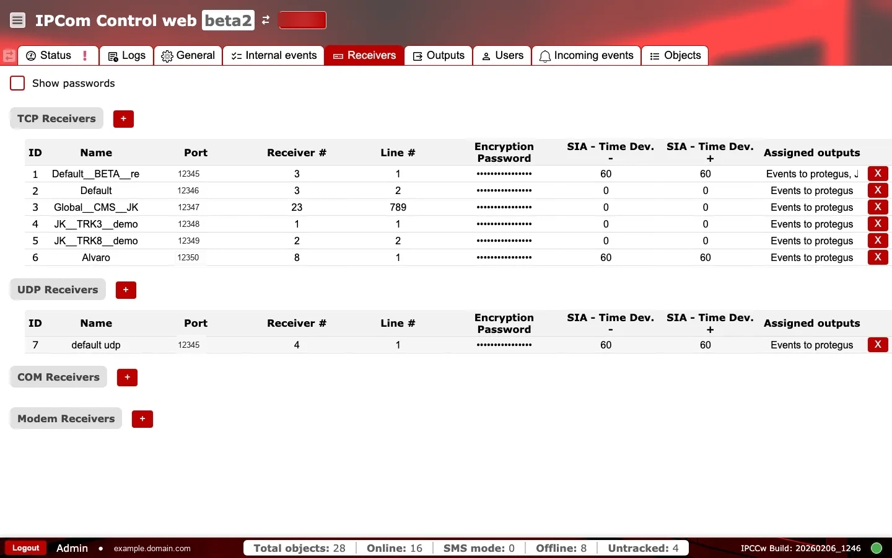
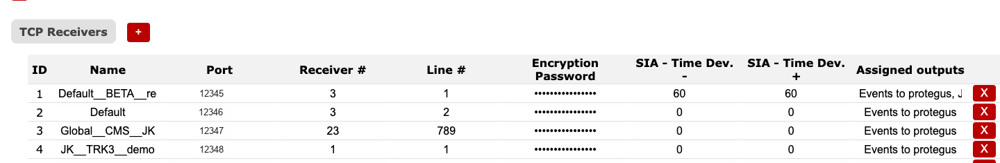
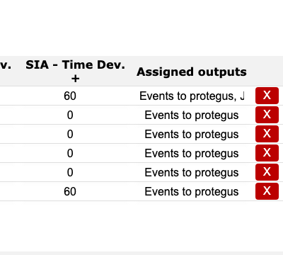

# Receptores

**Propósito:** Configurar endpoints de receptor (TCP, UDP, COM y módem) que aceptan tráfico entrante de dispositivos y definen parámetros de enrutamiento.

## Cuándo usarlo

- Al incorporar un nuevo endpoint de receptor o cambiar puertos de escucha.
- Cuando cambian identificadores de enrutamiento o ajustes de cifrado.

## Secciones y por qué importan

### Receptores TCP {#receivers-tcp}

Define endpoints TCP en escucha. `Port` controla dónde se conectan los dispositivos. `Receiver #` y `Line #` son identificadores de enrutamiento utilizados por los sistemas descendentes. `Encryption Password` protege el tráfico cifrado. Los campos `SIA - Time Dev.` definen los umbrales permitidos de desviación horaria para el protocolo SIA (negativa y positiva).

Mantenga una asignación coherente de receptor/línea con las salidas y las expectativas del CMS.

**Comprobaciones y acciones operativas:**

- Supervisar: caídas de ingesta activa tras un cambio de puerto. Señal de alerta: las sesiones caen a cero en `Estado`.
- Supervisar: reasignaciones de línea/receptor sin control de cambios en el CMS. Señal de alerta: eventos enrutados al tenant/partición incorrectos.
- Confirmar: los puertos TCP deben estar en `1..65535`.
- Confirmar: los puertos TCP deben ser únicos dentro del conjunto de receptores TCP.
- Confirmar: el `id` del receptor es único y mayor que `0`; el `name` del receptor no está vacío.
- Confirmar: la longitud de la contraseña de cifrado es exactamente de `6` o `16` caracteres.

### Receptores UDP {#receivers-udp}

Define endpoints UDP en escucha. Úselo cuando los dispositivos informen por UDP. El significado de los campos es equivalente al de los receptores TCP, con los mismos identificadores de enrutamiento.

**Comprobaciones y acciones operativas:**

- Supervisar: discrepancia de ingesta de paquetes UDP frente al protocolo esperado de la flota. Señal de alerta: dispositivos activos sin eventos.
- Confirmar: los puertos UDP deben estar en `1..65535`.
- Confirmar: los puertos UDP deben ser únicos dentro del conjunto de receptores UDP.

### Receptores COM {#receivers-com}

Define receptores serie (RS232/COM) para integraciones locales. Normalmente se utilizan cuando hardware o paneles legacy informan por enlaces serie.

**Comprobaciones y acciones operativas:**

- Supervisar: receptor COM habilitado sin conectividad serie física disponible. Señal de alerta: ausencia de eventos entrantes desde paneles serie.
- Confirmar: `port_id` del receptor COM hace referencia a un terminal COM existente.

### Receptores de módem {#receivers-modem}

Define receptores basados en módem para tráfico SMS o tipo dial-up. Úselo cuando los canales SMS o módem formen parte de la implementación.

**Comprobaciones y acciones operativas:**

- Supervisar: cambios continuos de ruta en receptores de módem durante ventanas de caída. Señal de alerta: eventos SMS ausentes o retrasados.
- Confirmar: `port_id` del receptor de módem hace referencia a un terminal COM existente.
- Confirmar: la longitud de la contraseña de cifrado del módem es de `6` o `16` caracteres.

### Salidas asignadas y eliminación {#receivers-assigned-outputs}

La columna `Assigned outputs` muestra qué salidas están vinculadas a cada receptor. La acción roja `X` elimina una entrada del receptor, así que úsela solo con aprobación explícita.

**Comprobaciones y acciones operativas:**

- Supervisar: receptores sin salidas asignadas. Señal de alerta: la ingesta funciona, pero no hay entrega descendente.
- Supervisar: acción accidental de eliminación (`X`) durante operación activa. Señal de alerta: desaparición repentina del receptor.
- Confirmar: cada receptor activo tiene al menos una asignación de salida prevista.

## Notas de red

- Las pestañas de receptor definen endpoints entrantes (dispositivo -> IPcom).
- Las pestañas de salida definen destinos salientes (IPcom -> CMS/automatización).
- Al cambiar puertos del receptor, actualice las reglas de firewall y NAT antes de conmutar tráfico en producción.
