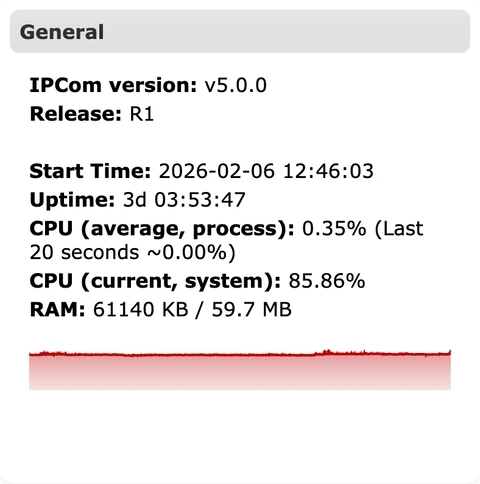
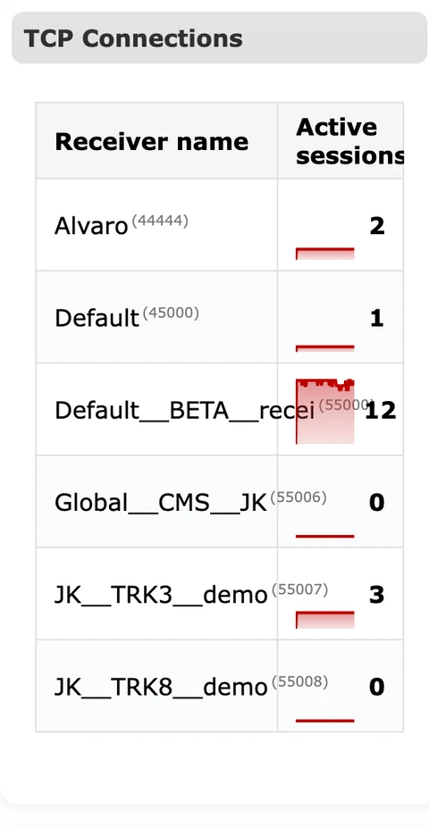
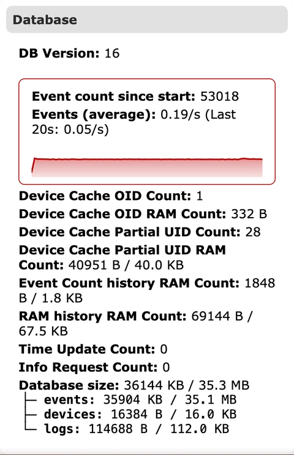

# Estado

**Propósito:** Proporcionar una visión operativa en tiempo real de la instancia IPcom seleccionada para que los operadores puedan confirmar de un vistazo el estado, el rendimiento y la conectividad.

## Cuándo usarlo

- Después de iniciar sesión para confirmar versión de la instancia, uptime y estado general.
- Al investigar problemas de entrega, acumulación de buffers o caídas de conexión.

## Secciones y por qué importan

### Pie de página

- `Bloque izquierdo` muestra el control de cierre de sesión, la identidad del usuario actual y el host conectado, y se usa para confirmar que se está operando en el entorno y la cuenta previstos.  
  
- `Bloque central` muestra contadores de supervisión (`Total objects`, `Online`, `SMS mode`, `Offline`, `Untracked`) para una validación rápida antes y después de cambios.  
  
- `Bloque derecho` muestra `IPCCw Build` y el indicador de conexión en vivo para validar la compilación en ejecución y el estado del transporte de la interfaz.  
  

### General

Muestra la versión y el release de IPcom, hora de inicio, uptime, uso de CPU y uso de RAM. Estas métricas ayudan a confirmar que el receptor ejecuta la compilación esperada y dispone de recursos suficientes para la carga actual. La línea de tendencia de CPU ayuda a detectar picos que pueden afectar a la latencia de procesamiento de eventos.

### API

Enumera el total de llamadas API por endpoint. Es un indicador rápido de cuánto están usando la API las integraciones externas o las acciones de la interfaz. Aumentos repentinos de llamadas `login` o `settings` pueden indicar actividad de automatización o polling mal configurado.

### Conexiones TCP

Muestra sesiones activas por receptor. Cada entrada de receptor representa un endpoint en escucha con conexiones activas de dispositivos. Una caída repentina a cero suele apuntar a problemas de red, firewall o del lado del receptor.

### Buffers de salida

Muestra tamaños de cola por destino para eventos y actualizaciones de estado. Los buffers crecen cuando IPcom no puede entregar mensajes con la suficiente rapidez. Un crecimiento persistente indica problemas de conectividad con el destino o ráfagas excesivas que requieren control de tasa.

### Rastreador de dispositivos

Resume recuentos de dispositivos por UID/OID, estado online u offline, uso del modo SMS y uso de memoria para el seguimiento. Esta sección ayuda a evaluar la salud de la flota y confirma que la supervisión de dispositivos funciona.

### Base de datos

Muestra la versión de la base de datos y estadísticas de eventos, incluido el recuento de eventos desde el inicio y la tasa media de eventos. La línea de tendencia ayuda a detectar caídas o incrementos de actividad. Los recuentos de caché y el uso de RAM dan pistas sobre limitaciones de retención o escalado.

### Estado del módem

Enumera el estado del receptor para tráfico basado en módem. Úselo cuando los canales SMS o módem formen parte de la implementación para verificar que el receptor de módem esté activo.

### Usuarios conectados

Muestra las sesiones autenticadas actualmente en la interfaz y la IP/puerto de origen. Es útil para identificar sesiones administrativas concurrentes y detectar accesos inesperados durante la respuesta a incidentes.

## Tendencias y gráficos

Los pequeños gráficos rojos de tendencia bajo CPU y estadísticas de eventos muestran cambios recientes de actividad. Úselos para identificar picos o caídas que puedan requerir una investigación más profunda en registros o eventos entrantes.

## Runbook de operaciones {#status-operations-runbook}

- `El buffer de salida sigue aumentando`: compruebe la accesibilidad del destino, la compatibilidad del protocolo y las credenciales de salida en `Salidas`.
- `Las sesiones activas bajan a 0`: verifique puertos de listener y reglas de firewall en `Receptores`, y luego inspeccione las rutas de red desde los dispositivos.
- `La media de eventos cae repentinamente`: confirme la conectividad de dispositivos en `Objetos` y revise errores recientes en `Registros`.
- `Picos de CPU o RAM`: revise cambios recientes de configuración, reduzca tráfico ruidoso y valide ajustes de retención en `General`.

### Comprobaciones y acciones operativas {#status-operational-checks}

Use dos pasadas rápidas para la supervisión rutinaria: primero observe señales de salud en vivo y luego confirme el estado de la sesión y de la interfaz antes de escalar.

**Supervise esto en tiempo de ejecución:**

- `CPU (current/system)` y `RAM`. Señal de alerta: uso elevado sostenido con respuesta más lenta de la interfaz/API.
- `Active sessions` por receptor. Señal de alerta: caída brusca a cero en receptores activos.
- Tendencias de `Output buffer`. Señal de alerta: crecimiento continuo en lugar de vaciarse.
- Contadores `Online` / `Offline` / `Untracked`. Señal de alerta: crecimiento repentino de offline tras cambios de red/configuración.
- Tendencia de `Events (average)`. Señal de alerta: caída o pico inesperados no explicados por la planificación.
- Toasts de error repetidos durante acciones rutinarias. Señal de alerta: problemas de procesamiento o sincronización de estado.

**Confirme antes del uso en producción:**

- El texto de los mensajes toast coincide con la acción que acaba de ejecutarse.
- La identidad del entorno en el pie (`user`, `host`, `build`) coincide con la instancia prevista.
