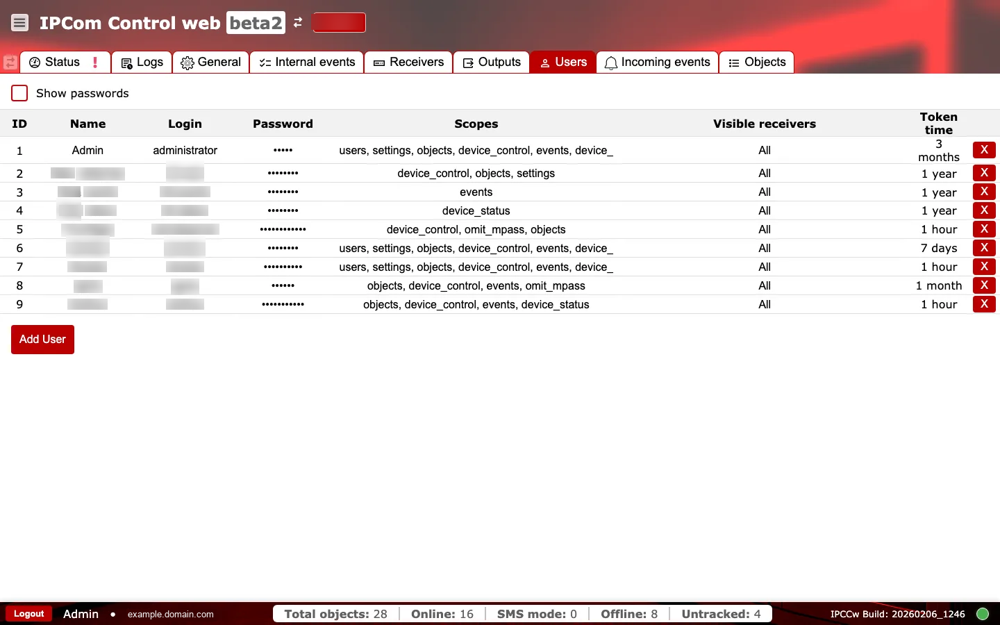
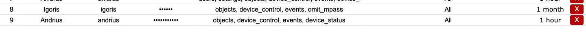
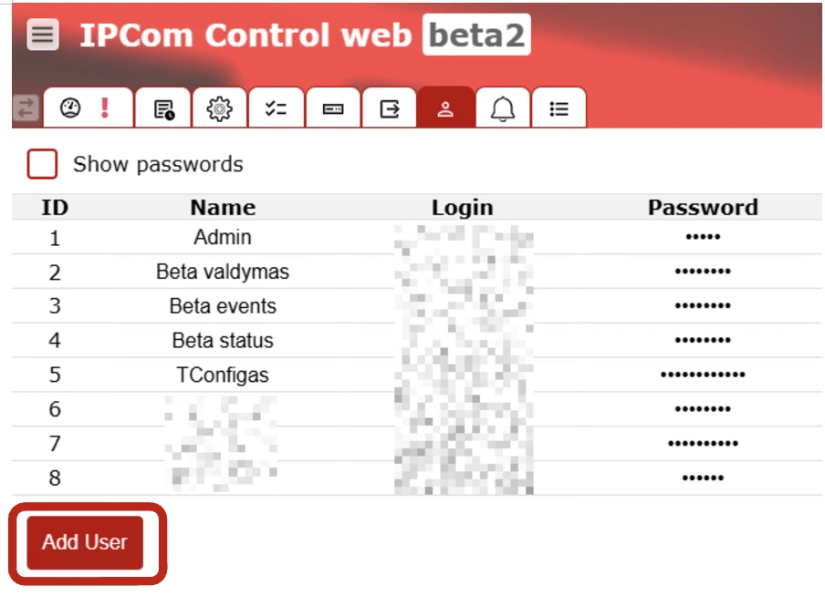
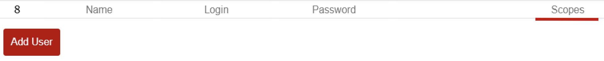
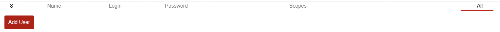
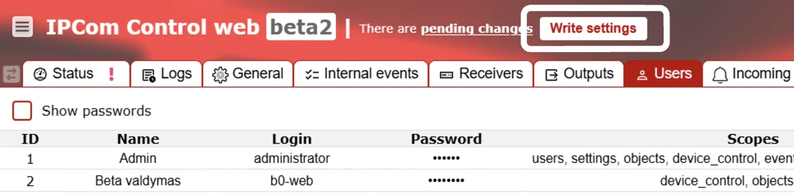
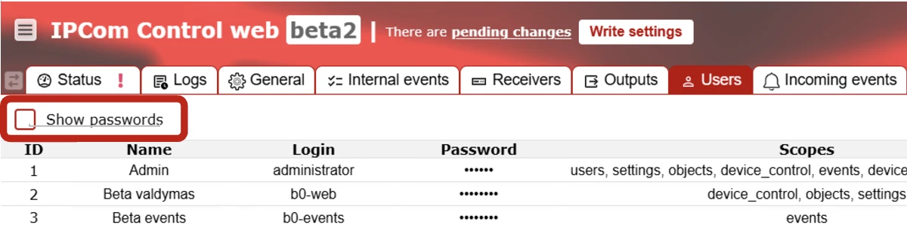
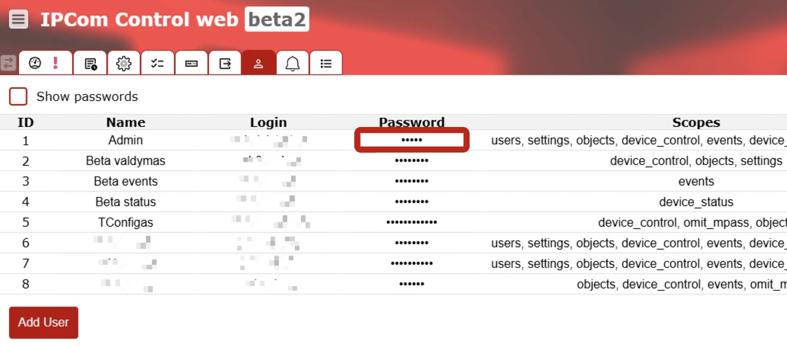

# Usuarios

**Propósito:** Gestionar cuentas de usuario, permisos y visibilidad de receptores.

## Cuándo usarlo

- Al añadir o eliminar operadores.
- Al actualizar permisos o visibilidad de receptores por motivos de seguridad.

## Secciones y por qué importan

### Tabla de usuarios {#users-table}

Cada fila representa una cuenta de usuario.

- `ID`, `Name`, `Login`: campos de identidad utilizados en auditorías y en el inicio de sesión.
- `Password`: oculto por defecto.
- `Scopes`: permisos concedidos al usuario (por ejemplo, configuración, eventos, objetos). Limite los permisos para reducir el riesgo.
- `Visible receivers`: instancias de receptor a las que el usuario puede acceder.
- `Token time`: periodo de validez del token, que afecta a la duración de la sesión y a la postura de seguridad.

### Añadir usuario y eliminación {#users-add-remove}

Use `Add User` para crear una nueva cuenta. La acción roja `X` elimina un usuario y debe usarse con aprobación explícita.

### Comprobaciones y acciones operativas {#users-operational-checks}

Use dos pasadas rápidas al cambiar cuentas: primero supervise señales activas de riesgo y luego confirme la alineación con la política antes de entregar el acceso.

**Supervise esto en tiempo de ejecución:**

- Ampliación de permisos para cuentas existentes. Señal de alerta: los usuarios obtienen privilegios de configuración/control fuera de su rol.
- `Token time` demasiado largo en cuentas privilegiadas. Señal de alerta: sesiones elevadas persistentes.
- Eliminaciones de usuarios durante ventanas de respuesta activa. Señal de alerta: pérdida repentina de acceso para operadores de guardia.

**Confirme antes del uso en producción:**

- Los permisos permitidos son solo `users`, `settings`, `objects`, `device_control`, `events`, `omit_mpass`, `restart_services`, `turnoff_receiver`, `license`.
- `token_time` está en el rango `1..5,256,000` minutos.
- `id` es único y mayor que `0`; `login` y `password` no están vacíos.
- Si `visible_receivers.all = false`, la lista personalizada de receptores no está vacía.
- El inicio de sesión de la nueva cuenta y el comportamiento esperado de los permisos se verifican antes de entregar credenciales.
- El número de usuarios se mantiene dentro del límite de la licencia.

## Procedimientos comunes

### Crear un nuevo usuario

1. Abra la pestaña `Usuarios` y seleccione `Add User`.
   
2. Rellene los campos de identidad de la cuenta (`Name`, `Login`, contraseña).
   
3. Asigne los `Scopes` mínimos necesarios para el rol.
   
   
4. Configure `Visible receivers` solo para las instancias necesarias.
   
   
5. Configure `Token time` según la política de seguridad.
   
   
6. Guarde la configuración y valide el inicio de sesión con la nueva cuenta.
   

### Cambiar la contraseña de un usuario

1. Localice la cuenta objetivo en la tabla `Usuarios`.
2. Habilite la visibilidad de la contraseña solo si es necesario para una verificación controlada.
   
3. Actualice la contraseña de la cuenta y guarde.
   
4. Confirme que el usuario puede autenticarse con la nueva contraseña.
5. Desactive la visibilidad de la contraseña después de la verificación.

## Lista de endurecimiento

- Mantenga `administrator` solo para uso de emergencia; utilice cuentas nominativas para el trabajo diario.
- Asigne `Scopes` de privilegio mínimo por rol (supervisión, operaciones, administrador de integración).
- Restrinja `Visible receivers` para que los usuarios solo vean las instancias necesarias.
- Configure un `Token time` más corto para usuarios con privilegios altos y rote las credenciales con regularidad.
- Elimine cuentas obsoletas y verifique propietario/rol a intervalos programados.
