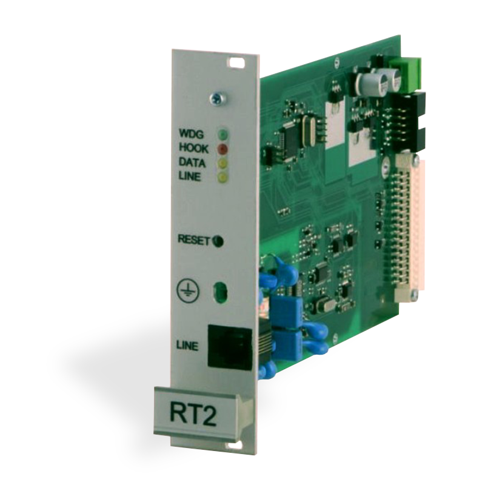

# Módulo de Recepción por Línea Telefónica RT2

  

El módulo de recepción se utiliza como componente del receptor multicanal RM10 y RD10 y está diseñado para la recepción de datos enviados a través de líneas telefónicas.

El intercambio de datos se realiza mediante los siguientes protocolos:

- Contact ID
- Ademco Express 4+2
- SIA FSK
- Protocolos Pulse 3/1, 4/1, 4/2

## Descripción de los principios de funcionamiento y características principales

El módulo de recepción RT2 es un dispositivo que proporciona la recepción de informes procedentes del comunicador telefónico de la central de alarma. La información se procesa (siempre que la comunicación se realice según los protocolos seleccionados) y se transfiere al concentrador del receptor multicanal.

El microcontrolador realiza el procesamiento de las señales. Reconoce los datos transmitidos y genera mensajes de estructura predefinida que, a través del puerto serie, se transfieren al concentrador del receptor multicanal RD10 o RM10.

El módulo de recepción RT2 no dispone de filtros de programación.

## Especificaciones técnicas

1. El módulo de recepción RT2 proporciona la recepción de datos desde la central de alarma hacia la central receptora centralizada a través de líneas telefónicas. El tipo de línea telefónica puede ser tonal o de pulsos.

2. El módulo de recepción RT2 opera con líneas con tensión de funcionamiento de hasta 65 V y soporta tensión de llamada alterna de hasta 250 V.

3. El módulo de recepción RT2 recibe mensajes transmitidos a través de líneas telefónicas mediante los siguientes protocolos:

   - Contact ID según la norma SIA DC-05-1999.09
   - Ademco Express 4+2
   - Formato SIA según la norma SIA DC-03-1990.01 niveles 1.º y parcialmente 2.º
   - Protocolos Pulse 3/1, 4/1, 4/2, que operan a velocidades de 10...40 baudios y con señales HSK y kissoff de 1400 Hz o 2300 Hz

4. El módulo de recepción RT2 debe montarse en el receptor multicanal RM10 o en el receptor RD10 y se alimenta con su tensión de 12,6 V. La variación de tensión admisible es de 11 a 15 V. La corriente no supera los 150 mA.

5. El módulo de recepción opera en el rango de temperatura de -10 °C a +55 °C con humedad relativa de hasta el 90 % a +20 °C.

6. Las dimensiones generales del módulo no superan 190 x 130 x 30 mm.

## Indicadores LED

El módulo de recepción RT2 dispone de cuatro LEDs en el panel frontal:

| LED | Color | Indicación |
|-----|-------|------------|
| 1 | Amarillo | Control de línea — encendido de forma continua cuando la línea telefónica funciona correctamente |
| 2 | Rojo | Descolgado del auricular — encendido de forma continua si el auricular está descolgado |
| 3 | Amarillo | Recepción de datos — parpadea durante la recepción de datos del dispositivo periférico |
| 4 | Verde | Alimentación / funcionamiento — parpadea en intervalos cortos cuando la tensión de alimentación está presente y el procesador está en funcionamiento |

## Conectores

| N.º | Conector |
|-----|----------|
| 5 | Botón RESET del dispositivo |
| 6 | Conector para dispositivo periférico |
| 7 | Conector de alimentación |
| 8 | Conector de programación |
| 9 | Conector para el concentrador |

## Preparación para la puesta en marcha

El módulo de recepción RT2 debe entregarse al usuario configurado para recibir informes del comunicador de la central de alarma:

- primero, mediante el protocolo en formato SIA
- segundo, mediante los formatos Contact ID o Ademco Express
- tercero, protocolos de pulsos 3/1, 4/1, 4/2 que utilizan señales HSK de 2300 Hz
- cuarto, protocolos de pulsos 3/1, 4/1, 4/2 que utilizan señales HSK de 1400 Hz

Los parámetros de explotación del módulo están disponibles en la tabla siguiente.

Pasos de preparación para la puesta en marcha:

1. Desembalar el módulo.
2. Especificar y, si es necesario, configurar los parámetros de explotación necesarios del módulo.
3. Retirar la tapa decorativa del panel trasero del receptor multicanal e instalar el módulo de recepción.
4. Pulsar el botón RESET.
5. Conectar el dispositivo periférico.

El módulo de recepción genera mensajes de servicio indicados en el Anexo A.

Los mensajes recibidos se muestran en el monitor del receptor multicanal y se transfieren al programa de monitorización centralizada.

## Parámetros de explotación

**Tabla 1. Parámetros de explotación del módulo de recepción RT2**

| Título | Rango permisible | Valor configurado |
|--------|-----------------|------------------|
| Número de llamadas antes de que el módulo descuelgue | 1 – 8 | 2 |
| Control de línea telefónica activado/desactivado | habilitar / deshabilitar | habilitar |
| Tiempo desde el descuelgue hasta el inicio de la señal HSK | 500 ms – 4000 ms | 2000 |
| Duración de las señales Kissoff (y confirmación) | 500 ms – 8000 ms | 900 |
| Período de tiempo entre señales HSK | 1 s – 16 s | 4 |
| Duración máxima permitida de la recepción de mensajes | 2 s – 16 s | 2 |
| Duración del HSK SIA | 500 ms – 2000 ms | 900 |
| Límite de tiempo total para una sola sesión de comunicación | 15 s – 255 s | 60 s |
| Límite de tiempo para la recepción de bloques SIA | 1 – 32 s | 8 s |
| Orden HSK — SIA FSK HSK | SIA FSK HSK | SIA FSK HSK |
| Orden HSK — HSK de tono dual (1400+2300 Hz) | HSK de tono dual (1400+2300 Hz) | HSK de tono dual (1400+2300 Hz) |
| Orden HSK — Pulse 3/1, 4/1, 4/2 con 2300 Hz | 3/1, 4/1, 4/2 | 2300 Hz |
| Orden HSK — Pulse 3/1, 4/1, 4/2 con 1400 Hz | 3/1, 4/1, 4/2 | 1400 Hz |

## Indicación del mensaje recibido

Vista del mensaje de servicio generado por el módulo RT2 y mostrado en el monitor LCD del receptor multicanal RD10 (o RM10):

**`40-5 MODULE RESET`**

Donde:

- `40` — Tipo de módulo de recepción (RT2 tipo 40)
- `5` — Número de canal (línea)
- `MODULE RESET` — mensaje de servicio

Vista del mensaje de evento:

**`04-1 12:38:15 7678 E130 01 001`**

Donde:

- `40` — Tipo de módulo de recepción (RT2 tipo 40)
- `1` — Número de canal (línea)
- `12:38:15` — Hora de recepción
- `7678` — Número de cuenta
- `E130` — Código de evento
- `01` — Número de subgrupo
- `001` — Lugar del evento o número del código de usuario

## Configuración de los parámetros de explotación

Los parámetros de explotación del módulo RT2 deben configurarse mediante el dispositivo de programación SPROG-1 y la aplicación de configuración de parámetros de explotación GProg2.

Mediante el cable de programación, conecte el puerto de programación del módulo RT2 con el dispositivo de programación SPROG-1 y active la aplicación GProg2.

1. Vaya a *Setup → Serial port*; se mostrará la ventana del puerto serie. Configure el número del puerto de comunicación al que está conectado el dispositivo.
2. Seleccione el dispositivo programable *Devices → RI4010 → RT2* y lea sus parámetros de explotación pulsando el botón [Read].
3. Cuando el módulo opere como componente del receptor multicanal, configure el protocolo Surgard.
4. Si es necesario, los parámetros pueden modificarse. Introduzca los parámetros modificados pulsando el botón [Write].

## Anexo A — Mensajes de servicio

Mensajes de servicio del módulo de recepción de comunicación telefónica RT2:

| Mensaje | Código | Descripción |
|---------|--------|-------------|
| COM TROUBLE | 05 | Fallo de comunicación entre el dispositivo y el concentrador |
| COM RESTORE | 06 | Comunicación con el concentrador restaurada |
| TEL LINE ERROR | 20 | Fallo o desconexión de la línea telefónica |
| TEL LINE OK | 30 | Línea telefónica restaurada |
| MODULE DISCONNECT | C0 | Dispositivo desconectado |
| MODULE CONNECT | C1 | Dispositivo conectado |
| RT2 RESET | D0 | Botón RESET del módulo RT2 pulsado |
