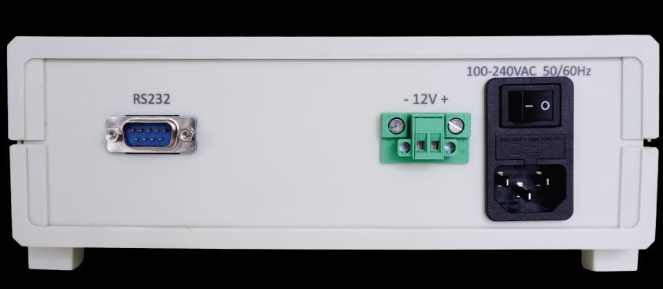
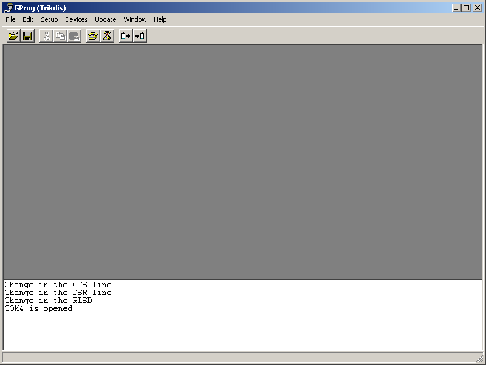
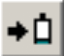
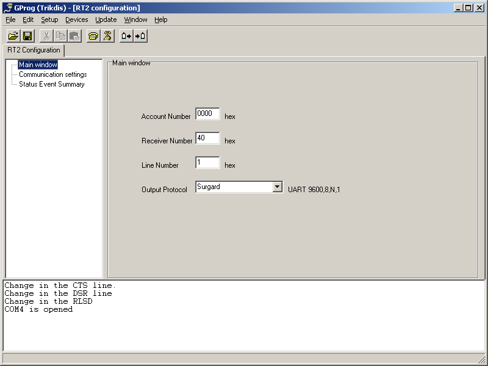
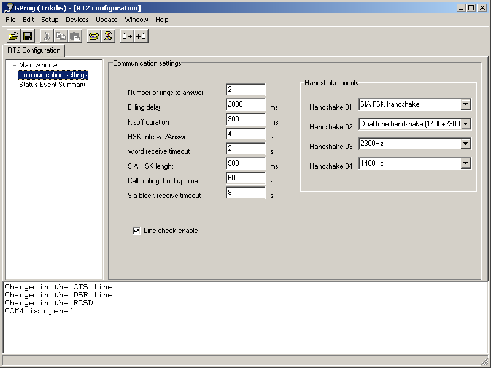
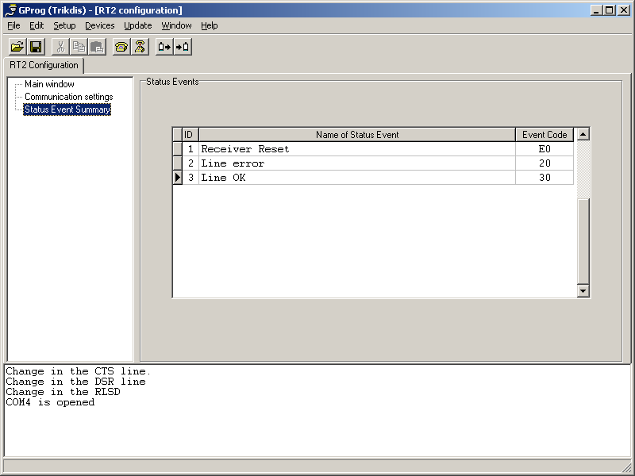

# RTH2 Receptor de Línea Telefónica

  

## Sobre el receptor de línea telefónica

**El receptor de línea telefónica RTH2** recibe los informes de eventos de los comunicadores telefónicos del panel de control de seguridad. Los eventos recibidos se procesan y se transfieren al software de monitoreo.

!!! note
    Configuramos el receptor con los ajustes predefinidos a petición del cliente.

## Parámetros técnicos

| Nombre | Descripción |
|--------|-------------|
| Canal de comunicación | Líneas telefónicas - tonales o pulso |
| Formatos de recepción | Contact ID, SIA, Ademco Express 4+2 y otros |
| Fuente de alimentación primaria | 100 – 240 V (50 /​ 60 Hz) red de CA |
| Puertos de salida de datos RS232 | 1 x DB9 |
| Temperatura de funcionamiento | Desde 0°C, a +55°C |
| Dimensiones | 225 x 235 x 115 mm |
| Peso | 1.21kg, con cables |

### Tecnología de recepción de informes

| Nombre | Descripción |
|--------|-------------|
| Formato protocolo SIA | Standard SIA DC-03-1990.01 |
| Contact ID | Standard SIA DC-05-1999.09 |
| Formatos Ademco Express 4+2 | Standard SIA DC-05-1999.09, formato 4+2 con suma de comprobación – código de cuenta de 4 dígitos, código de eventos de 2 dígitos, suma de comprobación de 1 dígito |
| Protocolos de pulso 3/​1, 4/​1, 4/​2, que utilizan señales de 2300 Hz HSK | Funcionamiento a la velocidad de 10 ... 40 baudios y mediante el uso de señales de 2300 Hz HSK y kissoff |
| Protocolos de pulso 3/​1, 4/​1, 4/​2, que utilizan señales de 1400 Hz HSK | Funcionamiento a la velocidad de 10 ... 40 baudios y mediante el uso de señales de 1400 Hz HSK y kissoff |

## Conjunto del Receptor

| Elemento | Cantidad |
|----------|----------|
| Receptor | 1 pc. |
| Cable Fuente de alimentación de 1.5 m | 1 pc. |
| Cable Módem nulo de 1.8 m RS232 | 1 pc. |

!!! note
    Cables *SPROG-1 o UP2* para la programación del receptor no incluidos.

## Fuente de Alimentación

El receptor se alimenta con fuente de corriente alterna (CA). Para asegurar un funcionamiento ininterrumpido, el receptor debe conectarse a una batería de 12 V, 7Ah, proporcionando alimentación de reserva durante 12 horas.

## Estructura del Receptor

### Vista frontal

| No. | Elemento |
|-----|----------|
| 1 | Indicación luminosa (LEDs WDG, HOOK, DATA, LINE) |
| 2 | Botón de REINICIO del dispositivo |
| 3 | Toma de tierra |
| 4 | Conector de entrada de la línea telefónica |

### Vista trasera

| No. | Elemento |
|-----|----------|
| 5 | Puerto de salida de datos RS232 |
| 6 | Conector de la batería de reserva (-12V+) |
| 7 | Conector de cable de CA (100-240VAC 50/60Hz) y botón de encendido/apagado |

### Indicación luminosa

| *Indicador LED* | Funcionamiento | Significado |
|:---|:---|:---|
| “LINE” amarillo / Funcionamiento línea telefónica | Apagado (Off) | Línea telefónica no conectada o no disponible |
| “HOOK” rojo Levantamiento de auriculares | Se ilumina | Se levanta el auricular |
| **“DATA” amarillo** / Recepción de datos | Amarillo intermitente | Durante la recepción de datos desde un dispositivo periférico |
| **“WDG” verde** / **Estado de la Fuente de alimentación** | Parpadea en períodos cortos | Tensión de alimentación durante el modo de espera y funcionamiento |

## Instalación del sistema

### Pasos de instalación del equipo

!!! note
    1) Los cables SPROG-1 o UP2 para la programación del receptor no se incluyen con el receptor.
    2) Para configurar los parámetros que necesita para instalar el software GProg2. Para descargar el archivo de instalación de GProg2, vaya a [www.trikdis.com](http://www.trikdis.com/)

1. Si el dispositivo recibido no tiene parámetros de uso predefinidos, configúrelos como se describe en **Ajuste de los parámetros de uso** a continuación.
2. Conecte el receptor al ordenador usando el cable RS232 para reenviar eventos al software de monitoreo.
3. Configure su software de monitoreo para mostrar los mensajes del receptor. Siga las instrucciones de la documentación del software de monitoreo.
4. Conecte el cable de alimentación de CA.
5. Encienda el receptor. El receptor está funcionando correctamente cuando el LED llamado *"WDG"* está parpadeando.
6. Presione el botón RESET (REINICIO).
7. Compruebe si su software de monitoreo está mostrando los mensajes del receptor RTH2.

Si no se recibe nada: compruebe el LED "Line" — debe ser amarillo. Si no lo es, vuelva a comprobar las conexiones. Si el problema persiste, asegúrese de que los parámetros de uso están configurados correctamente o contacte con el soporte técnico.

!!! note
    El módulo de recepción integrado genera los mensajes de servicio, indicados en el Anexo A.

## Ajuste de los parámetros de uso

### Parámetros de uso del receptor

| Título | Rango permitido | Valor ajustado |
|--------|-----------------|----------------|
| Número de timbres hasta que el teléfono del módulo se levante | 1 – 8 | 2 |
| Control línea telefónica on/off | Habilitado/deshabilitado | Habilitado |
| Tiempo desde la elevación del teléfono hasta el inicio de la señal FSK | 500 ms – 4000 ms | 2000 |
| Duración señales Kissoff (y confirmación) | 500 ms – 8000 ms | 900 |
| Periodo de tiempo entre señales HSK | 1 s – 16 s | 4 |
| Duración permitida de la recepción de mensajes | 2 s – 16 s | 2 |
| Duración SIA HSK | 500 ms – 2000 ms | 900 |
| Límite de tiempo usual para una única sesión de comunicación | 15 s – 255 s | 60 s |
| Protocolo de salida | Surgard o Radionics D6600 | Surgard |
| Límite de tiempo para la recepción de paquetes SIA | 1 – 32 s | 8 s |
| Orden HSK (prioridad de protocolos de recepción) — SIA FSK HSK | SIA FSK HSK | SIA FSK HSK |
| Orden HSK — Tono dual HSK (1400+2300 Hz) | Tono dual HSK (1400+2300 Hz) | Tono dual HSK (1400+2300 Hz) |
| Orden HSK — Impulso 3/1, 4/1, 4/2 con 2300 Hz | 3/1, 4/1, 4/2 | 2300 Hz |
| Orden HSK — Impulso 3/1, 4/1, 4/2 con 1400 Hz | 3/1, 4/1, 4/2 | 1400 Hz |

### Configuración de los parámetros de uso del RTH2 con GProg2

Los parámetros del receptor se pueden configurar mediante el programador *SPROG-1* o *UP2* con el software GProg2. También puede necesitar instalar el controlador USB. GProg2 y los controladores USB están disponibles en nuestro sitio web [www.trikdis.lt](http://www.trikdis.lt).

!!! note
    El software GProg2 debe instalarse en un PC con sistema operativo MS *Windows* 2000/XP/Vista/Win 7.

#### Conexión al ordenador.

1. Abra la caja del RTH2 y extraiga el módulo (no olvide desconectar la batería de reserva).
2. Conecte el módulo a la fuente de alimentación.
3. Conecte el módulo a un ordenador con el programador *SPROG-1* o *UP2*.

#### Instalación del controlador USB.

Los controladores USB deben estar instalados en el ordenador. Cuando el módulo se conecta a un ordenador por primera vez, el sistema operativo MS Windows debe abrir la ventana *Asistente para nuevo hardware encontrado* para instalar los controladores USB.

4. Descargue el archivo del controlador USB *\*.inf* para MS Windows OS desde el sitio web www.trikdis.lt.
5. En la ventana del asistente, seleccione la función [*Sí, sólo esta vez*] y pulse el botón [*Siguiente*].
6. Cuando se abra la ventana *Por favor elija su búsqueda y abra las opciones de instalación*, pulse el botón [*Examinar*] y seleccione el lugar donde se guardó el archivo *\*.inf*.
7. Siga las restantes instrucciones del asistente para finalizar la instalación del controlador USB.

#### Inicio de GProg2

8. Inicie el programa haciendo clic en el icono GProg2 , a continuación, en la ventana Configuración, especifique el puerto serie (por ejemplo: COM3).
9. En la barra de menús, seleccione el comando [*Dispositivos*] y seleccione RT2.
10. Pulse el  icono en la barra de herramientas para conectar el receptor.
11. Para leer los parámetros de funcionamiento almacenados en la memoria interna del dispositivo, pulse el  botón. Cuando haya finalizado la descarga de datos, aparecerá la ventana *Configuración recibida*.
12. Aparecerá la ventana *Configuración recibida*.

#### Descripción de los iconos de la barra de herramientas

| Icono | Función |
|-------|---------|
|  **[Abrir]** | Abrir el archivo guardado con la extensión ".tcfg" |
|  **[Guardar]** | Guardar el archivo con los parámetros establecidos con la extensión ".tcfg" |
|  **[Conectar]** | Conectar al puerto serie |
|  **[Desconectar]** | Desconectar del puerto serie |
|  **[Config de recepción]** | Leer los parámetros del dispositivo |
|  **[Config de envío]** | Escribir los nuevos parámetros en la memoria del dispositivo |
|  **[Generar informe de configuración]** | Imprimir el informe de los parámetros establecidos |

#### Ajuste de los parámetros

13. En la sección *Ventana principal*, establezca el protocolo Surgard.
14. Si es necesario, puede cambiar los parámetros en la sección *Configuración de comunicación*; los valores recomendados se muestran en **Parámetros de uso del receptor** arriba.
15. Para guardar los parámetros, vaya a [*File/Write device*] en la barra de menús o presione el  icono.
16. Para guardar los parámetros en su ordenador, vaya a [*File/Save as*]. El nombre del archivo y la ubicación se pueden elegir libremente. Se puede utilizar más tarde como plantilla para configurar otros módulos.

## Anexo A — Mensajes de servicio

Mensajes de servicio del receptor de comunicación telefónica:

| Mensaje | Código | Descripción |
|---------|--------|-------------|
| COM TROUBLE | 05 | Fallo de comunicación entre el dispositivo y el concentrador |
| COM RESTORE | 06 | Comunicación con el concentrador restaurada |
| TEL LINE ERROR | 20 | Fallo o desconexión de la línea telefónica |
| TEL LINE OK | 30 | Línea telefónica restaurada |
| MODULE DISCONNECT | C0 | Dispositivo desconectado |
| MODULE CONNECT | C1 | Dispositivo conectado |
