# Receptores de Radio R11 / R11U

<div style="text-align: center;">
  
</div>

Los receptores de radio R11 y R11U se utilizan como componentes del sistema de protección por radio RAS-3 y están diseñados para la recepción y decodificación de mensajes codificados enviados por canal de radiocomunicación en la banda VHF (R11) o UHF (R11U). Las señales enviadas mediante el sistema de codificación RAS-3 son recibidas y decodificadas por los receptores.

## Funcionamiento y características principales

El receptor R11 (R11U) es un superheterodino de doble conversión con identificación digital de la señal recibida. La señal recibida e identificada se procesa y transmite a la salida.

El procesamiento de las señales recibidas lo realiza un microcontrolador. Éste identifica la señal enviada y genera un mensaje de forma y estructura predefinidas. El mensaje se filtra y transmite mediante atributos configurados a través del puerto serie hacia el software de monitorización o hacia otros módulos de transmisión compatibles. El receptor incluye filtros que permiten filtrar mensajes en función de:

- subsistemas del sistema de codificación;
- ruta de comunicación;
- secuencia de números de abonado;
- tiempo de recurrencia de los mismos mensajes.

El receptor mide el nivel de la señal recibida, registra la ruta de comunicación y muestra todo lo anterior en la señal de salida.

El receptor genera y transmite mensajes de servicio a las salidas. Dichos mensajes pueden visualizarse en el software de monitorización o transmitirse por canal de comunicación.

El receptor incluye el puerto serie RS232 a través del cual la información recibida por el puerto puede transmitirse por canal de radio.

## Especificaciones técnicas

1. El receptor de radio R11 opera en la banda VHF de 146 a 174 MHz.
2. El receptor de radio R11U opera en la banda UHF de 430 a 470 MHz.
3. Los parámetros radiotécnicos del receptor cumplen los requisitos establecidos en la norma EN 300 113.
4. La sensibilidad de los receptores R11 y R11U no es inferior a 1 μV, con un número de mensajes correctamente recibidos del 80%. El resto de parámetros radiotécnicos se especifican en la Tabla 1.
5. El receptor mide la intensidad de la señal recibida y la clasifica en un nivel determinado. La correspondencia entre nivel y señal se especifica en la Tabla 2.
6. Los mensajes recibidos se transmiten por el puerto serie RS232 al software de monitorización o por el bus MCI a los dispositivos de transmisión compatibles. Los mensajes de salida indicados en el Anexo A se envían al software de monitorización. La capacidad del búfer de mensajes no enviados es de hasta 300 últimos mensajes. Los parámetros de intercambio de datos se configuran durante la parametrización del receptor.
7. El receptor dispone de dos entradas destinadas al envío independiente de mensajes. Tipo de entradas NC/NO/EOL=2,2 kΩ.
8. Los receptores R11 y R11U se alimentan con 12,6 V CC. Los límites de variación de tensión admisibles son de 11 a 15 V. La corriente aplicada no debe superar los 150 mA.
9. Los receptores funcionan a temperatura ambiente de -10 °C a +55 °C y humedad relativa del aire de hasta el 90 % a +20 °C.
10. Las dimensiones generales del módulo receptor no superan 200 x 110 x 38 mm.
11. El peso del receptor es de hasta 0,2 kg.

**Tabla 1.**

| Parámetro | Valor |
|-----------|-------|
| Modulación | frecuencia de banda estrecha |
| Desviación máxima | ±3 kHz |
| Impedancia de entrada del receptor | 50 Ω |
| Separación de canales de comunicación | 12,5 kHz |
| Error de ajuste de frecuencia de operación máximo | ±200 Hz |
| Selectividad de canal adyacente mínima | 60 dB |
| Selectividad de canal imagen mínima | 70 dB |
| Velocidad de transmisión de datos por canal de radio | 2,4 kb/s |

**Tabla 2.**

| Nivel | Tensión de entrada μV | Intensidad de señal, dBm | Nivel | Tensión de entrada μV | Intensidad de señal, dBm |
|-------|----------------------|--------------------------|-------|----------------------|--------------------------|
| 0 | 1 | -107 | 8 | 40 | -75 |
| 1 | 1,585 | -103 | 9 | 63 | -71 |
| 2 | 2,5 | -99 | A | 100 | -67 |
| 3 | 4 | -95 | B | 158 | -63 |
| 4 | 6,3 | -91 | C | 250 | -59 |
| 5 | 10 | -87 | D | 400 | -55 |
| 6 | 16,85 | -83 | E | 630 | -51 |
| 7 | 25 | -79 | F | 1000 | -47 |

> [!NOTE]
> ¡Estos niveles difieren de la tabla de niveles del sistema RAS-2M!

## Vista general y esquema de conexión

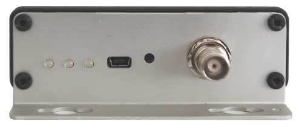

| Elemento | Descripción |
|---------|-------------|
| Indicadores luminosos de funcionamiento | LEDs de estado en el panel frontal |
| Puerto de antena | Conector de antena RF |
| Puerto de salida RS232 | Salida de datos serie |
| Bus MCI | Conector del bus MCI |

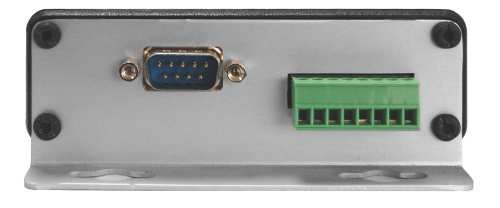

El puerto USB y el botón RESET se encuentran en el panel trasero. \* La designación de los terminales de contacto del bus MCI se indica en la Tabla 3.

**Tabla 3.**

| Terminal | Función |
|----------|---------|
| PGM2 | Reservado para uso futuro |
| PGM1 | Reservado para uso futuro |
| IN2 | 2.ª entrada (fallo de alimentación AC) |
| IN1 | 1.ª entrada (tamper) |
| GND | Conductor general |
| MCI | Bus MCI |
| GND | Conductor general para conexión de alimentación |
| +E | Para conexión de la tensión de alimentación +12,6 V |

## Indicación luminosa

El funcionamiento del receptor se indica mediante señalización luminosa. El funcionamiento de los indicadores luminosos se especifica en la Tabla 4.


**Tabla 4.**

| Indicador | Funcionamiento | Descripción |
|-----------|---------------|-------------|
| «Network» | Parpadeo verde | Recepción de mensajes por canal de radio |
| «Network» | Luz amarilla fija | Se ha superado el nivel de fondo del canal de comunicación |
| «Data» | Luz verde fija | Aún hay mensajes no enviados pendientes |
| «Data» | Luz verde y roja simultáneamente | El búfer de salida está saturado |
| «Power» | Parpadeo verde | La tensión de alimentación es suficiente |
| «Power» | Parpadeo amarillo | La tensión de alimentación es baja (por debajo de 11,5 V) |
| «Power» | Parpadeo verde y rojo sucesivo | Solo el puerto USB está conectado para programación |

## Preparación del receptor para su puesta en marcha

Secuencia de preparación:

1. Configure los parámetros de funcionamiento requeridos del dispositivo. Los receptores de radio con los ajustes configurados según los requisitos acordados en el pedido se suministran ya ajustados al usuario;
2. Instale el receptor en la ubicación designada;
3. Conecte la antena;
4. Conecte la fuente de alimentación y los periféricos (software de monitorización o módulos de transmisión);
5. Compruebe el funcionamiento del receptor.

## Configuración de los parámetros de funcionamiento

La configuración de los parámetros de funcionamiento se realiza mediante el software de parametrización R11config v130226, conectando el ordenador y el receptor mediante un cable USB. El uso del software y el cambio de ajustes están disponibles tanto con la alimentación externa activada como con alimentación a través del puerto USB.


Ejecute el software R11config y se abrirá la ventana donde:

1. Introduzca la contraseña de administrador 1234 mediante el teclado del ordenador y pulse [Enter]

    

    En la parte inferior de la ventana se muestra: tipo de equipo **Device**, número de serie **SN**, versión del cargador de arranque **BL ver.**, versión del firmware **FW ver.**

    Si se desconoce la contraseña, la información sobre el tipo de receptor y las versiones de software/firmware se mostrará tras hacer clic en [Device info].

    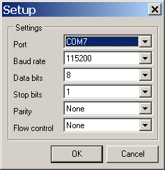 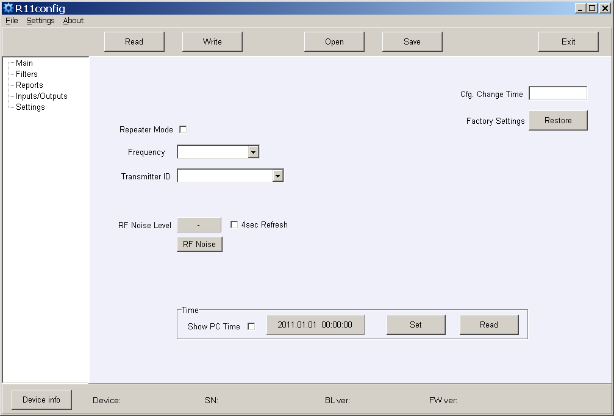

    Ajustes del puerto USB en la columna **Settings**.

2. Explore los parámetros del receptor haciendo clic en [Read].

3. Configure (Repeater mode), (Frequency) y (Transmitter ID) en la rama del programa **Main**. Al seleccionar Account ID, los mensajes se asignarán por número de objeto del transmisor; al seleccionar Transmitter SN, por número de serie del transmisor; al seleccionar Transmitter SN+ Account ID, por ambos números.

    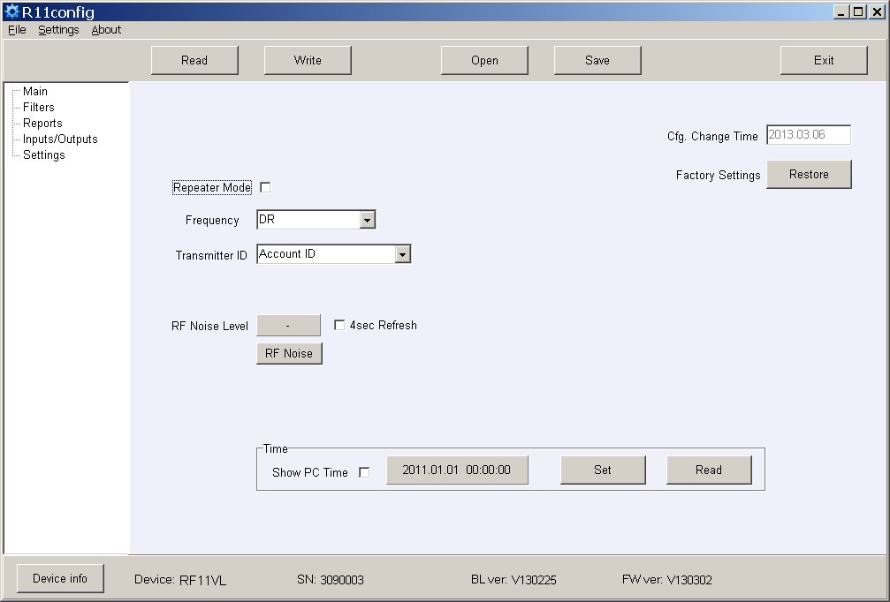

4. Configure los parámetros de filtro requeridos en la rama del programa **Filters**.

    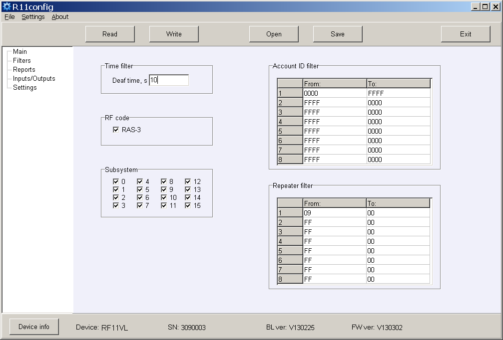

    - **Time filter** — tiempo de tolerancia para el mismo mensaje;
    - **RF code** — marque la casilla de verificación para la recepción de mensajes del sistema de codificación RAS-3;
    - **Subsystem** — marque la casilla de verificación del subsistema requerido para su recepción;
    - **Account ID filter** — secuencias de números de objeto de recepción;
    - **Repeater filter** — secuencias de números de repetidor requeridos.

5. Configure los parámetros de salida hacia el software de monitorización o los módulos de transmisión en la rama del programa **Reports**.

    a) Cuando los mensajes se transmiten al software de monitorización Monas MS:

    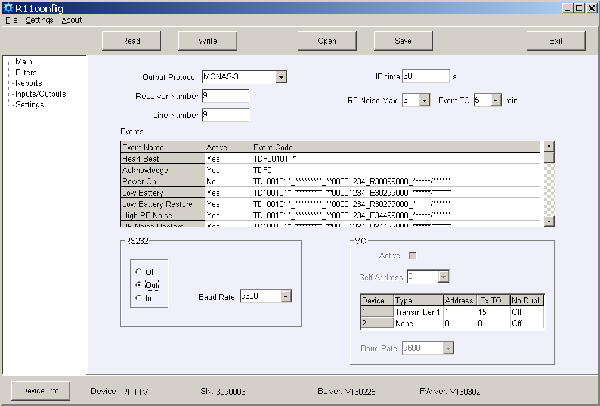

    Configure el protocolo de salida (Out Protocol), el número de receptor (Receiver Number), el número de línea (Line number), el tiempo HB y la velocidad en baudios (Baud Rate) para RS232.

    b) Configure los mensajes de servicio que se enviarán. Márquelos en la casilla de verificación **Active**. Introduzca el número de abonado requerido del número de receptor y los códigos de evento. Los códigos de evento recomendados se especifican en el Anexo B.

    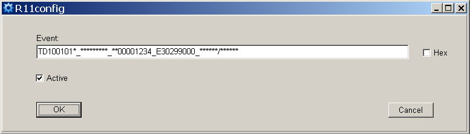

    c) Cuando los mensajes se transmiten a los módulos de transmisión (Repeater Mode):

    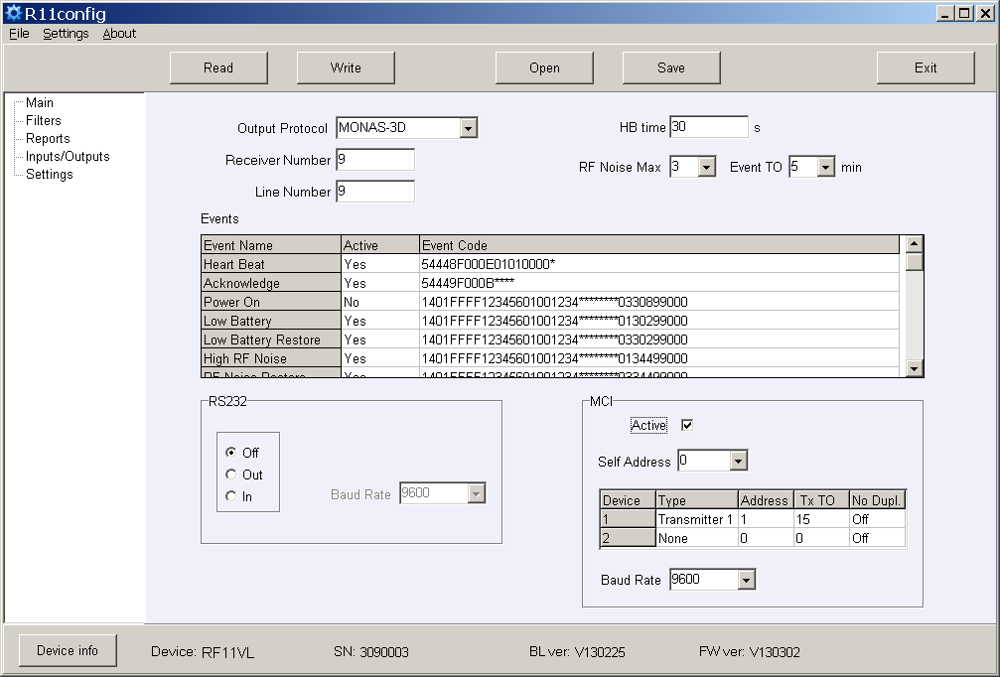

    Configure el protocolo de salida (Out Protocol), el número de receptor (Receiver Number) y el número de línea (Line Number), marque la casilla de verificación **Active** para habilitar el bus MCI y configure la velocidad en baudios (Baud Rate). Especifique la dirección propia (Self Address) cuyo valor numérico debe ser inferior al de los módulos de transmisión conectados.

    d) Especifique la secuencia de módulos de transmisión, las direcciones, el tiempo de espera de confirmación **Ack TO**, el retardo de envío (si procede) **Tx TO** y la ignoración de mensajes retransmitidos **No Dupl**.

    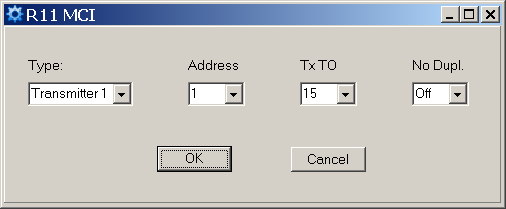

    El retardo de envío Tx TO se aplica para retrasar la señal enviada en el sistema de radio. El valor numérico es múltiplo de 250 ms.

    La ignoración de mensajes retransmitidos No Dupl. debe activarse cuando varios repetidores de radio funcionan en el sistema y es necesario reducir el número de mensajes enviados por canal (solución al problema de ocupación del canal de radio).

6. Configure los parámetros de funcionamiento de entradas y los códigos de evento en la rama del programa **Inputs/Outputs**.

    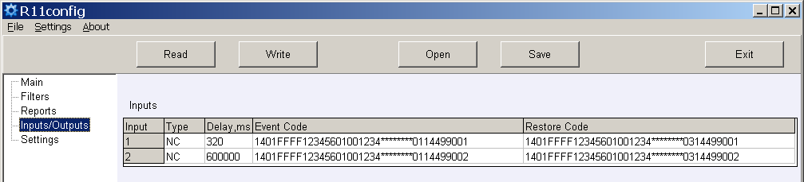

    - **Input Type** — especifique el tipo de entrada;
    - **Delay** — especifique el tiempo de respuesta de la entrada;
    - **Event Code** — código de evento y número de objeto de envío tras la actuación de la entrada;
    - **Restore Code** — código de evento y número de objeto de envío tras la restauración de la entrada.

    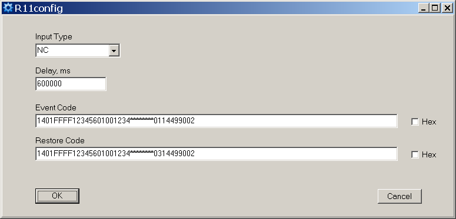

7. En la rama del programa **Settings** se pueden introducir nuevas frecuencias o eliminar las existentes.

    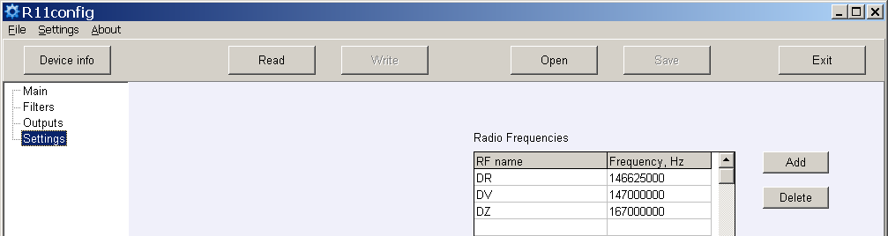

    Los ajustes del receptor, con su ubicación de almacenamiento indicada en la memoria del ordenador, pueden guardarse haciendo clic en el botón [Save], y posteriormente utilizarse para la parametrización de otros receptores. Los ajustes guardados pueden recuperarse haciendo clic en [Open] e indicando la ubicación de almacenamiento de los datos.

    Haga clic en [Exit] para salir del software de parametrización.

## Anexo A — Señal de salida del receptor en el puerto serie RS232

**a) Cuando se configura el siguiente protocolo de salida Monas3:**

```
TD1001017_***010532_3D025218_E13002027_120514/153241
```

donde:

- `TD` — símbolo de inicio
- `10` — tipo/subtipo de mensaje (Contact ID)
- `01` — número de receptor 01
- `01` — número de línea 01
- `7` — nivel de señal 7
- `**` — número de repetidor (recepción directa)
- `*` — nivel en el repetidor (ninguno)
- `010532` — número de transmisor 010532
- `3D` — número de mensaje (del objeto n.º 010532) 61 (3D hexadecimal)
- `025218` — subsistema 02 / Account ID 5218
- `E13002027` — datos Contact ID
- `12` — año 12, `05` — mes 05, `14` — día 14
- `15` — hora 15, `32` — minuto 32, `41` — segundo 41

**b) Cuando se configura el siguiente protocolo de salida Surgard MLR2-DG:**

```
5011 181234E14401002
```

donde:

- `5` — tipo de mensaje
- `01` — número de receptor
- `1` — número de línea
- `18` — tipo de protocolo
- `1234` — número de objeto
- `E` — clasificador CID
- `144` — código de evento CID
- `01` — número de subgrupo CID
- `002` — ubicación del evento CID

## Anexo B — Códigos de evento recomendados para mensajes de servicio

**Formato de código de evento R11:**

```
1401FFFF12345601001234********0330199000
```

donde `1234` = número de objeto (8191), `03` = evento/restauración, `301` = código de evento, `99` = subgrupo, `000` = ubicación.

| Evento | Código RAS-3D | ECID | Nota |
|--------|--------------|------|------|
| Encendido (Power ON) | 0330199000 | R301 99 000 | no enviar |
| Batería baja (Low Battery) | 0130299000 | E302 99 000 | enviar |
| Restauración batería baja (Low Battery Restore) | 0330299000 | R302 99 000 | enviar |
| Ruido RF alto (High RF Noise) | 0135599000 | E355 99 000 | enviar |
| Restauración ruido RF (RF Noise Restore) | 0335599000 | R355 99 000 | enviar |
| Cambio de configuración (Cfg. Change) | 0362899000 | R628 99 000 | enviar |
| Fallo de hora (Time fault) | 0170099000 | E700 99 000 | no enviar |
| Hora configurada (Time Set) | 0370099000 | R700 99 000 | no enviar |
| Error MCI (MCI Error) | 0171299000 | E712 99 000 | no enviar |
| Restauración MCI (MCI Restore) | 0371299000 | R712 99 000 | no enviar |
| Error RS232 (RS232 Error) | 0171399000 | E713 99 000 | no enviar |
| Restauración RS232 (RS232 Restore) | 0371399000 | R713 99 000 | no enviar |
| Error CRC (CRC Error) | 0130799000 | E307 99 000 | no enviar |
| PING del transmisor (Transmitter PING) | — | E770 99 00X (x = siguiente período PING) | no enviar |
