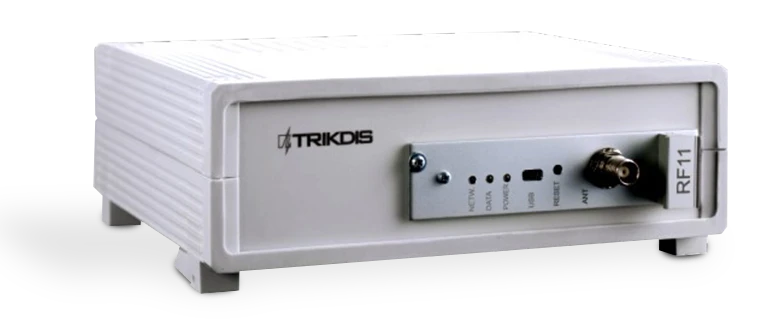
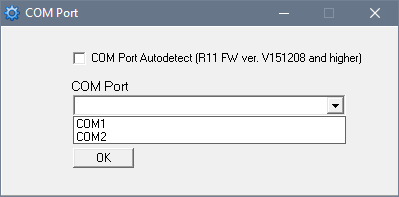
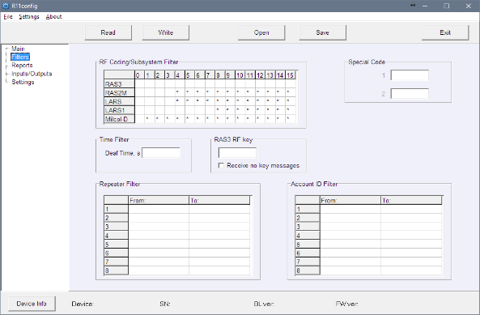

# RFH11 Receptor de Radio

  

## Sobre el receptor de radio

**El receptor de radio RFH11** está diseñado para recibir mensajes de radio codificados en el rango de frecuencias VHF o UHF. El módulo integrado trabaja con los sistemas de codificación RAS3, RAS2M, LARS, LARS1, Milcol-D.

El receptor dispone de filtros programables que permiten filtrar los mensajes según:

- Intervalo de repetición de mensajes
- Subsistemas del sistema de codificación
- Ruta de comunicación
- Secuencia de números de cuenta

> **Nota:** Configuramos el receptor con los parámetros preestablecidos a petición del cliente.

## Parámetros técnicos principales

| Nombre | Descripción |
|--------|-------------|
| Rango de frecuencias de trabajo | 146 – 174 MHz (VHF) o 430 – 470 MHz (UHF) |
| Separación de canales | 12,5 kHz |
| Error de ajuste de frecuencia | no más de ± 200 Hz |
| Sensibilidad | No inferior a 0,5 μV |
| Modulación | FFSK/FSK |
| Formatos decodificados | RAS-3, RAS-2M, LARS, LARS-1, Milcold-D |
| Formatos de salida | Monas3 y Surgard |
| Almacenamiento de mensajes | 300 últimos mensajes recibidos |
| Alimentación principal | Red CA 100 – 240 V (50 / 60 Hz) |
| Puertos de salida de datos RS232 | 1 x DB9 |
| Temperatura de funcionamiento | De 0°C a +55°C |
| Dimensiones | 225 x 235 x 115 mm |
| Peso | 1,21 kg, con cables |

## Contenido del embalaje

| Artículo | Cantidad |
|----------|----------|
| Receptor | 1 ud. |
| Cable de alimentación CA de 1,5 m | 1 ud. |
| Cable Null Modem R232 de 1,8 m | 1 ud. |

> **Nota:** El cable *USB* para la programación del receptor no está incluido.

## Alimentación

El receptor se alimenta mediante corriente alterna (CA). Para garantizar un funcionamiento ininterrumpido, el receptor debe conectarse a una batería de 12 V, 7 Ah que proporcione alimentación de reserva durante 12 horas.

## Estructura del receptor

| N.º | Elemento | N.º | Elemento |
|-----|----------|-----|----------|
| 1 | Indicación luminosa | 5 | Puerto de salida de datos RS232 |
| 2 | Puerto de conexión USB | 6 | Conexión de batería de reserva |
| 3 | Botón RESET | 7 | Conector de alimentación y botón de encendido/apagado |
| 4 | Conector de antena | | |

### Indicación luminosa

| Indicador LED | Funcionamiento | Significado |
|---------------|----------------|-------------|
| "Power" | LED verde parpadeante | Tensión de alimentación suficiente |
| "Power" | LED amarillo parpadeante | Tensión de alimentación baja (por debajo de 11,5 V) |
| "Power" | Parpadea verde y rojo alternativamente | Alimentación solo por USB (durante la configuración) |
| "Netw." | LED verde parpadeante | Recibiendo mensaje |
| "Netw." | LED amarillo encendido | Nivel de ruido RF superado |
| "Data" | LED verde | Hay mensajes sin enviar |
| "Data" | LED verde y rojo encendidos simultáneamente | Búfer de salida lleno |

## Instalación del sistema

### Pasos de instalación del equipo

> **Nota:** Para configurar los parámetros necesitará el software R11config. Solicítelo a su distribuidor.

1. Si el dispositivo recibido no tiene los parámetros de explotación preestablecidos, configúrelos como se describe en **Configuración de parámetros de funcionamiento con R11config** más abajo.
2. Conecte el RFH11 al ordenador mediante cable RS232 para reenviar los eventos al software de monitorización.
3. Configure su software de monitorización para mostrar los mensajes del receptor. Siga las instrucciones de la documentación de su software de monitorización.
4. Conecte la antena de radio al puerto de antena.
5. Conecte el receptor a la fuente de alimentación con el cable suministrado.
6. Encienda el receptor. El LED verde parpadeante indica que el receptor está conectado a la alimentación.
7. Compruebe que su software de monitorización muestra los mensajes del receptor RFH11.

**Si no se recibe nada:** compruebe el color del LED *"POWER"* y asegúrese de que todas las conexiones de alimentación estén correctamente conectadas. Si el problema persiste, asegúrese de que los parámetros de explotación están configurados correctamente o contacte con el soporte técnico.

### Configuración de parámetros de funcionamiento con R11config

1. Conecte el receptor al ordenador con el cable USB y ejecute el programa R11config (debe obtener este programa de su distribuidor).

   1.1. En la ventana que se abre, introduzca la contraseña de administrador **1234** y haga clic en [Enter].

> **Nota:** Si la contraseña es desconocida, puede ver el tipo de receptor y las versiones de software/firmware haciendo clic en [Device info].

> **Nota:** **Los controladores USB deben estar instalados en el ordenador.** Si el receptor se conecta al ordenador por primera vez, el SO MS Windows debería abrir la ventana *Asistente para hardware nuevo encontrado* para instalar los controladores USB. Descargue el archivo de controlador USB *\*.inf* para su versión de MS Windows desde el sitio web [http://www.trikdis.com/en/](http://www.trikdis.com/en/). En la ventana del asistente seleccione *Sí, solo esta vez* y pulse *Siguiente*. Cuando aparezca la ventana *Seleccione las opciones de búsqueda e instalación*, pulse *Examinar* y seleccione la ubicación donde guardó el archivo *\*.inf*. Siga las instrucciones restantes para completar la instalación.

2. Seleccione el directorio del programa [Settings], luego [COM port] en la lista desplegable [COM Port], y seleccione el puerto al que está conectado el módulo.

> **Nota:** El puerto específico al que está conectado el dispositivo aparecerá solo después de que el dispositivo esté correctamente conectado.

**Configuración en la rama Main:**

3. Lea los parámetros del receptor haciendo clic en [Read].
4. Configure [Frequency] y [Transmitter ID] en la rama Main del programa.
5. En la lista desplegable [Transmitter ID] puede elegir por qué el receptor identificará al transmisor:

   - **Account ID** – el número de Account ID programado identificará al transmisor.
   - **Transmitter SN** – el número de serie único identificará al transmisor.
   - **Transmitter SN + Account ID** – el transmisor se identificará por ambos números (SN y Account ID).

> **Nota:** El parámetro [Transmitter ID] debe configurarse de forma idéntica en todos los transmisores de radio.

**Configuración en la rama Filters:**

- [Time filter] – período de tiempo en el que se rechazará el mismo mensaje (se recomienda 90 segundos).
- [RF Coding/Subsystem Filter] – haga doble clic en la tabla, seleccione los sistemas de codificación de radio requeridos (RAS3, RAS2M, LARS, LARS1, Milcol-D) y marque los subsistemas permitidos para recibir.
- [Account ID filter] – introduzca los rangos (Desde – Hasta) de números de Account ID del transmisor permitidos para recibir.
- [Repeater filter] – introduzca los rangos (Desde – Hasta) de números de repetidor permitidos para recibir.

**Configuración en la rama Reports:**

Configuración de parámetros de salida para el software de monitorización o módulos de transmisión:

6. Configure el protocolo de salida:

   6.1. Si utiliza el software de monitorización MonasMS, establezca [Output protocol] en *Monas3*. De lo contrario, seleccione el protocolo Surgard o Ademco.

   6.2. Desmarque [Repeater Mode].

   6.3. Configure los siguientes parámetros requeridos: [Receiver Number], [Line number], [System], [Account ID], [HB Period] y [Baud Rate] para RS232.

7. Seleccione qué mensajes de servicio se enviarán:

   7.1. Haga doble clic en la fila de registro de la tabla [Events]. Marque la casilla [Active] si el código de evento debe enviarse. Los códigos de evento recomendados se especifican en el Anexo A.

**Configuración en la rama Settings:**

8. Se pueden introducir nuevas frecuencias o eliminar las existentes. Posteriormente estas frecuencias estarán disponibles en la rama Main.

9. Todos los ajustes pueden guardarse haciendo clic en el botón [Save]. Se pueden usar posteriormente como plantilla para configurar otros módulos. Para abrirlos, haga clic en [Open] e indique la ubicación. Para salir del programa pulse [Exit].

## Anexo A — Códigos de evento recomendados para mensajes de servicio

Ejemplo de formato de código de evento:
`1401FFFF 12345601001234********03 301 99 000`

Donde:

| Campo | Significado |
|-------|-------------|
| 1234 | número de objeto |
| 03 | evento/restauración |
| 301 | código de evento |
| 99 | subgrupo |
| 000 | ubicación |

| Evento | Código RAS-3D | Código ECID | Recomendación |
|--------|---------------|-------------|---------------|
| Encendido | 0330199000 | R301 99 000 | no enviar |
| Batería baja | 0130299000 | E302 99 000 | enviar |
| Batería baja restaurada | 0330299000 | R302 99 000 | enviar |
| Ruido RF elevado | 0135599000 | E355 99 000 | enviar |
| Ruido RF restaurado | 0335599000 | R355 99 000 | enviar |
| Cambio de configuración | 0362899000 | R628 99 000 | enviar |
| Fallo de hora | 0170099000 | E700 99 000 | no enviar |
| Hora establecida | 0370099000 | R700 99 000 | no enviar |
| Error MCI | 0171299000 | E712 99 000 | no enviar |
| MCI restaurado | 0371299000 | R712 99 000 | no enviar |
| Error RS232 | 0171399000 | E713 99 000 | no enviar |
| RS232 restaurado | 0371399000 | R713 99 000 | no enviar |
| Error CRC | 0130799000 | E307 99 000 | no enviar |
| PING del transmisor | — | E770 99 00X (X = próximo período PING) | no enviar |
