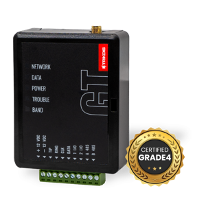
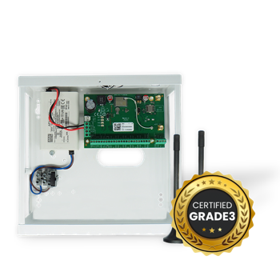
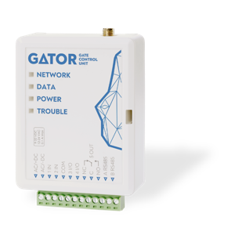
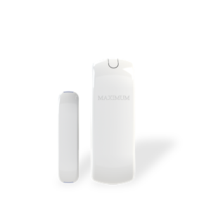
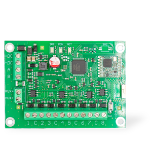
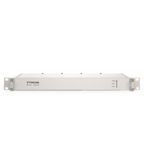

---
hide:
  - toc
---

# TRIKDIS Product Documentation

**Languages:** [English](#english) | [Lietuvių](#lietuviu) | [Español](#espanol) | [Русский](#russian)

---

## Product Categories

  

    

      
    

    <h3>Alarm Communicators</h3>
    
Cellular, Dual-path, Ethernet, Fire Panel, and Radio.

  

  

    

      
    

    <h3>Control Panels</h3>
    
Security system control panels and main units.

  

  

    

      
    

    <h3>Controllers</h3>
    
System controllers and automation devices.

  

  

    

      
    

    <h3>Keypads</h3>
    
User interface keypads for control panels.

  

  

    

      
    

    <h3>Wireless Sensors</h3>
    
Wireless detection and monitoring sensors.

  

  

    

      
    

    <h3>Accessories</h3>
    
Antennas, housings, interfaces, expanders, sensors, and wiring components.

  

  

    

      
    

    <h3>Monitoring Software</h3>
    
Software solutions for system monitoring and management.

  

  

    

      
    

    <h3>Receivers</h3>
    
Radio receivers for wireless systems.

  

---

## How to Use This Site

- **Browse by category** - Use the navigation menu on the left
- **Search** - Click the search icon in the header
- **Download PDF** - Available on individual manual pages

**Need support?** Visit [www.trikdis.com](https://www.trikdis.com) or contact your local distributor.
