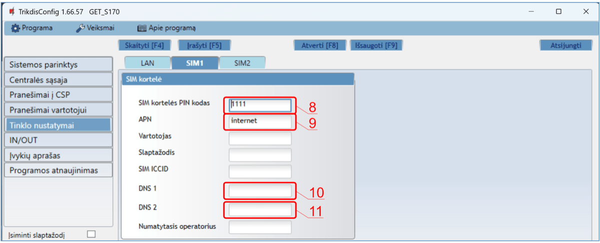
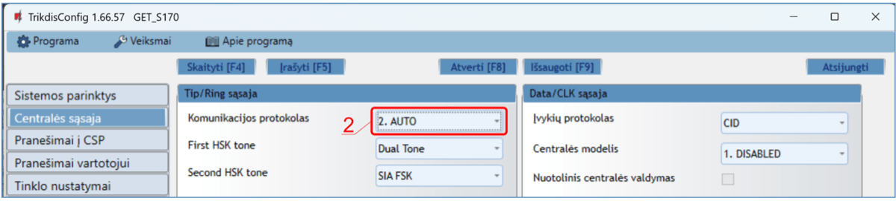
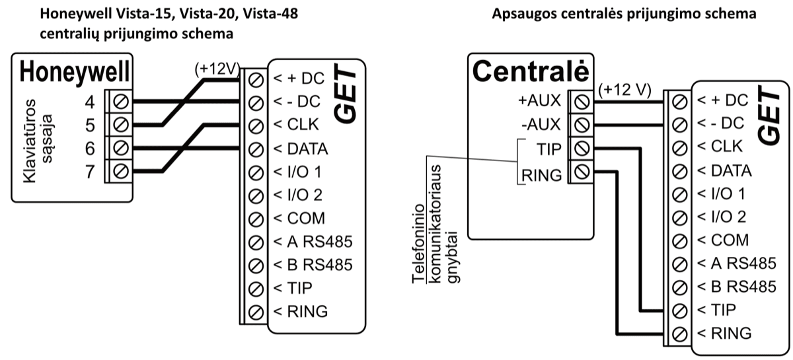
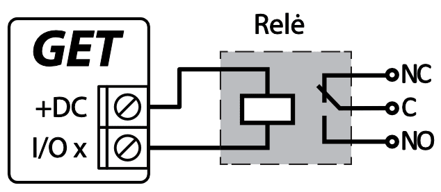
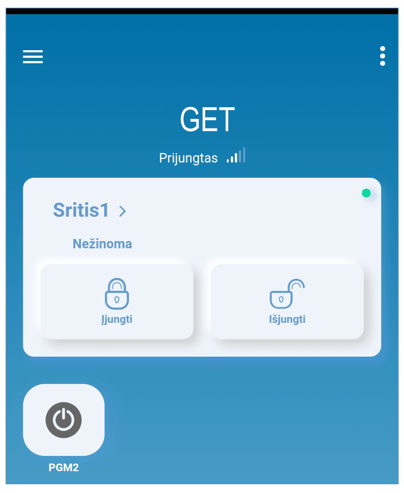
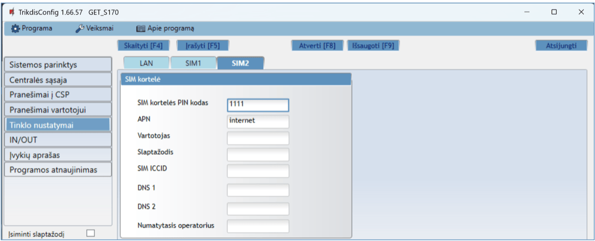
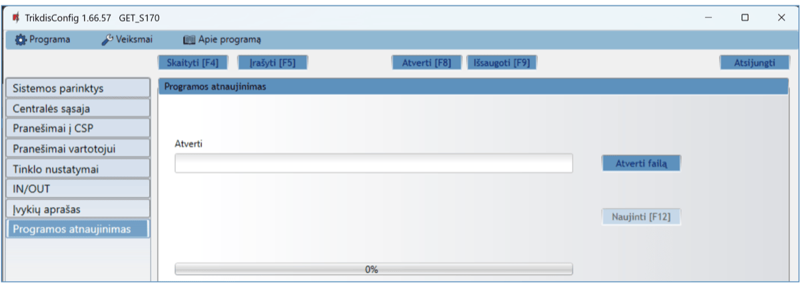

# GSM/Ethernet komunikatorius GET

  

## Aprašymas

Komunikatorius GET skirtas perduoti įvykių pranešimus iš centralės į CSP ir Protegus2 programėlę.

GET komunikatorių galima tiesiogiai prijungti prie centralės klaviatūros magistralės arba nuosekliosios magistralės (DSC, Paradox, UTC Interlogix (CADDX), Texecom, Innerrange, Honeywell) arba prie centralės telefono komunikatoriaus (kuris palaiko DTMF tonais perduodamą Contact ID ryšio protokolą).

Komunikatorius perduoda visą informaciją apie įvykius į saugos tarnybos stebėjimo pulto (CSP) imtuvą.

Komunikatorius GET taip pat veikia su Protegus2 programėle. Su Protegus2 vartotojai gali nuotoliniu būdu valdyti signalizaciją ir gauti pranešimus apie apsaugos sistemos įvykius. Programėlė Protegus2 suderinama su visomis įvairių gamintojų centralėmis, kuriuos palaiko GET komunikatorius. Komunikatorius gali perduoti pranešimus apie įvykius į saugos tarnybos centrini stebėjimo pultą (CSP) ir vienu metu veikti su Protegus2.

**Savybės**

Prijungiamas prie centralės nuosekliosios arba klaviatūros sąsajos arba telefoninės linijos (TIP/RING).

Siunčia įvykius į stebėjimo pulto imtuvą:

- Siunčia įvykius į TRIKDIS programinius arba aparatūrinius imtuvus, kurie dirba su bet kuria stebėjimo programa.

- Gali siųsti įvykius į SIA DC-09 imtuvus.

- Gali siųsti įvykius į SUR-GARD imtuvus. Priede yra kodų (Contact ID į SIA) keitimo lentelė.

- Ryšio stebėjimas siunčiant PING užklausą į IP imtuvą kas 30 sekundžių (arba kitu nustatytu periodu).

- Atsarginis kanalas, kuris bus naudojamas nutrūkus ryšiui pirminiu kanalu.

- Įgalinus lygiagrečius ryšio kanalus, įvykiai bus siunčiami į du imtuvus vienu metu.

- Kai įjungta *Protegus* paslauga, įvykiai visų pirma siunčiami į CSP ir tik po to programėlės naudotojams.

Veikia su Protegus2 programėle:

- “*Push*” ir specialūs garso įspėjimai apie įvykius.

- Nuotolinis sistemos įjungimas/išjungimas.

- Nuotolinis prijungtų įrenginių valdymas (šviesų, vartų, kondicionieriaus, šildymo, pievutės laistymo ir kt.).

- Skirtingos vartotojų teisės administratoriui, instaliuotojui ir vartotojui.

**Informuoja vartotojus:**

- Vartotojus galima informuoti apie įvykius su Protegus2 programėle.

**Valdomi išėjimai ir įėjimai:**

- 2 universalus I/O gnybtai, kurios galima nustatyti kaip įėjimo (IN) arba išėjimo (OUT) gnybtą.

- Išėjimai valdomi su Protegus2 programėle.

**Greitai sukonfigūruojamas:**

- Nustatymai gali būti išsaugoti į failą ir greitai įrašyti į kitus komunikatorius.

- Du prieigos prie nustatymų lygiai: instaliuotojui ir CSP administratoriui.

- Nuotolinis konfigūravimas ir programinės įrangos atnaujinimas.

### Suderinamų centralių sąrašas

| Gamintojas | Modelis |
|------------|---------|
| DSC® | <u>PC585</u>, <u>PC1404</u>, <u>PC1565</u>, <u>PC1616</u>, <u>PC1832</u>, <u>PC1864</u>, <u>PC5020</u> |
| PARADOX® | <u>SPECTRA SP4000</u>, <u>SP5500</u>, <u>SP6000</u>, <u>SP7000</u>, <u>SP65</u>, <u>SP5500+</u>, <u>SP6000+</u>, <u>SP7000+</u> |
| PARADOX® | <u>MAGELLAN MG5000</u>, <u>MG5050</u>, <u>MG5050E</u>, <u>MG5050+</u>, <u>MG5075</u> |
| PARADOX® | <u>DIGIPLEX EVO48</u>, <u>EVO192</u>, <u>EVOHD</u>, <u>EVOHD+</u> |
| PARADOX® | SPECTRA 1727, 1728, 1738 |
| PARADOX® | ESPRIT E55 |
| UTC Interlogix® | <u>NetworX (Caddx) NX-4v2</u>, <u>NX-6v2</u>, <u>NX-8v2</u>, <u>NX-8e</u> |
| Texecom® | <u>Premier 24</u>, <u>48</u>, <u>88</u>, <u>168</u>, <u>640</u> /​ <u>Premier Elite 12</u>, <u>24</u>, <u>48</u>, <u>64</u>, <u>88</u>, <u>168</u>, <u>640</u> |
| Innerrange® | Inception, Integriti |
| Honeywell® | <u>Ademco Vista-15</u>, <u>Ademco Vista-20</u>, <u>Ademco Vista-48</u> |

\***<u>Pabraukta</u>** – centralės, kurios tiesiogiai valdomos komunikatoriaus. Tiesiogiai valdomų PARADOX centralių veikimo programos versija turi būti ne žemesnė nei V.4.

\*Kitų gamintojų centrales prijunkite su komunikatoriumi GET naudojant centralės gnybtus TIP RING.

### Komunikatoriaus modelio tipas

Ši instrukcija skirta LTE komunikatoriaus modeliams.

### Techniniai parametrai

| Parametras | Aprašymas |
|------------|-----------|
| Prisijungimas prie tinklo | LTE /​ Ethernet |
| Prisijungimas prie centralės | Nuoseklioji magistralė arba klaviatūros magistralė arba fiksuotojo ryšio komunikatoriaus (TIP RING gnybtai) |
| Universalus įėjimas/​išėjimas [I/​O] | 2 vnt., nustatomas kaip įėjimas IN, kurio tipas: NC;​ NO;​ NC/​EOL;​ NO/​EOL;​ NC/​DEOL;​ NO/​DEOL. (2,2 kΩ);​ arba išėjimas OUT: atviro kolektoriaus (OC) tipas, iki 0,15 A, 30 V DC maks. |
| Modemas EG915U-EU /​ (Europe) | LTE FDD: B1/​B3/​B5/​B7/​B8/​B20/​B28 |
| Modemas EG915U-EU /​ (Europe) | GSM: B2/​B3/​B5/​B8 |
| Modemas EG915U-LA /​ (Latin America) | LTE FDD: B2/​B3/​B4/​B5/​B7/​B8/​B28/​B66 |
| Modemas EG915U-LA /​ (Latin America) | GSM: B2/​B3/​B5/​B8 |
| Modemas BG95-M5 (Cat M1) | LTE-FDD: B1/​B2/​B3/​B4/​B5/​B8/​B12/​B13/​B18/​B19/​B20/​B25/​B26/​B27/​B28/​B66/​B85 |
| Modemas BG95-M5 (Cat M1) | EGPRS: 850/​900/​1800/​1900 MHz |
| Maitinimo įtampa | 10-18 V nuolatinės srovės |
| Naudojama srovė | 175 mA |
| Perdavimo protokolai | TRK8, DC-09_2007, DC-09_2012 , TL150 |
| Pranešimo šifravimas | AES 128 |
| Atmintis | Iki 60 pranešimų |
| Veikimo konfigūravimas | Su kompiuterine programa TrikdisConfig nuotoliniu būdu arba lokaliai per USB-C |
| Darbo aplinkos sąlygos | Temperatūra nuo -10 °C iki +50 °C, santykinė drėgmė – iki 80%, prie +20 °C |
| Komunikatoriaus matmenys | 113 x 70 x 25 mm |
| Svoris | 110 g |

### Komunikatoriaus elementai

1.  GSM antenos SMA jungtis.

2.  Šviesos indikatoriai.

3.  Priekinio dangtelio atidarymo anga.

4.  Gnybtai laidų prijungimui.

5.  Mygtukas „RESET“.

6.  SIM2 kortelės laikiklis.

7.  SIM1 kortelės laikiklis.

8.  USB-C jungtis komunikatoriui programuoti.

9.  Lizdas RJ45 LAN kabelio prijungimui.

### Išorinių kontaktų paskirtis

| Gnybtas | Aprašymas |
|---------|-----------|
| +12 VDC | maitinimo gnybtas (10-18 V nuolatinės srovės teigiamas gnybtas) |
| -12 VDC | maitinimo gnybtas (10-18 V nuolatinės srovės neigiamas gnybtas) |
| CLK | Nuosekliojo prievado gnybtai tiesioginiam prijungimui prie centralės |
| I/​O 1 | 1as įėjimo/​išėjimo gnybtas (gamyklinis nustatymas - OUT) |
| I/​O 2 | 2as įėjimo/​išėjimo gnybtas (gamyklinis nustatymas – OUT) |
| COM | Bendras (neigiamas) |
| A 485 | Nenaudojamas |
| LAN | Lizdas RJ45 LAN kabelio prijungimui |
| TIP | Gnybtas sujungiamas su apsaugos centralės TIP gnybtu |
| RING | Gnybtas sujungiamas su apsaugos centralės RING gnybtu |

### Šviesinė veikimo indikacija

| Indikatorius | Būklė | Aprašymas |
|--------------|-------|-----------|
| NETWORK LTE | Nešviečia | Nėra ryšio su GSM tinklu. |
| NETWORK LTE | Geltonas mirksi | Jungiasi prie GSM tinklo. |
| NETWORK LTE | Šviečia žalia ir mirksi geltona | Komunikatorius prisijungė prie GSM tinklo. Pakankamas GSM signalo stiprumas 4G ryšiui yra3 lygis (trys geltoni sumirksėjimai). |
| NETWORK LAN | Nešviečia | Neprijungtas prie kompiuterinio tinklo |
| NETWORK LAN | Šviečia žaliai | Komunikatorius prisijungė prie kompiuterinio tinklo. |
| DATA | Nešviečia | Nėra neišsiųstų įvykių pranešimų. |
| DATA | Šviečia žaliai | Yra neišsiųstų pranešimų. |
| DATA | Mirksi žaliai | (Konfigūravimo režimas) duomenys perkeliami į komunikatorių arba iš jo. |
| POWER | Nešviečia | Nėra maitinimo. |
| POWER | Šviečia žalia | Maitinimo įtampa yra pakankama. |
| POWER | Šviečia geltona | Maitinimo įtampa yra nepakankama (≤11.5 V). |
| POWER | Šviečia žalia ir mirksi geltona | (Konfigūravimo režimas) komunikatorius parengtas konfigūravimui. |
| POWER | Šviečia geltona | (Konfigūravimo režimas) nėra ryšio su kompiuteriu. |
| TROUBLE | Nešviečia | Komunikatorius veikia gerai, be nesklandumų. |
| TROUBLE | 1 raudonas mirksnis | Prisijungimo klaida „fiziniame“ lygmenyje (PHY Link status error), patikrinti LAN kabelį |
| TROUBLE | 2 raudoni mirksniai | SIM1 kortelės klaida |
| TROUBLE | 3 raudoni mirksniai | SIM2 kortelės klaida |
| TROUBLE | 7 raudoni mirksniai | Nėra ryšio su centrale (tik serial šynai) |
| INTERFACE | - | Nenaudojama |

### Komunikatoriaus GET panaudojimo struktūrinė schema

!!! note
    Prieš pradėdami įrengimą, įsitikinkite, kad turite:
    
    1.  USB-C tipo kabelį, kuris reikalingas konfigūravimui.
    
    2.  Mažiausiai 4 gyslų kabelį komunikatoriaus prijungimui prie apsaugos
        centralės.
    
    3.  CRP2 kabelį Paradox centralių prijungimui prie nuosekliojo prievado.
    
    4.  Plokščią 2,5 mm atsuktuvą.
    
    5.  Išorinę GSM anteną, jeigu vietoje silpnas ryšys.
    
    6.  Aktyvuotą SIM kortelę (PIN kodo reikalavimas gali būti išjungtas).
    
    7.  Apsaugos centralės instrukcija, prie kurios bus jungiamas
        komunikatorius.
    
    Reikalingas medžiagas galite užsisakyti iš vietinio platintojo.
## Greitas konfigūravimas su programa *TrikdisConfig*

1.  Parsisiųskite konfigūravimo programą TrikdisConfig iš [www.trikdis.lt](http://www.trikdis.lt) (programą rasite paieškos lauke surinkę „TrikdisConfig“), ir ją įdiekite*.*

2.  Plokščiu atsuktuvu nuimkite komunikatoriui dangtelį kaip parodyta žemiau:

    

3.  Su USB-C kabeliu sujunkite komunikatorių GET su kompiuteriu.

4.  Paleiskite TrikdisConfig. Programa automatiškai atpažins prijungtą gaminį ir atidarys komunikatoriaus konfigūravimo langą.

5.  Spustelkite programos mygtuką **Skaityti [F4]**, kad ji pateiktų esamas komunikatoriaus veikimo parametrų reikšmes. Jei atsivers administratoriaus arba instaliatoriaus kodo įvedimo reikalavimo langelis, įveskite 6 skaitmenų kodą.

Žemiau aprašome nustatymus, kuriuos reikia pakeisti, kad komunikatorius pradėtų siųsti pranešimus į Stebėjimo pultą ir kad apsaugos centralę būtų galima valdyti su Protegus2 programėle.

### Nustatymai ryšiui su Protegus2 programėle

**Lange „Centralės sąsaja“:**

1.  Jei komunikatorius prijungtas prie centralės TIP/RING gnybtų, tuomet reikia nustatyti „**AUTO**“.

Kai komunikatorius yra prijungtas prie centralės klaviatūros magistralės arba nuosekliosios magistralės.

2. Pasirinkite „**Centralės modelį“**, kurį jungsite prie komunikatoriaus.

2.  Pažymėkite varnele „**Nuotolinis centralės valdymas“**, jei norite, kad vartotojai galėtų valdyti centralę Protegus2 programėlėje su savo klaviatūros kodu. Šis nustatymas rodomas tiesiogiai valdomoms centralėms.

3.  Paradox ir Texecom centralių tiesioginiam valdymui įveskite „**Centralės PC download slaptažodį“**. Jis turi sutapti su slaptažodžiu, kuris įvestas centralėje.

!!! note
    Kad veiktų tiesioginis centralės valdymas, reikės pakeisti centralės
    nustatymus. Kaip tai padaryti aprašyta skyriuje 4 „Centralės
    programavimas kai komunikatorius yra prijungtas prie centralės
    nuosekliosios magistralės arba prie klaviatūros magistralės". Šiame
    skyriuje aprašyta ir kaip pakeisti „**Centralės PC download/UDL
    slaptažodį**".
**Lango „Pranešimai vartotojui“ kortelėje „PROTEGUS servisas“:**

4. Pažymėkite varnele „**Leisti prisijungti“** prie Protegus serviso.

2.  Pakeiskite prisijungimo prie „**PROTEGUS Cloud prieigos kodą“**, jeigu norite, kad vartotojų prašytų jį suvesti pridedant sistemą Protegus2 programėlėje (gamyklinis – 123456).

**Lange „Tinklo nustatymai“:**

Šiuos nustatymus reikia atlikti, jei komunikatorius prijungtas prie LAN tinklo.

3. Pažymėkite varnele **„Naudoti DHCP“** režimą, kad komunikatorius automatiškai nuskaitytų kompiuterinio tinklo nustatymus (potinklio kaukę, šliuzą) ir jam būtų priskirtas IP adresas.

Jei komunikatoriuje įdėta SIM kortelė (arba dvi SIM kortelės), reikia atlikti šiuos nustatymus.

4. Įveskite „**SIM kortelės PIN kodą“**.

2.  Pakeiskite „**APN“** vardą. „**APN“** rasite SIM operatoriaus interneto puslapyje. „**Internet**” yra universalus ir veikia daugelio operatorių tinkluose.

3.  Gamykliškai nustatytas Google DNS serverio adresas. Nepriklausomai nuo IP nustatymų, įsitikinkite, kad DNS adresai atitinka tuos, kuriuos palaiko jūsų interneto tiekėjas.

4.  Gamykliškai nustatytas Google DNS serverio adresas. Nepriklausomai nuo IP nustatymų, įsitikinkite, kad DNS adresai atitinka tuos, kuriuos palaiko jūsų interneto tiekėjas.

**Lange „Pranešimai į CSP“:**

12. Parinkčių grupėje „**Siuntimo tvarka**“ nustatomi parametrai, kaip komunikatorius siųs pranešimus į CSP ir į Protegus2. Eilės tvarka nustatomi ryšio tipai. Nepavykus jungtis pirminiu ryšio tipu, pereinama į sekantį ir t.t. Jei atsarginiu ryšio tipu pavyko perduoti pranešimą į CSP, tai grįžimą į pagrindinį ryšio tipą bus bandoma atlikti po nustatyto laiko tarpo.

Baigę konfigūravimą paspauskite mygtuką **Įrašyti [F5]** ir atjunkite USB kabelį.

!!! note
    Plačiau apie kitus komunikatoriaus GET nustatymus
    TrikdisConfig žr. 6 „TrikdisConfig langų aprašymas".
### Nustatymai ryšiui su Stebėjimo pultu

**Lange „Sistemos parinktys“:**

1.  Įrašykite „**Objekto numerį“ (Nenaudokite FFFE, FFFF objekto numerių**.**)**.

**Lange „Centralės sąsaja“:**

2. Jei komunikatorius prijungtas prie centralės TIP/RING gnybtų, tuomet reikia nustatyti „**AUTO**“.

3. Jei komunikatorius yra prijungtas prie centralės klaviatūros magistralės arba nuosekliosios magistralės. Pasirinkite „**Centralės modelį**“, kuris bus prijungtas prie komunikatoriaus.

Lange „Pranešimai į CSP“, parinkčių grupėje „Pirminis ryšio kanalas“:

4. **Ryšio būdas** – pasirinkite **IP** ryšio būdą.

2.  **Protokolas** – pasirinkite, kuria koduote turėtų būti siunčiami pranešimai: **TRK8** (į TRIKDIS imtuvus), **DC-09_2007** arba **DC-09_2012** (į universalius imtuvus), **TL150** (į imtuvus SUR-GARD).

3.  **Šifravimo raktas** – įrašykite šifravimo raktą, kuris yra nustatytas imtuve.

4.  **Domenas arba IP** – įrašykite imtuvo domeno arba IP adresą.

5.  **Prievadas** – įrašykite imtuvo prievado (*angl. port*) numerį tinkle.

6.  **TCP arba UDP** – pasirinkite, kuriuo protokolu (TCP arba UDP) bus siunčiami pranešimai.

7.  (Rekomenduojama) Sukonfigūruokite „**Atsarginio kanalo režimo“** nustatymus.

    

8.  Parinkčių grupėje „**Siuntimo tvarka**“ nustatomi parametrai, kaip komunikatorius siųs pranešimus į CSP ir į Protegus2. Eilės tvarka nustatomi ryšio tipai. Nepavykus jungtis pirminiu ryšio tipu, pereinama į sekantį ir t.t. Jei atsarginiu ryšio tipu pavyko perduoti pranešimą į CSP, tai grįžimą į pagrindinį ryšio tipą bus bandoma atlikti po nustatyto laiko tarpo.

**Lange „Tinklo nustatymai“:**

Šiuos nustatymus reikia atlikti, jei komunikatorius prijungtas prie LAN tinklo.

12. Pažymėkite varnele **„Naudoti DHCP“** režimą, kad komunikatorius automatiškai nuskaitytų kompiuterinio tinklo nustatymus (potinklio kaukę, šliuzą) ir jam būtų priskirtas IP adresas.

Jei komunikatoriuje įdėta SIM kortelė (arba dvi SIM kortelės), reikia atlikti šiuos nustatymus.

13. Įveskite „**SIM kortelės PIN kodą“**.

14. Pakeiskite „**APN“** vardą. „**APN“** rasite SIM operatoriaus interneto puslapyje. „**Internet**” yra universalus ir veikia daugelio operatorių tinkluose.

15. Gamykliškai nustatytas Google DNS serverio adresas. Nepriklausomai nuo IP nustatymų, įsitikinkite, kad DNS adresai atitinka tuos, kuriuos palaiko jūsų interneto tiekėjas.

16. Gamykliškai nustatytas Google DNS serverio adresas. Nepriklausomai nuo IP nustatymų, įsitikinkite, kad DNS adresai atitinka tuos, kuriuos palaiko jūsų interneto tiekėjas.

Baigę konfigūravimą paspauskite mygtuką **Įrašyti [F5]** ir atjunkite USB kabelį.

!!! note
    Plačiau apie kitus komunikatoriaus GET nustatymus
    TrikdisConfig žr. skyrių 6 „TrikdisConfig langų aprašymas".
## Sujungimų schemos, įrengimas ir paleidimas veikti

### Tvirtinimas

1.  Nuimkite viršutinį dangtelį, ištraukite kontaktinių kaladėlių kištukinę dalį.

2.  Įstatykite nano-SIM kortelę.

3.  Išimkite plokštę iš korpuso pagrindo.

4.  Korpuso pagrindą savisriegiais pritvirtinkite pageidaujamoje vietoje.

5.  Įstatykite plokštę į korpuso pagrindą ir įstatykite kontaktines kaladėles.

6.  Prisukite GSM anteną.

7.  Uždarykite viršutinį dangtį.

8.  Jei LAN tinklas bus naudojamas įvykiams perduoti į CSP, tai turi būti prijungtas LAN kabelis prie komunikatoriaus.

!!! note
    Į komunikatorių galima įstatyti viena arba dvi SIM
    korteles. / Įsitikinkite, kad SIM kortelė yra aktyvuota. / Įsitikinkite,
    kad įjungta mobilaus interneto paslauga, jei bus naudojama
    Protegus2 programėlė arba ryšys su pultu IP kanalu. / Jei norite
    išvengti PIN kodo įvedimo TrikdisConfig, įdėkite SIM kortelę į
    telefoną ir išjunkite PIN kodo užklausos funkciją.
### Komunikatoriaus prie centralės nuosekliosios arba klaviatūros sąsajos prijungimo schemos

Sujunkite komunikatorių su centrale pagal vieną iš žemiau pateiktų prijungimo schemų.

### Komunikatoriaus prijungimo schema su PARADOX SP/SP+/MG/MG+ centralemis prie klaviatūros magistralės ir centralės telefono komunikatoriaus (TIP/RING gnybtų)

Kai komunikatorius prijungtas prie centralės klaviatūros magistralės ir TIP/RING gnybtų, tuomet GET reikia nustatyti:

1.  Pasirinkite „**AUTO**“.

2.  Pasirinkite „**7. Paradox SP+/MG+ series KeyBus**“ apsaugos centralės modelį.

3.  Pasirinkite „**Nuotolinis centralės valdymas**“, jei norite, kad vartotojai galėtų valdyti centralę su programėle Protegus2 naudodami savo klaviatūros kodą.

4.  Norėdami tiesiogiai valdyti centralę, įveskite „**Centralės PC download slaptažodį**“. Jis turi sutapti su slaptažodžiu, įvestu centralėje.

Centralė Paradox turi būti užprogramuota perduoti pranešimus stebėjimo pultui ir nuotoliniam valdymui iš Protegus2.

| **Ląstelė** |   **Duomenys**   | **Ląstelė** | **Duomenys** |
|:-----------:|:----------------:|:-----------:|:------------:|
|     801     | \*\*\*\*\*\*\*\* |     815     |    123456    |
|     811     |       1111       |     911     |     1234     |
|     812     |       2222       |             |              |

### Kominikatoriaus prie centralės jungiklio (angl. keyswitch) zonos prijungimo schema

Vadovaukitės šia schema, jei apsaugos centralė bus valdoma su komunikatoriaus PGM išėjimu įjungiant/išjungiant centralės jungiklio (angl. keyswitch) zoną.

!!! note
    Komunikatorius GET turi 2 universalius įėjimo/išėjimo gnybtus,
    kuriems galima nustatyti išėjimo OUT (PGM) veikimo režimą. Išėjimai gali
    valdyti dvi apsaugos sistemos sritis. Valdant šiuo būdu,
    TrikdisConfig lange „**Panel settings**" turi būti nuimta varnelė
    prie „**Nuotolinis centralės valdymas"**. Programėlėje Protegus2
    reikia padaryti nustatymus, kurie aprašyti p. 6.2 „Papildomi nustatymai
    sistemos įjungimui/išjungimui su jungiklio zoną".
Komunikatorius prijungtas prie centralės klaviatūros magistralės arba nuosekliosios magistralės. / Apsaugos įjungimas/išjungimas per jungiklio zoną

Komunikatorius yra prijungtas prie centralės telefono komunikatoriaus (TIP/RING gnybtų). / Apsaugos įjungimas / išjungimas per jungiklio zoną.

### Įėjimo prijungimo schemos

Komunikatorius turi 2 universalius įėjimo/išėjimo gnybtus, kuriems galima nustatyti įėjimo IN veikimo režimą. Prie įėjimo gnybto galima prijungti NC, NO, NO/EOL, NC/EOL, NO/DEOL, NC/DEOL tipo grandines. Įėjimo tipą galima nustatyti TrikdisConfig lange „**IN/OUT**“ **-> Tipas**.

NC, NO, NO/EOL, NC/EOL, NO/DEOL, NC/DEOL tipo grandinių laidinių sujungimų schemos:

### Relės prijungimo schema

Nuotoliniu būdu su relės kontaktais galima valdyti (įjungti/išjungti) įvairius elektrinius prietaisus. Komunikatoriaus universaliam įėjimo/išėjimo gnybtui turi būti nustatytas išėjimo OUT veikimo režimas.

### Komunikatoriaus paleidimas veikti

Norint paleisti veikti komunikatorių, reikia įjungti apsaugos centralės maitinimo šaltinį. Turi užsidegti ši GET komunikatoriaus šviesinė indikacija:

- Diodas „POWER“ turi šviesti žaliai (pakankama maitinimo įtampa);

- Diodas „NETWORK LTE“ turi šviesti žaliai ir mirksi geltonai, kai prisiregistravęs prie tinklo.

!!! note
    Pakankamas LTE signalo lygis - 3 (trys „NETWORK LTE" indikatoriaus
    geltoni mirksniai). / Jeigu suskaičiuojate mažiau geltonų „NETWORK LTE"
    diodo mirksnių, tai GSM signalo lygis nepakankamas. Rekomenduojame arba
    pasirinkti kitą komunikatoriaus įrengimo vietą, arba naudoti jautresnę
    GSM anteną. / Jei šviesinė indikacija kitokia, kad nustatytumėte, kas
    nutikę žiūrėkite skyrių 1.6 „Šviesinė veikimo indikacija". / Jei
    GET indikacija visai nešviečia, patikrinkite maitinimo šaltinį ir
    sujungimus.
## Centralės programavimas

### Centralės programavimas kai komunikatorius yra prijungtas prie centralės nuosekliosios magistralės arba prie klaviatūros magistralės

Žemiau aprašome, kaip reikia programuoti apsaugos centrales, kad komunikatorius GET galėtų nuskaityti centralės pranešimus ir ją tiesiogiai valdyti nuotoliniu būdu.

Jei norite įgalinti nuotolinį centralės valdymą, įsitikinkite, kad yra uždėta varnelė prie „**Nuotolinis centralės valdymas“** TrikdisConfig lange „**Centralės sąsaja**“.

#### DSC

DSC centralių programuoti nereikia.

#### PARADOX

Paradox centrales reikia programuoti tik tiesioginiam valdymui su Protegus2. Pranešimų nuskaitymui Paradox centralių programuoti nereikia.

Nuotoliniam Paradox centralių valdymui reikia nustatyti PC prisijungimo slaptažodį (angl. „*PC download password*“). Šis slaptažodis turi sutapti su slaptažodžiu, kurį nustatėte TrikdisConfig lange „**Centralės sąsaja**“ uždėjus varnelę „**Nuotolinis centralės valdymas“** atsiradusiame lauke.

Norėdami nustatyti šį slaptažodį, su prie apsaugos centralės prijungta klaviatūrą:

- MAGELLAN, SPECTRA serijose: eikite į ląstelę 911 ir įveskite 4 skaičių PC prisijungimo slaptažodį.

- DIGIPLEX EVO serijai: eikite į ląstelę 3012 ir įveskite 4 skaičių PC prisijungimo slaptažodį.

#### TEXECOM

Texecom centrales reikia programuoti tiek pranešimų nuskaitymui, tiek ir nuotoliniam valdymui.

Reikia nustatyti Texecom centralės „**UDL** **passcode“**. Šis slaptažodis turi sutapti su slaptažodžiu, kurį nustatėte TrikdisConfig lange „**Centralės sąsaja**“ uždėjus varnelę „**Nuotolinis centralės valdymas“** atsiradusiame lauke.

Centralę galite programuoti su Texecom programine įranga Wintex. Įveskite „**UDL passcode“** (4 skaičių kodas) lange „**Communication Option“**, skirtuke „**Options“**.

Taip pat galite programuoti ir su prie apsaugos centralės prijungta klaviatūra:

1.  Įveskite 4 skaitmenų instaliuotojo kodą ir paspauskite [**Menu**] mygtuką, kad įeitumėte į programavimo meniu.

2.  Iškart po to paspauskite mygtuką [9].

3.  Paspauskite [7][6], ir tada [2]. Įveskite 4 skaitmenų „**UDL** **passcode“** („**UDL passcode“** turi sutapti su GET komunikatoriaus „**PC prisijungimo slaptažodžiu“**).

4.  Paspauskite [**Yes**] ir išeikite iš programavimo rėžimo paspaudę [**Menu**].

#### UTC INTERLOGIX(CADDX)

Prie centralės prijungtoje klaviatūroje:

1.  Paspauskite [\*][8] ir įveskite instaliuotojo kodą (gamyklinis 9713).

2.  Įveskite įrenginio numerį, kuris priskirtas prijungtam komunikatoriui (gamyklinis – 0).

3.  Nustatykite žemiau kiekvienoje eilutėje nurodytus nustatymus. Iš eilės paspauskite vietos, segmento skaičius ir įveskite reikiamą nustatymą. Paspaudus [\*] (žvaigždutę) jus sugrąžins į vietos įvedimo lauką.

| Vieta | Segmentas | Nustatymas |
|-------|-----------|------------|
| 23 | 3 | 12345678 |
| 37 (nebūtina) | 3 | 12345678 |
| 37 (nebūtina) | 4 | 1234567* |
| 90 | 3 | 12345678 |
| 93 | 3 | 12345678 |
| 96 | 3 | 12345678 |
| 99 | 3 | 12345678 |
| 102 | 3 | 12345678 |
| 105 | 3 | 12345678 |
| 108 | 3 | 12345678 |

Suprogramavę visus nurodytus laukus, paspauskite [**Exit**] du kartus, kad išeitumėte iš programavimo režimo.

#### INNERRANGE

**Innerrange Inception** centralės programinės įrangos versija turi būti **2.3.0.3507-r0** arba aukštesnė.

Centralę turi būti prijungta prie interneto. Prisijunkite prie **Innerrange Inception** centralės surinkę: <https://skytunnel.com.au/inception/SERIALNUMBER>, kur SERIALNUMBER – įvedamas valdiklio serijinis numeris, kuris nurodytas ant centralės korpuso.

Atidarykite langus **Configuration>General>Alarm Reporting**. Parinkčių grupėje **3rd Party Device Reporting** reikia nustatyti:

1.  **Enable 3rd Party Device Reporting** – pažymėti šį lauką.

2.  **3rd Party Device Type** – nustatyti „Trikdis“.

3.  **Serial port** – nustatyti „Serial Port 1 (Plugged In, In Use By 3rd Party Device)“.

4.  Išsaugoti nustatymus ir išeiti iš programos.

#### HONEYWELL ADEMCO VISTA

Programavimas skirtas centralėms **Honeywell Ademco Vista-20** ir **Honeywell Ademco Vista-48**. **Centralės veikimo programos versija turi būti ne žemesnė nei V5.3**. Prie centralės prijungtoje klaviatūroje:

1.  Įeiti į programavimo režimą. Įveskite instaliuotojo kodą [4] [1] [1] [2] ir po to [8] [0] [0] . Arba įjunkite centralės maitinimą. 50 sek. bėgyje, po maitinimo įjungimo, nuspauskite kartu mygtukus [\*] ir [#] (šis metodas taikomas, kai buvo išeita iš programavimo režimo nuspaudžiant klaviatūroje [\*][9][8] ).

2.  Įjunkite CID siuntimą per LRR. Klaviatūroje nuspauskite [\*][2][9][1][#] .

3.  Naudojant „**Nuotolinis centralės valdymas**“ funkcija, leiskite naudoti 2-ą AUI adresą. Klaviatūroje nuspauskite [\*][1][8][9][1][1][#] .

4.  Išeikite iš programavimo režimo. Klaviatūroje nuspauskite [\*][9][9] .

### Centralės programavimas kai komunikatorius prijungtas prie centralės TIP/RING gnybtų

Kad apsaugos centralė siųstų įvykius per telefoninį komunikatorių, jis turi būti įjungtas ir tinkamai sukonfigūruotas. Vadovaudamiesi tam tikros apsaugos centralės programavimo vadovu, nustatykite centralės telefoninį komunikatorių:

1.  Įjunkite centralės PSTN telefoninį komunikatorių.

2.  Įveskite pulto imtuvo telefono numerį (galite naudoti bet kokį ne trumpesnį nei 4 skaitmenų skaičių. Komunikatorius GET atsilieps centralei skambinant bet kuriuo numeriu).

3.  Pasirinkite DTMF režimą.

4.  Pasirinkite Contact ID ryšio formatą.

5.  Įveskite centralės 4 skaitmenų objekto numerį.

Nustatykite centralės zonos, prie kurios prijungtas GET išėjimas OUT, tipą į jungiklio (angl. keyswitch) zoną apsaugos centralei įjungti/išjungti nuotoliniu būdu.

!!! note
    Jungiklio zonos tipas gali būti impulsas arba lygis. Komunikatoriaus
    GET valdomas išėjimas OUT numatytai veiks 3 sekundžių impulsiniu
    režimu. Galite pakeisti impulso trukmę arba pakeisti išėjimo režimą į
    lygis Protegus2 nustatymuose. Žr. skyrių 5.2 „Papildomi nustatymai
    sistemos įjungimui/išjungimui su jungiklio zoną".
#### HONEYWELL VISTA CENTRALĖS TELEFONINIO KOMUNIKATORIAUS PROGRAMAVIMAS

Naudodami centralės klaviatūrą, eikite į nurodytas sekcijas ir nustatykite jas taip, kaip nurodyta:

- \*41 - įveskite pulto imtuvo telefono numerį;

- \*43 - įveskite centralės objekto numerį;

- \*47 - nustatykite Toninį rinkimą į [1] ir įveskite numerio rinkimo bandymų kartų skaičių;

- \*48 – Contact ID. Naudojamas numatytasis nustatymas, \*48 turi būti nustatyta 7;

- \*49 - Split / Dual pranešimas. \*49, turi būti nustatyta 5;

- \*50 – Pranešimo apie įsilaužimą siuntimo delsa (neprivaloma). Numatytoji reikšmė yra [2,0], dėl kurios 30 sekundžių bus uždelstas pranešimo apie įvykį siuntimas. Jei norite, kad pranešimas apie įvykį būtų išsiųstas nedelsiant, nustatykite [0,0].

**Išeiti iš programavimo režimo**.

Kai visi reikalingi nustatymai padaryti būtina išeiti iš programavimo režimo. Klaviatūroje surinkite \*99.

#### "HONEYWELL VISTA 48" CENTRALĖS SPECIALIEJI NUSTATYMAI

Jei norite naudoti GET su "**Honeywell Vista 48**" centrale, atlikite toliau nurodytus nustatymus, kaip nurodyta lentelėje:

| Skyrius | Duomenys                         | Skyrius | Duomenys | Skyrius | Duomenys |
|:-------:|----------------------------------|:-------:|:--------:|:-------:|:--------:|
|  \*41   | 1111 (imtuvo telefono numeris)   |  \*60   |    1     |  \*69   |    1     |
|  \*42   | 1111                             |  \*61   |    1     |  \*70   |    1     |
|  \*43   | 1234 (centralės objekto numeris) |  \*62   |    1     |  \*71   |    1     |
|  \*44   | 1234                             |  \*63   |    1     |  \*72   |    1     |
|  \*45   | 1111                             |  \*64   |    1     |  \*73   |    1     |
|  \*47   | 1                                |  \*65   |    1     |  \*74   |    1     |
|  \*48   | 7                                |  \*66   |    1     |  \*75   |    1     |
|  \*50   | 1                                |  \*67   |    1     |  \*76   |    1     |
|  \*59   | 0                                |  \*68   |    1     |         |          |

Kai visi reikalingi nustatymai padaryti, būtina išeiti iš programavimo režimo. Klaviatūroje surinkite \*99.

#### UTC INTERLOGIX(CADDX)

**Interlogix NX-4V2** (**NX-6V2, NX-8V2**) centralės programavimas, kai komunikatorius prijungtas prie centralės TIP/RING gnybtų.

|  | Programavimas iš klaviatūros | Aprašymas |
|--|------------------------------|-----------|
|  | *89713 | Įeikite į programavimo režimą |
|  | 0# |  |
| Location 0 | 0# |  |
| Location 0 | 1*2*3*4*# |  |
| Location 1 | 1# |  |
| Location 1 | 1*2*3*4*# |  |
| Location 2 | 2# |  |
| Location 2 | 1*# |  |
| Location 4 | 4# | Visų zonų LED indikatoriai dega (segment 1) |
| Location 4 | 12345678* | Visų zonų LED indikatoriai dega (segment 2) |
| Location 4 | 12345678*# |  |
| Location 23 | 23# | Visų zonų LED indikatoriai dega (segment 3) |
| Location 23 | ** | Visų zonų LED indikatoriai dega (segment 3) |
| Location 23 | 12345678*# | Visų zonų LED indikatoriai dega (segment 3) |
| Location 37 | 37# | Visų zonų LED indikatoriai dega (segment 3) |
| Location 37 | ** | Visų zonų LED indikatoriai dega (segment 4) |
| Location 37 | 12345678* |  |
| Location 37 | 12345678*# |  |
|  | EXIT EXIT | Išeikite iš programavimo režimo |

## Nuotolinis valdymas

### Apsaugos sistemos pridėjimas Protegus2 programėlėje

Su Protegus2 vartotojai galės valdyti savo apsaugos sistemą nuotoliniu būdu. Jie taip pat matys sistemos būseną ir gaus pranešimus apie sistemos įvykius.

1.  Parsisiųskite ir paleiskite Protegus2 programėlę arba naudokite versiją naršyklėje [www.protegus.app](https://www.protegus.app):

    

      
      
      
    

2.  Registruokitės ir susikurkite naują paskyrą arba prisijunkite savo vartotojo vardu ir slaptažodžiu.

| SVARBU: | Pridėjimo prie Protegus2 metu komunikatorius GET turi būti: Įstatyta aktyvuota SIM kortelė ir įvestas arba išjungtas PIN kodas;​ Arba prijungtas LAN kabelis. Įjungta Protegus servisas paslauga. Žr.6.5 Langas „Pranešimai vartotojui“;​ Įjungtas maitinimas („POWER“ LED šviečia žaliai);​ Prisiregistravęs prie tinklo („NETWORK LTE“ LED šviečia žaliai ir mirksi geltonai). |
|---------|----------------------------------------------------------------------------------------------------------------------------------------------------------------------------------------------------------------------------------------------------------------------------------------------------------------------------------------------------------------------------------|
| Paspauskite “Pridėti sistemą” ir įveskite GET „IMEI/​Unikalus ID“ numerį. Jį rasite ant gaminio ir pakuotės lipduko. Įvedę, paspauskite „Toliau“. |  |
| Įveskite sistemos „Pavadinimą“. Spustelėkite „Toliau". |  |

### Papildomi nustatymai sistemos įjungimui/išjungimui su jungiklio zoną

!!! note
    Centralės zonai, prie kurios prijungtas GET išėjimas OUT, turi
    būti nustatytas zonos tipas - jungiklis (angl. keyswitch).
Sekite nurodymus žemiau, jei apsaugos centralė bus valdoma su GET PGM išėjimu įjungiant/išjungiant centralės jungiklio (angl. keyswitch) zoną.

1.  Paspauskite „**Tęsti**“.

2. Įveskite „**Srities pavadinimas**“. Įgalinkite PGM išėjimo valdymą naudodami Protegus2 programėlę.

2.  Pasirinkite "**Impulsas**" arba "**Lygis**", priklausomai nuo to, kaip sukonfigūruotas centralės jungiklio zonos tipas. Jei reikia, galite pakeisti „**Impulso**“ intervalą.
3. Paspauskite „**Išsaugoti**“.

4. Jei apsaugos sistemoje yra kita sritis, tuomet reikia spustelėti „**Spustelėkite, kad pridėtumėte sritį**“. PGM išvesties nustatymas yra panašus į aprašytą aukščiau.

2.  Atlikę nustatymus, spustelėkite mygtuką „**Praleisti**“.

### Sistemos įjungimas/išjungimas su *Protegus2*

1.  Pagrindiniame lange spustelėkite būsenos piktogramą „Išjungti“.
1.  *Protegus2* gaus pranešimą apie pasikeitusią apsaugos sistemos būseną ir būsenos piktograma pakeis jos būseną.

## TrikdisConfig langų aprašymas

### *TrikdisConfig* būsenos juostos aprašymas

Prijungus GET TrikdisConfig būsenų juostoje pateiks informaciją apie prijungtą gaminį.

| Pavadinimas | Aprašymas |
|----|----|
| IMEI/​Unikalus ID | Gaminio IMEI numeris |
| Būsena | Darbinė būsena |
| Įrenginys | Gaminio tipas (turi rodyti GET) |
| SN | Gaminio serijinis numeris |
| BL | Paleidyklės versija |
| FW | Gaminio programinės įrangos versija |
| HW | Gaminio aparatinės įrangos versija |
| Būsena | Sujungimo su programa būdas (per USB arba nuotolinis) |
| Administratorius | Prieigos lygis (rodomas po to, kai patvirtintas prieigos kodas) |

Paspaudus mygtuką **Skaityti [F4]**, programa nuskaitys ir parodys nustatymus, kurie yra įrašyti GET. Su TrikdisConfig, nustatykite reikiamus nustatymus pagal žemiau pateiktus programos langų aprašymus.

### Langas „Sistemos parinktys“

**Parinkčių grupė „Pagrindinės“**

- **Objekto numeris** – jei pranešimai bus siunčiami į CSP (centralizuoto stebėjimo pultą), įrašykite CSP suteiktą objekto numerį (6 simbolių šešioliktainis numeris, 0-9, A-F. **Nenaudokite FFFE, FFFF objekto numerių**.).

- **Module ID** – įrašykite modulio identifikacinį numerį.

- **Laiko nustatymas** - pasirinkite, kurį serverį naudoti laiko sinchronizacijai.

**Parinkčių grupė „Prisijungimas“**

- **Administratoriaus kodas** – leidžia prieiti prie visų konfigūravimo funkcijų (gamyklinis kodas – 123456).

- **Instaliuotojo kodas** – leidžia ribotai keisti komunikatoriaus konfigūraciją (gamyklinis kodas – 654321).

- **„Atkurti” gali tik administratorius** – uždėjus varnelę, gaminiui atkurti gamyklinius parametrus bus leidžiama tik įvedus administratoriaus kodą.

**Pastaba**: jei laukelis „**„Atkurti“ gali tik administratorius“** pažymėtas, o administratoriaus kodo nežinote, gamyklinius parametrus galės atkurti tik gamintojas – UAB „Trikdis“. Paslauga mokama.

- **Instaliuotojui leisti keisti** – administratorius gali nustatyti, kuriuos parametrus galės keisti instaliuotojas.

### Langas “Centralės sąsaja”

**Parinkčių grupė „Tip/Ring sąsaja“**

Komunikatorius yra prijungtas prie centralės telefoninio komunikatoriaus gnybtų TIP RING.

- **Komunikacijos protokolas -** įjungti/išjungti komunikatoriaus telefoninės linijos „DTMF“ sąsają.

- **First HSK tone / Second HSK tone –** „handshake“ centralės tonas.

- **Naudoti centralės obj. Nr –** jei langelis pažymėtas varnele, tai komunikatorius siųs su pranešimais ne „**Objekto numeris**“ laukelyje nustatyta reikšmę, o centralėje įvestą objekto numerį.

- **Laukti patvirtinimo iš CSP –** jei langelis pažymėtas varnele, tai po kiekvieno įvykio pranešimo išsiuntimo komunikatorius lauks patvirtinimo iš IP imtuvo, kad jis pranešimą sėkmingai priėmė. Jei komunikatorius negaus patvirtinimo signalo, jis neformuos ryšio pabaigos (kiss-off) signalo. Nesulaukęs ryšio pabaigos signalo, centralės telefoninis komunikatorius pakartotinai transliuos įvykio pranešimą.

- **Dial tone dažnis -** dažnis, kuriuo komunikatorius palaiko ryšį su centrale per telefoninį komunikatorių.

**Parinkčių grupė „Data/CLK sąsaja“**

Komunikatorius prie centralės yra prijungtas per nuosekliąją sąsają.

- **Įvykių protokolas –** pasirinkite įvykių pranešimų protokolą (CID arba SIA).

- **Centralės modelis -** pasirinkite centralės modelį, kurį jungsite prie komunikatoriaus.

- **Nuotolinis centralės valdymas –** kai langelį pažymėsite varnele, komunikatorius GET centralę valdys tiesiogiai nuotoliniu būdu. Šis nustatymas rodomas tiesiogiai valdomoms centralėms. Tiesioginiam centralės valdymui reikia pakeisti apsaugos centralės nustatymus, tai aprašyta skyriuje 4.1 „Centralės programavimas kai komunikatorius yra prijungtas prie centralės nuosekliosios magistralės arba prie klaviatūros magistralės“.

- **Įvykiai** – pažymėkite lauką varnele, kad komunikatorius siustu įvykius į CSP ir į Protegus2.

- **Centralės PC download slaptažodis -** Paradox ir Texecom centralių tiesioginiam valdymui reikia suvesti PC/UDL slaptažodį. Jis turi sutapti su slaptažodžiu, kuris įvestas centralėje. Kaip pakeisti šį slaptažodį centralėje aprašyta skyriuje 4.1 „Centralės programavimas kai komunikatorius yra prijungtas prie centralės nuosekliosios magistralės arba prie klaviatūros magistralės***“***.

### Langas “Pranešimai į CSP”

**Skirtukas „CSP nustatymai“**

Pranešimai gali būti siunčiami keliais ryšio kanalais. Pirmas ir antras ryšio kanalai gali veikti lygiagrečiai, taip komunikatorius gali siųsti įvykius tuo pačiu metu į du imtuvus. Tiek pirmam, tiek ir antram kanalui galima priskirti atsarginį ryšio kanalą, kuris bus naudojamas nutrūkus ryšiui pirminiu kanalu.

Pranešimai į stebėjimo pultą perduodami užkoduoti ir apsaugoti slaptažodžiu. Pranešimams priimti ir perduoti į stebėjimo programą reikalingas TRIKDIS imtuvas:

- IP pranešimams – priėmimo programa IPcom Windows/Linux, aparatinis IP/SMS imtuvas RL14 arba daugiakanalis imtuvas RM14.

**Parinkčių grupė „Pirminis ryšio kanalas”**

- **Ryšio būdas** – pasirinkite ryšio su stebėjimo pulto imtuvu būdą (IP).

- **Protokolas** – **TRK8** protokolu perduodamus įvykių pranešimus priims Trikdžio IP imtuvai; o **DC-09-2007, DC-09-2012** protokolais – IP imtuvai, gebantys priimti SIA DC-09 protokolais perduodamus įvykių pranešimus; **TL150** protokolu perduodamus įvykių pranešimus priims SUR-GARD IP imtuvai.

- **Šifravimo raktas** –pranešimų šifravimo raktas. Į komunikatorių įrašytas šifravimo raktas turi būti toks, koks įrašytas į imtuvą, t.y. turi sutapti, būti vienodas.

- **Domenas arba IP** – įrašykite imtuvo domeno arba IP adresą.

- **Prievadas** – įrašykite imtuvo prievado (*angl. port*) numerį tinkle.

- **TCP ar UDP** – pasirinkite įvykių perdavimo protokolą (TCP arba UDP).

**Parinkčių grupės „Atsarginio kanalo režimas”**

Įgalinkite atsarginio kanalo režimą, kad, nutrūkus ryšiui, įvykiai būtų siunčiami atsarginiu kanalu. Sukonfigūruokite atsarginį kanalą, nustatymo laukai tokie patys kaip aprašyta aukščiau.

**Parinkčių grupė „Lygiagretusis ryšio kanalas”**

Šio kanalu pranešimai perduodami lygiagrečiai su pirmu kanalu. Įgalinus antrą kanalą pranešimai gali būti siunčiami vienu metu į du imtuvus (pvz., į lokalų ir į centralizuotą stebėjimo pultus). Lygiagretaus ryšio kanalo nustatymo laukai tokie patys kaip aprašyta aukščiau.

**Skirtukas „Parametrai“**

**Parinkčių grupė „Parametrai“**

- **Testo periodas** – ryšio tikrinimo TEST pranešimų periodas. Jie siunčiami kaip Contact ID pranešimai ir perduodami į stebėjimo programą.

- **IP ping periodas** – vidinių PING ryšio tikrinimo signalų siuntimo periodas. Šie pranešimai siunčiami tik IP kanalu. Jų imtuvas neperduoda į stebėjimo programą, taip jos neapkraudamas. Į stebėjimo programą perduodama tik tada, kai imtuvas negauna PING pranešimo iš įrenginio per nustatytą laiką.

  Numatytai imtuvas perduos „*Connection lost*” prarasto ryšio pranešimą į stebėjimo programą praėjus trigubai ilgesniam laikui nei nustatytas komunikatoriaus PING pranešimo periodas. Pvz., jei nustatytas 3 minučių PING, imtuvas perduos prarasto ryšio pranešimą negavęs PING per 9 minutes.

  Kartu PING pranešimai palaiko aktyvią ryšio sesiją tarp įrenginio ir imtuvo. Aktyvi sesija reikalinga, kad komunikatorių būtų galima konfigūruoti ir valdyti nuotoliniu būdu. Rekomenduojame nustatyti ne ilgesnį nei 5 minučių PING periodą.

- **Pereiti į atsarginį po** - nurodomas nesėkmingų bandymų perduoti pranešimą „**Pagrindiniu kanalu“** skaičius. Nepavykus perduoti nustatytą skaičių kartų, įrenginys jungsis perduoti pranešimus „**Atsarginiu kanalu“**.

- **Grįžti iš atsarginio po** - laikas, kuriam pasibaigus, komunikatorius bandys atstatyti ryšį ir perduoti pranešimus „**Pagrindiniu kanalu**“.

  - **Linijos Nr**. – įveskite linijos numerį imtuve.

  - **Imtuvo Nr.** – įveskite imtuvo numerį.

**Parinkčių grupė „Siuntimo tvarka“**

Nustatomi parametrai, kaip komunikatorius siųs pranešimus į CSP ir į Protegus2. Eilės tvarka nustatomi ryšio tipai. Nepavykus jungtis pirminiu ryšio tipu, pereinama į sekantį ir t.t. Jei atsarginiu ryšio tipu pavyko perduoti pranešimą į CSP, tai **Grįžimą iš atsarginio** ryšio į pagrindinį kanalą bus bandoma atlikti po nustatyto laiko tarpo.

- **Pagrindinis** – nurodykite ryšio tipą (LAN, SIM1, SIM2) su CSP imtuvu ir Protegus2.

- **Atsarginis** – nurodykite ryšio tipą (LAN, SIM1, SIM2) su CSP imtuvu ir Protegus2.

- **Atsarginis 2** – nurodykite ryšio tipą (LAN, SIM1, SIM2) su CSP imtuvu ir Protegus2.

- **Komunikacijos tikrinimas** – nurodykite laiko periodą, kas kiek laiko būtu testuojami parinkti ryšio tipai (LAN, SIM1, SIM2).

### Langas „Pranešimai vartotojui”

**Skirtukas “Protegus servisas”**

Protegus paslauga leidžia vartotojams nuotoliniu būdu stebėti ir valdyti komunikatorių. Daugiau informacijos apie Protegus paslaugą rasite [www.protegus.app](https://www.protegus.app).

**Parinkčių grupė „Protegus servisas“**

- **Leisti prisijungti** – Protegus serviso įjungimas, komunikatorius galės keistis duomenimis su Protegus2 programėle ir bus galima su TrikdisConfig atlikti konfigūravimą nuotoliniu būdu.
- **PROTEGUS Cloud prieigos kodas** - prisijungimo su Protegus 6 skaitmenų kodas (gamyklinis kodas - 123456).

- **Lygiagretus siuntimas** – įgalintas lygiagretus pranešimų siuntimas *pagrindiniu* kanalu ir į Protegus2. Pranešimai į Protegus2 ir vartotojams bus siunčiami tik kai pranešimai bus perduoti saugos tarnybai.

### Langas “Tinklo nustatymai”

**Skirtukas „LAN“**

Šiuos nustatymus reikia atlikti jei komunikatorius yra prijungtas prie LAN tinklo.

**Parinkčių grupė „Ethernet parinktys“**

- **Naudoti DHCP** – registracijos prie LAN tinklo režimas (rankinis arba automatinis). Pažymėkite langelį (automatinis registracijos režimas) komunikatorius GET automatiškai nuskaitys tinklo nustatymus (potinklio kaukę, šliuzą) ir jai bus priskirtas IP adresas.

- **Statinis IP** – statinis IP adresas įrašomas pasirinkus rankinį registracijos rėžimą.

- **Potinklio kaukė** – potinklio kaukė įrašoma pasirinkus rankinį registracijos rėžimą.

- **Numatytasis šliuzas** – tinklų sietuvo adresas įrašomas pasirinkus rankinį registracijos rėžimą.

- **DNS1, DNS2** - DNS serverių adresai. Nepriklausomai nuo IP nustatymų, įsitikinkite, kad DNS adresai atitinka tuos, kuriuos palaiko jūsų interneto tiekėjas.

  **Skirtukas „SIM1“**

!!! note
    1\. Prieš naudodami SIM kortelę, įsitikinkite, ar ji aktyvuota. / 2.
    Patikrinkite, ar įjungta mobiliųjų duomenų perdavimo paslauga.

Šiuos nustatymus reikia atlikti jei į komunikatoriaus SIM1 lizdą yra įstatyta SIM kortelė.

**Parinkčių grupė „SIM kortelė“**

- **SIM kortelės PIN kodas** – įveskite SIM kortelės PIN kodą. Šį kodą galite išjungti įdėdami SIM kortelę į mobilų telefoną ir išjungdami šią užklausą. Jei PIN kodo užklausą SIM kortelėje išjungėte, laukelyje palikite gamyklos įvestą reikšmę.

- **APN** – įveskite APN (angl. Access Point Name). Jis reikalingas, kad komunikatorius galėtų prisijungti prie interneto. APN rasite SIM operatoriaus interneto puslapyje. „Internet” yra universalus ir veikia daugelio operatorių tinkluose.

- **Vartotojas, Slaptažodis** – jei reikia, įveskite vardą ir slaptažodį prisijungimui prie APN.

- **SIM ICCID** – - įveskite SIM kortelės ICCID numerį, jei norite, kad komunikatorius veiktų tik su šia SIM kortele.

- **DNS1, DNS2** - DNS serverių adresai. Nepriklausomai nuo IP nustatymų, įsitikinkite, kad DNS adresai atitinka tuos, kuriuos palaiko jūsų interneto tiekėjas.

- **Numatytasis operatorius** – įvedus mobilaus tinklo operatoriaus kodą, komunikatorius jungsis tik prie pasirinkto operatoriaus tinklo. Mobilaus tinklo operatoriaus kodas susideda iš MCC ir MNS kodų.

**Skirtukas „SIM2“**

Šiuos nustatymus reikia atlikti jei į komunikatoriaus SIM2 lizdą yra įstatyta SIM kortelė.

**Parinkčių grupė „SIM kortelė“**

- **SIM kortelės PIN kodas** – įveskite SIM kortelės PIN kodą. Šį kodą galite išjungti įdėdami SIM kortelę į mobilų telefoną ir išjungdami šią užklausą. Jei PIN kodo užklausą SIM kortelėje išjungėte, laukelyje palikite gamyklos įvestą reikšmę.

- **APN** – įveskite APN (angl. Access Point Name). Jis reikalingas, kad komunikatorius galėtų prisijungti prie interneto. APN rasite SIM operatoriaus interneto puslapyje. „Internet” yra universalus ir veikia daugelio operatorių tinkluose.

- **Vartotojas, slaptažodis** – jei reikia, įveskite vardą ir slaptažodį prisijungimui prie APN.

- **SIM ICCID** – - įveskite SIM kortelės ICCID numerį, jei norite, kad komunikatorius veiktų tik su šia SIM kortele.

- **DNS1, DNS2** - DNS serverių adresai. Nepriklausomai nuo IP nustatymų, įsitikinkite, kad DNS adresai atitinka tuos, kuriuos palaiko jūsų interneto tiekėjas.

- **Numatytasis operatorius** – įvedus mobilaus tinklo operatoriaus kodą, komunikatorius jungsis tik prie pasirinkto operatoriaus tinklo. Mobilaus tinklo operatoriaus kodas susideda iš MCC ir MNS kodų.

### Langas „IN/OUT“

Komunikatorius turi 2 universalius (įėjimo/išėjimo) gnybtus. Lentelėje galima nustatyti gnybtui veikimo režimą (Išjungta, IN, OUT). Įėjimui reikia nurodyti prijungiamos grandinės tipą NC, NO, NO/EOL, NC/EOL, NO/DEOL, NC/DEOL.

Prie komunikatoriaus įėjimų galima prijungti papildomus jutiklius. Suveikus jutikliui komunikatorius išsius pranešimą apie įvykį. Įėjimui priskiriamas Contact ID (SIA) kodas, kuris bus išsiustas į CSP ir Protegus2.

- **Įgalinti** – pažymėkite įvykių laukus, kuriu pranešimai bus siunčiami į CSP ir Protegus2.

- **Į/A** – nurodykite komunikatoriaus vidinio įvykio siuntimo sąlyga (Įvykis arba Atsistatymas).

- **CID** – įvykio kodas.

- **SIA** - įvykio kodas.

- **Srit.** – įrašykite srities numerį, kuris bus siunčiamas įvykus vidiniam įvykiui ir atsistačius sistemai.

- **Zona** - įrašykite zonos numerį, kuris bus siunčiamas įvykus vidiniam įvykiui ir atsistačius sistemai.

### Langas „Įvykių aprašas”

Šiame lange galima įjungti, išjungti ir pakeisti įrenginio siunčiamus vidinius pranešimus. Išjungus vidinį pranešimą šiame lange, jis nebus siunčiamas nepriklausomai nuo kitų nustatymų.

- **COMMUNICATION** – pranešimas apie ryšio sutrikimą tarp centralės ir GET.

- **LAN_FAILURE** - pranešimas apie LAN ryšio sutrikimą.

- **POWER** – pranešimas apie žemą maitinimo įtampą.

- **REMOTE_FINISHED** – pranešimas apie atsijungimą nuo nuotolinio konfigūravimo su TrikdisConfig.

- **REMOTE_STARTED** – pranešimas apie nuotolinį prisijungimą konfigūruoti GET su TrikdisConfig.

- **SIM1_FAILURE** - pranešimas apie mobilaus ryšio sutrikimą.

- **SIM2_FAILURE** - pranešimas apie mobilaus ryšio sutrikimą.

- **TEST** – periodinis testo pranešimas.

!!! note
    Norėdami įjungti periodinius TEST pranešimus ir nustatyti laikotarpį,
    eikite į langą „**Pranešimai į CSP**" **→ „Parametrai" → Testo
    periodas.**
- **Įgalinti** – pažymėjus varnele, įgalinamas pranešimo siuntimas.

Galite pakeisti kiekvieno įvykio Contact ID (SIA) kodą, taip pat su pranešimu nurodomą zonos ir srities numerį.

### Gamyklinių nustatymų atstatymas

Norint atkurti komunikatoriaus gamyklinius nustatymus, reikia nuspausti programos TrikdisConfig mygtuką **Atkurti.**

Kitas būdas atkurti gamyklinius nustatymus.

Maitinimas prijungtas prie komunikatoriaus. Paspauskite ir palaikykite mygtuką „RESET“ komunikatoriaus plokštėje. Laikykite nuspaustą mygtuką „RESET“ 10 sekundžių, kol užges LED indikatoriai ("NETWORK", "POWER", "TROUBLE") ir užsidegs "POWER" LED indikatorius. Atleiskite mygtuką "RESET". Komunikatoriaus gamykliniai nustatymai atkurti.

1.  **Nuotolinis veikimo parametrų nustatymas**

!!! note
    Nuotolinis konfigūravimas veiks tik tuomet, kai GET:
    
    1.  Įstatyta aktyvuota SIM kortelė ir įvestas arba išjungtas PIN kodas.
    
    2.  Arba prijungtas LAN kabelis.
    
    3.  Įjungta Protegus servisas paslauga. Žr. 6.5 Langas
        „Pranešimai vartotojui".
    
    4.  Įjungtas maitinimas („POWER" LED šviečia žaliai).
    
    5.  Prisiregistravęs prie tinklo („NETWORK LTE" LED šviečia žaliai ir
        mirksi geltonai).
2. Kompiuteryje paleiskite konfigūravimo programą TrikdisConfig.

2.  Lauke „**Nuotolinė prieiga“** įveskite komunikatoriaus *IMEI/Unikalus ID* numerį. Šį numerį rasite ant įrenginio pakuotės ir nugarėlės lipduko.

3. (Nebūtina) Langelyje „**Sistemos pavadinimas“** įveskite norimą komunikatoriaus pavadinimą.

2.  Paspauskite „**Konfigūravimas“**.

3.  Atsidariusiame lange paspauskite **Skaityti [F4]**. Programai paprašius, įveskite administratoriaus arba instaliuotojo kodą.

4.  Nustatykite norimus nustatymus ir pabaigę nuspauskite **Įrašyti [F5]**.

## Komunikatoriaus testavimas

Kai konfigūravimas ir instaliavimas baigtas, atlikite sistemos patikrą:

1.  Sugeneruokite įvykį:

- įjungdami/išjungdami saugojimo režimą su apsaugos centralės klaviatūra;

- suveiksmindami centralės zoną esant įjungtam saugojimo režimui.

1.  Patikrinkite, ar įvykiai buvo gauti Centriniame stebėjimo pulte ir/arba Protegus2 programėlėje.

2.  Norėdami išbandyti komunikatoriaus įėjimą, suveiksminkite jį ir patikrinkite, ar gavėjai gauna teisingus pranešimus.

3.  Norėdami išbandyti komunikatoriaus išėjimus, juos įjunkite nuotoliniu būdu ir patikrinkite jų veikimą.

4.  Jei bus naudojamas nuotolinis centralės valdymas, įjunkite bei išjunkite centralės saugojimo režimą nuotoliniu būdu su Protegus2 programėle.

## Programinės įrangos atnaujinimas

!!! note
    Prijungus komunikatorių prie TrikdisConfig, programa automatiškai
    pasiūlys atnaujinti įrenginio veikimo programą, jeigu yra atnaujinimų.
    Šiam veikimui reikalingas interneto ryšys. Antivirusinė programa,
    ugniasienė arba griežti prieigos prie tinklo nustatymai gali blokuoti
    automatinių atnaujinimų funkciją. Šiuo atveju turėsite perkonfigūruoti
    savo antivirusinę programą.
Komunikatoriaus veikimo programą galima atnaujinti ar pakeisti ir rankiniu būdu. Po atnaujinimo išlieka visi ankstesni komunikatoriaus nustatymai. Veikimo programą įrašant rankiniu būdu, ją galima pakeisti į naujesnę arba senesnę versiją. Atlikite šiuos žingsnius:

1.  Paleiskite ***TrikdisConfig**.*

2.  Prijunkite komunikatorių per USB-C kabelį prie kompiuterio arba prisijunkite prie komunikatoriaus nuotoliniu būdu.

    - Jei yra naujesnė gamyklinė programinė įranga, programa pasiūlys įdiegti naujesnės gamyklinės programinės įrangos versijos bylą.

3.  Parinkite programos TrikdisConfig meniu „**Programos atnaujinimas“**.

4. Paspauskite mygtuką „**Atverti failą“** ir parinkite reikiamą programinės įrangos bylą.

2.  Paspauskite atnaujinimo mygtuką **Naujinti [F12]**.

3.  Palaukite, kol bus atlikti atnaujinimai.

## Saugos reikalavimai

Komunikatorių turi įrengti ir prižiūrėti kvalifikuoti specialistai.

Prieš instaliavimą prašome atidžiai perskaityti šį vadovą, kad išvengtumėte klaidų, dėl kurių galimi įrangos darbo sutrikimai ar net rimti gedimai.

Prieš jungdami bet kokius elektros kontaktus atjunkite elektros tiekimą.

Dėl bet kokių pakeitimų, modernizavimo ar remonto, kurie atlikti be gamintojo sutikimo, bus nutraukiamas teisės į garantiją galiojimas.

Įrenginys pasibaigus eksploatacijai turi būti utilizuojamas pagal vietinius galiojančius teisės aktus ir jo bei jį sudarančių komponentų negalima išmesti kaip buitinių atliekų.

## Priedas

Komunikatorius, gautus iš signalizacijos centralės, Contact ID kodus konvertuoja į SIA kodus.

**Contact ID į SIA kodus konvertavimo lentelė**

| **Sistemos įvykis** | **CID kodas** | **SIA kodas** |
|----|:--:|:--:|
| Medicininis pavojus | E100 | "MA" |
| Asmeninis pavojus | E101 | "QA" |
| Gaisro aliarmas zonoje: <z> | E110 | "FA" |
| Nuspaustas gaisro pavojaus mygtukas zonoje <z> | E115 | "FA" |
| Vandens nuotėkis zonoje <z> | E113 | "SA" |
| Užpuolimas zonoje: <z> | E120 | "PA" |
| Užpultas vartotojas <v> | E121 | "HA" |
| Užpuolimas zonoje: <z> | E122 | "PA" |
| Užpuolimas zonoje: <z> | E123 | "PA" |
| Užpuolimas zonoje: <z> | E124 | "HA" |
| Užpuolimas zonoje: <z> | E125 | "HA" |
| Aliarmas zonoje: <z> | E130 | "BA" |
| Aliarmas zonoje: <z> | E131 | "BA" |
| Aliarmas zonoje: <z> | E132 | "BA" |
| Aliarmas zonoje: <z> | E133 | "BA" |
| Aliarmas zonoje: <z> | E134 | "BA" |
| Aliarmas zonoje: <z> | E135 | "BA" |
| Pažeista elektroninė apsauga | E137 | "TA" |
| Įsibrovimo į zoną <z> patvirtinimas | E139 | "BV" |
| Aliarmas zonoje: <z> | E140 | "UA" |
| Sistemos gedimas (143) | E143 | "ET" |
| Išardytas signalizacijos įrenginys zonoje <z> | E144 | "TA" |
| Išardytas signalizacijos įrenginys zonoje <z> | E145 | "TA" |
| Aliarmas zonoje: <z> | E146 | "BA" |
| Aliarmas zonoje: <z> | E150 | "UA" |
| Zonoje <z> aptiktas dujų nuotėkis | E151 | "GA" |
| Zonoje <z> aptiktas vandens nuotėkis | E154 | "WA" |
| Folijos trūkis zonoje: <z> | E155 | "BA" |
| Per aukšta sensoriaus <n> temperatūra | E158 | "KA" |
| Per žema sensoriaus <n> temperatūra | E159 | "ZA" |
| Zonoje <z> viršyta CO dujų norma | E162 | "GA" |
| Gaisro gedimas zonoje: <z> | E200 | "FS" |
| Aliarmo stebėjimas | E220 | "BA" |
| Sistemos gedimas (300) | E300 | "YP" |
| Sutriko maitinimas kintama įtampa | E301 | "AT" |
| Išsikrovė akumuliatorius | E302 | "YT" |
| Sistemos gedimas (304) | E304 | "YF" |
| Sistema pasileido veikti iš naujo | E305 | "RR" |
| Pasikeitė sistemos programavimas | E306 | "YG" |
| Sistema nustojo funkcionuoti | E308 | "RR" |
| Akumuliatoriaus gedimas (309) | E309 | "YT" |
| Įžeminimo gedimas | E310 | "US" |
| Akumuliatorius nebeveikia | E311 | "YM" |
| Suveikė maksimalios srovės apsauga | E312 | "YP" |
| Vartotojas <v> perkrovė sistemą (313) | E313 | "RR" |
| Sirenos gedimas | E320 | "RC" |
| Sistemos gedimas (321) | E321 | "YA" |
| Sistemos gedimas (330) | E330 | "ET" |
| Sistemos gedimas (332) | E332 | "ET" |
| Sistemos gedimas (333) | E333 | "ET" |
| Sistemos gedimas (336) | E336 | "VT" |
| Sistemos gedimas (338) | E338 | "ET" |
| Sistemos gedimas (341) | E341 | "ET" |
| Sistemos gedimas (342) | E342 | "ET" |
| Sistemos gedimas (343) | E343 | "ET" |
| Sistemos gedimas (344) | E344 | "XQ" |
| Sistemos ryšio klaida (350) | E350 | "YC" |
| Sistemos ryšio klaida (351) | E351 | "LT" |
| Sistemos ryšio klaida (352) | E352 | "LT" |
| Sistemos gedimas (353) | E353 | "YC" |
| Sistemos ryšio klaida (354) | E354 | "YC" |
| Sistemos gedimas (355) | E355 | "UT" |
| Gaisro gedimas zonoje: <z> | E373 | "FT" |
| Gedimas zonoje: <z> | E374 | "EE" |
| Gedimas zonoje: <z> | E378 | "BG" |
| Gedimas zonoje: <z> | E380 | "UT" |
| Nėra ryšio su bevieliu zonos <z> jutikliu | E381 | "US" |
| Belaidžio modulio gedimas (382) | E382 | "UY" |
| Pažeista elektroninė apsauga | E383 | "TA" |
| Išsikrovė baterija belaidėje zonoje: <z> | E384 | "XT" |
| Gedimas zonoje: <z> (389) | E389 | "ET" |
| Gedimas zonoje: <z> (391) | E391 | "NA" |
| Gedimas zonoje: <z> (393) | E393 | "NC" |
| Vartotojas <v> išjungė sistemą | E400 | "OP" |
| Vartotojas <v> išjungė sistemą | E401 | "OP" |
| Automatinis išjungimas | E403 | "OA" |
| Atidėtas išjungimas. Vartotojas <v> | E405 | "OR" |
| Vartotojas <v> atšaukė aliarmą | E406 | "BC" |
| Nuotolinis išjungimas <v> kodu | E407 | "OP" |
| Greitas išjungimas | E408 | "OP" |
| Nuotoliniu būdu įjungta Nesaugoma | E409 | "OS" |
| Užklausa, kurią pateikė CSP | E411 | "RB" |
| Įvykdytas duomenų atsisiuntimas | E412 | "RS" |
| Vartotojui <v> įėjimas uždraustas | E421 | "JA" |
| Vartotojui <v> leistas įėjimas | E422 | "DG" |
| Priverstinė prieiga zonoje <z> | E423 | "DF" |
| Vartotojui <v> išėjimas uždraustas | E424 | "DD" |
| Vartotojui <v> leistas išėjimas | E425 | "DR" |
| Ankstyvas išjungimas <v> kodu | E451 | "OK" |
| Vėlyvas įjungimas <v> kodu | E452 | "OJ" |
| Vartotojui <v> nepavyko išjungti sistemos | E453 | "CT" |
| Vartotojui <v> nepavyko įjungti sistemos | E454 | "CI" |
| Automatinis įjungimas nepavyko | E455 | "CI" |
| Dalinis įjungimas kodu: <v> | E456 | "CG" |
| Išėjimo pažeidimas. Vartotojas <v> | E457 | "EE" |
| Išjungimas po aliarmo, vartotojas: <v> | E458 | "OR" |
| Recent arm <v> user | E459 | "CR" |
| Klaviatūra surinktas negaliojantis signalizacijos valdymo kodas | E461 | "JA" |
| Vartotojas <v> prailgino automatinio įjungimo laiką | E464 | "CE" |
| Įrenginys išjungtas (501) | E501 | "RL" |
| Įrenginys įjungtas (520) | E520 | "RO" |
| Belaidis jutiklis zonoje: <z> išjungtas (552) | E552 | "YS" |
| Zonos <z> stebėjimas laikinai išjungtas | E570 | "UB" |
| Zonos <z> stebėjimas laikinai išjungtas | E571 | "FB" |
| Zonos <z> stebėjimas laikinai išjungtas | E572 | "MB" |
| Zonos <z> stebėjimas laikinai išjungtas | E573 | "BB" |
| <v> laikinai išjungė zonos stebėjimą | E574 | "CG" |
| Zonos <z> stebėjimas laikinai išjungtas | E576 | "UB" |
| Zonos <z> stebėjimas po išjungimo vėl įjungtas | E577 | "UB" |
| Vent zonos stebėjimas laikinai išjungtas | E579 | "UB" |
| Rankinis testavimo pranešimas | E601 | "RX" |
| Periodinis testavimo pranešimas | E602 | "RP" |
| Sisteminis įvykis (605) | E605 | "JL" |
| Sisteminis įvykis (606) | E606 | "LF" |
| Vartotojas <v> aktyvavo jutiklių patikrą | E607 | "TS" |
| Periodinis testavimo pranešimas su gedimu | E608 | "RY" |
| Sisteminis įvykis (622) | E622 | "JL" |
| Sisteminis įvykis (623) | E623 | "JL" |
| Vartotojas <v> nustatė naują sistemos laiką | E625 | "JT" |
| Netikslus Laikas/Data | E626 | "JT" |
| Pradėtas sistemos programavimas | E627 | "LB" |
| Sistemos programavimas baigtas | E628 | "LS" |
| Sisteminis įvykis (631) | E631 | "JS" |
| Sisteminis įvykis (632) | E632 | "JS" |
| Sistema neaktyvi (654) | E654 | "CD" |
| Medicininis pavojus atsistatė | R100 | "MH" |
| Asmeninis pavojus atsistatė | R101 | "QH" |
| Nebėra gaisro aliarmo zonoje: <z> | R110 | "FH" |
| Vandens nuotėkio jutiklis po pavojaus atsistatė | R113 | "SH" |
| Užpuolimas zonoje: <z> atsistatė | R120 | "PH" |
| Užpuolimo signalą atšaukė vartotojas <v> | R121 | "HH" |
| Užpuolimas zonoje: <z> atsistatė | R122 | "PH" |
| Užpuolimas zonoje: <z> atsistatė | R123 | "PH" |
| Užpuolimas zonoje: <z> atsistatė | R124 | "HH" |
| Užpuolimas zonoje: <z> atsistatė | R125 | "HH" |
| Zonos <z> jutiklis po pavojaus atsistatė | R130 | "BH" |
| Zonos <z> jutiklis po pavojaus atsistatė | R131 | "BH" |
| Zonos <z> jutiklis po pavojaus atsistatė | R132 | "BH" |
| Zonos <z> jutiklis po pavojaus atsistatė | R133 | "BH" |
| Zonos <z> jutiklis po pavojaus atsistatė | R134 | "BH" |
| Zonos <z> jutiklis po pavojaus atsistatė | R135 | "BH" |
| Elektroninės apsaugos grandinė po pažeidimo atsistatė | R137 | "TA" |
| Zonos <z> jutiklis po pavojaus atsistatė | R140 | "UH" |
| Nebėra sistemos gedimo (143) | R143 | "UR" |
| Zonos <z> jutiklis po sabotažo pavojaus atsistatė | R144 | "TR" |
| Zonos <z> jutiklis po sabotažo pavojaus atsistatė | R145 | "TR" |
| Zonos <z> jutiklis po sabotažo pavojaus atsistatė | R146 | "BH" |
| Zonos <z> jutiklis po pavojaus atsistatė | R150 | "UH" |
| Dujų jutiklis po pavojaus atsistatė | R151 | "GH" |
| Vandens nuotėkio jutiklis po pavojaus atsistatė | R154 | "WH" |
| Atsistatymas: Folijos trūkis zonoje: <z> | R155 | "BH" |
| Sensoriaus <n> temperatūra normalizavosi | R158 | "KH" |
| Sensoriaus <n> temperatūra normalizavosi | R159 | "ZH" |
| CO dujų jutiklis po pavojaus atsistatė | R162 | "GH" |
| Nebėra gaisro gedimo zonoje: <z> | R200 | "FV" |
| Aliarmo atkūrimo stebėjimas | R220 | "BH" |
| Nebėra sistemos gedimo (300) | R300 | "YA" |
| Maitinimas kintama įtampa atsikūrė | R301 | "AR" |
| Akumuliatorius įkrautas | R302 | "YR" |
| Nebėra sistemos gedimo (304) | R304 | "YG" |
| Sistemos atstatymas atkurtas zonoje: <z> | R305 | "RR" |
| Akumuliatoriaus gedimas atsistatė (309) | R309 | "YR" |
| Nebėra įžeminimo gedimo | R310 | "UR" |
| Akumuliatorius po gedimo vėl veikia | R311 | "YR" |
| Įjungta apsauga nuo viršsrovių | R312 | "YQ" |
| Sirenos gedimas atsistatė (320) | R320 | "RO" |
| Nebėra sistemos gedimo (321) | R321 | "YH" |
| Nebėra sistemos gedimo (330) | R330 | "ER" |
| Nebėra sistemos gedimo (332) | R332 | "ER" |
| Nebėra sistemos gedimo (333) | R333 | "ER" |
| Nebėra sistemos gedimo (336) | R336 | "VR" |
| Nebėra sistemos gedimo (338) | R338 | "ER" |
| Nebėra sistemos gedimo (341) | R341 | "ER" |
| Nebėra sistemos gedimo (342) | R342 | "ER" |
| Nebėra sistemos ryšio klaidos (350) | R350 | "YK" |
| Nebėra sistemos gedimo (344) | R344 | "XH" |
| Nebėra sistemos ryšio klaidos (351) | R351 | "LR" |
| Nebėra sistemos ryšio klaidos (352) | R352 | "LR" |
| Nebėra sistemos gedimo (353) | R353 | "YK" |
| Nebėra sistemos ryšio klaidos (354) | R354 | "YK" |
| Nebėra sistemos gedimo (355) | R355 | "UJ" |
| Nebėra gaisro gedimo zonoje: <z> | R373 | "FJ" |
| Nebėra gedimo zonoje: <z> | R374 | "EA" |
| Nebėra gedimo zonoje: <z> | R380 | "UJ" |
| Atkurtas ryšys su bevieliu zonos <z> jutikliu | R381 | "UR" |
| Nebėra belaidžio modulio gedimo (382) | R382 | "BR" |
| Elektroninės apsaugos grandinė po pažeidimo atsistatė | R383 | "TR" |
| Atsistatė baterija belaidėje zonoje: <z> | R384 | "XR" |
| Nebėra gedimo zonoje: <z> (391) | R391 | "NS" |
| Nebėra gedimo zonoje: <z> (393) | R393 | "NS" |
| Vartotojas <v> įjungė sistemą | R400 | "CL" |
| Vartotojas <v> įjungė sistemą | R401 | "CL" |
| Automatinis įjungimas | R403 | "CA" |
| Nuotolinis įjungimas <v> kodu | R407 | "CL" |
| Greitas įjungimas | R408 | "CL" |
| Nuotoliniu būdu įjungta Saugoma | R409 | “CS” |
| Vartotojas <v> įjungė STAY režimą | R441 | "CG" |
| Ankstyvas įjungimas <v> kodu | R451 | “CK” |
| Vėlyvas išjungimas <v> kodu | R452 | “CJ” |
| Vartotojui <v> nepavyko išjungti sistemos | R454 | “CI” |
| Dalinis įjungimas kodu: <v> | R456 | "CG" |
| Įrenginys įjungtas (501) | R501 | "RG" |
| Įrenginys įjungtas (520) | R520 | "RC" |
| Recent disarm <v> user | R459 | “CR” |
| Belaidis jutiklis zonoje: <z> įjungtas (552) | R552 | "YK" |
| Zonos <z> stebėjimas po išjungimo vėl įjungtas | R570 | "UU" |
| Zonos <z> stebėjimas po išjungimo vėl įjungtas | R571 | "FU" |
| Zonos <z> stebėjimas po išjungimo vėl įjungtas | R572 | "MU" |
| Zonos <z> stebėjimas po išjungimo vėl įjungtas | R573 | "BU" |
| <v> zonos stebėjimą po išjungimo vėl įjungė | R574 | "CF" |
| Zonos <z> stebėjimas po išjungimo vėl įjungtas | R576 | "UU" |
| Zonos <z> stebėjimas po išjungimo vėl įjungtas | R577 | "UU" |
| Vent zonos stebėjimas po išjungimo vėl įjungtas | R579 | "UU" |
| Vartotojas <v> išjungė jutiklių patikrą | R607 | "TE" |
| Vartotojas <v> nustatė naują sistemos laiką | R625 | "JT" |
| Sistema aktyvi (654) | R654 | "CD" |
