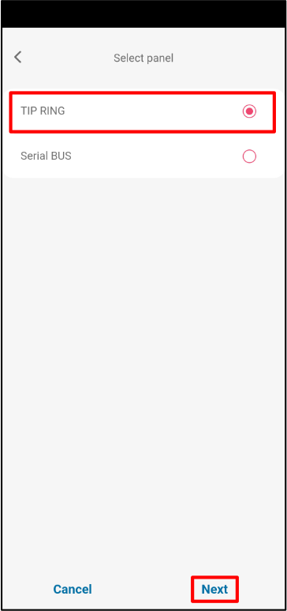

# Paradox SP(+)/MG(+) su GT/GT+/GET greitas paruošimas

Trumpi pajungimo ir programavimo žingsniai, skirti prijungti GT/GT+/GET komunikatorių prie Paradox SP/SP+/MG/MG+ centralės naudojant TIP/RING ir KeyBus, tada pridėti sistemą į Protegus2. Naudokite kartu su pilnais vadovais kitiems nustatymams. (Gnybtų pavadinimai GT/GT+/GET gali nežymiai skirtis, tačiau jungtys yra tokios pačios.)

!!! caution "Atsargiai"
    Montavimą ir aptarnavimą gali atlikti tik kvalifikuoti specialistai. Prieš jungdami laidus atjunkite maitinimą. Neautorizuoti pakeitimai panaikina garantiją.

## Reikalavimai

1. GT/GT+/GET programinės įrangos versija 1.21, įdėta SIM kortelė, PIN išjungtas, aktyvus duomenų planas.
1. Paradox SP/SP+/MG/MG+ centralė su klaviatūros prieiga (yra montuotojo kodas).
1. CMS paskyros numeris, jei pranešimai siunčiami į CMS.
1. Protegus2 įmonės/montuotojo paskyra ir komunikatoriaus IMEI.

## Pajungimas

Vadovaukitės schema žemiau ir prijunkite komunikatorių prie centralės:

| GT/GT+/GET gnybtas | Paradox centralė | Pastabos |
| --- | --- | --- |
| TIP / RING | TIP / RING | PSTN linijos emuliacijai (Contact ID). |
| CLK / DATA (KeyBus) | YEL / GRN (KeyBus) | Serijiniam magistralės valdymui. |
| +12V / GND | AUX + / GND | Maitinimas komunikatoriui. |

## Paradox panelės programavimas (LCD klaviatūra)

Naudokite panelės klaviatūrą, kad įjungtumėte Contact ID ir nustatytumėte paskyrų numerius:

1. Įeikite į montuotojo programavimą: `[ENTER] 0000` (arba jūsų montuotojo kodas).
2. Skiltis 801: bendros telefoninės linijos parinktys → palikite numatytas, jei nereikia keisti.
3. Skiltis 811: įveskite 1 skaidinio paskyros numerį (pavyzdys `1111`; naudokite savo CMS reikšmę).
4. Skiltis 812: įveskite 2 skaidinio paskyros numerį (pavyzdys `2222`; naudokite savo CMS reikšmę).
5. Skiltis 815: įveskite telefono numerį pranešimams (pavyzdys `123456`; naudokite savo CMS reikšmę).
6. Skiltis 911: nustatykite PC slaptažodį (pavyzdys `1234`; nustatykite pagal politiką).
7. Paspauskite `[CLEAR]`, kad išeitumėte iš programavimo.

Jei jūsų klaviatūros kodai skiriasi, vadovaukitės pilnu Paradox vadovu.

## Sistemos pridėjimas į Protegus2 (mobiliajame įrenginyje arba naršyklėje)

  

    <strong>Žingsnis 1.</strong> Paspauskite <strong>Pridėti naują sistemą</strong>.
    
  

  

    <strong>Žingsnis 2.</strong> Įveskite komunikatoriaus <strong>IMEI</strong>, paspauskite <strong>Toliau</strong>.
    
  

  

    <strong>Žingsnis 3.</strong> Pasirinkite <strong>TIP RING</strong>, paspauskite <strong>Toliau</strong>.
    
  

  

    <strong>Žingsnis 4.</strong> Paspauskite <strong>Atgal</strong>.
    
  

  

    <strong>Žingsnis 5.</strong> Pasirinkite <strong>Serial BUS</strong>, paspauskite <strong>Toliau</strong>.
    
  

  

    <strong>Žingsnis 6.</strong> Pasirinkite <strong>PARADOX</strong>.
    
  

  

    <strong>Žingsnis 7.</strong> Pasirinkite <strong>PARADOX SP+/MG+ series KeyBus</strong>.
    
  

  

    <strong>Žingsnis 8.</strong> Įveskite <strong>Primary Object ID</strong>, paspauskite <strong>Toliau</strong>.
    
  

  

    <strong>Žingsnis 9.</strong> Palaukite, kol įrašomi duomenys.
    
  

  

    <strong>Žingsnis 10.</strong> Paspauskite <strong>Toliau</strong>.
    
  

  

    <strong>Žingsnis 11.</strong> Įveskite sistemos <strong>Pavadinimą</strong>, paspauskite <strong>Toliau</strong>.
    
  

  

    <strong>Žingsnis 12.</strong> Paspauskite <strong>Praleisti</strong> (jei dabar nepridedate naudotojų).
    
  

  

    <strong>Žingsnis 13.</strong> Palaukite ~1 minutę, kol užbaigiama.
    
  

  

    <strong>Žingsnis 14.</strong> Konfigūracija baigta.
    
  

!!! tip "Patarimas"
    Jei Protegus2 negali užbaigti duomenų įrašymo, patikrinkite KeyBus (YEL/GRN) pajungimą, IMEI įvedimą ir ar CMS/Contact ID nustatymai išsaugoti panelėje.
