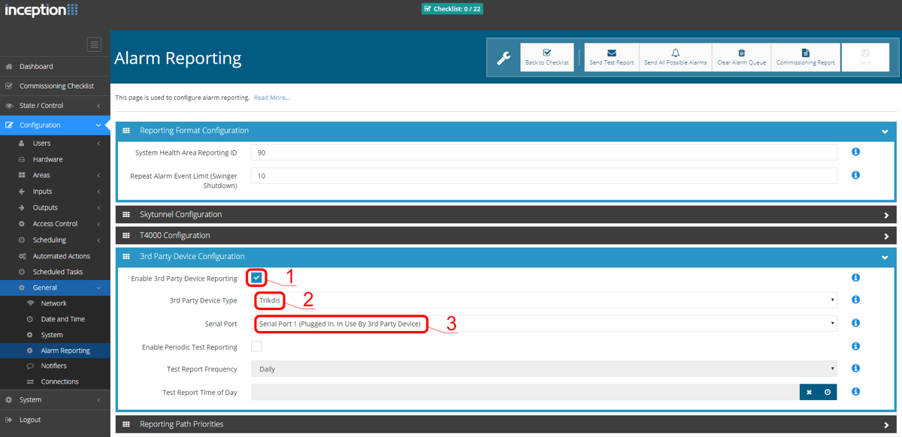

# „Ethernet“ komunikatorius E16

  

## 1. Aprašymas 

„Ethernet“ komunikatorius E16 gali būti tiesiogiai prijungtas prie DSC, Paradox, UTC Interlogix (CADDX), Innerrange, Texecom, Honeywell,Crow ir Pyronix apsaugos centralių.

Komunikatorius gali perduoti pilną įvykių informaciją į saugos tarnybos stebėjimo pulto imtuvą.

Komunikatorius veikia su Protegus2 programėle. Su Protegus2 vartotojai gali valdyti savo signalizaciją nuotoliniu būdu ir gauti pranešimus apie įvykius. Protegus2 programėlė veikia su visomis kitų gamintojų apsaugos sistemomis, kurias palaiko komunikatorius E16. Komunikatorius gali siųsti pranešimus į saugos tarnybos pultą ir veikti su Protegus2 vienu metu.

Kitų gamintojų centralėms naudokite komunikatorių E16T.

**Savybės**

Prijungiamas prie centralės duomenų arba klaviatūros magistralės.

Siunčia įvykius į stebėjimo pulto imtuvą:

- Siunčia įvykius į TRIKDIS programinius arba aparatūrinius imtuvus, kurie dirba su bet kuria stebėjimo programa.

- Gali siųsti įvykius į SIA DC-09 imtuvus.

- Gali siųsti įvykius į SUR-GARD imtuvus. Priede yra kodų (Contact ID į SIA) keitimo lentelė.

- Ryšio stebėjimas siunčiant PING užklausą į IP imtuvą kas 30 sekundžių (arba kitu nustatytu periodu).

- Atsarginis kanalas, kuris bus naudojamas nutrūkus ryšiui pirminiu kanalu.

- Įgalinus lygiagrečius ryšio kanalus, įvykiai bus siunčiami į du imtuvus vienu metu.

- Kai įjungta *Protegus* paslauga, įvykiai visų pirma siunčiami į CSP ir tik po to - programėlės naudotojams.

Veikia su Protegus2 programėle:

- “*Push*” ir specialūs garso įspėjimai apie įvykius.

- Nuotolinis sistemos įjungimas/išjungimas.

- Nuotolinis prijungtų įrenginių valdymas (šviesų, vartų, kondicionieriaus, šildymo, pievutės laistymo ir kt.).

- Temperatūros stebėsena (su išplėtėju iO arba iO-WL).

- Skirtingos vartotojų teisės administratoriui ir instaliuotojui.

**Informuoja vartotojus:**

- Vartotojus galima informuoti apie įvykius su Protegus2 programėle.

**Valdomi išėjimai ir įėjimai:**

- 3 universalus I/O gnybtai, kurios galima nustatyti kaip įėjimo (IN) arba išėjimo (OUT) gnybtą.

- Išėjimai valdomi su Protegus2 programėle.
- Pridėkite papildomų įėjimų ir valdomų išėjimų su laidiniais ir belaidžiais iO plėtikliais.

**Greitai sukonfigūruojamas:**

- Nustatymai gali būti išsaugoti į failą ir greitai įrašyti į kitus komunikatorius.

- Du prieigos prie nustatymų lygiai: instaliuotojui ir CSP administratoriui.

- Nuotolinis konfigūravimas ir programinės įrangos atnaujinimas.

### 1.1 Suderinamų centralių sąrašas 

| Gamintojas | Modelis |
|------------|---------|
| DSC® | <u>PC585</u>, PC1404, <u>PC1565</u>, <u>PC1616</u>, <u>PC1832</u>, <u>PC1864</u>, PC5020 |
| PARADOX® | <u>SPECTRA SP4000</u>, <u>SP5500</u>, <u>SP6000</u>, <u>SP7000</u>, <u>SP65</u>, <u>SP5500+</u>, <u>SP6000+</u>, <u>SP7000+</u> |
| PARADOX® | <u>MAGELLAN MG5000</u>, <u>MG5050</u>, MG5050E, <u>MG5050+</u> |
| PARADOX® | <u>DIGIPLEX EVO192</u>, <u>EVOHD</u>, NE96, EVO48, EVO96 |
| PARADOX® | SPECTRA 1727, 1728, 1738 |
| PARADOX® | ESPRIT E55, 728ULT, 738ULT |
| UTC Interlogix® | <u>NetworX (Caddx) NX-4v2</u>, <u>NX-6v2</u>, <u>NX-8v2</u>, <u>NX-8E</u> |
| Texecom® | Premier 412, 816, 832, 832+ /​ <u>Premier 24</u>, <u>48</u>, <u>88</u>, <u>168</u> /​ <u>Premier Elite 12</u>, <u>24</u>, <u>48</u>, <u>64</u>, <u>88</u>, <u>168</u> |
| Pyronix® | MATRIX 424, MATRIX 832, MATRIX 832+, MATRIX 6, MATRIX 816 |
| Innerrange® | Inception, Integriti |
| Honeywell® | <u>Ademco Vista-15</u>, <u>Ademco Vista-20</u>, <u>Ademco Vista-48</u> |
| Crow® | Runner 4/​8, Runner 8/​16 |

\***<u>Pabraukta</u>** – centralės, tiesiogiai valdomos su E16. Tiesiogiai valdomų PARADOX centralių veikimo programos versija turi būti ne žemesnė nei V.4.

\*Kitų gamintojų centrales prijunkite su komunikatoriu E16T.

### 1.2 Techniniai parametrai 

| Parametras | Aprašymas |
|----|:---|
| Universalus įėjimas/​išėjimas [I/​O] | 3 vnt., nustatomas kaip įėjimas IN, kurio tipas: NC;​ NO;​ NC/​EOL;​ NO/​EOL;​ NC/​DEOL;​ NO/​DEOL. (2,2 kΩ);​ arba išėjimas OUT: atviro kolektoriaus (OC) tipas, iki 0,15 A, 30 V DC maks. /​ Galima praplėsti su iO serijos plėtikliais. |
| Maitinimo įtampa | 10-18 V nuolatinės srovės |
| Naudojama srovė | 100 mA (budėjimo režime) /​ Iki 250 mA (duomenų siuntimo metu) |
| „Ethernet“ ryšys | IEEE802.3, 10 Base-T, RJ45 lizdas |
| Perdavimo protokolai | TRK, DC-09_2007, DC-09_2012, TL150 |
| Pranešimo šifravimas | AES 128 |
| Atmintis | Iki 60 pranešimų |
| Veikimo konfigūravimas | Su kompiuterine programa TrikdisConfig nuotoliniu būdu arba lokaliai per USB Mini-B. |
| Darbo aplinkos sąlygos | Temperatūra nuo -10 °C iki +50 °C, santykinė drėgmė – iki 80%, prie +20 °C. |
| Komunikatoriaus matmenys | 88 x 65 x 25 mm |
| Svoris | 80 g |

### 1.3 Komunikatoriaus elementai 

1.  Šviesos indikatoriai.

2.  Priekinio dangtelio atidarymo plyšys.

3.  Gnybtai laidų prijungimui.

4.  USB Mini-B jungtis komunikatoriui programuoti.

5.  RJ45 lizdas LAN kabeliui prijungti.

### 1.4 Išorinių kontaktų paskirtis 

| Gnybtas | Aprašymas |
|---------|-----------|
| +DC | maitinimo gnybtas (10-18 V nuolatinės srovės teigiamas gnybtas) |
| -DC | maitinimo gnybtas (10-18 V nuolatinės srovės neigiamas gnybtas) |
| CLK | Serijinio prievado gnybtai tiesioginiam prijungimui prie centralės |
| I/​O 1 | 1as įėjimo/​išėjimo gnybtas |
| I/​O 2 | 2as įėjimo/​išėjimo gnybtas |
| I/​O 3 | 3as įėjimo/​išėjimo gnybtas |
| COM | Bendras (neigiamas) |
| A 485 | RS485 gnybtai prijungti iO įėjimų ir išėjimų plėtiklį arba kitus priedus |

### 1.5 Šviesinė veikimo indikacija 

| Indikatorius | Būklė | Aprašymas |
|--------------|-------|-----------|
| NETWORK | Nešviečia | Neprijungtas prie kompiuterinio tinklo |
| NETWORK | Šviečia žaliai | Komunikatorius prisijungė prie kompiuterinio tinklo. |
| DATA | Nešviečia | Nėra neišsiųstų įvykių pranešimų. |
| DATA | Šviečia žaliai | Yra neišsiųstų pranešimų. |
| DATA | Mirksi žaliai | (konfigūravimo režimas) duomenys perkeliami į komunikatorių arba iš jo. |
| POWER | Nešviečia | Nėra maitinimo. |
| POWER | Šviečia žaliai | Maitinimo įtampa yra pakankama. |
| POWER | Šviečia geltonai | Maitinimo įtampa yra nepakankama (≤11.5 V). |
| POWER | Šviečia žalia ir mirksi geltona | (konfigūravimo režimas) komunikatorius parengtas konfigūravimui. |
| POWER | Šviečia geltona | (konfigūravimo režimas) nėra ryšio su kompiuteriu. |
| TROUBLE | Nešviečia | Komunikatorius veikia gerai, be nesklandumų. |
| TROUBLE | 1 raudonas mirksnis | Prisijungimo klaida „fiziniame“ lygmenyje (PHY Link status error), patikrinti LAN kabelį |
| TROUBLE | 2 raudoni mirksniai | DHCP klaida |
| TROUBLE | 3 raudoni mirksniai | DNS klaida |
| TROUBLE | 6 raudoni mirksniai | Nėra ryšio su imtuvu |
| TROUBLE | 7 raudoni mirksniai | Dingo ryšys su centrale. |
| TROUBLE | Mirksi raudonai | (konfigūravimo režimas) atminties klaida. |
| TROUBLE | Šviečia raudonai | (konfigūravimo režimas) programinės įrangos klaida. |

### 1.6 „Ethernet“ komunikatoriaus E16 panaudojimo struktūrinė schema 

!!! note
    Prieš pradėdami įrengimą, įsitikinkite, kad turite:
    
    1.  USB Mini-B tipo kabelį, reikalingas konfigūravimui.
    
    2.  Mažiausiai 4 gyslų kabelį komunikatoriaus prijungimui prie apsaugos
        centralės.
    
    3.  CRP2 kabelį Paradox centralių prijungimui prie nuosekliojo prievado.
    
    4.  Plokščią 2,5 mm atsuktuvą.
    
    5.  Apsaugos centralės instrukcija, prie kurios bus jungiamas
        komunikatorius.
    
    Reikalingas medžiagas galite užsisakyti iš vietinio platintojo.
## 2. Greitas konfigūravimas su programa *TrikdisConfig* 

1.  Parsisiųskite konfigūravimo programą TrikdisConfig iš [www.trikdis.lt](http://www.trikdis.lt) (programą rasite paieškos lauke surinkę „TrikdisConfig“), ir ją įdiegite*.*

2.  Plokščiu atsuktuvu nuimkite E16 dangtelį kaip parodyta žemiau:

    

3.  Su USB Mini-B kabeliu sujunkite E16 su kompiuteriu.

4.  Paleiskite TrikdisConfig. Programa automatiškai atpažins prijungtą gaminį ir atidarys E16 konfigūravimo langą.

5.  Spustelkite programos mygtuką **Skaityti [F4]**, kad ji pateiktų esamas E16 veikimo parametrų reikšmes. Jei atsivers administratoriaus arba instaliatoriaus kodo įvedimo reikalavimo langelis, įveskite 6 skaitmenų kodą.

Žemiau aprašome nustatymus, kuriuos reikia pakeisti, kad komunikatorius pradėtų siųsti pranešimus į Stebėjimo pultą ir kad apsaugos centralę būtų galima valdyti su Protegus2 programėle.

### 2.1 Nustatymai ryšiui su Protegus2 programėle 

**Lange „Sistemos parinktys“:**

1.  Pasirinkite **Centralės modelį**, kurį jungsite prie komunikatoriaus.

2.  Pažymėkite varnele **Nuotolinis centralės valdymas**, jei norite, kad vartotojai galėtų valdyti centralę Protegus2 programėlėje su savo klaviatūros kodu. Šis nustatymas rodomas tiesiogiai valdomoms centralėms.

3.  Paradox ir Texecom centralių tiesioginiam valdymui įveskite **Centralės PC download/UDL slaptažodį**. Jis turi sutapti su slaptažodžiu, kuris įvestas centralėje.

!!! note
    Kad veiktų tiesioginis centralės valdymas, reikės pakeisti centralės
    nustatymus. Kaip tai padaryti aprašyta skyriuje **4 „Apsaugos**
    centralių programavimas**"**. Šiame skyriuje aprašyta ir kaip pakeisti
    centralės PC download/UDL slaptažodį.
**Lango „Pranešimai vartotojui“ kortelėje „PROTEGUS servisas“:**

4. Pažymėkite varnele **Leisti prisijungti** prie Protegus serviso.

2.  Pakeiskite prisijungimo prie **PROTEGUS Cloud prieigos kodą**, jeigu norite, kad vartotojų prašytų jį suvesti pridedant sistemą Protegus2 programėlėje (gamyklinis – 123456).

Baigę konfigūravimą paspauskite mygtuką **Įrašyti [F5]** ir atjunkite USB kabelį.

!!! note
    Plačiau apie kitus E16 nustatymus TrikdisConfig žr. **6
    „TrikdisConfig langų aprašymas".**
### 2.2 Nustatymai ryšiui su Stebėjimo pultu 

**Lange „Sistemos parinktys“:**

1.  Įrašykite **Objekto numerį (Nenaudoti FFFE, FFFF objekto numerių**.**)**.

2.  Pasirinkite **Centralės modelį**, kurį jungsite prie komunikatoriaus.

Lange „Pranešimai į CSP“, parinkčių grupėje „Pirminis ryšio kanalas“:

3. **Ryšio būdas** – pasirinkite **IP** ryšio būdą .

2.  **Protokolas** – pasirinkite, kuria koduote turėtų būti siunčiami pranešimai: **TRK** (į TRIKDIS imtuvus); **DC-09_2007** arba **DC-09_2012** (į universalius imtuvus); **TL150** (į SUR-GARD imtuvus).

3.  **TRK šifravimo raktas** – įrašykite šifravimo raktą, kuris yra nustatytas imtuve.

4.  **Domenas arba IP** – įrašykite imtuvo domeno arba IP adresą.

5.  **Prievadas** – įrašykite imtuvo prievado (*angl. port*) numerį tinkle.

6.  **TCP arba UDP** – pasirinkite, kuriuo protokolu (TCP arba UDP) turėtų būti siunčiami pranešimai.

!!! note
    Jei pasirinkote **DC-09** pranešimų perdavimo koduotę, papildomai **  **
     / **Langas "Pranešimai į** CSP", skirtuke **Parametrai**, įveskite
    objekto, linijos ir imtuvo numerius.
7. (Rekomenduojama) Sukonfigūruokite **Atsarginio kanalo režimo** nustatymus.

2.  (Rekomenduojama) Sukonfigūruokite **Lygiagretaus kanalo** ir jo **Lygiagretaus atsarginio ryšio** kanalų nustatymus.

Baigę konfigūravimą paspauskite mygtuką **Įrašyti [F5]** ir atjunkite USB kabelį.

!!! note
    Plačiau apie kitus E16 nustatymus TrikdisConfig žr. skyrių
    **6 „TrikdisConfig langų aprašymas"**.
## 3. Sujungimų schemos, įrengimas ir paleidimas veikti 

### 3.1 Apsaugos centralių prijungimo schemos su komunikatoriumi 

Sujunkite komunikatorių su centrale pagal vieną iš žemiau pateiktų prijungimo schemų.

### 3.2 E16 prijungimo prie centralės jungiklio (angl. keyswitch) zonos schema 

Vadovaukitės šia schema, jei apsaugos centralė bus valdoma su E16 PGM išėjimu įjungiant/išjungiant centralės jungiklio (angl. keyswitch) zoną.

!!! note
    E16 komunikatorius turi 3 universalius įėjimo/išėjimo gnybtus,
    kuriems galima nustatyti išėjimo OUT (PGM) veikimo režimą. Išėjimai gali
    valdyti tris apsaugos sistemos sritis. Valdant šiuo būdu,
    TrikdisConfig lange Langas „Sistemos parinktys" turi būti nuimta
    varnelė prie **Nuotolinis centralės valdymas**. Programėlėje
    Protegus2 reikia padaryti nustatymus, kurie aprašyti
    p. 5.2 „Papildomi nustatymai sistemos įjungimui/išjungimui su jungiklio
    zoną".

### 3.3 Įėjimo prijungimo schemos 

Komunikatorius turi 3 universalius įėjimo/išėjimo gnybtus, kuriems galima nustatyti įėjimo IN veikimo režimą. Prie įėjimo gnybto galima prijungti NC, NO, NO/EOL, NC/EOL, NO/DEOL, NC/DEOL tipo grandines. Gamyklinis įėjimo nustatymas – stebėti NO tipo grandinę. Kitą įėjimo tipą galima nustatyti TrikdisConfig lange**Langas „Sistemos** parinktys“ **-> Tipas**.

NC, NO, NO/EOL, NC/EOL, NO/DEOL, NC/DEOL tipo grandinių laidinių sujungimų schemos:

!!! note
    Jei reikia, kad komunikatorius turėtų daugiau įėjimų IN arba išėjimų
    OUT, arba turėtų magistralę temperatūros jutikliui, prijunkite laidinį
    arba belaidį TRIKDIS iO serijos įėjimų ir išėjimų plėtiklį.
### 3.4 LAN kabelio prijungimas 

### 3.5 Relės prijungimo schema 

Nuotoliniu būdu su relės kontaktais galima valdyti (įjungti/išjungti) įvairius elektrinius prietaisus. Komunikatoriaus universaliam įėjimo/išėjimo gnybtui turi būti nustatytas išėjimo OUT veikimo režimas.

### 3.6 iO serijos plėtimo modulių prijungimo schemos 

Jei reikia, kad komunikatorius turėtų daugiau įėjimų IN arba išėjimų OUT, arba turėtų magistralę temperatūros jutikliui, prijunkite laidinį arba belaidį TRIKDIS iO serijos įėjimų ir išėjimų plėtiklį. E16 konfigūravimas su plėtimo moduliais aprašytas p. 6.7. „Langas „RS485 moduliai“.

### 3.7 Komunikatoriaus paleidimas veikti 

Norint paleisti veikti komunikatorių, reikia įjungti apsaugos centralės maitinimo šaltinį. Turi užsidegti ši E16 komunikatoriaus šviesinė indikacija:

- Diodas „POWER“ turi šviesti žaliai (pakankama maitinimo įtampa);

- Diodas „NETWORK“ turi šviesti žaliai , kai komunikatorius prisijungęs prie tinklo.

!!! note
    Jei šviesinė indikacija kitokia, kad nustatytumėte, kas nutikę žiūrėkite
    skyrių **1.5 „Šviesinė veikimo indikacija".** / Jei E16 indikacija
    visai nešviečia, patikrinkite maitinimo šaltinį ir sujungimus.
## 4. Apsaugos centralių programavimas 

Žemiau aprašome, kaip reikia programuoti apsaugos centrales, kad komunikatorius E16 galėtų nuskaityti centralės pranešimus ir ją tiesiogiai valdyti nuotoliniu būdu.

Jei norite įgalinti nuotolinį centralės valdymą, įsitikinkite, kad yra uždėta varnelė prie **Nuotolinis centralės valdymas** TrikdisConfig lange Langas „Sistemos parinktys“.

### 4.1 DSC

DSC centralių programuoti nereikia.

### 4.2 PARADOX

Paradox centrales reikia programuoti tik tiesioginiam valdymui su Protegus. Pranešimų nuskaitymui Paradox centralių programuoti nereikia.

Nuotoliniam Paradox centralių valdymui reikia nustatyti PC prisijungimo slaptažodį (angl. „*PC download password*“). Šis slaptažodis turi sutapti su slaptažodžiu, kurį nustatėte TrikdisConfig lange **Langas „Sistemos** parinktys“ uždėjus varnelę **Nuotolinis centralės valdymas** atsiradusiame lauke.

Norėdami nustatyti šį slaptažodį, su prie apsaugos centralės prijungta klaviatūrą:

- MAGELLAN, SPECTRA serijose: eikite į ląstelę 911 ir įveskite 4 skaičių PC prisijungimo slaptažodį.

- DIGIPLEX EVO serijai: eikite į ląstelę 3012 ir įveskite 4 skaičių PC prisijungimo slaptažodį.

### 4.3 TEXECOM

Texecom centrales reikia programuoti tiek pranešimų nuskaitymui, tiek ir nuotoliniam valdymui.

Reikia nustatyti Texecom centralės **UDL** **passcode**. Šis slaptažodis turi sutapti su slaptažodžiu, kurį nustatėte TrikdisConfig lange **Langas** „Sistemos parinktys“ uždėjus varnelę **Nuotolinis centralės valdymas** atsiradusiame lauke.

Centralę galite programuoti su Texecom programine įranga Wintex. Įveskite **UDL passcode** (4 skaičių kodas) lange **Communication Option**, skirtuke **Options**.

Taip pat galite programuoti ir su prie apsaugos centralės prijungta klaviatūra:

1.  Įveskite 4 skaitmenų instaliuotojo kodą ir paspauskite [Menu] mygtuką, kad įeitumėte į programavimo meniu.

2.  Iškart po to paspauskite mygtuką [9].

3.  Paspauskite [7][6], ir tada [2]. Įveskite 4 skaitmenų **UDL** **passcode** (**UDL passcode** turi sutapti su E16 komunikatoriaus **PC prisijungimo slaptažodžiu**).

4.  Paspauskite [Yes] ir išeikite iš programavimo rėžimo paspaudę [Menu].

### 4.4 UTC INTERLOGIX(CADDX)

Centralės programinės įrangos versija turi būti **V2** arba aukštesnė**.** Prie centralės prijungtoje klaviatūroje:

1.  Paspauskite [\*][8] ir įveskite instaliuotojo kodą (gamyklinis 9713).

2.  Įveskite įrenginio numerį, kuris priskirtas prijungtam komunikatoriui (gamyklinis – 0).

3.  Nustatykite žemiau kiekvienoje eilutėje nurodytus nustatymus. Iš eilės paspauskite vietos, segmento skaičius ir įveskite reikiamą nustatymą. Paspaudus [\*] (žvaigždutę) jus sugrąžins į vietos įvedimo lauką.

| Vieta | Segmentas | Nustatymas |
|-------|-----------|------------|
| 23 | 3 | 12345678 |
| 37 (nebūtina) | 3 | 12345678 |
| 37 (nebūtina) | 4 | 1234567* |
| 90 | 3 | 12345678 |
| 93 | 3 | 12345678 |
| 96 | 3 | 12345678 |
| 99 | 3 | 12345678 |
| 102 | 3 | 12345678 |
| 105 | 3 | 12345678 |
| 108 | 3 | 12345678 |

Suprogramavę visus nurodytus laukus, paspauskite [Exit] du kartus, kad išeitumėte iš programavimo režimo.

### 4.5 INNERRANGE

**Innerrange Inception** centralės programinės įrangos versija turi būti **2.3.0.3507-r0** arba aukštesnė.

Centralę turi būti prijungta prie interneto. Prisijunkite prie **Innerrange Inception** centralės surinkę: <https://skytunnel.com.au/inception/SERIALNUMBER>, kur SERIALNUMBER – įvedamas valdiklio serijinis numeris, kuris nurodytas ant centralės korpuso.

Atidarykite langus **Configuration>General>Alarm Reporting**. Parinkčių grupėje **3rd Party Device Reporting** reikia nustatyti:

1.  **Enable 3rd Party Device Reporting** – pažymėti šį lauką.

2.  **3rd Party Device Type** – nustatyti „Trikdis“.

3.  **Serial port** – nustatyti „Serial Port 1 (Plugged In, In Use By 3rd Party Device)“.

4.  Išsaugoti nustatymus ir išeiti iš programos.

**Innerrange Integriti**. Centralės programinės įrangos versija turi būti **19.1.0.36608**, profesionalios programinės įrangos versija **19.1.0.15396** arba aukštesnė.

Centralės konfigūravimo programoje nurodykite Trikdis ryšio protokolą. Duomenų formatas Contact ID. Centralės prievadui TTL Port-0, prie kurio prijungtas komunikatorius E16, numatytieji parametrai 19200, 8, N, 1. Išsaugokite nustatymus ir išeikite iš programos.

### 4.6 Honeywell Ademco Vista

Programavimas skirtas centralėms **Honeywell Ademco Vista-20** ir **Honeywell Ademco Vista-48**. **Centralės veikimo programos versija turi būti ne žemesnė nei V5.3**. Prie centralės prijungtoje klaviatūroje:

1.  Įeiti į programavimo režimą. Įveskite instaliuotojo kodą [4] [1] [1] [2] ir po to [8] [0] [0] . Arba įjunkite centralės maitinimą. 50 sek. bėgyje, po maitinimo įjungimo, nuspauskite kartu mygtukus [\*] ir [#] (šis metodas taikomas, kai buvo išeita iš programavimo režimo nuspaudžiant klaviatūroje [\*][9][8] ).

2.  Įjunkite CID siuntimą per LRR. Klaviatūroje nuspauskite [\*][2][9][1][#].

3.  Naudojant „**Nuotolinis centralės valdymas**“ funkcija, leiskite naudoti 2-ą AUI adresą. Klaviatūroje nuspauskite [\*][1][8][9][1][1][#] .

4.  Išeikite iš programavimo režimo. Klaviatūroje nuspauskite [\*][9][9].

### 4.7 Crow

Crow Runner 4/8 ir Runner 8/16 centralių programuoti nereikia.

## 5. Nuotolinis valdymas 

### 5.1 Apsaugos sistemos pridėjimas Protegus2 programėlėje 

Su Protegus2 vartotojai galės valdyti savo apsaugos sistemą nuotoliniu būdu. Jie taip pat matys sistemos būseną ir gaus pranešimus apie sistemos įvykius.

1.  Parsisiųskite ir paleiskite Protegus2 programėlę arba naudokite versiją naršyklėje [www.protegus.app](https://www.protegus.app):

    

      
      
      
    

2.  Registruokitės ir susikurkite naują paskyrą arba prisijunkite savo vartotojo vardu ir slaptažodžiu.

!!! note
    Pridėjimo prie Protegus2 metu E16 turi būti:
    
    1.  Įjungta Protegus servisas paslauga. Žr. **6.4 Langas
        „Pranešimai vartotojui"**;
    
    2.  Įjungtas maitinimas („POWER" LED šviečia žaliai);
    
    3.  Prisiregistravęs prie tinklo („NETWORK" LED šviečia žaliai ).
3. Paspauskite **Pridėti sistemą** ir įveskite E16 MAC adresą. MAC adresą rasite ant gaminio ir pakuotės lipduko. Įvedę, paspauskite „**Toliau**“.
4. Paspauskite “Pridėti sistemą” ir įveskite *E16* MAC adresą. MAC adresą rasite ant gaminio ir pakuotės lipduko. Įvedę, paspauskite „Toliau“.
1.  Įveskite sistemos „Pavadinimą“. Spustelėkite „Toliau".

### 5.2 Papildomi nustatymai sistemos įjungimui/išjungimui su jungiklio zoną 

!!! note
    Centralės zonai, prie kurios prijungtas E16 išėjimas OUT, turi
    būti nustatytas zonos tipas - jungiklis (angl. keyswitch).
Sekite nurodymus žemiau, jei apsaugos centralė bus valdoma su E16 PGM išėjimu įjungiant/išjungiant centralės jungiklio (angl. keyswitch) zoną.

1.  Paspauskite „**Tęsti**“.

2. Įveskite „**Srities pavadinimas**“. Įgalinkite PGM išėjimo valdymą naudodami Protegus2 programą.

2.  Pasirinkite "**Impulsas**" arba "**Lygis**", priklausomai nuo to, kaip sukonfigūruotas centralės jungiklio zonos tipas. Jei reikia, galite pakeisti „**Impulso**“ intervalą.
3. Paspauskite „**Išsaugoti**“.

4. Jei apsaugos sistemoje yra kita sritis, tuomet reikia spustelėti „**Spustelėkite, kad pridėtumėte sritį**“. PGM išvesties nustatymas yra panašus į aprašytą aukščiau.

2.  Atlikę nustatymus, spustelėkite mygtuką „**Praleisti**“.

### 5.3 Sistemos įjungimas/išjungimas su *Protegus2* 

1.  Pagrindiniame lange spustelėkite būsenos piktogramą „Išjungti“.
1.  *Protegus2* gaus pranešimą apie pasikeitusią apsaugos sistemos būseną ir būsenos piktograma pakeis jos būseną.

## 6. TrikdisConfig langų aprašymas 

### 6.1 *TrikdisConfig* būsenos juostos aprašymas 

Prijungus E16 TrikdisConfig būsenų juostoje pateiks informaciją apie prijungtą gaminį.

| Pavadinimas | Aprašymas |
|----|----|
| MAC/​Unikalus Nr. | Gaminio IMEI numeris |
| Būsena | Darbinė būsena |
| Įrenginys | Gaminio tipas (turi rodyti E16) |
| SN | Gaminio serijinis numeris |
| BL | Paleidyklės versija |
| FW | Gaminio programinės įrangos versija |
| HW | Gaminio aparatinės įrangos versija |
| Būsena | Sujungimo su programa būdas (per USB arba nuotolinis) |
| Rolė | Prieigos lygis (rodomas po to, kai patvirtintas prieigos kodas) |

Paspaudus mygtuką **Skaityti [F4]**, programa nuskaitys ir parodys nustatymus, kurie yra įrašyti E16. Su TrikdisConfig, nustatykite reikiamus nustatymus pagal žemiau pateiktus programos langų aprašymus.

### 6.2 Langas „Sistemos parinktys“ 

Parinkčių grupė „Pagrindinės“

- **Objekto numeris** – jei pranešimai bus siunčiami į CSP (centralizuoto stebėjimo pultą), įrašykite CSP suteiktą objekto numerį (4 simbolių šešioliktainis numeris, 0-9, A-F. **Nenaudoti FFFE, FFFF objekto numerių**.).

- Pasirinkite **Centralės modelį**, kurį jungsite prie komunikatoriaus.

- **Nuotolinis centralės valdymas** – kai langelį pažymėsite varnele, E16 centralę valdys tiesiogiai nuotoliniu būdu. Šis nustatymas rodomas tiesiogiai valdomoms centralėms. Tiesioginiam centralės valdymui reikia pakeisti apsaugos centralės nustatymus, tai aprašyta skyriuje **4 „Apsaugos centralių programavimas*“***.

  - **Centralės PC prisijungimo slaptažodis** – Paradox ir Texecom centralių tiesioginiam valdymui reikia suvesti PC/UDL slaptažodį. Jis turi sutapti su slaptažodžiu, kuris įvestas centralėje. Kaip pakeisti šį slaptažodį centralėje aprašyta skyriuje **4* „*Apsaugos centralių programavimas*“****.*

- **Laiko nustatymas** - pasirinkite, kurį serverį naudoti laiko sinchronizacijai.

Parinkčių grupė „Prisijungimas“

- **Administratoriaus kodas** – leidžia prieiti prie visų konfigūravimo funkcijų (gamyklinis kodas – 123456).

- **Instaliuotojo kodas** – leidžia ribotai keisti komunikatoriaus konfigūraciją (gamyklinis kodas – 654321).

- **„Atkurti” gali tik administratorius** – uždėjus varnelę, gaminiui atkurti gamyklinius parametrus bus leidžiama tik įvedus administratoriaus kodą.

**Pastaba**: jei laukelis **„Atkurti“ gali tik administratorius** pažymėtas, o administratoriaus kodo nežinote, gamyklinius parametrus galės atkurti tik gamintojas – UAB „Trikdis“. Paslauga mokama.

- **Instaliuotojui leisti keisti** – administratorius gali nustatyti, kuriuos parametrus galės keisti instaliuotojas.

### 6.3 Langas “Pranešimai į CSP” 

**Skirtukas „CSP parametrai“**

Komunikatorius siunčia pranešimus į stebėjimo pultą per laidinį internetą (IP).

Pranešimai gali būti siunčiami keliais ryšio kanalais. Pirmas ir antras (lygiagretusis) ryšio kanalai gali veikti lygiagrečiai, taip komunikatorius gali siųsti įvykius tuo pačiu metu į du imtuvus. Tiek pirmam, tiek ir antram kanalui galima priskirti atsarginį ryšio kanalą, kuris bus naudojamas nutrūkus ryšiui pirminiu kanalu.

Pranešimai į stebėjimo pultą perduodami užkoduoti ir apsaugoti slaptažodžiu. Pranešimams priimti ir perduoti į stebėjimo programą reikalingas TRIKDIS imtuvas:

- IP pranešimams – priėmimo programa IPcom Windows/Linux, aparatinis IP/SMS imtuvas RL14 arba daugiakanalis imtuvas RM14.

Parinkčių grupė „Pirmas ryšio kanalas”

- **Ryšio būdas** – pasirinkite ryšio su stebėjimo pulto imtuvu būdą (IP).

- **Protokolas** – **TRK** protokolu perduodamus įvykių pranešimus priims Trikdžio IP imtuvai; o **SIA DC-09** protokolais – IP imtuvai, gebantys priimti SIA DC-09 protokolais perduodamus įvykių pranešimus; **TL150** protokolu perduodamus įvykių pranešimus priims SUR-GARD IP imtuvai.

- **TRK šifravimo raktas** – 6 skaitmenų pranešimų šifravimo raktas. Į komunikatorių įrašytas šifravimo raktas turi būti toks, koks įrašytas į imtuvą, t.y. turi sutapti, būti vienodas.

- **Domenas arba IP** – įrašykite imtuvo domeno arba IP adresą.

- **Prievadas** – įrašykite imtuvo prievado (*angl. port*) numerį tinkle.

- **TCP arba UDP** – pasirinkite įvykių perdavimo protokolą (TCP arba UDP).

Parinkčių grupė „Lygiagretusis ryšio kanalas”

Šio kanalu pranešimai perduodami lygiagrečiai su pirmu kanalu. Įgalinus antrą kanalą pranešimai gali būti siunčiami vienu metu į du imtuvus (pvz., į lokalų ir į centralizuotą stebėjimo pultus). Lygiagretaus ryšio kanalo nustatymo laukai tokie patys kaip aprašyta aukščiau.

Parinkčių grupės „Atsarginio kanalo režimas”

Įgalinkite atsarginio kanalo režimą, kad, nutrūkus ryšiui, įvykiai būtų siunčiami atsarginiu kanalu. Sukonfigūruokite atsarginį kanalą, nustatymo laukai tokie patys kaip aprašyta aukščiau.

**Skirtukas „Parametrai“**

Parinkčių grupė „Parametrai“

- **Testo periodas** – ryšio tikrinimo TEST pranešimų periodas. Jie siunčiami kaip Contact ID pranešimai ir perduodami į stebėjimo programą.

- **IP ping periodas** – vidinių PING ryšio tikrinimo signalų siuntimo periodas. Šie pranešimai siunčiami tik IP kanalu.  
  Jų imtuvas neperduoda į stebėjimo programą, taip jos neapkraudamas. Į stebėjimo programą perduodama tik tada, kai imtuvas negauna PING pranešimo iš įrenginio per nustatytą laiką.

  Numatytai imtuvas perduos „*Connection lost*” prarasto ryšio pranešimą į stebėjimo programą praėjus trigubai ilgesniam laikui nei nustatytas komunikatoriaus PING pranešimo periodas. Pvz., jei nustatytas 3 minučių PING, imtuvas perduos prarasto ryšio pranešimą negavęs PING per 9 minutes.

  Kartu PING pranešimai palaiko aktyvią ryšio sesiją tarp įrenginio ir imtuvo. Aktyvi sesija reikalinga, kad komunikatorių būtų galima konfigūruoti ir valdyti nuotoliniu būdu. Rekomenduojame nustatyti ne ilgesnį nei 5 minučių PING periodą.

- **Pereiti į atsarginį po** - nurodomas nesėkmingų bandymų perduoti pranešimą Pagrindiniu kanalu skaičius. Nepavykus perduoti nustatytą skaičių kartų, įrenginys jungsis perduoti pranešimus Atsarginiu kanalu.

- **Grįžti iš atsarginio po** - laikas, kuriam pasibaigus, E16 bandys atstatyti ryšį ir perduoti pranešimus Pagrindiniu kanalu.

Parinkčių grupė „DC-09 parametrai“

Nustatymai rodomi, kai ryšio kanalo **Protokolas** lauke pasirinkta **DC-09_2007** arba **DC-09_2012** koduotė pranešimų siuntimui.

- **DC-09** **obj. Nr.** – <u>įveskite objekto numerį. Pasirinkus DC-09 koduotę, bus naudojamas šiame lauke įrašytas objekto numeris</u>. Galite įvesti 3-16 simbolių šešioliktainį numerį**,** kurį suteikia stebėjimo pultas.

- **DC-09 linijos Nr**. – įveskite linijos numerį imtuve.

- **DC-09 imtuvo Nr.** – įveskite imtuvo numerį.

### 6.4 Langas „Pranešimai vartotojui” 

**Skirtukas “Protegus servisas”**

Protegus paslauga leidžia vartotojams nuotoliniu būdu stebėti ir valdyti komunikatorių. Daugiau informacijos apie Protegus paslaugą rasite [www.protegus.app](https://www.protegus.app).

**Parinkčių grupė „Protegus servisas“**

- **Leisti prisijungti** – Protegus serviso įjungimas, E16 galės keistis duomenimis su Protegus2 programėle ir bus galima su TrikdisConfig atlikti konfigūravimą nuotoliniu būdu.

- **PROTEGUS Cloud prieigos kodas** - prisijungimo su Protegus2 6 skaitmenų kodas (gamyklinis kodas - 123456).

### 6.5 Langas “Ethernet parinktys” 

**Parinkčių grupė „Ethernet parinktys“**

- **Naudoti DHCP** - pažymėkite laukelį, kad komunikatorius automatiškai prisiregistruotų prie tinklo. Jei automatiniu būdu prisiregistruoti nepavyko, reikia rankiniu būdu įvesti:

  - **Statinis IP** – komunikatoriaus IP adresas.

  - **Potinklio kaukė** – potinklio kaukė.

  - **Numatytasis šliuzas** – prisijungimui prie interneto.
- **DNS1 ir DNS2** – (angl. Domain Name System) nurodomas serveris, kuris nurodo domeno IP adresą. Naudojamas, kai ryšio kanalo **Domenas arba IP** lauke nurodytas ne IP adresas, o domenas. Gamyklos nustatyti Google DNS serverių adresai.

### 6.6 Langas „IN/OUT“ 

Komunikatorius turi 3 universalius (įėjimo/išėjimo) gnybtus. Lentelėje galima nustatyti gnybtui veikimo režimą (Išjungta, IN, OUT). Įėjimui reikia nurodyti prijungiamos grandinės tipą NC, NO, NO/EOL, NC/EOL, NO/DEOL, NC/DEOL.

Prie komunikatoriaus įėjimų galima prijungti papildomus jutiklius. Suveikus jutikliui komunikatorius išsius pranešimą apie įvykį. Įėjimui priskiriamas Contact ID kodas, kuris bus išsiustas į CSP ir Protegus2.

- **Įgalinti** – pažymėkite įvykių laukus, kuriu pranešimai bus siunčiami į CSP ir Protegus2.

- **Į/A** – nurodykite komunikatoriaus vidinio įvykio siuntimo sąlyga (Įvykis arba Atsistatymas).

- **CID** – įvykio kodas.

- **Srit.** – įrašykite srities numerį, kuris bus siunčiamas įvykus vidiniam įvykiui ir atsistačius sistemai.

- **Zona** - įrašykite zonos numerį, kuris bus siunčiamas įvykus vidiniam įvykiui ir atsistačius sistemai.

### 6.7 Langas „RS485 moduliai“ 

Prie komunikatoriaus galima prijungti iO serijos plėtiklius, kuriais pridėsite papildomus įėjimus, valdomus išėjimus ir magistralę temperatūros jutikliams. Prijungti plėtikliai turi būti įtraukti į **Modulių sąrašo** lentelę.

Parinkčių grupė „Modulių sąrašas“

- **Nr** – modulio eilės numeris.

- **Modulio tipas** – iš sąrašo išrinkite prie komunikatoriaus RS485 magistralės prijungtą modulį.

- **Serijos numeris** – įveskite prijungto modulio serijinį numerį (6 skaitmenys). Numerį rasite ant lipduko, užklijuoto ant prijungto modulio arba jo įpakavimo dėžutės.

Pereikite prie **RS485 moduliai → Modulis.**

**Skirtukai „Modulis“**

Prie komunikatoriaus pridėjus plėtiklį kaip aprašyta aukščiau, **RS485 moduliai** lange atsiras naujas skirtukas su šio modulio nustatymais. Skirtukui suteikiamas eilės numeris. Žemiau aprašome nustatymų laukus iO-8 ir iO serijos plėtikliams.

**iO-8 plėtiklio nustatymų langas**

Plėtiklis iO-8 turi 8 universalius (įėjimo/išėjimo) gnybtus. Galima prijungti keturis iO-8 plėtiklius.

- **Įėjimų** **skaičius** - pasirinkite, kiek gnybtų priskirti įėjimo (IN) režimui. Likę kontaktai taps valdomais išėjimais (OUT).

Valdomų išėjimų nustatymai (priskirti išėjimą apsaugos sistemos įjungimui/išjungimui arba naudoti nuotoliniam įrenginių valdymui) atliekami tiesiogiai Protegus2 programėlėje.

Lentelėje įėjimams (INPUT) galima priskirti Contact ID įvykių ir atsistatymo kodus. Suveiksminus įėjimą, komunikatorius išsiųs pranešimą su nurodytu įvykio kodu į stebėjimo pulto imtuvą, Protegus2 programėlę.

**Contact ID įvykio kodas**:

- **Įgalinti** – leisti pranešimo siuntimą, kai suveiksminamas įėjimas.

- **Į/A** – galima pasirinkti, kokio tipo pranešimas bus siunčiamas suveiksminus įėjimą – **Įvykis** arba **Atsistatymas**.

- **CID** – įėjimui priskiriamas suveikimo Contact ID kodas.

- **Srit.** – nurodoma sritis, kuriai priskirtas įėjimas. Nusistato automatiškai: jei modulis Nr. 1, tai sritis 91; jei modulis Nr. 4, tai sritis 94.

- **Zona** – įėjimui priskiriamas zonos numeris, kuris bus įrašytas pranešime.

**Contact ID atsistatymo kodas**:

- **Įgalinti** - leisti pranešimo siuntimą, kai įvyksta atsistatymas.

- **Į/A** - galima pasirinkti, kokio tipo pranešimas bus siunčiamas įėjimui atsistačius – **Atsistatymas** arba **Įvykis**.

- **CID** - įėjimui priskiriamas atsistatymo Contact ID kodas.

- **Srit.** - nurodoma sritis, kuriai priskirti įėjimai. Nusistato automatiškai, jei modulis Nr. 1, tai sritis 91. Jei modulis Nr. 4, tai sritis 94.

- **Zona** - įėjimui priskiriamas zonos numeris, kuris bus įrašytas pranešime.

- **Įėjimo tipas** – nurodomas įėjimo tipas (NO arba NC).

**iO plėtiklio nustatymų langas**

Plėtiklis iO turi: 1 įėjimo, 1 išėjimo (relės kontaktai) gnybtus ir 1-Wire magistralę temperatūros jutiklio prijungimui.

Relės išėjimo valdymas galimas pagal loginių (IR, ARBA, XOR) sąlygų išpildymą.

- **Įėjimo IN1 tipas** – nurodomas įėjimo tipas (NO arba NC).

- **Max ◦C(T1)** – didžiausia ribinė temperatūros daviklio reikšmė, kurią viršijus bus formuojamas pranešimas apie įvykį. Kad būtų formuojamas pranešimas, jis turi būti įgalintas lentelėje.

- **Min ◦C(T2)** – mažiausia ribinė temperatūros daviklio reikšmė, žemiau kurios nukritus, bus formuojamas pranešimas apie įvykį. Kad būtų formuojamas pranešimas, jis turi būti įgalintas lentelėje.

- **Rėlės valdymas** – galite nustatyti logines (IR, ARBA, XOR) sąlygas, kurioms įvykus bus suvaldomas relinis išėjimas.

Lentelėje įvykiams galima priskirti Contact ID, SIA, 4+2 įvykių ir atsistatymo kodus. Suveiksminus įėjimą, komunikatorius pranešimą su nurodytu įėjimo kodu išsiųs į stebėjimo pulto imtuvą ir Protegus2 programėlę. Nustatykite kaip aprašyta ankstesniame puslapyje apie **iO-8 plėtiklio nustatymų langą**.

### 6.8 Langas „Įvykių aprašas” 

Šiame lange galima įjungti, išjungti ir pakeisti įrenginio siunčiamus vidinius pranešimus. Išjungus vidinį pranešimą šiame lange, jis nebus siunčiamas nepriklausomai nuo kitų nustatymų.

- **COMMUNICATION** – pranešimas apie ryšio sutrikimą tarp centralės ir E16.

- **POWER** – pranešimas apie žemą maitinimo įtampą.

- **REMOTE_STARTED** – pranešimas apie nuotolinį prisijungimą konfigūruoti E16 su TrikdisConfig.

- **REMOTE_FINISHED** – pranešimas apie atsijungimą nuo nuotolinio konfigūravimo su TrikdisConfig.

- **START** – pranešimas apie E16 prijungimą prie tinklo.

- **TEST** – periodinis testo pranešimas.

!!! note
    Norėdami įjungti periodinius TEST pranešimus ir nustatyti laikotarpį,
    eikite į / Langas **"Pranešimai į** CSP" **→ Parametrai
    → Testo periodas**.
- **Įgalinti** – pažymėjus varnele, įgalinamas pranešimo siuntimas.

Galite pakeisti kiekvieno įvykio Contact ID kodą, taip pat su pranešimu nurodomą zonos ir srities numerį.

### 6.9 Gamyklinių nustatymų atstatymas 

Norint atkurti komunikatoriaus gamyklinius nustatymus, reikia nuspausti programos TrikdisConfig mygtuką **Atkurti.**

1.  **Nuotolinis veikimo parametrų nustatymas**

!!! note
    Nuotolinis konfigūravimas veiks tik tuomet, kai E16:
    
    1.  Įjungta Protegus servisas paslauga. Žr. **6.4 Langas
        „Pranešimai vartotojui".**
    
    2.  Įjungtas maitinimas („POWER" LED šviečia žaliai).
    
    3.  Prisiregistravęs prie tinklo („NETWORK" LED šviečia žaliai).
2. Kompiuteryje paleiskite konfigūravimo programą TrikdisConfig.

2.  Lauke **Nuotolinė prieiga** įveskite komunikatoriaus *MAC adresą*. Šį adresą rasite ant įrenginio pakuotės ir nugarėlės lipdukų.

3. (Nebūtina) Langelyje **Sistemos pavadinimas** įveskite norimą komunikatoriaus pavadinimą.

2.  Paspauskite **Konfigūravimas**.

3.  Atsidariusiame lange paspauskite **Skaityti [F4]**. Programai paprašius, įveskite administratoriaus arba instaliuotojo kodą.

4.  Nustatykite norimus nustatymus ir pabaigę nuspauskite **Įrašyti [F5]**.

## 7. „Ethernet“ komunikatoriaus *E16* testavimas 

Kai konfigūravimas ir instaliavimas baigtas, atlikite sistemos patikrą:

1.  Patikrinkite, ar maitinimas yra įjungtas.

2.  Patikrinkite tinklo ryšį (NETWORK indikatorius šviečia žaliai).

3.  Sugeneruokite įvykį:

- įjungdami/išjungdami saugojimo režimą su apsaugos centralės klaviatūra;

- suveiksmindami centralės zoną esant įjungtam saugojimo režimui.

1.  Patikrinkite, ar įvykiai buvo gauti Centriniame stebėjimo pulte ir/arba Protegus2 programėlėje.

2.  Norėdami išbandyti komunikatoriaus įėjimą, suveiksminkite jį ir patikrinkite, ar gavėjai gauna teisingus pranešimus.

3.  Norėdami išbandyti komunikatoriaus išėjimus, juos įjunkite nuotoliniu būdu ir patikrinkite jų veikimą.

4.  Jei bus naudojamas nuotolinis centralės valdymas, įjunkite bei išjunkite centralės saugojimo režimą nuotoliniu būdu su Protegus2 programėle.

## 8. Programinės įrangos atnaujinimas 

!!! note
    Prijungus komunikatorių E16 prie TrikdisConfig, programa
    automatiškai pasiūlys atnaujinti įrenginio veikimo programą, jeigu yra
    atnaujinimų. Šiam veikimui reikalingas interneto ryšys. Antivirusinė
    programa, ugniasienė arba griežti prieigos prie tinklo nustatymai gali
    blokuoti automatinių atnaujinimų funkciją. Šiuo atveju turėsite
    perkonfigūruoti savo antivirusinę programą.
Komunikatoriaus veikimo programą galima atnaujinti ar pakeisti ir rankiniu būdu. Po atnaujinimo išlieka visi ankstesni **E16** komunikatoriaus nustatymai. Veikimo programą įrašant rankiniu būdu, ją galima pakeisti į naujesnę arba senesnę versiją. Atlikite šiuos žingsnius:

1.  Paleiskite ***TrikdisConfig**.*

2.  Prijunkite komunikatorių per USB Mini-B kabelį prie kompiuterio arba prisijunkite prie komunikatoriaus nuotoliniu būdu.

    - Jei yra naujesnė gamyklinė programinė įranga, programa pasiūlys įdiegti naujesnės gamyklinės programinės įrangos versijos bylą.

3.  Parinkite programos TrikdisConfig meniu **Programos naujinimas**.

4. Paspauskite mygtuką **Atverti failą** ir parinkite reikiamą programinės įrangos bylą. Jei neturite bylos, visi tinklapio [www.trikdis.lt](http://www.trikdis.lt) registruoti vartotojai gali nemokamai parsisiųsti naujausias gaminių programinės įrangos bylas.

2.  Paspauskite atnaujinimo mygtuką **Naujinti [F12]**.

3.  Palaukite, kol bus atlikti atnaujinimai.

## 9. Turinys

## 10. Saugos reikalavimai 

Komunikatorių turi įrengti ir prižiūrėti kvalifikuoti specialistai.

Prieš instaliavimą prašome atidžiai perskaityti šį vadovą, kad išvengtumėte klaidų, dėl kurių galimi įrangos darbo sutrikimai ar net rimti gedimai.

Prieš jungdami bet kokius elektros kontaktus atjunkite elektros tiekimą.

Dėl bet kokių pakeitimų, modernizavimo ar remonto, kurie atlikti be gamintojo sutikimo, bus nutraukiamas teisės į garantiją galiojimas.

Įrenginys pasibaigus eksploatacijai turi būti utilizuojamas pagal vietinius galiojančius teisės aktus ir jo bei jį sudarančių komponentų negalima išmesti kaip buitinių atliekų.

## 11. Priedas 

Komunikatorius gali dirbti su SUR-GARD imtuvu. Komunikatorius, gautus iš signalizacijos centralės, Contact ID kodus konvertuoja į SIA kodus.

**Contact ID į SIA kodus konvertavimo lentelė**

| **Sistemos įvykis** | **CID kodas** | **SIA kodas** |
|----|:--:|:--:|
| Medicininis pavojus | E100 | "MA" |
| Asmeninis pavojus | E101 | "QA" |
| Gaisro aliarmas zonoje: <z> | E110 | "FA" |
| Nuspaustas gaisro pavojaus mygtukas zonoje <z> | E115 | "FA" |
| Vandens nuotėkis zonoje <z> | E113 | "SA" |
| Užpuolimas zonoje: <z> | E120 | "PA" |
| Užpultas vartotojas <v> | E121 | "HA" |
| Užpuolimas zonoje: <z> | E122 | "PA" |
| Užpuolimas zonoje: <z> | E123 | "PA" |
| Užpuolimas zonoje: <z> | E124 | "HA" |
| Užpuolimas zonoje: <z> | E125 | "HA" |
| Aliarmas zonoje: <z> | E130 | "BA" |
| Aliarmas zonoje: <z> | E131 | "BA" |
| Aliarmas zonoje: <z> | E132 | "BA" |
| Aliarmas zonoje: <z> | E133 | "BA" |
| Aliarmas zonoje: <z> | E134 | "BA" |
| Aliarmas zonoje: <z> | E135 | "BA" |
| Pažeista elektroninė apsauga | E137 | "TA" |
| Įsibrovimo į zoną <z> patvirtinimas | E139 | "BV" |
| Aliarmas zonoje: <z> | E140 | "UA" |
| Sistemos gedimas (143) | E143 | "ET" |
| Išardytas signalizacijos įrenginys zonoje <z> | E144 | "TA" |
| Išardytas signalizacijos įrenginys zonoje <z> | E145 | "TA" |
| Aliarmas zonoje: <z> | E146 | "BA" |
| Aliarmas zonoje: <z> | E150 | "UA" |
| Zonoje <z> aptiktas dujų nuotėkis | E151 | "GA" |
| Zonoje <z> aptiktas vandens nuotėkis | E154 | "WA" |
| Folijos trūkis zonoje: <z> | E155 | "BA" |
| Per aukšta sensoriaus <n> temperatūra | E158 | "KA" |
| Per žema sensoriaus <n> temperatūra | E159 | "ZA" |
| Zonoje <z> viršyta CO dujų norma | E162 | "GA" |
| Gaisro gedimas zonoje: <z> | E200 | "FS" |
| Aliarmo stebėjimas | E220 | "BA" |
| Sistemos gedimas (300) | E300 | "YP" |
| Sutriko maitinimas kintama įtampa | E301 | "AT" |
| Išsikrovė akumuliatorius | E302 | "YT" |
| Sistemos gedimas (304) | E304 | "YF" |
| Sistema pasileido veikti iš naujo | E305 | "RR" |
| Pasikeitė sistemos programavimas | E306 | "YG" |
| Sistema nustojo funkcionuoti | E308 | "RR" |
| Akumuliatoriaus gedimas (309) | E309 | "YT" |
| Įžeminimo gedimas | E310 | "US" |
| Akumuliatorius nebeveikia | E311 | "YM" |
| Suveikė maksimalios srovės apsauga | E312 | "YP" |
| Vartotojas <v> perkrovė sistemą (313) | E313 | "RR" |
| Sirenos gedimas | E320 | "RC" |
| Sistemos gedimas (321) | E321 | "YA" |
| Sistemos gedimas (330) | E330 | "ET" |
| Sistemos gedimas (332) | E332 | "ET" |
| Sistemos gedimas (333) | E333 | "ET" |
| Sistemos gedimas (336) | E336 | "VT" |
| Sistemos gedimas (338) | E338 | "ET" |
| Sistemos gedimas (341) | E341 | "ET" |
| Sistemos gedimas (342) | E342 | "ET" |
| Sistemos gedimas (343) | E343 | "ET" |
| Sistemos gedimas (344) | E344 | "XQ" |
| Sistemos ryšio klaida (350) | E350 | "YC" |
| Sistemos ryšio klaida (351) | E351 | "LT" |
| Sistemos ryšio klaida (352) | E352 | "LT" |
| Sistemos gedimas (353) | E353 | "YC" |
| Sistemos ryšio klaida (354) | E354 | "YC" |
| Sistemos gedimas (355) | E355 | "UT" |
| Gaisro gedimas zonoje: <z> | E373 | "FT" |
| Gedimas zonoje: <z> | E374 | "EE" |
| Gedimas zonoje: <z> | E378 | "BG" |
| Gedimas zonoje: <z> | E380 | "UT" |
| Nėra ryšio su bevieliu zonos <z> jutikliu | E381 | "US" |
| Belaidžio modulio gedimas (382) | E382 | "UY" |
| Pažeista elektroninė apsauga | E383 | "TA" |
| Išsikrovė baterija belaidėje zonoje: <z> | E384 | "XT" |
| Gedimas zonoje: <z> (389) | E389 | "ET" |
| Gedimas zonoje: <z> (391) | E391 | "NA" |
| Gedimas zonoje: <z> (393) | E393 | "NC" |
| Vartotojas <v> išjungė sistemą | E400 | "OP" |
| Vartotojas <v> išjungė sistemą | E401 | "OP" |
| Automatinis išjungimas | E403 | "OA" |
| Atidėtas išjungimas. Vartotojas <v> | E405 | "OR" |
| Vartotojas <v> atšaukė aliarmą | E406 | "BC" |
| Nuotolinis išjungimas <v> kodu | E407 | "OP" |
| Greitas išjungimas | E408 | "OP" |
| Nuotoliniu būdu įjungta Nesaugoma | E409 | "OS" |
| Užklausa, kurią pateikė CSP | E411 | "RB" |
| Įvykdytas duomenų atsisiuntimas | E412 | "RS" |
| Vartotojui <v> įėjimas uždraustas | E421 | "JA" |
| Vartotojui <v> leistas įėjimas | E422 | "DG" |
| Priverstinė prieiga zonoje <z> | E423 | "DF" |
| Vartotojui <v> išėjimas uždraustas | E424 | "DD" |
| Vartotojui <v> leistas išėjimas | E425 | "DR" |
| Ankstyvas išjungimas <v> kodu | E451 | "OK" |
| Vėlyvas įjungimas <v> kodu | E452 | "OJ" |
| Vartotojui <v> nepavyko išjungti sistemos | E453 | "CT" |
| Vartotojui <v> nepavyko įjungti sistemos | E454 | "CI" |
| Automatinis įjungimas nepavyko | E455 | "CI" |
| Dalinis įjungimas kodu: <v> | E456 | "CG" |
| Išėjimo pažeidimas. Vartotojas <v> | E457 | "EE" |
| Išjungimas po aliarmo, vartotojas: <v> | E458 | "OR" |
| Recent arm <v> user | E459 | "CR" |
| Klaviatūra surinktas negaliojantis signalizacijos valdymo kodas | E461 | "JA" |
| Vartotojas <v> prailgino automatinio įjungimo laiką | E464 | "CE" |
| Įrenginys išjungtas (501) | E501 | "RL" |
| Įrenginys įjungtas (520) | E520 | "RO" |
| Belaidis jutiklis zonoje: <z> išjungtas (552) | E552 | "YS" |
| Zonos <z> stebėjimas laikinai išjungtas | E570 | "UB" |
| Zonos <z> stebėjimas laikinai išjungtas | E571 | "FB" |
| Zonos <z> stebėjimas laikinai išjungtas | E572 | "MB" |
| Zonos <z> stebėjimas laikinai išjungtas | E573 | "BB" |
| <v> laikinai išjungė zonos stebėjimą | E574 | "CG" |
| Zonos <z> stebėjimas laikinai išjungtas | E576 | "UB" |
| Zonos <z> stebėjimas po išjungimo vėl įjungtas | E577 | "UB" |
| Vent zonos stebėjimas laikinai išjungtas | E579 | "UB" |
| Rankinis testavimo pranešimas | E601 | "RX" |
| Periodinis testavimo pranešimas | E602 | "RP" |
| Sisteminis įvykis (605) | E605 | "JL" |
| Sisteminis įvykis (606) | E606 | "LF" |
| Vartotojas <v> aktyvavo jutiklių patikrą | E607 | "TS" |
| Periodinis testavimo pranešimas su gedimu | E608 | "RY" |
| Sisteminis įvykis (622) | E622 | "JL" |
| Sisteminis įvykis (623) | E623 | "JL" |
| Vartotojas <v> nustatė naują sistemos laiką | E625 | "JT" |
| Netikslus Laikas/Data | E626 | "JT" |
| Pradėtas sistemos programavimas | E627 | "LB" |
| Sistemos programavimas baigtas | E628 | "LS" |
| Sisteminis įvykis (631) | E631 | "JS" |
| Sisteminis įvykis (632) | E632 | "JS" |
| Sistema neaktyvi (654) | E654 | "CD" |
| Medicininis pavojus atsistatė | R100 | "MH" |
| Asmeninis pavojus atsistatė | R101 | "QH" |
| Nebėra gaisro aliarmo zonoje: <z> | R110 | "FH" |
| Vandens nuotėkio jutiklis po pavojaus atsistatė | R113 | "SH" |
| Užpuolimas zonoje: <z> atsistatė | R120 | "PH" |
| Užpuolimo signalą atšaukė vartotojas <v> | R121 | "HH" |
| Užpuolimas zonoje: <z> atsistatė | R122 | "PH" |
| Užpuolimas zonoje: <z> atsistatė | R123 | "PH" |
| Užpuolimas zonoje: <z> atsistatė | R124 | "HH" |
| Užpuolimas zonoje: <z> atsistatė | R125 | "HH" |
| Zonos <z> jutiklis po pavojaus atsistatė | R130 | "BH" |
| Zonos <z> jutiklis po pavojaus atsistatė | R131 | "BH" |
| Zonos <z> jutiklis po pavojaus atsistatė | R132 | "BH" |
| Zonos <z> jutiklis po pavojaus atsistatė | R133 | "BH" |
| Zonos <z> jutiklis po pavojaus atsistatė | R134 | "BH" |
| Zonos <z> jutiklis po pavojaus atsistatė | R135 | "BH" |
| Elektroninės apsaugos grandinė po pažeidimo atsistatė | R137 | "TA" |
| Zonos <z> jutiklis po pavojaus atsistatė | R140 | "UH" |
| Nebėra sistemos gedimo (143) | R143 | "UR" |
| Zonos <z> jutiklis po sabotažo pavojaus atsistatė | R144 | "TR" |
| Zonos <z> jutiklis po sabotažo pavojaus atsistatė | R145 | "TR" |
| Zonos <z> jutiklis po sabotažo pavojaus atsistatė | R146 | "BH" |
| Zonos <z> jutiklis po pavojaus atsistatė | R150 | "UH" |
| Dujų jutiklis po pavojaus atsistatė | R151 | "GH" |
| Vandens nuotėkio jutiklis po pavojaus atsistatė | R154 | "WH" |
| Atsistatymas: Folijos trūkis zonoje: <z> | R155 | "BH" |
| Sensoriaus <n> temperatūra normalizavosi | R158 | "KH" |
| Sensoriaus <n> temperatūra normalizavosi | R159 | "ZH" |
| CO dujų jutiklis po pavojaus atsistatė | R162 | "GH" |
| Nebėra gaisro gedimo zonoje: <z> | R200 | "FV" |
| Aliarmo atkūrimo stebėjimas | R220 | "BH" |
| Nebėra sistemos gedimo (300) | R300 | "YA" |
| Maitinimas kintama įtampa atsikūrė | R301 | "AR" |
| Akumuliatorius įkrautas | R302 | "YR" |
| Nebėra sistemos gedimo (304) | R304 | "YG" |
| Sistemos atstatymas atkurtas zonoje: <z> | R305 | "RR" |
| Akumuliatoriaus gedimas atsistatė (309) | R309 | "YR" |
| Nebėra įžeminimo gedimo | R310 | "UR" |
| Akumuliatorius po gedimo vėl veikia | R311 | "YR" |
| Įjungta apsauga nuo viršsrovių | R312 | "YQ" |
| Sirenos gedimas atsistatė (320) | R320 | "RO" |
| Nebėra sistemos gedimo (321) | R321 | "YH" |
| Nebėra sistemos gedimo (330) | R330 | "ER" |
| Nebėra sistemos gedimo (332) | R332 | "ER" |
| Nebėra sistemos gedimo (333) | R333 | "ER" |
| Nebėra sistemos gedimo (336) | R336 | "VR" |
| Nebėra sistemos gedimo (338) | R338 | "ER" |
| Nebėra sistemos gedimo (341) | R341 | "ER" |
| Nebėra sistemos gedimo (342) | R342 | "ER" |
| Nebėra sistemos ryšio klaidos (350) | R350 | "YK" |
| Nebėra sistemos gedimo (344) | R344 | "XH" |
| Nebėra sistemos ryšio klaidos (351) | R351 | "LR" |
| Nebėra sistemos ryšio klaidos (352) | R352 | "LR" |
| Nebėra sistemos gedimo (353) | R353 | "YK" |
| Nebėra sistemos ryšio klaidos (354) | R354 | "YK" |
| Nebėra sistemos gedimo (355) | R355 | "UJ" |
| Nebėra gaisro gedimo zonoje: <z> | R373 | "FJ" |
| Nebėra gedimo zonoje: <z> | R374 | "EA" |
| Nebėra gedimo zonoje: <z> | R380 | "UJ" |
| Atkurtas ryšys su bevieliu zonos <z> jutikliu | R381 | "UR" |
| Nebėra belaidžio modulio gedimo (382) | R382 | "BR" |
| Elektroninės apsaugos grandinė po pažeidimo atsistatė | R383 | "TR" |
| Atsistatė baterija belaidėje zonoje: <z> | R384 | "XR" |
| Nebėra gedimo zonoje: <z> (391) | R391 | "NS" |
| Nebėra gedimo zonoje: <z> (393) | R393 | "NS" |
| Vartotojas <v> įjungė sistemą | R400 | "CL" |
| Vartotojas <v> įjungė sistemą | R401 | "CL" |
| Automatinis įjungimas | R403 | "CA" |
| Nuotolinis įjungimas <v> kodu | R407 | "CL" |
| Greitas įjungimas | R408 | "CL" |
| Nuotoliniu būdu įjungta Saugoma | R409 | “CS” |
| Vartotojas <v> įjungė STAY režimą | R441 | "CG" |
| Ankstyvas įjungimas <v> kodu | R451 | “CK” |
| Vėlyvas išjungimas <v> kodu | R452 | “CJ” |
| Vartotojui <v> nepavyko išjungti sistemos | R454 | “CI” |
| Dalinis įjungimas kodu: <v> | R456 | "CG" |
| Įrenginys įjungtas (501) | R501 | "RG" |
| Įrenginys įjungtas (520) | R520 | "RC" |
| Recent disarm <v> user | R459 | “CR” |
| Belaidis jutiklis zonoje: <z> įjungtas (552) | R552 | "YK" |
| Zonos <z> stebėjimas po išjungimo vėl įjungtas | R570 | "UU" |
| Zonos <z> stebėjimas po išjungimo vėl įjungtas | R571 | "FU" |
| Zonos <z> stebėjimas po išjungimo vėl įjungtas | R572 | "MU" |
| Zonos <z> stebėjimas po išjungimo vėl įjungtas | R573 | "BU" |
| <v> zonos stebėjimą po išjungimo vėl įjungė | R574 | "CF" |
| Zonos <z> stebėjimas po išjungimo vėl įjungtas | R576 | "UU" |
| Zonos <z> stebėjimas po išjungimo vėl įjungtas | R577 | "UU" |
| Vent zonos stebėjimas po išjungimo vėl įjungtas | R579 | "UU" |
| Vartotojas <v> išjungė jutiklių patikrą | R607 | "TE" |
| Vartotojas <v> nustatė naują sistemos laiką | R625 | "JT" |
| Sistema aktyvi (654) | R654 | "CD" |
