# Ethernet komunikatorius E16T

  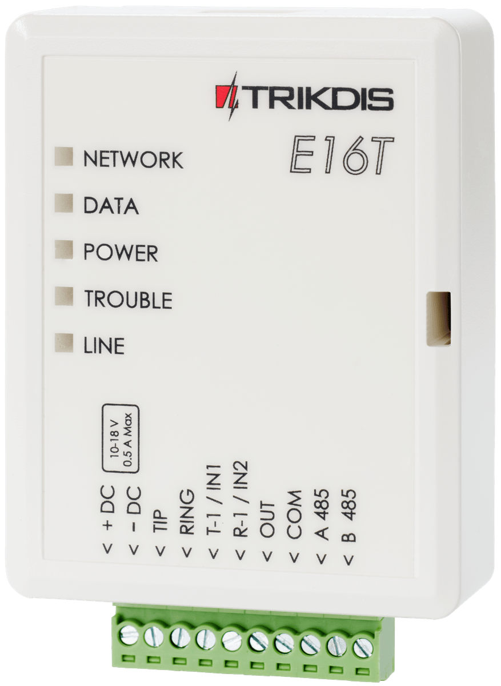

## Aprašymas

Komunikatorius E16T patobulina apsaugos centrales, turinčias telefoninį komunikatorių įvykių siuntimui ir valdymui naudojant laidinį interneto ryšį.

Komunikatorius gali perduoti pilną įvykių informaciją į saugos tarnybos stebėjimo pulto imtuvą.

Komunikatorius veikia su Protegus programėle. Su Protegus vartotojai gali valdyti savo signalizaciją nuotoliniu būdu ir gauti pranešimus apie įvykius. Protegus programėlė veikia su visomis kitų gamintojų apsaugos sistemomis, prie kurių prijungtas E16T. Komunikatorius gali siųsti pranešimus į saugos tarnybos pultą ir veikti su <u>Protegus</u> vienu metu.

E16T jungiamas 2 laidais prie apsaugos centralės telefoninio komunikatoriaus, kad priimtų Contact ID protokolu DTMF tonais perduodamus įvykių pranešimus.

**Savybės**

Jungiamas prie centralės telefoninio komunikatoriaus:

- Jungiamas su apsaugos centralės telefoniniu komunikatoriumi 2 arba 4 laidais.

- Sujungus 4 laidais, bus stebima telefono linija tarp centralės ir komunikatoriaus.

Siunčia įvykius į stebėjimo pulto imtuvą:

- Siunčia įvykius į *TRIKDIS* programinius arba aparatūrinius imtuvus, kurie dirba su bet kuria stebėjimo programa.

- Gali siųsti įvykius į SIA DC-09 imtuvus.

- Ryšio stebėjimas siunčiant PING užklausą į IP imtuvą kas 30 sekundžių (arba kitu nustatytu periodu).

- Atsarginis kanalas, kuris bus naudojamas nutrūkus ryšiui pirminiu kanalu.

- Kai įjungta *Protegus* paslauga, įvykiai visų pirma siunčiami į CSP ir tik po to - programėlės naudotojams.

**Veikia su Protegus programėle:**

- „*Push*” ir specialūs garso įspėjimai apie įvykius

- Nuotolinis sistemos įjungimas/išjungimas.

- Nuotolinis prijungtų įrenginių valdymas (šviesų, vartų, kondicionieriaus, šildymo, pievutės laistymo ir kt.).

- Skirtingos vartotojų teisės administratoriui, instaliuotojui ir vartotojui.

**Informuoja vartotojus:**

- Vartotojus galima informuoti apie įvykius su Protegus programėle.

**Valdomi išėjimai ir įėjimai:**

- 1 išėjimas, valdomas su:

  - Protegus programėle.

- 2 pasirenkamo tipo įėjimai, tipai: NC; NO; EOL.

**Greitai sukonfigūruojamas:**

- Nustatymai gali būti išsaugoti į failą ir greitai įrašyti į kitus komunikatorius.

- Du prieigos prie nustatymų lygiai: instaliuotojui ir CSP administratoriui.

- Nuotolinis konfigūravimas ir programinės įrangos atnaujinimas.

### Techniniai parametrai

| Parametras | Aprašymas |
|:---|----|
| Maitinimo įtampa | 10-18 V nuolatinės srovės |
| Naudojama srovė | Iki 0,5 A |
| „Ethernet“ ryšys | IEEE802.3, 10 Base-T, RJ45 lizdas |
| Duomenų paketo turinys | „Contact ID“ formato kodai |
| Atmintis | Iki 100 pranešimų |
| Įėjimai | 2, pasirenkamo tipo: NC;​ NO;​ EOL |
| Išėjimas | 1, OC tipo, iki 0,15 A nuolatinės srovės, 30 V maks. |
| Darbinė aplinka | Temperatūra nuo –10 °C iki 50 °C, santykinis oro drėgnumas 80 %, kai temperatūra siekia 20 °C |
| Matmenys | 88 x 62 x 26 mm |
| Svoris | 80 g |

### Komunikatoriaus elementai

1.  Šviesos indikatoriai.

2.  Priekinio dangtelio atidarymo plyšys.

3.  Gnybtai laidų prijungimui.

4.  USB Mini-B jungtis komunikatoriui programuoti.

5.  RJ45 lizdas LAN kabeliui prijungti.

### Išorinių kontaktų paskirtis

| Gnybtas | Aprašymas |
|----|----|
| +DC | Maitinimo gnybtas (10-18 V nuolatinės srovės teigiamas gnybtas) |
| -DC | Maitinimo gnybtas (10-18 V nuolatinės srovės neigiamas gnybtas) |
| TIP | Gnybtas sujungiamas su apsaugos centralės TIP gnybtu |
| RING | Gnybtas sujungiamas su apsaugos centralės RING gnybtu |
| T-1 /​ IN1 | Gnybtas telefono linijos stebėjimui naudosis ateityje arba įėjimo gnybtas, pasirenkamo tipo NC;​ NO;​ EOL |
| R-1 /​ IN2 | Gnybtas telefono linijos stebėjimui naudosis ateityje arba įėjimo gnybtas, pasirenkamo tipo NC;​ NO;​ EOL |
| OUT | Išėjimo gnybtas (OC tipo), srovė iki 0,15 A |
| COM | Bendrasis gnybtas (neigiamas) |
| A 485 | *RS485* magistralės A kontaktas |
| B 485 | *RS485* magistralės B kontaktas |

### Šviesinė veikimo indikacija

| Indikatorius | Veikimas | Aprašymas |
|--------------|----------|-----------|
| NETWORK (Tinklas) | Šviečia žaliai | Prisijungta prie kompiuterinio tinklo |
| NETWORK (Tinklas) | Nešviečia | Neprijungta prie kompiuterinio tinklo |
| DATA (Duomenys) | Šviečia geltonai | Yra neišsiųstų įvykių pranešimų buferinėje atmintyje |
| DATA (Duomenys) | Mirksi žaliai | Pranešimai siunčiami iš apsauginės signalizacijos centralės |
| POWER (Maitinimas) | Mirksi žaliai | Yra maitinimo įtampa |
| POWER (Maitinimas) | Mirksi geltonai | Žemo lygio maitinimo įtampa (≤ 11,5 V) |
| TROUBLE (Nesklandumas) | Šviečia raudonai | Kompiuterinio tinklo sujungimo problema |
| TROUBLE (Nesklandumas) | Nešviečia ir nemirksi | Veikia be nesklandumų |
| LINE | Šviečia žaliai | Apsauginė centralė “pakėlus” telefono ragelį |

### Internetinio komunikatoriaus E16T panaudojimo struktūrinė schema

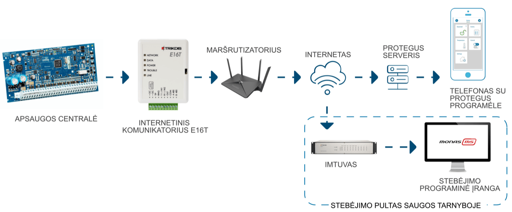

!!! note "Pastaba"
    Prieš pradėdami, įsitikinkite, kad turite:
    
    1.  USB Mini-B tipo kabelį, reikalingas konfigūravimui.
    
    2.  „CAT-5 Ethernet" laidą (daugiausiai 100 m ilgio).
    
    3.  Mažiausiai 4 gyslų kabelį komunikatoriaus prijungimui prie apsaugos
        signalizacijos centralės.
    
    4.  Plokščią atsuktuvą.
    
    5.  Apsaugos centralės instrukcija, prie kurios bus jungiamas
        komunikatorius.
    
    Reikalingas medžiagas galite užsisakyti iš vietinio platintojo.
## Greitas konfigūravimas su programa *<u>TrikdisConfig</u>*

1.  Parsisiųskite konfigūravimo programą TrikdisConfig iš [www.trikdis.com/lt](http://www.trikdis.com/lt)/ (programą rasite paieškos lauke surinkę „TrikdisConfig“), ir ją įdiekite.

2.  Plokščiu atsuktuvu nuimkite E16T dangtelį kaip parodyta žemiau:

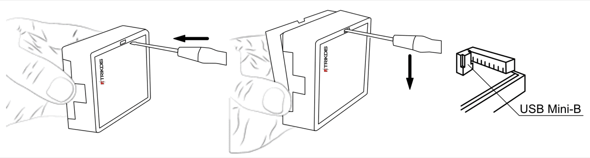

1.  Su USB Mini-B kabeliu sujunkite E16T su kompiuteriu.

2.  Paleiskite TrikdisConfig. Programa automatiškai atpažins prijungtą gaminį ir atidarys E16T konfigūravimo langą.

3.  Spustelkite programos mygtuką **Skaityti [F4]**, kad ji pateiktų esamas E16T veikimo parametrų reikšmes. Jei atsivers administratoriaus arba instaliatoriaus kodo įvedimo reikalavimo langelis, įveskite 6 skaitmenų kodą.

Žemiau aprašome nustatymus, kuriuos reikia pakeisti, kad komunikatorius pradėtų siųsti pranešimus į stebėjimo pultą ir kad apsaugos centralę būtų galima valdyti su Protegus programėle.

### Nustatymai ryšiui su Protegus programėle

**Lange „Sistemos parametrai“:**

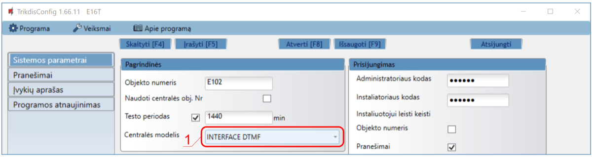

1.  Pasirinkite **Centralės modelį**, kurį jungsite prie komunikatoriaus.

**Lango „Pranešimai“ kortelėje „Protegus servisas“:**

2. Pažymėkite varnele **Leisti prisijungti** prie Protegus serviso.

2.  Galite pakeisti prisijungimo prie Protegus **Slaptažodį**, jeigu norite, kad vartotojų prašytų jį suvesti pridedant sistemą Protegus programėlėje (gamyklinis – 123456).

3.  Baigę konfigūravimą paspauskite mygtuką Įrašytu [F5] ir atjunkite kabelį.

!!! note "Pastaba"
    Plačiau apie kitus E16T nustatymus TrikdisConfig žr.
    7 "TrikdisConfig langų aprašymas".
### Nustatymai ryšiui su Stebėjimo pultu

**Lange „Sistemos parametrai“:**

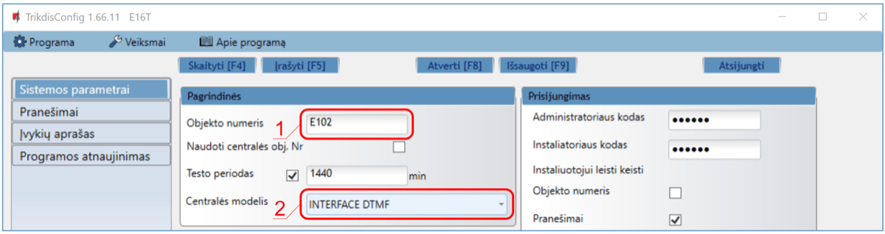

1.  Įrašykite **Objekto numerį**.

2.  Pasirinkite **Centralės modelį**, kurį jungsite prie komunikatoriaus.

**Lange „Pranešimai“, parinkčių grupėje „Pagrindinis“ ryšio kanalas:**

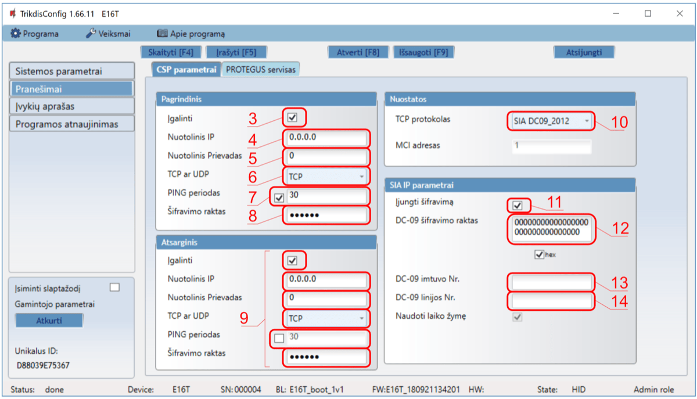

3.  **Įgalinti** – įjunkite pagrindinį ryšio kanalą.

4.  **Nuotolinis IP** – įrašykite imtuvo IP adresą.

5.  **Nuotolinis Prievadas** – įrašykite imtuvo prievado (*angl. port*) numerį tinkle.

6.  **TCP arba UDP** – pasirinkite, kuriuo protokolu (TCP arba UDP) turėtų būti siunčiami pranešimai.

7.  **PING periodas** – pažymėkite varnelė ir nurodykite PING signalo siuntimo periodą.

8.  **Šifravimo raktas** – įrašykite šifravimo raktą, kuris yra nustatytas imtuve.

9.  (Rekomenduojama) Sukonfigūruokite **Atsarginio** ryšio kanalo nustatymus.

10. **TCP protokolas** – pasirinkite, kuria koduote turėtų būti siunčiami pranešimai: **TRK** (į TRIKDIS imtuvus), **DC-09_2007** arba **DC-09_2012** (į universalius imtuvus).

11. **Įjungti šifravimą** - jei pasirinktas **TCP protokolas** SIA DC09_2012, tai galima įjungti šifravimą.

12. **DC-09 šifravimo raktas** – įrašykite šifravimo raktą, kuris yra nustatytas imtuve.

13. **DC-09 imtuvo Nr.** - – įrašykite imtuvo numerį.

14. **DC-09 linijos Nr**. – įrašykite imtuvo linijos numerį.

!!! note "Pastaba"
    Jei pasirinkote **DC-09** pranešimų perdavimo koduotę, papildomai
    **Siuntimas į CSP** lange, skirtuke **Parametrai**, įveskite objekto,
    linijos ir imtuvo numerius.
**Lango „Pranešimai“ kortelėje „Protegus servisas“:**

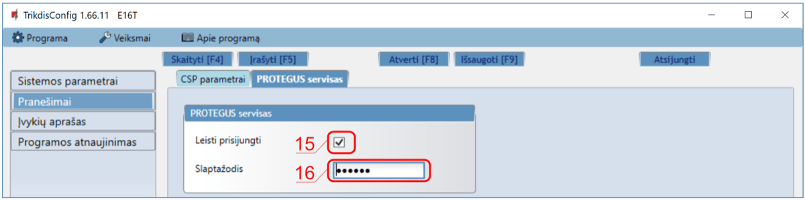

15. Pažymėkite varnele **Leisti prisijungti** prie Protegus serviso.

16. Galite pakeisti prisijungimo prie Protegus **Slaptažodį**, jeigu norite, kad vartotojų prašytų jį suvesti pridedant sistemą Protegus programėlėje (gamyklinis – 123456).

17. Baigę konfigūravimą paspauskite mygtuką **Įrašyti [F5]** ir atjunkite USB kabelį.

Baigę konfigūravimą paspauskite mygtuką **Įrašyti [F5]** ir atjunkite USB kabelį.

!!! note "Pastaba"
    Plačiau apie kitus E16T nustatymus TrikdisConfig žr.
    7 "TrikdisConfig langų aprašymas".
## Sujungimų schemos ir įrengimas

### Komunikatoriaus prijungimas prie apsaugos centralių

Sujunkite komunikatorių su centrale pagal vieną iš žemiau pateiktų prijungimo schemų.

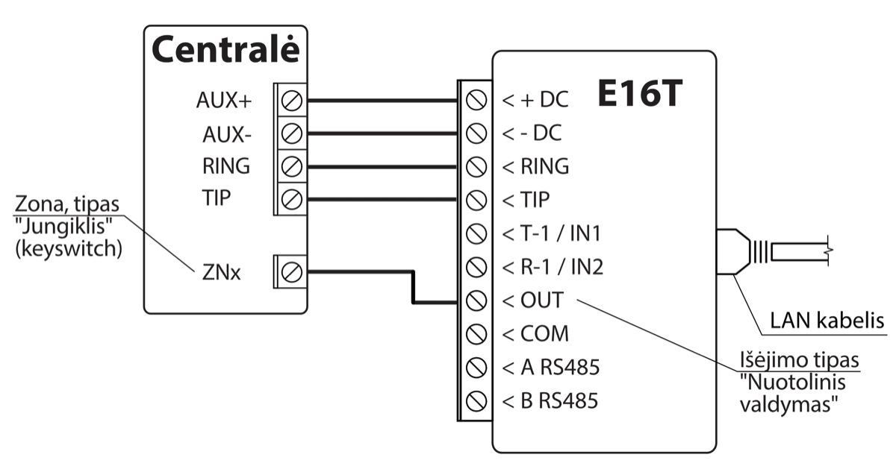

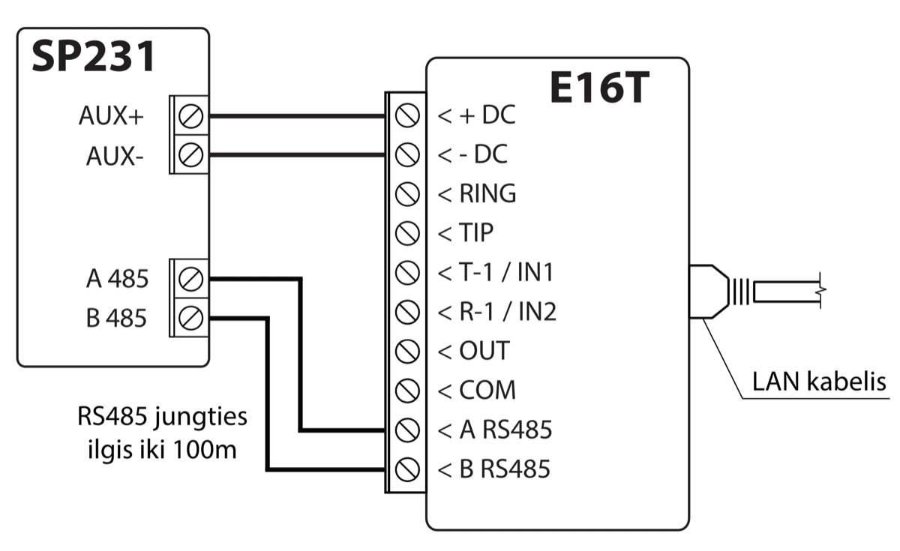

### Įėjimų prijungimo schemos

Komunikatorius turi 2 įėjimo gnybtus (IN1, IN2) prijungti NC, NO, EOL tipo grandinėms. Gamyklinis įėjimų nustatymas – stebėti NO tipo grandinę. Kitą įėjimo grandinės tipą galima nustatyti TrikdisConfig lange „**Įvykių aprašas“**.

NO, NC, EOL tipo grandinių laidinių sujungimų schemos:

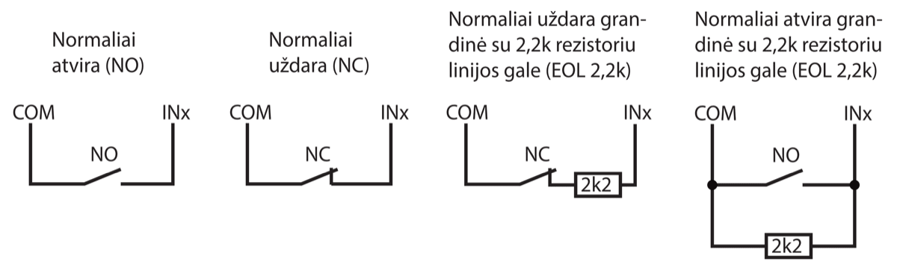

### LAN kabelio prijungimas

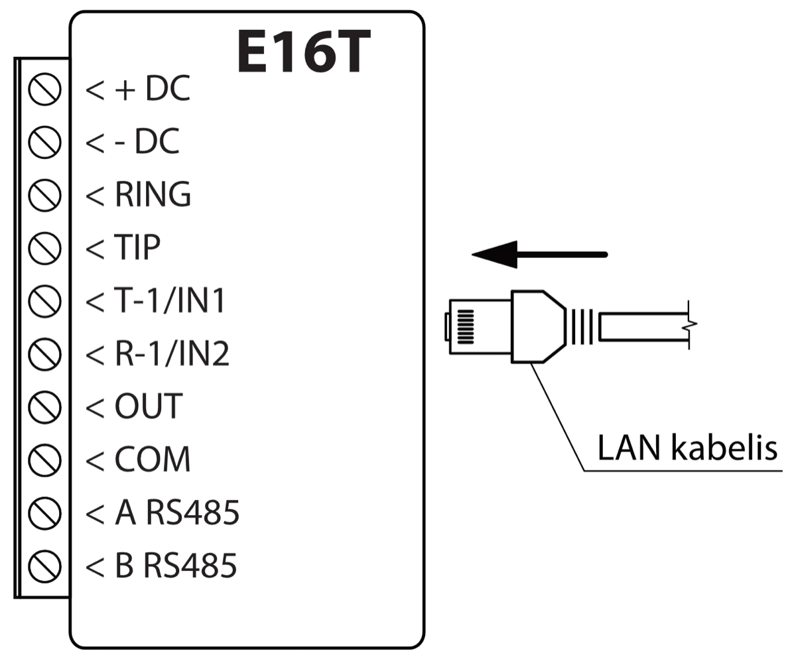

### Relės ir LED prijungimo schemos

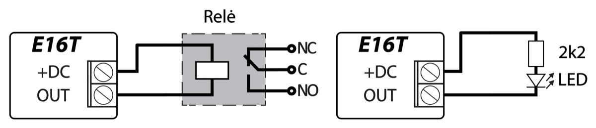

## Apsaugos centralės programavimas

Kad apsaugos centralė siųstų įvykius per telefoninį komunikatorių, jis turi būti įjungtas ir tinkamai sukonfigūruotas. Vadovaudamiesi tam tikros apsaugos centralės programavimo vadovu, nustatykite centralės telefoninį komunikatorių:

1.  Įjunkite centralės PSTN telefoninį komunikatorių.

2.  Jei komunikatorius prijungtas prie telefono linijos, tai įveskite telefono numeri – **1234**. Jei komunikatorius prijungtas prie centralės RING/TIP gnybtu, tai įveskite bet kokį ne trumpesnį nei 2 skaitmenų skaičių.

3.  Pasirinkite DTMF režimą.

4.  Pasirinkite Contact ID ryšio formatą.

5.  Įveskite centralės 4 skaitmenų objekto numerį.

### Honeywell Vista centralės telefoninio komunikatoriaus programavimas

Naudodami klaviatūrą, eikite į nurodytas sekcijas ir nustatykite jas taip, kaip nurodyta:

- \*41 - įveskite pulto imtuvo telefono numerį;

- \*43 - įveskite centralės objekto numerį;

- \*47 - nustatykite Toninį rinkimą į [1] ir įveskite numerio rinkimo bandymų kartų skaičių;

- \*48 – Contact ID. Naudojamas numatytasis nustatymas, \*48 turi būti nustatyta 7;

- \*49 - Split / Dual pranešimas. \*49, turi būti nustatyta 5;

- \*50 – Pranešimo apie įsilaužimą siuntimo delsa (neprivaloma). Numatytoji reikšmė yra [2,0], dėl kurios 30 sekundžių bus uždelstas pranešimo apie įvykį siuntimas. Jei norite, kad pranešimas apie įvykį būtų išsiųstas nedelsiant, nustatykite [0,0].

**Išeiti iš programavimo režimo**.

Kai visi reikalingi nustatymai padaryti būtina išeiti iš programavimo režimo. Klaviatūroje surinkite \*99.

#### "Honeywell Vista 48" centralės specialieji nustatymai 

Jei norite naudoti E16T su "**Honeywell Vista 48**" centrale, atlikite toliau nurodytus nustatymus, kaip nurodyta lentelėje:

| Skyrius | Duomenys                         | Skyrius | Duomenys | Skyrius | Duomenys |
|:-------:|:---------------------------------|:-------:|:--------:|:-------:|:--------:|
|  \*41   | 1111 (imtuvo telefono numeris)   |  \*60   |    1     |  \*69   |    1     |
|  \*42   | 1111                             |  \*61   |    1     |  \*70   |    1     |
|  \*43   | 1234 (centralės objekto numeris) |  \*62   |    1     |  \*71   |    1     |
|  \*44   | 1234                             |  \*63   |    1     |  \*72   |    1     |
|  \*45   | 1111                             |  \*64   |    1     |  \*73   |    1     |
|  \*47   | 1                                |  \*65   |    1     |  \*74   |    1     |
|  \*48   | 7                                |  \*66   |    1     |  \*75   |    1     |
|  \*50   | 1                                |  \*67   |    1     |  \*76   |    1     |
|  \*59   | 0                                |  \*68   |    1     |         |          |

Kai visi reikalingi nustatymai padaryti būtina išeiti iš programavimo režimo. Klaviatūroje surinkite \*99.

## Nuotolinis valdymas

### Valdymas per *Protegus* debesiją

Su Protegus vartotojai galės valdyti savo signalizaciją nuotoliniu būdu. Jie taip pat matys sistemos būseną ir gaus pranešimus apie sistemos įvykius.

1.  Parsisiųskite ir paleiskite Protegus programėlę arba naudokite versiją naršyklėje <u>www.protegus.app.</u>

    

      
      
      
    

2.  Registruokitės ir susikurkite naują paskyrą arba prisijunkite savo vartotojo vardu ir slaptažodžiu.

!!! note "Pastaba"
    Pridėjimo prie Protegus metu E16T turi būti:
    
    1.  Įjungta Protegus servisas paslauga. Paslaugos įjungimas
        aprašytas skyriuje **7.3 Langas "Pranešimai"**;
    
    2.  Įjungtas maitinimas („POWER" LED mirksi žaliai);
    
    3.  E16T prijungtas prie interneto (prijungtas LAN kabelis).
        Indikatorius "NETWORK" šviečia žaliai, kai yra ryšys.
3. Paspauskite **Pridėti sistemą** ir įveskite E16T MAC adresą. MAC adresą rasite ant gaminio arba pakuotės lipduko.

    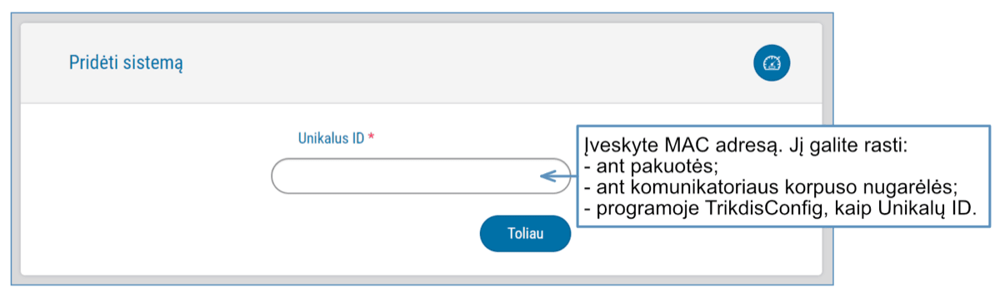

### Papildomi nustatymai sistemos įjungimui/išjungimui su jungiklio zoną

!!! note "Pastaba"
    Centralės zonai, prie kurios prijungtas E16T išėjimas OUT, turi
    būti nustatytas zonos tipas - jungiklis (angl. keyswitch).
Sekite nurodymus žemiau, jei apsaugos centralė bus valdoma su E16T PGM išėjimu įjungiant/išjungiant centralės jungiklio (angl. keyswitch) zoną.

1.  Įvedus „*IMEI/UnikalusID*“ numerį spustelėkite „**Toliau**“. Naujame lange šoniniame meniu spustelėkite „**Sritys**“. Atsidariusiame lange nurodykite 1 signalizacijos sistemos sritį (komunikatorius turi viena OUT išėjimą) ir paspauskite „**Toliau**“.

    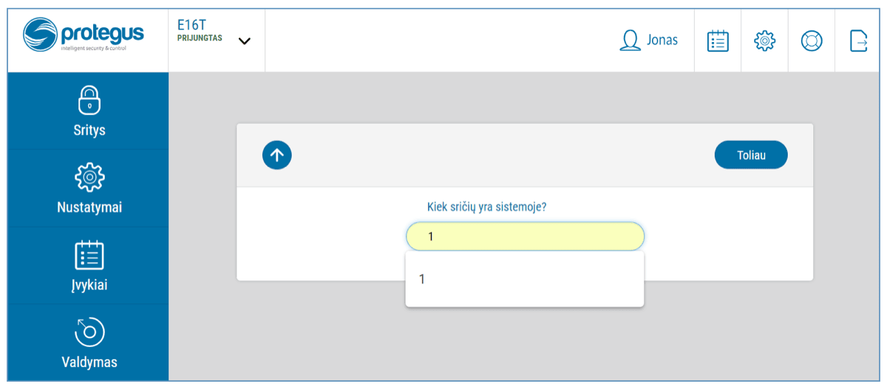

2.  Naujame lange nurodykite, koks yra srities numeris sistemoje ir spustelėkite „**Išsaugoti**“.

    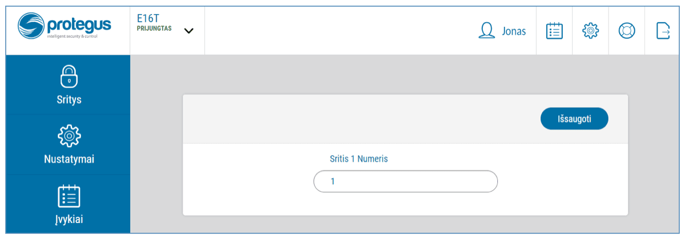

3.  Šoniniame meniu paspauskite „Nustatymai“ ir atsidariusiame lange paspauskite „Nustatymai“. Pažymėkite varnele „**Naudoti PGM sistemos Įjungimui/išjungimui**“ ir nurodykite, kurią sritį valdys išėjimas. Vienas E16T OUT išėjimas gali būti skirtas vienos srities valdymui (1 PGM - 1 sritis).

4.  Pasirinkite **Lygis** arba **Impulsas**, priklausomai nuo to, koks centralės jungiklio zonos (angl. keyswitch) tipas. Taip pat galite pakeisti impulso intervalo trukmę, jei tai reikalinga prijungiamai centralei.

5.  Papildomam saugumui, galite pasirinkti „**Naudoti programėlės slaptažodį įjungimui/išjungimui**”. Tuomet paspaudus mygtuką įjungti/išjungti apsaugos sistemą, atsivers programėlės slaptažodžio įvedimo užklausos langas.

    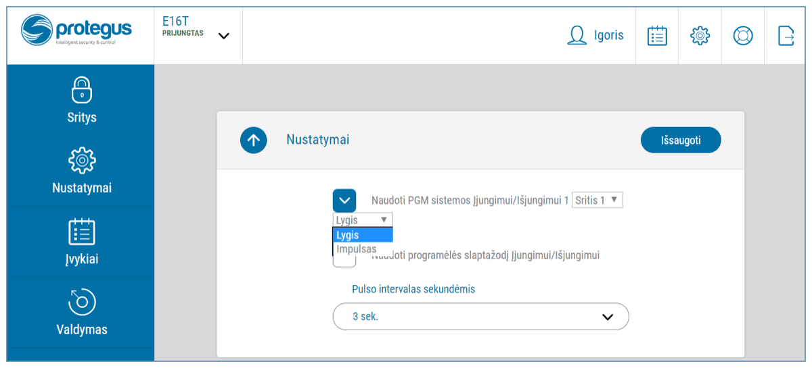

### Sistemos įjungimas/išjungimas su *Protegus*

1.  Kad suvaldytumėte sistemą, eikite į langą „**Sritys**“.

2.  „**Sritys**“ lange paspauskite ant srities mygtuko. Atsivėrusiame lange pasirinkite veiksmą (įjungti arba išjungti signalizacijos sritį).

3.  Paprašius, įveskite vartotojo kodą arba Protegus slaptažodį.

    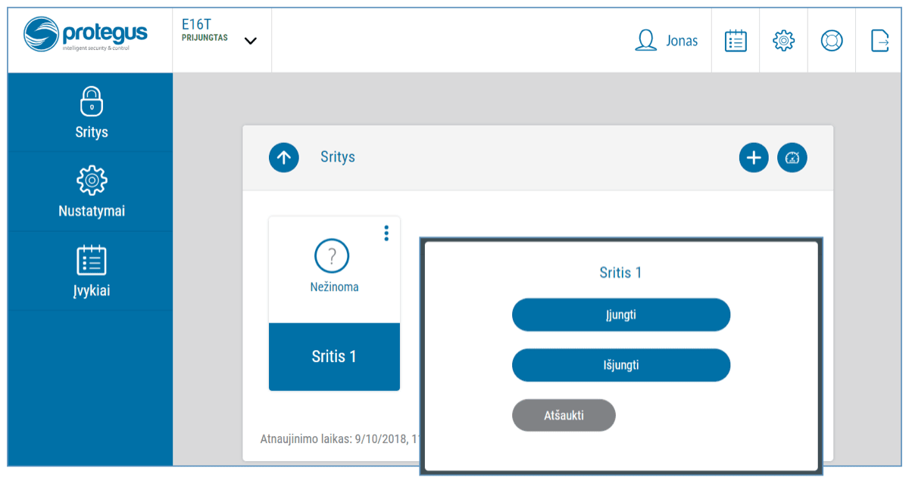

## Nuotolinis veikimo parametrų nustatymas

!!! note "Pastaba"
    Nuotolinis konfigūravimas veiks tik tuomet, kai E16T:
    
    1.  įjungta Protegus servisas paslauga. Paslaugos įjungimas
        aprašytas skyriuje **7.3 Langas "Pranešimai"**;
    
    2.  įjungtas maitinimas („POWER" LED mirksi žaliai);
    
    3.  E16T prijungtas prie interneto (prijungtas LAN kabelis).
        Indikatorius "NETWORK" šviečia žaliai, kai yra ryšys.
1.  Parsisiųskite programa TrikdisConfig iš [www.trikdis.lt](http://www.trikdis.lt).

2.  Įsitikinkite, kad komunikatorius E16T yra prisijungęs prie interneto ir jam įjungtas ryšys su Protegus.

3.  Paleiskite konfigūravimo programą TrikdisConfig ir skyriaus *Nuotolinė prieiga* laukelyje **Unikalus ID** įrašykite turimo E16T MAC adresą (MAC adresas nurodytas ant lipdukų, užklijuotų ant gaminio korpuso apatinės dalies ir pakuotės).

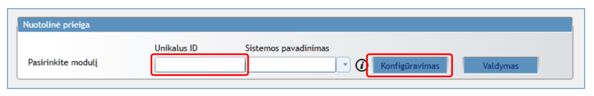

4. Laukelyje **Sistemos pavadinimas** norimu vardu pavadinkite E16T su šiuo Unikalių ID. Spauskite **Konfigūravimas**.

2.  Atsivers komunikatoriaus konfigūravimo langas. Spustelkite mygtuką **Skaityti [F4]**, kad programa nuskaitytu E16T nustatytu parametrų reikšmes. Jei atsivers *Administratoriaus kodo* įvedimo reikalavimo langas, įveskite šešiaženklę *administratoriaus* kodo reikšmę. Norint, kad programa atsimintų kodą, reikia pažymėti langelį šalia **Prisiminti slaptažodį** ir paspausti programos mygtuką **Įrašyti [F5]**.

3.  Nustatykite norimus nustatymus E16T ir pabaigą nuspauskite **Įrašyti [F5]**. Jei norite atsijungti nuo E16T nuspauskite **Atsijungti** ir išeikite iš programos TrikdisConfig.

## TrikdisConfig langų aprašymas

### *TrikdisConfig* būsenos juostos aprašymas

Prijungus E16T TrikdisConfig būsenų juostoje pateiks informaciją apie prijungtą gaminį:

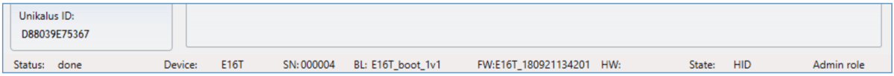

| Pavadinimas | Aprašymas |
|----|----|
| Unikalus ID | Gaminio MAC adresas |
| Būsena | Darbinė būsena |
| Įrenginys | Gaminio tipas (turi rodyti E16T) |
| SN | Gaminio serijinis numeris |
| BL | Paleidyklės versija |
| FW | Gaminio programinės įrangos versija |
| HW | Gaminio aparatinės įrangos versija |
| Būsena | Sujungimo su programa būdas (per USB arba nuotolinis) |
| Administratorius | Prieigos lygis (rodomas po to, kai patvirtintas prieigos kodas) |

Paspaudus mygtuką **Skaityti [F4]**, programa nuskaitys ir parodys nustatymus, kurie yra įrašyti E16T. Su TrikdisConfig, nustatykite reikiamus nustatymus pagal žemiau pateiktus programos langų aprašymus.

### Langas „Sistemos parametrai“

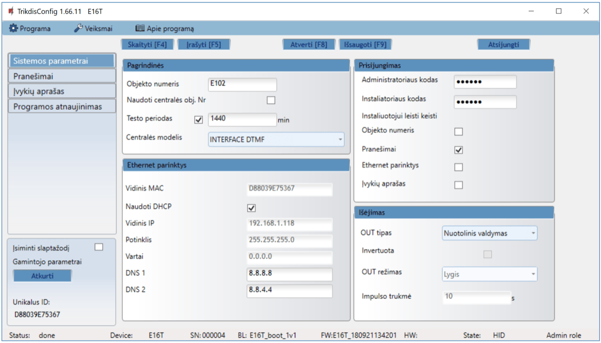

**Parinkčių grupė „Pagrindinės“**

- **Objekto numeris** – jei pranešimai bus siunčiami į CSP (centralizuoto stebėjimo pultą), įrašykite CSP suteiktą objekto numerį (4 simbolių šešioliktainis numeris, 0-9, A-F. **Nenaudokite FFFE, FFFF objekto numerių**.).

- **Naudoti centralės obj. Nr.** – jei langelis pažymėtas varnele, tai komunikatorius siųs su pranešimais ne **Objekto numeris** laukelyje nustatyta reikšmę, o centralėje įvestą objekto numerį.

- **Testo periodas** – pažymėkite langelį varnele, įjungsite periodiniu testo pranešimu siuntimą, ir nurodykite testo periodo laiką.

- **Centralės modelis** – pasirinkite **Centralės modelį**, kurį jungsite prie komunikatoriaus.

**Parinkčių grupė „Ethernet parinktys“**

- **Vidinis MAC** – automatiškai nusistato prijungto komunikatoriaus MAC adresas .

- **Naudoti DHCP** - pažymėkite laukelį, kad komunikatorius automatiškai prisiregistruotų prie tinklo. Jei automatiniu būdu prisiregistruoti nepavyko, reikia rankiniu būdu įvesti:

  - **Vidinis IP** – komunikatoriaus IP adresas.

  - **Potinklis** – potinklio kaukė.

  - **Vartai** – prisijungimui prie interneto.

  - **DNS1 ir DNS2** – (angl. Domain Name System) nurodomas serveris, kuris nurodo domeno IP adresą. Naudojamas, kai ryšio kanalo **Domenas arba IP** lauke nurodytas ne IP adresas, o domenas. Gamyklos nustatyti Google DNS serverių adresai.

**Parinkčių grupė „Prisijungimas“**

Konfigūruojant komunikatorių E16T yra du prieigos lygiai (administratoriaus ir instaliuotojo):

- **Administratoriaus kodas** – leidžia prieiti prie visų konfigūravimo funkcijų (gamyklinis kodas – 123456).

- **Instaliatoriaus kodas** - leidžia ribotai keisti komunikatoriaus konfigūraciją (gamyklinis kodas - 654321).

- **Leisti instaliuotojui keisti** – administratorius gali nustatyti, kuriuos parametrus galės keisti instaliuotojas.

!!! note "Pastaba"
    Administratoriaus ir instaliuotojo kodai turi būti iš šešių skaitmenų
    arba lotyniškų raidžių.
**Parinkčių grupė „Išėjimas“**

- **OUT tipas** - pasirinkite išvesties veikimo tipą iš sąrašo (Išjungta, LAN OK, Ryšio sutrikimas, Nuotolinis valdymas).

- **Invertuota** - pažymėkite laukelį jei išvesties funkciją norite keisti (invertuoti).

- **OUT rėžimas** – nustatykite išėjimo suveikimo režimą **Lygis** arba **Impulsas:**

  - **Impulsas** - būsenai pasikeis nustatytai laiko trukmei, kuri nurodyta **Impulso trukmės** (sekundėmis) laukelyje.

  - **Lygis** - būsena pasikeis ir liks nepakitusi iki kitos komandos.
- **Impulso trukmė** – nurodomas impulso trukmes laikas, sek.. OUT išėjimas suveiks nustatytam laikui, kai išėjimui priskirtas režimas **Impulsas**.

### Langas „Pranešimai“

**Skirtukas „CSP parametrai“**

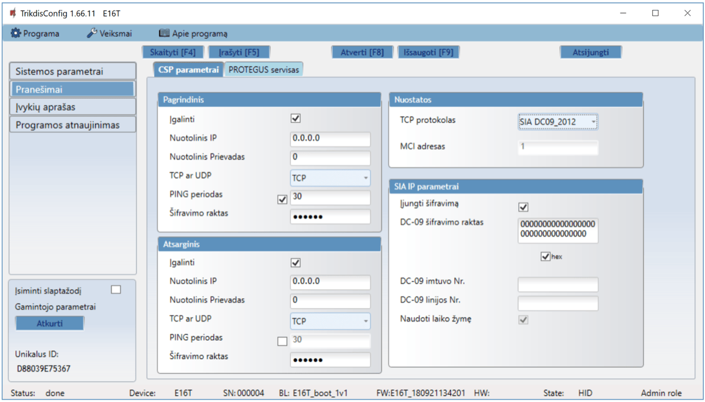

Komunikatorius siunčia pranešimus į stebėjimo pultą per laidinį interneto (IP) ryšį.

Pranešimai gali būti siunčiami pagrindiniu arba atsarginiu ryšio kanalu. Atsarginis ryšio kanalas bus naudojamas nutrūkus pagrindiniam ryšio kanalui.

Pranešimai į stebėjimo pultą perduodami užkoduoti ir apsaugoti slaptažodžiu. Pranešimams priimti ir perduoti į stebėjimo programą reikalingas TRIKDIS imtuvas:

IP pranešimams – priėmimo programa IPcom Windows/Linux, aparatinis IP/SMS imtuvas RL14 arba daugiakanalis imtuvas RM14.

**Parinkčių grupė „Pagrindinis“**

- **Įgalinti** – kai langelį pažymėsite varnele, įjungiamas pagrindinis kanalas įvykių pranešimams siųsti į CSP (centrinis stebėjimo pultas).

- **Nuotolinis IP** – įrašykite nuotolinio IP (CSP) adresą.

- **Nuotolinis prievadas** – įrašykite imtuvo prievado (*angl. port*) numerį tinkle.

- **TCP ar UDP** – pasirinkite įvykių perdavimo protokolą (TCP arba UDP).

- **PING periodas** – kai langelį pažymėsite varnele, įjungiamas PING signalo siuntimas, kas nurodyta laiką, (min.). Būtina ryšio kontrolei su CSP.

- **Šifravimo raktas** – 6 skaitmenų pranešimų šifravimo raktas. Į komunikatorių įrašytas šifravimo raktas turi būti toks, koks įrašytas į imtuvą, t.y. turi sutapti, būti vienodas.

**Parinkčių grupė „Atsarginis“**

Įgalinkite atsarginio kanalo režimą, kad, nutrūkus ryšiui, įvykiai būtų siunčiami atsarginiu kanalu. Sukonfigūruokite atsarginį kanalą, nustatymo laukai tokie patys kaip aprašyta aukščiau.

**Parinkčių grupė „Nuostatos“**

- **TCP protokolas** – pasirinkite, kurio protokolu turėtų būti siunčiami pranešimai.

  **Parinkčių grupė „SIA IP parametrai“**

Nustatymus galima keisti, kai ryšio kanalo **TCP protokolas** lauke pasirinkta **DC-09_2007** arba **DC-09_2012** koduotė siuntimui į universalius imtuvus.

- **Įjungti šifravimą** – jei pasirinktas TCP protokolas SIA DC09_2012, tai galima įjungti šifravimą.

- **DC-09 šifravimo raktas** – įveskite šifravimo raktą.

- **DC-09 imtuvo Nr**. – įveskite imtuvo numerį.

- **DC-09 linijos Nr**. – įveskite linijos numerį imtuve.

- **Naudoti laiko žymę** – į pranešimą bus įtrauktas laikas, jei pažymėtas laukas.

**Skirtukas „Protegus servisas“**

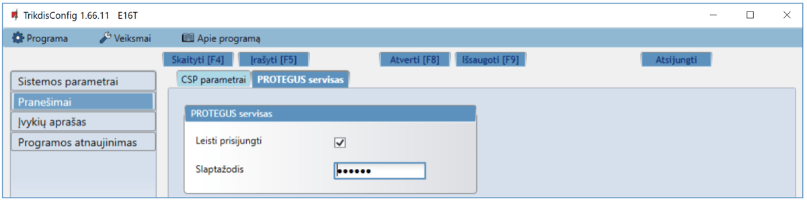

**Parinkčių grupė „Protegus servisas“**

- **Leisti prisijungti** – Protegus serviso įjungimas, E16T galės keistis duomenimis su Protegus programėle ir bus galima su TrikdisConfig atlikti konfigūravimą nuotoliniu būdu.

- **Slaptažodis** – prisijungimo su Protegus 6 skaitmenų kodas (gamyklinis kodas - 123456). Slaptažodį pakeitus, jį prašys suvesti pridedant sistemą Protegus programėlėje. Tai papildoma saugumo priemonė.

### Langas „Įvykių aprašas“

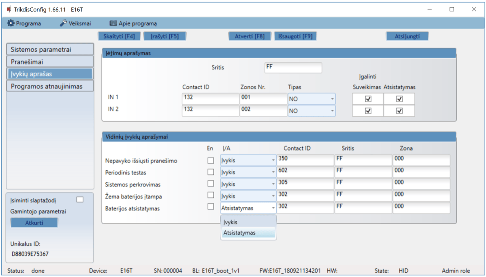

Šiame lange galima įjungti, išjungti ir pakeisti įrenginio siunčiamus vidinius pranešimus ir įėjimų pranešimus. Išjungus vidinį pranešimą šiame lange, jis nebus siunčiamas nepriklausomai nuo kitų nustatymų.

Prie komunikatoriaus įėjimų galima prijungti papildomus jutiklius. Suveikus jutikliui komunikatorius išsius pranešimą apie įvykį. Įėjimui priskiriamas Contact ID kodas, kuris bus išsiustas į CSP ir Protegus.

Įvykiu Contact ID kodai, kurie bus siunčiami į CSP ir į Protegus, kai įvyks įvykis, nurodomi pažymint lauką varnelė.

**Parinkčių grupė „Įėjimų aprašymas“**

- **Sritis** – įrašykite srities numerį.

- **Contact ID** – įrašykite įvykio kodą arba palikite numatytąją vertę. Suveikus įėjimui įvykio kodas bus išsiustas į Protegus ir CSP.

- **Zonos Nr. –** įrašykite zonos numerį, jis bus siunčiamas pranešimuose.

- **Tipas** – pasirinkite įėjimų tipus (NO, NC, EOL).

- **Įgalinti / Suveikimas** – pažymėjus šį lauką bus siunčiami pranešimai apie įėjimu IN1, IN2 suveikimą.

- **Įgalinti / Atsistatymas** – pažymėjus šį lauką bus siunčiami pranešimai apie įėjimu IN1, IN2 atsistatymą.

**Parinkčių grupė „Vidinių įvykių aprašymai“**

- **En** – pažymėkite įvykių laukus, kuriu pranešimai bus siunčiami į CSP ir Protegus.

- **Į/A** – nurodykite komunikatoriaus vidinio įvykio siuntimo sąlyga (Įvykis arba Atsistatymas).

- **Contact ID**- įvykio kodas.

- **Sritis** – įrašykite srities numerį, kuris bus siunčiamas įvykus vidiniam įvykiui ir atsistačius sistemai.

- **Zona** – įrašykite zonos numerį, kuris bus siunčiamas įvykus vidiniam įvykiui ir atsistačius sistemai.

### Gamyklinių nustatymų atstatymas

Norint atkurti komunikatoriaus gamyklinius nustatymus, reikia nuspausti programos TrikdisConfig mygtuką **Atkurti**.

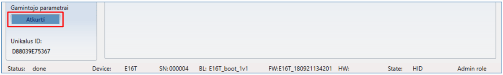

## Komunikatoriaus E16T testavimas

Kai konfigūracija ir diegimas bus baigti, atlikite sistemos patikrą:

1.  Patikrinkite, ar maitinimas yra įjungtas.

2.  Patikrinkite tinklo ryšį (NETWORK indikatorius šviečia žaliai).

3.  Sugeneruokite įvykį:

- įjungdami/išjungdami saugojimo režimą su apsaugos centralės klaviatūra;

- suveiksmindami centralės zoną esant įjungtam saugojimo režimui.

1.  Patikrinkite, ar įvykiai buvo gauti Centriniame stebėjimo pulte ir/arba Protegus programėlėje.

2.  Norėdami išbandyti komunikatoriaus įėjimą, suveiksminkite jį ir patikrinkite, ar gavėjai gauna teisingus pranešimus.

3.  Norėdami išbandyti komunikatoriaus išėjimus, juos įjunkite nuotoliniu būdu ir patikrinkite jų veikimą.

4.  Jei bus naudojamas nuotolinis centralės valdymas, įjunkite bei išjunkite centralės saugojimo režimą nuotoliniu būdu su Protegus programėle.

## Programinės aparatinės įrangos atnaujinimas

!!! note "Pastaba"
    Prijungus komunikatorių E16T prie TrikdisConfig, programa
    pasiūlys atnaujinti įrenginio veikimo programą, jeigu yra atnaujinimų.
    Šiam veikimui reikalingas interneto ryšys. Antivirusinė programa,
    ugniasienė arba griežti prieigos prie tinklo nustatymai gali blokuoti
    automatinių atnaujinimų funkciją.
E16T veikimo programą galima atnaujinti ar pakeisti ir rankiniu būdu. Po atnaujinimo išlieka visi ankstesni E16T komunikatoriaus nustatymai. Veikimo programą įrašant rankiniu būdu galima pakeisti į naujesnę arba senesnę versiją. Atlikite šiuos žingsnius:

1.  Paleiskite ***TrikdisConfig**.*

2.  Prijunkite E16T per USB Mini-B kabelį prie kompiuterio arba prisijunkite prie E16T nuotoliniu būdu. Jei yra naujesnė gamyklinė programinė įranga, programa pasiūlys įdiegti naujesnės gamyklinės programinės įrangos versijos bylą.

3.  Parinkite programos TrikdisConfig meniu **Programos atnaujinimas**.

4.  Paspauskite mygtuką **Atverti failą** ir parinkite reikiamą programinės įrangos bylą. Jei neturite bylos, visi tinklapio [www.trikdis.lt](http://www.trikdis.lt) registruoti vartotojai gali nemokamai parsisiųsti naujausias gaminių programinės įrangos bylas.

    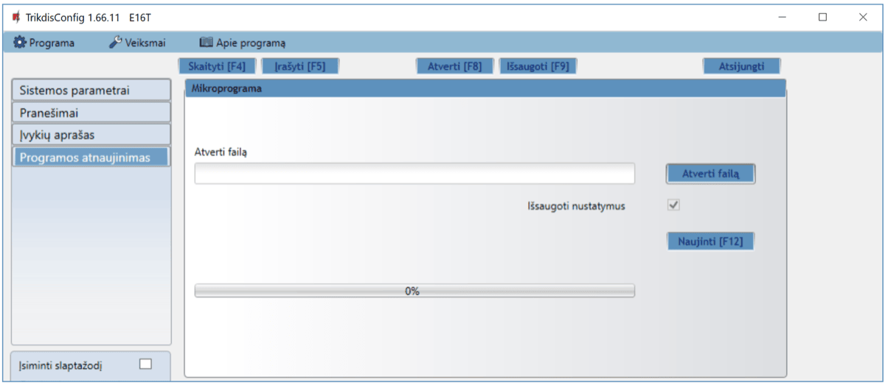

5.  Paspauskite atnaujinimo mygtuką **Naujinti [F12]**.

6.  Palaukite, kol bus atlikti atnaujinimai.

## Turinys

## Saugos reikalavimai

„Ethernet“ komunikatorių įrengti ir aptarnauti gali tik kvalifikuoti asmenys.

Prieš įrengdami, atidžiai perskaitykite šį vadovą, kad išvengtumėte klaidų, dėl kurių prietaisas gali blogai veikti ar net būti sugadintas.

Visada išjunkite el. energijos tiekimą prieš atliekant prietaiso pajungimą.

Ne gamintojo atlikti gaminio pakeitimai, modifikacijos ar remontai panaikina gamintojo suteiktą garantiją.

Laikykitės atliekų rūšiavimo taisyklių ir neišmeskite nenaudojamos įrangos komponentų su kitomis buitinėmis atliekomis.
