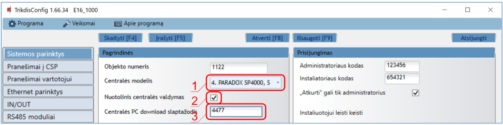
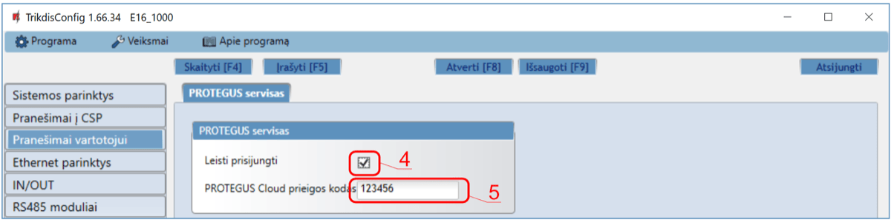
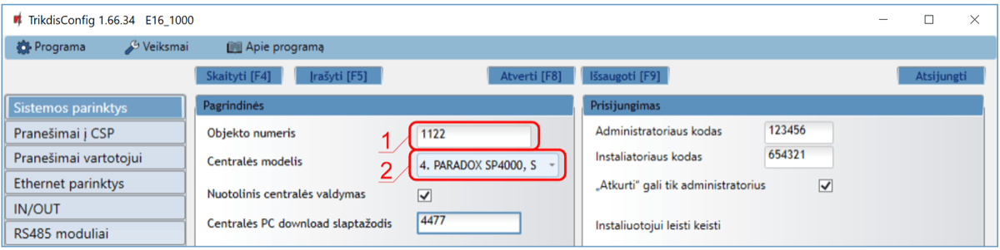
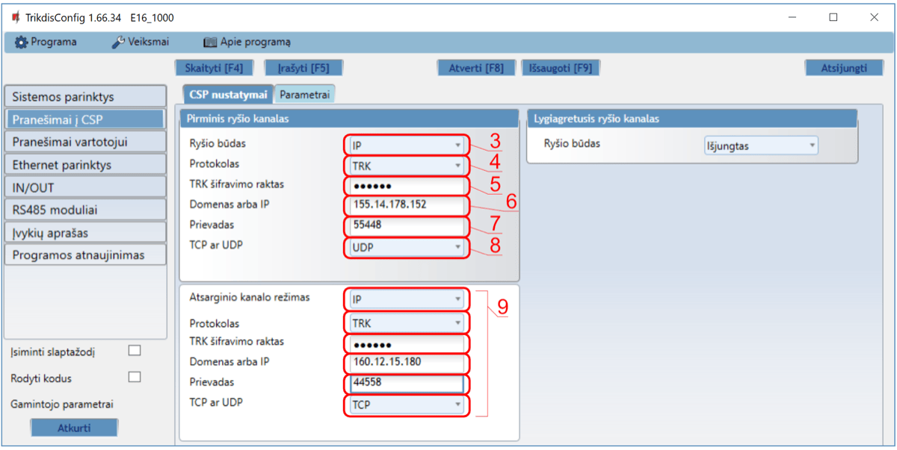

# Honeywell Vista su E16 greitas paruošimas

Trumpi prijungimo ir programavimo žingsniai, skirti prijungti E16 komunikatorių prie Honeywell Vista centralių (Ademco Vista-48, Vista-20, Vista-15), sukonfigūruoti E16 IP ryšiui ir pridėti sistemą į Protegus2. Naudokite kartu su pilnu E16 vadovu kitiems nustatymams.

!!! caution "Atsargiai"
    Montavimą ir aptarnavimą gali atlikti tik kvalifikuoti specialistai. Prieš jungdami laidus atjunkite maitinimą. Neautorizuoti pakeitimai panaikina garantiją.

## Reikalavimai

- E16 komunikatorius su prijungtu LAN ir USB Mini-B kabeliu konfigūravimui.
- Honeywell Vista centralė (Ademco Vista-48, Vista-20 arba Vista-15) su prieiga per klaviatūrą.
- Centralės programinės įrangos versija `V5.3` arba aukštesnė.
- CSP objekto numeris, jei pranešimai bus siunčiami į stebėjimo pultą.
- Protegus2 paskyra ir komunikatoriaus MAC / Unique ID.

## Greitas konfigūravimas su programa *TrikdisConfig*

1. Parsisiųskite **TrikdisConfig** iš [www.trikdis.com](http://www.trikdis.com) ir ją įdiekite.
2. Plokščiu atsuktuvu atidarykite E16 korpusą.

3. Su USB Mini-B kabeliu prijunkite E16 prie kompiuterio.
4. Paleiskite **TrikdisConfig**. Programa atpažins komunikatorių ir atidarys konfigūravimo langą.
5. Paspauskite **Skaityti [F4]**, kad įkeltumėte esamus nustatymus. Jei reikia, įveskite administratoriaus arba instaliuotojo 6 skaitmenų kodą.

Atlikite tą poskyrį, kuris atitinka diegimą:

- **Protegus2 programėlė** jei sistema bus valdoma nuotoliniu būdu.
- **Stebėjimo pultas** jei komunikatorius siųs pranešimus į CSP.
- Atlikite abu poskyrius, jei komunikatorius turi veikti ir su CSP, ir su Protegus2.

### Nustatymai ryšiui su Protegus2 programėle

**Lange "Sistemos parinktys":**

1. Pasirinkite **Centralės modelį**, kuris bus prijungtas prie komunikatoriaus.
2. Pažymėkite **Nuotolinis centralės valdymas**, jei vartotojai turi valdyti centralę per Protegus2 savo klaviatūros kodu.
3. Paradox ir Texecom centralių tiesioginiam valdymui įveskite **Centralės PC download/UDL slaptažodį**. Jis turi sutapti su centrėje nustatytu slaptažodžiu.

!!! note "Pastaba"
    Kad veiktų tiesioginis valdymas, centrinę taip pat reikia suprogramuoti, kaip nurodyta toliau esančiame centralės programavimo skyriuje.

**Lange "Pranešimai vartotojui", kortelėje "PROTEGUS servisas":**

4. Pažymėkite **Leisti prisijungti** prie Protegus serviso.
5. Pakeiskite **PROTEGUS Cloud prieigos kodą**, jei norite, kad vartotojai jį įvestų pridėdami sistemą į Protegus2.

Baigę konfigūravimą paspauskite **Įrašyti [F5]** ir atjunkite USB kabelį.

### Nustatymai ryšiui su Stebėjimo pultu

**Lange "Sistemos parinktys":**

1. Įveskite **Objekto numerį**, kurį suteikė stebėjimo pultas.
2. Pasirinkite **Centralės modelį**, kuris bus prijungtas prie komunikatoriaus.

**Lange "Pranešimai į CSP", parinkčių grupėje "Pirminis ryšio kanalas":**

3. Nustatykite **Ryšio būdą** į **IP**.
4. Pasirinkite imtuvui reikalingą protokolą: **TRK**, **DC-09_2007**, **DC-09_2012** arba **TL150**.
5. Jei pasirinktasis protokolas to reikalauja, įveskite imtuvo šifravimo raktą.
6. Įveskite imtuvo **Domeną arba IP** ir **Prievadą**.
7. Pasirinkite **TCP** arba **UDP**.
8. Jei reikia, sukonfigūruokite atsarginį ir lygiagretų ryšio kanalus.

!!! note "Pastaba"
    Jei pasirinkote **DC-09** protokolą, lange **Pranešimai į CSP** skirtuke **Parametrai** papildomai įveskite objekto, linijos ir imtuvo numerius.

Baigę konfigūravimą paspauskite **Įrašyti [F5]** ir atjunkite USB kabelį.

## Pajungimas

Prijunkite centralę prie E16, kaip parodyta žemiau:

| E16 gnybtas | Honeywell centralė | Pastabos |
| --- | --- | --- |
| `+DC` | `5` | Centralės maitinimas |
| `-DC` | `4` | Centralės žemė |
| `CLK` | `6` | Klaviatūros magistralė |
| `DATA` | `7` | Klaviatūros magistralė |

## Apsaugos centralės programavimas

Su prie centralės prijungta klaviatūra:

1. Įeikite į programavimo režimą instaliuotojo kodu `4112`, po to įveskite `800`.
2. Įjunkite Contact ID įvykių siuntimą per LRR: įveskite `[*][2][9][1][#]`.
3. Jei norite tiesioginio nuotolinio valdymo, įjunkite antrą AUI adresą: įveskite `[*][1][8][9][1][1][#]`.
4. Išeikite iš programavimo režimo su `[*][9][9]`.

## Sistemos pridėjimas į Protegus2

1. Atidarykite [Protegus2](https://www.protegus.app) ir paspauskite **Pridėti naują sistemą**.
1. Įveskite E16 **MAC / Unique ID**.
1. Įveskite sistemos pavadinimą ir užbaikite vedlį.
1. Jei vietoje tiesioginio valdymo naudojate raktinę zoną, prijunkite `I/O 1` prie centralės raktinės zonos ir Protegus2 sukonfigūruokite `PGM1`.
1. Palaukite, kol sistema bus rodoma kaip prisijungusi.

## Sistemos tikrinimas

1. Įjunkite ir išjunkite sistemą klaviatūra.
1. Sukelkite bandomą pavojaus signalą, kai sistema įjungta.
1. Patikrinkite, kad įvykiai pasiektų stebėjimo pultą ir Protegus2.
