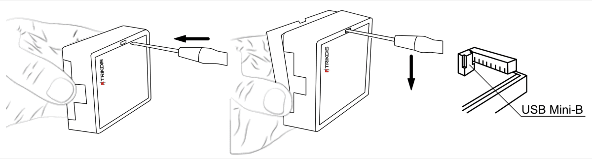
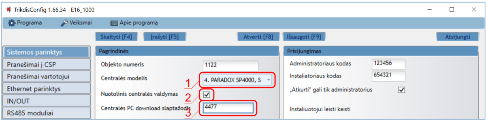
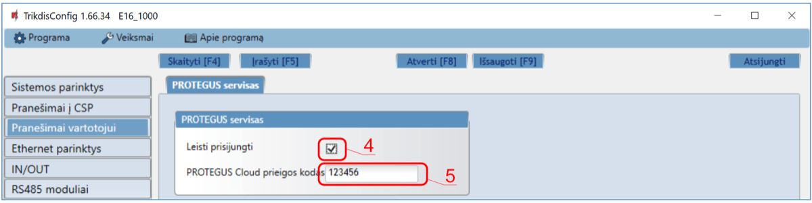
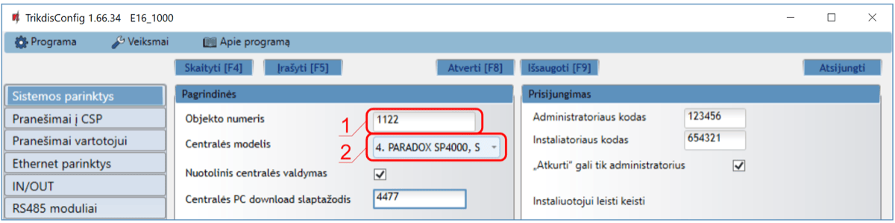
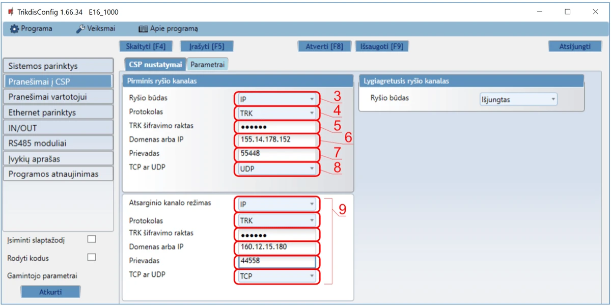

# Interlogix NX-8v2 su E16 greitas paruošimas

Trumpi prijungimo ir programavimo žingsniai, skirti prijungti E16 komunikatorių prie Interlogix NX-8v2 centralių, sukonfigūruoti E16 IP ryšiui ir pridėti sistemą į Protegus2. Naudokite kartu su pilnu E16 vadovu kitiems nustatymams.

!!! caution "Atsargiai"
    Montavimą ir aptarnavimą gali atlikti tik kvalifikuoti specialistai. Prieš jungdami laidus atjunkite maitinimą. Neautorizuoti pakeitimai panaikina garantiją.

## Reikalavimai

- E16 komunikatorius su prijungtu LAN ir USB Mini-B kabeliu konfigūravimui.
- Interlogix NX-8v2 centralė su prieiga per klaviatūrą.
- CSP objekto numeris, jei pranešimai bus siunčiami į stebėjimo pultą.
- Protegus2 paskyra ir komunikatoriaus MAC / Unique ID.

## Greitas konfigūravimas su programa *TrikdisConfig*

1. Parsisiųskite **TrikdisConfig** iš [www.trikdis.com](http://www.trikdis.com) ir ją įdiekite.
2. Plokščiu atsuktuvu atidarykite E16 korpusą.

3. Su USB Mini-B kabeliu prijunkite E16 prie kompiuterio.
4. Paleiskite **TrikdisConfig**. Programa atpažins komunikatorių ir atidarys konfigūravimo langą.
5. Paspauskite **Skaityti [F4]**, kad įkeltumėte esamus nustatymus. Jei reikia, įveskite administratoriaus arba instaliuotojo 6 skaitmenų kodą.

Atlikite tą poskyrį, kuris atitinka diegimą:

- **Protegus2 programėlė** jei sistema bus valdoma nuotoliniu būdu.
- **Stebėjimo pultas** jei komunikatorius siųs pranešimus į CSP.
- Atlikite abu poskyrius, jei komunikatorius turi veikti ir su CSP, ir su Protegus2.

### Nustatymai ryšiui su Protegus2 programėle

**Lange "Sistemos parinktys":**

1. Pasirinkite **Centralės modelį**, kuris bus prijungtas prie komunikatoriaus.
2. Pažymėkite **Nuotolinis centralės valdymas**, jei vartotojai turi valdyti centralę per Protegus2 savo klaviatūros kodu.
3. Paradox ir Texecom centralių tiesioginiam valdymui įveskite **Centralės PC download/UDL slaptažodį**. Jis turi sutapti su centrėje nustatytu slaptažodžiu.

!!! note "Pastaba"
    Kad veiktų tiesioginis valdymas, centrinę taip pat reikia suprogramuoti, kaip nurodyta toliau esančiame centralės programavimo skyriuje.

**Lange "Pranešimai vartotojui", kortelėje "PROTEGUS servisas":**

4. Pažymėkite **Leisti prisijungti** prie Protegus serviso.
5. Pakeiskite **PROTEGUS Cloud prieigos kodą**, jei norite, kad vartotojai jį įvestų pridėdami sistemą į Protegus2.

Baigę konfigūravimą paspauskite **Įrašyti [F5]** ir atjunkite USB kabelį.

### Nustatymai ryšiui su Stebėjimo pultu

**Lange "Sistemos parinktys":**

1. Įveskite **Objekto numerį**, kurį suteikė stebėjimo pultas.
2. Pasirinkite **Centralės modelį**, kuris bus prijungtas prie komunikatoriaus.

**Lange "Pranešimai į CSP", parinkčių grupėje "Pirminis ryšio kanalas":**

3. Nustatykite **Ryšio būdą** į **IP**.
4. Pasirinkite imtuvui reikalingą protokolą: **TRK**, **DC-09_2007**, **DC-09_2012** arba **TL150**.
5. Jei pasirinktasis protokolas to reikalauja, įveskite imtuvo šifravimo raktą.
6. Įveskite imtuvo **Domeną arba IP** ir **Prievadą**.
7. Pasirinkite **TCP** arba **UDP**.
8. Jei reikia, sukonfigūruokite atsarginį ir lygiagretų ryšio kanalus.

!!! note "Pastaba"
    Jei pasirinkote **DC-09** protokolą, lange **Pranešimai į CSP** skirtuke **Parametrai** papildomai įveskite objekto, linijos ir imtuvo numerius.

Baigę konfigūravimą paspauskite **Įrašyti [F5]** ir atjunkite USB kabelį.

## Pajungimas

Prijunkite centralę prie E16, kaip parodyta žemiau:

| E16 gnybtas | Interlogix centralė | Pastabos |
| --- | --- | --- |
| `+DC` | `POS` | Centralės maitinimas |
| `-DC` | `COM` | Centralės žemė |
| `DATA` | `DATA` | Klaviatūros magistralės duomenys |

## Apsaugos centralės programavimas

### Centralės programavimas LCD klaviatūra

Naudodami centralės klaviatūrą įveskite žemiau nurodytas sekcijas ir nustatykite jas taip, kaip nurodyta:

| LCD klaviatūra | Klaviatūros įvedimas | Veiksmo aprašymas |
| --- | --- | --- |
| System ready | `*89713` | Įeiti į programavimo režimą |
| Enter device address | `0#` | Pereiti į pagrindinį centralės programavimo meniu |
| Enter location | `4#` | Pereiti į **Phone1 events reported** |
| Loc#4 Seg#1 | `12345678*` | Įjungti visas perjungiamas parinktis ir išsaugoti |
| Loc#4 Seg#2 | `12345678*` | Įjungti visas perjungiamas parinktis ir išsaugoti |
| Enter location | `23#` | Pereiti į **Partition features** |
| Loc#23 Seg#1 | `**` | Pereiti į 3 segmentą |
| Loc#23 Seg#3 | `12345678*#` | Įjungti visas perjungiamas parinktis ir išsaugoti |
| Enter location | `37#` | Pereiti į **Siren and system supervision** |
| Loc#37 Seg#1 | `**` | Pereiti į 3 segmentą |
| Loc#37 Seg#3 | `12345678*` | Įjungti visas perjungiamas parinktis ir išsaugoti |
| Loc#37 Seg#4 | `12345678*#` | Įjungti visas perjungiamas parinktis ir išsaugoti |
| Enter location | `90#` | Pereiti į **Partition 2 features** |
| Loc#90 Seg#1 | `**` | Pereiti į 3 segmentą |
| Loc#90 Seg#3 | `12345678*#` | Įjungti visas perjungiamas parinktis ir išsaugoti |
| Enter location | `93#` | Pereiti į **Partition 3 features** |
| Loc#93 Seg#1 | `**` | Pereiti į 3 segmentą |
| Loc#93 Seg#3 | `12345678*#` | Įjungti visas perjungiamas parinktis ir išsaugoti |
| Enter location | `96#` | Pereiti į **Partition 4 features** |
| Loc#96 Seg#1 | `**` | Pereiti į 3 segmentą |
| Loc#96 Seg#3 | `12345678*#` | Įjungti visas perjungiamas parinktis ir išsaugoti |
| Enter location | `99#` | Pereiti į **Partition 5 features** |
| Loc#99 Seg#1 | `**` | Pereiti į 3 segmentą |
| Loc#99 Seg#3 | `12345678*#` | Įjungti visas perjungiamas parinktis ir išsaugoti |
| Enter location | `102#` | Pereiti į **Partition 6 features** |
| Loc#102 Seg#1 | `**` | Pereiti į 3 segmentą |
| Loc#102 Seg#3 | `12345678*#` | Įjungti visas perjungiamas parinktis ir išsaugoti |
| Enter location | `105#` | Pereiti į **Partition 7 features** |
| Loc#105 Seg#1 | `**` | Pereiti į 3 segmentą |
| Loc#105 Seg#3 | `12345678*#` | Įjungti visas perjungiamas parinktis ir išsaugoti |
| Enter location | `108#` | Pereiti į **Partition 8 features** |
| Loc#108 Seg#1 | `**` | Pereiti į 3 segmentą |
| Loc#108 Seg#3 | `12345678*#` | Įjungti visas perjungiamas parinktis ir išsaugoti |
| Enter location | `EXIT EXIT` | Išeiti iš programavimo režimo |

### Centralės programavimas LED klaviatūra

Naudokite tas pačias vietas ir reikšmes, kaip nurodyta aukščiau:

| LED klaviatūros būsena | Klaviatūros įvedimas | Veiksmo aprašymas |
| --- | --- | --- |
| Ready ir Power LED šviečia | `*89713` | Įeiti į programavimo režimą |
| Service LED mirksi | `0#` | Pereiti į pagrindinį centralės programavimo meniu |
| Service LED mirksi, Armed LED šviečia | `4#` | Pereiti į **Phone1 events reported** |
| Visi zonų LED šviečia | `12345678*` | Įjungti visas perjungiamas parinktis ir išsaugoti |
| Visi zonų LED šviečia | `12345678*` | Įjungti visas perjungiamas parinktis ir išsaugoti |
| Service LED mirksi, Armed LED šviečia | `23#` | Pereiti į **Partition features** |
| Service LED mirksi, Ready LED šviečia | `**` | Pereiti į 3 segmentą |
| Service LED mirksi, Ready LED šviečia | `12345678*#` | Įjungti visas perjungiamas parinktis ir išsaugoti |
| Service LED mirksi, Armed LED šviečia | `37#` | Pereiti į **Siren and system supervision** |
| Service LED mirksi, Ready LED šviečia | `**` | Pereiti į 3 segmentą |
| Service LED mirksi, Ready LED šviečia | `12345678*` | Įjungti visas perjungiamas parinktis ir išsaugoti |
| Service LED mirksi, Ready LED šviečia | `12345678*#` | Įjungti visas perjungiamas parinktis ir išsaugoti |
| Service LED mirksi, Armed LED šviečia | `90#` | Pereiti į **Partition 2 features** |
| Service LED mirksi, Ready LED šviečia | `**` | Pereiti į 3 segmentą |
| Service LED mirksi, Ready LED šviečia | `12345678*#` | Įjungti visas perjungiamas parinktis ir išsaugoti |
| Service LED mirksi, Armed LED šviečia | `93#` | Pereiti į **Partition 3 features** |
| Service LED mirksi, Ready LED šviečia | `**` | Pereiti į 3 segmentą |
| Service LED mirksi, Ready LED šviečia | `12345678*#` | Įjungti visas perjungiamas parinktis ir išsaugoti |
| Service LED mirksi, Armed LED šviečia | `96#` | Pereiti į **Partition 4 features** |
| Service LED mirksi, Ready LED šviečia | `**` | Pereiti į 3 segmentą |
| Service LED mirksi, Ready LED šviečia | `12345678*#` | Įjungti visas perjungiamas parinktis ir išsaugoti |
| Service LED mirksi, Armed LED šviečia | `99#` | Pereiti į **Partition 5 features** |
| Service LED mirksi, Ready LED šviečia | `**` | Pereiti į 3 segmentą |
| Service LED mirksi, Ready LED šviečia | `12345678*#` | Įjungti visas perjungiamas parinktis ir išsaugoti |
| Service LED mirksi, Armed LED šviečia | `102#` | Pereiti į **Partition 6 features** |
| Service LED mirksi, Ready LED šviečia | `**` | Pereiti į 3 segmentą |
| Service LED mirksi, Ready LED šviečia | `12345678*#` | Įjungti visas perjungiamas parinktis ir išsaugoti |
| Service LED mirksi, Armed LED šviečia | `105#` | Pereiti į **Partition 7 features** |
| Service LED mirksi, Ready LED šviečia | `**` | Pereiti į 3 segmentą |
| Service LED mirksi, Ready LED šviečia | `12345678*#` | Įjungti visas perjungiamas parinktis ir išsaugoti |
| Service LED mirksi, Armed LED šviečia | `108#` | Pereiti į **Partition 8 features** |
| Service LED mirksi, Ready LED šviečia | `**` | Pereiti į 3 segmentą |
| Service LED mirksi, Ready LED šviečia | `12345678*#` | Įjungti visas perjungiamas parinktis ir išsaugoti |
| Service LED mirksi, Armed LED šviečia | `EXIT EXIT` | Išeiti iš programavimo režimo |

## Sistemos pridėjimas į Protegus2

1. Atidarykite [Protegus2](https://www.protegus.app) ir paspauskite **Pridėti naują sistemą**.
1. Įveskite E16 **MAC / Unique ID**.
1. Įveskite sistemos pavadinimą ir užbaikite vedlį.
1. Jei vietoje tiesioginio valdymo naudojate raktinę zoną, prijunkite `I/O 1` prie centralės raktinės zonos ir Protegus2 sukonfigūruokite `PGM1`.
1. Palaukite, kol sistema bus rodoma kaip prisijungusi.

## Sistemos tikrinimas

1. Įjunkite ir išjunkite sistemą klaviatūra.
1. Sukelkite bandomą pavojaus signalą, kai sistema įjungta.
1. Patikrinkite, kad įvykiai pasiektų stebėjimo pultą ir Protegus2.
