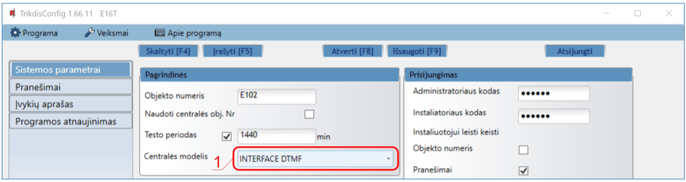
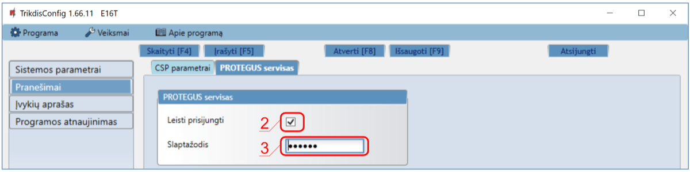
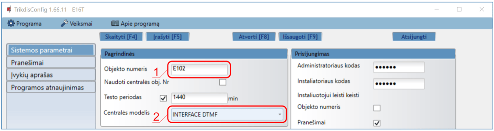
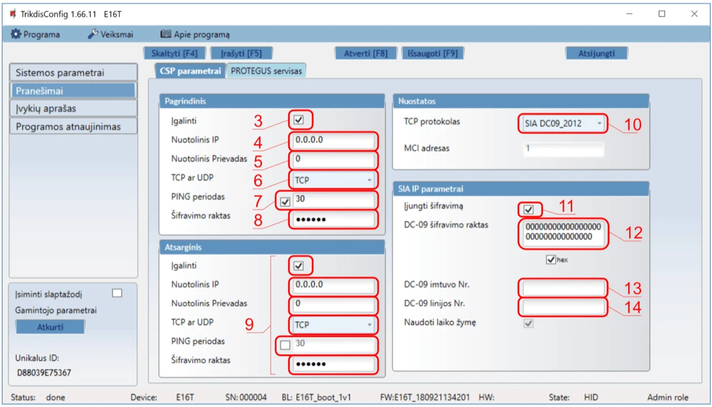
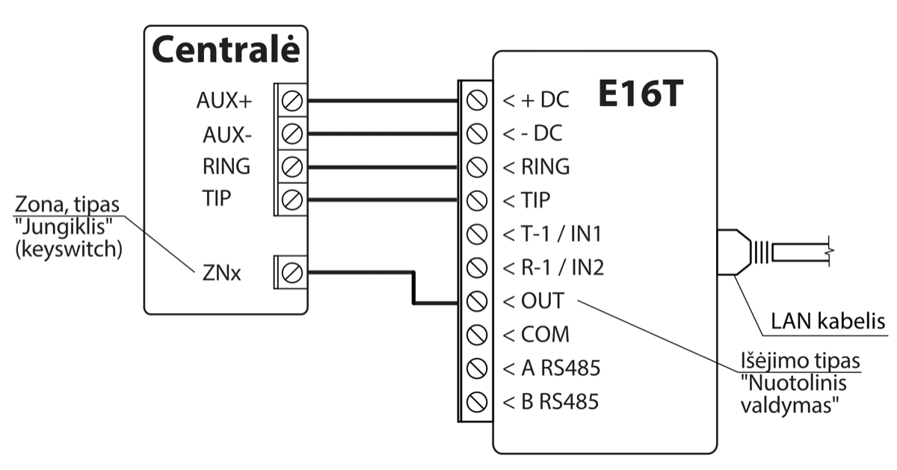

# E16T greitas paruošimas

Trumpi žingsniai, skirti prijungti E16T komunikatorių prie apsaugos centralės telefoninio komunikatoriaus, sukonfigūruoti IP ryšį ir pridėti sistemą į Protegus. Naudokite kartu su pilnu E16T vadovu kitiems nustatymams.

!!! caution "Atsargiai"
    Montavimą ir aptarnavimą gali atlikti tik kvalifikuoti specialistai. Prieš jungdami laidus atjunkite maitinimą. Neautorizuoti pakeitimai panaikina garantiją.

## Reikalavimai

- E16T komunikatorius su prijungtu LAN ir USB Mini-B kabeliu konfigūravimui.
- Apsaugos centralė su telefoniniu komunikatoriumi, palaikančiu Contact ID per DTMF tonus.
- Instaliuotojo / klaviatūros prieiga prie centralės.
- CSP paskyros numeris, jei pranešimai bus siunčiami į stebėjimo pultą.
- Protegus paskyra ir komunikatoriaus MAC / Unique ID.

## Greitas konfigūravimas su programa *TrikdisConfig*

1. Parsisiųskite **TrikdisConfig** iš [www.trikdis.com](http://www.trikdis.com) ir ją įdiekite.
2. Plokščiu atsuktuvu atidarykite E16T korpusą.

3. Su USB Mini-B kabeliu prijunkite E16T prie kompiuterio.
4. Paleiskite **TrikdisConfig**. Programa atpažins komunikatorių ir atidarys konfigūravimo langą.
5. Paspauskite **Skaityti [F4]**, kad įkeltumėte esamus nustatymus. Jei reikia, įveskite administratoriaus arba instaliuotojo 6 skaitmenų kodą.

Atlikite tą poskyrį, kuris atitinka diegimą:

- **Protegus programėlė** jei vartotojai valdys sistemą nuotoliniu būdu.
- **Stebėjimo pultas** jei komunikatorius siųs pranešimus į CSP.
- Atlikite abu poskyrius, jei komunikatorius turi veikti ir su CSP, ir su Protegus.

### Nustatymai ryšiui su Protegus programėle

**Lange "Sistemos parametrai":**

1. Pasirinkite **Centralės modelį**, kuris bus prijungtas prie komunikatoriaus.

**Lange "Pranešimai", kortelėje "Protegus servisas":**

2. Pažymėkite **Leisti prisijungti** Protegus serviso nustatymuose.
3. Pakeiskite **Serviso kodą**, jei norite, kad vartotojai jį įvestų pridėdami sistemą į Protegus.

Baigę konfigūravimą paspauskite **Įrašyti [F5]** ir atjunkite USB kabelį.

### Nustatymai ryšiui su Stebėjimo pultu

**Lange "Sistemos parametrai":**

1. Įveskite **Objekto numerį**, kurį suteikė stebėjimo pultas.
2. Pasirinkite **Centralės modelį**, kuris bus prijungtas prie komunikatoriaus.

**Lange "Pranešimai", parinkčių grupėje "Pagrindinis" ryšio kanalas:**

3. Įjunkite pagrindinį ryšio kanalą.
4. Įveskite imtuvo **Nuotolinį IP / domeną** ir **Nuotolinį prievadą**.
5. Pasirinkite **TCP** arba **UDP**.
6. Nustatykite **PING periodą** ir įveskite imtuvo reikalaujamą šifravimo raktą.
7. Jei reikia, sukonfigūruokite **Atsarginio** kanalo nustatymus.
8. Pasirinkite imtuvui reikalingą TCP protokolą: **TRK**, **DC-09_2007** arba **DC-09_2012**.
9. Jei naudojate **DC-09_2012**, papildomai nustatykite šifravimą bei imtuvo ir linijos numerius.

**Lange "Pranešimai", kortelėje "Protegus servisas":**

10. Pažymėkite **Leisti prisijungti** prie Protegus, jei vartotojai naudos programėlę.
11. Pakeiskite **Serviso kodą**, jei norite, kad vartotojai jį įvestų pridėdami sistemą į Protegus.

!!! note "Pastaba"
    Jei pasirinkote **DC-09** protokolą, lange **Pranešimai** skirtuke **Parametrai** papildomai įveskite objekto, linijos ir imtuvo numerius.

Baigę konfigūravimą paspauskite **Įrašyti [F5]** ir atjunkite USB kabelį.

## Pajungimas

Prijunkite E16T prie centralės maitinimo, `TIP` / `RING` ir LAN, kaip parodyta žemiau:

Jei centralė bus įjungiama ar išjungiama per raktinės zonos išėjimą, tame pačiame brėžinyje parodytu būdu prijunkite centralės raktinę zoną prie `OUT`.

## Apsaugos centralės programavimas

Telefoninį apsaugos centralės komunikatorių suprogramuokite taip:

1. Įjunkite centralės telefoninį komunikatorių.
2. Jei E16T prijungtas tiesiai prie `TIP` / `RING`, įveskite bet kokį bent 2 skaitmenų telefono numerį.
3. Pasirinkite `DTMF` rinkimo režimą.
4. Pasirinkite `Contact ID` ryšio formatą.
5. Įveskite 4 skaitmenų centralės objekto numerį.

## Specialieji Honeywell Vista 48 nustatymai

Jei prijungta centralė yra Honeywell Vista 48, nustatykite šias reikšmes:

| Skyrius | Duomenys | Skyrius | Duomenys | Skyrius | Duomenys |
| --- | --- | --- | --- | --- | --- |
| `*41` | `1111` | `*60` | `1` | `*69` | `1` |
| `*42` | `1111` | `*61` | `1` | `*70` | `1` |
| `*43` | `1234` | `*62` | `1` | `*71` | `1` |
| `*44` | `1234` | `*63` | `1` | `*72` | `1` |
| `*45` | `1111` | `*64` | `1` | `*73` | `1` |
| `*47` | `1` | `*65` | `1` | `*74` | `1` |
| `*48` | `7` | `*66` | `1` | `*75` | `1` |
| `*50` | `1` | `*67` | `1` | `*76` | `1` |
| `*59` | `0` | `*68` | `1` |  |  |

Išeikite iš programavimo režimo komanda `*99`.

## Sistemos pridėjimas į Protegus

1. Atidarykite [Protegus](https://www.protegus.app) ir paspauskite **Pridėti naują sistemą**.
1. Įveskite E16T **MAC / Unique ID**.
1. Įveskite sistemos pavadinimą ir užbaikite vedlį.
1. Jei `OUT` prijungėte prie raktinės zonos, Protegus lange **Settings** įjunkite **Arm/Disarm with PGM Output 1**.
1. Pasirinkite **Pulse** arba **Level** režimą, kad jis atitiktų centralės raktinės zonos tipą.

## Sistemos tikrinimas

1. Įjunkite ir išjunkite sistemą klaviatūra.
1. Sukelkite bandomą pavojaus signalą, kai sistema įjungta.
1. Patikrinkite, kad įvykiai pasiektų stebėjimo pultą ir Protegus.
